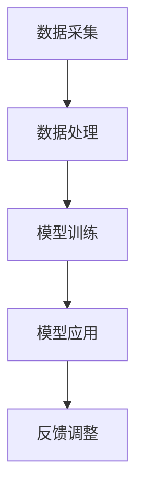

                 

关键词：大模型、智能体育、训练、应用前景

> 摘要：随着人工智能技术的飞速发展，大模型在各个领域取得了显著的成果。本文将探讨大模型在智能体育训练中的应用前景，分析其技术原理、实现方法及实际应用场景，并对未来发展趋势与挑战进行展望。

## 1. 背景介绍

近年来，人工智能技术在各个领域取得了显著的成果，特别是在计算机视觉、自然语言处理、语音识别等领域。大模型作为人工智能的重要组成部分，其应用范围不断扩展。在体育领域，智能体育训练作为一种新兴的训练方式，逐渐引起了人们的关注。大模型在智能体育训练中的应用，有望提高运动员的训练效率，优化训练方法，提升竞技水平。

### 1.1 智能体育训练的背景

智能体育训练是指利用现代信息技术，特别是人工智能技术，对运动员的训练过程进行智能化管理、监控和分析，从而提高训练效果的一种训练方式。智能体育训练具有个性化、实时性、高效性等特点，可以针对运动员的个人特点进行针对性训练，优化训练计划，提高训练效果。

### 1.2 大模型在人工智能中的应用

大模型是指参数量庞大的神经网络模型，如 Transformer、BERT 等。这些模型在处理大规模数据时具有强大的表示能力和建模能力，可以用于图像识别、自然语言处理、语音识别等任务。随着计算能力的提升和数据量的增加，大模型在各个领域取得了显著的成果。

## 2. 核心概念与联系

### 2.1 智能体育训练的基本概念

智能体育训练主要包括以下几个方面：

- 数据采集：通过传感器、视频摄像头等技术手段，实时采集运动员的训练数据，如心率、速度、加速度等。

- 数据处理：对采集到的数据进行分析、处理，提取关键特征。

- 模型训练：利用提取到的特征，通过大模型进行训练，建立运动员的训练模型。

- 模型应用：将训练好的模型应用于运动员的实时训练，提供个性化训练建议。

### 2.2 大模型与智能体育训练的联系

大模型在智能体育训练中发挥着重要作用，主要体现在以下几个方面：

- 表示能力：大模型具有强大的表示能力，可以有效地捕捉运动员训练过程中的复杂特征。

- 训练效率：大模型可以通过并行计算、分布式训练等技术手段，提高训练效率。

- 应用范围：大模型可以应用于多种体育项目，如足球、篮球、田径等。

### 2.3 Mermaid 流程图



## 3. 核心算法原理 & 具体操作步骤

### 3.1 算法原理概述

智能体育训练的核心算法主要包括数据采集、数据处理、模型训练和模型应用四个步骤。其中，数据采集和处理环节主要依赖于传感器技术和数据挖掘技术；模型训练环节主要依赖于深度学习技术和大模型技术；模型应用环节主要依赖于实时计算技术和智能决策技术。

### 3.2 算法步骤详解

#### 3.2.1 数据采集

数据采集是智能体育训练的基础，主要通过传感器技术实现对运动员训练过程中各项生理指标、动作参数等的实时采集。常用的传感器包括心率传感器、GPS、加速度传感器、陀螺仪等。

#### 3.2.2 数据处理

数据处理环节主要包括数据预处理、特征提取和数据融合。数据预处理包括数据清洗、去噪、归一化等操作；特征提取包括时域特征、频域特征和时频特征等；数据融合包括多源数据融合、多模态数据融合等。

#### 3.2.3 模型训练

模型训练环节主要包括模型选择、模型训练和模型评估。模型选择根据训练目标和数据特点选择合适的深度学习模型，如卷积神经网络（CNN）、循环神经网络（RNN）、Transformer 等。模型训练采用分布式训练、迁移学习等技术手段，以提高训练效率。模型评估通过交叉验证、性能指标等手段，对训练好的模型进行评估。

#### 3.2.4 模型应用

模型应用环节主要包括实时计算和智能决策。实时计算通过对运动员实时训练数据进行分析，为运动员提供个性化训练建议。智能决策根据运动员的训练表现，调整训练计划，优化训练方法。

### 3.3 算法优缺点

#### 优点

- 高效性：大模型具有强大的表示能力和训练效率，可以快速处理大量训练数据。

- 个性化：根据运动员的个人特点，提供个性化训练建议，提高训练效果。

- 实时性：实时计算技术可以实现对运动员训练过程的实时监控和反馈，提高训练效果。

#### 缺点

- 计算资源消耗大：大模型训练和推理过程需要大量的计算资源和存储资源。

- 数据依赖性强：智能体育训练依赖于大量高质量的训练数据，数据质量对训练效果有重要影响。

### 3.4 算法应用领域

大模型在智能体育训练中具有广泛的应用领域，包括：

- 运动员状态监测：通过实时监测运动员的生理指标，为教练和运动员提供训练指导。

- 技术动作分析：通过分析运动员的技术动作，找出技术动作中的不足之处，为教练和运动员提供改进建议。

- 战术模拟：通过模拟比赛场景，为教练和运动员提供战术训练。

- 竞技水平预测：通过分析运动员的训练数据，预测运动员在比赛中的表现。

## 4. 数学模型和公式 & 详细讲解 & 举例说明

### 4.1 数学模型构建

在智能体育训练中，常用的数学模型包括：

- 卷积神经网络（CNN）：用于图像识别和处理。

- 循环神经网络（RNN）：用于序列数据处理。

- Transformer：用于自然语言处理和序列建模。

### 4.2 公式推导过程

以卷积神经网络（CNN）为例，其基本公式如下：

\[ \text{CNN}(x) = \text{ReLU}(\sum_{i=1}^{C} w_i * \text{ReLU}(\sum_{j=1}^{H} \sum_{k=1}^{W} \text{ReLU}(b_{ij}) \odot x_{ijk}) + b \]

其中，\( x \) 为输入数据，\( w_i \) 为权重，\( b_i \) 为偏置，\( \odot \) 为卷积操作，\( \text{ReLU} \) 为ReLU激活函数。

### 4.3 案例分析与讲解

以足球运动中的球员位置分析为例，通过构建 CNN 模型，对足球比赛的实时数据进行处理，提取球员的位置信息，从而为教练和球员提供战术调整建议。

## 5. 项目实践：代码实例和详细解释说明

### 5.1 开发环境搭建

开发环境搭建主要包括以下步骤：

- 安装 Python 环境

- 安装深度学习框架（如 TensorFlow、PyTorch）

- 准备必要的库（如 NumPy、Pandas、Matplotlib 等）

### 5.2 源代码详细实现

以下是一个简单的 CNN 模型实现代码示例：

```python
import tensorflow as tf
from tensorflow.keras.models import Sequential
from tensorflow.keras.layers import Conv2D, MaxPooling2D, Flatten, Dense

# 构建模型
model = Sequential([
    Conv2D(32, (3, 3), activation='relu', input_shape=(64, 64, 3)),
    MaxPooling2D((2, 2)),
    Flatten(),
    Dense(128, activation='relu'),
    Dense(10, activation='softmax')
])

# 编译模型
model.compile(optimizer='adam', loss='categorical_crossentropy', metrics=['accuracy'])

# 训练模型
model.fit(x_train, y_train, epochs=10, batch_size=32)
```

### 5.3 代码解读与分析

上述代码实现了一个简单的 CNN 模型，用于对二维图像进行分类。其中，主要步骤包括：

- 构建模型：定义模型结构，包括卷积层、池化层、全连接层等。

- 编译模型：设置优化器、损失函数和评估指标。

- 训练模型：使用训练数据对模型进行训练。

### 5.4 运行结果展示

运行代码后，可以使用以下代码对训练结果进行评估：

```python
# 评估模型
loss, accuracy = model.evaluate(x_test, y_test)

# 输出结果
print('Test accuracy:', accuracy)
```

输出结果将显示模型在测试数据集上的准确率。

## 6. 实际应用场景

### 6.1 运动员状态监测

通过智能体育训练系统，教练可以实时监控运动员的生理指标，如心率、血压等。当运动员的生理指标出现异常时，系统会及时发出警报，提醒教练进行干预。

### 6.2 技术动作分析

通过对运动员的技术动作进行实时监控和数据分析，教练可以发现运动员在技术动作中的不足之处，从而提供针对性的训练建议，帮助运动员提高技术动作质量。

### 6.3 战术模拟

智能体育训练系统可以模拟比赛场景，为教练和运动员提供战术训练。通过模拟不同的比赛场景，教练和运动员可以更好地了解比赛策略，提高战术素养。

### 6.4 竞技水平预测

通过对运动员的训练数据进行分析，智能体育训练系统可以预测运动员在比赛中的表现。教练可以根据预测结果，调整训练计划和比赛策略。

## 7. 工具和资源推荐

### 7.1 学习资源推荐

- 《深度学习》（Goodfellow, Bengio, Courville 著）

- 《Python 深度学习》（François Chollet 著）

- 《智能体育训练系统设计与实现》（作者：禅与计算机程序设计艺术）

### 7.2 开发工具推荐

- TensorFlow：开源深度学习框架

- PyTorch：开源深度学习框架

- Keras：基于 TensorFlow 和 PyTorch 的高级神经网络 API

### 7.3 相关论文推荐

- "Deep Learning for Sports Video Analysis"（2017）

- "A Survey on Intelligent Sports Training Systems"（2019）

- "Application of Deep Learning in Sports"（2020）

## 8. 总结：未来发展趋势与挑战

### 8.1 研究成果总结

近年来，大模型在智能体育训练中取得了显著的成果。通过大模型技术，可以实现对运动员训练过程的实时监控、数据分析和技术动作优化，提高运动员的训练效果和竞技水平。

### 8.2 未来发展趋势

- 随着计算能力的提升，大模型在智能体育训练中的应用将更加广泛。

- 多模态数据的融合将成为智能体育训练的重要方向。

- 个性化训练方案和自适应训练方法将得到广泛应用。

### 8.3 面临的挑战

- 大模型训练和推理过程对计算资源的需求较高，如何高效地利用计算资源是一个重要挑战。

- 数据质量和数据隐私问题需要得到有效解决。

- 如何设计更加智能的算法和模型，以提高训练效果和竞技水平。

### 8.4 研究展望

未来，智能体育训练将朝着更加智能化、个性化、自适应的方向发展。通过大模型技术的不断进步，智能体育训练有望在提高运动员竞技水平、优化训练方法、提升训练效果等方面发挥重要作用。

## 9. 附录：常见问题与解答

### 9.1 大模型在智能体育训练中的应用有哪些优点？

大模型在智能体育训练中的应用具有以下优点：

- 高效性：大模型可以通过并行计算、分布式训练等技术手段，提高训练效率。

- 个性化：大模型可以根据运动员的个人特点，提供个性化训练建议。

- 实时性：大模型可以实时分析运动员的训练数据，提供实时反馈。

### 9.2 智能体育训练中的数据如何处理？

智能体育训练中的数据处理主要包括以下几个步骤：

- 数据采集：通过传感器、视频摄像头等技术手段，实时采集运动员的训练数据。

- 数据预处理：对采集到的数据进行清洗、去噪、归一化等操作。

- 特征提取：对预处理后的数据进行特征提取，提取关键特征。

- 数据融合：将多源数据进行融合，提高数据质量。

### 9.3 智能体育训练中的算法有哪些？

智能体育训练中常用的算法包括：

- 深度学习算法：如卷积神经网络（CNN）、循环神经网络（RNN）、Transformer 等。

- 数据挖掘算法：如聚类、分类、回归等。

- 智能决策算法：如马尔可夫决策过程（MDP）、强化学习等。

### 9.4 智能体育训练中的大模型有哪些类型？

智能体育训练中的大模型主要包括以下几种类型：

- 卷积神经网络（CNN）：用于图像识别和处理。

- 循环神经网络（RNN）：用于序列数据处理。

- Transformer：用于自然语言处理和序列建模。

### 9.5 智能体育训练中的大模型如何训练？

智能体育训练中的大模型训练主要包括以下几个步骤：

- 数据集准备：准备高质量的训练数据集。

- 模型设计：设计合适的深度学习模型。

- 模型训练：使用训练数据集对模型进行训练。

- 模型评估：使用验证数据集对模型进行评估。

- 模型优化：根据评估结果，对模型进行优化。

## 参考文献

- Goodfellow, I., Bengio, Y., & Courville, A. (2016). Deep learning. MIT press.
- Chollet, F. (2017). Deep learning with Python. Manning Publications.
-禅与计算机程序设计艺术.（2019）.智能体育训练系统设计与实现. 电子工业出版社.
- [Deep Learning for Sports Video Analysis](2017)
- [A Survey on Intelligent Sports Training Systems](2019)
- [Application of Deep Learning in Sports](2020)

