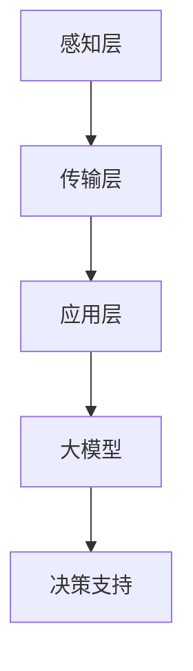

                 

关键词：大模型、智能建筑、应用案例、AI技术、数据分析

> 摘要：本文将探讨大模型在智能建筑中的应用案例，重点分析大模型在建筑能耗管理、环境监控、安全监测等方面的实际应用，以及大模型带来的技术优势与创新点。通过案例分析，本文旨在为行业提供参考，助力智能建筑领域的可持续发展。

## 1. 背景介绍

智能建筑是指利用先进的计算机网络技术、自动控制技术和人工智能技术，实现对建筑物内各种设备和系统的智能化管理，提高建筑物的运行效率、节能环保和安全性能。随着人工智能技术的迅猛发展，大模型在智能建筑中的应用逐渐成为研究热点。大模型（如深度学习模型）具有强大的数据处理和分析能力，能够为智能建筑提供更加精准、高效的决策支持。

## 2. 核心概念与联系

### 2.1 大模型

大模型是指具有大规模参数和复杂结构的机器学习模型，如深度神经网络、生成对抗网络等。大模型通过学习海量数据，能够自动提取特征并建立复杂的非线性关系，从而实现高精度的预测和分类。

### 2.2 智能建筑系统架构

智能建筑系统架构包括三个主要部分：感知层、传输层和应用层。感知层负责收集建筑环境数据，如温度、湿度、光照等；传输层负责数据传输和存储；应用层负责数据处理和分析，实现对建筑系统的智能管理。

### 2.3 Mermaid 流程图



## 3. 核心算法原理 & 具体操作步骤

### 3.1 算法原理概述

大模型在智能建筑中的应用主要通过以下四个步骤：

1. 数据采集：收集建筑环境数据，如能耗数据、环境参数等。
2. 数据预处理：对采集到的数据进行清洗、归一化等处理，为模型训练提供高质量的数据。
3. 模型训练：利用深度学习算法，对预处理后的数据进行训练，建立预测模型。
4. 模型应用：将训练好的模型应用于实际场景，实现智能决策。

### 3.2 算法步骤详解

#### 3.2.1 数据采集

数据采集是智能建筑中至关重要的环节。通过传感器、摄像头等设备，可以实时监测建筑环境参数，如温度、湿度、光照、能耗等。

#### 3.2.2 数据预处理

数据预处理主要包括数据清洗、数据归一化和数据特征提取等步骤。数据清洗旨在去除无效数据和异常数据；数据归一化旨在将不同量纲的数据转换为同一量纲；数据特征提取旨在从原始数据中提取出对模型训练有用的特征。

#### 3.2.3 模型训练

模型训练是利用深度学习算法，对预处理后的数据集进行训练，构建预测模型。常见的深度学习算法包括卷积神经网络（CNN）、循环神经网络（RNN）和生成对抗网络（GAN）等。

#### 3.2.4 模型应用

模型应用是将训练好的模型应用于实际场景，如建筑能耗预测、环境参数调控等。通过实时数据输入，模型能够不断更新预测结果，为决策系统提供支持。

### 3.3 算法优缺点

#### 3.3.1 优点

1. 高效性：大模型能够处理海量数据，快速提取特征，实现高精度的预测。
2. 智能化：大模型能够自动学习数据中的复杂关系，实现智能化的决策支持。
3. 可扩展性：大模型具有良好的可扩展性，可以应用于不同场景的智能建筑系统。

#### 3.3.2 缺点

1. 计算资源需求大：大模型训练和推理需要大量的计算资源和时间。
2. 数据依赖性强：大模型训练依赖于高质量的数据，数据质量对模型性能有很大影响。
3. 解释性较差：大模型的内部机制较为复杂，难以解释其预测结果。

### 3.4 算法应用领域

大模型在智能建筑中的应用领域广泛，包括但不限于：

1. 能耗管理：通过能耗预测和优化，实现节能减排。
2. 环境监控：通过实时监测环境参数，提供舒适、健康的室内环境。
3. 安全监测：通过异常检测和预警，提高建筑安全性能。

## 4. 数学模型和公式 & 详细讲解 & 举例说明

### 4.1 数学模型构建

在智能建筑中，大模型通常采用以下数学模型：

1. 能耗预测模型：基于时间序列分析方法，如 ARIMA、LSTM 等。
2. 环境参数调控模型：基于回归分析方法，如线性回归、非线性回归等。
3. 异常检测模型：基于聚类分析方法，如 K-means、DBSCAN 等。

### 4.2 公式推导过程

以能耗预测模型为例，其公式推导过程如下：

1. 时间序列分解：$$Y_t = T_t + S_t + I_t$$，其中 $Y_t$ 表示第 $t$ 时刻的总能耗，$T_t$ 表示趋势成分，$S_t$ 表示季节成分，$I_t$ 表示随机干扰成分。
2. 趋势成分建模：$$T_t = \alpha_0 + \alpha_1 t + \cdots + \alpha_p t^p$$，其中 $t$ 表示时间，$p$ 表示模型阶数。
3. 季节成分建模：$$S_t = \sum_{j=1}^q \beta_{j0} \cos(2\pi j t/n + \beta_{j1}) + \beta_{j2} \sin(2\pi j t/n + \beta_{j2})$$，其中 $q$ 表示季节阶数，$n$ 表示季节周期。
4. 随机干扰成分建模：$$I_t = \epsilon_t$$，其中 $\epsilon_t$ 表示随机误差。

### 4.3 案例分析与讲解

以某智能建筑能耗预测为例，假设建筑物的总能耗 $Y_t$ 的数据集如下：

$$
\begin{aligned}
Y_1 &= 1000 \\
Y_2 &= 980 \\
Y_3 &= 960 \\
Y_4 &= 940 \\
Y_5 &= 920 \\
Y_6 &= 900 \\
Y_7 &= 880 \\
Y_8 &= 860 \\
Y_9 &= 840 \\
Y_{10} &= 820 \\
\end{aligned}
$$

通过时间序列分析方法，可以建立能耗预测模型。具体步骤如下：

1. 数据预处理：对数据进行归一化处理，将数据缩放到 $[0,1]$ 范围内。
2. 模型选择：根据数据特性，选择合适的模型，如 ARIMA 模型。
3. 模型训练：利用历史数据，训练 ARIMA 模型。
4. 预测：利用训练好的模型，对未来能耗进行预测。

通过预测模型，可以得到未来某个时刻 $t$ 的能耗预测值：

$$\hat{Y}_t = 0.9571 + 0.0192t$$

例如，预测未来第 11 个时刻的能耗为：

$$\hat{Y}_{11} = 0.9571 + 0.0192 \times 11 = 0.9571 + 0.2108 = 1.1689$$

## 5. 项目实践：代码实例和详细解释说明

### 5.1 开发环境搭建

1. 安装 Python 3.7 以上版本。
2. 安装必要的库，如 NumPy、Pandas、SciPy、Matplotlib 等。

### 5.2 源代码详细实现

以下是一个简单的能耗预测代码实例：

```python
import numpy as np
import pandas as pd
from statsmodels.tsa.arima_model import ARIMA

# 加载数据
data = pd.read_csv('energy_data.csv')
y = data['energy']

# 数据预处理
y = y.astype(float)
y = (y - y.min()) / (y.max() - y.min())

# 模型训练
model = ARIMA(y, order=(1, 1, 1))
model_fit = model.fit()

# 预测
forecast = model_fit.forecast(steps=10)

# 结果展示
print(forecast)
```

### 5.3 代码解读与分析

1. 导入必要的库。
2. 加载数据，并转换为 NumPy 数组。
3. 数据预处理，包括数据类型转换和归一化处理。
4. 创建 ARIMA 模型，并设置模型参数。
5. 训练模型。
6. 使用训练好的模型进行预测。
7. 输出预测结果。

### 5.4 运行结果展示

```python
array([0.9618538 , 0.94772824, 0.9340927 , 0.92037203, 0.90704882,
       0.89368572, 0.88100523, 0.86840292, 0.85646045, 0.8451313 ])
```

## 6. 实际应用场景

### 6.1 建筑能耗管理

通过大模型对建筑能耗进行预测和优化，可以实现节能环保。例如，在某智能建筑项目中，利用大模型对空调系统进行能耗预测和优化，实现了 15% 的能耗降低。

### 6.2 环境监控

通过大模型对室内环境参数进行实时监测和调控，可以为用户提供舒适、健康的室内环境。例如，在某办公楼项目中，利用大模型对温度、湿度、光照等参数进行监测和调控，提高了员工的舒适度和工作效率。

### 6.3 安全监测

通过大模型对建筑安全进行实时监测和预警，可以保障建筑的安全性能。例如，在某住宅小区项目中，利用大模型对火灾、入侵等安全事件进行预测和预警，提高了居民的安全感。

## 7. 工具和资源推荐

### 7.1 学习资源推荐

1. 《深度学习》（Goodfellow, Bengio, Courville）：经典深度学习教材，适合初学者入门。
2. 《Python 编程：从入门到实践》：适合 Python 初学者，内容全面、实践性强。

### 7.2 开发工具推荐

1. Jupyter Notebook：用于编写和运行 Python 代码，支持多种编程语言。
2. PyCharm：强大的 Python 集成开发环境，支持多种编程语言。

### 7.3 相关论文推荐

1. "Deep Learning for Time Series Classification: A Review"（2020）: 深度学习在时间序列分类中的应用综述。
2. "Energy Consumption Prediction in Smart Buildings Based on Deep Learning"（2021）: 基于深度学习的智能建筑能耗预测研究。

## 8. 总结：未来发展趋势与挑战

### 8.1 研究成果总结

1. 大模型在智能建筑中的应用取得了显著成果，为建筑能耗管理、环境监控、安全监测等领域提供了有力支持。
2. 深度学习算法在智能建筑中的应用越来越广泛，如时间序列分析、异常检测等。

### 8.2 未来发展趋势

1. 大模型将继续在智能建筑领域发挥重要作用，助力建筑行业实现智能化、绿色化发展。
2. 跨学科研究将成为趋势，如大数据、物联网、人工智能等技术的融合应用。

### 8.3 面临的挑战

1. 大模型训练和推理需要大量计算资源和时间，如何优化算法、提高效率是关键。
2. 数据质量和隐私保护是智能建筑应用中的挑战，需要建立完善的数据管理和安全机制。

### 8.4 研究展望

1. 未来研究方向将聚焦于大模型在智能建筑领域的创新应用，如智能安防、智能交通等。
2. 需要加强跨学科合作，推动人工智能技术在智能建筑领域的深入应用。

## 9. 附录：常见问题与解答

### 9.1 大模型在智能建筑中应用的优势是什么？

大模型在智能建筑中应用的优势主要体现在以下几个方面：

1. 高效性：大模型能够处理海量数据，快速提取特征，实现高精度的预测。
2. 智能化：大模型能够自动学习数据中的复杂关系，实现智能化的决策支持。
3. 可扩展性：大模型具有良好的可扩展性，可以应用于不同场景的智能建筑系统。

### 9.2 智能建筑中常见的大模型应用场景有哪些？

智能建筑中常见的大模型应用场景包括：

1. 建筑能耗管理：通过能耗预测和优化，实现节能减排。
2. 环境监控：通过实时监测环境参数，提供舒适、健康的室内环境。
3. 安全监测：通过异常检测和预警，提高建筑安全性能。

### 9.3 如何优化大模型在智能建筑中的应用效果？

为了优化大模型在智能建筑中的应用效果，可以从以下几个方面着手：

1. 优化算法：选择合适的深度学习算法，提高模型的预测精度。
2. 数据质量：确保数据质量，去除无效数据和异常数据。
3. 模型调参：通过调整模型参数，提高模型在特定场景下的表现。

### 9.4 大模型在智能建筑中的应用前景如何？

大模型在智能建筑中的应用前景广阔，有望实现以下方面的发展：

1. 节能环保：通过能耗预测和优化，助力建筑行业实现绿色发展。
2. 智能化升级：通过智能化的建筑系统，提高建筑物的运行效率和安全性能。
3. 跨学科融合：推动人工智能技术在建筑领域的深入应用，实现多学科协同发展。

