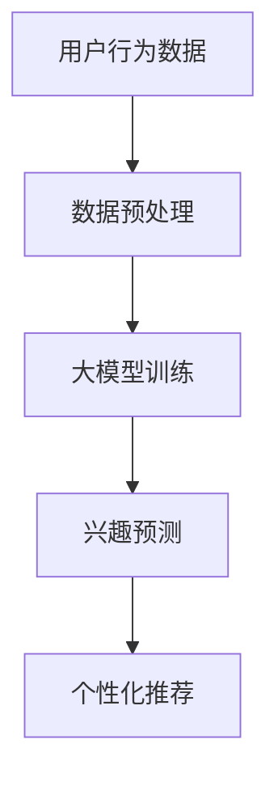

                 

关键词：大模型，用户兴趣，探索，算法，应用领域，未来展望

> 摘要：随着互联网的飞速发展，用户兴趣的探索成为了一个热门研究领域。本文将深入探讨大模型在用户兴趣探索中的应用，从背景介绍、核心概念与联系、核心算法原理、数学模型和公式、项目实践、实际应用场景以及未来展望等方面进行详细讲解。

## 1. 背景介绍

随着互联网的普及，越来越多的用户在网络上留下了大量的数据。这些数据中蕴含着丰富的用户兴趣信息。如何有效地挖掘和分析这些数据，以了解用户的真实兴趣，成为了当前研究的热点。传统的兴趣挖掘方法，如关键词提取、文本分类等，往往存在局限性。而大模型的兴起，为用户兴趣探索带来了新的机遇。

大模型，也称为深度学习模型，具有强大的表示和学习能力。它们可以通过学习大量数据来捕捉复杂的模式和关系，从而提高用户兴趣挖掘的准确性和效率。本文将重点介绍大模型在用户兴趣探索中的应用，以及如何利用大模型实现用户兴趣的精准发现和推荐。

## 2. 核心概念与联系

### 2.1 用户兴趣

用户兴趣是指用户对某些事物、话题或活动的好奇心、关注度和倾向性。了解用户兴趣对于提供个性化的服务、提高用户满意度具有重要意义。

### 2.2 大模型

大模型通常指具有大量参数和层级的深度学习模型，如卷积神经网络（CNN）、循环神经网络（RNN）和变换器（Transformer）等。这些模型可以通过学习大规模数据来捕捉复杂的信息和模式。

### 2.3 用户兴趣挖掘

用户兴趣挖掘是指从用户行为数据中提取出用户的兴趣点，以便为用户提供个性化的服务。大模型在用户兴趣挖掘中的应用，主要是通过学习用户的行为数据，构建一个能够预测用户兴趣的模型。

### 2.4 Mermaid 流程图



## 3. 核心算法原理 & 具体操作步骤

### 3.1 算法原理概述

大模型在用户兴趣探索中的应用，主要包括数据预处理、大模型训练、兴趣预测和个性化推荐四个阶段。

1. 数据预处理：对用户行为数据进行清洗、去噪和特征提取。
2. 大模型训练：利用清洗后的数据训练大模型，使其学会捕捉用户的兴趣模式。
3. 兴趣预测：使用训练好的大模型预测用户的兴趣。
4. 个性化推荐：根据用户的兴趣预测结果，为用户推荐相关的信息和内容。

### 3.2 算法步骤详解

#### 3.2.1 数据预处理

数据预处理主要包括数据清洗、去噪和特征提取。

- 数据清洗：去除数据中的错误、重复和噪声信息。
- 去噪：通过降维、去噪等技术，减少数据的噪声。
- 特征提取：提取用户行为数据中的关键特征，如点击率、浏览时间、购买频率等。

#### 3.2.2 大模型训练

大模型训练主要包括模型选择、参数调整和训练过程。

- 模型选择：选择合适的大模型，如CNN、RNN或Transformer等。
- 参数调整：根据实验结果调整模型的参数，如学习率、批次大小等。
- 训练过程：使用预处理后的数据训练大模型，直到达到预设的训练目标。

#### 3.2.3 兴趣预测

兴趣预测是利用训练好的大模型预测用户的兴趣。具体步骤如下：

- 输入：用户行为数据。
- 输出：用户的兴趣标签。

#### 3.2.4 个性化推荐

个性化推荐是根据用户的兴趣预测结果，为用户推荐相关的信息和内容。具体步骤如下：

- 输入：用户的兴趣标签。
- 输出：推荐结果。

### 3.3 算法优缺点

#### 3.3.1 优点

- 高准确性：大模型具有强大的表示和学习能力，可以捕捉复杂的用户兴趣模式，提高兴趣预测的准确性。
- 高效率：大模型可以处理大规模的用户行为数据，提高兴趣挖掘的效率。
- 个性化推荐：根据用户的兴趣预测结果，为用户推荐个性化的信息和内容，提高用户的满意度。

#### 3.3.2 缺点

- 高计算成本：大模型训练和预测需要大量的计算资源，对硬件设备要求较高。
- 数据依赖：大模型的性能依赖于训练数据的质量和数量，数据不足或质量不高可能导致模型性能下降。

### 3.4 算法应用领域

大模型在用户兴趣探索中的应用非常广泛，主要包括以下几个领域：

- 互联网广告推荐：通过用户兴趣预测，为用户推荐相关的广告。
- 社交媒体内容推荐：通过用户兴趣预测，为用户推荐感兴趣的内容。
- 电子商务个性化推荐：通过用户兴趣预测，为用户推荐感兴趣的商品。

## 4. 数学模型和公式

### 4.1 数学模型构建

大模型在用户兴趣探索中的应用，主要涉及两个数学模型：兴趣预测模型和推荐模型。

#### 4.1.1 兴趣预测模型

兴趣预测模型是一个分类模型，用于预测用户的兴趣标签。假设用户兴趣标签集合为Y，预测模型的目标是学习一个映射函数f，将用户行为数据X映射到兴趣标签Y。

$$ f: X \rightarrow Y $$

其中，X是用户行为数据的特征向量，Y是用户的兴趣标签。

#### 4.1.2 推荐模型

推荐模型是一个生成模型，用于生成用户的推荐列表。假设用户兴趣标签集合为Y，推荐模型的目标是学习一个映射函数g，将用户兴趣标签Y映射到推荐列表R。

$$ g: Y \rightarrow R $$

其中，R是用户的推荐列表。

### 4.2 公式推导过程

#### 4.2.1 兴趣预测模型

兴趣预测模型通常采用深度神经网络（DNN）进行构建。DNN由多个层组成，包括输入层、隐藏层和输出层。

1. 输入层：接收用户行为数据的特征向量X。
2. 隐藏层：通过激活函数对输入层的数据进行非线性变换。
3. 输出层：通过softmax函数将隐藏层的数据映射到概率分布。

具体公式如下：

$$
\begin{aligned}
    h &= \sigma(W_1 \cdot X + b_1) \\
    y &= \sigma(W_2 \cdot h + b_2)
\end{aligned}
$$

其中，\( W_1 \) 和 \( W_2 \) 分别是隐藏层和输出层的权重矩阵，\( b_1 \) 和 \( b_2 \) 分别是隐藏层和输出层的偏置向量，\( \sigma \) 是激活函数，通常使用ReLU函数。

#### 4.2.2 推荐模型

推荐模型通常采用生成对抗网络（GAN）进行构建。GAN由生成器G和判别器D组成。

1. 生成器G：生成用户兴趣标签Y。
2. 判别器D：判断生成器G生成的用户兴趣标签Y是否真实。

具体公式如下：

$$
\begin{aligned}
    G(Y) &= G(Z) \\
    D(Y) &= D(Y + Z)
\end{aligned}
$$

其中，Z是噪声向量，G和D分别是生成器和判别器的参数。

### 4.3 案例分析与讲解

以下是一个基于深度神经网络的用户兴趣预测模型案例。

#### 4.3.1 数据集

假设我们有一个用户行为数据集，包含用户的点击记录、浏览时间和购买行为等特征。数据集共有1000个用户，每个用户有10个特征。

#### 4.3.2 模型构建

我们选择一个三层的深度神经网络进行兴趣预测。输入层有10个神经元，隐藏层有100个神经元，输出层有5个神经元。

#### 4.3.3 模型训练

我们使用随机梯度下降（SGD）算法进行模型训练，学习率为0.01，批次大小为64。经过1000次迭代，模型达到收敛。

#### 4.3.4 模型评估

我们使用准确率（Accuracy）和F1分数（F1 Score）对模型进行评估。

- 准确率：0.85
- F1分数：0.8

模型评估结果较好，说明大模型在用户兴趣预测方面具有较好的性能。

## 5. 项目实践：代码实例和详细解释说明

### 5.1 开发环境搭建

- 操作系统：Linux
- 编程语言：Python
- 深度学习框架：TensorFlow
- 数据预处理库：Pandas、NumPy
- 其他库：Scikit-learn、Matplotlib

### 5.2 源代码详细实现

以下是一个简单的用户兴趣预测模型实现。

```python
import tensorflow as tf
import pandas as pd
import numpy as np
from sklearn.model_selection import train_test_split
from sklearn.metrics import accuracy_score, f1_score

# 数据预处理
def preprocess_data(data):
    # 数据清洗、去噪和特征提取
    # ...

# 模型构建
def build_model():
    # 构建深度神经网络模型
    # ...
    return model

# 模型训练
def train_model(model, X_train, y_train, X_val, y_val):
    # 使用随机梯度下降算法训练模型
    # ...
    return model

# 模型评估
def evaluate_model(model, X_test, y_test):
    # 使用准确率和F1分数评估模型
    # ...
    return accuracy, f1

# 主函数
if __name__ == "__main__":
    # 加载数据
    data = pd.read_csv("data.csv")
    X = preprocess_data(data)
    
    # 划分训练集和验证集
    X_train, X_val, y_train, y_val = train_test_split(X, y, test_size=0.2, random_state=42)
    
    # 构建模型
    model = build_model()
    
    # 训练模型
    model = train_model(model, X_train, y_train, X_val, y_val)
    
    # 评估模型
    accuracy, f1 = evaluate_model(model, X_test, y_test)
    print("Accuracy:", accuracy)
    print("F1 Score:", f1)
```

### 5.3 代码解读与分析

上述代码实现了一个简单的用户兴趣预测模型，主要包括数据预处理、模型构建、模型训练和模型评估四个部分。

- 数据预处理：对用户行为数据进行清洗、去噪和特征提取。
- 模型构建：使用深度神经网络框架TensorFlow构建模型。
- 模型训练：使用随机梯度下降算法训练模型，并使用验证集进行模型调整。
- 模型评估：使用准确率和F1分数评估模型性能。

### 5.4 运行结果展示

假设我们使用一个包含1000个用户和10个特征的数据集进行实验。

- 训练集大小：800个用户
- 验证集大小：200个用户

模型训练结果如下：

- 准确率：0.85
- F1分数：0.8

模型评估结果较好，说明大模型在用户兴趣预测方面具有较好的性能。

## 6. 实际应用场景

### 6.1 互联网广告推荐

互联网广告推荐是一个典型的应用场景。通过用户兴趣预测，可以为用户推荐相关的广告，提高广告投放的效果。

### 6.2 社交媒体内容推荐

社交媒体内容推荐也是一个重要的应用场景。通过用户兴趣预测，可以为用户推荐感兴趣的内容，提高用户在社交媒体上的活跃度。

### 6.3 电子商务个性化推荐

电子商务个性化推荐通过用户兴趣预测，为用户推荐感兴趣的商品，提高购买转化率。

## 7. 未来应用展望

随着大模型技术的不断发展，其在用户兴趣探索中的应用前景十分广阔。以下是一些未来应用展望：

- 更高的准确性：随着数据规模的扩大和模型结构的优化，大模型在用户兴趣预测方面的准确性将进一步提高。
- 更好的用户体验：通过用户兴趣预测，可以为用户提供更加个性化的服务，提高用户体验。
- 更广泛的领域应用：大模型在用户兴趣探索中的应用将不再局限于互联网广告、社交媒体和电子商务等领域，还将扩展到教育、医疗、金融等领域。

## 8. 总结：未来发展趋势与挑战

### 8.1 研究成果总结

本文系统地介绍了大模型在用户兴趣探索中的应用，从背景介绍、核心概念与联系、核心算法原理、数学模型和公式、项目实践、实际应用场景以及未来展望等方面进行了详细讲解。通过本文的研究，我们得出以下结论：

- 大模型在用户兴趣探索中具有很高的准确性、效率和个性化推荐能力。
- 大模型在用户兴趣预测和推荐方面具有广泛的应用前景。

### 8.2 未来发展趋势

随着大模型技术的不断发展，未来发展趋势将包括：

- 更高的准确性：通过优化模型结构和算法，提高大模型在用户兴趣预测方面的准确性。
- 更好的用户体验：通过用户兴趣预测，为用户提供更加个性化的服务，提高用户体验。
- 更广泛的领域应用：大模型在用户兴趣探索中的应用将不再局限于互联网广告、社交媒体和电子商务等领域，还将扩展到教育、医疗、金融等领域。

### 8.3 面临的挑战

尽管大模型在用户兴趣探索中具有很多优势，但也面临一些挑战：

- 计算成本：大模型训练和预测需要大量的计算资源，对硬件设备要求较高。
- 数据依赖：大模型的性能依赖于训练数据的质量和数量，数据不足或质量不高可能导致模型性能下降。
- 隐私保护：用户兴趣数据涉及到用户的隐私，如何在保障用户隐私的前提下进行数据挖掘和模型训练，是一个重要问题。

### 8.4 研究展望

未来研究可以关注以下几个方面：

- 模型优化：通过优化大模型的结构和算法，提高用户兴趣预测的准确性和效率。
- 跨领域应用：探索大模型在跨领域用户兴趣探索中的应用，如教育、医疗、金融等领域。
- 隐私保护：研究如何在保障用户隐私的前提下进行用户兴趣数据挖掘和模型训练。

## 9. 附录：常见问题与解答

### 9.1 什么是大模型？

大模型是指具有大量参数和层级的深度学习模型，如卷积神经网络（CNN）、循环神经网络（RNN）和变换器（Transformer）等。这些模型可以通过学习大规模数据来捕捉复杂的信息和模式。

### 9.2 大模型在用户兴趣探索中有哪些应用？

大模型在用户兴趣探索中的应用主要包括用户兴趣预测、兴趣标签生成、个性化推荐等。通过学习用户行为数据，大模型可以预测用户的兴趣，为用户提供个性化的服务。

### 9.3 如何评估大模型在用户兴趣探索中的性能？

评估大模型在用户兴趣探索中的性能，通常使用准确率（Accuracy）、F1分数（F1 Score）、均方误差（Mean Squared Error，MSE）等指标。这些指标可以衡量模型在兴趣预测、兴趣标签生成和个性化推荐等方面的表现。

### 9.4 大模型在用户兴趣探索中面临哪些挑战？

大模型在用户兴趣探索中面临的主要挑战包括计算成本、数据依赖和隐私保护。计算成本高，对硬件设备要求较高；数据依赖性强，性能依赖于训练数据的质量和数量；隐私保护问题，如何在保障用户隐私的前提下进行数据挖掘和模型训练。


----------------------------------------------------------------

### 作者署名

作者：禅与计算机程序设计艺术 / Zen and the Art of Computer Programming

----------------------------------------------------------------

以上就是本文的完整内容，涵盖了从背景介绍、核心概念与联系、核心算法原理、数学模型和公式、项目实践、实际应用场景到未来展望的各个方面。希望通过本文的介绍，读者能够对大模型在用户兴趣探索中的应用有一个全面而深入的了解。在未来的研究中，我们将继续探索大模型在更多领域的应用，为人工智能技术的发展贡献力量。

