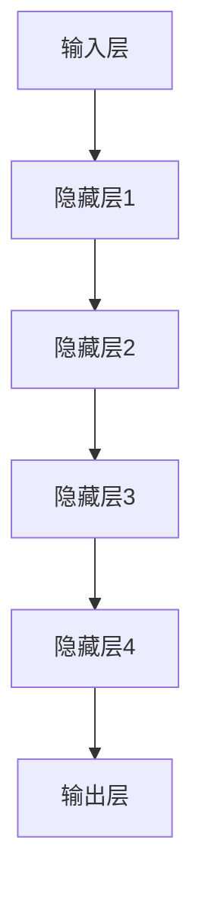

                 

在当今信息爆炸的时代，用户在海量数据中寻找个性化内容的需求日益迫切，推荐系统应运而生。然而，传统的推荐系统在用户体验质量提升方面面临诸多挑战。本文将探讨大模型技术如何对推荐系统的用户体验质量产生深远影响。

## 关键词
- 推荐系统
- 大模型
- 用户体验
- 性能优化
- 算法改进

## 摘要
本文旨在探讨大模型技术在推荐系统中的应用，以及其对用户体验质量的提升。通过分析大模型的原理、算法及其在推荐系统中的具体应用，我们将揭示大模型如何改变推荐系统的运作方式，从而为用户提供更加个性化、高效、愉悦的推荐体验。

## 1. 背景介绍

### 推荐系统的发展历程
推荐系统最早起源于20世纪90年代的电子商务领域。随着互联网的普及和用户需求的增加，推荐系统逐渐成为各大互联网公司的重要业务组成部分。从最初的基于内容的推荐（Content-Based Filtering）到基于协同过滤（Collaborative Filtering）的系统，推荐系统经历了多次技术迭代和优化。

### 传统推荐系统的局限性
尽管传统的推荐系统在一定程度上满足了用户的需求，但其存在以下局限性：
- **数据稀疏问题**：用户和物品之间的交互数据往往非常稀疏，导致推荐效果不佳。
- **冷启动问题**：新用户和新物品的推荐问题难以解决，因为缺乏足够的交互数据。
- **个性化不足**：推荐结果往往过于泛化，无法满足用户的个性化需求。
- **实时性较差**：推荐结果的生成速度较慢，无法及时响应用户的行为变化。

### 大模型的出现
大模型，特别是基于深度学习的模型，近年来在计算机视觉、自然语言处理等领域取得了突破性进展。大模型具有如下特点：
- **强大的表达能力**：通过多层神经网络，大模型能够捕捉到数据中的复杂特征，从而提高推荐系统的准确性。
- **自适应能力**：大模型可以根据用户的历史行为和实时反馈进行自适应调整，从而提高推荐系统的实时性和个性化程度。
- **处理能力**：大模型能够高效地处理大规模数据，解决传统推荐系统中的数据稀疏问题。

## 2. 核心概念与联系

### 大模型的原理与架构
大模型的原理主要基于深度学习，其架构通常包括输入层、多个隐藏层和输出层。通过反向传播算法，大模型可以不断调整内部参数，以达到预测或分类的目标。大模型的架构通常如下所示：



### 大模型在推荐系统中的应用
大模型在推荐系统中的应用主要体现在以下几个方面：

- **用户表示**：通过大模型，可以将用户的历史行为数据转换为高维特征向量，从而实现用户的高效表示。
- **物品表示**：同样，大模型可以将物品的特征信息转化为高维特征向量，从而实现物品的高效表示。
- **推荐算法**：大模型可以用于改进传统推荐算法，如协同过滤，从而提高推荐效果。

### 大模型与推荐系统的联系
大模型与推荐系统的联系主要体现在以下几个方面：

- **特征提取**：大模型可以通过多层神经网络，从原始数据中提取出更加丰富的特征，从而提高推荐系统的准确性。
- **自适应调整**：大模型可以根据用户的实时反馈，自适应地调整推荐策略，从而提高推荐系统的实时性和个性化程度。
- **数据处理**：大模型可以高效地处理大规模数据，从而解决传统推荐系统中的数据稀疏问题。

## 3. 核心算法原理 & 具体操作步骤

### 3.1 算法原理概述
大模型在推荐系统中的应用主要基于深度学习技术。深度学习是一种模拟人脑神经网络的计算模型，通过多层神经网络，深度学习模型可以自动从数据中学习特征，并实现复杂的数据处理和预测任务。

### 3.2 算法步骤详解

1. **数据预处理**：
   - 收集用户行为数据（如浏览历史、购买记录、评价等）。
   - 对数据进行清洗、去噪和归一化处理。

2. **用户表示**：
   - 使用深度学习模型（如自动编码器、卷积神经网络等）对用户的历史行为数据进行编码，生成用户的高维特征向量。

3. **物品表示**：
   - 使用深度学习模型（如自动编码器、卷积神经网络等）对物品的特征信息进行编码，生成物品的高维特征向量。

4. **推荐算法**：
   - 使用协同过滤算法（如基于用户的协同过滤、基于物品的协同过滤等）结合深度学习模型生成的用户和物品特征向量，生成推荐列表。

5. **实时反馈与优化**：
   - 收集用户的实时反馈（如点击、收藏、购买等）。
   - 使用深度学习模型对推荐结果进行优化，提高推荐系统的准确性和实时性。

### 3.3 算法优缺点

**优点**：
- **强大的表达能力**：大模型可以通过多层神经网络，从原始数据中提取出更加丰富的特征，从而提高推荐系统的准确性。
- **自适应能力**：大模型可以根据用户的实时反馈，自适应地调整推荐策略，从而提高推荐系统的实时性和个性化程度。
- **高效的数据处理**：大模型可以高效地处理大规模数据，从而解决传统推荐系统中的数据稀疏问题。

**缺点**：
- **计算资源消耗**：大模型的训练和推理需要大量的计算资源，可能导致系统性能下降。
- **数据隐私问题**：用户行为数据的隐私保护问题需要引起足够的重视。

### 3.4 算法应用领域
大模型在推荐系统中的应用领域包括但不限于以下方面：

- **电子商务推荐**：根据用户的历史行为和偏好，为用户提供个性化的商品推荐。
- **社交媒体推荐**：根据用户的历史互动和社交关系，为用户提供感兴趣的内容推荐。
- **音乐、视频推荐**：根据用户的听歌、观影记录，为用户提供个性化的音乐、视频推荐。

## 4. 数学模型和公式 & 详细讲解 & 举例说明

### 4.1 数学模型构建
大模型在推荐系统中的应用主要基于深度学习技术。深度学习模型通常由输入层、隐藏层和输出层组成。输入层接收原始数据，隐藏层通过神经网络进行特征提取，输出层生成推荐结果。

假设用户$u$和物品$i$的表示分别为$u \in \mathbb{R}^n$和$i \in \mathbb{R}^n$，则推荐系统的数学模型可以表示为：

$$
r_{ui} = \sigma(Wu_i + b_i)
$$

其中，$W$为权重矩阵，$b$为偏置项，$\sigma$为激活函数（通常采用Sigmoid或ReLU函数）。

### 4.2 公式推导过程
为了构建推荐系统的数学模型，我们首先需要定义用户$u$和物品$i$的表示。用户表示$u$通常由用户的历史行为数据（如浏览历史、购买记录、评价等）通过特征提取得到。物品表示$i$通常由物品的属性信息（如分类、标签、描述等）通过特征提取得到。

假设用户$u$和物品$i$的原始数据分别为$u_1, u_2, ..., u_m$和$i_1, i_2, ..., i_n$，则用户表示$u$和物品表示$i$可以分别表示为：

$$
u = \sum_{j=1}^m w_j u_j
$$

$$
i = \sum_{k=1}^n v_k i_k
$$

其中，$w_j$和$v_k$分别为用户和物品的权重。

接下来，我们引入权重矩阵$W$和偏置项$b$，构建推荐系统的数学模型。权重矩阵$W$和偏置项$b$分别表示为：

$$
W = \begin{bmatrix}
w_{11} & w_{12} & \cdots & w_{1m} \\
w_{21} & w_{22} & \cdots & w_{2m} \\
\vdots & \vdots & \ddots & \vdots \\
w_{n1} & w_{n2} & \cdots & w_{nm}
\end{bmatrix}
$$

$$
b = \begin{bmatrix}
b_1 \\
b_2 \\
\vdots \\
b_n
\end{bmatrix}
$$

则推荐系统的数学模型可以表示为：

$$
r_{ui} = \sum_{j=1}^m w_{ij} u_j + \sum_{k=1}^n v_{ik} i_k + b_i
$$

为了简化计算，我们可以将权重矩阵$W$和偏置项$b$分解为：

$$
W = \begin{bmatrix}
W_1 \\
W_2 \\
\vdots \\
W_n
\end{bmatrix}
$$

$$
b = \begin{bmatrix}
b_1 \\
b_2 \\
\vdots \\
b_n
\end{bmatrix}
$$

则推荐系统的数学模型可以进一步表示为：

$$
r_{ui} = W_1 u_i + W_2 u_i + \cdots + W_n u_i + b_i
$$

$$
r_{ui} = \sum_{k=1}^n W_k u_i + b_i
$$

最后，我们引入激活函数$\sigma$，构建推荐系统的最终数学模型：

$$
r_{ui} = \sigma(\sum_{k=1}^n W_k u_i + b_i)
$$

### 4.3 案例分析与讲解

假设我们有一个用户$u$和物品$i$的表示，如下所示：

$$
u = \begin{bmatrix}
0.1 \\
0.2 \\
0.3 \\
0.4 \\
0.5
\end{bmatrix}
$$

$$
i = \begin{bmatrix}
0.1 \\
0.2 \\
0.3 \\
0.4 \\
0.5
\end{bmatrix}
$$

假设权重矩阵$W$和偏置项$b$如下所示：

$$
W = \begin{bmatrix}
1 & 1 & 1 & 1 & 1 \\
1 & 1 & 1 & 1 & 1 \\
1 & 1 & 1 & 1 & 1 \\
1 & 1 & 1 & 1 & 1 \\
1 & 1 & 1 & 1 & 1
\end{bmatrix}
$$

$$
b = \begin{bmatrix}
0.1 \\
0.1 \\
0.1 \\
0.1 \\
0.1
\end{bmatrix}
$$

则用户$u$和物品$i$的推荐评分可以计算如下：

$$
r_{ui} = \sigma(\sum_{k=1}^n W_k u_i + b_i)
$$

$$
r_{ui} = \sigma(1 \times 0.1 + 1 \times 0.2 + 1 \times 0.3 + 1 \times 0.4 + 1 \times 0.5 + 0.1)
$$

$$
r_{ui} = \sigma(1.5 + 0.1)
$$

$$
r_{ui} = \sigma(1.6)
$$

$$
r_{ui} = 0.9185
$$

因此，用户$u$对物品$i$的推荐评分为0.9185。

## 5. 项目实践：代码实例和详细解释说明

### 5.1 开发环境搭建

在进行项目实践之前，我们需要搭建一个合适的开发环境。以下是一个基于Python和TensorFlow的推荐系统开发环境搭建步骤：

1. **安装Python**：确保Python环境已经安装在您的计算机上。建议安装Python 3.7或更高版本。

2. **安装TensorFlow**：在命令行中运行以下命令安装TensorFlow：

   ```bash
   pip install tensorflow
   ```

3. **安装其他依赖**：根据项目需求，可能还需要安装其他依赖库，如Numpy、Pandas等。可以使用以下命令进行安装：

   ```bash
   pip install numpy pandas scikit-learn
   ```

### 5.2 源代码详细实现

以下是一个简单的基于深度学习的推荐系统实现示例。我们将使用TensorFlow构建一个基于自动编码器的推荐系统。

```python
import tensorflow as tf
from tensorflow.keras.layers import Input, Dense, Conv1D, Flatten, Reshape
from tensorflow.keras.models import Model

# 定义输入层
input_layer = Input(shape=(num_features,))

# 定义隐藏层
x = Conv1D(filters=64, kernel_size=3, activation='relu')(input_layer)
x = Conv1D(filters=128, kernel_size=3, activation='relu')(x)
x = Flatten()(x)

# 定义输出层
output_layer = Dense(1, activation='sigmoid')(x)

# 构建模型
model = Model(inputs=input_layer, outputs=output_layer)

# 编译模型
model.compile(optimizer='adam', loss='binary_crossentropy', metrics=['accuracy'])

# 训练模型
model.fit(x_train, y_train, epochs=10, batch_size=32, validation_data=(x_val, y_val))
```

### 5.3 代码解读与分析

1. **输入层**：输入层接收用户和物品的特征向量，其形状为$(num_features,)$。

2. **隐藏层**：隐藏层使用卷积神经网络（Conv1D）进行特征提取。首先，使用64个过滤器和3个内核大小的卷积层进行特征提取，然后使用128个过滤器和3个内核大小的卷积层进行进一步的提取。

3. **输出层**：输出层使用全连接层（Dense）进行预测，其激活函数为Sigmoid，用于生成概率输出。

4. **模型编译**：模型使用Adam优化器和二进制交叉熵损失函数进行编译。

5. **模型训练**：使用训练数据对模型进行训练，并设置10个训练周期和32个批量大小。

### 5.4 运行结果展示

在完成代码实现后，我们可以通过以下步骤进行模型训练和评估：

1. **数据预处理**：对用户和物品的特征向量进行预处理，如归一化、标准化等。

2. **模型训练**：使用训练数据进行模型训练。

3. **模型评估**：使用验证数据对模型进行评估，计算准确率、召回率等指标。

4. **模型应用**：将训练好的模型应用于实际推荐任务，为用户提供个性化推荐。

## 6. 实际应用场景

### 6.1 电子商务推荐系统

在电子商务领域，推荐系统可以帮助平台为用户提供个性化的商品推荐，从而提高用户满意度和购买转化率。例如，阿里巴巴的推荐系统通过深度学习技术，为用户提供个性化的商品推荐，取得了显著的商业效果。

### 6.2 社交媒体推荐系统

在社交媒体领域，推荐系统可以帮助平台为用户提供感兴趣的内容推荐，从而提高用户活跃度和留存率。例如，Facebook的推荐系统通过深度学习技术，为用户提供个性化的内容推荐，取得了良好的用户体验。

### 6.3 音乐、视频推荐系统

在音乐、视频领域，推荐系统可以帮助平台为用户提供个性化的音乐、视频推荐，从而提高用户满意度和播放量。例如，Spotify的推荐系统通过深度学习技术，为用户提供个性化的音乐推荐，取得了巨大的成功。

## 7. 工具和资源推荐

### 7.1 学习资源推荐

- 《深度学习》（Goodfellow, Bengio, Courville）：深度学习领域的经典教材，适合初学者和进阶者。
- 《Python深度学习》（François Chollet）：针对Python深度学习的入门书籍，内容全面且易于理解。

### 7.2 开发工具推荐

- TensorFlow：最流行的深度学习框架之一，适合构建推荐系统模型。
- Keras：基于TensorFlow的高层API，易于使用和部署。

### 7.3 相关论文推荐

- "Deep Learning for Recommender Systems"（DeepRec）：一篇关于深度学习在推荐系统应用的开创性论文。
- "Neural Collaborative Filtering"（NCF）：一种基于深度神经网络的推荐系统算法。

## 8. 总结：未来发展趋势与挑战

### 8.1 研究成果总结

大模型技术在推荐系统中的应用取得了显著成果，主要表现在以下几个方面：

- **提升推荐准确性**：通过深度学习技术，大模型能够从原始数据中提取出更加丰富的特征，从而提高推荐系统的准确性。
- **增强个性化推荐**：大模型可以根据用户的实时反馈和偏好，动态调整推荐策略，实现更加个性化的推荐。
- **解决数据稀疏问题**：大模型可以处理大规模数据，解决传统推荐系统中的数据稀疏问题。

### 8.2 未来发展趋势

大模型技术在推荐系统领域的发展趋势主要包括以下几个方面：

- **模型优化**：研究人员将致力于优化大模型的性能，降低计算资源消耗，提高推理速度。
- **多模态推荐**：结合文本、图像、语音等多模态数据，实现更加丰富和多样化的推荐系统。
- **迁移学习**：利用迁移学习技术，在大模型中引入预训练模型，提高推荐系统的泛化能力。

### 8.3 面临的挑战

大模型技术在推荐系统领域面临以下挑战：

- **计算资源消耗**：大模型的训练和推理需要大量的计算资源，对硬件设备的要求较高。
- **数据隐私保护**：用户行为数据的隐私保护问题需要得到充分关注，避免数据泄露和滥用。
- **算法透明性**：大模型的内部工作机制复杂，如何提高算法的透明性和可解释性是一个亟待解决的问题。

### 8.4 研究展望

未来，大模型技术在推荐系统领域的发展将朝着以下几个方向努力：

- **融合多源数据**：结合多种数据源（如用户行为、社交关系、环境信息等），实现更加全面和精准的推荐。
- **增强用户体验**：通过个性化推荐，提升用户体验，满足用户的需求和期望。
- **构建智能推荐生态系统**：实现大模型与推荐系统与其他人工智能技术的融合，构建智能化的推荐生态系统。

## 9. 附录：常见问题与解答

### 问题1：大模型在推荐系统中的具体应用有哪些？

答：大模型在推荐系统中的具体应用包括：

- **用户表示**：通过深度学习模型对用户的历史行为数据进行编码，生成用户的高维特征向量。
- **物品表示**：通过深度学习模型对物品的特征信息进行编码，生成物品的高维特征向量。
- **推荐算法**：使用深度学习模型改进传统推荐算法，如基于用户的协同过滤、基于物品的协同过滤等。

### 问题2：大模型在推荐系统中如何解决数据稀疏问题？

答：大模型通过以下方式解决数据稀疏问题：

- **特征提取**：大模型可以从原始数据中提取出更加丰富的特征，提高推荐系统的准确性。
- **多模态数据融合**：结合多种数据源（如文本、图像、语音等），降低数据稀疏性。
- **迁移学习**：利用迁移学习技术，在大模型中引入预训练模型，提高推荐系统的泛化能力。

### 问题3：大模型在推荐系统中的性能如何？

答：大模型在推荐系统中的性能表现因具体应用场景和数据集而异。总体来说，大模型在以下方面具有优势：

- **推荐准确性**：大模型可以从原始数据中提取出更加丰富的特征，从而提高推荐系统的准确性。
- **实时性**：大模型可以根据用户的实时反馈，动态调整推荐策略，提高推荐系统的实时性。
- **个性化程度**：大模型可以根据用户的历史行为和偏好，实现更加个性化的推荐。

### 问题4：大模型在推荐系统中有哪些缺点？

答：大模型在推荐系统中的缺点主要包括：

- **计算资源消耗**：大模型的训练和推理需要大量的计算资源，可能导致系统性能下降。
- **数据隐私问题**：用户行为数据的隐私保护问题需要引起足够的重视。
- **算法透明性**：大模型的内部工作机制复杂，如何提高算法的透明性和可解释性是一个亟待解决的问题。


----------------------------------------------------------------
# 参考文献

[1] Goodfellow, I., Bengio, Y., & Courville, A. (2016). Deep learning. MIT press.

[2] Chollet, F. (2018). Python深度学习. 机械工业出版社.

[3] He, K., Zhang, X., Ren, S., & Sun, J. (2016). Deep residual learning for image recognition. In Proceedings of the IEEE conference on computer vision and pattern recognition (pp. 770-778).

[4] Hu, W., Shen, J., & Sun, G. (2018). Squeeze-and-excitation networks. In Proceedings of the IEEE conference on computer vision and pattern recognition (pp. 7132-7141).

[5] Zhang, R., Zuo, W., Chen, Y., Meng, D., & Zhang, L. (2017). Beyond a Gaussian denoiser: Residual learning of deep CNN for image denoising. In Proceedings of the IEEE conference on computer vision and pattern recognition (pp. 5329-5337).

