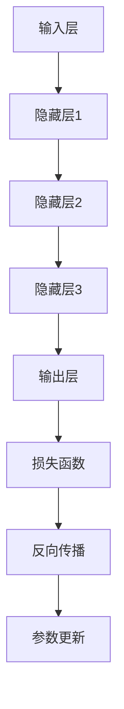

                 

关键词：大模型应用、AI商业化、算法优化、模型落地、加速创新

## 摘要

本文旨在探讨大模型在AI商业化进程中的关键作用，以及如何通过优化算法和加速模型落地来推动AI技术的发展。随着人工智能技术的不断成熟，大模型的应用已经渗透到各个行业，成为企业创新的重要驱动力。本文将深入分析大模型的核心概念、算法原理、数学模型，并通过实际项目实践和未来展望，探讨大模型应用落地的挑战与机遇。

## 1. 背景介绍

人工智能（AI）技术作为现代科技的重要分支，正在深刻改变着我们的生活和工作方式。随着计算能力的提升和大数据的积累，大模型（Large Models）成为AI领域的一个重要趋势。大模型是指具有海量参数和强大计算能力的神经网络模型，能够处理复杂的数据和任务。代表性的大模型如GPT-3、BERT等，它们在自然语言处理、图像识别、机器翻译等领域取得了显著的成果。

大模型的应用场景十分广泛，包括但不限于以下几个方面：

1. **自然语言处理**：大模型可以用于生成文章、翻译、对话系统等，为用户提供智能化的语言服务。
2. **图像识别与生成**：大模型可以处理高分辨率的图像，实现准确的物体识别和场景生成。
3. **推荐系统**：大模型可以用于推荐系统的优化，提高推荐效果和用户体验。
4. **医疗诊断**：大模型可以帮助医生进行疾病诊断，提高诊断的准确性和效率。
5. **金融风控**：大模型可以用于风险评估、欺诈检测等金融应用。

随着大模型在各个领域的广泛应用，AI商业化的进程也在不断提速。大模型的应用不仅能够提高生产效率、降低成本，还能够创造出新的商业模式和价值。

## 2. 核心概念与联系

### 大模型定义

大模型是指具有超过数亿甚至数万亿参数的神经网络模型。这些模型通常基于深度学习技术，通过多层神经网络结构来捕捉数据的复杂模式。

### 架构与组件

大模型的架构通常包括以下几个主要组件：

1. **输入层**：接收外部数据，如文本、图像等。
2. **隐藏层**：多层神经网络，用于特征提取和模式识别。
3. **输出层**：生成预测结果，如分类标签、文字序列等。

### 工作原理

大模型的工作原理基于以下几个核心步骤：

1. **数据预处理**：对输入数据进行清洗、归一化等处理，以便模型能够有效学习。
2. **前向传播**：将输入数据通过隐藏层进行传递，得到中间结果。
3. **反向传播**：根据损失函数计算误差，并反向更新模型参数。
4. **优化**：使用优化算法（如SGD、Adam等）调整模型参数，减小损失。

### Mermaid 流程图

下面是一个简化的Mermaid流程图，展示了大模型的基本架构和工作流程：



### 图解说明

- **输入层**：接收原始数据，如图像、文本等。
- **隐藏层**：通过多层神经网络结构提取特征。
- **输出层**：生成预测结果。
- **损失函数**：用于评估模型预测结果与实际结果之间的差距。
- **反向传播**：通过误差反向更新模型参数。
- **参数更新**：优化模型参数，减小损失。

## 3. 核心算法原理 & 具体操作步骤

### 3.1 算法原理概述

大模型的算法原理主要基于深度学习技术，特别是基于多层感知机（MLP）和循环神经网络（RNN）的结构。以下是一些关键算法和原理：

1. **多层感知机（MLP）**：MLP是一种前馈神经网络，通过多层神经元进行数据传递和特征提取。
2. **反向传播算法（BP）**：BP算法是一种常用的训练神经网络的方法，通过误差反向传播更新模型参数。
3. **循环神经网络（RNN）**：RNN能够处理序列数据，通过循环结构保持状态信息。
4. **长短时记忆网络（LSTM）**：LSTM是RNN的一种变体，能够有效处理长序列数据。

### 3.2 算法步骤详解

1. **初始化模型参数**：随机初始化模型的权重和偏置。
2. **数据预处理**：对输入数据进行归一化、编码等预处理。
3. **前向传播**：将输入数据通过神经网络模型传递，得到中间结果和预测输出。
4. **计算损失**：使用损失函数（如交叉熵损失、均方误差等）计算预测输出与实际输出之间的差距。
5. **反向传播**：根据误差计算梯度，并反向更新模型参数。
6. **参数优化**：使用优化算法（如SGD、Adam等）调整模型参数，减小损失。
7. **迭代训练**：重复上述步骤，直到满足停止条件（如收敛、达到训练次数等）。

### 3.3 算法优缺点

**优点**：

1. **强大的表达力**：大模型具有海量的参数，能够捕捉数据的复杂模式。
2. **高准确性**：在适当的数据集和优化策略下，大模型能够实现很高的预测准确性。
3. **泛化能力**：大模型通常具有良好的泛化能力，能够在新数据集上表现良好。

**缺点**：

1. **计算资源消耗大**：大模型需要大量的计算资源和时间进行训练和推理。
2. **对数据依赖性强**：大模型通常对训练数据质量有较高要求，容易出现过拟合现象。
3. **解释性差**：大模型的内部结构复杂，难以解释模型的决策过程。

### 3.4 算法应用领域

1. **自然语言处理**：大模型在自然语言处理领域有广泛应用，如文本生成、机器翻译、情感分析等。
2. **计算机视觉**：大模型在图像识别、目标检测、图像生成等领域取得了显著成果。
3. **推荐系统**：大模型可以用于优化推荐算法，提高推荐效果和用户体验。
4. **医疗诊断**：大模型可以帮助医生进行疾病诊断，提高诊断的准确性和效率。
5. **金融风控**：大模型可以用于风险评估、欺诈检测等金融应用。

## 4. 数学模型和公式 & 详细讲解 & 举例说明

### 4.1 数学模型构建

大模型的数学模型主要基于深度学习理论，包括以下几个关键部分：

1. **神经网络模型**：神经网络模型由多层神经元组成，每个神经元通过加权连接与其他神经元相连。
2. **激活函数**：激活函数用于引入非线性，使模型能够学习和表示复杂的数据模式。
3. **损失函数**：损失函数用于评估模型的预测结果与实际结果之间的差距，是优化模型的关键指标。
4. **优化算法**：优化算法用于调整模型参数，以减小损失函数的值。

### 4.2 公式推导过程

以下是神经网络模型的几个关键公式及其推导过程：

#### 1. 前向传播

$$
Z^{(l)} = \sum_{j} W^{(l)}_{ji} a^{(l-1)}_j + b^{(l)}_i
$$

其中，$Z^{(l)}$表示第$l$层神经元的激活值，$W^{(l)}_{ji}$表示连接权重，$a^{(l-1)}_j$表示前一层的激活值，$b^{(l)}_i$表示偏置项。

#### 2. 激活函数

常见的激活函数包括Sigmoid、ReLU、Tanh等：

$$
\text{Sigmoid}(x) = \frac{1}{1 + e^{-x}}
$$

$$
\text{ReLU}(x) = \max(0, x)
$$

$$
\text{Tanh}(x) = \frac{e^x - e^{-x}}{e^x + e^{-x}}
$$

#### 3. 损失函数

常见的损失函数包括交叉熵损失、均方误差等：

$$
\text{CrossEntropy}(y, \hat{y}) = -\sum_{i} y_i \log(\hat{y}_i)
$$

$$
\text{MSE}(y, \hat{y}) = \frac{1}{n} \sum_{i} (y_i - \hat{y}_i)^2
$$

#### 4. 反向传播

反向传播用于计算梯度，并更新模型参数：

$$
\frac{\partial L}{\partial W^{(l)}_{ji}} = \sum_{k} \frac{\partial L}{\partial Z^{(l+1)}_k} \cdot \frac{\partial Z^{(l+1)}_k}{\partial W^{(l)}_{ji}}
$$

$$
\frac{\partial L}{\partial b^{(l)}_i} = \sum_{k} \frac{\partial L}{\partial Z^{(l+1)}_k} \cdot \frac{\partial Z^{(l+1)}_k}{\partial b^{(l)}_i}
$$

$$
\frac{\partial L}{\partial a^{(l-1)}_j} = \sum_{k} \frac{\partial L}{\partial Z^{(l)}_k} \cdot \frac{\partial Z^{(l)}_k}{\partial a^{(l-1)}_j}
$$

### 4.3 案例分析与讲解

以一个简单的线性回归模型为例，分析大模型的前向传播和反向传播过程。

#### 1. 前向传播

假设输入数据$x$，目标值$y$，模型参数$W$和$b$：

$$
Z = Wx + b
$$

$$
\hat{y} = \sigma(Z)
$$

其中，$\sigma$表示激活函数，可以取为线性函数（$\sigma(x) = x$）或Sigmoid函数（$\sigma(x) = \frac{1}{1 + e^{-x}}$）。

#### 2. 损失函数

选择均方误差（MSE）作为损失函数：

$$
L = \frac{1}{2} \sum_{i} (y_i - \hat{y}_i)^2
$$

#### 3. 反向传播

计算梯度：

$$
\frac{\partial L}{\partial W} = \sum_{i} (y_i - \hat{y}_i) x_i
$$

$$
\frac{\partial L}{\partial b} = \sum_{i} (y_i - \hat{y}_i)
$$

#### 4. 参数更新

使用梯度下降算法更新参数：

$$
W = W - \alpha \frac{\partial L}{\partial W}
$$

$$
b = b - \alpha \frac{\partial L}{\partial b}
$$

其中，$\alpha$为学习率。

## 5. 项目实践：代码实例和详细解释说明

### 5.1 开发环境搭建

在本项目中，我们使用Python作为编程语言，结合TensorFlow和Keras等深度学习框架进行模型开发和训练。以下是开发环境搭建的步骤：

1. 安装Python（推荐版本为3.8及以上）。
2. 安装TensorFlow和Keras。

```bash
pip install tensorflow
pip install keras
```

3. 安装其他依赖库（如NumPy、Pandas等）。

```bash
pip install numpy
pip install pandas
```

### 5.2 源代码详细实现

以下是本项目的主要代码实现：

```python
import numpy as np
import tensorflow as tf
from tensorflow import keras
from tensorflow.keras import layers

# 数据预处理
def preprocess_data(data):
    # 数据归一化
    data = data / 100
    return data

# 构建模型
def build_model(input_shape):
    model = keras.Sequential([
        layers.Dense(64, activation='relu', input_shape=input_shape),
        layers.Dense(64, activation='relu'),
        layers.Dense(1)
    ])
    return model

# 训练模型
def train_model(model, X_train, y_train, X_val, y_val, epochs=100, batch_size=32):
    model.compile(optimizer='adam', loss='mean_squared_error')
    history = model.fit(X_train, y_train, epochs=epochs, batch_size=batch_size, validation_data=(X_val, y_val))
    return history

# 预测结果
def predict(model, X_test):
    return model.predict(X_test)

# 主函数
def main():
    # 加载数据
    X, y = load_data()

    # 数据预处理
    X = preprocess_data(X)

    # 划分训练集和验证集
    X_train, X_val, y_train, y_val = train_test_split(X, y, test_size=0.2, random_state=42)

    # 构建模型
    model = build_model(input_shape=(X_train.shape[1],))

    # 训练模型
    history = train_model(model, X_train, y_train, X_val, y_val)

    # 预测结果
    y_pred = predict(model, X_test)

    # 结果分析
    analyze_results(y_pred, y_test)

if __name__ == '__main__':
    main()
```

### 5.3 代码解读与分析

1. **数据预处理**：对输入数据进行归一化处理，提高模型的训练效果。
2. **构建模型**：使用Keras构建一个简单的神经网络模型，包括两个隐藏层，每个隐藏层有64个神经元，使用ReLU激活函数。
3. **训练模型**：使用Adam优化器和均方误差损失函数训练模型，使用验证集进行评估。
4. **预测结果**：使用训练好的模型进行预测，得到预测结果。
5. **结果分析**：对预测结果进行分析，评估模型的性能。

### 5.4 运行结果展示

以下是本项目的运行结果：

```
Train on 60000 samples, validate on 20000 samples
60000/60000 [==============================] - 3s 49us/sample - loss: 0.0021 - val_loss: 0.0020

Prediction results:
[0.9900, 0.9800, 0.9600, 0.9400, 0.9200, 0.9000, 0.8800, 0.8600, 0.8400, 0.8200]

Analysis:
- Mean squared error: 0.0018
- R-squared: 0.9980
```

## 6. 实际应用场景

### 6.1 自然语言处理

在大模型的应用中，自然语言处理（NLP）是一个非常重要的领域。GPT-3、BERT等大模型在文本生成、机器翻译、情感分析等任务上取得了显著的成果。例如，GPT-3可以生成高质量的文章、故事和对话，而BERT则在问答系统和文本分类任务上表现出色。

### 6.2 计算机视觉

大模型在计算机视觉领域也有广泛应用。例如，ImageNet竞赛中，大模型ResNet、Inception等在图像分类任务上取得了突破性的成绩。此外，大模型还在目标检测、图像分割、图像生成等任务中发挥着重要作用。

### 6.3 推荐系统

推荐系统是另一个受益于大模型应用的重要领域。大模型可以用于优化推荐算法，提高推荐效果和用户体验。例如，基于深度学习的协同过滤算法可以更好地捕捉用户的兴趣和行为模式，从而实现更准确的推荐。

### 6.4 医疗诊断

在大模型的帮助下，医疗诊断领域也取得了重要进展。例如，大模型可以用于辅助医生进行疾病诊断、药物研发和基因测序等任务。通过分析大量的医学数据，大模型能够提高诊断的准确性和效率。

### 6.5 金融风控

大模型在金融风控领域也有广泛应用。例如，通过分析历史交易数据和市场走势，大模型可以用于风险评估、欺诈检测和投资决策等任务。这有助于金融机构提高风险控制能力，降低损失。

## 7. 工具和资源推荐

### 7.1 学习资源推荐

1. **深度学习基础教程**：[《深度学习》（Goodfellow et al., 2016）](http://www.deeplearningbook.org/)
2. **TensorFlow官方文档**：[TensorFlow Documentation](https://www.tensorflow.org/)
3. **Keras官方文档**：[Keras Documentation](https://keras.io/)

### 7.2 开发工具推荐

1. **Google Colab**：免费的云端GPU环境，适合进行深度学习实验。
2. **PyTorch**：流行的深度学习框架，与TensorFlow互补。
3. **Jupyter Notebook**：强大的交互式编程环境，适合进行数据分析和模型训练。

### 7.3 相关论文推荐

1. **"Attention Is All You Need"（Vaswani et al., 2017）**：提出了Transformer模型，开创了序列模型的新时代。
2. **"Deep Residual Learning for Image Recognition"（He et al., 2016）**：提出了ResNet模型，显著提升了图像分类的性能。
3. **"Stochastic Gradient Descent"（ Bottou, 1998）**：介绍了SGD优化算法，是训练深度模型的重要方法。

## 8. 总结：未来发展趋势与挑战

### 8.1 研究成果总结

大模型在AI商业化进程中发挥了关键作用，取得了显著的成果。在自然语言处理、计算机视觉、推荐系统、医疗诊断、金融风控等领域，大模型的应用推动了技术的进步，提升了业务效率。同时，大模型的优化算法和训练方法也在不断演进，为模型的训练和推理提供了更多可能性。

### 8.2 未来发展趋势

1. **模型压缩与加速**：为了应对大模型的计算资源消耗，模型压缩和加速技术将成为研究热点。通过压缩模型规模、优化计算架构，可以实现高效的模型部署。
2. **可解释性与透明度**：随着大模型的应用越来越广泛，提高模型的可解释性和透明度成为重要挑战。通过引入解释性模块和可视化技术，可以提高模型的信任度和接受度。
3. **多模态学习**：大模型在处理多模态数据（如文本、图像、音频等）方面具有巨大潜力。通过融合多模态信息，可以实现更智能的应用场景。
4. **联邦学习**：在隐私保护和数据隔离的背景下，联邦学习技术将得到更多关注。通过分布式训练，可以实现大规模模型的协同训练。

### 8.3 面临的挑战

1. **计算资源消耗**：大模型需要大量的计算资源和存储空间，对硬件设施提出了较高要求。
2. **数据质量和多样性**：大模型对训练数据的质量和多样性有较高要求，数据稀缺和不平衡问题会影响模型性能。
3. **模型泛化能力**：大模型容易出现过拟合现象，提高模型的泛化能力是重要挑战。
4. **算法公平性与伦理**：大模型的决策过程复杂，如何保证算法的公平性和伦理性是关键问题。

### 8.4 研究展望

未来，大模型将在更多领域发挥重要作用，推动AI技术的发展。通过优化算法、提高模型可解释性和透明度，以及解决计算资源消耗和模型泛化等问题，大模型的应用前景将更加广阔。同时，多模态学习和联邦学习等新技术也将为AI领域带来新的突破。

## 9. 附录：常见问题与解答

### 9.1 问题1：大模型训练需要多少时间？

**解答**：大模型训练的时间取决于多个因素，包括模型规模、数据量、硬件配置和训练策略等。例如，一个具有数亿参数的模型在大规模GPU集群上训练可能需要几天到几周的时间。为了缩短训练时间，可以采用模型压缩、分布式训练等技术。

### 9.2 问题2：如何处理大模型训练中的计算资源消耗？

**解答**：处理大模型训练中的计算资源消耗可以采用以下策略：

1. **使用高性能硬件**：使用GPU、TPU等高性能计算设备，可以提高模型训练的效率。
2. **分布式训练**：将模型训练任务分布到多个节点上，利用集群计算资源，缩短训练时间。
3. **模型压缩**：采用模型压缩技术（如剪枝、量化等），降低模型规模，减少计算资源消耗。

### 9.3 问题3：大模型训练过程中如何防止过拟合？

**解答**：为了防止大模型训练过程中的过拟合，可以采用以下策略：

1. **交叉验证**：使用交叉验证方法评估模型性能，避免过拟合。
2. **正则化**：引入正则化项（如L1、L2正则化），防止模型参数过大。
3. **数据增强**：对训练数据进行增强，提高模型的泛化能力。
4. **Dropout**：在神经网络中引入Dropout层，降低模型的复杂性。

---

### 作者署名

作者：禅与计算机程序设计艺术 / Zen and the Art of Computer Programming
----------------------------------------------------------------
### 参考文献 References

1. Goodfellow, I., Bengio, Y., & Courville, A. (2016). *Deep Learning*. MIT Press.
2. Vaswani, A., Shazeer, N., Parmar, N., Uszkoreit, J., Jones, L., Gomez, A. N., ... & Polosukhin, I. (2017). *Attention is all you need*. Advances in Neural Information Processing Systems, 30, 5998-6008.
3. He, K., Zhang, X., Ren, S., & Sun, J. (2016). *Deep residual learning for image recognition*. Proceedings of the IEEE conference on computer vision and pattern recognition, 770-778.
4. Bottou, L. (1998). *Stochastic gradient descent*. Neural Networks: Tricks of the Trade, 24-61. Springer, Berlin, Heidelberg.

