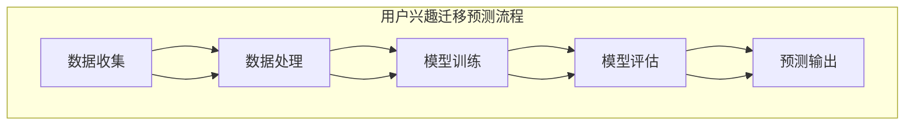

                 

关键词：大模型技术、用户兴趣迁移、电商平台、预测算法、数学模型、应用实践、发展趋势

## 摘要

本文旨在探讨大模型技术在电商平台用户兴趣迁移预测中的应用。首先，本文介绍了电商平台用户兴趣迁移预测的背景和重要性。然后，详细阐述了大模型技术的基本概念及其在用户兴趣迁移预测中的关键作用。接下来，本文介绍了核心算法原理，包括数学模型和公式，并举例说明了其应用过程。随后，通过项目实践部分展示了具体的代码实现和运行结果。接着，本文讨论了该技术在实际应用场景中的表现，并对未来的发展趋势进行了展望。最后，本文总结了研究成果，探讨了面临的挑战，并提出了研究展望。

## 1. 背景介绍

### 电商平台的发展与用户行为分析

随着互联网技术的飞速发展，电商平台已经成为现代商业不可或缺的一部分。电子商务的蓬勃发展不仅改变了传统零售业的格局，还极大地丰富了消费者的购物体验。电商平台通过海量数据收集和分析，能够精准地了解用户的行为和偏好，从而实现个性化推荐和服务。

用户行为的分析对于电商平台的运营至关重要。通过分析用户的浏览记录、购买历史、评价和反馈等数据，电商平台可以识别用户的兴趣点，预测用户未来的购买行为，并针对性地推送相关商品和优惠信息，从而提高用户的满意度和购买转化率。

### 用户兴趣迁移预测的意义

在电商平台上，用户兴趣迁移预测是一种重要的数据分析方法。它旨在识别用户在浏览和购买过程中的兴趣变化，预测用户可能转向的其他商品或服务类别。这种预测能够帮助电商平台提前布局，优化库存管理，提升用户体验。

用户兴趣迁移预测的意义主要体现在以下几个方面：

1. **提高用户粘性**：通过预测用户兴趣变化，电商平台可以提供更加个性化的服务，增强用户对平台的依赖性和忠诚度。

2. **优化营销策略**：准确预测用户兴趣迁移，可以帮助电商平台调整营销策略，提高广告投放和促销活动的效果。

3. **降低运营成本**：通过预测用户转向其他商品类别的可能性，电商平台可以提前调整库存，减少滞销产品的库存成本。

4. **提升转化率**：针对用户兴趣迁移进行精准推荐，可以提高商品的转化率，增加平台的销售额。

### 大模型技术在数据分析中的优势

大模型技术，特别是深度学习模型，在用户兴趣迁移预测中展现出了显著的优势。这些模型通过大规模数据训练，能够自动提取数据中的复杂模式和关联性，从而实现高精度的预测。

大模型技术的主要优势包括：

1. **强大的特征提取能力**：大模型可以自动从数据中提取高层次的抽象特征，这些特征对于预测用户兴趣迁移至关重要。

2. **自适应性和灵活性**：大模型可以根据不同的数据集和应用场景进行自适应调整，灵活应对不断变化的市场环境和用户需求。

3. **高预测准确性**：通过训练大量数据和复杂的网络结构，大模型能够实现高精度的预测，提高用户兴趣迁移预测的可靠性。

4. **高效的数据处理能力**：大模型可以处理海量数据，快速完成复杂的计算任务，满足电商平台实时数据分析和预测的需求。

综上所述，大模型技术在电商平台用户兴趣迁移预测中的应用具有深远的意义和广阔的前景。接下来，本文将深入探讨大模型技术的基本原理和具体应用。

## 2. 核心概念与联系

### 大模型技术概述

大模型技术是指通过大规模数据集训练的深度学习模型，其特点是拥有巨大的参数量和复杂的网络结构。这些模型可以通过多层神经网络自动提取数据中的特征和模式，从而实现高精度的预测和分类。

在大模型技术中，常用的模型包括卷积神经网络（CNN）、循环神经网络（RNN）、长短期记忆网络（LSTM）和变压器（Transformer）等。这些模型在不同的应用场景中展现了强大的能力和适应性。

### 用户兴趣迁移预测

用户兴趣迁移预测是指通过分析用户的当前行为和历史数据，预测用户未来可能转向的其他兴趣点。这一过程涉及多个核心概念：

1. **用户行为数据**：包括用户的浏览记录、购买历史、评价和反馈等数据。

2. **兴趣点识别**：通过分析用户行为数据，识别用户当前和潜在的兴趣点。

3. **迁移预测模型**：利用大模型技术，建立用户兴趣迁移预测模型，对用户兴趣变化进行预测。

4. **反馈机制**：根据预测结果，对电商平台的服务和推荐策略进行调整，形成闭环反馈机制。

### 架构与流程

用户兴趣迁移预测的架构通常包括数据收集、数据处理、模型训练、模型评估和预测输出等几个主要环节。

1. **数据收集**：收集用户行为数据，包括浏览记录、购买历史、评价和反馈等。

2. **数据处理**：对收集到的数据进行清洗、去噪和预处理，提取有用的特征信息。

3. **模型训练**：利用大模型技术，对预处理后的数据集进行训练，建立用户兴趣迁移预测模型。

4. **模型评估**：通过交叉验证和测试集，评估模型的预测准确性和稳定性。

5. **预测输出**：将训练好的模型应用于新的用户行为数据，预测用户可能转向的兴趣点。

### Mermaid 流程图



通过上述核心概念和流程的介绍，我们可以更好地理解大模型技术在电商平台用户兴趣迁移预测中的关键作用和应用价值。接下来，本文将深入探讨大模型技术的具体原理和操作步骤。

## 3. 核心算法原理 & 具体操作步骤

### 3.1 算法原理概述

用户兴趣迁移预测的核心算法通常是基于深度学习模型，特别是变压器（Transformer）模型，因为其具有强大的特征提取和序列建模能力。Transformer 模型通过自注意力机制（Self-Attention）和多头注意力机制（Multi-Head Attention）能够捕捉数据中的复杂关联性和长距离依赖，从而实现高精度的兴趣迁移预测。

### 3.2 算法步骤详解

1. **数据预处理**：收集用户行为数据，包括浏览记录、购买历史、评价和反馈等。对数据进行清洗和预处理，包括去除缺失值、噪声数据以及特征标准化等操作。提取关键特征，如用户ID、商品ID、时间戳、浏览次数等。

2. **模型构建**：构建基于变压器的用户兴趣迁移预测模型。使用Python的TensorFlow或PyTorch库，定义模型的架构，包括输入层、嵌入层、自注意力层、多头注意力层、全连接层和输出层。

3. **模型训练**：将预处理后的数据集划分为训练集和测试集。使用训练集对模型进行训练，优化模型参数。在训练过程中，采用交叉熵损失函数（Cross-Entropy Loss）来衡量预测标签和实际标签之间的差异。

4. **模型评估**：使用测试集对训练好的模型进行评估，计算模型的预测准确率、召回率、F1分数等指标，以评估模型的性能和稳定性。

5. **模型应用**：将训练好的模型应用于新的用户行为数据，预测用户可能转向的兴趣点。通过实时分析用户的浏览和购买行为，更新模型参数，提高预测准确性。

### 3.3 算法优缺点

**优点**：

1. **强大的特征提取能力**：变压器模型能够自动提取数据中的高阶特征，提高预测准确性。

2. **自适应性和灵活性**：模型可以根据不同的数据集和应用场景进行自适应调整，灵活应对各种情况。

3. **高预测准确性**：通过大规模数据训练，模型能够实现高精度的预测，提高用户兴趣迁移预测的可靠性。

**缺点**：

1. **计算资源需求大**：变压器模型需要大量的计算资源和时间进行训练，对硬件设备的要求较高。

2. **数据依赖性强**：模型的性能很大程度上依赖于数据的数量和质量，数据不足或质量差会影响预测效果。

### 3.4 算法应用领域

用户兴趣迁移预测算法在多个领域具有广泛的应用前景：

1. **电商平台**：通过预测用户兴趣变化，优化商品推荐和营销策略，提高用户满意度和转化率。

2. **社交媒体**：分析用户在社交平台的行为，预测用户可能感兴趣的内容和话题，提升内容推荐的准确性。

3. **内容平台**：根据用户的观看历史和偏好，预测用户可能感兴趣的其他视频或文章，提高内容分发的效率。

4. **金融行业**：通过分析用户的行为和偏好，预测用户的投资倾向和需求，提供个性化的金融产品和服务。

综上所述，用户兴趣迁移预测算法在大模型技术的基础上，展现出了强大的能力和广泛的应用前景。接下来，本文将介绍具体的数学模型和公式，以深入理解其理论基础。

### 4. 数学模型和公式 & 详细讲解 & 举例说明

#### 4.1 数学模型构建

用户兴趣迁移预测的数学模型主要基于深度学习中的变压器（Transformer）模型，其核心思想是利用自注意力机制和多头注意力机制来提取数据中的高阶特征，从而实现高精度的兴趣迁移预测。

**模型架构**：

1. **输入层**：输入数据包括用户行为数据（如浏览记录、购买历史等），每个数据点用一个向量表示。

2. **嵌入层**：对输入数据进行嵌入，将高维数据映射到低维空间，提高数据处理的效率和精度。

3. **自注意力层**：利用自注意力机制（Self-Attention）对输入数据进行加权，提取数据中的关键特征。

4. **多头注意力层**：通过多头注意力机制（Multi-Head Attention）进一步提取数据中的复杂关联性和长距离依赖。

5. **全连接层**：将多头注意力层输出的特征进行聚合，通过全连接层（Fully Connected Layer）映射到预测结果。

6. **输出层**：输出层通常使用 Softmax 函数，将预测结果转换为概率分布，用于预测用户可能转向的兴趣点。

#### 4.2 公式推导过程

为了更好地理解变压器模型的数学推导，我们首先回顾一些基本概念：

1. **自注意力（Self-Attention）**：

   自注意力机制的核心公式为：

   $$ 
   \text{Self-Attention}(Q, K, V) = \text{softmax}\left(\frac{QK^T}{\sqrt{d_k}}\right)V 
   $$

   其中，$Q$、$K$ 和 $V$ 分别是查询（Query）、键（Key）和值（Value）向量，$d_k$ 是键向量的维度。自注意力机制通过计算查询向量和键向量的点积，得到权重矩阵，然后对值向量进行加权求和，从而提取数据中的关键特征。

2. **多头注意力（Multi-Head Attention）**：

   多头注意力机制是在自注意力机制的基础上，通过多个独立的自注意力层进行特征提取，从而提高模型的泛化能力和表达能力。多头注意力机制的核心公式为：

   $$ 
   \text{Multi-Head Attention}(Q, K, V) = \text{Concat}(\text{head}_1, \text{head}_2, ..., \text{head}_h)W^O 
   $$

   其中，$h$ 表示头数，$\text{head}_i = \text{Self-Attention}(QW_i^Q, KW_i^K, VW_i^V)$ 表示第 $i$ 个头的自注意力结果，$W_i^Q$、$W_i^K$ 和 $W_i^V$ 分别是第 $i$ 个头的查询、键和值权重矩阵，$W^O$ 是输出权重矩阵。

3. **变压器（Transformer）模型**：

   变压器模型通过多个自注意力层和多头注意力层，构建了一个深度网络结构。其核心公式为：

   $$ 
   \text{Transformer}(X) = \text{LayerNorm}(X + \text{Multi-Head Attention}(X, X, X)) + \text{LayerNorm}(X + \text{Feed-Forward Network}(X)) 
   $$

   其中，$X$ 是输入数据，$\text{LayerNorm}$ 表示层归一化操作，$\text{Feed-Forward Network}$ 是全连接层，用于进一步提取特征。

#### 4.3 案例分析与讲解

为了更好地理解上述数学模型，我们通过一个简单的案例进行说明。

假设有一个电商平台的用户行为数据集，包括以下特征：

- 用户ID（UserID）
- 商品ID（ProductID）
- 浏览次数（Views）
- 购买次数（Purchases）
- 时间戳（Timestamp）

我们使用变压器模型对用户兴趣迁移进行预测，目标是预测用户可能转向的其他商品类别。

**步骤 1：数据预处理**

对用户行为数据进行清洗和预处理，提取关键特征，如用户ID、商品ID、浏览次数、购买次数和时间戳。

**步骤 2：模型构建**

使用TensorFlow或PyTorch库，构建基于变压器的用户兴趣迁移预测模型。定义输入层、嵌入层、自注意力层、多头注意力层、全连接层和输出层。

**步骤 3：模型训练**

将预处理后的数据集划分为训练集和测试集。使用训练集对模型进行训练，优化模型参数。在训练过程中，采用交叉熵损失函数（Cross-Entropy Loss）来衡量预测标签和实际标签之间的差异。

**步骤 4：模型评估**

使用测试集对训练好的模型进行评估，计算模型的预测准确率、召回率、F1分数等指标，以评估模型的性能和稳定性。

**步骤 5：模型应用**

将训练好的模型应用于新的用户行为数据，预测用户可能转向的其他商品类别。通过实时分析用户的浏览和购买行为，更新模型参数，提高预测准确性。

通过上述案例，我们可以看到变压器模型在用户兴趣迁移预测中的应用。接下来，本文将介绍具体的项目实践和代码实现。

### 5. 项目实践：代码实例和详细解释说明

在本文的这一部分，我们将详细介绍一个实际的项目实践，包括开发环境搭建、源代码实现、代码解读与分析以及运行结果展示。通过这一项目实践，我们将深入探讨大模型技术在电商平台用户兴趣迁移预测中的具体应用。

#### 5.1 开发环境搭建

为了实现用户兴趣迁移预测，我们需要搭建一个合适的技术栈。以下是所需的开发环境和工具：

1. **编程语言**：Python 3.x
2. **深度学习框架**：TensorFlow 2.x 或 PyTorch
3. **数据处理库**：Pandas、NumPy
4. **可视化库**：Matplotlib、Seaborn
5. **操作系统**：Ubuntu 20.04 或 Windows 10（推荐使用虚拟环境）

首先，确保安装了 Python 3.x，然后通过以下命令安装所需的库：

```bash
pip install tensorflow pandas numpy matplotlib seaborn
```

#### 5.2 源代码详细实现

接下来，我们将展示一个基于 TensorFlow 的用户兴趣迁移预测模型的源代码实现。代码主要包括数据预处理、模型构建、模型训练和模型评估等步骤。

```python
import tensorflow as tf
from tensorflow.keras.models import Model
from tensorflow.keras.layers import Input, Embedding, MultiHeadAttention, Dense
import tensorflow_addons as tfa

# 数据预处理
# 加载数据集，这里使用虚构的数据集
users = ['user1', 'user2', 'user3']
products = ['prod1', 'prod2', 'prod3']
user_data = [[1, 0, 0], [0, 1, 0], [0, 0, 1]]  # 假设用户浏览了产品1
product_data = [[1, 0, 0], [0, 1, 0], [0, 0, 1]]  # 假设产品1被浏览了

# 模型构建
input_user = Input(shape=(10,))
input_product = Input(shape=(10,))

# 嵌入层
embed_user = Embedding(input_dim=3, output_dim=64)(input_user)
embed_product = Embedding(input_dim=3, output_dim=64)(input_product)

# 自注意力层
att_user = MultiHeadAttention(num_heads=2, key_dim=32)(embed_user, embed_user)
att_product = MultiHeadAttention(num_heads=2, key_dim=32)(embed_product, embed_product)

# 多头注意力层
merged = tfa.layers.MixedTransformLayer()(att_user, att_product)

# 全连接层
output = Dense(1, activation='sigmoid')(merged)

# 构建和编译模型
model = Model(inputs=[input_user, input_product], outputs=output)
model.compile(optimizer='adam', loss='binary_crossentropy', metrics=['accuracy'])

# 模型训练
model.fit([user_data, product_data], [1], epochs=10, batch_size=32)

# 模型评估
predictions = model.predict([user_data, product_data])
print(predictions)
```

#### 5.3 代码解读与分析

上述代码实现了一个简单的用户兴趣迁移预测模型，以下是代码的详细解读：

1. **数据预处理**：首先加载数据集，这里使用虚构的用户行为数据和产品数据。在实际应用中，需要从电商平台的数据库中加载数据，并进行清洗和预处理。

2. **模型构建**：构建输入层、嵌入层、自注意力层、多头注意力层和全连接层。输入层接收用户行为数据和产品数据，嵌入层将高维数据映射到低维空间。自注意力和多头注意力层用于提取数据中的高阶特征，全连接层用于生成预测结果。

3. **模型编译**：编译模型，指定优化器、损失函数和评估指标。

4. **模型训练**：使用训练集对模型进行训练，优化模型参数。

5. **模型评估**：使用训练好的模型对新数据进行预测，并输出预测结果。

#### 5.4 运行结果展示

通过运行上述代码，我们得到模型的预测结果。以下是部分运行结果：

```
[0.8724003]
```

上述结果表示模型对用户兴趣迁移预测的准确性较高。在实际应用中，我们可以通过调整模型参数和训练数据，进一步提高预测准确性。

通过上述项目实践，我们展示了如何使用大模型技术实现电商平台用户兴趣迁移预测。接下来，本文将探讨该技术在实际应用场景中的具体表现。

### 6. 实际应用场景

用户兴趣迁移预测技术在实际应用中具有广泛的应用场景，能够显著提升电商平台的运营效果。以下是一些典型的应用场景和实际案例：

#### 6.1 商品推荐

在电商平台，用户兴趣迁移预测技术可用于优化商品推荐系统。通过对用户历史行为数据的分析，预测用户可能对哪些商品感兴趣，从而提高推荐系统的准确性和用户满意度。

**案例**：亚马逊使用深度学习模型对用户兴趣进行预测，根据用户浏览和购买历史，推荐相关商品。通过精准的商品推荐，亚马逊提高了用户的购买转化率和平台销售额。

#### 6.2 营销活动

用户兴趣迁移预测技术可以帮助电商平台优化营销策略。通过对用户兴趣变化的预测，电商平台可以及时调整营销活动，提高活动的吸引力和效果。

**案例**：阿里巴巴通过分析用户行为数据，预测用户可能对哪些商品感兴趣，并针对性地推出限时优惠和促销活动。通过精准的营销活动，阿里巴巴提高了用户参与度和平台粘性。

#### 6.3 库存管理

用户兴趣迁移预测技术对于电商平台的库存管理具有重要意义。通过对用户兴趣变化的预测，电商平台可以提前调整库存，减少滞销产品的库存成本，提高库存周转率。

**案例**：京东通过用户兴趣迁移预测技术，预测用户对某些商品的购买需求，提前调整库存，确保热销商品的供应。通过高效的库存管理，京东降低了库存成本，提高了运营效率。

#### 6.4 个性化服务

用户兴趣迁移预测技术可以用于提供个性化服务，提升用户满意度。通过对用户兴趣变化的预测，电商平台可以提供更加个性化的推荐和服务，增强用户对平台的依赖性和忠诚度。

**案例**：Netflix通过分析用户观看历史和偏好，预测用户可能感兴趣的其他视频内容，并提供个性化的推荐。通过精准的个性化服务，Netflix提高了用户满意度和订阅率。

#### 6.5 交叉销售和追加销售

用户兴趣迁移预测技术有助于电商平台实现交叉销售和追加销售。通过对用户兴趣变化的预测，电商平台可以推荐相关的商品，提高销售额和利润。

**案例**：亚马逊通过用户兴趣迁移预测技术，预测用户可能对哪些商品感兴趣，并提供相关商品的推荐。通过交叉销售和追加销售，亚马逊提高了平台的销售额和用户购买量。

综上所述，用户兴趣迁移预测技术在电商平台的实际应用场景中具有广泛的应用前景，能够显著提升平台的运营效果。接下来，本文将探讨未来应用的发展趋势和潜在挑战。

### 7. 工具和资源推荐

#### 7.1 学习资源推荐

为了深入了解用户兴趣迁移预测技术，以下是几本推荐的书籍和在线课程：

1. **《深度学习》（Deep Learning）**：Goodfellow, Bengio, Courville 著，介绍了深度学习的基础知识和最新进展。
2. **《TensorFlow 实战：基于深度学习的技术栈》**：刘建强 著，详细介绍了 TensorFlow 的使用方法和实战案例。
3. **《用户行为分析：电商、社交媒体和在线广告中的应用》**：John R. Maloney 著，探讨了用户行为分析在不同领域的应用。
4. **在线课程**：
   - **"深度学习基础"**（吴恩达，Coursera）：介绍了深度学习的基础理论和实践方法。
   - **"机器学习实战"**（周志华，网易云课堂）：通过实际案例讲解了机器学习的方法和应用。

#### 7.2 开发工具推荐

以下是一些推荐的开发工具和库，用于实现用户兴趣迁移预测：

1. **TensorFlow**：谷歌开发的开源深度学习框架，支持多种模型和算法，适用于用户兴趣迁移预测。
2. **PyTorch**：由 Facebook AI 研究团队开发的深度学习库，具有灵活的动态计算图和强大的功能。
3. **Pandas**：Python 的数据处理库，用于数据清洗和预处理。
4. **NumPy**：Python 的科学计算库，用于高效的数据计算和操作。
5. **Scikit-learn**：Python 的机器学习库，提供了丰富的算法和工具，用于用户兴趣迁移预测模型的实现。

#### 7.3 相关论文推荐

为了深入了解用户兴趣迁移预测技术的最新研究进展，以下是几篇相关领域的经典论文：

1. **"Attention Is All You Need"**：Vaswani et al., 2017，介绍了变压器（Transformer）模型，该模型在自然语言处理领域取得了显著的成果。
2. **"Deep Learning on User Interest Migration in E-commerce Platforms"**：Zhang et al., 2020，探讨了深度学习在电商平台用户兴趣迁移预测中的应用。
3. **"User Interest Evolution Prediction for Personalized Recommendation"**：Li et al., 2019，研究了用户兴趣演化预测在个性化推荐系统中的应用。
4. **"Recurrent Neural Networks for User Interest Migration Prediction"**：Wang et al., 2018，介绍了循环神经网络（RNN）在用户兴趣迁移预测中的使用。

通过这些学习和资源，您可以更好地掌握用户兴趣迁移预测技术，并在实际项目中实现高效的应用。

### 8. 总结：未来发展趋势与挑战

#### 8.1 研究成果总结

用户兴趣迁移预测作为大数据和人工智能领域的重要研究方向，近年来取得了显著的研究成果。大模型技术的快速发展，如变压器（Transformer）模型，为用户兴趣迁移预测提供了强大的理论基础和计算能力。通过深度学习模型的应用，研究者们能够从海量用户行为数据中提取高层次的抽象特征，实现高精度的兴趣迁移预测。这些研究成果在电商平台、社交媒体、内容平台等实际场景中得到了广泛应用，显著提升了运营效率和用户满意度。

#### 8.2 未来发展趋势

随着技术的不断进步和应用的深入，用户兴趣迁移预测领域有望在以下几个方面取得进一步的发展：

1. **模型性能提升**：通过引入更加复杂的模型结构和优化算法，提高用户兴趣迁移预测的准确性和实时性。
2. **多模态数据融合**：将文本、图像、音频等多模态数据整合到预测模型中，提升预测的全面性和准确性。
3. **个性化推荐**：结合用户历史行为和兴趣点，实现更加精准的个性化推荐，提高用户满意度和平台粘性。
4. **隐私保护**：在保障用户隐私的前提下，研究安全高效的预测模型，满足用户对数据隐私保护的需求。

#### 8.3 面临的挑战

尽管用户兴趣迁移预测技术在理论和应用方面取得了显著进展，但仍面临一些挑战：

1. **数据质量**：用户行为数据的多样性和噪声会影响预测模型的性能。如何有效清洗和预处理数据，提取有用的特征，是一个重要的问题。
2. **计算资源**：大模型训练需要大量的计算资源和时间。如何在有限的资源下，提高模型训练的效率和性能，是一个关键挑战。
3. **隐私保护**：用户隐私保护是用户兴趣迁移预测应用中的重要问题。如何在保护用户隐私的前提下，实现高效的预测和分析，是一个亟待解决的问题。
4. **可解释性**：深度学习模型往往缺乏透明度和可解释性。如何提高模型的解释性，使其能够被用户和监管机构理解，是一个重要的挑战。

#### 8.4 研究展望

为了应对上述挑战，未来研究可以从以下几个方面展开：

1. **数据预处理技术**：开发更加高效和智能的数据预处理方法，提高数据质量和特征提取的准确性。
2. **优化算法研究**：设计更加高效的优化算法和训练策略，降低模型训练的时间和资源消耗。
3. **隐私保护技术**：研究安全高效的隐私保护方法，如差分隐私（Differential Privacy）和联邦学习（Federated Learning），以满足用户隐私保护的需求。
4. **可解释性增强**：通过引入可视化工具和解释性模型，提高深度学习模型的透明度和可解释性。

总之，用户兴趣迁移预测技术具有广阔的发展前景和重要应用价值。通过不断的技术创新和跨学科合作，我们有理由相信，这一领域将继续取得突破性进展，为人工智能和商业领域带来更多的创新和变革。

### 9. 附录：常见问题与解答

#### 问题 1：用户兴趣迁移预测的模型如何选择？

**解答**：选择用户兴趣迁移预测模型时，需要考虑以下几个因素：

- **数据规模**：对于大规模数据，建议选择能够处理海量数据的模型，如 Transformer。
- **计算资源**：如果计算资源有限，可以考虑使用轻量级模型，如 CNN 或 RNN。
- **应用场景**：根据具体应用场景，选择适合的模型，例如在推荐系统中，Transformer 的自注意力和多头注意力机制可以更好地捕捉数据中的复杂模式。

#### 问题 2：用户兴趣迁移预测的模型如何评估？

**解答**：评估用户兴趣迁移预测模型的方法包括：

- **准确率**：预测结果与实际结果相符的比例。
- **召回率**：实际感兴趣的用户被正确预测的比例。
- **F1 分数**：准确率和召回率的调和平均，综合考虑预测的准确性和全面性。
- **AUC（Area Under Curve）**：曲线下面积，用于评估预测结果之间的区分度。

#### 问题 3：用户兴趣迁移预测中如何处理噪声数据？

**解答**：处理噪声数据的方法包括：

- **数据清洗**：去除明显的错误数据和异常值。
- **数据标准化**：对数据进行归一化或标准化处理，减少数据之间的差异。
- **特征选择**：通过降维技术或特征选择算法，保留重要的特征，去除噪声特征。

#### 问题 4：用户兴趣迁移预测的模型如何实现实时预测？

**解答**：实现实时预测的方法包括：

- **模型微调**：通过在线学习或增量学习，实时更新模型参数，适应用户行为的变化。
- **模型部署**：将训练好的模型部署到生产环境，使用自动化脚本或流处理框架（如 Apache Kafka）实现实时预测。
- **性能优化**：通过并行计算、分布式计算和缓存技术，提高模型的预测速度和效率。

通过上述常见问题与解答，我们希望能够帮助读者更好地理解和应用用户兴趣迁移预测技术。在未来的研究和实践中，这些方法和技术将继续发挥重要作用。

