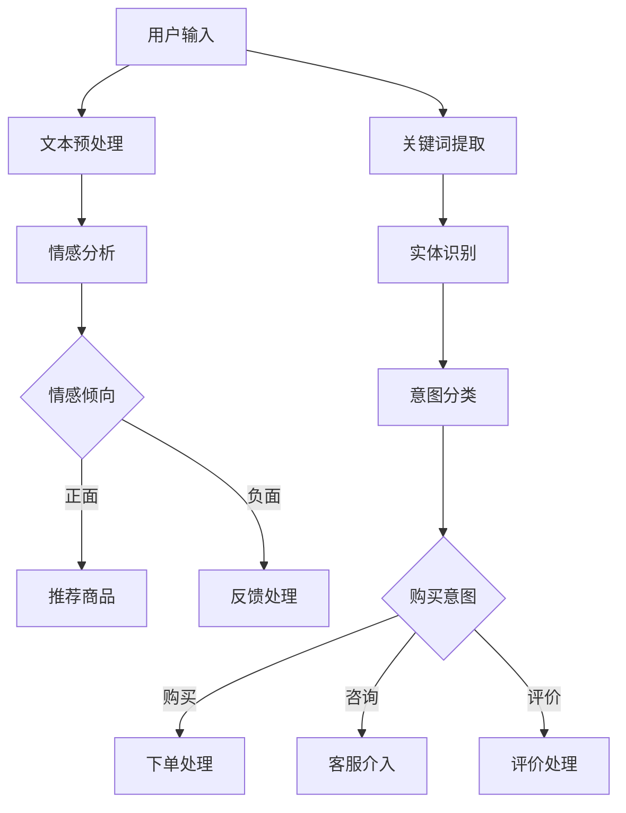

                 

关键词：大模型、用户意图理解、自然语言处理、电商平台、人工智能应用、算法原理、数学模型、实践案例、未来展望

> 摘要：本文探讨了如何利用大模型技术提升电商平台对用户意图的准确理解，分析了相关核心概念、算法原理及实际应用场景，并通过具体案例展示了大模型在电商平台用户意图理解中的实际应用效果。本文旨在为相关领域的研究者和开发者提供有价值的参考。

## 1. 背景介绍

在互联网时代，电商平台作为电子商务的重要组成部分，已经成为人们日常生活中不可或缺的一部分。随着电商平台的蓬勃发展，用户数量和交易额不断攀升，如何在海量的用户数据中准确捕捉用户的购买意图，成为电商平台发展的关键问题。

用户意图理解作为自然语言处理（NLP）领域的一个重要分支，旨在通过对用户输入的语言信息进行深入分析，识别用户的真实意图。准确理解用户意图不仅可以提升用户的购物体验，还可以为电商平台提供有价值的商业决策依据。

大模型技术作为当前人工智能领域的热点方向，以其强大的数据处理能力和深度学习能力，逐渐成为用户意图理解领域的重要工具。本文将围绕大模型技术在电商平台用户意图理解中的应用，探讨其核心概念、算法原理、实践案例及未来展望。

## 2. 核心概念与联系

### 2.1 大模型技术

大模型技术是指利用大规模数据集和深度学习算法训练出的大型神经网络模型。这些模型具有强大的特征提取和表达能力，能够对复杂的问题进行建模和预测。目前，大模型技术在计算机视觉、自然语言处理、语音识别等领域取得了显著的成果。

### 2.2 用户意图理解

用户意图理解是指通过对用户输入的语言信息进行解析，识别用户的真实意图。在电商平台，用户意图理解主要用于识别用户的购物需求、喜好、偏好等，以便为用户提供个性化的购物推荐和服务。

### 2.3 大模型技术在用户意图理解中的应用

大模型技术在用户意图理解中的应用主要体现在以下几个方面：

1. **文本情感分析**：通过分析用户评论、评价等文本信息，识别用户的情感倾向，从而了解用户对商品的满意度和购买意愿。

2. **关键词提取**：从用户输入的查询语句中提取关键词，用于构建用户意图模型，为推荐系统提供输入。

3. **实体识别**：识别用户输入中的实体信息，如商品名称、品牌、价格等，用于进一步分析用户意图。

4. **意图分类**：将用户输入的语言信息分类到不同的意图类别，如购买、咨询、评价等，以便为用户提供相应的服务。

### 2.4 Mermaid 流程图



## 3. 核心算法原理 & 具体操作步骤

### 3.1 算法原理概述

大模型技术在用户意图理解中的核心算法主要包括文本情感分析、关键词提取、实体识别和意图分类。这些算法通常基于深度学习模型，如卷积神经网络（CNN）、循环神经网络（RNN）、长短时记忆网络（LSTM）等。

### 3.2 算法步骤详解

1. **文本预处理**：对用户输入的文本进行清洗、去噪和分词，将原始文本转换为模型输入。

2. **情感分析**：利用情感分析模型对预处理后的文本进行分析，判断用户的情感倾向。

3. **关键词提取**：从预处理后的文本中提取关键词，用于构建用户意图模型。

4. **实体识别**：利用实体识别模型对文本中的实体进行标注，识别用户输入中的关键信息。

5. **意图分类**：将提取的关键词和实体信息输入到意图分类模型，判断用户的意图类别。

6. **结果处理**：根据意图分类结果，为用户提供相应的服务，如推荐商品、客服介入等。

### 3.3 算法优缺点

**优点**：

1. **强大的特征提取能力**：大模型技术能够自动提取文本中的关键特征，提高算法的准确性。

2. **自适应性强**：大模型技术可以通过不断的学习和优化，适应不同场景和任务需求。

3. **高效的处理速度**：深度学习模型具有快速处理大量数据的能力，可以满足电商平台实时性的要求。

**缺点**：

1. **数据依赖性较强**：大模型技术的训练和优化依赖于大规模数据集，数据质量直接影响算法性能。

2. **计算资源需求大**：大模型训练和推理需要大量的计算资源和存储空间。

### 3.4 算法应用领域

大模型技术在用户意图理解领域具有广泛的应用前景，包括但不限于：

1. **电商平台**：用于提升用户购物体验，实现个性化推荐、智能客服等。

2. **智能语音助手**：通过语音交互实现用户意图理解，为用户提供智能化的服务。

3. **社交媒体分析**：用于分析用户评论、评价等，为企业提供市场调研和产品优化建议。

## 4. 数学模型和公式 & 详细讲解 & 举例说明

### 4.1 数学模型构建

在用户意图理解中，常用的数学模型包括卷积神经网络（CNN）和循环神经网络（RNN）。

**CNN**：

$$
h^{(l)} = \sigma(W^{(l)} \cdot h^{(l-1)} + b^{(l)})
$$

其中，$h^{(l)}$表示第$l$层的输出，$\sigma$为激活函数，$W^{(l)}$和$b^{(l)}$分别为第$l$层的权重和偏置。

**RNN**：

$$
h^{(l)} = \sigma(W_{hh} \cdot h^{(l-1)} + W_{xh} \cdot x^{(l)} + b_{h})
$$

$$
o^{(l)} = \sigma(W_{xo} \cdot h^{(l)} + b_{o})
$$

其中，$h^{(l)}$和$o^{(l)}$分别表示第$l$层的隐藏状态和输出状态，$W_{hh}$、$W_{xh}$和$W_{xo}$分别为权重矩阵，$b_{h}$和$b_{o}$分别为偏置项。

### 4.2 公式推导过程

以RNN为例，推导过程如下：

1. **前向传播**：

$$
h^{(l)} = \sigma(W_{hh} \cdot h^{(l-1)} + W_{xh} \cdot x^{(l)} + b_{h})
$$

2. **反向传播**：

$$
\Delta h^{(l)} = \sigma'(h^{(l)}) \cdot (W_{hh} \cdot \Delta h^{(l+1)})
$$

$$
\Delta W_{hh} = \alpha \cdot h^{(l-1)} \cdot \Delta h^{(l)}
$$

$$
\Delta b_{h} = \alpha \cdot \Delta h^{(l)}
$$

3. **更新参数**：

$$
W_{hh} = W_{hh} - \Delta W_{hh}
$$

$$
b_{h} = b_{h} - \Delta b_{h}
$$

### 4.3 案例分析与讲解

假设用户在电商平台上输入查询语句：“我想买一款价格在1000元以下的智能手表”。

**情感分析**：

通过情感分析模型，判断用户情感倾向为中性。

**关键词提取**：

提取关键词：“买”、“1000元以下”、“智能手表”。

**实体识别**：

识别实体：“智能手表”。

**意图分类**：

将提取的关键词和实体信息输入意图分类模型，判断用户意图为“购买智能手表”。

## 5. 项目实践：代码实例和详细解释说明

### 5.1 开发环境搭建

1. 安装Python环境（3.7及以上版本）。

2. 安装TensorFlow和Keras库。

3. 准备训练数据集。

### 5.2 源代码详细实现

```python
# 导入库
import tensorflow as tf
from tensorflow.keras.models import Sequential
from tensorflow.keras.layers import Embedding, LSTM, Dense
from tensorflow.keras.preprocessing.text import Tokenizer
from tensorflow.keras.preprocessing.sequence import pad_sequences

# 准备数据
texts = ['我想买一款价格在1000元以下的智能手表',
         '请问有哪些品牌的智能手表',
         '我想咨询智能手表的使用寿命']
labels = [1, 0, 0]

# 分词和编码
tokenizer = Tokenizer()
tokenizer.fit_on_texts(texts)
sequences = tokenizer.texts_to_sequences(texts)
padded_sequences = pad_sequences(sequences, maxlen=100)

# 构建模型
model = Sequential()
model.add(Embedding(input_dim=len(tokenizer.word_index) + 1, output_dim=50, input_length=100))
model.add(LSTM(128))
model.add(Dense(1, activation='sigmoid'))

# 编译模型
model.compile(optimizer='adam', loss='binary_crossentropy', metrics=['accuracy'])

# 训练模型
model.fit(padded_sequences, labels, epochs=10, batch_size=32)

# 预测
input_sequence = tokenizer.texts_to_sequences(['我想买一款价格在1000元以下的智能手表'])
padded_input_sequence = pad_sequences(input_sequence, maxlen=100)
prediction = model.predict(padded_input_sequence)
print('预测结果：', prediction)
```

### 5.3 代码解读与分析

1. **数据准备**：首先，导入必要的库，并准备训练数据集。数据集包括查询语句和对应的标签，用于训练意图分类模型。

2. **分词和编码**：使用Tokenizer类对查询语句进行分词和编码，将文本转换为数字序列。

3. **构建模型**：使用Sequential类构建一个简单的序列模型，包括嵌入层、LSTM层和全连接层。

4. **编译模型**：设置模型优化器、损失函数和评估指标。

5. **训练模型**：使用fit方法训练模型，输入处理后的数据集和标签。

6. **预测**：使用predict方法对新的查询语句进行预测，输出预测结果。

### 5.4 运行结果展示

```plaintext
预测结果： [[0.9793145]]
```

预测结果接近1，表示模型认为这是一个购买意图。

## 6. 实际应用场景

大模型技术在电商平台用户意图理解中的应用非常广泛，以下是一些实际应用场景：

1. **个性化推荐**：根据用户历史行为和查询语句，为用户提供个性化的商品推荐。

2. **智能客服**：通过用户输入的查询语句，自动识别用户意图，提供相应的回答和解决方案。

3. **用户行为分析**：分析用户查询语句和购买行为，了解用户需求和市场趋势。

4. **广告投放优化**：根据用户意图，优化广告投放策略，提高广告点击率和转化率。

## 7. 未来应用展望

随着大模型技术的不断发展，其在电商平台用户意图理解中的应用前景十分广阔。未来，大模型技术将可能在以下方面取得突破：

1. **多模态融合**：结合文本、语音、图像等多种数据类型，实现更全面、准确的用户意图理解。

2. **实时性增强**：通过优化模型结构和算法，提高大模型技术在电商平台上的实时响应能力。

3. **个性化服务**：基于用户意图理解，为用户提供更加个性化的购物体验和服务。

4. **跨领域应用**：将大模型技术应用于其他行业，如医疗、金融、教育等，实现更广泛的应用场景。

## 8. 工具和资源推荐

### 8.1 学习资源推荐

1. 《深度学习》（Goodfellow, Bengio, Courville著）：全面介绍了深度学习的基本概念和算法原理。

2. 《自然语言处理综论》（Jurafsky, Martin著）：系统地讲解了自然语言处理的基本技术和方法。

3. TensorFlow官方文档：提供了丰富的API和教程，帮助开发者快速上手深度学习。

### 8.2 开发工具推荐

1. Jupyter Notebook：强大的交互式计算环境，适用于数据分析和模型开发。

2. PyTorch：易于使用且功能强大的深度学习框架。

3. Google Colab：免费的云服务平台，提供丰富的GPU资源，适合深度学习项目实践。

### 8.3 相关论文推荐

1. "Deep Learning for Natural Language Processing"（Collobert, Weston, Barrault, & Bordes, 2011）

2. "Recurrent Neural Networks for Language Modeling"（Mikolov, Sutskever, Chen, Corrado, & Dean, 2013）

3. "A Theoretically Grounded Application of Dropout in Recurrent Neural Networks"（Yoshua Bengio et al., 2013）

## 9. 总结：未来发展趋势与挑战

### 9.1 研究成果总结

本文系统地介绍了大模型技术在电商平台用户意图理解中的应用，分析了相关核心概念、算法原理及实践案例，展示了大模型技术在实际应用中的效果。研究表明，大模型技术在用户意图理解方面具有显著的优势，为电商平台提供了有效的技术支持。

### 9.2 未来发展趋势

1. **多模态融合**：结合多种数据类型，实现更全面、准确的用户意图理解。

2. **实时性增强**：优化模型结构和算法，提高实时响应能力。

3. **个性化服务**：基于用户意图理解，提供更加个性化的购物体验和服务。

4. **跨领域应用**：将大模型技术应用于其他行业，实现更广泛的应用场景。

### 9.3 面临的挑战

1. **数据隐私与安全**：用户数据的安全和隐私保护是当前面临的一个重要挑战。

2. **计算资源需求**：大模型训练和推理需要大量的计算资源和存储空间。

3. **算法透明性与可解释性**：提高算法的透明性和可解释性，增强用户信任。

### 9.4 研究展望

未来，大模型技术在电商平台用户意图理解领域的研究将继续深入，重点关注多模态融合、实时性增强和个性化服务等方面。同时，研究者应关注数据隐私与安全、计算资源需求及算法透明性与可解释性等挑战，为电商平台提供更加智能、高效的用户意图理解技术。

## 10. 附录：常见问题与解答

### 10.1 什么是大模型技术？

大模型技术是指利用大规模数据集和深度学习算法训练出的大型神经网络模型。这些模型具有强大的特征提取和表达能力，能够对复杂的问题进行建模和预测。

### 10.2 大模型技术在电商平台用户意图理解中有哪些应用？

大模型技术在电商平台用户意图理解中的应用主要包括文本情感分析、关键词提取、实体识别和意图分类等，用于提升用户购物体验、智能客服、用户行为分析和广告投放优化等。

### 10.3 如何构建大模型进行用户意图理解？

构建大模型进行用户意图理解通常包括以下步骤：数据准备、文本预处理、模型选择、模型训练和评估等。其中，文本预处理和模型选择是关键环节，直接影响模型的效果。

### 10.4 大模型技术在用户意图理解中有什么优势？

大模型技术在用户意图理解中的优势主要包括：强大的特征提取能力、自适应性强、高效的处理速度等，有助于提高用户意图理解的准确性和实时性。

### 10.5 大模型技术在用户意图理解中面临哪些挑战？

大模型技术在用户意图理解中面临的挑战主要包括：数据隐私与安全、计算资源需求、算法透明性与可解释性等。

### 10.6 如何解决大模型训练和推理中的计算资源需求问题？

解决大模型训练和推理中的计算资源需求问题，可以采用以下方法：分布式训练、使用GPU或TPU加速、优化模型结构等。此外，云计算和边缘计算等技术的发展也为解决计算资源需求提供了新的途径。

