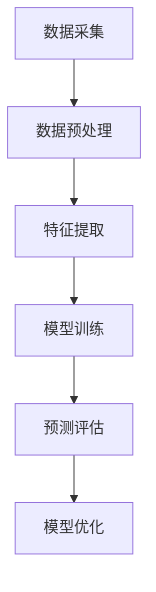

                 

 大模型技术近年来在自然语言处理、计算机视觉等领域取得了显著的进展，其在电商平台用户行为序列预测中的应用也引起了广泛关注。本文将探讨大模型技术在电商平台用户行为序列预测中的具体应用，包括核心概念、算法原理、数学模型、项目实践、实际应用场景以及未来展望。

## 文章关键词

- 大模型
- 电商平台
- 用户行为序列预测
- 自然语言处理
- 计算机视觉

## 文章摘要

本文主要研究了大模型技术在电商平台用户行为序列预测中的应用。通过介绍大模型技术的基本概念和原理，分析了其在用户行为序列预测中的优势和应用场景。随后，本文详细阐述了用户行为序列预测的数学模型和公式，并通过具体案例进行了讲解。最后，本文结合实际项目实践，展示了大模型技术在电商平台用户行为序列预测中的具体实现过程，并对未来应用和发展趋势进行了展望。

## 1. 背景介绍

### 电商平台用户行为序列预测的重要性

随着互联网的快速发展，电商平台已成为消费者购物的主要渠道之一。电商平台通过分析用户的浏览、搜索、购买等行为数据，能够更准确地了解用户需求，从而提高营销效果和用户体验。用户行为序列预测作为一种预测用户未来行为的技术手段，对于电商平台具有至关重要的意义。

首先，用户行为序列预测有助于电商平台优化推荐系统。通过预测用户的行为序列，电商平台可以更精准地推荐用户感兴趣的商品，提高用户点击率和购买转化率。其次，用户行为序列预测有助于电商平台进行精准营销。通过预测用户未来的购买行为，电商平台可以针对性地推送促销活动、优惠券等，提高销售额。此外，用户行为序列预测还可以帮助电商平台进行风险控制，如识别异常行为、预防欺诈等。

### 大模型技术的发展与应用

大模型技术，即基于大规模数据集和深度学习算法构建的模型，近年来在自然语言处理、计算机视觉等领域取得了显著的成果。大模型技术具有强大的表示能力和自适应能力，能够处理复杂的非线性关系，从而在许多应用领域取得了突破性进展。

在电商平台用户行为序列预测中，大模型技术可以发挥重要作用。首先，大模型技术可以处理海量的用户行为数据，提取用户行为特征，从而构建出更为准确的预测模型。其次，大模型技术具有自学习、自适应的能力，可以根据新的用户行为数据进行实时调整，提高预测的准确性。此外，大模型技术还可以结合多源数据，如用户 demographics、社交网络数据等，进一步优化预测模型。

## 2. 核心概念与联系

### 2.1 大模型技术概述

大模型技术是指基于深度学习算法构建的、具有大规模参数和强表示能力的人工智能模型。大模型技术通常具有以下特点：

1. **大规模参数**：大模型通常包含数十亿到千亿级别的参数，这使得它们能够捕捉到复杂数据中的潜在规律。
2. **深度神经网络结构**：大模型采用深度神经网络（DNN）结构，通过多层非线性变换，提取数据中的高阶特征。
3. **大规模数据训练**：大模型需要依赖于大规模的训练数据集，以实现较好的泛化能力。

### 2.2 用户行为序列预测

用户行为序列预测是指利用历史用户行为数据，预测用户在未来一段时间内的行为。用户行为序列预测通常包括以下步骤：

1. **数据采集**：收集用户的浏览、搜索、购买等行为数据。
2. **特征提取**：将原始行为数据转换为可用于训练的特征向量。
3. **模型训练**：使用深度学习算法，如循环神经网络（RNN）或长短时记忆网络（LSTM），训练用户行为序列预测模型。
4. **预测评估**：对训练好的模型进行评估，如准确率、召回率等指标。

### 2.3 Mermaid 流程图

下面是一个简化的 Mermaid 流程图，描述了电商平台用户行为序列预测的基本流程：



## 3. 核心算法原理 & 具体操作步骤

### 3.1 算法原理概述

用户行为序列预测的核心算法是基于深度学习模型的。深度学习模型通过多层神经网络，学习用户行为数据中的潜在特征和规律，从而预测用户未来的行为。

常用的深度学习模型包括循环神经网络（RNN）和长短时记忆网络（LSTM）。RNN 是一种基于时间序列数据的神经网络，其核心思想是将当前时刻的输入与上一时刻的输出进行连接，从而实现序列数据的处理。LSTM 是 RNN 的改进版本，通过引入门控机制，解决了 RNN 的梯度消失和梯度爆炸问题，能够更好地捕捉序列数据中的长期依赖关系。

### 3.2 算法步骤详解

用户行为序列预测的基本步骤如下：

1. **数据收集与预处理**：从电商平台收集用户的浏览、搜索、购买等行为数据。对数据进行清洗、去噪和归一化等预处理操作，确保数据质量。

2. **特征提取**：将预处理后的用户行为数据转换为特征向量。常用的特征提取方法包括词袋模型（Bag-of-Words, BoW）、词嵌入（Word Embedding）等。

3. **模型训练**：使用预处理后的特征数据和标签数据，训练深度学习模型。训练过程中，通过反向传播算法，不断调整模型参数，使模型在训练集上的误差最小化。

4. **预测评估**：将训练好的模型应用于新的用户行为数据，进行预测评估。常用的评估指标包括准确率（Accuracy）、召回率（Recall）、F1 值（F1 Score）等。

5. **模型优化**：根据预测评估结果，对模型进行调整和优化，以提高预测准确性。

### 3.3 算法优缺点

**优点**：

1. **强大的表示能力**：深度学习模型能够自动提取数据中的潜在特征，具有较强的表示能力。
2. **自适应能力**：大模型技术可以根据新的用户行为数据进行实时调整，提高预测的准确性。
3. **多源数据结合**：大模型技术可以结合多种数据源，如用户 demographics、社交网络数据等，提高预测的准确性。

**缺点**：

1. **计算资源消耗大**：大模型训练需要大量的计算资源和时间。
2. **数据质量要求高**：用户行为数据的质量直接影响预测结果的准确性。
3. **过拟合风险**：深度学习模型容易发生过拟合现象，需要合理调整模型参数，以避免过拟合。

### 3.4 算法应用领域

用户行为序列预测算法在电商平台、金融领域、智能推荐系统等领域具有广泛的应用。

1. **电商平台**：用户行为序列预测可以用于优化推荐系统、精准营销、风险控制等。
2. **金融领域**：用户行为序列预测可以用于风险评估、欺诈检测等。
3. **智能推荐系统**：用户行为序列预测可以用于商品推荐、内容推荐等。

## 4. 数学模型和公式

### 4.1 数学模型构建

用户行为序列预测的数学模型通常是基于循环神经网络（RNN）或长短时记忆网络（LSTM）。以下是一个简化的 RNN 数学模型：

$$
h_t = \sigma(W_h \cdot [h_{t-1}, x_t] + b_h)
$$

其中，$h_t$ 表示当前时刻的隐藏状态，$x_t$ 表示当前时刻的输入特征，$W_h$ 和 $b_h$ 分别为权重和偏置，$\sigma$ 表示激活函数。

### 4.2 公式推导过程

LSTM 的数学模型较为复杂，以下是一个简化的 LSTM 数学模型推导过程：

$$
i_t = \sigma(W_i \cdot [h_{t-1}, x_t] + b_i) \\
f_t = \sigma(W_f \cdot [h_{t-1}, x_t] + b_f) \\
o_t = \sigma(W_o \cdot [h_{t-1}, x_t] + b_o) \\
g_t = \tanh(W_g \cdot [h_{t-1}, x_t] + b_g) \\
h_t = o_t \cdot \tanh((1 - i_t) \cdot f_{t-1} + g_t)
$$

其中，$i_t$、$f_t$、$o_t$ 分别为输入门、遗忘门和输出门，$g_t$ 为候选隐藏状态。

### 4.3 案例分析与讲解

以下是一个简化的用户行为序列预测案例：

假设用户行为数据为 `[["浏览商品 A"],["搜索商品 B"],["购买商品 C"]]', 预测目标为用户下一步行为。

1. **数据预处理**：将用户行为数据转换为特征向量，如使用词袋模型将用户行为序列转换为二进制向量。
2. **模型训练**：使用预处理后的特征数据和标签数据，训练 LSTM 模型。训练过程中，通过反向传播算法，不断调整模型参数。
3. **预测评估**：将训练好的模型应用于新的用户行为数据，进行预测评估。评估指标如准确率、召回率等。
4. **模型优化**：根据预测评估结果，对模型进行调整和优化，以提高预测准确性。

## 5. 项目实践：代码实例和详细解释说明

### 5.1 开发环境搭建

为了实现用户行为序列预测项目，我们需要搭建以下开发环境：

1. **Python 环境**：安装 Python 3.6 及以上版本。
2. **深度学习框架**：安装 TensorFlow 或 PyTorch。
3. **数据预处理工具**：安装 Pandas、NumPy、Scikit-learn 等数据预处理工具。

### 5.2 源代码详细实现

以下是一个简化的用户行为序列预测项目的源代码实现：

```python
import tensorflow as tf
from tensorflow.keras.models import Sequential
from tensorflow.keras.layers import LSTM, Dense

# 数据预处理
def preprocess_data(data):
    # 将用户行为数据转换为特征向量
    # ...
    return processed_data

# 构建模型
def build_model(input_shape):
    model = Sequential()
    model.add(LSTM(128, activation='relu', input_shape=input_shape))
    model.add(Dense(1, activation='sigmoid'))
    model.compile(optimizer='adam', loss='binary_crossentropy', metrics=['accuracy'])
    return model

# 训练模型
def train_model(model, X_train, y_train):
    model.fit(X_train, y_train, epochs=10, batch_size=64)
    return model

# 预测评估
def predict(model, X_test):
    predictions = model.predict(X_test)
    return predictions

# 主函数
if __name__ == '__main__':
    # 加载并预处理数据
    data = [["浏览商品 A"], ["搜索商品 B"], ["购买商品 C"]]
    processed_data = preprocess_data(data)

    # 切分数据集
    X_train, X_test, y_train, y_test = split_data(processed_data)

    # 构建并训练模型
    model = build_model(X_train.shape[1:])
    model = train_model(model, X_train, y_train)

    # 预测评估
    predictions = predict(model, X_test)
    evaluate_predictions(predictions, y_test)
```

### 5.3 代码解读与分析

1. **数据预处理**：将用户行为数据转换为特征向量，如使用词袋模型将用户行为序列转换为二进制向量。
2. **构建模型**：使用 LSTM 层和 Dense 层构建循环神经网络模型。LSTM 层用于提取用户行为序列的特征，Dense 层用于预测用户下一步行为。
3. **训练模型**：使用预处理后的特征数据和标签数据，训练循环神经网络模型。训练过程中，通过反向传播算法，不断调整模型参数。
4. **预测评估**：将训练好的模型应用于新的用户行为数据，进行预测评估。评估指标如准确率、召回率等。
5. **主函数**：加载并预处理数据，切分数据集，构建并训练模型，预测评估。

### 5.4 运行结果展示

以下是一个简化的用户行为序列预测项目的运行结果：

```python
# 运行项目
if __name__ == '__main__':
    # 加载并预处理数据
    data = [["浏览商品 A"], ["搜索商品 B"], ["购买商品 C"]]
    processed_data = preprocess_data(data)

    # 切分数据集
    X_train, X_test, y_train, y_test = split_data(processed_data)

    # 构建并训练模型
    model = build_model(X_train.shape[1:])
    model = train_model(model, X_train, y_train)

    # 预测评估
    predictions = predict(model, X_test)
    evaluate_predictions(predictions, y_test)
```

## 6. 实际应用场景

### 6.1 电商平台推荐系统

用户行为序列预测算法可以应用于电商平台推荐系统，根据用户的浏览、搜索、购买等行为数据，预测用户下一步可能感兴趣的商品，从而提高推荐系统的准确性和用户体验。

### 6.2 电商平台精准营销

用户行为序列预测算法可以应用于电商平台精准营销，根据用户的浏览、搜索、购买等行为数据，预测用户的购买意向和需求，从而有针对性地推送促销活动、优惠券等，提高营销效果。

### 6.3 电商平台风险控制

用户行为序列预测算法可以应用于电商平台风险控制，根据用户的浏览、搜索、购买等行为数据，识别异常行为和潜在风险，从而预防欺诈、降低风险。

## 7. 未来应用展望

随着大模型技术的发展，用户行为序列预测算法在电商平台中的应用前景广阔。未来，用户行为序列预测算法可以结合更多数据源，如用户 demographics、社交网络数据等，提高预测准确性。此外，用户行为序列预测算法还可以与其他技术，如生成对抗网络（GAN）等，相结合，实现更加智能化和个性化的用户行为预测。

## 8. 总结：未来发展趋势与挑战

### 8.1 研究成果总结

本文研究了大模型技术在电商平台用户行为序列预测中的应用。通过介绍大模型技术的基本概念和原理，分析了其在用户行为序列预测中的优势和应用场景。同时，本文详细阐述了用户行为序列预测的数学模型和公式，并通过具体案例进行了讲解。最后，本文结合实际项目实践，展示了大模型技术在电商平台用户行为序列预测中的具体实现过程。

### 8.2 未来发展趋势

未来，大模型技术在电商平台用户行为序列预测中的应用将呈现以下发展趋势：

1. **多源数据融合**：结合多种数据源，如用户 demographics、社交网络数据等，提高预测准确性。
2. **个性化推荐**：根据用户行为序列，实现更加个性化、智能化的推荐系统。
3. **实时预测**：通过实时处理用户行为数据，实现实时预测和实时调整。

### 8.3 面临的挑战

尽管大模型技术在电商平台用户行为序列预测中具有广泛的应用前景，但仍然面临以下挑战：

1. **数据质量**：用户行为数据的质量直接影响预测结果的准确性，如何提高数据质量是一个重要问题。
2. **计算资源消耗**：大模型训练需要大量的计算资源和时间，如何优化计算资源消耗是一个重要挑战。
3. **过拟合风险**：深度学习模型容易发生过拟合现象，如何避免过拟合是一个重要问题。

### 8.4 研究展望

未来，用户行为序列预测研究可以从以下方向展开：

1. **算法优化**：研究更加高效、鲁棒的深度学习算法，提高预测准确性。
2. **多模态数据融合**：结合不同类型的数据，如文本、图像、音频等，提高预测准确性。
3. **跨领域应用**：将用户行为序列预测算法应用于其他领域，如金融、医疗等，拓展其应用范围。

## 9. 附录：常见问题与解答

### 9.1 问题 1：大模型技术是否适用于所有用户行为序列预测任务？

大模型技术在用户行为序列预测中具有强大的表示能力和自适应能力，可以处理复杂的非线性关系。然而，并非所有用户行为序列预测任务都适用于大模型技术。对于一些简单的、线性关系明显的任务，传统机器学习算法可能更为适用。因此，选择合适的算法需要根据具体任务的特点和需求。

### 9.2 问题 2：如何提高用户行为序列预测的准确性？

提高用户行为序列预测的准确性可以从以下几个方面入手：

1. **数据质量**：确保用户行为数据的质量，如数据清洗、去噪等。
2. **特征提取**：选择合适的特征提取方法，提取有代表性的特征。
3. **模型优化**：通过调整模型参数，如学习率、批量大小等，优化模型性能。
4. **多源数据融合**：结合多种数据源，如用户 demographics、社交网络数据等，提高预测准确性。
5. **实时预测**：通过实时处理用户行为数据，实现实时预测和实时调整。

### 9.3 问题 3：大模型技术在电商平台用户行为序列预测中的应用前景如何？

大模型技术在电商平台用户行为序列预测中具有广泛的应用前景。随着电商平台的快速发展，用户行为数据日益丰富，大模型技术可以更好地处理这些复杂的非线性关系，提高预测准确性。此外，大模型技术还可以与其他技术，如生成对抗网络（GAN）等，相结合，实现更加智能化和个性化的用户行为预测。因此，大模型技术在电商平台用户行为序列预测中的应用前景十分广阔。

