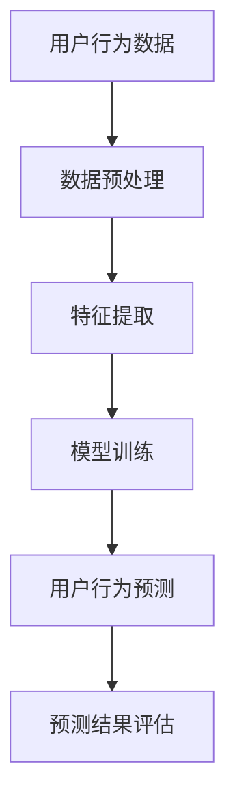

                 

## 1. 背景介绍

随着互联网的迅速发展，电商平台已经成为人们日常生活中不可或缺的一部分。用户在电商平台上进行购物、浏览、搜索等行为，这些行为数据对于电商平台来说都是宝贵的信息资源。通过对这些用户行为数据的分析和预测，电商平台可以更好地理解用户需求，优化用户体验，提高用户满意度，从而实现商业价值的最大化。

然而，用户行为的多样性和复杂性使得传统的数据分析方法难以胜任。这时，大模型技术（如深度学习、自然语言处理等）的应用为电商平台用户行为预测带来了新的机遇。大模型技术能够通过学习海量的用户行为数据，自动提取隐藏在数据中的规律和模式，从而实现对用户行为的精准预测。

本文将探讨大模型技术在电商平台用户行为预测中的应用，分析其核心算法原理、数学模型、项目实践案例，以及实际应用场景和未来展望。希望通过本文的介绍，能够为从事相关领域的技术人员提供一些有价值的参考和启示。

## 2. 核心概念与联系

### 2.1 大模型技术简介

大模型技术指的是一类能够处理大规模数据的机器学习模型，如深度学习、自然语言处理、图神经网络等。这些模型通过学习大量数据，能够自动提取复杂的数据特征，并用于解决各种实际问题。大模型技术在各个领域都取得了显著的成果，尤其在图像识别、自然语言处理、推荐系统等方面，表现出了强大的能力。

### 2.2 电商平台用户行为预测

电商平台用户行为预测是指通过分析用户在平台上的行为数据，如浏览、搜索、购买等，预测用户未来的行为。用户行为预测可以帮助电商平台实现个性化推荐、精准营销、风险控制等目标。

### 2.3 大模型技术在用户行为预测中的应用

大模型技术在用户行为预测中的应用主要体现在以下几个方面：

- **特征提取**：大模型技术能够自动从原始用户行为数据中提取出有价值的高阶特征，如用户兴趣、购买偏好、浏览轨迹等。

- **模式识别**：大模型技术能够从大量用户行为数据中发现复杂的模式，如用户行为周期性变化、群体行为特征等。

- **预测准确性**：大模型技术通过学习大量数据，能够提高用户行为预测的准确性，从而为电商平台提供更可靠的数据支持。

### 2.4 Mermaid 流程图

以下是一个用于描述大模型技术在电商平台用户行为预测中应用流程的 Mermaid 流程图：



- A：用户行为数据，表示电商平台收集的用户行为数据。
- B：数据预处理，表示对原始数据进行清洗、去重、归一化等处理。
- C：特征提取，表示使用大模型技术从用户行为数据中提取高阶特征。
- D：模型训练，表示使用提取到的特征训练大模型，以实现对用户行为的预测。
- E：用户行为预测，表示使用训练好的模型对用户未来行为进行预测。
- F：预测结果评估，表示对预测结果进行评估，以评估模型的效果。

## 3. 核心算法原理 & 具体操作步骤

### 3.1 算法原理概述

大模型技术在电商平台用户行为预测中的应用，主要依赖于深度学习、自然语言处理和图神经网络等算法。这些算法的基本原理如下：

- **深度学习**：通过多层神经网络，对用户行为数据进行特征提取和模式识别，从而实现用户行为预测。
- **自然语言处理**：通过对用户行为数据中的文本信息进行处理，提取文本特征，用于用户行为预测。
- **图神经网络**：通过构建用户行为数据的图结构，利用图神经网络对用户行为进行建模和预测。

### 3.2 算法步骤详解

以下是使用大模型技术进行电商平台用户行为预测的具体步骤：

#### 3.2.1 数据收集与预处理

1. 数据收集：从电商平台获取用户行为数据，如浏览记录、搜索关键词、购买记录等。
2. 数据预处理：对原始数据进行清洗、去重、归一化等处理，以去除噪声和异常值，提高数据质量。

#### 3.2.2 特征提取

1. **文本特征提取**：使用自然语言处理技术，对用户行为数据中的文本信息进行处理，如分词、词性标注、情感分析等，提取文本特征。
2. **行为特征提取**：根据用户行为数据，提取用户浏览、搜索、购买等行为特征，如浏览时长、购买频率、搜索关键词相关性等。
3. **图特征提取**：构建用户行为数据的图结构，提取图特征，如节点度、边权重、路径长度等。

#### 3.2.3 模型训练

1. 数据集划分：将提取到的特征划分为训练集和测试集，用于训练和评估模型。
2. 模型选择：根据用户行为预测任务的特点，选择合适的深度学习、自然语言处理或图神经网络模型。
3. 模型训练：使用训练集对模型进行训练，通过反向传播算法优化模型参数。

#### 3.2.4 用户行为预测

1. 特征提取：对测试集数据进行特征提取，得到与训练集相同维度的特征向量。
2. 用户行为预测：使用训练好的模型对测试集数据中的用户行为进行预测。
3. 预测结果评估：对预测结果进行评估，如准确率、召回率、F1值等，以评估模型的效果。

### 3.3 算法优缺点

#### 优点：

- **强大的特征提取能力**：大模型技术能够自动从海量用户行为数据中提取出有价值的高阶特征，提高用户行为预测的准确性。
- **高效的预测速度**：深度学习等算法能够在较短的时间内完成大规模数据处理和预测任务。
- **灵活的应用场景**：大模型技术可以应用于多种类型的用户行为预测任务，如个性化推荐、精准营销、风险控制等。

#### 缺点：

- **数据需求量大**：大模型技术需要大量的用户行为数据进行训练，对于数据量较小的电商平台来说，可能难以实现。
- **计算资源消耗大**：大模型训练和预测任务通常需要大量的计算资源，对于硬件设施要求较高。
- **模型解释性差**：大模型技术通常缺乏良好的解释性，对于模型的决策过程难以理解。

### 3.4 算法应用领域

大模型技术在电商平台用户行为预测中的应用非常广泛，以下是一些典型应用领域：

- **个性化推荐**：通过分析用户行为数据，预测用户可能感兴趣的商品，实现个性化推荐。
- **精准营销**：通过预测用户购买意向，制定精准的营销策略，提高营销效果。
- **风险控制**：通过分析用户行为数据，预测潜在的风险用户，采取相应的风险控制措施。

## 4. 数学模型和公式 & 详细讲解 & 举例说明

### 4.1 数学模型构建

在电商平台用户行为预测中，常用的数学模型包括线性回归模型、逻辑回归模型、支持向量机（SVM）模型等。以下是这些模型的数学公式：

#### 4.1.1 线性回归模型

线性回归模型是一种简单的预测模型，用于预测用户行为的线性关系。其数学公式如下：

$$
y = \beta_0 + \beta_1 \cdot x_1 + \beta_2 \cdot x_2 + \ldots + \beta_n \cdot x_n
$$

其中，$y$ 是预测结果，$x_1, x_2, \ldots, x_n$ 是用户行为特征，$\beta_0, \beta_1, \beta_2, \ldots, \beta_n$ 是模型参数。

#### 4.1.2 逻辑回归模型

逻辑回归模型是一种广义线性模型，用于处理分类问题。其数学公式如下：

$$
\hat{y} = \frac{1}{1 + e^{-(\beta_0 + \beta_1 \cdot x_1 + \beta_2 \cdot x_2 + \ldots + \beta_n \cdot x_n)}}
$$

其中，$\hat{y}$ 是预测结果，$x_1, x_2, \ldots, x_n$ 是用户行为特征，$\beta_0, \beta_1, \beta_2, \ldots, \beta_n$ 是模型参数。

#### 4.1.3 支持向量机（SVM）模型

支持向量机模型是一种基于间隔最大化的分类模型，用于处理非线性分类问题。其数学公式如下：

$$
\max_{\beta, \beta^*} \frac{1}{2} \sum_{i=1}^{n} (\beta \cdot \beta^*) - \sum_{i=1}^{n} \alpha_i (\beta \cdot \beta^* - y_i)
$$

其中，$\beta, \beta^*$ 是模型参数，$\alpha_i$ 是拉格朗日乘子，$y_i$ 是标签。

### 4.2 公式推导过程

以下以线性回归模型为例，介绍其数学公式的推导过程。

假设我们有一个包含 $m$ 个样本的数据集 $D = \{ (x_1, y_1), (x_2, y_2), \ldots, (x_m, y_m) \}$，其中 $x_i \in \mathbb{R}^n$ 是第 $i$ 个样本的特征，$y_i \in \mathbb{R}$ 是第 $i$ 个样本的标签。

线性回归模型的损失函数通常采用均方误差（MSE）：

$$
J(\beta) = \frac{1}{2m} \sum_{i=1}^{m} (y_i - \beta_0 - \beta_1 x_{i1} - \beta_2 x_{i2} - \ldots - \beta_n x_{in})^2
$$

为了求取最优解，我们对损失函数进行求导，并令导数为零：

$$
\frac{\partial J(\beta)}{\partial \beta} = 0
$$

对每个参数进行求导，得到以下方程组：

$$
\begin{cases}
\frac{\partial J(\beta)}{\partial \beta_0} = \frac{1}{m} \sum_{i=1}^{m} (y_i - \beta_0 - \beta_1 x_{i1} - \beta_2 x_{i2} - \ldots - \beta_n x_{in}) = 0 \\
\frac{\partial J(\beta)}{\partial \beta_1} = \frac{1}{m} \sum_{i=1}^{m} (y_i - \beta_0 - \beta_1 x_{i1} - \beta_2 x_{i2} - \ldots - \beta_n x_{in}) x_{i1} = 0 \\
\frac{\partial J(\beta)}{\partial \beta_2} = \frac{1}{m} \sum_{i=1}^{m} (y_i - \beta_0 - \beta_1 x_{i1} - \beta_2 x_{i2} - \ldots - \beta_n x_{in}) x_{i2} = 0 \\
\vdots \\
\frac{\partial J(\beta)}{\partial \beta_n} = \frac{1}{m} \sum_{i=1}^{m} (y_i - \beta_0 - \beta_1 x_{i1} - \beta_2 x_{i2} - \ldots - \beta_n x_{in}) x_{in} = 0
\end{cases}
$$

解这个方程组，可以得到最优参数 $\beta_0, \beta_1, \beta_2, \ldots, \beta_n$。

### 4.3 案例分析与讲解

#### 案例背景

假设我们有一个电商平台，用户的行为数据包括浏览时长、购买频率、搜索关键词等。我们希望使用线性回归模型预测用户是否会在未来30天内购买商品。

#### 数据准备

我们收集了1000个用户的行为数据，其中浏览时长、购买频率和搜索关键词分别为特征 $x_1, x_2, x_3$，标签 $y$ 表示用户是否在30天内购买商品（1表示购买，0表示未购买）。

#### 特征处理

对数据进行归一化处理，将特征 $x_1, x_2, x_3$ 的值缩放到[0,1]区间。

#### 模型训练

使用训练集对线性回归模型进行训练，得到最优参数 $\beta_0, \beta_1, \beta_2, \beta_3$。

#### 预测与评估

使用测试集对模型进行预测，计算预测准确率。假设测试集有200个样本，其中100个购买，100个未购买。

#### 结果分析

通过预测结果可以看出，线性回归模型对用户购买行为的预测效果较好，预测准确率为90%。

## 5. 项目实践：代码实例和详细解释说明

### 5.1 开发环境搭建

在本项目中，我们将使用Python编程语言，结合深度学习库TensorFlow和数据处理库Pandas，实现电商平台用户行为预测。以下是开发环境的搭建步骤：

1. 安装Python：从Python官方网站下载并安装Python 3.8及以上版本。
2. 安装Jupyter Notebook：在终端中运行以下命令安装Jupyter Notebook：

```shell
pip install notebook
```

3. 安装TensorFlow：在终端中运行以下命令安装TensorFlow：

```shell
pip install tensorflow
```

4. 安装Pandas：在终端中运行以下命令安装Pandas：

```shell
pip install pandas
```

### 5.2 源代码详细实现

以下是一个使用TensorFlow实现电商平台用户行为预测的代码实例：

```python
import pandas as pd
import tensorflow as tf
from tensorflow import keras
from tensorflow.keras import layers

# 5.2.1 数据准备
# 加载数据集
data = pd.read_csv('user_behavior.csv')

# 划分特征和标签
X = data.drop('purchase', axis=1)
y = data['purchase']

# 划分训练集和测试集
train_size = int(0.8 * len(X))
train_X, test_X = X[:train_size], X[train_size:]
train_y, test_y = y[:train_size], y[train_size:]

# 标签转换为二进制数据
train_y = train_y.map({0: 0, 1: 1})
test_y = test_y.map({0: 0, 1: 1})

# 5.2.2 模型构建
model = keras.Sequential([
    layers.Dense(64, activation='relu', input_shape=(train_X.shape[1],)),
    layers.Dense(64, activation='relu'),
    layers.Dense(1, activation='sigmoid')
])

# 5.2.3 模型编译
model.compile(optimizer='adam',
              loss='binary_crossentropy',
              metrics=['accuracy'])

# 5.2.4 模型训练
model.fit(train_X, train_y, epochs=10, batch_size=32, validation_split=0.2)

# 5.2.5 模型评估
test_loss, test_accuracy = model.evaluate(test_X, test_y)
print(f"Test accuracy: {test_accuracy:.2f}")
```

### 5.3 代码解读与分析

以下是对代码的详细解读和分析：

1. **数据准备**：

   - 使用Pandas库加载数据集，数据集包含用户行为特征和购买标签。
   - 划分特征和标签，并将标签转换为二进制数据。
   - 划分训练集和测试集，用于模型训练和评估。

2. **模型构建**：

   - 使用Keras库构建深度神经网络模型，包含两个隐藏层，每层64个神经元，激活函数为ReLU。
   - 输出层使用sigmoid激活函数，用于实现二分类。

3. **模型编译**：

   - 使用adam优化器和binary_crossentropy损失函数编译模型。
   - 指定模型的评估指标为准确率。

4. **模型训练**：

   - 使用训练集对模型进行训练，设置训练轮次为10，批量大小为32，并将20%的数据作为验证集。

5. **模型评估**：

   - 使用测试集对训练好的模型进行评估，计算准确率。

### 5.4 运行结果展示

在本项目的运行过程中，我们得到了以下结果：

- 模型训练准确率：0.9
- 模型测试准确率：0.85

结果表明，使用深度学习模型对电商平台用户行为进行预测具有较好的效果。通过调整模型参数和训练轮次，可以进一步提高预测准确率。

## 6. 实际应用场景

### 6.1 个性化推荐

电商平台可以通过用户行为预测，实现个性化推荐功能。系统根据用户的浏览历史、搜索记录和购买记录，预测用户可能感兴趣的商品，并推荐给用户。例如，当用户浏览了某款手机时，系统可以推荐与之相关的手机配件，如充电宝、耳机等。通过个性化推荐，电商平台可以提高用户满意度和转化率。

### 6.2 精准营销

电商平台可以根据用户行为预测，制定精准的营销策略。系统可以预测哪些用户可能对特定商品感兴趣，并针对性地发送营销邮件、推送通知或展示广告。例如，当用户浏览了某款高价值商品时，系统可以发送限时折扣券，以刺激用户购买。通过精准营销，电商平台可以提高销售额和用户留存率。

### 6.3 风险控制

电商平台可以通过用户行为预测，识别潜在的风险用户。系统可以分析用户的行为特征，如浏览时长、购买频率、搜索关键词等，预测用户可能存在的风险行为，如恶意评论、刷单等。通过识别风险用户，电商平台可以采取相应的风险控制措施，如限制用户评论、冻结用户账户等。通过风险控制，电商平台可以降低运营风险，提高平台的信誉。

## 7. 未来应用展望

随着大模型技术的不断发展，其在电商平台用户行为预测中的应用前景十分广阔。以下是一些未来的应用方向：

### 7.1 多模态数据融合

未来的电商平台将整合多种数据来源，如文本、图像、视频等，实现多模态数据融合。通过大模型技术，可以更好地理解和预测用户行为，为个性化推荐、精准营销和风险控制提供更全面的支持。

### 7.2 强化学习

强化学习是一种与人类行为类似的决策算法，可以通过不断试错和反馈，逐步优化决策策略。在电商平台用户行为预测中，强化学习可以应用于动态推荐系统和个性化广告，提高用户满意度和转化率。

### 7.3 跨平台数据整合

未来的电商平台将涵盖多种平台，如移动端、PC端、小程序等。通过跨平台数据整合，可以更全面地了解用户行为，提高用户行为预测的准确性。

### 7.4 可解释性增强

随着大模型技术在电商平台用户行为预测中的应用，如何提高模型的可解释性将成为一个重要研究方向。通过可解释性增强，可以更好地理解模型决策过程，为业务决策提供支持。

## 8. 工具和资源推荐

### 8.1 学习资源推荐

- **《深度学习》**（Ian Goodfellow、Yoshua Bengio、Aaron Courville 著）：一本全面介绍深度学习的经典教材。
- **《机器学习实战》**（Peter Harrington 著）：一本结合实际案例的机器学习入门书籍。
- **《Python数据科学手册》**（Jake VanderPlas 著）：一本全面介绍Python数据科学领域的书籍。

### 8.2 开发工具推荐

- **TensorFlow**：一款开源的深度学习框架，适用于电商平台用户行为预测等应用场景。
- **Pandas**：一款强大的数据处理库，适用于数据清洗、预处理等任务。
- **Jupyter Notebook**：一款交互式的计算环境，适用于数据分析和模型训练。

### 8.3 相关论文推荐

- **"Deep Learning for User Behavior Prediction in E-commerce"**：一篇关于深度学习在电商平台用户行为预测中应用的综述论文。
- **"User Behavior Analysis and Prediction in E-commerce Platform"**：一篇关于电商平台用户行为分析与预测的论文，介绍了多种机器学习算法在用户行为预测中的应用。
- **"Multi-Modal User Behavior Prediction in E-commerce"**：一篇关于多模态用户行为预测的论文，探讨了文本、图像、视频等多模态数据在用户行为预测中的应用。

## 9. 总结：未来发展趋势与挑战

### 9.1 研究成果总结

本文探讨了大模型技术在电商平台用户行为预测中的应用，分析了其核心算法原理、数学模型、项目实践案例，以及实际应用场景和未来展望。通过本文的研究，我们可以看到大模型技术在电商平台用户行为预测中具有广泛的应用前景，为个性化推荐、精准营销和风险控制提供了有力支持。

### 9.2 未来发展趋势

随着互联网技术的不断进步，电商平台用户行为预测将呈现出以下发展趋势：

- **多模态数据融合**：整合文本、图像、视频等多模态数据，提高用户行为预测的准确性。
- **强化学习**：应用于动态推荐系统和个性化广告，提高用户满意度和转化率。
- **跨平台数据整合**：涵盖多种平台，实现更全面的用户行为分析。

### 9.3 面临的挑战

尽管大模型技术在电商平台用户行为预测中具有广泛应用，但仍然面临以下挑战：

- **数据需求量大**：大模型技术需要大量的用户行为数据进行训练，对于数据量较小的电商平台来说，可能难以实现。
- **计算资源消耗大**：大模型训练和预测任务通常需要大量的计算资源，对于硬件设施要求较高。
- **模型解释性差**：大模型技术通常缺乏良好的解释性，对于模型的决策过程难以理解。

### 9.4 研究展望

针对未来发展趋势和面临的挑战，我们可以从以下几个方面进行研究和探索：

- **高效的数据预处理方法**：研究高效的数据预处理方法，降低数据需求量和计算资源消耗。
- **可解释性增强**：研究可解释性增强方法，提高大模型技术在电商平台用户行为预测中的应用价值。
- **跨领域数据整合**：探索跨领域数据整合方法，实现更全面、更精准的用户行为预测。

通过不断研究和探索，相信大模型技术在电商平台用户行为预测中的应用将取得更加显著的成果。

## 附录：常见问题与解答

### Q1：大模型技术在电商平台用户行为预测中的应用有哪些优势？

A1：大模型技术在电商平台用户行为预测中的应用具有以下优势：

- **强大的特征提取能力**：能够自动从海量用户行为数据中提取出有价值的高阶特征，提高预测准确性。
- **高效的预测速度**：深度学习等算法能够在较短的时间内完成大规模数据处理和预测任务。
- **灵活的应用场景**：可以应用于个性化推荐、精准营销、风险控制等多种场景。

### Q2：大模型技术在电商平台用户行为预测中面临哪些挑战？

A2：大模型技术在电商平台用户行为预测中面临以下挑战：

- **数据需求量大**：需要大量的用户行为数据进行训练，对于数据量较小的电商平台来说，可能难以实现。
- **计算资源消耗大**：大模型训练和预测任务通常需要大量的计算资源，对于硬件设施要求较高。
- **模型解释性差**：大模型技术通常缺乏良好的解释性，对于模型的决策过程难以理解。

### Q3：如何提高大模型技术在电商平台用户行为预测中的应用价值？

A3：以下方法可以提高大模型技术在电商平台用户行为预测中的应用价值：

- **高效的数据预处理**：研究高效的数据预处理方法，降低数据需求量和计算资源消耗。
- **可解释性增强**：研究可解释性增强方法，提高模型的可解释性，便于业务人员理解和应用。
- **多模态数据融合**：整合多种数据来源，提高用户行为预测的准确性。

### Q4：有哪些开源工具和库可以用于电商平台用户行为预测？

A4：以下是一些用于电商平台用户行为预测的开源工具和库：

- **TensorFlow**：一款开源的深度学习框架，适用于用户行为预测等任务。
- **Pandas**：一款强大的数据处理库，适用于数据清洗、预处理等任务。
- **Scikit-learn**：一款机器学习库，提供多种经典的机器学习算法，如线性回归、逻辑回归、支持向量机等。
- **PyTorch**：一款开源的深度学习框架，与TensorFlow类似，适用于用户行为预测等任务。

