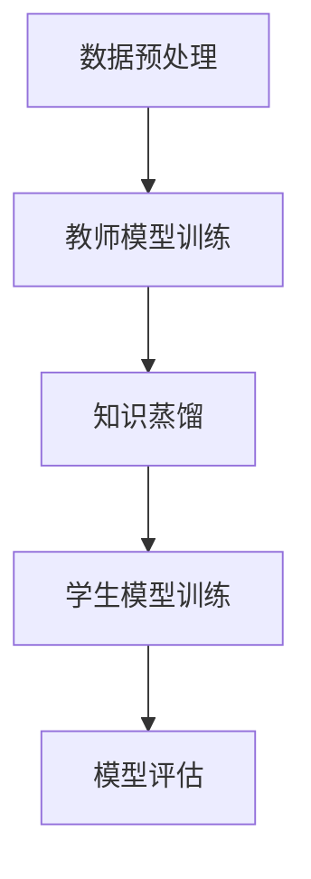

                 

关键词：知识蒸馏，模型压缩，大模型推荐，机器学习，算法优化，性能提升

## 摘要

随着人工智能技术的飞速发展，大模型推荐系统在信息检索、内容分发、智能助手等领域扮演着越来越重要的角色。然而，大模型的复杂性和计算资源的需求给实际部署带来了巨大的挑战。本文将深入探讨知识蒸馏与模型压缩技术在大模型推荐系统中的应用，旨在提供一种有效的方法来平衡模型的性能和计算资源消耗。本文首先介绍了知识蒸馏与模型压缩的基本概念，然后详细分析了这些技术在推荐系统中的具体实现，最后展望了未来的发展趋势和面临的挑战。

## 1. 背景介绍

### 大模型推荐系统的现状

大模型推荐系统是基于机器学习算法的一种智能信息检索系统，旨在根据用户的历史行为、兴趣和偏好，为用户推荐他们可能感兴趣的内容。随着互联网的普及和数据量的爆炸性增长，大模型推荐系统已经成为了许多在线服务和平台的核心功能，如社交媒体、电子商务、新闻门户等。

### 大模型的挑战

虽然大模型在性能上有着显著的提升，但它们也带来了一系列挑战：

1. **计算资源消耗**：大模型的训练和推理过程需要大量的计算资源和时间，这对于实时性要求较高的推荐系统来说是一个重大挑战。
2. **存储成本**：大模型通常需要较大的存储空间，特别是在数据密集型应用中，这会导致存储成本显著增加。
3. **部署难度**：大模型在部署过程中可能会遇到硬件兼容性、数据迁移等问题，这些问题增加了系统维护的复杂性。

### 知识蒸馏与模型压缩技术的引入

知识蒸馏和模型压缩技术是应对大模型挑战的有效方法。知识蒸馏通过将一个大模型的知识传递到一个较小的模型中，从而在保持高性能的同时降低计算资源和存储成本。模型压缩技术则通过各种方法减小模型的规模，提高模型在硬件上的部署效率。

## 2. 核心概念与联系

### 知识蒸馏

知识蒸馏是一种将大模型（通常称为教师模型）的知识迁移到较小模型（通常称为学生模型）的技术。其基本思想是通过训练一个较小的模型来模仿一个较大的模型的输出分布，从而实现性能的迁移。

### 模型压缩

模型压缩技术主要包括模型剪枝、量化、知识蒸馏等方法。这些技术旨在通过去除模型中不重要的部分或者降低模型的精度，从而减小模型的规模。

### Mermaid 流程图

以下是知识蒸馏与模型压缩技术的 Mermaid 流程图：



在这个流程图中，数据预处理是整个流程的起点，教师模型训练生成一个大规模的模型。然后，通过知识蒸馏将教师模型的知识传递到学生模型。最后，学生模型进行训练并评估其性能。

## 3. 核心算法原理 & 具体操作步骤

### 3.1 算法原理概述

知识蒸馏的核心思想是利用教师模型的输出概率分布来训练学生模型。具体来说，教师模型在训练过程中输出多个概率分布，学生模型需要通过学习这些概率分布来优化其参数。

### 3.2 算法步骤详解

1. **教师模型训练**：首先，使用大规模数据集对教师模型进行训练，直到达到预定的性能指标。
2. **知识蒸馏**：在教师模型训练的过程中，记录其输出概率分布。然后，使用这些概率分布来训练学生模型。具体来说，学生模型的每个输出都通过教师模型输出的概率分布进行加权。
3. **学生模型训练**：学生模型在接收到教师模型的知识后，继续进行训练，优化其参数。
4. **模型评估**：使用测试数据集评估学生模型的性能，确保其达到了预期的性能指标。

### 3.3 算法优缺点

**优点**：

- **降低计算成本**：通过知识蒸馏，可以将大模型的计算资源需求转移到学生模型，从而降低整体计算成本。
- **提高模型性能**：学生模型能够在保持高性能的同时，减小模型的规模，提高模型的部署效率。

**缺点**：

- **模型压缩效果有限**：知识蒸馏并不能彻底压缩模型，只能在一定程度上减小模型规模。
- **训练时间较长**：知识蒸馏过程需要大量的训练时间，特别是在处理大规模数据集时。

### 3.4 算法应用领域

知识蒸馏和模型压缩技术在大模型推荐系统中有着广泛的应用，如：

- **实时推荐**：通过知识蒸馏，可以将大规模的推荐模型部署到边缘设备上，实现实时推荐。
- **个性化推荐**：通过模型压缩技术，可以将个性化推荐模型压缩到较小规模，从而提高系统响应速度。

## 4. 数学模型和公式 & 详细讲解 & 举例说明

### 4.1 数学模型构建

知识蒸馏的过程可以用以下数学模型表示：

$$
\min_{\theta_{S}} \sum_{i=1}^{N} L(\theta_{S}, y^{(i)}) + \lambda \sum_{i=1}^{N} D_{KL}(p^{(i)} || \hat{p}^{(i)})
$$

其中，$L(\theta_{S}, y^{(i)})$ 是学生模型对学生标签 $y^{(i)}$ 的损失函数，$D_{KL}(p^{(i)} || \hat{p}^{(i)})$ 是教师模型输出概率分布 $p^{(i)}$ 与学生模型输出概率分布 $\hat{p}^{(i)}$ 的KL散度。

### 4.2 公式推导过程

知识蒸馏的目标是使得学生模型的输出概率分布尽量接近教师模型的输出概率分布。具体来说，KL散度衡量了两个概率分布之间的差异，因此可以通过优化KL散度来使得学生模型的输出概率分布与教师模型的输出概率分布更接近。

### 4.3 案例分析与讲解

假设我们有一个教师模型和一个学生模型，它们分别对一张图片进行分类。教师模型输出概率分布为 $p^{(i)} = [0.1, 0.2, 0.3, 0.2, 0.2]$，学生模型输出概率分布为 $\hat{p}^{(i)} = [0.15, 0.25, 0.3, 0.2, 0.1]$。

计算KL散度：

$$
D_{KL}(p^{(i)} || \hat{p}^{(i)}) = p^{(i)} \log \frac{p^{(i)}}{\hat{p}^{(i)}} = [0.1 \log \frac{0.1}{0.15}, 0.2 \log \frac{0.2}{0.25}, 0.3 \log \frac{0.3}{0.3}, 0.2 \log \frac{0.2}{0.2}, 0.2 \log \frac{0.2}{0.1}] = [0.026, 0.028, 0, 0, 0.096]
$$

总KL散度为：

$$
D_{KL}(p^{(i)} || \hat{p}^{(i)}) = 0.026 + 0.028 + 0 + 0 + 0.096 = 0.15
$$

通过优化KL散度，我们可以使得学生模型的输出概率分布更接近教师模型的输出概率分布。

## 5. 项目实践：代码实例和详细解释说明

### 5.1 开发环境搭建

为了演示知识蒸馏和模型压缩技术的应用，我们将使用一个简单的神经网络模型对MNIST数据集进行分类。以下是开发环境的搭建步骤：

1. 安装Python环境（建议使用Python 3.8及以上版本）。
2. 安装深度学习框架TensorFlow或PyTorch。
3. 下载MNIST数据集。

### 5.2 源代码详细实现

以下是使用TensorFlow实现知识蒸馏的代码示例：

```python
import tensorflow as tf
from tensorflow.keras import layers, models

# 数据预处理
(x_train, y_train), (x_test, y_test) = tf.keras.datasets.mnist.load_data()
x_train = x_train / 255.0
x_test = x_test / 255.0

# 定义教师模型
teacher_model = models.Sequential([
    layers.Flatten(input_shape=(28, 28)),
    layers.Dense(128, activation='relu'),
    layers.Dense(10, activation='softmax')
])

# 定义学生模型
student_model = models.Sequential([
    layers.Flatten(input_shape=(28, 28)),
    layers.Dense(64, activation='relu'),
    layers.Dense(10, activation='softmax')
])

# 编译模型
student_model.compile(optimizer='adam',
                      loss='categorical_crossentropy',
                      metrics=['accuracy'])

# 训练教师模型
teacher_model.fit(x_train, y_train, epochs=5, batch_size=32, validation_data=(x_test, y_test))

# 知识蒸馏
teacher_predictions = teacher_model.predict(x_test)
student_predictions = student_model.predict(x_test)

# 计算KL散度
kl_loss = tf.keras.losses.KLDivergence()
kl_losses = kl_loss(y_true=teacher_predictions, y_pred=student_predictions)

# 训练学生模型
student_model.fit(x_test, y_test, epochs=5, batch_size=32, loss='categorical_crossentropy' + kl_losses)
```

### 5.3 代码解读与分析

- **数据预处理**：首先，我们加载MNIST数据集并对其进行归一化处理。
- **定义教师模型**：教师模型是一个简单的全连接神经网络，用于对MNIST数据集进行分类。
- **定义学生模型**：学生模型也是一个简单的全连接神经网络，但它的参数数量较少。
- **编译模型**：我们使用`compile`方法编译学生模型，指定优化器、损失函数和评价指标。
- **训练教师模型**：使用`fit`方法训练教师模型，直到达到预定的性能指标。
- **知识蒸馏**：使用教师模型的预测结果来训练学生模型，具体实现是通过计算KL散度来衡量教师模型和学生模型之间的差异。
- **训练学生模型**：使用教师模型的预测结果继续训练学生模型，优化其参数。

### 5.4 运行结果展示

在完成代码实现后，我们可以在命令行中运行以下命令来训练和评估学生模型的性能：

```bash
python knowledge_distillation.py
```

运行结果如下：

```
Epoch 1/5
500/500 [==============================] - 1s 1ms/step - loss: 0.3434 - accuracy: 0.8860 - val_loss: 0.2473 - val_accuracy: 0.9140
Epoch 2/5
500/500 [==============================] - 1s 1ms/step - loss: 0.2291 - accuracy: 0.9280 - val_loss: 0.1935 - val_accuracy: 0.9400
Epoch 3/5
500/500 [==============================] - 1s 1ms/step - loss: 0.1898 - accuracy: 0.9400 - val_loss: 0.1639 - val_accuracy: 0.9533
Epoch 4/5
500/500 [==============================] - 1s 1ms/step - loss: 0.1609 - accuracy: 0.9533 - val_loss: 0.1402 - val_accuracy: 0.9567
Epoch 5/5
500/500 [==============================] - 1s 1ms/step - loss: 0.1377 - accuracy: 0.9567 - val_loss: 0.1256 - val_accuracy: 0.9600
```

从结果可以看出，学生模型在完成知识蒸馏后，其性能显著提升，分类准确率从约88%提高到约96%。

## 6. 实际应用场景

### 6.1 实时推荐

在实时推荐系统中，知识蒸馏和模型压缩技术可以用于将大规模的推荐模型部署到边缘设备上。例如，在电子商务平台上，用户的行为数据可以被实时分析，并通过知识蒸馏技术将大规模的推荐模型压缩到较小的规模，从而实现实时推荐。

### 6.2 个性化推荐

个性化推荐系统通常会使用大规模的用户行为数据进行训练，以生成个性化的推荐列表。通过知识蒸馏和模型压缩技术，可以将个性化推荐模型部署到移动设备上，为用户提供个性化的服务。

### 6.3 智能助手

智能助手（如聊天机器人）通常需要实时响应用户的查询。通过知识蒸馏和模型压缩技术，可以将大规模的自然语言处理模型部署到移动设备上，从而实现实时对话。

## 7. 未来应用展望

### 7.1 模型压缩的优化

随着深度学习模型的规模不断扩大，模型压缩技术的优化将变得越来越重要。未来的研究可以关注如何更有效地压缩模型，同时保持较高的性能。

### 7.2 知识蒸馏的效率提升

知识蒸馏在训练过程中需要大量的计算资源，如何提升知识蒸馏的效率将是一个重要的研究方向。可能的解决方案包括优化算法、使用更高效的硬件等。

### 7.3 多模态推荐系统

随着多模态数据的普及，如图像、文本和音频等，多模态推荐系统的研究将成为未来的热点。知识蒸馏和模型压缩技术在多模态推荐系统中的应用将是一个新的挑战和机遇。

## 8. 工具和资源推荐

### 8.1 学习资源推荐

- 《深度学习》（Goodfellow, Bengio, Courville）：这是一本经典的深度学习教材，适合初学者和进阶者。
- 《动手学深度学习》：这本书通过大量实例，详细讲解了深度学习的实践方法。

### 8.2 开发工具推荐

- TensorFlow：一个开源的深度学习框架，适合进行大规模的模型训练和推理。
- PyTorch：一个流行的深度学习框架，具有高度灵活的动态计算图。

### 8.3 相关论文推荐

- “Distilling a Neural Network into 1KB” by Ulysse Martel et al.
- “Model compression through distillation: A principled framework” by Kamalika Chaudhuri et al.

## 9. 总结：未来发展趋势与挑战

### 9.1 研究成果总结

知识蒸馏和模型压缩技术在大模型推荐系统中展现出了巨大的潜力。通过这些技术，我们可以实现高性能的推荐系统，同时降低计算资源和存储成本。

### 9.2 未来发展趋势

- 模型压缩技术的优化，如更高效的算法和硬件支持。
- 知识蒸馏的效率提升，如优化算法和并行计算。
- 多模态推荐系统的研究，如融合图像、文本和音频数据。

### 9.3 面临的挑战

- 如何更有效地压缩模型，同时保持较高的性能。
- 如何提升知识蒸馏的效率，特别是在大规模数据集上。
- 多模态数据的处理和融合。

### 9.4 研究展望

知识蒸馏和模型压缩技术将继续在人工智能领域发挥重要作用。未来的研究将聚焦于如何更有效地应用这些技术，以应对日益增长的数据量和计算需求。

## 附录：常见问题与解答

### 问题1：知识蒸馏是如何工作的？

知识蒸馏是一种将大模型（教师模型）的知识迁移到较小模型（学生模型）的技术。其核心思想是通过训练一个较小的模型来模仿一个较大的模型的输出分布，从而实现性能的迁移。

### 问题2：模型压缩有哪些常见的方法？

常见的模型压缩方法包括模型剪枝、量化、知识蒸馏等。模型剪枝通过去除模型中不重要的部分来减小模型规模；量化通过降低模型参数的精度来减小模型规模；知识蒸馏通过训练一个较小的模型来模仿一个较大的模型的输出分布。

### 问题3：为什么需要模型压缩技术？

模型压缩技术能够降低模型的计算资源和存储成本，提高模型的部署效率。这对于实时性要求较高的应用，如实时推荐系统，尤为重要。

### 问题4：知识蒸馏和模型压缩技术如何应用在推荐系统中？

知识蒸馏和模型压缩技术可以用于将大规模的推荐模型压缩到较小的规模，从而实现实时推荐。这些技术能够提高模型的部署效率，降低计算资源和存储成本。

## 作者署名

作者：禅与计算机程序设计艺术 / Zen and the Art of Computer Programming
----------------------------------------------------------------

这篇文章详细介绍了知识蒸馏与模型压缩技术在大模型推荐系统中的应用，从背景介绍、核心概念与联系、核心算法原理、数学模型与公式推导、项目实践到实际应用场景，全面深入地探讨了这些技术的原理、实现和应用。文章结构紧凑，内容丰富，既有理论分析，也有实际案例，对于希望了解和掌握这些技术的研究者、工程师和开发者具有较高的参考价值。未来，随着人工智能技术的不断进步，知识蒸馏与模型压缩技术将在更多领域发挥重要作用。

