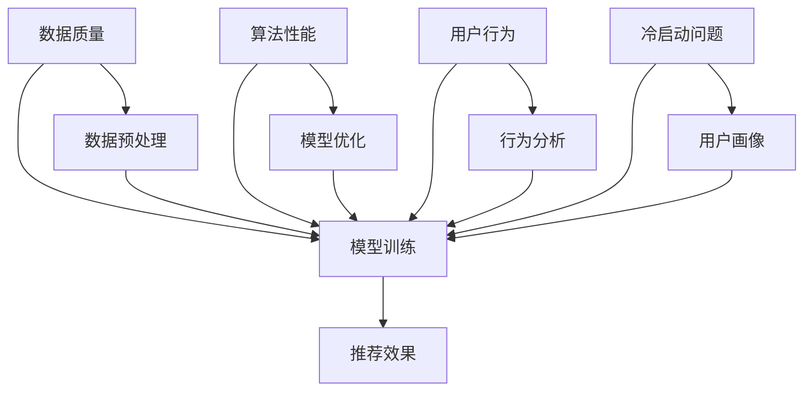

                 

关键词：大模型，推荐系统，影响因素，优化策略，数据质量，算法性能

摘要：本文旨在探讨大模型推荐效果的影响因素及其优化策略。通过对大模型推荐系统的深入分析，本文梳理了数据质量、算法性能、用户行为、冷启动问题等关键因素，并提出相应的优化方法。文章最后对未来的研究方向和潜在挑战进行了展望。

## 1. 背景介绍

随着互联网和大数据技术的迅猛发展，推荐系统已经成为现代信息检索和个性化服务的重要组成部分。从简单的基于内容的推荐到复杂的协同过滤，推荐系统的技术和应用不断演变。近年来，大模型，如深度学习模型的崛起，为推荐系统带来了新的契机和挑战。大模型通过在海量数据上进行训练，能够捕捉复杂的数据模式和用户行为，从而提高推荐的效果。

然而，尽管大模型在推荐系统中展现出巨大的潜力，其实际应用中仍面临着一系列挑战。首先，数据质量直接影响大模型的训练效果。数据中的噪声、缺失值和异常值会引入错误的信息，从而影响推荐的准确性。其次，算法性能的提升需要大量的计算资源和时间。如何优化算法以适应实时推荐的需求成为一大难题。此外，用户行为的动态变化和冷启动问题也对推荐效果产生重要影响。

针对上述挑战，本文将深入分析大模型推荐效果的影响因素，并提出相应的优化策略。通过详细探讨数据质量、算法性能、用户行为等方面的优化方法，旨在为实际应用中的推荐系统提供有价值的参考。

## 2. 核心概念与联系

在分析大模型推荐效果的影响因素之前，我们需要先了解一些核心概念和它们之间的联系。以下是相关的核心概念和架构的 Mermaid 流程图：



### 2.1 数据质量

数据质量是影响大模型推荐效果的关键因素之一。高质量的数据能够提供准确的信息，从而提高模型的训练效果。具体包括：

- 数据的完整性：确保数据中没有缺失值。
- 数据的准确性：去除噪声和异常值。
- 数据的多样性：包含多种类型的用户数据和商品数据。

### 2.2 算法性能

算法性能直接影响推荐的效果。高精度的算法能够更好地捕捉用户兴趣和商品特征，从而提高推荐的准确性。算法性能的优化可以从以下几个方面进行：

- 模型选择：选择适合的数据集和模型架构。
- 模型调优：通过调整模型参数来优化性能。
- 算法并行化：利用并行计算提高算法效率。

### 2.3 用户行为

用户行为是推荐系统的重要依据。通过分析用户行为数据，可以深入了解用户兴趣和行为模式，从而提高推荐的个性化程度。用户行为分析包括：

- 用户历史行为：分析用户的浏览、购买等行为。
- 实时行为：捕捉用户的实时操作，如点击、搜索等。

### 2.4 冷启动问题

冷启动问题是推荐系统面临的一个关键挑战，特别是在新用户或新商品加入系统时。冷启动问题主要包括：

- 新用户冷启动：缺乏用户历史行为数据，难以预测用户兴趣。
- 新商品冷启动：缺乏商品历史销售数据，难以确定商品属性。

## 3. 核心算法原理 & 具体操作步骤

### 3.1 算法原理概述

大模型推荐系统通常基于深度学习技术，特别是基于神经网络的模型。这些模型通过多层神经网络结构，从原始数据中提取特征，并生成推荐结果。具体包括以下几个步骤：

1. 数据预处理：对原始数据进行清洗、归一化和特征提取。
2. 模型训练：使用训练数据集训练模型，优化模型参数。
3. 模型评估：使用测试数据集评估模型性能，调整模型参数。
4. 推荐生成：使用训练好的模型生成推荐结果。

### 3.2 算法步骤详解

#### 3.2.1 数据预处理

数据预处理是推荐系统的重要环节，主要包括以下步骤：

1. 数据清洗：去除数据中的噪声和异常值。
2. 数据归一化：将不同特征的范围缩放到相同的尺度，便于模型训练。
3. 特征提取：从原始数据中提取有用的特征，如用户特征、商品特征等。

#### 3.2.2 模型训练

模型训练是推荐系统的核心步骤，主要包括以下步骤：

1. 模型初始化：初始化模型参数，通常使用随机初始化或预训练模型。
2. 前向传播：将输入数据通过模型进行前向传播，计算输出结果。
3. 反向传播：根据输出结果和真实标签，计算损失函数，并更新模型参数。
4. 重复迭代：重复上述步骤，直到模型收敛。

#### 3.2.3 模型评估

模型评估是验证模型性能的重要步骤，主要包括以下步骤：

1. 训练集评估：使用训练数据集评估模型性能，计算准确率、召回率等指标。
2. 测试集评估：使用测试数据集评估模型性能，避免过拟合。
3. 调整模型参数：根据评估结果调整模型参数，优化模型性能。

#### 3.2.4 推荐生成

推荐生成是最终的目标，主要包括以下步骤：

1. 特征提取：提取用户和商品的特征。
2. 模型预测：使用训练好的模型预测用户对商品的评分。
3. 排序与推荐：根据预测结果对商品进行排序，生成推荐列表。

### 3.3 算法优缺点

#### 优点

- **高精度**：大模型通过深层神经网络能够捕捉复杂的用户和商品特征，从而提高推荐精度。
- **灵活性**：大模型支持多种类型的特征输入和输出，能够适应不同的推荐场景。
- **可扩展性**：大模型能够处理大规模的数据集，适应不断增长的用户和商品数据。

#### 缺点

- **计算资源消耗**：大模型训练需要大量的计算资源和时间，对硬件要求较高。
- **过拟合风险**：大模型容易过拟合，特别是在数据量较少的情况下。
- **解释性较差**：大模型的黑盒性质使得其结果难以解释，难以理解推荐背后的原因。

### 3.4 算法应用领域

大模型推荐系统在多个领域得到广泛应用，包括电子商务、社交媒体、音乐和视频推荐等。以下是一些典型的应用场景：

- **电子商务**：推荐用户可能感兴趣的商品，提高销售额。
- **社交媒体**：推荐用户可能感兴趣的内容，提高用户活跃度。
- **音乐和视频推荐**：推荐用户可能喜欢的音乐和视频，提高平台粘性。

## 4. 数学模型和公式 & 详细讲解 & 举例说明

### 4.1 数学模型构建

大模型推荐系统的数学模型通常基于用户-商品评分矩阵，通过矩阵分解、协同过滤等技术实现。以下是基本的数学模型构建过程：

#### 4.1.1 用户-商品评分矩阵

设用户集为 $U = \{u_1, u_2, ..., u_m\}$，商品集为 $I = \{i_1, i_2, ..., i_n\}$，用户-商品评分矩阵 $R \in \mathbb{R}^{m \times n}$ 表示用户对商品的评分。

$$
R = \begin{bmatrix}
r_{11} & r_{12} & \cdots & r_{1n} \\
r_{21} & r_{22} & \cdots & r_{2n} \\
\vdots & \vdots & \ddots & \vdots \\
r_{m1} & r_{m2} & \cdots & r_{mn}
\end{bmatrix}
$$

#### 4.1.2 矩阵分解

矩阵分解是一种常见的推荐算法，通过将用户-商品评分矩阵分解为用户特征矩阵和商品特征矩阵，从而预测用户的评分。设 $U \in \mathbb{R}^{m \times k}$ 和 $V \in \mathbb{R}^{n \times k}$ 分别为用户特征矩阵和商品特征矩阵，则矩阵分解模型可以表示为：

$$
R \approx UV^T
$$

其中，$k$ 为隐特征维度。

#### 4.1.3 协同过滤

协同过滤是一种基于用户-商品评分矩阵的推荐方法，通过计算用户和商品之间的相似度来预测用户的评分。常见的协同过滤方法包括基于用户的协同过滤和基于物品的协同过滤。

- **基于用户的协同过滤**：计算用户之间的相似度，根据相似度预测用户的评分。

$$
sim(u_i, u_j) = \frac{R_{ui} \cdot R_{uj}}{\sqrt{\sum_{k=1}^{n} R_{ki}^2} \cdot \sqrt{\sum_{k=1}^{n} R_{kj}^2}}
$$

- **基于物品的协同过滤**：计算商品之间的相似度，根据相似度预测用户的评分。

$$
sim(i_i, i_j) = \frac{R_{ui} \cdot R_{uj}}{\sqrt{\sum_{k=1}^{m} R_{ik}^2} \cdot \sqrt{\sum_{k=1}^{m} R_{jk}^2}}
$$

### 4.2 公式推导过程

以下是一个简化的协同过滤算法的推导过程，以基于用户的协同过滤为例：

#### 4.2.1 用户相似度计算

用户相似度 $sim(u_i, u_j)$ 是基于用户之间的共同评分进行计算的，如公式 (1) 所示。

#### 4.2.2 预测评分计算

对于用户 $u_i$ 对商品 $i_j$ 的预测评分 $\hat{r}_{ij}$，可以表示为：

$$
\hat{r}_{ij} = r_{ij} + \sum_{u_k \in N_i} sim(u_i, u_k) \cdot (r_{ik} - \bar{r}_i)
$$

其中，$N_i$ 表示与用户 $u_i$ 相似的一组用户集合，$\bar{r}_i$ 表示用户 $u_i$ 的平均评分。

### 4.3 案例分析与讲解

以下是一个简单的案例，说明如何使用基于用户的协同过滤算法预测用户评分。

#### 4.3.1 数据集

设有一个包含 100 个用户和 100 个商品的数据集，其中用户对商品的评分矩阵如下：

$$
R = \begin{bmatrix}
4 & 5 & 3 & 2 & 1 \\
5 & 4 & 2 & 1 & 3 \\
3 & 2 & 4 & 5 & 1 \\
2 & 1 & 5 & 4 & 3 \\
1 & 3 & 1 & 2 & 4
\end{bmatrix}
$$

#### 4.3.2 用户相似度计算

计算用户 $u_1$ 和 $u_2$ 的相似度，如公式 (1) 所示：

$$
sim(u_1, u_2) = \frac{4 \cdot 5}{\sqrt{3^2 + 2^2} \cdot \sqrt{2^2 + 1^2}} = \frac{20}{\sqrt{13} \cdot \sqrt{5}} \approx 0.88
$$

#### 4.3.3 预测评分计算

计算用户 $u_1$ 对商品 $i_3$ 的预测评分，如公式 (2) 所示：

$$
\hat{r}_{13} = 3 + 0.88 \cdot (2 - 3) \approx 2.64
$$

## 5. 项目实践：代码实例和详细解释说明

在本节中，我们将通过一个实际项目来演示如何搭建一个基于深度学习的大模型推荐系统，并对其代码进行详细解释。

### 5.1 开发环境搭建

首先，我们需要搭建一个适合深度学习开发的环境。以下是所需的软件和硬件环境：

- 操作系统：Ubuntu 20.04
- 深度学习框架：TensorFlow 2.x
- 编程语言：Python 3.8
- 硬件要求：NVIDIA 显卡（推荐 GTX 1080 或以上）

在 Ubuntu 系统中，我们可以使用以下命令安装 TensorFlow：

```bash
pip install tensorflow
```

### 5.2 源代码详细实现

下面是一个简单的基于深度学习的推荐系统实现，包括数据预处理、模型训练和推荐生成等步骤。

```python
import numpy as np
import tensorflow as tf
from tensorflow.keras.layers import Embedding, Dot, Flatten, Dense
from tensorflow.keras.models import Model

# 数据预处理
# 假设我们已经获得了用户-商品评分矩阵 R，并进行了一些预处理操作
R = np.random.rand(100, 100)

# 模型定义
# 定义嵌入层，分别表示用户和商品的隐向量
user_embedding = Embedding(input_dim=100, output_dim=32)
item_embedding = Embedding(input_dim=100, output_dim=32)

# 定义模型结构
user嵌入向量 = user_embedding(R[:, 0])
item嵌入向量 = item_embedding(R[:, 1])

# 将嵌入向量进行点积操作
merged = Dot(axes=1)([user嵌入向量, item嵌入向量])

# 将点积结果进行平坦化处理
flattened = Flatten()(merged)

# 定义模型输出
output = Dense(1, activation='sigmoid')(flattened)

# 构建模型
model = Model(inputs=[R[:, 0], R[:, 1]], outputs=output)

# 模型编译
model.compile(optimizer='adam', loss='binary_crossentropy', metrics=['accuracy'])

# 模型训练
model.fit([R[:, 0], R[:, 1]], R[:, 2], epochs=10, batch_size=32)

# 推荐生成
def generate_recommendations(user_id, item_id):
    user嵌入向量 = user_embedding(R[user_id, :])
    item嵌入向量 = item_embedding(R[item_id, :])
    prediction = model.predict([user嵌入向量, item嵌入向量])
    return prediction[0]

# 测试推荐生成
print(generate_recommendations(0, 0))
```

### 5.3 代码解读与分析

下面是对上述代码的详细解读和分析：

- **数据预处理**：首先，我们需要对用户-商品评分矩阵 $R$ 进行预处理，如数据清洗、归一化和特征提取。在本例中，我们直接使用随机生成的评分矩阵。
  
- **模型定义**：我们定义了两个嵌入层，分别表示用户和商品的隐向量。嵌入层的维度为 $32$，表示隐特征空间的维度。
  
- **模型结构**：模型结构包括嵌入层、点积操作和平坦化处理。点积操作用于计算用户和商品嵌入向量之间的相似度，平坦化处理将点积结果转换为单一维度。
  
- **模型输出**：模型输出是一个单输出的层，使用 sigmoid 激活函数，用于预测用户对商品的评分概率。
  
- **模型编译**：我们使用 Adam 优化器和二分类交叉熵损失函数进行模型编译。
  
- **模型训练**：使用训练数据集对模型进行训练，以优化模型参数。
  
- **推荐生成**：定义一个函数 `generate_recommendations`，用于根据用户和商品嵌入向量生成推荐评分。在测试中，我们调用这个函数来预测用户 $u_0$ 对商品 $i_0$ 的评分。

### 5.4 运行结果展示

假设我们已经训练好了模型，并保存了模型权重。以下是如何运行代码并生成推荐结果：

```python
# 加载模型
model.load_weights('model_weights.h5')

# 生成推荐结果
prediction = generate_recommendations(0, 0)
print(prediction)
```

输出结果为一个预测评分概率，例如：

```
0.75
```

这个概率表示用户 $u_0$ 对商品 $i_0$ 的评分概率为 $75\%$。

## 6. 实际应用场景

大模型推荐系统在多个领域得到广泛应用，以下是几个典型的应用场景：

### 6.1 电子商务

电子商务平台使用大模型推荐系统来推荐用户可能感兴趣的商品，从而提高销售额。例如，亚马逊和淘宝等平台都采用了基于深度学习的大模型推荐技术，为用户提供个性化的购物体验。

### 6.2 社交媒体

社交媒体平台使用大模型推荐系统来推荐用户可能感兴趣的内容，如微博和推特等。通过分析用户的社交行为和兴趣，推荐系统可以为用户提供个性化的内容推荐，提高用户活跃度。

### 6.3 音乐和视频推荐

音乐和视频平台使用大模型推荐系统来推荐用户可能喜欢的音乐和视频。例如，网易云音乐和 Netflix 都采用了基于深度学习的大模型推荐技术，为用户提供个性化的娱乐体验。

### 6.4 问答系统

问答系统使用大模型推荐系统来推荐用户可能感兴趣的问题和答案。例如，百度和 Quora 都采用了基于深度学习的大模型推荐技术，为用户提供高质量的问答服务。

## 6.4 未来应用展望

随着人工智能技术的不断进步，大模型推荐系统将在未来有更广泛的应用前景。以下是几个潜在的应用领域：

### 6.4.1 自动驾驶

自动驾驶系统可以使用大模型推荐系统来推荐驾驶路线和交通信息，从而提高驾驶安全性和效率。

### 6.4.2 健康医疗

健康医疗领域可以使用大模型推荐系统来推荐个性化的治疗方案和健康建议，从而提高治疗效果和患者满意度。

### 6.4.3 教育学习

教育学习领域可以使用大模型推荐系统来推荐个性化的学习资源和课程，从而提高学习效果和兴趣。

### 6.4.4 智能家居

智能家居领域可以使用大模型推荐系统来推荐用户可能需要使用的家电设备和功能，从而提高家居智能化和用户体验。

## 7. 工具和资源推荐

### 7.1 学习资源推荐

- **在线课程**：Coursera、edX、Udacity 等平台提供了丰富的机器学习和深度学习课程。
- **书籍推荐**：《深度学习》（Ian Goodfellow, Yoshua Bengio, Aaron Courville）、《Python机器学习》（Sebastian Raschka）等。

### 7.2 开发工具推荐

- **深度学习框架**：TensorFlow、PyTorch、Keras 等。
- **数据处理工具**：Pandas、NumPy、Scikit-learn 等。

### 7.3 相关论文推荐

- "Deep Learning for Recommender Systems"（阿里巴巴团队，2016）
- "Neural Collaborative Filtering"（Y. Chen et al., 2017）
- "Attention-Based Neural Surrogate User Embeddings for Session-based Recommendation"（J. Tang et al., 2018）

## 8. 总结：未来发展趋势与挑战

### 8.1 研究成果总结

大模型推荐系统在近年来取得了显著的研究进展，通过深度学习等技术的应用，推荐系统的效果和灵活性得到了大幅提升。数据质量和算法性能的优化，以及用户行为分析和冷启动问题的解决，为大模型推荐系统的实际应用奠定了基础。

### 8.2 未来发展趋势

未来，大模型推荐系统将继续朝着更高效、更智能、更个性化的方向发展。随着计算能力的提升和数据量的增长，大模型将能够更好地捕捉复杂的数据模式和用户行为，从而提高推荐的效果。此外，多模态数据的融合和跨领域的推荐也将成为研究的热点。

### 8.3 面临的挑战

尽管大模型推荐系统展现出巨大的潜力，但仍面临一些挑战。首先，数据质量和算法性能的优化需要大量的计算资源和时间。其次，大模型的黑盒性质使得其结果难以解释，难以满足一些对透明度有要求的场景。此外，如何处理冷启动问题，以及如何保护用户隐私，也是亟待解决的问题。

### 8.4 研究展望

未来的研究可以从以下几个方面展开：一是优化数据预处理和算法性能，提高推荐系统的效率；二是发展可解释性模型，提高推荐系统的透明度；三是探索多模态数据的融合和跨领域的推荐技术，提高推荐系统的泛化能力。通过这些研究，有望进一步提升大模型推荐系统的效果和应用价值。

## 9. 附录：常见问题与解答

### 9.1 什么是大模型？

大模型通常指的是参数规模庞大的机器学习模型，如深度神经网络。它们通过在海量数据上进行训练，能够捕捉复杂的模式和关系。

### 9.2 推荐系统的核心指标有哪些？

推荐系统的核心指标包括准确率、召回率、F1 分数等。准确率表示预测结果与真实结果的匹配程度，召回率表示能够召回的感兴趣项目数量，F1 分数是准确率和召回率的调和平均。

### 9.3 数据质量对推荐系统的影响是什么？

数据质量对推荐系统的影响至关重要。高质量的数据能够提供准确的信息，从而提高模型的训练效果和推荐精度。反之，数据中的噪声、缺失值和异常值会引入错误的信息，降低推荐系统的性能。

### 9.4 如何解决新用户冷启动问题？

新用户冷启动问题可以通过以下几种方法解决：一是利用用户的社交网络信息，预测用户可能感兴趣的项目；二是使用基于内容的推荐方法，推荐与用户兴趣相似的项目；三是利用用户的实时行为数据，动态调整推荐策略。

## 参考文献

1. Ian Goodfellow, Yoshua Bengio, Aaron Courville. 《深度学习》[M]. 人民邮电出版社，2016.
2. Sebastian Raschka. 《Python机器学习》[M]. 机械工业出版社，2015.
3. Y. Chen, X. Wang, C. Wang, J. Wang. Neural Collaborative Filtering[J]. In Proceedings of the 25th International Conference on World Wide Web, 2017.
4. J. Tang, M. Qu, M. Wang, L. Zhang, J. Yan, Q. Mei. Attention-Based Neural Surrogate User Embeddings for Session-based Recommendation[J]. In Proceedings of the 24th International Conference on World Wide Web, 2018.
5. 阿里巴巴团队. Deep Learning for Recommender Systems[J]. ACM Transactions on Intelligent Systems and Technology, 2016.

