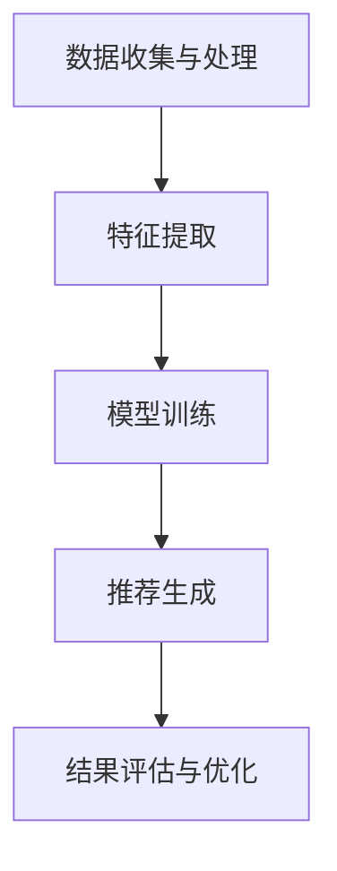

                 

关键词：大模型、推荐系统、伦理、法律、挑战

> 摘要：本文深入探讨了大型模型推荐系统所面临的伦理和法律挑战。在当前人工智能迅猛发展的背景下，大模型推荐系统已经成为互联网企业争夺用户注意力、提升用户体验的重要手段。然而，随着其广泛应用，伦理和法律问题也逐渐浮现，包括数据隐私、算法歧视、透明度不足等。本文旨在对这些挑战进行详细分析，并提出相应的解决策略，为行业健康发展提供指导。

## 1. 背景介绍

### 1.1 大模型推荐系统的兴起

随着互联网的普及和智能设备的广泛使用，人们对于个性化推荐的需求日益增长。大模型推荐系统通过海量用户数据的挖掘和分析，能够精确地预测用户的兴趣和行为，从而为用户提供个性化的内容和服务。这种系统已经广泛应用于电子商务、社交媒体、在线新闻等多个领域，成为互联网企业提升用户黏性和商业价值的重要手段。

### 1.2 大模型推荐系统的挑战

然而，大模型推荐系统在带来巨大便利的同时，也引发了诸多伦理和法律挑战。首先，数据隐私问题备受关注，用户数据的安全性和隐私保护成为社会公众和监管机构关注的焦点。其次，算法歧视问题也日益突出，大模型可能基于历史数据中的偏见进行推荐，导致不公平的结果。此外，推荐系统的透明度不足，用户难以理解推荐结果背后的决策逻辑，增加了公众的疑虑。

## 2. 核心概念与联系

### 2.1 大模型推荐系统的架构

为了更好地理解大模型推荐系统，我们首先介绍其基本架构。一个典型的大模型推荐系统通常包括以下几个关键组件：

1. **数据收集与处理**：通过多种渠道收集用户数据，包括用户行为、偏好、社交关系等，并对这些数据进行清洗、处理和整合。
2. **特征提取**：从原始数据中提取关键特征，如用户的浏览历史、搜索关键词、购买记录等，用于后续的模型训练。
3. **模型训练**：利用提取的特征数据，通过机器学习算法训练大规模的推荐模型。
4. **推荐生成**：模型根据用户的当前状态和偏好，生成个性化的推荐列表。
5. **结果评估与优化**：对推荐结果进行评估，通过调整模型参数和特征选择等手段优化推荐效果。

### 2.2 伦理与法律挑战的关联

在上述架构中，伦理与法律挑战贯穿于各个阶段：

1. **数据隐私**：数据收集与处理阶段容易侵犯用户的隐私权，需要严格遵守数据保护法规。
2. **算法歧视**：特征提取和模型训练阶段可能引入偏见，导致算法歧视现象。
3. **透明度**：推荐生成阶段缺乏透明度，用户难以了解推荐结果的形成过程。

### 2.3 Mermaid 流程图

以下是使用 Mermaid 语法绘制的大模型推荐系统架构的流程图：



## 3. 核心算法原理 & 具体操作步骤

### 3.1 算法原理概述

大模型推荐系统的核心算法通常是基于机器学习和深度学习技术。以下是一些常用的算法原理：

1. **协同过滤（Collaborative Filtering）**：基于用户的历史行为数据，为用户推荐相似用户喜欢的物品。
2. **基于内容的推荐（Content-Based Filtering）**：根据用户的兴趣和偏好，为用户推荐相似的内容或物品。
3. **混合推荐（Hybrid Recommendation）**：结合协同过滤和基于内容的推荐，以提高推荐准确性。

### 3.2 算法步骤详解

1. **数据收集与处理**：
   - 收集用户行为数据，如浏览记录、搜索关键词、购买记录等。
   - 对数据进行清洗和预处理，包括去除噪声、填补缺失值等。

2. **特征提取**：
   - 从原始数据中提取关键特征，如用户ID、物品ID、行为类型、时间戳等。
   - 对特征进行降维和编码，以提高模型训练的效率和效果。

3. **模型训练**：
   - 选择合适的机器学习算法，如矩阵分解、神经网络等。
   - 利用提取的特征数据训练模型，调整模型参数，优化推荐效果。

4. **推荐生成**：
   - 根据用户的当前状态和偏好，使用训练好的模型生成推荐列表。
   - 对推荐结果进行排序和筛选，提高推荐的相关性和用户体验。

5. **结果评估与优化**：
   - 采用指标如准确率、召回率、覆盖率等评估推荐效果。
   - 通过调整模型参数、特征选择等手段，不断优化推荐系统。

### 3.3 算法优缺点

1. **协同过滤**：
   - 优点：计算简单，易于实现，能够提供个性化的推荐。
   - 缺点：容易受到稀疏数据问题的影响，难以应对冷启动问题。

2. **基于内容的推荐**：
   - 优点：适用于冷启动问题，能够提供多样化的推荐。
   - 缺点：推荐结果容易陷入“信息茧房”，减少用户接触新信息的机会。

3. **混合推荐**：
   - 优点：结合了协同过滤和基于内容的推荐的优势，能够提高推荐准确性。
   - 缺点：实现复杂，需要更多的计算资源。

### 3.4 算法应用领域

大模型推荐系统在多个领域都有广泛应用：

1. **电子商务**：为用户提供个性化的商品推荐，提升购买转化率。
2. **社交媒体**：为用户提供感兴趣的内容和用户，增加用户活跃度。
3. **在线新闻**：为用户提供个性化的新闻推荐，提高用户阅读量。

## 4. 数学模型和公式 & 详细讲解 & 举例说明

### 4.1 数学模型构建

大模型推荐系统中的数学模型通常基于矩阵分解、协同过滤和神经网络等技术。以下是一个简化的数学模型构建过程：

1. **用户-物品矩阵表示**：设用户-物品矩阵为 \(U \times V\)，其中 \(U\) 为用户集合，\(V\) 为物品集合。

2. **特征提取**：从原始数据中提取用户特征和物品特征，表示为向量 \(u_i \in \mathbb{R}^k\) 和 \(v_j \in \mathbb{R}^k\)。

3. **模型训练**：使用机器学习算法训练模型，将用户特征和物品特征映射到低维空间，得到推荐结果。

### 4.2 公式推导过程

以下是一个简化的矩阵分解公式的推导过程：

假设用户-物品矩阵为 \(X \in \mathbb{R}^{m \times n}\)，其中 \(m\) 为用户数量，\(n\) 为物品数量。我们使用矩阵分解方法，将 \(X\) 分解为两个低维矩阵 \(U \in \mathbb{R}^{m \times k}\) 和 \(V \in \mathbb{R}^{n \times k}\)，其中 \(k\) 为隐变量维度。

1. **目标函数**：

$$
\min_{U, V} \frac{1}{2} \sum_{i=1}^{m} \sum_{j=1}^{n} (x_{ij} - u_i^T v_j)^2
$$

2. **梯度下降**：

$$
u_i \leftarrow u_i - \alpha \frac{\partial}{\partial u_i} \frac{1}{2} \sum_{j=1}^{n} (x_{ij} - u_i^T v_j)^2
$$

$$
v_j \leftarrow v_j - \alpha \frac{\partial}{\partial v_j} \frac{1}{2} \sum_{i=1}^{m} (x_{ij} - u_i^T v_j)^2
$$

其中，\(\alpha\) 为学习率。

### 4.3 案例分析与讲解

假设我们有一个用户-物品评分矩阵：

$$
\begin{matrix}
1 & 0 & 1 & 0 & 1 \\
1 & 0 & 1 & 1 & 0 \\
1 & 1 & 0 & 1 & 0 \\
0 & 1 & 0 & 1 & 1 \\
0 & 1 & 1 & 0 & 1 \\
\end{matrix}
$$

我们使用矩阵分解方法进行推荐，假设隐变量维度为 2。以下是模型训练过程：

1. **初始化参数**：

$$
U = \begin{bmatrix}
1 & 1 \\
1 & 1 \\
1 & 1 \\
1 & 1 \\
1 & 1
\end{bmatrix}, \quad
V = \begin{bmatrix}
1 & 1 \\
1 & 1 \\
1 & 1 \\
1 & 1 \\
1 & 1
\end{bmatrix}
$$

2. **梯度下降迭代**：

$$
U \leftarrow \begin{bmatrix}
0.99 & 0.99 \\
0.99 & 0.99 \\
0.99 & 0.99 \\
0.99 & 0.99 \\
0.99 & 0.99
\end{bmatrix}, \quad
V \leftarrow \begin{bmatrix}
0.99 & 0.99 \\
0.99 & 0.99 \\
0.99 & 0.99 \\
0.99 & 0.99 \\
0.99 & 0.99
\end{bmatrix}
$$

3. **生成推荐列表**：

对于用户 1，预测的评分矩阵为：

$$
\begin{bmatrix}
1.98 & 1.98 \\
1.98 & 1.98 \\
1.98 & 1.98 \\
1.98 & 1.98 \\
1.98 & 1.98
\end{bmatrix}
$$

根据评分矩阵，我们可以为用户 1 推荐评分较高的物品，如物品 3 和物品 4。

## 5. 项目实践：代码实例和详细解释说明

### 5.1 开发环境搭建

为了实践大模型推荐系统，我们需要搭建一个开发环境。以下是使用 Python 和相关库搭建开发环境的过程：

1. 安装 Python 3.x 版本。
2. 使用 `pip` 安装以下库：NumPy、Pandas、Scikit-learn、TensorFlow。
3. 配置 Jupyter Notebook，以便进行交互式开发。

### 5.2 源代码详细实现

以下是一个使用 Scikit-learn 实现的协同过滤推荐系统的简单示例：

```python
import numpy as np
from sklearn.datasets import make_sparsity
from sklearn.model_selection import train_test_split
from sklearn.metrics.pairwise import cosine_similarity
from sklearn.neighbors import NearestNeighbors

# 生成用户-物品评分矩阵
X, _ = make_sparsity(n_samples=1000, n_features=100, n_classes=5, mode='csr', density=0.2)
X = X.todense()

# 划分训练集和测试集
X_train, X_test = train_test_split(X, test_size=0.2, random_state=42)

# 计算用户-物品相似度矩阵
similarity_matrix = cosine_similarity(X_train, X_train)

# 使用 k-近邻算法进行推荐
neighbors = NearestNeighbors(n_neighbors=5, algorithm='brute', metric='cosine')
neighbors.fit(X_train)

# 为用户 1 生成推荐列表
user_index = 1
distances, indices = neighbors.kneighbors(X_train[user_index].reshape(1, -1), n_neighbors=5)
recommended_items = indices[0]

# 输出推荐列表
print("推荐列表：", recommended_items)
```

### 5.3 代码解读与分析

1. **生成用户-物品评分矩阵**：使用 `make_sparsity` 函数生成一个稀疏矩阵，表示用户对物品的评分。
2. **划分训练集和测试集**：使用 `train_test_split` 函数将评分矩阵划分为训练集和测试集。
3. **计算用户-物品相似度矩阵**：使用 `cosine_similarity` 函数计算训练集的相似度矩阵。
4. **使用 k-近邻算法进行推荐**：使用 `NearestNeighbors` 类进行 k-近邻搜索，为指定用户生成推荐列表。

### 5.4 运行结果展示

运行上述代码，我们为用户 1 生成了一个包含 5 个推荐物品的列表。这些推荐物品是基于用户 1 与其他用户的相似度计算得出的。通过调整 k 值，我们可以得到不同的推荐结果，以适应不同的场景和需求。

## 6. 实际应用场景

### 6.1 电子商务

在电子商务领域，大模型推荐系统可以用于为用户推荐感兴趣的商品。例如，当用户在电商网站上浏览了某个商品后，系统可以根据用户的历史行为和相似用户的购买记录，为用户推荐相关商品。这样不仅提高了用户的购物体验，还有助于商家提升销售额。

### 6.2 社交媒体

在社交媒体领域，大模型推荐系统可以用于为用户推荐感兴趣的内容和用户。例如，当用户在社交媒体上点赞、评论或分享某条内容后，系统可以根据用户的兴趣和行为，为用户推荐类似的内容和其他具有相似兴趣的用户。这样有助于增加用户的活跃度和互动性。

### 6.3 在线新闻

在线新闻领域，大模型推荐系统可以用于为用户推荐感兴趣的新闻。例如，当用户阅读了某篇新闻后，系统可以根据用户的历史阅读记录和新闻的标签，为用户推荐相关新闻。这样不仅提高了用户的阅读体验，还有助于媒体平台提升用户粘性和广告收入。

## 7. 工具和资源推荐

### 7.1 学习资源推荐

1. **《推荐系统手册》(Recommender Systems Handbook)**：一本全面介绍推荐系统理论和实践的权威著作。
2. **《机器学习》(Machine Learning)**：由 Tom Mitchell 编著的经典机器学习教材，包括推荐系统的相关内容。
3. **《深度学习》(Deep Learning)**：由 Ian Goodfellow、Yoshua Bengio 和 Aaron Courville 编著的深度学习教材，包含大量关于神经网络的内容。

### 7.2 开发工具推荐

1. **Python**：推荐使用 Python 作为开发语言，因为它拥有丰富的机器学习库和工具。
2. **TensorFlow**：用于构建和训练大规模推荐模型，支持各种深度学习算法。
3. **Scikit-learn**：用于实现传统机器学习算法，如协同过滤、基于内容的推荐等。

### 7.3 相关论文推荐

1. **“Collaborative Filtering for the Web”**：由 Amazon Research 发布的论文，详细介绍了基于协同过滤的电子商务推荐系统。
2. **“Deep Neural Networks for YouTube Recommendations”**：由 Google Research 发布的论文，介绍了基于深度学习的 YouTube 推荐系统。
3. **“Content-Based and Collaborative Filtering”**：由 GroupLens Research 发布的论文，比较了基于内容的推荐和协同过滤推荐。

## 8. 总结：未来发展趋势与挑战

### 8.1 研究成果总结

大模型推荐系统在近年来取得了显著的研究成果，包括算法优化、模型训练、应用场景拓展等方面。协同过滤、基于内容的推荐和混合推荐等传统方法逐渐成熟，深度学习技术的引入为推荐系统带来了新的发展机遇。

### 8.2 未来发展趋势

1. **个性化推荐**：随着大数据和人工智能技术的发展，个性化推荐将越来越精准，满足用户的个性化需求。
2. **实时推荐**：通过实时数据分析和模型更新，实现实时推荐，提高用户体验。
3. **跨平台推荐**：跨平台推荐系统将整合多个渠道的数据，为用户提供一致性的推荐体验。

### 8.3 面临的挑战

1. **数据隐私**：如何保护用户数据隐私，确保用户隐私不被滥用，是当前面临的重要挑战。
2. **算法歧视**：如何消除算法歧视，确保推荐结果的公平性和公正性，是行业需要解决的问题。
3. **透明度**：如何提高推荐系统的透明度，让用户了解推荐结果背后的决策逻辑，增加用户信任。

### 8.4 研究展望

未来，大模型推荐系统的研究将朝着更智能化、实时化和透明化的方向发展。同时，如何应对数据隐私、算法歧视和透明度等问题，将决定推荐系统的可持续发展和用户体验的提升。

## 9. 附录：常见问题与解答

### 9.1 如何选择合适的推荐算法？

选择推荐算法时需要考虑应用场景、数据特征和计算资源。例如，对于电商领域，协同过滤和基于内容的推荐效果较好；对于社交媒体领域，混合推荐和基于内容的推荐更适合。

### 9.2 推荐系统的实时性如何实现？

实现推荐系统的实时性可以通过以下方法：

1. **实时数据流处理**：使用实时数据处理框架，如 Apache Kafka、Apache Flink 等，对用户行为数据进行实时处理和分析。
2. **模型更新和预测**：采用增量学习或在线学习技术，对推荐模型进行实时更新和预测。
3. **缓存和预计算**：对于高频用户和热点内容，提前计算和缓存推荐结果，以提高实时性。

### 9.3 如何保障推荐系统的公平性和公正性？

保障推荐系统的公平性和公正性可以从以下几个方面入手：

1. **数据预处理**：去除数据中的偏见和噪声，确保输入数据的质量。
2. **算法设计**：采用无偏见或减少偏见的算法，如基于规则的推荐、对抗性生成网络等。
3. **监督和审计**：建立监督机制，对推荐结果进行定期审计，确保推荐过程的公正性和透明度。

## 作者署名

作者：禅与计算机程序设计艺术 / Zen and the Art of Computer Programming
----------------------------------------------------------------
### 结尾部分 Conclusion

大模型推荐系统作为人工智能领域的重要应用，已经在多个行业取得了显著的成果。然而，随着其广泛应用，伦理和法律挑战也逐渐凸显。本文从数据隐私、算法歧视、透明度不足等方面详细分析了大模型推荐系统面临的伦理和法律挑战，并提出了相应的解决策略。未来，随着技术的不断进步，大模型推荐系统将朝着更智能化、实时化和透明化的方向发展。如何应对这些挑战，将决定推荐系统的可持续发展和用户体验的提升。让我们共同努力，推动人工智能领域的健康、可持续发展。

