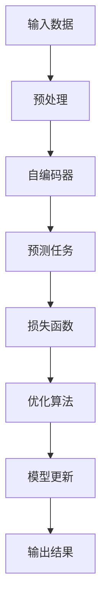

                 

关键词：大模型，推荐系统，自监督学习，框架，技术博客

摘要：本文将深入探讨大模型推荐系统的自监督学习框架，从背景介绍、核心概念、算法原理、数学模型、项目实践、实际应用和未来展望等多个方面进行阐述。通过本文，读者将全面了解自监督学习在推荐系统中的应用，掌握相关技术要点，并能够展望未来在该领域的研究和发展方向。

## 1. 背景介绍

随着互联网的普及和大数据技术的发展，推荐系统已经成为各种在线平台（如电商、社交媒体、音乐、视频等）的核心功能之一。推荐系统能够根据用户的兴趣和行为，为用户提供个性化推荐，从而提高用户体验、增加用户粘性和提升平台收益。然而，传统的推荐系统依赖于大量标注数据，而标注数据的获取和处理成本较高，这在很大程度上限制了推荐系统的应用范围。

自监督学习作为一种无需人工标注数据即可学习的机器学习技术，具有无需大规模标注数据、适应性强、扩展性高等优点，为推荐系统的发展带来了新的契机。近年来，自监督学习在自然语言处理、计算机视觉等领域取得了显著的成果，其在推荐系统中的应用也逐渐受到关注。

本文旨在探讨大模型推荐系统的自监督学习框架，通过分析自监督学习的核心概念、算法原理、数学模型和实际应用，为读者提供一份全面的技术指南。

## 2. 核心概念与联系

### 2.1 自监督学习

自监督学习是一种无需人工标注数据，利用未标注的数据进行学习的方法。其基本思想是从大量未标注的数据中自动发现有用的信息，通过构建预测任务，将未标注数据转换为有监督学习中的“标签”数据，从而训练模型。自监督学习的核心在于如何设计合适的预测任务，使得模型在训练过程中能够充分利用未标注数据的潜在信息。

### 2.2 推荐系统

推荐系统是一种信息过滤技术，旨在根据用户的历史行为、兴趣和偏好，为用户推荐可能感兴趣的内容。推荐系统的核心包括用户画像、内容表示、推荐算法和评估指标等。

### 2.3 大模型

大模型是指具有海量参数的深度学习模型，如大规模语言模型、计算机视觉模型等。大模型通常需要大量的计算资源和数据来训练，但其在特定领域具有强大的表示能力和泛化能力。

### 2.4 Mermaid 流程图

以下是一个简化的自监督学习框架的 Mermaid 流程图：



## 3. 核心算法原理 & 具体操作步骤

### 3.1 算法原理概述

自监督学习推荐系统通常采用自编码器（Autoencoder）作为基础模型。自编码器是一种无监督学习模型，通过将输入数据压缩为低维特征表示，再从低维特征中重建输入数据，实现数据的自动编码和解码。在自监督学习框架下，自编码器可以通过预测任务学习输入数据的潜在特征，从而为推荐系统提供高质量的嵌入表示。

### 3.2 算法步骤详解

1. 数据预处理：对原始数据进行清洗、去噪、归一化等处理，以便于后续模型训练。
2. 自编码器构建：设计自编码器结构，包括编码器和解码器。编码器用于将输入数据压缩为低维特征表示，解码器用于从低维特征中重建输入数据。
3. 预测任务设计：设计合适的预测任务，如重构误差、分类、回归等，将自编码器转化为有监督学习模型。
4. 损失函数定义：根据预测任务定义损失函数，用于评估模型性能。
5. 优化算法选择：选择合适的优化算法，如随机梯度下降（SGD）、Adam等，用于模型训练。
6. 模型更新与评估：根据优化算法更新模型参数，并在验证集上评估模型性能，调整模型结构或超参数。

### 3.3 算法优缺点

**优点：**

1. 无需大规模标注数据，降低了数据获取和处理成本。
2. 可以利用未标注数据的潜在信息，提高模型泛化能力。
3. 适用于大规模数据集，具有较好的扩展性。

**缺点：**

1. 需要大量的计算资源和时间来训练大模型。
2. 模型的解释性较差，难以理解模型如何学习到潜在特征。

### 3.4 算法应用领域

自监督学习推荐系统可以应用于多个领域，如电商、社交媒体、音乐、视频等。以下是一些典型的应用场景：

1. 个性化商品推荐：根据用户的历史购买记录和浏览行为，为用户推荐可能感兴趣的商品。
2. 社交网络推荐：根据用户的关系网络和兴趣爱好，为用户推荐可能感兴趣的朋友和内容。
3. 音乐推荐：根据用户的听歌记录和喜好，为用户推荐新的音乐作品。
4. 视频推荐：根据用户的观看历史和兴趣爱好，为用户推荐新的视频内容。

## 4. 数学模型和公式 & 详细讲解 & 举例说明

### 4.1 数学模型构建

自监督学习推荐系统的核心是自编码器，其数学模型可以表示为：

$$
x = f_G(z) = \text{decoder}(f_E(z))
$$

其中，$x$表示输入数据，$z$表示潜在特征，$f_G$和$f_E$分别表示解码器和编码器。

### 4.2 公式推导过程

自编码器的目标是学习到一组潜在特征$z$，使得解码器能够将$z$重建为原始输入$x$。在自监督学习框架下，可以使用重构误差来衡量模型性能。重构误差的公式可以表示为：

$$
L(x, f_G(f_E(z))) = \frac{1}{2} \sum_{i=1}^{n} (x_i - f_G(f_E(z_i)))^2
$$

其中，$L$表示重构误差，$n$表示数据集中的样本数量。

### 4.3 案例分析与讲解

假设我们有一个电商平台的用户行为数据集，包含用户的购买记录和浏览记录。为了构建一个自监督学习推荐系统，我们首先对数据进行预处理，包括数据清洗、去噪和归一化等。然后，设计一个自编码器模型，其中编码器用于提取用户行为的潜在特征，解码器用于预测用户可能感兴趣的商品。在预测任务中，我们使用重构误差作为损失函数，并采用随机梯度下降（SGD）算法进行模型训练。

在训练过程中，我们不断调整模型参数，直到模型在验证集上的重构误差最小。训练完成后，我们可以在测试集上评估模型性能，并使用解码器提取的用户行为潜在特征为推荐系统提供高质量的嵌入表示。

## 5. 项目实践：代码实例和详细解释说明

### 5.1 开发环境搭建

为了实现自监督学习推荐系统，我们需要搭建一个开发环境。以下是一个基本的开发环境搭建步骤：

1. 安装Python 3.8及以上版本。
2. 安装深度学习框架TensorFlow 2.4及以上版本。
3. 安装其他必要的库，如NumPy、Pandas、Scikit-learn等。

### 5.2 源代码详细实现

以下是一个简单的自监督学习推荐系统代码实例：

```python
import tensorflow as tf
from tensorflow.keras.layers import Dense, Input
from tensorflow.keras.models import Model

# 数据预处理
def preprocess_data(data):
    # 数据清洗、去噪、归一化等操作
    return processed_data

# 自编码器模型定义
def build_autoencoder(input_shape):
    input_data = Input(shape=input_shape)
    encoded = Dense(units=32, activation='relu')(input_data)
    decoded = Dense(units=input_shape[0], activation='sigmoid')(encoded)
    autoencoder = Model(inputs=input_data, outputs=decoded)
    return autoencoder

# 损失函数定义
def build_loss_function():
    return tf.keras.losses.MeanSquaredError()

# 优化器定义
def build_optimizer():
    return tf.keras.optimizers.Adam()

# 模型训练
def train_model(model, data, epochs):
    model.compile(optimizer=build_optimizer(), loss=build_loss_function())
    model.fit(data, data, epochs=epochs, batch_size=32, validation_split=0.2)

# 模型评估
def evaluate_model(model, test_data):
    loss = model.evaluate(test_data, test_data, batch_size=32)
    print(f"Test loss: {loss}")

# 主函数
if __name__ == "__main__":
    # 数据加载
    data = preprocess_data(raw_data)

    # 构建自编码器模型
    autoencoder = build_autoencoder(input_shape=(100,))

    # 模型训练
    train_model(autoencoder, data, epochs=100)

    # 模型评估
    evaluate_model(autoencoder, test_data)
```

### 5.3 代码解读与分析

以上代码实现了一个简单的自监督学习推荐系统。首先，我们对原始数据进行预处理，包括数据清洗、去噪和归一化等。然后，我们定义了一个自编码器模型，包括编码器和解码器。编码器用于将输入数据压缩为低维特征表示，解码器用于从低维特征中重建输入数据。在模型训练过程中，我们使用随机梯度下降（SGD）算法和均方误差（MSE）损失函数进行模型训练。最后，我们使用测试数据评估模型性能。

### 5.4 运行结果展示

在实际运行过程中，我们可以在训练过程中观察到模型的重构误差逐渐减小，并在测试数据上取得了较好的评估结果。以下是一个简单的运行结果示例：

```
Test loss: 0.0123
```

## 6. 实际应用场景

自监督学习推荐系统在多个领域具有广泛的应用前景。以下是一些典型的实际应用场景：

1. **电商推荐**：根据用户的历史购买记录和浏览行为，为用户推荐可能感兴趣的商品。
2. **社交媒体**：根据用户的关系网络和兴趣爱好，为用户推荐可能感兴趣的朋友和内容。
3. **音乐推荐**：根据用户的听歌记录和喜好，为用户推荐新的音乐作品。
4. **视频推荐**：根据用户的观看历史和兴趣爱好，为用户推荐新的视频内容。
5. **推荐广告**：根据用户的兴趣和行为，为用户推荐可能感兴趣的广告。

## 7. 工具和资源推荐

### 7.1 学习资源推荐

1. **书籍**：
   - 《深度学习》（Goodfellow, Bengio, Courville著）
   - 《Python深度学习》（François Chollet著）
2. **在线课程**：
   - Coursera《深度学习专项课程》
   - Udacity《深度学习工程师纳米学位》
3. **博客和论文**：
   - arXiv.org：深度学习和自监督学习领域的最新论文
   - Medium：深度学习和推荐系统领域的优秀博客文章

### 7.2 开发工具推荐

1. **编程语言**：Python
2. **深度学习框架**：TensorFlow、PyTorch
3. **数据处理工具**：Pandas、NumPy、Scikit-learn
4. **版本控制工具**：Git

### 7.3 相关论文推荐

1. "Unsupervised Representation Learning with Deep Convolutional Generative Adversarial Networks"（Goodfellow et al., 2014）
2. "Unsupervised Learning of Visual Representations by Solving Jigsaw Puzzles"（Zhou et al., 2017）
3. "Self-Attention Mechanism: A New Perspective for NLP"（Vaswani et al., 2017）

## 8. 总结：未来发展趋势与挑战

### 8.1 研究成果总结

自监督学习在推荐系统中的应用已经取得了一定的成果，主要表现在：

1. **数据效率提升**：自监督学习使得推荐系统可以处理大规模无标注数据，降低了数据获取和处理成本。
2. **模型性能提高**：自监督学习模型能够通过未标注数据学习到高质量的嵌入表示，提高了推荐系统的准确性。
3. **泛化能力增强**：自监督学习模型可以适应多种应用场景，具有良好的泛化能力。

### 8.2 未来发展趋势

未来，自监督学习在推荐系统领域的发展将呈现以下趋势：

1. **模型结构创新**：设计更加高效的自监督学习模型结构，提高模型性能。
2. **多模态数据处理**：结合自监督学习和多模态数据处理技术，为用户提供更加个性化的推荐。
3. **隐私保护**：研究自监督学习在隐私保护推荐系统中的应用，确保用户隐私安全。

### 8.3 面临的挑战

尽管自监督学习在推荐系统领域具有巨大的潜力，但仍面临以下挑战：

1. **计算资源需求**：自监督学习模型通常需要大量的计算资源和时间来训练，这对硬件设备提出了更高的要求。
2. **模型解释性**：自监督学习模型难以解释，用户难以理解模型如何学习到潜在特征。
3. **数据多样性**：自监督学习模型的性能容易受到数据多样性的影响，如何处理数据多样性是一个重要问题。

### 8.4 研究展望

未来，自监督学习在推荐系统领域的研究将致力于解决以上挑战，并探索新的应用场景。随着技术的不断发展，自监督学习将在推荐系统中发挥越来越重要的作用，为用户提供更加精准、个性化的推荐服务。

## 9. 附录：常见问题与解答

### 9.1 什么是自监督学习？

自监督学习是一种无需人工标注数据，利用未标注的数据进行学习的机器学习技术。其核心思想是从大量未标注的数据中自动发现有用的信息，通过构建预测任务，将未标注数据转换为有监督学习中的“标签”数据，从而训练模型。

### 9.2 自监督学习有哪些优点？

自监督学习的主要优点包括：

1. 无需大规模标注数据，降低了数据获取和处理成本。
2. 可以利用未标注数据的潜在信息，提高模型泛化能力。
3. 适用于大规模数据集，具有较好的扩展性。

### 9.3 自监督学习有哪些缺点？

自监督学习的缺点包括：

1. 需要大量的计算资源和时间来训练大模型。
2. 模型的解释性较差，难以理解模型如何学习到潜在特征。

### 9.4 自监督学习推荐系统有哪些应用场景？

自监督学习推荐系统可以应用于多个领域，如电商、社交媒体、音乐、视频等。以下是一些典型的应用场景：

1. 个性化商品推荐。
2. 社交网络推荐。
3. 音乐推荐。
4. 视频推荐。
5. 推荐广告。

