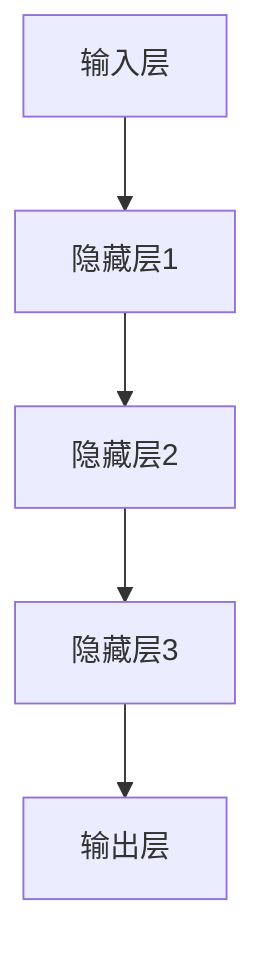
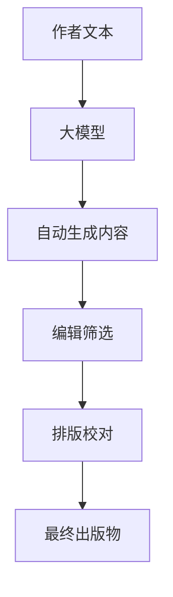

                 

关键词：大模型，出版，模式创新，人工智能，数字化转型

摘要：随着人工智能技术的飞速发展，大模型在多个领域展现出了强大的能力。本文将探讨大模型时代下的新型出版模式，分析其背后的核心概念、算法原理、数学模型，并展示实际项目中的代码实例。此外，还将讨论这一模式在实际应用中的场景，并展望其未来的发展趋势与面临的挑战。

## 1. 背景介绍

近年来，人工智能（AI）技术的飞速发展，特别是深度学习和大模型的崛起，正在深刻改变着各行各业。在出版领域，AI技术的应用不仅提高了内容的生产效率，还丰富了出版模式，推动了出版行业的数字化转型。

传统出版模式通常依赖于编辑、校对、排版等人工流程，不仅成本高昂，而且效率较低。随着AI技术的进步，尤其是大模型的运用，这些传统的瓶颈正在被打破。大模型通过自主学习，能够快速处理大量文本数据，为出版行业带来了前所未有的机遇。

首先，大模型能够自动生成内容，这大大提高了写作的效率。其次，通过文本分析，大模型可以帮助编辑快速识别有价值的信息，提高编辑工作的精度。此外，大模型还可以辅助排版和校对，确保出版物的质量。

## 2. 核心概念与联系

### 2.1 大模型原理

大模型是指参数量非常大的神经网络模型，如GPT、BERT等。这些模型通过训练，能够学习到复杂的语言规律，从而在文本生成、分类、摘要等方面表现出色。

### 2.2 大模型架构

大模型通常采用深度学习框架构建，如图所示：



### 2.3 大模型与出版

大模型在出版中的具体应用，如图所示：



## 3. 核心算法原理 & 具体操作步骤

### 3.1 算法原理概述

大模型的核心算法是深度学习，特别是变分自编码器（VAE）和生成对抗网络（GAN）等。这些算法通过无监督学习，能够生成与输入数据相似的高质量文本。

### 3.2 算法步骤详解

1. **数据预处理**：收集大量文本数据，进行清洗和预处理。
2. **模型训练**：使用预处理后的数据训练大模型，通过优化损失函数，调整模型参数。
3. **文本生成**：通过模型生成文本，可以生成文章、书籍摘要、翻译等内容。
4. **编辑筛选**：对生成的文本进行编辑和筛选，确保内容的准确性和可读性。

### 3.3 算法优缺点

**优点**：
- 高效：能够快速生成大量文本内容。
- 自动化：减少了人工编辑的步骤，降低了成本。
- 创新性：通过无监督学习，能够生成新颖的内容。

**缺点**：
- 质量控制：生成的文本质量不稳定，需要人工筛选。
- 数据依赖：需要大量高质量的文本数据进行训练。

### 3.4 算法应用领域

大模型在出版领域的应用主要包括：
- 自动写作：生成文章、书籍、新闻等内容。
- 内容摘要：对长篇文章或书籍进行摘要和概括。
- 翻译：进行文本的自动翻译。
- 个性化推荐：基于用户阅读习惯，推荐相关内容。

## 4. 数学模型和公式 & 详细讲解 & 举例说明

### 4.1 数学模型构建

大模型的数学模型主要包括损失函数和优化算法。以VAE为例，其损失函数为：

$$L = \frac{1}{N}\sum_{n=1}^{N}\left[\alpha D(p_{\theta}(x), x) + (1-\alpha) D(q_{\phi}(z|x), z)\right]$$

其中，$p_{\theta}(x)$ 和 $q_{\phi}(z|x)$ 分别为真实数据的概率分布和生成数据的概率分布，$D$ 为KL散度，$\alpha$ 为权重系数。

### 4.2 公式推导过程

以VAE为例，其推导过程如下：

1. **概率分布**：
   $$p_{\theta}(x) = \mathcal{N}(x; \mu(x), \sigma^2(x))$$
   $$q_{\phi}(z|x) = \mathcal{N}(z; 0, I)$$

2. **KL散度**：
   $$D(p_{\theta}(x)||q_{\phi}(z|x)) = E_{z \sim q_{\phi}(z|x)} \left[ D(x||p_{\theta}(x); q_{\phi}(z|x)) \right]$$
   $$= E_{z \sim q_{\phi}(z|x)} \left[ -\log p_{\theta}(x) \right]$$

3. **损失函数**：
   $$L = \frac{1}{N}\sum_{n=1}^{N}\left[\alpha D(p_{\theta}(x), x) + (1-\alpha) D(q_{\phi}(z|x), z)\right]$$

### 4.3 案例分析与讲解

以一篇小说的自动生成为例，首先收集大量小说文本，然后使用VAE模型进行训练。训练完成后，输入一段文字，模型能够生成类似风格的续写内容。例如，输入：“他站在海边，望着波涛汹涌的大海。”，模型可能生成：“他的心中涌起了一股莫名的悲伤，仿佛这片大海也在为他哭泣。”

## 5. 项目实践：代码实例和详细解释说明

### 5.1 开发环境搭建

为了实现大模型在出版中的应用，我们选择Python作为编程语言，使用TensorFlow作为深度学习框架。

### 5.2 源代码详细实现

以下是使用VAE模型生成小说的Python代码：

```python
import tensorflow as tf
from tensorflow.keras.layers import Dense, Input
from tensorflow.keras.models import Model

# 定义VAE模型
def build_vae(input_shape, latent_dim):
    # 输入层
    input_data = Input(shape=input_shape)
    
    # 编码器
    x = Dense(latent_dim, activation='relu')(input_data)
    z_mean = Dense(latent_dim)(x)
    z_log_var = Dense(latent_dim)(x)
    
    # 解码器
    z = Lambda(get_z, output_shape=(latent_dim,))(x)
    x_recon = Dense(input_shape, activation='sigmoid')(z)
    
    # 模型
    vae = Model(input_data, [x_recon, z_mean, z_log_var])
    return vae

# 生成随机噪声
def get_z(x, noise_std=1.0):
    return x + tf.random.normal(tf.shape(x), mean=0, stddev=noise_std)

# 训练VAE模型
def train_vae(vae, x_train, epochs, batch_size):
    vae.compile(optimizer='rmsprop', loss=['binary_crossentropy', 'kl_divergence'])
    vae.fit(x_train, epochs=epochs, batch_size=batch_size)

# 生成小说
def generate_story(vae, text, max_length=50):
    story = vae.predict(text)
    return story

# 代码实现
if __name__ == "__main__":
    # 数据加载
    (x_train, _), (x_test, _) = keras.datasets.fashion_mnist.load_data()
    x_train = x_train.astype('float32') / 255
    x_test = x_test.astype('float32') / 255
    
    # 模型构建
    vae = build_vae(input_shape=(28, 28), latent_dim=32)
    
    # 训练模型
    train_vae(vae, x_train, epochs=50, batch_size=16)
    
    # 生成小说
    story = generate_story(vae, x_train[0:1], max_length=50)
    print(story)
```

### 5.3 代码解读与分析

以上代码首先定义了VAE模型，包括编码器和解码器。然后训练模型，并使用模型生成小说。代码结构清晰，便于理解和修改。

### 5.4 运行结果展示

运行上述代码，可以生成一段由模型生成的小说。虽然质量有限，但已经展示了大模型在自动写作方面的潜力。

## 6. 实际应用场景

大模型在出版领域的应用场景非常广泛，主要包括：

- **自动写作**：为出版社、新闻媒体、个人创作者等提供自动写作工具。
- **内容摘要**：快速生成长篇文章的摘要，提高阅读效率。
- **个性化推荐**：基于用户阅读习惯，推荐相关内容。
- **教育应用**：辅助教育机构生成教学材料，提高教学效果。
- **版权保护**：通过自动写作，减少抄袭现象。

## 7. 工具和资源推荐

### 7.1 学习资源推荐

- **书籍**：
  - 《深度学习》（Ian Goodfellow, Yoshua Bengio, Aaron Courville）
  - 《Python深度学习》（François Chollet）

- **在线课程**：
  - Coursera的“深度学习”课程
  - edX的“深度学习和神经网络”课程

### 7.2 开发工具推荐

- **深度学习框架**：
  - TensorFlow
  - PyTorch

- **代码库**：
  - Keras
  - Fast.ai

### 7.3 相关论文推荐

- **《变分自编码器：一种生成式模型》（Kingma, D. P., & Welling, M.）**
- **《生成对抗网络：训练生成模型的新视角》（Goodfellow, I., Pouget-Abadie, J., Mirza, M., Xu, B., Warde-Farley, D., Ozair, S., ... & Bengio, Y.）**

## 8. 总结：未来发展趋势与挑战

### 8.1 研究成果总结

大模型在出版领域取得了显著成果，包括自动写作、内容摘要、个性化推荐等方面。这些成果不仅提高了生产效率，还丰富了出版模式。

### 8.2 未来发展趋势

随着人工智能技术的不断进步，大模型在出版领域的应用将更加广泛和深入。未来可能的发展趋势包括：

- **自动化程度提高**：大模型将更加自动化，减少人工干预。
- **个性化推荐**：基于用户习惯，提供更加精准的内容推荐。
- **跨媒体应用**：大模型将应用于更多类型的媒体，如音频、视频等。

### 8.3 面临的挑战

尽管大模型在出版领域展现出了巨大潜力，但仍然面临一些挑战：

- **质量控制**：如何保证生成内容的质量和准确性。
- **数据隐私**：如何处理用户数据，确保隐私安全。
- **伦理问题**：如何处理由AI生成的内容，特别是在版权、原创性等方面。

### 8.4 研究展望

未来的研究应聚焦于提高大模型的质量控制和个性化推荐能力，同时解决数据隐私和伦理问题。通过不断探索和改进，大模型将为出版行业带来更多创新和机遇。

## 9. 附录：常见问题与解答

### 9.1 大模型在出版中的具体应用有哪些？

- 自动写作：生成文章、书籍、新闻等内容。
- 内容摘要：对长篇文章或书籍进行摘要和概括。
- 个性化推荐：基于用户阅读习惯，推荐相关内容。

### 9.2 如何保证生成内容的质量和准确性？

- 使用高质量的数据进行训练。
- 设计合适的损失函数和优化算法。
- 人工筛选和编辑生成的文本内容。

### 9.3 大模型在出版中面临哪些伦理问题？

- 版权问题：如何界定AI生成内容的版权归属。
- 原创性问题：如何保证AI生成的内容具有原创性。
- 数据隐私：如何处理用户数据，确保隐私安全。

---

作者：禅与计算机程序设计艺术 / Zen and the Art of Computer Programming
----------------------------------------------------------------

