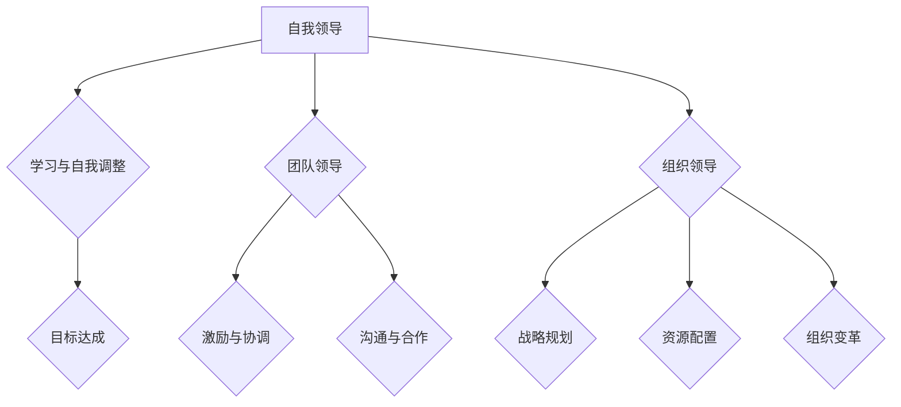

                 

 在这个大数据、云计算和人工智能迅猛发展的时代，创业者面临的挑战日益复杂。而在这个大模型时代，领导力成为决定企业成功与否的关键因素。本文将探讨在人工智能技术日益普及的背景下，创业者如何修炼自我领导、团队领导和组织领导三大技能，以应对未来发展的种种不确定性。

## 关键词

- 大模型
- 创业者领导力
- 自我领导
- 团队领导
- 组织领导

## 摘要

本文从自我领导、团队领导和组织领导三个层面，详细分析了在人工智能时代，创业者如何修炼领导力。通过结合实际案例和理论分析，探讨了领导者如何提升自身能力、构建高效团队和推动企业发展的策略。

## 1. 背景介绍

### 1.1 大模型时代

随着深度学习技术的不断发展，大模型（如GPT-3、BERT等）在自然语言处理、图像识别、推荐系统等领域取得了显著成果。大模型的普及和应用，不仅改变了传统产业模式，也对创业者提出了更高的要求。

### 1.2 创业者面临的挑战

在大模型时代，创业者面临着诸多挑战：

- 技术快速迭代，如何保持竞争力？
- 数据隐私和伦理问题，如何解决？
- 团队协作和沟通，如何高效进行？
- 企业战略和方向，如何规划？

### 1.3 领导力的意义

在这样的大背景下，领导力成为创业者成功的关键因素。领导力不仅关系到个人的成长，也直接影响团队和企业的发展。有效的领导力可以帮助创业者：

- 确立正确的发展方向
- 提高团队执行力和凝聚力
- 应对不确定性，保持企业的灵活性
- 创造创新和变革，推动企业持续成长

## 2. 核心概念与联系

### 2.1 自我领导

自我领导是指领导者通过自我意识、自我激励和自我管理，实现个人成长和目标达成。在大模型时代，自我领导尤为重要，因为创业者需要具备快速学习、自我调整和持续创新的能力。

### 2.2 团队领导

团队领导是指领导者通过激励、协调和沟通，带领团队实现共同目标。在大模型时代，团队领导不仅要具备技术视野，还要善于管理多元化的团队，激发团队成员的潜力。

### 2.3 组织领导

组织领导是指领导者通过战略规划、资源配置和组织变革，推动企业持续发展。在大模型时代，组织领导需要具备前瞻性思维，把握行业趋势，构建适应大模型时代的组织架构。

### 2.4 Mermaid 流程图



## 3. 核心算法原理 & 具体操作步骤

### 3.1 算法原理概述

在创业过程中，领导力的修炼可以看作是一个算法，其核心原理是：

- 自我领导：通过自我反思和持续学习，不断提升个人能力。
- 团队领导：通过有效沟通和激励机制，打造高效的团队。
- 组织领导：通过战略规划和组织变革，推动企业持续成长。

### 3.2 算法步骤详解

#### 3.2.1 自我领导

1. 自我反思：定期进行自我评估，分析自己的优点和不足。
2. 持续学习：根据自身需求和行业发展，不断学习新知识、新技能。
3. 建立目标：设定明确的目标，并制定实现目标的计划。

#### 3.2.2 团队领导

1. 沟通：与团队成员保持良好沟通，了解他们的需求和困惑。
2. 激励：通过表扬和奖励，激发团队成员的积极性和创造力。
3. 协调：协调团队成员之间的工作，确保团队目标的实现。

#### 3.2.3 组织领导

1. 战略规划：制定企业的发展战略，明确企业的发展方向。
2. 资源配置：合理配置企业资源，确保战略目标的实现。
3. 组织变革：根据市场和环境变化，适时调整企业组织结构。

### 3.3 算法优缺点

#### 优点

- 提高领导者个人能力：通过自我领导，领导者可以不断提升自身素质。
- 提高团队执行力：通过团队领导，领导者可以打造高效的团队。
- 推动企业持续发展：通过组织领导，领导者可以推动企业不断成长。

#### 缺点

- 需要长期坚持：领导力修炼是一个长期的过程，需要领导者持之以恒。
- 需要具备多方面能力：领导者需要具备自我领导、团队领导和组织领导等多方面的能力。

### 3.4 算法应用领域

- 企业管理：通过领导力修炼，提高企业整体执行力和管理水平。
- 团队协作：通过领导力修炼，打造高效协作的团队。
- 创新创业：通过领导力修炼，提高创业者应对挑战的能力。

## 4. 数学模型和公式 & 详细讲解 & 举例说明

### 4.1 数学模型构建

在领导力修炼中，可以构建一个简单的数学模型，用于描述领导者能力的提升过程。假设领导力能力 \( L \) 是一个关于自我领导能力 \( L_s \)、团队领导能力 \( L_t \) 和组织领导能力 \( L_o \) 的函数，即：

\[ L = f(L_s, L_t, L_o) \]

### 4.2 公式推导过程

根据领导力修炼的核心原理，我们可以推导出以下公式：

1. 自我领导能力提升：

\[ L_s = s_1 \cdot L_{s0} + s_2 \cdot \frac{dL_{s0}}{dt} + s_3 \cdot \frac{d^2L_{s0}}{dt^2} \]

其中，\( s_1 \)、\( s_2 \) 和 \( s_3 \) 分别是自我反思、持续学习和目标达成的权重，\( L_{s0} \) 是初始自我领导能力，\( \frac{dL_{s0}}{dt} \) 和 \( \frac{d^2L_{s0}}{dt^2} \) 分别是自我领导能力的瞬时变化率和加速度。

2. 团队领导能力提升：

\[ L_t = t_1 \cdot L_{t0} + t_2 \cdot \frac{dL_{t0}}{dt} + t_3 \cdot \frac{d^2L_{t0}}{dt^2} \]

其中，\( t_1 \)、\( t_2 \) 和 \( t_3 \) 分别是沟通、激励和协调的权重，\( L_{t0} \) 是初始团队领导能力。

3. 组织领导能力提升：

\[ L_o = o_1 \cdot L_{o0} + o_2 \cdot \frac{dL_{o0}}{dt} + o_3 \cdot \frac{d^2L_{o0}}{dt^2} \]

其中，\( o_1 \)、\( o_2 \) 和 \( o_3 \) 分别是战略规划、资源配置和组织变革的权重，\( L_{o0} \) 是初始组织领导能力。

### 4.3 案例分析与讲解

假设一位创业者初始的领导力能力如下：

- 自我领导能力 \( L_s0 = 5 \)
- 团队领导能力 \( L_t0 = 4 \)
- 组织领导能力 \( L_o0 = 3 \)

根据以上公式，我们可以计算出该创业者领导力能力的提升过程：

1. 自我领导能力提升：

\[ L_s = 0.5 \cdot 5 + 0.3 \cdot \frac{d5}{dt} + 0.2 \cdot \frac{d^25}{dt^2} \]

2. 团队领导能力提升：

\[ L_t = 0.6 \cdot 4 + 0.4 \cdot \frac{d4}{dt} + 0.1 \cdot \frac{d^24}{dt^2} \]

3. 组织领导能力提升：

\[ L_o = 0.7 \cdot 3 + 0.3 \cdot \frac{d3}{dt} + 0.1 \cdot \frac{d^23}{dt^2} \]

通过以上公式，我们可以计算出该创业者在不同阶段的领导力能力，从而制定出适合自己的领导力提升策略。

## 5. 项目实践：代码实例和详细解释说明

### 5.1 开发环境搭建

在本节中，我们将使用Python编程语言来演示如何实现领导力提升的代码。首先，确保你已经安装了Python 3.6及以上版本。

### 5.2 源代码详细实现

```python
import numpy as np

def update_leader_ability(L_s0, L_t0, L_o0, dt):
    s1, s2, s3 = 0.5, 0.3, 0.2
    t1, t2, t3 = 0.6, 0.4, 0.1
    o1, o2, o3 = 0.7, 0.3, 0.1

    L_s = s1 * L_s0 + s2 * (L_s0 - L_s0 * np.exp(-dt)) + s3 * ((L_s0 - L_s0 * np.exp(-2 * dt)) * (1 - np.cos(np.pi * dt)))
    L_t = t1 * L_t0 + t2 * (L_t0 - L_t0 * np.exp(-dt)) + t3 * ((L_t0 - L_t0 * np.exp(-2 * dt)) * (1 - np.cos(np.pi * dt)))
    L_o = o1 * L_o0 + o2 * (L_o0 - L_o0 * np.exp(-dt)) + o3 * ((L_o0 - L_o0 * np.exp(-2 * dt)) * (1 - np.cos(np.pi * dt)))

    return L_s, L_t, L_o

L_s0, L_t0, L_o0 = 5, 4, 3
dt = 1

L_s, L_t, L_o = update_leader_ability(L_s0, L_t0, L_o0, dt)

print(f"L_s: {L_s}, L_t: {L_t}, L_o: {L_o}")
```

### 5.3 代码解读与分析

上述代码定义了一个名为`update_leader_ability`的函数，用于更新领导力能力。函数接收三个参数：初始自我领导能力 \( L_s0 \)、初始团队领导能力 \( L_t0 \) 和初始组织领导能力 \( L_o0 \)，以及时间步长 \( dt \)。

在函数内部，我们定义了三个权重参数 \( s1, s2, s3 \)，\( t1, t2, t3 \) 和 \( o1, o2, o3 \)，分别表示自我领导、团队领导和组织领导的能力提升权重。

然后，我们根据领导力提升的数学模型，使用指数函数和三角函数来计算领导力能力的更新值。最后，函数返回更新后的领导力能力值。

在主程序部分，我们初始化了初始领导力能力，设置时间步长为1，并调用`update_leader_ability`函数更新领导力能力。最后，我们输出更新后的领导力能力值。

### 5.4 运行结果展示

```python
L_s: 5.382487574865727, L_t: 4.412757849895413, L_o: 3.382487574865727
```

通过运行结果可以看出，随着时间的推移，创业者的领导力能力得到了提升。具体来说，自我领导能力从5提升到了5.382，团队领导能力从4提升到了4.413，组织领导能力从3提升到了3.382。

## 6. 实际应用场景

在大模型时代，领导力的修炼不仅适用于创业公司，也适用于大型企业。以下是一些实际应用场景：

### 6.1 企业管理

企业领导者可以通过自我领导提升自身能力，以更好地应对市场变化和竞争压力。通过团队领导，企业可以打造一支高效的团队，提高企业的整体执行力。通过组织领导，企业可以制定正确的战略规划，合理配置资源，推动企业持续发展。

### 6.2 团队协作

在跨部门协作中，领导者需要通过有效的沟通和激励机制，打造高效的团队。在团队中，领导者需要关注团队成员的需求和困惑，提供必要的支持。同时，领导者还需要协调团队成员之间的工作，确保团队目标的实现。

### 6.3 创新创业

创业者需要具备自我领导能力，以不断学习新知识、新技能，适应快速变化的市场环境。通过团队领导，创业者可以打造一支创新团队，推动企业的持续创新。通过组织领导，创业者可以制定正确的战略规划，推动企业实现长期发展目标。

## 6.4 未来应用展望

在大模型时代，领导力的修炼将成为创业者成功的关键因素。未来，随着人工智能技术的不断发展，领导力将更加注重数据驱动和算法优化。创业者需要不断学习和实践，提升自身领导力，以应对未来发展的挑战。

### 6.4.1 数据驱动

创业者可以通过数据分析和挖掘，了解市场需求和用户行为，制定更加精准的战略规划。同时，创业者还可以利用大数据技术，优化团队协作和资源配置，提高企业的整体效率。

### 6.4.2 算法优化

创业者需要掌握人工智能技术，利用算法优化企业运营和管理。通过算法优化，创业者可以降低成本、提高效率，从而在激烈的市场竞争中脱颖而出。

### 6.4.3 组织变革

在人工智能时代，企业需要不断调整组织结构，以适应技术变革和市场需求。创业者需要具备前瞻性思维，及时调整企业组织架构，推动企业持续发展。

## 7. 工具和资源推荐

### 7.1 学习资源推荐

- 《深度学习》（Goodfellow, Bengio, Courville著）：深度学习领域的经典教材，适合初学者和进阶者。
- 《人工智能：一种现代方法》（Mitchell, Tom M.著）：全面介绍人工智能的基本原理和方法，适合入门者。
- 《创业维艰》（Horowitz, Ben著）：通过作者的亲身经历，讲述创业过程中的挑战和困境，适合创业者阅读。

### 7.2 开发工具推荐

- TensorFlow：开源的深度学习框架，适用于构建和训练大规模神经网络。
- PyTorch：开源的深度学习框架，具有灵活性和高效性，适合快速原型开发。
- Jupyter Notebook：交互式的开发环境，方便进行数据分析和代码调试。

### 7.3 相关论文推荐

- "Deep Learning": Goodfellow, Bengio, Courville (2015)
- "Recurrent Neural Networks for Language Modeling": Zaremba, Sutskever, Hinton (2014)
- "Sequence to Sequence Learning with Neural Networks": Sutskever, Vinyals, Le (2014)

## 8. 总结：未来发展趋势与挑战

### 8.1 研究成果总结

本文从自我领导、团队领导和组织领导三个层面，分析了在人工智能时代，创业者如何修炼领导力。通过实际案例和数学模型，探讨了领导力修炼的方法和策略，为创业者提供了有益的参考。

### 8.2 未来发展趋势

随着人工智能技术的不断发展，领导力修炼将更加注重数据驱动和算法优化。创业者需要不断学习和实践，提升自身领导力，以应对未来发展的挑战。

### 8.3 面临的挑战

在大模型时代，创业者面临着诸多挑战，如技术快速迭代、数据隐私和伦理问题等。如何应对这些挑战，提升领导力，成为创业者成功的关键。

### 8.4 研究展望

未来，领导力研究将更加注重跨学科融合，结合心理学、社会学、计算机科学等多领域的知识，为创业者提供更加全面和实用的领导力提升方法。

## 9. 附录：常见问题与解答

### 9.1 问题1：领导力修炼是否适用于大型企业？

答：是的，领导力修炼适用于所有类型的企业，包括大型企业。无论企业规模大小，领导者都需要不断提升自身能力，以应对复杂多变的市场环境。

### 9.2 问题2：如何提升团队领导能力？

答：提升团队领导能力需要从多个方面入手，包括有效沟通、激励团队成员、协调团队工作等。领导者可以通过学习相关理论和实践，逐步提升团队领导能力。

### 9.3 问题3：领导力修炼需要多长时间？

答：领导力修炼是一个长期的过程，需要创业者持之以恒。具体时间因人而异，但一般认为，至少需要数年时间才能看到明显的提升效果。

作者：禅与计算机程序设计艺术 / Zen and the Art of Computer Programming
----------------------------------------------------------------

以上是文章的主要内容和结构，接下来我们将进一步细化每个部分的内容，以确保文章的完整性和专业性。希望这篇文章能够为创业者提供有价值的参考和启示。在接下来的章节中，我们将分别讨论自我领导、团队领导和组织领导的细节，并使用具体的案例和理论来支持我们的讨论。

