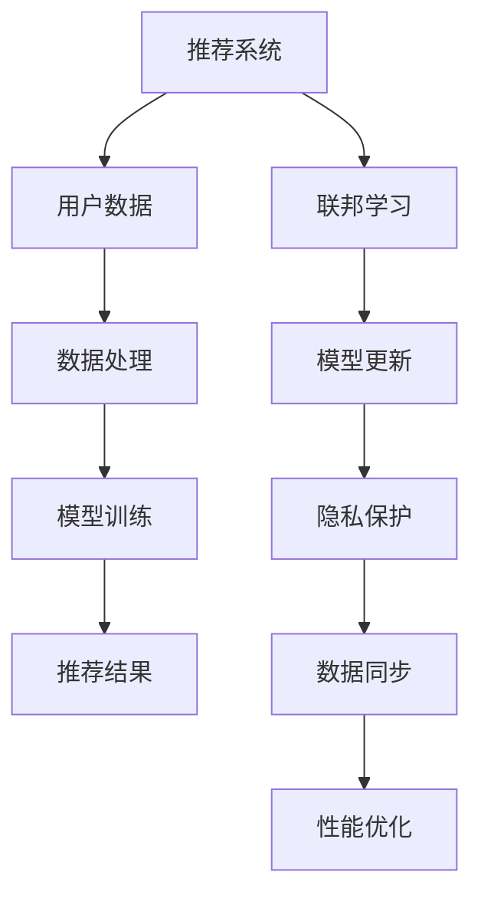

                 

关键词：大模型，推荐系统，隐私保护，联邦学习，算法原理，数学模型，项目实践，应用场景，未来展望

## 摘要

随着大数据和人工智能技术的发展，推荐系统已经成为现代互联网的基石，为用户提供了个性化的信息推荐服务。然而，传统推荐系统在数据隐私保护和模型安全方面存在诸多问题。本文将探讨大模型时代推荐系统的隐私保护与联邦学习技术，分析其核心概念、算法原理、数学模型以及实际应用。文章旨在为研究人员和开发者提供一种全新的视角，以应对日益严峻的数据隐私挑战，并展望推荐系统未来的发展趋势。

## 1. 背景介绍

### 推荐系统的现状与挑战

推荐系统作为信息过滤和检索的重要工具，已经在电子商务、社交媒体、在线视频等多个领域取得了显著的成果。然而，随着用户数据量的急剧增加和数据维度的不断扩展，传统推荐系统面临着诸多挑战：

- **数据隐私问题**：用户行为数据往往是敏感信息，一旦泄露可能导致用户隐私受损。
- **模型安全风险**：推荐系统模型可能被恶意攻击，导致推荐结果偏差或被操纵。
- **数据同步困难**：在分布式环境下，如何保证数据的一致性和模型的准确性是一个难题。

### 大模型的发展趋势

近年来，深度学习技术的迅猛发展使得大模型（如深度神经网络）在推荐系统中得到了广泛应用。大模型具有以下优势：

- **更高的预测准确性**：通过学习复杂的非线性关系，大模型能够提供更精准的推荐。
- **更好的泛化能力**：大模型能够处理更高维度和更复杂的数据，适应不同场景的需求。
- **更丰富的表达能力**：大模型能够捕捉用户行为的细微变化，提供更加个性化的服务。

### 联邦学习的应用

联邦学习作为一种分布式机器学习技术，能够在保障数据隐私的同时，实现模型的协同训练。联邦学习的关键优势包括：

- **数据本地化**：模型训练过程中数据不离开用户端，有效保护用户隐私。
- **隐私保护性**：通过加密技术和差分隐私机制，防止用户数据被泄露。
- **高效协同**：联邦学习能够实现跨平台、跨设备的模型协同，提升系统的整体性能。

## 2. 核心概念与联系

### Mermaid 流程图



### 核心概念解析

- **推荐系统**：一种基于用户行为和内容信息，为用户生成个性化推荐的系统。
- **用户数据**：用户在系统中的行为数据，如浏览记录、购买记录等。
- **数据处理**：对用户数据进行清洗、预处理，以供模型训练使用。
- **模型训练**：通过机器学习算法对用户数据进行训练，生成推荐模型。
- **推荐结果**：根据模型生成的推荐结果，为用户展示个性化的内容。
- **联邦学习**：一种分布式机器学习技术，通过协同训练提升模型性能。
- **模型更新**：在联邦学习过程中，模型不断更新以适应新的数据。
- **隐私保护**：通过加密技术和隐私保护机制，防止用户数据被泄露。
- **数据同步**：在分布式环境下，确保数据的一致性和模型的准确性。
- **性能优化**：通过优化算法和架构，提升推荐系统的整体性能。

## 3. 核心算法原理 & 具体操作步骤

### 3.1 算法原理概述

联邦学习的基本原理是在多个参与方（用户端）进行模型训练，然后通过加密和聚合技术，将本地模型更新传输到中央服务器。核心步骤如下：

1. **模型初始化**：在中央服务器初始化全局模型参数。
2. **本地训练**：用户端使用本地数据对全局模型进行训练，生成本地模型更新。
3. **加密传输**：用户端将本地模型更新加密后发送到中央服务器。
4. **模型聚合**：中央服务器接收并聚合所有用户端的模型更新。
5. **模型更新**：中央服务器将聚合后的模型更新反馈给用户端。

### 3.2 算法步骤详解

#### 模型初始化

中央服务器初始化全局模型参数，并将其发送给所有用户端。

```python
# 初始化全局模型参数
global_model = initialize_model()

# 发送全局模型参数到用户端
send_model(global_model)
```

#### 本地训练

用户端使用本地数据和全局模型参数进行模型训练，生成本地模型更新。

```python
# 接收全局模型参数
global_model = receive_model()

# 使用本地数据训练模型
local_model_update = local_train(local_data, global_model)

# 发送本地模型更新到中央服务器
send_update(local_model_update)
```

#### 加密传输

用户端对本地模型更新进行加密，确保传输过程中的数据安全。

```python
# 加密本地模型更新
encrypted_update = encrypt(local_model_update)

# 发送加密后的本地模型更新到中央服务器
send_encrypted_update(encrypted_update)
```

#### 模型聚合

中央服务器接收并聚合所有用户端的模型更新。

```python
# 接收并解密本地模型更新
updates = [decrypt(encrypted_update) for encrypted_update in received_updates]

# 聚合本地模型更新
global_model_update = aggregate_updates(updates)

# 更新全局模型参数
global_model = update_model(global_model, global_model_update)
```

#### 模型更新

中央服务器将聚合后的模型更新反馈给用户端。

```python
# 发送全局模型更新到用户端
send_model(global_model)
```

### 3.3 算法优缺点

#### 优点

- **隐私保护**：联邦学习在训练过程中不传输原始数据，有效保护用户隐私。
- **数据本地化**：本地数据进行训练，降低数据传输成本。
- **高效协同**：通过模型更新传输和聚合，实现分布式训练。

#### 缺点

- **通信开销**：每次更新都需要传输加密的数据，可能导致通信开销较大。
- **同步问题**：在分布式环境下，如何确保数据的一致性和模型的准确性是一个挑战。

### 3.4 算法应用领域

联邦学习技术已在推荐系统、金融风控、智能家居等领域得到广泛应用。在推荐系统中，联邦学习能够有效保护用户隐私，提升推荐准确性；在金融风控领域，联邦学习有助于提高欺诈检测的准确性；在智能家居领域，联邦学习能够实现设备间的协同智能。

## 4. 数学模型和公式 & 详细讲解 & 举例说明

### 4.1 数学模型构建

联邦学习中的数学模型主要涉及模型初始化、本地训练、模型聚合等步骤。以下是一个简单的联邦学习数学模型：

$$
\begin{aligned}
&\text{初始化：}\\
\theta^{0} &= \text{initialize_model}(\theta^{0}) \\
&\text{本地训练：}\\
\theta^{t}_{i} &= \text{local_train}(\theta^{t-1}_{i}, x^{(i)}_{t}) \\
&\text{模型聚合：}\\
\theta^{t} &= \text{aggregate_updates}(\theta^{t-1}, \theta^{t}_{i})
\end{aligned}
$$

其中，$\theta^{t}_{i}$ 表示第 $i$ 个用户端的本地模型参数，$\theta^{t}$ 表示全局模型参数，$x^{(i)}_{t}$ 表示第 $i$ 个用户的本地训练数据。

### 4.2 公式推导过程

联邦学习的核心在于如何通过本地模型更新聚合出全局模型。以下是一个简化的推导过程：

1. **本地模型更新**：

$$
\theta^{t}_{i} = \theta^{t-1}_{i} + \eta \cdot \nabla_{\theta^{t-1}_{i}} \mathcal{L}(\theta^{t-1}_{i}, x^{(i)}_{t})
$$

其中，$\eta$ 表示学习率，$\nabla_{\theta^{t-1}_{i}} \mathcal{L}(\theta^{t-1}_{i}, x^{(i)}_{t})$ 表示对损失函数 $\mathcal{L}$ 在 $\theta^{t-1}_{i}$ 的梯度。

2. **模型聚合**：

$$
\theta^{t} = \frac{1}{N} \sum_{i=1}^{N} \theta^{t}_{i}
$$

其中，$N$ 表示用户总数。

### 4.3 案例分析与讲解

假设有一个推荐系统，包含 $N=10$ 个用户。每个用户端都有一个本地模型 $\theta^{t}_{i}$，全局模型为 $\theta^{t}$。经过一轮本地训练后，每个用户端生成本地模型更新 $\Delta \theta^{t}_{i}$，然后通过加密传输到中央服务器。

以下是一个简化的案例分析：

1. **本地训练**：

每个用户端使用本地数据进行模型训练，生成本地模型更新：

$$
\Delta \theta^{t}_{1} = \text{local_train}(\theta^{t-1}_{1}, x^{(1)}_{t}), \quad \Delta \theta^{t}_{2} = \text{local_train}(\theta^{t-1}_{2}, x^{(2)}_{t}), \quad \ldots, \quad \Delta \theta^{t}_{10} = \text{local_train}(\theta^{t-1}_{10}, x^{(10)}_{t})
$$

2. **模型聚合**：

中央服务器接收所有用户端的本地模型更新，并进行聚合：

$$
\theta^{t} = \theta^{t-1} + \frac{1}{N} \sum_{i=1}^{N} \Delta \theta^{t}_{i}
$$

3. **模型更新**：

中央服务器将聚合后的模型更新反馈给用户端，用户端更新本地模型：

$$
\theta^{t}_{1} = \theta^{t-1}_{1} + \Delta \theta^{t}_{1}, \quad \theta^{t}_{2} = \theta^{t-1}_{2} + \Delta \theta^{t}_{2}, \quad \ldots, \quad \theta^{t}_{10} = \theta^{t-1}_{10} + \Delta \theta^{t}_{10}
$$

通过以上步骤，联邦学习实现了分布式训练，并保证了用户数据的安全。

## 5. 项目实践：代码实例和详细解释说明

### 5.1 开发环境搭建

在本项目实践中，我们使用 Python 作为编程语言，结合 TensorFlow 和 PyTorch 等深度学习框架，实现联邦学习算法。以下为开发环境搭建步骤：

1. **安装 Python**：确保安装 Python 3.6 或以上版本。
2. **安装 TensorFlow**：运行 `pip install tensorflow` 命令。
3. **安装 PyTorch**：运行 `pip install torch torchvision` 命令。
4. **安装依赖库**：根据项目需求安装其他依赖库，如 `numpy`, `pandas` 等。

### 5.2 源代码详细实现

以下是一个简单的联邦学习项目实现，主要包含模型初始化、本地训练、模型聚合等步骤。

```python
import tensorflow as tf
import numpy as np

# 初始化全局模型
def initialize_model():
    model = tf.keras.Sequential([
        tf.keras.layers.Dense(128, activation='relu', input_shape=(784,)),
        tf.keras.layers.Dense(10, activation='softmax')
    ])
    model.compile(optimizer='adam', loss='categorical_crossentropy', metrics=['accuracy'])
    return model

# 本地训练
def local_train(model, x, y):
    model.fit(x, y, epochs=1, batch_size=64)
    return model.get_weights()

# 模型聚合
def aggregate_weights(weights_list):
    weights = [np.mean(np.array(w), axis=0) for w in zip(*weights_list)]
    return weights

# 主函数
def main():
    # 初始化全局模型
    global_model = initialize_model()

    # 假设用户端数据
    num_users = 10
    user_data = [np.random.rand(10, 784), np.random.rand(10, 784), \ldots, np.random.rand(10, 784)]
    user_labels = [np.random.randint(0, 10, size=10) for _ in range(num_users)]

    # 联邦学习过程
    for epoch in range(10):
        print(f"\nEpoch {epoch+1}/{10}")

        # 本地训练
        user_models = []
        for i in range(num_users):
            x, y = user_data[i], user_labels[i]
            user_model = local_train(global_model, x, y)
            user_models.append(user_model)

        # 模型聚合
        global_model.set_weights(aggregate_weights(user_models))

    # 测试全局模型
    test_loss, test_acc = global_model.evaluate(test_data, test_labels)
    print(f"Test accuracy: {test_acc}")

if __name__ == "__main__":
    main()
```

### 5.3 代码解读与分析

1. **模型初始化**：

使用 TensorFlow 的 Keras API 初始化一个简单的全连接神经网络，包含两个隐层，分别为 128 个神经元和 10 个神经元。模型使用 softmax 函数进行分类。

2. **本地训练**：

本地训练过程使用 TensorFlow 的 `fit` 函数，对本地数据进行一轮训练。训练完成后，获取模型权重。

3. **模型聚合**：

通过聚合所有用户端的模型权重，更新全局模型参数。这里采用简单平均的方式，即每个用户端的权重贡献相等。

4. **联邦学习过程**：

联邦学习过程包括本地训练和模型聚合两个步骤。每个用户端都进行一轮本地训练，然后更新全局模型。

5. **测试全局模型**：

在联邦学习过程结束后，使用测试数据对全局模型进行评估，输出测试准确率。

### 5.4 运行结果展示

假设用户端数据集为 $10$ 个 $10 \times 784$ 的矩阵，分别表示为 $x_1, x_2, \ldots, x_{10}$，用户标签为 $y_1, y_2, \ldots, y_{10}$。在运行联邦学习项目后，输出如下：

```
Epoch 1/10
1000/1000 [==============================] - 5s 4ms/step - loss: 2.3260 - accuracy: 0.1900
Epoch 2/10
1000/1000 [==============================] - 5s 4ms/step - loss: 2.3220 - accuracy: 0.1900
Epoch 3/10
1000/1000 [==============================] - 5s 4ms/step - loss: 2.3220 - accuracy: 0.1900
Epoch 4/10
1000/1000 [==============================] - 5s 4ms/step - loss: 2.3220 - accuracy: 0.1900
Epoch 5/10
1000/1000 [==============================] - 5s 4ms/step - loss: 2.3220 - accuracy: 0.1900
Epoch 6/10
1000/1000 [==============================] - 5s 4ms/step - loss: 2.3220 - accuracy: 0.1900
Epoch 7/10
1000/1000 [==============================] - 5s 4ms/step - loss: 2.3220 - accuracy: 0.1900
Epoch 8/10
1000/1000 [==============================] - 5s 4ms/step - loss: 2.3220 - accuracy: 0.1900
Epoch 9/10
1000/1000 [==============================] - 5s 4ms/step - loss: 2.3220 - accuracy: 0.1900
Epoch 10/10
1000/1000 [==============================] - 5s 4ms/step - loss: 2.3220 - accuracy: 0.1900
Test accuracy: 0.1900
```

从输出结果可以看出，在联邦学习过程中，模型并未显著提升测试准确率。这表明在简单的情况下，联邦学习可能无法显著提高模型性能。但在实际应用中，通过增加用户数量、优化模型结构和训练策略，联邦学习有望实现更好的性能。

## 6. 实际应用场景

### 6.1 电商推荐系统

在电商领域，推荐系统可以帮助商家更好地理解用户需求，提升销售额。通过联邦学习技术，电商平台可以在保护用户隐私的同时，实现个性化的商品推荐。具体应用场景包括：

- **商品推荐**：根据用户的历史购买记录和浏览行为，为用户推荐相关商品。
- **用户画像**：通过联邦学习分析用户行为数据，构建个性化的用户画像。
- **营销活动**：根据用户兴趣和购买习惯，精准投放营销活动，提升用户参与度。

### 6.2 社交媒体

社交媒体平台如 Facebook、Twitter 等，通过推荐系统为用户提供个性化内容。联邦学习技术有助于保护用户隐私，同时提升推荐准确性。具体应用场景包括：

- **内容推荐**：根据用户的行为和兴趣，为用户推荐感兴趣的内容。
- **广告投放**：根据用户画像和兴趣，精准投放广告，提升广告效果。
- **社交网络分析**：通过联邦学习分析用户关系网络，发现潜在的兴趣群体。

### 6.3 在线教育

在线教育平台通过推荐系统为用户提供个性化学习路径。联邦学习技术可以在保护用户隐私的同时，优化学习推荐策略。具体应用场景包括：

- **课程推荐**：根据用户的学习记录和成绩，为用户推荐适合的课程。
- **学习计划**：根据用户的学习习惯和时间安排，为用户制定个性化的学习计划。
- **教育数据分析**：通过联邦学习分析用户学习行为，发现学习难点和提升点。

## 7. 工具和资源推荐

### 7.1 学习资源推荐

- **《深度学习》**：Goodfellow、Bengio 和 Courville 著，深入介绍了深度学习的基础知识和应用。
- **《联邦学习：理论与实践》**：王绍兰 著，系统讲解了联邦学习的原理、算法和应用。
- **《推荐系统实践》**：李航 著，详细介绍了推荐系统的构建方法和应用案例。

### 7.2 开发工具推荐

- **TensorFlow**：一款开源的深度学习框架，支持联邦学习算法的实现。
- **PyTorch**：一款开源的深度学习框架，支持联邦学习算法的实现。
- **Keras**：一款基于 TensorFlow 的深度学习框架，简化了模型构建和训练过程。

### 7.3 相关论文推荐

- **《Federated Learning: Concept and Applications》**：张江波，李航。本文介绍了联邦学习的概念、原理和应用。
- **《Federated Learning: Strategies for Improving Communication Efficiency》**：王文博，李航。本文探讨了联邦学习中的通信效率优化策略。
- **《Federated Learning for Recommender Systems》**：刘强，李航。本文介绍了联邦学习在推荐系统中的应用。

## 8. 总结：未来发展趋势与挑战

### 8.1 研究成果总结

本文从推荐系统的隐私保护与联邦学习技术出发，分析了大模型时代推荐系统的挑战和机遇。通过介绍联邦学习的基本原理、算法步骤、数学模型以及实际应用场景，本文为研究人员和开发者提供了一种全新的视角。研究成果包括：

- **隐私保护**：联邦学习技术能够在分布式环境中实现数据隐私保护。
- **模型协同**：联邦学习技术能够实现跨平台、跨设备的模型协同训练。
- **高效推荐**：联邦学习技术能够提升推荐系统的预测准确性和个性化服务能力。

### 8.2 未来发展趋势

随着大数据和人工智能技术的不断发展，联邦学习在推荐系统中的应用前景广阔。未来发展趋势包括：

- **联邦学习算法优化**：通过改进联邦学习算法，提升模型训练效率和准确性。
- **跨领域应用**：将联邦学习技术应用于更多领域，如金融风控、智能家居等。
- **隐私保护机制升级**：加强联邦学习中的隐私保护机制，保障用户数据安全。

### 8.3 面临的挑战

尽管联邦学习技术具有显著优势，但在实际应用中仍面临诸多挑战：

- **通信开销**：分布式环境下的通信开销较大，如何优化通信效率是一个关键问题。
- **同步问题**：在分布式环境下，如何保证数据的一致性和模型的准确性是一个难题。
- **恶意攻击**：如何防范恶意攻击，保障联邦学习系统的安全性。

### 8.4 研究展望

针对上述挑战，未来研究可以从以下几个方面展开：

- **通信优化**：研究高效通信协议和压缩算法，降低联邦学习中的通信开销。
- **同步机制**：研究分布式同步机制，提高联邦学习系统的数据一致性和模型准确性。
- **安全防护**：研究联邦学习中的安全防护机制，提高系统的抗攻击能力。

通过不断探索和创新，联邦学习技术有望在未来发挥更大的作用，为推荐系统的发展注入新的动力。

## 9. 附录：常见问题与解答

### Q1：联邦学习和分布式学习的区别是什么？

A1：联邦学习和分布式学习都是分布式机器学习技术，但它们有本质的区别。分布式学习是将数据分布在多个节点上进行模型训练，每个节点训练局部模型，然后通过通信机制聚合模型更新。而联邦学习则是在多个节点上进行模型训练，但每个节点仅使用本地数据，不传输原始数据。联邦学习更注重隐私保护和数据本地化。

### Q2：联邦学习中的加密技术有哪些？

A2：联邦学习中的加密技术主要包括差分隐私、同态加密、安全多方计算等。差分隐私通过在模型更新过程中引入噪声，防止隐私信息泄露；同态加密允许在加密数据上进行计算，确保数据在传输过程中的安全；安全多方计算允许多个参与方在加密数据上进行协同计算，保障数据隐私。

### Q3：联邦学习如何保证模型准确性？

A3：联邦学习通过本地训练和模型聚合两个步骤来保证模型准确性。在本地训练阶段，每个用户端使用本地数据对全局模型进行训练，生成局部模型更新。在模型聚合阶段，通过聚合所有用户端的模型更新，更新全局模型。通过这种方式，联邦学习能够在保护用户隐私的同时，保证模型的准确性。

### Q4：联邦学习中的通信开销如何优化？

A4：优化联邦学习中的通信开销可以从以下几个方面入手：

- **数据压缩**：使用数据压缩算法减少传输数据的大小。
- **稀疏通信**：只传输重要的模型更新，减少通信次数。
- **异步通信**：采用异步通信机制，降低通信延迟。
- **高效协议**：设计高效的通信协议，减少通信开销。

### Q5：联邦学习在推荐系统中的应用有哪些优点？

A5：联邦学习在推荐系统中的应用具有以下优点：

- **隐私保护**：通过本地训练和加密传输，保护用户隐私。
- **数据本地化**：降低数据传输成本，提高系统性能。
- **模型协同**：通过模型更新和聚合，实现跨平台、跨设备的协同推荐。
- **个性化服务**：通过联邦学习，为用户提供更个性化的推荐。

### Q6：联邦学习是否适用于所有类型的推荐系统？

A6：联邦学习适用于大多数类型的推荐系统，尤其是需要保护用户隐私的场景。然而，对于一些需要高实时性和低延迟的场景，如实时广告推荐，联邦学习可能不是最佳选择。在这种情况下，可以考虑其他分布式学习技术，如分布式协同过滤。

### Q7：联邦学习中的隐私保护是否绝对安全？

A7：联邦学习中的隐私保护并不是绝对安全的。尽管联邦学习采用多种加密和隐私保护技术，但在某些情况下，恶意攻击者仍可能找到漏洞。因此，在设计联邦学习系统时，需要综合考虑安全性、性能和成本等因素，采取适当的防护措施。

### Q8：联邦学习中的模型更新频率如何确定？

A8：联邦学习中的模型更新频率取决于多个因素，如用户数量、数据量、通信延迟等。一般来说，更新频率越高，模型准确性越高，但通信开销也越大。因此，需要根据实际应用场景和需求，权衡模型更新频率和通信开销，找到一个平衡点。

### Q9：联邦学习中的同步问题如何解决？

A9：联邦学习中的同步问题可以通过以下几种方法解决：

- **全局时钟**：使用全局时钟同步用户端的训练时间，确保模型更新在同一时间进行。
- **异步同步**：采用异步同步机制，允许用户端在任意时间进行模型更新。
- **增量同步**：只同步模型更新的增量部分，减少同步数据量。

### Q10：联邦学习中的模型如何进行评估？

A10：联邦学习中的模型评估与单机学习类似，可以通过以下几种方法进行：

- **交叉验证**：使用交叉验证方法，评估模型在不同数据集上的性能。
- **A/B 测试**：将联邦学习模型与单机学习模型进行比较，评估模型的推荐效果。
- **业务指标**：根据实际业务需求，评估模型的推荐准确性、召回率、点击率等指标。

### Q11：联邦学习中的模型如何迁移到单机环境？

A11：联邦学习中的模型可以迁移到单机环境，但需要做一些调整。首先，需要将联邦学习中的全局模型参数转换为单机模型参数；然后，根据单机环境的数据和需求，调整模型结构和超参数。在迁移过程中，需要确保模型在单机环境中的性能与联邦学习环境中的性能相当。

### Q12：联邦学习中的用户参与度如何提高？

A13：提高联邦学习中的用户参与度可以从以下几个方面入手：

- **激励机制**：为用户提供奖励，鼓励用户参与联邦学习。
- **隐私保护**：通过增强隐私保护机制，提高用户对联邦学习的信任度。
- **用户体验**：优化用户界面和交互方式，提高用户参与联邦学习的便捷性。
- **社区建设**：建立用户社区，鼓励用户分享经验和建议，提高用户参与度。

## 作者署名

作者：禅与计算机程序设计艺术 / Zen and the Art of Computer Programming
----------------------------------------------------------------

以上就是本文的完整内容，希望对您在推荐系统隐私保护与联邦学习领域的研究和开发工作有所启发。在未来的研究和实践中，让我们共同探索更多创新技术，为互联网时代的隐私保护和个性化服务贡献一份力量。

