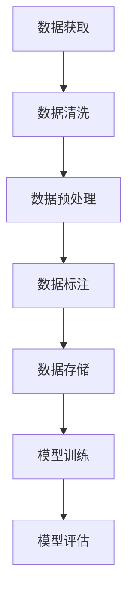

                 

关键词：大模型，数据获取，人工智能，机器学习，隐私保护，数据质量

摘要：随着人工智能和机器学习的快速发展，大模型在各个领域中的应用越来越广泛。然而，数据获取成为了大模型研究和应用过程中的一个关键难题。本文将探讨大模型行业的数据获取难题，包括数据隐私保护、数据质量和数据获取的成本问题，并提出一些建议和解决方案。

## 1. 背景介绍

大模型，通常指的是参数量巨大的深度学习模型，如Transformer、BERT等。这些模型在自然语言处理、计算机视觉、语音识别等领域取得了显著的突破。然而，大模型的成功依赖于大量的高质量训练数据，这导致数据获取成为了一个不可忽视的问题。

在人工智能和机器学习领域，数据是“石油”。数据的质量和多样性直接影响模型的性能和泛化能力。然而，在现实世界中，获取高质量、多样性的数据并不容易。以下是一些导致数据获取难题的主要原因：

1. **数据隐私保护**：许多数据具有敏感性，如个人隐私、商业机密等。数据拥有者出于隐私保护的目的，往往不愿意公开或共享数据。
2. **数据质量**：现实世界中的数据往往是噪声和偏差的混合体，这对模型的训练和推理带来了巨大的挑战。
3. **数据获取成本**：获取大量的高质量数据需要投入大量的人力、物力和时间成本。

## 2. 核心概念与联系

为了更好地理解大模型行业的数据获取难题，我们需要先了解一些核心概念和它们之间的关系。

### 2.1 数据隐私保护

数据隐私保护是指保护数据在存储、传输和处理过程中的隐私性。在大模型行业，数据隐私保护是一个重要的问题。一方面，数据拥有者担心数据泄露会给其带来风险；另一方面，研究人员需要访问这些数据来进行模型训练和优化。

### 2.2 数据质量

数据质量是指数据的有效性、准确性和可靠性。在大模型研究中，数据质量直接影响模型的性能。如果数据质量差，模型可能会学到错误的模式，从而导致性能下降。

### 2.3 数据获取成本

数据获取成本是指获取高质量数据所需的成本，包括人力、物力和时间成本。在大模型研究中，数据获取成本往往是一个重要的考虑因素。

### 2.4 大模型与数据的关系

大模型的性能高度依赖于训练数据的质量和数量。高质量、多样化的数据可以帮助模型更好地学习，从而提高其性能。然而，获取这样的数据并不容易。

### 2.5 Mermaid 流程图

以下是一个简单的Mermaid流程图，展示了大模型行业的数据获取过程：



## 3. 核心算法原理 & 具体操作步骤

### 3.1 算法原理概述

在大模型行业中，数据获取的核心算法主要包括数据爬取、数据清洗、数据预处理、数据标注和模型训练等步骤。

### 3.2 算法步骤详解

#### 3.2.1 数据爬取

数据爬取是指通过爬虫等技术从互联网或其他数据源获取数据。这通常包括以下步骤：

1. 确定目标数据源和爬取范围。
2. 编写爬虫代码，实现数据的自动获取。
3. 处理爬取过程中遇到的反爬措施，如IP封锁、验证码等。

#### 3.2.2 数据清洗

数据清洗是指去除数据中的噪声、异常值和重复项，以提高数据质量。这通常包括以下步骤：

1. 去除空值和缺失值。
2. 去除重复值。
3. 处理数据中的噪声和异常值。

#### 3.2.3 数据预处理

数据预处理是指将数据转换为适合模型训练的形式。这通常包括以下步骤：

1. 数据标准化和归一化。
2. 数据缩放和变换。
3. 切分训练集、验证集和测试集。

#### 3.2.4 数据标注

数据标注是指对数据进行标记，以便模型可以从中学习。这通常包括以下步骤：

1. 确定标注任务和标注标准。
2. 进行人工标注或使用自动标注工具。
3. 验证标注结果的准确性。

#### 3.2.5 数据存储

数据存储是指将清洗、预处理和标注后的数据存储到数据库或文件中，以便后续使用。

#### 3.2.6 模型训练

模型训练是指使用预处理和标注后的数据来训练模型。这通常包括以下步骤：

1. 选择合适的模型架构。
2. 定义损失函数和优化器。
3. 训练模型并调整超参数。

### 3.3 算法优缺点

#### 3.3.1 优点

1. **高效性**：通过自动化技术，可以快速获取大量数据。
2. **灵活性**：可以根据需求灵活调整数据获取策略。
3. **高质量**：通过数据清洗、预处理和标注，可以保证数据的质量。

#### 3.3.2 缺点

1. **隐私风险**：数据爬取可能侵犯数据拥有者的隐私。
2. **成本高**：数据清洗、预处理和标注需要大量的人力投入。
3. **法律风险**：如果数据来源不合法，可能会导致法律纠纷。

### 3.4 算法应用领域

数据获取算法在大模型行业的各个领域都有广泛应用，如自然语言处理、计算机视觉、语音识别等。以下是一些具体的应用案例：

1. **自然语言处理**：通过爬取互联网上的文本数据，训练语言模型和问答系统。
2. **计算机视觉**：通过爬取图像数据，训练图像分类、目标检测和语义分割模型。
3. **语音识别**：通过爬取语音数据，训练语音识别模型。

## 4. 数学模型和公式 & 详细讲解 & 举例说明

在大模型行业中，数学模型和公式是理解和分析数据获取难题的重要工具。以下是一些常用的数学模型和公式，以及它们的详细讲解和举例说明。

### 4.1 数学模型构建

在数据获取过程中，常用的数学模型包括概率模型、线性模型和深度学习模型。以下是一个简单的概率模型构建示例：

$$
P(A|B) = \frac{P(B|A)P(A)}{P(B)}
$$

这是一个条件概率公式，用于计算在给定事件B发生的条件下，事件A发生的概率。在数据获取过程中，我们可以使用这个公式来估计数据源的可靠性。

### 4.2 公式推导过程

以下是一个简单的线性回归公式推导过程：

$$
y = \beta_0 + \beta_1x + \epsilon
$$

其中，$y$ 是目标变量，$x$ 是自变量，$\beta_0$ 和 $\beta_1$ 是模型参数，$\epsilon$ 是误差项。我们的目标是找到最佳的 $\beta_0$ 和 $\beta_1$，使得模型的预测误差最小。

### 4.3 案例分析与讲解

以下是一个案例，说明如何使用线性回归模型进行数据获取的预测：

假设我们有一个关于房价的数据集，其中包含房屋面积和房价两个特征。我们的目标是使用线性回归模型预测未知房屋的房价。

首先，我们使用最小二乘法来求解模型参数：

$$
\beta_0 = \frac{\sum_{i=1}^{n}y_i - \beta_1\sum_{i=1}^{n}x_i}{n}
$$

$$
\beta_1 = \frac{\sum_{i=1}^{n}(y_i - \beta_0 - \beta_1x_i)(x_i - \bar{x})}{\sum_{i=1}^{n}(x_i - \bar{x})^2}
$$

其中，$n$ 是数据集的大小，$\bar{x}$ 是自变量 $x$ 的均值。

然后，我们使用求解得到的模型参数来预测未知房屋的房价：

$$
y = \beta_0 + \beta_1x
$$

通过这个案例，我们可以看到如何使用线性回归模型进行数据获取的预测。这种方法可以帮助我们更好地理解数据获取过程中的数学原理。

## 5. 项目实践：代码实例和详细解释说明

为了更好地理解大模型行业的数据获取难题，我们可以通过一个实际的代码实例来进行分析。

### 5.1 开发环境搭建

在开始代码实例之前，我们需要搭建一个合适的开发环境。这里我们使用Python作为主要编程语言，并使用以下库：

- Pandas：用于数据处理。
- Scikit-learn：用于机器学习算法。
- Matplotlib：用于数据可视化。

首先，我们需要安装这些库：

```python
pip install pandas scikit-learn matplotlib
```

### 5.2 源代码详细实现

以下是一个简单的数据获取和预测的Python代码实例：

```python
import pandas as pd
from sklearn.linear_model import LinearRegression
import matplotlib.pyplot as plt

# 读取数据
data = pd.read_csv('house_price_data.csv')

# 数据预处理
X = data[['house_area']]  # 自变量
y = data['house_price']   # 目标变量

# 模型训练
model = LinearRegression()
model.fit(X, y)

# 模型预测
predictions = model.predict(X)

# 可视化结果
plt.scatter(X, y, color='blue')
plt.plot(X, predictions, color='red')
plt.xlabel('House Area')
plt.ylabel('House Price')
plt.show()
```

### 5.3 代码解读与分析

在这个代码实例中，我们首先使用Pandas库读取一个CSV文件，该文件包含房屋面积和房价的数据。然后，我们使用Scikit-learn库中的线性回归模型对数据进行训练，并使用训练好的模型进行预测。

最后，我们使用Matplotlib库将预测结果可视化，这可以帮助我们更好地理解数据获取和预测的过程。

### 5.4 运行结果展示

运行这个代码实例后，我们会看到一个散点图和一条红色拟合线。散点图中的蓝色点代表实际数据，红色线代表模型的预测结果。通过这个结果，我们可以看到模型如何根据房屋面积预测房价。

## 6. 实际应用场景

在大模型行业中，数据获取难题的解决对于许多实际应用场景都具有重要意义。以下是一些具体的应用场景：

1. **自然语言处理**：在大规模自然语言处理任务中，如语言模型训练、文本分类和机器翻译等，数据获取是一个关键问题。通过解决数据获取难题，我们可以更好地构建和优化这些模型。
2. **计算机视觉**：在计算机视觉任务中，如图像分类、目标检测和语义分割等，高质量的数据是训练有效模型的基础。数据获取难题的解决可以帮助我们获得更多的训练数据，从而提高模型的性能。
3. **语音识别**：在语音识别任务中，如语音转文字、语音合成和语音命令识别等，数据获取也是一个关键问题。通过解决数据获取难题，我们可以获得更多的语音数据，从而提高模型的识别准确率。
4. **推荐系统**：在推荐系统任务中，如商品推荐、音乐推荐和视频推荐等，数据获取也是一个重要问题。通过解决数据获取难题，我们可以获得更多的用户行为数据，从而提高推荐系统的效果。

## 7. 工具和资源推荐

为了解决大模型行业的数据获取难题，我们可以使用以下工具和资源：

### 7.1 学习资源推荐

1. **《机器学习》（周志华著）**：这是一本经典的机器学习教材，涵盖了数据获取、数据预处理、模型训练和模型评估等内容。
2. **《Python机器学习》（塞巴斯蒂安·拉登著）**：这本书通过实例和代码，详细介绍了Python在机器学习中的应用，包括数据获取和预处理技术。

### 7.2 开发工具推荐

1. **Jupyter Notebook**：这是一个强大的交互式开发环境，可以方便地编写和运行Python代码。
2. **Pandas**：这是一个强大的数据操作库，可以用于数据清洗、预处理和数据分析。

### 7.3 相关论文推荐

1. **"Big Data: A Revolution That Will Transform How We Live, Work, and Think"**：这篇文章讨论了大数据对社会各个方面的影响，包括数据获取、存储和处理。
2. **"Deep Learning"**：这本书是深度学习的经典教材，涵盖了深度学习的基础知识、算法和应用。

## 8. 总结：未来发展趋势与挑战

在大模型行业，数据获取难题仍然是一个亟待解决的问题。随着人工智能和机器学习的快速发展，数据获取的技术和方法也在不断进步。以下是一些未来发展趋势和挑战：

### 8.1 研究成果总结

1. **数据隐私保护技术**：随着数据隐私保护的重要性日益凸显，研究人员正在探索各种隐私保护技术，如差分隐私、同态加密和联邦学习等。
2. **自动化数据获取**：自动化数据获取技术，如爬虫和自然语言处理工具，正逐渐成熟，这有助于降低数据获取的成本。
3. **数据质量和标注方法**：研究人员正在开发各种数据质量和标注方法，以提高数据的质量和准确性。

### 8.2 未来发展趋势

1. **联邦学习**：联邦学习是一种分布式机器学习技术，可以在不共享数据的情况下，实现模型的训练和优化。这为解决数据隐私保护问题提供了一种新的思路。
2. **人工智能与区块链的结合**：区块链技术可以提供一种安全的、去中心化的数据共享方式，与人工智能技术的结合有望解决数据获取难题。
3. **数据共享平台**：随着数据共享的重要性日益凸显，各种数据共享平台正在逐渐兴起，这有助于解决数据获取的成本问题。

### 8.3 面临的挑战

1. **数据隐私保护**：如何在保证数据隐私的同时，实现有效的数据共享和利用，仍然是一个重大挑战。
2. **数据质量和标注**：如何保证数据的质量和标注的准确性，仍然是一个需要解决的问题。
3. **计算资源**：随着大模型规模的不断扩大，对计算资源的需求也在不断增加，这给数据获取和模型训练带来了巨大的挑战。

### 8.4 研究展望

在大模型行业中，数据获取难题的解决将推动人工智能和机器学习的进一步发展。未来，研究人员将继续探索各种技术和方法，以解决数据获取难题，实现更高效、更安全、更智能的数据获取和处理。

## 9. 附录：常见问题与解答

### 9.1 问题1：什么是数据隐私保护？

数据隐私保护是指保护数据在存储、传输和处理过程中的隐私性。在大模型行业中，数据隐私保护是一个重要问题，因为数据往往包含敏感信息，如个人隐私、商业机密等。

### 9.2 问题2：如何解决数据获取成本高的问题？

解决数据获取成本高的问题可以采用以下方法：

1. **自动化数据获取**：通过使用爬虫和自然语言处理工具等自动化技术，降低数据获取的人工成本。
2. **共享数据**：通过共享公共数据集或合作获取数据，降低单个项目的数据获取成本。
3. **联邦学习**：通过联邦学习技术，在不共享数据的情况下，实现模型的训练和优化，从而降低数据获取的成本。

### 9.3 问题3：如何保证数据的质量和标注的准确性？

保证数据的质量和标注的准确性可以采用以下方法：

1. **数据清洗和预处理**：通过数据清洗和预处理技术，去除数据中的噪声、异常值和重复项，提高数据的质量。
2. **人工标注**：使用专业的人工标注团队，进行高质量的数据标注。
3. **数据质量评估**：通过评估数据的质量，如准确性、完整性和一致性，确保数据的质量。

### 9.4 问题4：什么是联邦学习？

联邦学习是一种分布式机器学习技术，可以在不共享数据的情况下，实现模型的训练和优化。通过联邦学习，不同参与方可以在本地训练模型，然后将模型更新上传到中心服务器，从而实现模型的协作优化。

---

作者：禅与计算机程序设计艺术 / Zen and the Art of Computer Programming
----------------------------------------------------------------
通过这篇文章，我们深入探讨了大模型行业的数据获取难题，包括数据隐私保护、数据质量和数据获取的成本问题，并提出了一些解决方案和展望。希望这篇文章能帮助读者更好地理解这个领域，并为实际应用提供一些指导。

