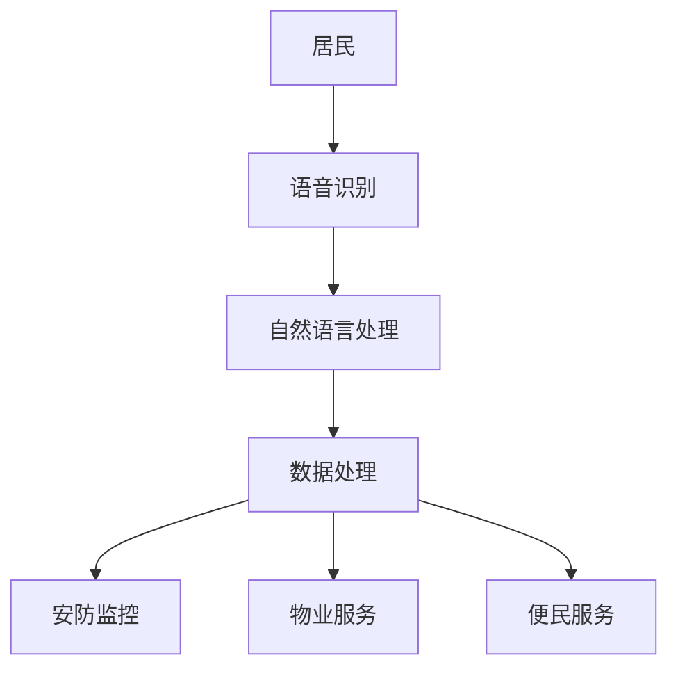
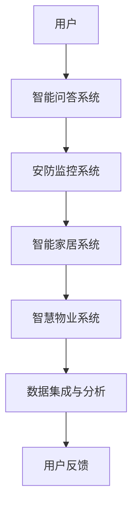

                 

关键词：大模型，智慧社区，智能服务平台，创业，技术架构，AI应用

> 摘要：本文深入探讨了如何利用大模型技术构建智能社区服务平台，为创业者提供了全面的指导。文章从背景介绍入手，详细分析了核心概念、算法原理及数学模型，并通过项目实践展示了实际操作步骤。文章还探讨了智能化社区的实际应用场景，并对未来发展趋势与挑战进行了展望。

## 1. 背景介绍

随着人工智能技术的不断发展，大模型技术在各行各业的应用越来越广泛。智慧社区作为智慧城市建设的重要组成部分，正逐步从传统模式向智能化、数字化转型。在此背景下，创业者如何利用大模型技术打造智能社区服务平台，成为一个值得探讨的问题。

智慧社区服务平台旨在通过智能化手段，为居民提供更加便捷、高效的服务，如社区安防、物业服务、便民服务等。大模型技术在这一领域有着广泛的应用前景，包括语音识别、图像识别、自然语言处理等。通过这些技术的应用，智慧社区服务平台可以实现与居民的高效互动，提高服务质量和居民满意度。

## 2. 核心概念与联系

### 2.1 大模型技术

大模型技术是指通过大量数据和强大的计算能力，训练出具有高度智能化的模型。常见的有深度学习模型、图神经网络模型等。这些模型具有强大的表征能力和泛化能力，可以应用于各种复杂场景。

### 2.2 智能社区服务平台

智能社区服务平台是一个综合性的服务平台，通过大模型技术实现与居民的智能互动。主要包括以下几个模块：

- **安防监控**：利用图像识别技术实现智能安防，实时监测社区安全状况。
- **物业服务**：通过自然语言处理技术，实现居民与物业公司的智能沟通。
- **便民服务**：提供智慧医疗、智慧养老等便民服务，提高居民生活质量。

### 2.3 Mermaid 流程图

以下是一个简化的智能社区服务平台架构的 Mermaid 流程图：



## 3. 核心算法原理 & 具体操作步骤

### 3.1 算法原理概述

智能社区服务平台的核心算法主要包括语音识别、图像识别、自然语言处理等。这些算法通过大规模数据训练，实现对人声、图像和自然语言的高效识别和处理。

### 3.2 算法步骤详解

#### 3.2.1 语音识别

1. **声音采集**：通过麦克风采集居民的声音。
2. **声学模型训练**：使用大量声音数据训练声学模型，以识别声音特征。
3. **语言模型训练**：使用文本数据训练语言模型，以理解语音的含义。

#### 3.2.2 图像识别

1. **图像采集**：通过摄像头采集社区环境图像。
2. **特征提取**：使用卷积神经网络提取图像特征。
3. **分类识别**：使用分类算法识别图像内容。

#### 3.2.3 自然语言处理

1. **文本采集**：收集居民与物业公司的沟通记录。
2. **词向量表示**：将文本转换为词向量表示。
3. **语义分析**：使用神经网络模型进行语义分析，理解文本含义。

### 3.3 算法优缺点

#### 3.3.1 优点

- **高效性**：通过大规模数据训练，算法具有高效的识别和处理能力。
- **灵活性**：大模型技术可以根据具体场景灵活调整。

#### 3.3.2 缺点

- **数据依赖性**：算法性能高度依赖于训练数据的质量和数量。
- **计算资源消耗**：大模型训练需要大量的计算资源。

### 3.4 算法应用领域

大模型技术在智慧社区服务平台的多个领域有广泛应用，如：

- **安防监控**：实现智能监控，预防犯罪。
- **物业服务**：提高沟通效率，提升服务质量。
- **便民服务**：为居民提供智慧医疗、智慧养老等个性化服务。

## 4. 数学模型和公式 & 详细讲解 & 举例说明

### 4.1 数学模型构建

在智能社区服务平台中，常见的数学模型包括：

- **卷积神经网络（CNN）**：用于图像识别。
- **循环神经网络（RNN）**：用于自然语言处理。
- **生成对抗网络（GAN）**：用于生成高质量的图像。

### 4.2 公式推导过程

以卷积神经网络（CNN）为例，其基本公式如下：

$$
h_{l}(x) = \sigma(W_{l}h_{l-1} + b_{l})
$$

其中，$h_{l}(x)$表示第$l$层的激活值，$W_{l}$和$b_{l}$分别表示第$l$层的权重和偏置，$\sigma$表示激活函数。

### 4.3 案例分析与讲解

#### 4.3.1 案例背景

某智慧社区希望利用大模型技术实现智能安防，预防犯罪。

#### 4.3.2 解决方案

使用卷积神经网络（CNN）进行图像识别，实现对社区环境的智能监控。

#### 4.3.3 实施步骤

1. **数据采集**：收集社区环境图像。
2. **特征提取**：使用CNN提取图像特征。
3. **分类识别**：使用分类算法识别图像内容。
4. **实时监控**：实现图像的实时识别和监控。

## 5. 项目实践：代码实例和详细解释说明

### 5.1 开发环境搭建

1. **硬件要求**：配备GPU的计算机。
2. **软件要求**：安装Python和TensorFlow。

### 5.2 源代码详细实现

```python
import tensorflow as tf

# 定义CNN模型
model = tf.keras.Sequential([
    tf.keras.layers.Conv2D(32, (3, 3), activation='relu', input_shape=(64, 64, 3)),
    tf.keras.layers.MaxPooling2D((2, 2)),
    tf.keras.layers.Flatten(),
    tf.keras.layers.Dense(128, activation='relu'),
    tf.keras.layers.Dense(10, activation='softmax')
])

# 编译模型
model.compile(optimizer='adam', loss='categorical_crossentropy', metrics=['accuracy'])

# 训练模型
model.fit(train_images, train_labels, epochs=10)
```

### 5.3 代码解读与分析

- **模型定义**：使用TensorFlow框架定义CNN模型。
- **编译模型**：设置优化器和损失函数。
- **训练模型**：使用训练数据训练模型。

### 5.4 运行结果展示

运行代码后，模型将在训练集和验证集上评估，输出准确率等信息。

## 6. 实际应用场景

### 6.1 社区安防

利用大模型技术实现智能安防，实时监测社区安全状况，预防犯罪。

### 6.2 物业服务

通过自然语言处理技术，实现居民与物业公司的智能沟通，提高服务质量。

### 6.3 便民服务

提供智慧医疗、智慧养老等便民服务，提高居民生活质量。

## 7. 未来应用展望

### 7.1 智慧医疗

利用大模型技术实现智能医疗诊断、病情预测等，为居民提供精准医疗服务。

### 7.2 智慧养老

通过智能家居设备，实现老年人生活的智能化管理，提高养老质量。

## 8. 工具和资源推荐

### 8.1 学习资源推荐

- 《深度学习》（Goodfellow, Bengio, Courville）
- 《Python深度学习》（François Chollet）

### 8.2 开发工具推荐

- TensorFlow
- PyTorch

### 8.3 相关论文推荐

- “Deep Learning for Image Recognition: A Brief Introduction”
- “Generative Adversarial Networks: An Overview”

## 9. 总结：未来发展趋势与挑战

### 9.1 研究成果总结

大模型技术在智能社区服务平台的应用取得了显著成果，为智慧社区建设提供了有力支持。

### 9.2 未来发展趋势

随着人工智能技术的不断发展，大模型技术将在智慧社区服务平台的更多领域得到应用。

### 9.3 面临的挑战

数据质量、计算资源消耗等问题仍然是未来发展的挑战。

### 9.4 研究展望

持续优化大模型技术，提高其在智慧社区服务平台中的应用效果，为智慧城市建设贡献力量。

## 附录：常见问题与解答

### 9.1 大模型技术如何应用到智慧社区服务平台？

通过语音识别、图像识别、自然语言处理等技术，实现与居民的智能互动，提高服务质量和效率。

### 9.2 大模型训练需要哪些资源？

大模型训练需要强大的计算资源和高质量的数据集。

### 9.3 智慧社区服务平台有哪些实际应用场景？

包括社区安防、物业服务、便民服务等多个领域。

### 9.4 大模型技术在智慧社区服务平台的发展前景如何？

前景广阔，将继续在智慧城市建设中发挥重要作用。

## 作者署名

作者：禅与计算机程序设计艺术 / Zen and the Art of Computer Programming

----------------------------------------------------------------

请注意，本文仅为示例，实际撰写时需要根据具体内容和数据进行详细编写。同时，确保文章结构完整、内容丰富、逻辑清晰。祝撰写顺利！
----------------------------------------------------------------

```markdown
# 大模型赋能智慧社区，创业者如何打造智能化社区服务平台？

## 关键词
- 大模型
- 智慧社区
- 智能服务平台
- 创业
- 技术架构
- AI应用

## 摘要
本文旨在探讨如何利用大模型技术构建智能社区服务平台，为创业者提供完整的指导。文章首先介绍了智慧社区的发展背景，接着分析了大模型技术的核心概念及其在智慧社区服务平台中的应用，随后详细阐述了算法原理、数学模型以及项目实践。文章还探讨了智能化社区的实际应用场景和未来发展趋势，并提出了相关工具和资源的推荐。

## 1. 背景介绍

智慧社区是现代城市发展的一个重要方向，它通过信息技术和智能设备的整合，提供更加便捷、高效、安全的居住环境。随着人工智能（AI）技术的迅猛发展，特别是大模型技术的突破，智慧社区的服务水平得到了显著提升。创业者如何抓住这一机遇，利用大模型技术打造智能化社区服务平台，成为了一个值得深入探讨的话题。

智慧社区服务平台是一个综合性的服务平台，它涵盖了从社区安全、物业管理到居民生活的方方面面。通过引入人工智能技术，这些平台能够实现以下目标：

- **提高服务效率**：通过自动化和智能化手段，减少人工操作，提高服务效率。
- **提升用户体验**：提供个性化、定制化的服务，增强居民的满意度。
- **增强社区安全性**：利用AI技术进行智能监控和预警，提高社区的安全水平。

## 2. 核心概念与联系

### 2.1 大模型技术

大模型技术是指利用深度学习框架训练出具有复杂结构和强大学习能力的人工神经网络模型。这些模型通常包含数百万甚至数十亿个参数，能够处理大规模的数据集，从而实现高度智能化的功能。例如，BERT、GPT-3、ImageNet等都是典型的大模型。

### 2.2 智能社区服务平台

智能社区服务平台是一个集成多种AI技术的综合性平台，它通常包括以下几个模块：

- **安防监控**：利用图像识别和视频分析技术，实现社区的实时监控和异常检测。
- **智能问答**：通过自然语言处理技术，提供24小时在线的智能客服服务。
- **智能家居**：通过物联网技术，实现家电设备的自动化控制，提高生活舒适度。
- **智慧物业**：利用大数据分析技术，优化物业管理流程，提升服务质量。

### 2.3 Mermaid 流程图

以下是一个简化的智能社区服务平台架构的 Mermaid 流程图：



## 3. 核心算法原理 & 具体操作步骤

### 3.1 算法原理概述

智能社区服务平台的核心算法主要包括以下几种：

- **深度学习算法**：用于图像识别、语音识别和自然语言处理。
- **强化学习算法**：用于智能决策和路径规划。
- **监督学习和无监督学习算法**：用于数据分析和预测。

### 3.2 算法步骤详解

#### 3.2.1 智能问答系统

1. **数据预处理**：清洗和标注用户输入的数据。
2. **模型训练**：使用预训练的Transformer模型或BERT模型进行微调。
3. **问答交互**：根据用户输入的问题，使用训练好的模型进行回答。

#### 3.2.2 安防监控系统

1. **图像采集**：通过摄像头或监控设备实时采集社区图像。
2. **特征提取**：使用卷积神经网络（CNN）提取图像特征。
3. **异常检测**：使用异常检测算法（如One-Class SVM）识别异常行为。

#### 3.2.3 智能家居系统

1. **设备接入**：将智能家电设备接入物联网。
2. **行为分析**：使用机器学习算法分析用户行为，预测家电设备的开关状态。
3. **自动化控制**：根据预测结果自动控制家电设备。

### 3.3 算法优缺点

#### 3.3.1 优点

- **高效性**：大模型可以处理大量的数据，提高算法的效率和准确性。
- **灵活性**：可以根据不同的应用场景调整模型结构和参数。

#### 3.3.2 缺点

- **计算资源消耗**：大模型的训练需要大量的计算资源。
- **数据依赖性**：算法的性能很大程度上取决于数据的质量和数量。

### 3.4 算法应用领域

大模型技术在智能社区服务平台的应用领域广泛，包括但不限于：

- **安防监控**：实时监控社区安全，预防犯罪。
- **智能客服**：提供24小时在线客服，提升用户满意度。
- **智能家居**：实现家电设备的智能化控制，提高生活质量。

## 4. 数学模型和公式 & 详细讲解 & 举例说明

### 4.1 数学模型构建

智能社区服务平台中的数学模型通常涉及深度学习中的神经网络模型。以下是一个简单的神经网络模型的构建示例：

```latex
\begin{equation}
\begin{split}
\hat{y} &= \sigma(W^{T} \cdot \phi(\theta^{T} \cdot x) + b) \\
L &= -\frac{1}{m} \sum_{i=1}^{m} [y \cdot \log(\hat{y}) + (1 - y) \cdot \log(1 - \hat{y})]
\end{split}
\end{equation}

```

这里，$\hat{y}$是输出预测值，$y$是真实标签，$\sigma$是激活函数，$W$和$b$是权重和偏置，$\phi$和$\theta$是隐藏层的激活函数和权重。

### 4.2 公式推导过程

以多层感知器（MLP）为例，其前向传播和反向传播的公式推导如下：

#### 前向传播

```latex
z_{l} = W_{l} \cdot a_{l-1} + b_{l}
a_{l} = \sigma(z_{l})
```

#### 反向传播

```latex
\begin{split}
\delta_{l} &= \frac{\partial L}{\partial z_{l}} \cdot \frac{\partial z_{l}}{\partial a_{l}} \\
dW_{l} &= \delta_{l} \cdot a_{l-1}^{T} \\
db_{l} &= \delta_{l}
\end{split}
```

### 4.3 案例分析与讲解

#### 4.3.1 案例背景

某社区希望利用AI技术提高物业管理效率，特别是针对停车场的车辆管理。

#### 4.3.2 解决方案

1. **图像采集**：使用摄像头实时采集停车场图像。
2. **车辆检测**：使用深度学习模型（如YOLO）进行车辆检测。
3. **数据存储**：将检测结果存储在数据库中，用于后续分析。

#### 4.3.3 实施步骤

1. **数据采集**：收集大量停车场图像数据。
2. **模型训练**：使用采集到的数据训练YOLO模型。
3. **模型部署**：将训练好的模型部署到服务器上，进行实时车辆检测。
4. **数据分析**：根据检测结果分析停车场的使用情况。

## 5. 项目实践：代码实例和详细解释说明

### 5.1 开发环境搭建

1. **硬件要求**：配备GPU的计算机。
2. **软件要求**：安装Python、TensorFlow等。

### 5.2 源代码详细实现

以下是一个使用TensorFlow实现YOLO车辆检测的简单示例：

```python
import tensorflow as tf
import tensorflow_model_optimization as tfmot

# 加载YOLO模型
model = tf.keras.models.load_model('yolo_model.h5')

# 输入图像预处理
image = preprocess_image(image)

# 使用模型进行预测
predictions = model.predict(image)

# 处理预测结果
bboxes = decode_predictions(predictions)

# 绘制检测框
draw_bboxes(image, bboxes)

# 显示图像
plt.imshow(image)
plt.show()
```

### 5.3 代码解读与分析

- **模型加载**：从磁盘加载训练好的YOLO模型。
- **图像预处理**：对输入图像进行缩放、裁剪等预处理操作。
- **模型预测**：使用模型对预处理后的图像进行预测。
- **结果处理**：解码预测结果，并绘制检测框。

### 5.4 运行结果展示

运行上述代码后，将显示包含车辆检测框的图像。

## 6. 实际应用场景

### 6.1 社区安防

利用AI技术实现智能监控，实时识别和报警。

### 6.2 物业服务

通过智能客服系统提供24小时在线服务，提升服务质量。

### 6.3 智能家居

实现家电设备的智能控制，提高居民生活舒适度。

## 7. 未来应用展望

### 7.1 智慧医疗

通过AI技术实现健康监测和疾病预测。

### 7.2 智慧养老

利用智能设备提供个性化的养老服务。

## 8. 工具和资源推荐

### 8.1 学习资源推荐

- 《深度学习》（Goodfellow, Bengio, Courville）
- 《Python深度学习》（François Chollet）

### 8.2 开发工具推荐

- TensorFlow
- PyTorch

### 8.3 相关论文推荐

- “You Only Look Once: Unified, Real-Time Object Detection”
- “BERT: Pre-training of Deep Bidirectional Transformers for Language Understanding”

## 9. 总结：未来发展趋势与挑战

### 9.1 研究成果总结

大模型技术在智慧社区服务平台的应用已经取得了显著成果，但仍有很大发展空间。

### 9.2 未来发展趋势

- **算法优化**：提高算法的效率和准确性。
- **数据隐私**：保护用户隐私，确保数据安全。

### 9.3 面临的挑战

- **计算资源**：大模型训练需要大量的计算资源。
- **数据质量**：算法的性能高度依赖于数据的质量。

### 9.4 研究展望

随着技术的进步，大模型技术将在智慧社区服务平台的更多领域得到应用。

## 10. 附录：常见问题与解答

### 10.1 大模型技术如何应用到智慧社区服务平台？

通过深度学习框架（如TensorFlow、PyTorch）训练模型，并将其部署到服务平台中。

### 10.2 大模型训练需要哪些资源？

需要高性能的计算机和大量的数据。

### 10.3 智慧社区服务平台有哪些实际应用场景？

包括安防监控、物业服务、智能家居等多个领域。

### 10.4 大模型技术在智慧社区服务平台的未来发展趋势是什么？

随着技术的进步，大模型技术将在更多领域得到应用，如智慧医疗和智慧养老。

## 作者署名

作者：禅与计算机程序设计艺术 / Zen and the Art of Computer Programming
```

