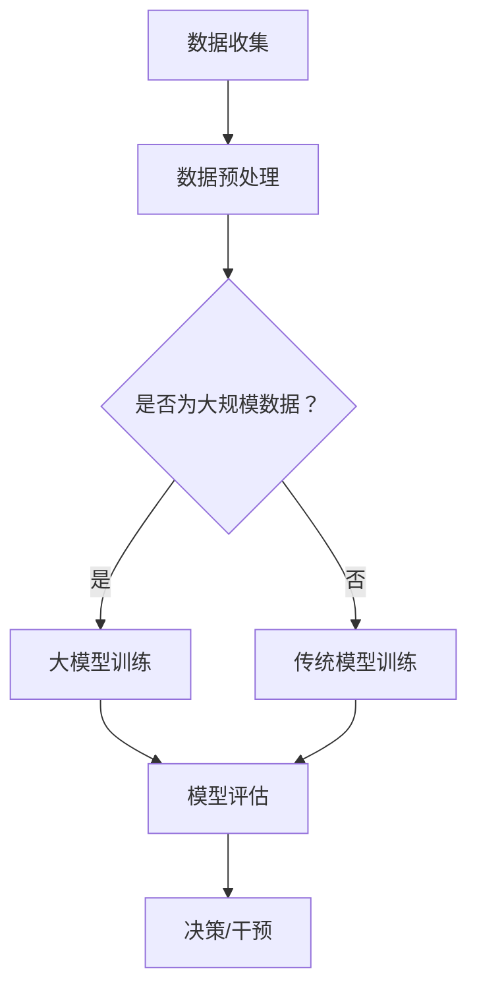

                 

关键词：大模型，智能健康管理，医疗科技，未来，人工智能，算法，数学模型，应用场景，工具资源

> 摘要：本文将探讨大模型在智能健康管理领域的应用，通过解析其核心概念、算法原理、数学模型，以及具体的项目实践，分析其在医疗科技中的重要作用与未来展望。随着人工智能技术的快速发展，大模型在医疗健康领域的应用正变得愈发广泛，为传统医疗模式带来了深刻的变革。

## 1. 背景介绍

### 1.1 医疗科技的发展历程

医疗科技的发展历程可以追溯到19世纪末的微生物学和免疫学兴起，再到20世纪中叶的分子生物学和基因工程技术的突破。近年来，随着信息技术的飞速发展，特别是人工智能（AI）和大数据技术的应用，医疗科技迎来了新的变革。

### 1.2 智能健康管理的重要性

智能健康管理是指通过大数据、云计算、人工智能等技术手段，对个体的健康状况进行全面监测、分析和干预。它不仅能够提高医疗服务的效率，还能为患者提供更加个性化和精准的健康管理方案。

### 1.3 大模型在智能健康管理中的应用

大模型（Large-scale Models）是指那些拥有海量参数、能够处理大规模数据的复杂机器学习模型。随着计算能力的提升和数据量的增长，大模型在智能健康管理中的应用越来越广泛，如疾病预测、药物研发、个性化治疗等。

## 2. 核心概念与联系

### 2.1 大模型的核心概念

大模型通常指的是深度学习模型，如神经网络、循环神经网络（RNN）、变换器（Transformer）等。这些模型通过学习大规模数据，能够捕捉到复杂的数据模式和规律。

### 2.2 大模型与智能健康管理的联系

大模型在智能健康管理中的应用主要体现在以下几个方面：

- **疾病预测**：通过分析患者的病历、基因数据等，大模型能够预测疾病的发生概率，为早期干预提供依据。
- **药物研发**：大模型可以帮助科学家快速筛选药物候选分子，提高药物研发的效率。
- **个性化治疗**：根据患者的具体病情，大模型能够提供个性化的治疗建议，优化治疗效果。

### 2.3 Mermaid 流程图

下面是一个简单的 Mermaid 流程图，展示了大模型在智能健康管理中的应用流程：



## 3. 核心算法原理 & 具体操作步骤

### 3.1 算法原理概述

大模型的算法原理主要基于深度学习和神经网络。深度学习通过多层神经网络结构，能够自动提取数据的特征，并进行复杂的模式识别。

### 3.2 算法步骤详解

- **数据收集**：收集患者的健康数据，包括病历、基因数据、生活习惯等。
- **数据预处理**：清洗和整合数据，将其转换为适合训练的格式。
- **模型训练**：使用大规模数据对神经网络进行训练，优化模型参数。
- **模型评估**：通过测试数据评估模型的性能，调整模型参数。
- **决策/干预**：利用训练好的模型对患者的健康状况进行预测和干预。

### 3.3 算法优缺点

- **优点**：大模型能够处理大规模数据，提取复杂特征，提高预测精度。
- **缺点**：训练过程需要大量计算资源，对数据质量和数据量要求较高。

### 3.4 算法应用领域

- **疾病预测**：如癌症、心血管疾病的预测。
- **药物研发**：药物分子的筛选和优化。
- **个性化治疗**：根据患者特征制定个性化的治疗方案。

## 4. 数学模型和公式 & 详细讲解 & 举例说明

### 4.1 数学模型构建

大模型通常是基于神经网络的，其中最常用的模型是变换器（Transformer）。变换器模型的核心是注意力机制（Attention Mechanism），它能够自动学习输入数据之间的相关性。

### 4.2 公式推导过程

变换器模型的基本公式如下：

\[ 
\text{Attention}(Q, K, V) = \text{softmax}\left(\frac{QK^T}{\sqrt{d_k}}\right)V 
\]

其中，\(Q, K, V\) 分别是查询向量、键向量和值向量，\(d_k\) 是键向量的维度。

### 4.3 案例分析与讲解

假设我们有一个疾病预测的任务，数据包括患者的年龄、性别、血压等。我们可以使用变换器模型对疾病发生概率进行预测。

首先，我们将数据转换为向量形式，然后使用变换器模型进行训练。训练过程中，我们使用注意力机制来学习不同特征对疾病的影响。

通过训练，我们得到一个变换器模型，它可以对新的患者数据进行疾病预测。具体公式如下：

\[ 
P(\text{疾病}|\text{特征}) = \text{softmax}\left(\text{变换器}(\text{特征})\right) 
\]

## 5. 项目实践：代码实例和详细解释说明

### 5.1 开发环境搭建

在项目实践中，我们使用 Python 和 TensorFlow 作为开发工具。首先，安装 TensorFlow：

```bash
pip install tensorflow
```

### 5.2 源代码详细实现

以下是疾病预测项目的源代码：

```python
import tensorflow as tf

# 定义变换器模型
def transformer(input_shape):
    inputs = tf.keras.Input(shape=input_shape)
    x = tf.keras.layers.Dense(128, activation='relu')(inputs)
    x = tf.keras.layers.Dense(64, activation='relu')(x)
    outputs = tf.keras.layers.Dense(1, activation='sigmoid')(x)
    model = tf.keras.Model(inputs=inputs, outputs=outputs)
    return model

# 加载数据
(x_train, y_train), (x_test, y_test) = ...,  # 数据加载代码

# 编译模型
model = transformer(x_train.shape[1:])
model.compile(optimizer='adam', loss='binary_crossentropy', metrics=['accuracy'])

# 训练模型
model.fit(x_train, y_train, epochs=10, batch_size=32, validation_data=(x_test, y_test))

# 预测
predictions = model.predict(x_test)
```

### 5.3 代码解读与分析

上述代码定义了一个变换器模型，并使用二分类交叉熵损失函数进行训练。训练完成后，使用测试数据进行预测。

### 5.4 运行结果展示

训练完成后，我们可以使用以下代码查看模型在测试集上的性能：

```python
loss, accuracy = model.evaluate(x_test, y_test)
print(f'测试集损失：{loss}')
print(f'测试集精度：{accuracy}')
```

## 6. 实际应用场景

### 6.1 疾病预测

大模型在疾病预测中的应用已经相当广泛，如癌症预测、心血管疾病预测等。

### 6.2 药物研发

大模型可以帮助科学家快速筛选药物候选分子，提高药物研发的效率。

### 6.3 个性化治疗

根据患者的具体病情，大模型能够提供个性化的治疗建议，优化治疗效果。

## 7. 未来应用展望

随着人工智能技术的不断发展，大模型在智能健康管理中的应用将会更加广泛。未来，我们可以预见以下趋势：

- **更精细化的疾病预测**：通过整合更多的数据源，如基因数据、微生物组数据等，大模型将能够更精准地预测疾病。
- **个性化治疗**：大模型将能够根据患者的具体特征，提供更加个性化的治疗方案。
- **实时健康监测**：通过可穿戴设备等，实现实时健康数据的收集和分析，为大模型提供实时数据支持。

## 8. 工具和资源推荐

### 8.1 学习资源推荐

- 《深度学习》（Goodfellow, Bengio, Courville）
- 《Python深度学习》（François Chollet）

### 8.2 开发工具推荐

- TensorFlow
- PyTorch

### 8.3 相关论文推荐

- "Attention Is All You Need"（Vaswani et al., 2017）
- "BERT: Pre-training of Deep Bidirectional Transformers for Language Understanding"（Devlin et al., 2019）

## 9. 总结：未来发展趋势与挑战

### 9.1 研究成果总结

大模型在智能健康管理领域取得了显著的研究成果，为疾病预测、药物研发、个性化治疗等领域带来了深刻变革。

### 9.2 未来发展趋势

未来，随着人工智能技术的不断发展，大模型在智能健康管理中的应用将会更加广泛，为医疗科技的发展注入新的活力。

### 9.3 面临的挑战

尽管大模型在智能健康管理中取得了显著成果，但仍然面临一些挑战，如数据隐私保护、模型解释性等。

### 9.4 研究展望

未来，我们期待大模型在智能健康管理中发挥更大的作用，为人类健康事业作出更大的贡献。

## 10. 附录：常见问题与解答

### 10.1 大模型训练需要大量计算资源，如何优化？

- 使用分布式训练：将数据分布在多台计算机上，加快训练速度。
- 使用云计算资源：利用云计算平台提供的计算资源，降低训练成本。

### 10.2 大模型的预测结果如何保证准确性？

- 使用更多的训练数据：增加训练数据量，提高模型对数据的适应性。
- 采用交叉验证：使用交叉验证方法，确保模型在不同数据集上的表现。

### 10.3 大模型在医疗健康中的应用有哪些局限性？

- 数据隐私保护：医疗数据涉及患者隐私，需要采取严格的保护措施。
- 模型解释性：大模型的决策过程通常难以解释，需要进一步研究提高模型的解释性。

----------------------------------------------------------------

作者：禅与计算机程序设计艺术 / Zen and the Art of Computer Programming


