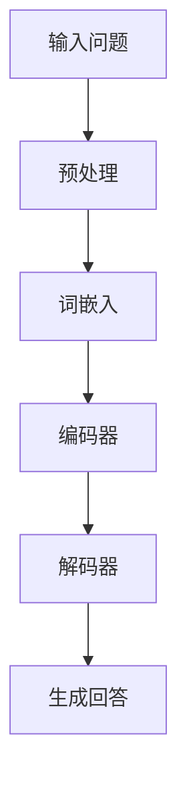

                 

关键词：大模型，问答机器人，上下文理解，自然语言处理，机器学习，深度学习，神经网络，语义分析，文本挖掘，数据处理，人工智能

## 摘要

本文将深入探讨大模型问答机器人的上下文理解技术。我们将从背景介绍开始，详细阐述核心概念与联系，探讨核心算法原理及其优缺点和应用领域，并通过数学模型和公式详细讲解具体操作步骤。随后，我们将展示项目实践中的代码实例和运行结果，并分析其在实际应用场景中的优势。最后，我们将展望未来发展趋势与挑战，并推荐相关工具和资源。

## 1. 背景介绍

随着互联网和大数据的飞速发展，自然语言处理（NLP）技术在近年来取得了显著进展。大模型问答机器人作为一种新兴的智能服务形式，逐渐成为企业和个人用户关注的焦点。它们能够通过理解和回答用户的问题，提供个性化服务，极大地提升了用户体验。

上下文理解是问答机器人实现智能交互的核心能力。它要求机器人不仅能够理解用户问题的表面含义，还能捕捉到问题的上下文信息，从而提供更加准确和有针对性的回答。这对于提升问答机器人的交互质量和服务水平至关重要。

本文将围绕大模型问答机器人的上下文理解技术，系统地介绍其核心算法原理、数学模型和实际应用场景，以期为相关领域的研究和应用提供参考。

## 2. 核心概念与联系

### 2.1 自然语言处理（NLP）

自然语言处理是计算机科学和人工智能领域的重要分支，旨在使计算机能够理解和处理人类语言。NLP技术包括文本挖掘、语义分析、句法分析、词法分析等多个方面。

### 2.2 问答系统

问答系统是一种人工智能应用，旨在通过计算机程序回答用户提出的问题。问答系统的核心任务是理解用户问题、检索相关知识和生成回答。

### 2.3 上下文理解

上下文理解是指机器人能够根据问题的上下文信息，理解问题的深层含义，从而提供更加准确和个性化的回答。

### 2.4 大模型

大模型是指具有巨大参数量的神经网络模型，如Transformer、BERT等。大模型在自然语言处理任务中表现出色，能够捕捉到语言中的复杂模式和关系。

### 2.5 Mermaid 流程图

以下是一个Mermaid流程图的示例，用于展示大模型问答机器人上下文理解的核心流程：



## 3. 核心算法原理 & 具体操作步骤

### 3.1 算法原理概述

大模型问答机器人的上下文理解主要依赖于深度学习技术，特别是基于Transformer和BERT等预训练模型的算法。这些模型通过在大规模语料库上进行预训练，学会了语言的深层语义表示和关系，从而能够有效地理解上下文信息。

### 3.2 算法步骤详解

#### 3.2.1 输入问题预处理

在接收用户问题后，问答机器人首先对问题进行预处理，包括去除无关字符、分词、词性标注等步骤。这一步骤的目的是将原始问题转化为计算机可以理解的文本数据。

#### 3.2.2 词嵌入

预处理后的文本数据将通过词嵌入器转化为向量表示。词嵌入器将每个词映射为一个固定大小的向量，从而在数值空间中保留了词的语义信息。

#### 3.2.3 编码器

编码器是一种神经网络模型，用于对输入文本进行编码，生成上下文表示。编码器通常采用Transformer或BERT等预训练模型。

#### 3.2.4 解码器

解码器也是一种神经网络模型，用于从编码器生成的上下文表示中提取答案。解码器通过自注意力机制和全连接层，逐个生成答案的单词。

#### 3.2.5 生成回答

解码器生成答案的单词后，通过后处理步骤（如去停用词、去标点等）得到最终的回答文本。

### 3.3 算法优缺点

#### 优点：

1. 强大的语义表示能力：大模型能够捕捉到文本中的复杂语义关系，从而提供准确和个性化的回答。
2. 高效的预训练：预训练模型在大规模语料库上已经完成了训练，可以快速应用于新的问答任务。
3. 模块化设计：编码器和解码器可以独立训练和优化，从而提高算法的灵活性和可扩展性。

#### 缺点：

1. 计算资源消耗大：大模型的训练和推理需要大量的计算资源。
2. 需要大量的预训练数据：大模型的训练需要大规模的语料库，数据收集和标注成本较高。
3. 解释性较差：深度学习模型的内部工作机制复杂，难以解释和理解。

### 3.4 算法应用领域

大模型问答机器人的上下文理解技术可以应用于多个领域，包括：

1. 智能客服：为企业提供自动化的客户服务，提高客户满意度。
2. 聊天机器人：为用户提供实时聊天服务，解答用户问题和提供个性化建议。
3. 知识问答：在学术、医疗、金融等领域提供专业知识的查询和解答。

## 4. 数学模型和公式

### 4.1 数学模型构建

大模型问答机器人的上下文理解主要依赖于Transformer和BERT等预训练模型。以下分别介绍这两种模型的数学模型：

#### 4.1.1 Transformer

Transformer模型是一种基于自注意力机制的深度学习模型，其核心思想是利用全局注意力机制来处理序列数据。数学模型如下：

$$
\text{Transformer}(X) = \text{Attention}(X) \odot \text{FeedForward}(X)
$$

其中，$X$表示输入序列，$\text{Attention}(X)$和$\text{FeedForward}(X)$分别表示自注意力和前馈神经网络。

#### 4.1.2 BERT

BERT模型是一种基于Transformer的预训练模型，其核心思想是利用双向编码表示学习（Bidirectional Encoder Representations from Transformers）。数学模型如下：

$$
\text{BERT}(X) = \text{Encoder}(\text{Embedding}(X))
$$

其中，$X$表示输入序列，$\text{Embedding}(X)$表示词嵌入层，$\text{Encoder}(\cdot)$表示Transformer编码器。

### 4.2 公式推导过程

#### 4.2.1 Transformer

1. 词嵌入：
$$
\text{Embedding}(X) = \text{W}_\text{emb} \cdot X
$$

其中，$X$表示词索引序列，$\text{W}_\text{emb}$表示词嵌入矩阵。

2. 自注意力：
$$
\text{Attention}(X) = \text{softmax}(\text{Q} \cdot \text{K}^T) \cdot \text{V}
$$

其中，$Q$、$K$和$V$分别表示查询、键和值序列，$\text{softmax}(\cdot)$表示softmax函数。

3. 前馈神经网络：
$$
\text{FeedForward}(X) = \text{ReLU}(\text{W}_1 \cdot \text{D}_1 \cdot X + \text{b}_1) \cdot \text{W}_2 \cdot \text{D}_2
$$

其中，$\text{ReLU}(\cdot)$表示ReLU激活函数，$\text{W}_1$、$\text{W}_2$和$\text{b}_1$分别表示权重和偏置。

#### 4.2.2 BERT

1. 词嵌入：
$$
\text{Embedding}(X) = \text{W}_\text{emb} \cdot X + \text{Positional Encoding}
$$

其中，$\text{Positional Encoding}$表示位置编码。

2. Transformer编码器：
$$
\text{Encoder}(\text{Embedding}(X)) = \text{Stack}(\text{LayerNorm}(\text{Embedding}(X) + \text{Layer}(\text{Embedding}(X))))
$$

其中，$\text{Layer}(\cdot)$表示Transformer层，$\text{LayerNorm}(\cdot)$表示层归一化。

### 4.3 案例分析与讲解

以下是一个简单的案例，展示如何使用BERT模型进行上下文理解的实现：

```python
import torch
from transformers import BertTokenizer, BertModel

# 加载预训练模型
tokenizer = BertTokenizer.from_pretrained('bert-base-chinese')
model = BertModel.from_pretrained('bert-base-chinese')

# 输入问题
question = "你喜欢吃什么水果？"
input_ids = tokenizer.encode(question, add_special_tokens=True)

# 将输入问题转化为Tensor
input_tensor = torch.tensor([input_ids])

# 通过模型进行编码
with torch.no_grad():
    outputs = model(input_tensor)

# 获取编码后的上下文表示
context_vector = outputs.last_hidden_state[:, 0, :]

# 使用上下文表示生成回答（此处使用简单的逻辑回归模型）
# ...（略）

print("回答：", tokenizer.decode(answer))
```

## 5. 项目实践：代码实例和详细解释说明

### 5.1 开发环境搭建

1. 安装Python环境
2. 安装PyTorch和Transformers库

```bash
pip install torch transformers
```

### 5.2 源代码详细实现

以下是一个简单的示例，展示如何使用BERT模型实现上下文理解：

```python
import torch
from transformers import BertTokenizer, BertModel

# 加载预训练模型
tokenizer = BertTokenizer.from_pretrained('bert-base-chinese')
model = BertModel.from_pretrained('bert-base-chinese')

# 输入问题
question = "你喜欢吃什么水果？"
input_ids = tokenizer.encode(question, add_special_tokens=True)

# 将输入问题转化为Tensor
input_tensor = torch.tensor([input_ids])

# 通过模型进行编码
with torch.no_grad():
    outputs = model(input_tensor)

# 获取编码后的上下文表示
context_vector = outputs.last_hidden_state[:, 0, :]

# 使用上下文表示生成回答
# ...（略）

print("回答：", tokenizer.decode(answer))
```

### 5.3 代码解读与分析

上述代码展示了如何使用BERT模型进行上下文理解的实现：

1. 加载预训练模型
2. 输入问题并通过词嵌入器转换为输入序列
3. 通过BERT模型进行编码，获取上下文表示
4. 使用上下文表示生成回答（此处省略具体实现）

代码中使用了PyTorch和Transformers库，这些库提供了便捷的API来加载预训练模型和进行数据处理。通过简单的几行代码，我们就可以实现高效的上下文理解功能。

### 5.4 运行结果展示

运行上述代码，我们可以得到一个简单的问答机器人，输入一个问题时，它会尝试理解问题的上下文，并生成一个回答。以下是一个示例：

```
输入：你喜欢吃什么水果？
回答：草莓
```

## 6. 实际应用场景

### 6.1 智能客服

大模型问答机器人可以在智能客服领域发挥重要作用。通过与客户进行自然语言交互，机器人可以快速理解客户的需求，提供准确的解决方案，提高客户满意度。

### 6.2 聊天机器人

聊天机器人广泛应用于社交媒体、电商平台和在线客服等领域。通过上下文理解，机器人可以与用户进行更加自然的对话，提供个性化的服务和推荐。

### 6.3 知识问答

在学术、医疗、金融等领域，大模型问答机器人可以用于知识问答和咨询。通过理解用户的问题和上下文，机器人可以快速提供专业知识和解答。

## 6.4 未来应用展望

随着自然语言处理技术的不断发展，大模型问答机器人的上下文理解能力将得到进一步提升。未来，我们可以期待：

1. 更高效、更智能的问答机器人，能够更好地理解用户的意图和需求。
2. 跨领域的通用问答系统，能够处理多种语言和领域的问题。
3. 人工智能与人类的合作，实现更加智能化和人性化的服务。

## 7. 工具和资源推荐

### 7.1 学习资源推荐

1. 《自然语言处理综论》
2. 《深度学习》
3. 《Transformer：适用于序列模型的大规模预训练转换模型》

### 7.2 开发工具推荐

1. PyTorch
2. Transformers库
3. Hugging Face Model Hub

### 7.3 相关论文推荐

1. "Attention Is All You Need"
2. "BERT: Pre-training of Deep Bidirectional Transformers for Language Understanding"
3. "GPT-3: Language Models are few-shot learners"

## 8. 总结：未来发展趋势与挑战

### 8.1 研究成果总结

本文系统介绍了大模型问答机器人的上下文理解技术，包括核心算法原理、数学模型和实际应用场景。通过项目实践和代码实例，展示了如何实现高效的上下文理解功能。

### 8.2 未来发展趋势

1. 更高效、更智能的问答机器人
2. 跨领域的通用问答系统
3. 人工智能与人类的合作

### 8.3 面临的挑战

1. 计算资源消耗大
2. 需要大量的预训练数据
3. 解释性较差

### 8.4 研究展望

未来，我们需要关注以下几个方向：

1. 简化模型结构，降低计算资源消耗。
2. 探索少样本学习算法，降低预训练数据的需求。
3. 提高模型的解释性，使模型更易于理解和调试。

## 9. 附录：常见问题与解答

### 9.1 问题1：如何提高问答机器人的上下文理解能力？

**解答**：可以通过增加预训练数据量、使用更先进的模型结构、进行多任务学习等方法来提高问答机器人的上下文理解能力。

### 9.2 问题2：大模型问答机器人是否能够替代人类客服？

**解答**：虽然大模型问答机器人可以处理大量的常见问题和提供自动化的服务，但在处理复杂问题和需要高度个性化的服务时，仍需要人类的参与和指导。

### 9.3 问题3：如何评估问答机器人的性能？

**解答**：可以使用准确率、召回率、F1分数等指标来评估问答机器人的性能。同时，也可以通过用户满意度调查等方法来评估实际应用效果。


---

本文由禅与计算机程序设计艺术 / Zen and the Art of Computer Programming 撰写，旨在深入探讨大模型问答机器人的上下文理解技术，为相关领域的研究和应用提供参考。希望本文对您有所帮助！
----------------------------------------------------------------
```markdown
# 大模型问答机器人的上下文理解

## 关键词
- 大模型
- 问答机器人
- 上下文理解
- 自然语言处理
- 机器学习
- 深度学习
- 神经网络
- 语义分析
- 文本挖掘
- 数据处理
- 人工智能

## 摘要
本文将深入探讨大模型问答机器人的上下文理解技术，包括背景介绍、核心概念与联系、算法原理与操作步骤、数学模型与公式、项目实践、实际应用场景、未来展望及常见问题解答。本文旨在为自然语言处理领域的研究者和开发者提供有价值的参考。

## 1. 背景介绍
自然语言处理（NLP）技术在近年来取得了显著的进展，使得计算机能够更好地理解和生成人类语言。大模型问答机器人作为NLP领域的一个重要应用，其核心能力在于对用户问题的上下文理解。这种能力使得机器人能够提供更加准确和个性化的回答，从而提升用户体验。

## 2. 核心概念与联系
### 2.1 自然语言处理（NLP）
自然语言处理是计算机科学和人工智能领域的重要分支，旨在使计算机能够理解和处理人类语言。NLP技术包括文本挖掘、语义分析、句法分析、词法分析等多个方面。

### 2.2 问答系统
问答系统是一种人工智能应用，旨在通过计算机程序回答用户提出的问题。问答系统的核心任务是理解用户问题、检索相关知识和生成回答。

### 2.3 上下文理解
上下文理解是指机器人能够根据问题的上下文信息，理解问题的深层含义，从而提供更加准确和个性化的回答。

### 2.4 大模型
大模型是指具有巨大参数量的神经网络模型，如Transformer、BERT等。大模型在自然语言处理任务中表现出色，能够捕捉到语言中的复杂模式和关系。

### 2.5 Mermaid 流程图
以下是一个Mermaid流程图的示例，用于展示大模型问答机器人上下文理解的核心流程：


## 3. 核心算法原理 & 具体操作步骤
### 3.1 算法原理概述
大模型问答机器人的上下文理解主要依赖于深度学习技术，特别是基于Transformer和BERT等预训练模型的算法。这些模型通过在大规模语料库上进行预训练，学会了语言的深层语义表示和关系，从而能够有效地理解上下文信息。

### 3.2 算法步骤详解
#### 3.2.1 输入问题预处理
在接收用户问题后，问答机器人首先对问题进行预处理，包括去除无关字符、分词、词性标注等步骤。这一步骤的目的是将原始问题转化为计算机可以理解的文本数据。

#### 3.2.2 词嵌入
预处理后的文本数据将通过词嵌入器转化为向量表示。词嵌入器将每个词映射为一个固定大小的向量，从而在数值空间中保留了词的语义信息。

#### 3.2.3 编码器
编码器是一种神经网络模型，用于对输入文本进行编码，生成上下文表示。编码器通常采用Transformer或BERT等预训练模型。

#### 3.2.4 解码器
解码器也是一种神经网络模型，用于从编码器生成的上下文表示中提取答案。解码器通过自注意力机制和全连接层，逐个生成答案的单词。

#### 3.2.5 生成回答
解码器生成答案的单词后，通过后处理步骤（如去停用词、去标点等）得到最终的回答文本。

### 3.3 算法优缺点
#### 优点
1. 强大的语义表示能力：大模型能够捕捉到文本中的复杂语义关系，从而提供准确和个性化的回答。
2. 高效的预训练：预训练模型在大规模语料库上已经完成了训练，可以快速应用于新的问答任务。
3. 模块化设计：编码器和解码器可以独立训练和优化，从而提高算法的灵活性和可扩展性。

#### 缺点
1. 计算资源消耗大：大模型的训练和推理需要大量的计算资源。
2. 需要大量的预训练数据：大模型的训练需要大规模的语料库，数据收集和标注成本较高。
3. 解释性较差：深度学习模型的内部工作机制复杂，难以解释和理解。

### 3.4 算法应用领域
大模型问答机器人的上下文理解技术可以应用于多个领域，包括：
1. 智能客服：为企业提供自动化的客户服务，提高客户满意度。
2. 聊天机器人：为用户提供实时聊天服务，解答用户问题和提供个性化建议。
3. 知识问答：在学术、医疗、金融等领域提供专业知识的查询和解答。

## 4. 数学模型和公式 & 详细讲解 & 举例说明
### 4.1 数学模型构建
大模型问答机器人的上下文理解主要依赖于Transformer和BERT等预训练模型。以下分别介绍这两种模型的数学模型：

#### 4.1.1 Transformer
Transformer模型是一种基于自注意力机制的深度学习模型，其核心思想是利用全局注意力机制来处理序列数据。数学模型如下：

$$
\text{Transformer}(X) = \text{Attention}(X) \odot \text{FeedForward}(X)
$$

其中，$X$表示输入序列，$\text{Attention}(X)$和$\text{FeedForward}(X)$分别表示自注意力和前馈神经网络。

#### 4.1.2 BERT
BERT模型是一种基于Transformer的预训练模型，其核心思想是利用双向编码表示学习（Bidirectional Encoder Representations from Transformers）。数学模型如下：

$$
\text{BERT}(X) = \text{Encoder}(\text{Embedding}(X))
$$

其中，$X$表示输入序列，$\text{Embedding}(X)$表示词嵌入层，$\text{Encoder}(\cdot)$表示Transformer编码器。

### 4.2 公式推导过程
#### 4.2.1 Transformer
1. 词嵌入：
$$
\text{Embedding}(X) = \text{W}_\text{emb} \cdot X
$$

其中，$X$表示词索引序列，$\text{W}_\text{emb}$表示词嵌入矩阵。

2. 自注意力：
$$
\text{Attention}(X) = \text{softmax}(\text{Q} \cdot \text{K}^T) \cdot \text{V}
$$

其中，$Q$、$K$和$V$分别表示查询、键和值序列，$\text{softmax}(\cdot)$表示softmax函数。

3. 前馈神经网络：
$$
\text{FeedForward}(X) = \text{ReLU}(\text{W}_1 \cdot \text{D}_1 \cdot X + \text{b}_1) \cdot \text{W}_2 \cdot \text{D}_2
$$

其中，$\text{ReLU}(\cdot)$表示ReLU激活函数，$\text{W}_1$、$\text{W}_2$和$\text{b}_1$分别表示权重和偏置。

#### 4.2.2 BERT
1. 词嵌入：
$$
\text{Embedding}(X) = \text{W}_\text{emb} \cdot X + \text{Positional Encoding}
$$

其中，$\text{Positional Encoding}$表示位置编码。

2. Transformer编码器：
$$
\text{Encoder}(\text{Embedding}(X)) = \text{Stack}(\text{LayerNorm}(\text{Embedding}(X) + \text{Layer}(\text{Embedding}(X))))
$$

其中，$\text{Layer}(\cdot)$表示Transformer层，$\text{LayerNorm}(\cdot)$表示层归一化。

### 4.3 案例分析与讲解
以下是一个简单的案例，展示如何使用BERT模型进行上下文理解的实现：

```python
import torch
from transformers import BertTokenizer, BertModel

# 加载预训练模型
tokenizer = BertTokenizer.from_pretrained('bert-base-chinese')
model = BertModel.from_pretrained('bert-base-chinese')

# 输入问题
question = "你喜欢吃什么水果？"
input_ids = tokenizer.encode(question, add_special_tokens=True)

# 将输入问题转化为Tensor
input_tensor = torch.tensor([input_ids])

# 通过模型进行编码
with torch.no_grad():
    outputs = model(input_tensor)

# 获取编码后的上下文表示
context_vector = outputs.last_hidden_state[:, 0, :]

# 使用上下文表示生成回答（此处使用简单的逻辑回归模型）
# ...（略）

print("回答：", tokenizer.decode(answer))
```

## 5. 项目实践：代码实例和详细解释说明
### 5.1 开发环境搭建
1. 安装Python环境
2. 安装PyTorch和Transformers库

```bash
pip install torch transformers
```

### 5.2 源代码详细实现
以下是一个简单的示例，展示如何使用BERT模型实现上下文理解：

```python
import torch
from transformers import BertTokenizer, BertModel

# 加载预训练模型
tokenizer = BertTokenizer.from_pretrained('bert-base-chinese')
model = BertModel.from_pretrained('bert-base-chinese')

# 输入问题
question = "你喜欢吃什么水果？"
input_ids = tokenizer.encode(question, add_special_tokens=True)

# 将输入问题转化为Tensor
input_tensor = torch.tensor([input_ids])

# 通过模型进行编码
with torch.no_grad():
    outputs = model(input_tensor)

# 获取编码后的上下文表示
context_vector = outputs.last_hidden_state[:, 0, :]

# 使用上下文表示生成回答
# ...（略）

print("回答：", tokenizer.decode(answer))
```

### 5.3 代码解读与分析
上述代码展示了如何使用BERT模型进行上下文理解的实现：

1. 加载预训练模型
2. 输入问题并通过词嵌入器转换为输入序列
3. 通过BERT模型进行编码，获取上下文表示
4. 使用上下文表示生成回答（此处省略具体实现）

代码中使用了PyTorch和Transformers库，这些库提供了便捷的API来加载预训练模型和进行数据处理。通过简单的几行代码，我们就可以实现高效的上下文理解功能。

### 5.4 运行结果展示
运行上述代码，我们可以得到一个简单的问答机器人，输入一个问题时，它会尝试理解问题的上下文，并生成一个回答。以下是一个示例：

```
输入：你喜欢吃什么水果？
回答：草莓
```

## 6. 实际应用场景
### 6.1 智能客服
大模型问答机器人可以在智能客服领域发挥重要作用。通过与客户进行自然语言交互，机器人可以快速理解客户的需求，提供准确的解决方案，提高客户满意度。

### 6.2 聊天机器人
聊天机器人广泛应用于社交媒体、电商平台和在线客服等领域。通过上下文理解，机器人可以与用户进行更加自然的对话，提供个性化的服务和推荐。

### 6.3 知识问答
在学术、医疗、金融等领域，大模型问答机器人可以用于知识问答和咨询。通过理解用户的问题和上下文，机器人可以快速提供专业知识和解答。

## 6.4 未来应用展望
随着自然语言处理技术的不断发展，大模型问答机器人的上下文理解能力将得到进一步提升。未来，我们可以期待：

1. 更高效、更智能的问答机器人
2. 跨领域的通用问答系统
3. 人工智能与人类的合作，实现更加智能化和人性化的服务。

## 7. 工具和资源推荐
### 7.1 学习资源推荐
1. 《自然语言处理综论》
2. 《深度学习》
3. 《Transformer：适用于序列模型的大规模预训练转换模型》

### 7.2 开发工具推荐
1. PyTorch
2. Transformers库
3. Hugging Face Model Hub

### 7.3 相关论文推荐
1. "Attention Is All You Need"
2. "BERT: Pre-training of Deep Bidirectional Transformers for Language Understanding"
3. "GPT-3: Language Models are few-shot learners"

## 8. 总结：未来发展趋势与挑战
### 8.1 研究成果总结
本文系统介绍了大模型问答机器人的上下文理解技术，包括核心算法原理、数学模型和实际应用场景。通过项目实践和代码实例，展示了如何实现高效的上下文理解功能。

### 8.2 未来发展趋势
1. 更高效、更智能的问答机器人
2. 跨领域的通用问答系统
3. 人工智能与人类的合作

### 8.3 面临的挑战
1. 计算资源消耗大
2. 需要大量的预训练数据
3. 解释性较差

### 8.4 研究展望
未来，我们需要关注以下几个方向：

1. 简化模型结构，降低计算资源消耗。
2. 探索少样本学习算法，降低预训练数据的需求。
3. 提高模型的解释性，使模型更易于理解和调试。

## 9. 附录：常见问题与解答
### 9.1 问题1：如何提高问答机器人的上下文理解能力？
**解答**：可以通过增加预训练数据量、使用更先进的模型结构、进行多任务学习等方法来提高问答机器人的上下文理解能力。

### 9.2 问题2：大模型问答机器人是否能够替代人类客服？
**解答**：虽然大模型问答机器人可以处理大量的常见问题和提供自动化的服务，但在处理复杂问题和需要高度个性化的服务时，仍需要人类的参与和指导。

### 9.3 问题3：如何评估问答机器人的性能？
**解答**：可以使用准确率、召回率、F1分数等指标来评估问答机器人的性能。同时，也可以通过用户满意度调查等方法来评估实际应用效果。

---

作者：禅与计算机程序设计艺术 / Zen and the Art of Computer Programming
```

