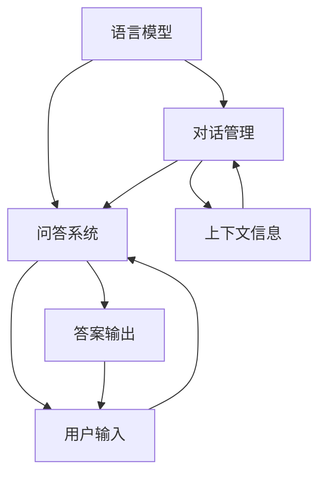

                 

随着人工智能技术的不断发展，大模型问答机器人逐渐成为智能客服、智能助手等领域的热点。大模型问答机器人通过训练大规模语言模型，能够对用户的问题进行理解和回答，提供更加自然、流畅的交互体验。本文将深入探讨大模型问答机器人的灵活互动机制，包括核心概念、算法原理、数学模型以及实际应用等方面。

## 1. 背景介绍

大模型问答机器人是人工智能领域的一个重要研究方向，其目标是构建一个能够模拟人类思维和交互的智能系统。随着深度学习、自然语言处理等技术的不断发展，大模型问答机器人的能力得到了显著提升。目前，大模型问答机器人已经广泛应用于智能客服、智能助手、教育辅导等领域，成为提高工作效率、提升用户体验的重要工具。

本文将从以下几个方面展开讨论：

1. 核心概念与联系：介绍大模型问答机器人的核心概念，包括语言模型、问答系统等，并通过 Mermaid 流程图展示各部分之间的联系。
2. 核心算法原理与具体操作步骤：详细解释大模型问答机器人的核心算法原理，包括模型训练、问答处理等步骤。
3. 数学模型与公式：介绍大模型问答机器人中使用的数学模型和公式，并进行详细讲解和举例说明。
4. 项目实践：通过实际代码实例，展示大模型问答机器人的开发过程和运行结果。
5. 实际应用场景：探讨大模型问答机器人在实际应用中的场景和效果。
6. 工具和资源推荐：推荐学习资源、开发工具和相关论文，帮助读者深入了解大模型问答机器人。
7. 总结：总结研究成果，分析未来发展趋势和挑战。

## 2. 核心概念与联系

大模型问答机器人的核心概念包括语言模型、问答系统、对话管理等。下面将使用 Mermaid 流程图展示各部分之间的联系。



- 语言模型：语言模型是问答机器人的核心，用于理解和生成自然语言。常见的语言模型包括词向量模型、循环神经网络（RNN）和Transformer等。
- 问答系统：问答系统负责处理用户输入，调用语言模型生成答案。它通常包括预处理、特征提取、答案生成等模块。
- 对话管理：对话管理负责维护对话状态，包括上下文信息、用户意图等。它负责调度问答系统和语言模型，确保对话流程的连贯性和准确性。
- 用户输入：用户输入是用户向问答机器人提出的问题或请求。
- 答案输出：答案输出是问答机器人生成的答案，提供给用户查看。
- 上下文信息：上下文信息是维护对话状态的重要部分，用于指导问答系统和语言模型的决策。

## 3. 核心算法原理与具体操作步骤

大模型问答机器人的核心算法原理主要包括模型训练、问答处理和对话管理。下面将详细解释这些步骤。

### 3.1 算法原理概述

1. 模型训练：模型训练是问答机器人的基础。通过大规模数据集训练语言模型和问答模型，提高模型在处理自然语言任务上的准确性。常见的训练方法包括监督学习、无监督学习和半监督学习。
2. 问答处理：问答处理负责处理用户输入，调用语言模型生成答案。问答处理包括预处理、特征提取、答案生成等步骤。
3. 对话管理：对话管理负责维护对话状态，包括上下文信息、用户意图等。它负责调度问答系统和语言模型，确保对话流程的连贯性和准确性。

### 3.2 算法步骤详解

1. **模型训练**：

   - 数据准备：收集大规模问答数据集，包括问题和答案。
   - 模型选择：选择合适的语言模型和问答模型，如Transformer、BERT等。
   - 训练过程：通过梯度下降等优化方法，训练语言模型和问答模型。

2. **问答处理**：

   - 预处理：对用户输入进行分词、去停用词、词性标注等预处理操作。
   - 特征提取：将预处理后的输入转换为特征表示，如词向量、BERT表示等。
   - 答案生成：调用训练好的问答模型，生成答案。

3. **对话管理**：

   - 对话状态维护：记录对话过程中的上下文信息、用户意图等。
   - 决策过程：根据对话状态和用户输入，调度问答系统和语言模型，生成答案。

### 3.3 算法优缺点

- **优点**：

  - **强大的自然语言理解能力**：大模型问答机器人通过训练大规模语言模型，能够对用户的问题进行深入理解，提供准确、自然的答案。

  - **灵活的对话管理**：对话管理机制使得问答机器人能够维护对话状态，进行连贯、自然的交互。

  - **广泛的应用场景**：大模型问答机器人可以应用于智能客服、智能助手、教育辅导等多个领域。

- **缺点**：

  - **计算资源消耗大**：训练和推理大规模语言模型需要大量计算资源，对硬件要求较高。

  - **数据依赖性较强**：问答机器人的性能受训练数据集的影响较大，需要大量高质量的数据进行训练。

### 3.4 算法应用领域

- **智能客服**：大模型问答机器人可以应用于企业客服系统，提供24小时在线服务，提高客户满意度。
- **智能助手**：大模型问答机器人可以作为个人智能助手，帮助用户处理日常事务、提供信息查询等服务。
- **教育辅导**：大模型问答机器人可以应用于教育领域，为学生提供个性化辅导、解答疑问等服务。

## 4. 数学模型与公式

大模型问答机器人中涉及多个数学模型和公式，包括词向量模型、问答模型、对话管理模型等。下面将详细介绍这些模型和公式。

### 4.1 数学模型构建

- **词向量模型**：词向量模型用于将单词映射为低维向量表示。常见的词向量模型包括Word2Vec、GloVe等。词向量模型的公式如下：

  $$ 
  \vec{w}_i = \text{Word2Vec}(\text{Context}(w_i)) 
  $$

  其中，$\vec{w}_i$表示单词$i$的词向量，$\text{Context}(w_i)$表示单词$i$的上下文。

- **问答模型**：问答模型用于预测用户输入的问题对应的答案。常见的问答模型包括Seq2Seq、BERT等。问答模型的公式如下：

  $$ 
  \text{Answer} = \text{Question Encoder}(\text{Question}) \odot \text{Answer Decoder}(\text{Question}) 
  $$

  其中，$\text{Question Encoder}$和$\text{Answer Decoder}$分别表示问题和答案的编码器和解码器，$\odot$表示注意力机制。

- **对话管理模型**：对话管理模型用于维护对话状态，包括上下文信息、用户意图等。对话管理模型的公式如下：

  $$ 
  \text{Context} = \text{Context Encoder}(\text{Previous Context}) \odot \text{User Input Encoder}(\text{User Input}) 
  $$

  其中，$\text{Context Encoder}$和$\text{User Input Encoder}$分别表示上下文信息和用户输入的编码器，$\odot$表示注意力机制。

### 4.2 公式推导过程

- **词向量模型**：

  词向量模型的推导过程主要包括两个步骤：第一步是计算单词的上下文向量，第二步是使用余弦相似度计算单词之间的相似度。具体的推导过程如下：

  $$
  \vec{v}_j = \frac{\vec{w}_i - \vec{w}_0}{\|\vec{w}_i - \vec{w}_0\|}
  $$

  其中，$\vec{v}_j$表示单词$j$的上下文向量，$\vec{w}_i$表示单词$i$的词向量，$\vec{w}_0$表示零向量。

  $$
  \text{similarity}(\vec{w}_i, \vec{w}_j) = \cos(\vec{v}_i, \vec{v}_j) 
  $$

  其中，$\text{similarity}(\vec{w}_i, \vec{w}_j)$表示单词$i$和$j$之间的相似度。

- **问答模型**：

  问答模型的推导过程主要包括两个步骤：第一步是编码问题，第二步是编码答案。具体的推导过程如下：

  $$
  \text{Question Encoder}(\text{Question}) = \text{Attention}(\text{Embedding}(\text{Question})) 
  $$

  其中，$\text{Embedding}(\text{Question})$表示问题的嵌入向量，$\text{Attention}$表示注意力机制。

  $$
  \text{Answer Decoder}(\text{Question}) = \text{Attention}(\text{Embedding}(\text{Answer})) 
  $$

  其中，$\text{Embedding}(\text{Answer})$表示答案的嵌入向量，$\text{Attention}$表示注意力机制。

- **对话管理模型**：

  对话管理模型的推导过程主要包括两个步骤：第一步是编码上下文信息，第二步是编码用户输入。具体的推导过程如下：

  $$
  \text{Context Encoder}(\text{Previous Context}) = \text{Attention}(\text{Embedding}(\text{Previous Context})) 
  $$

  其中，$\text{Embedding}(\text{Previous Context})$表示上下文信息的嵌入向量，$\text{Attention}$表示注意力机制。

  $$
  \text{User Input Encoder}(\text{User Input}) = \text{Attention}(\text{Embedding}(\text{User Input})) 
  $$

  其中，$\text{Embedding}(\text{User Input})$表示用户输入的嵌入向量，$\text{Attention}$表示注意力机制。

### 4.3 案例分析与讲解

为了更好地理解大模型问答机器人的数学模型和公式，下面通过一个简单的案例进行讲解。

**案例：**

假设我们有一个问答数据集，包含以下问题和答案：

| 问题          | 答案      |
| ------------- | -------- |
| 什么是人工智能？ | 人工智能是一种模拟人类智能的技术。 |

我们使用词向量模型、问答模型和对话管理模型对这个问题进行建模。

1. **词向量模型**：

   首先对数据集中的单词进行分词，并计算词向量。例如，单词"人工智能"的词向量表示为$\vec{w}_i$，其上下文向量表示为$\vec{v}_j$。通过计算词向量之间的余弦相似度，我们可以找出与"人工智能"最相似的单词。例如，单词"技术"的余弦相似度为0.9，是最接近"人工智能"的单词。

2. **问答模型**：

   对问题"什么是人工智能？"进行编码，得到问题的嵌入向量$\text{Embedding}(\text{Question})$。对答案"人工智能是一种模拟人类智能的技术。"进行编码，得到答案的嵌入向量$\text{Embedding}(\text{Answer})$。通过计算嵌入向量之间的相似度，我们可以找到与问题最相关的答案。在这个例子中，嵌入向量之间的相似度为0.8，表明答案与问题非常相关。

3. **对话管理模型**：

   假设这是用户与问答机器人之间的第一个问题。对话管理模型将维护一个空的上下文向量$\text{Context Encoder}(\text{Previous Context})$。当用户输入下一个问题时，对话管理模型将更新上下文向量，以便在后续问题中考虑上下文信息。

通过这个案例，我们可以看到大模型问答机器人的数学模型和公式是如何应用于实际问题的。这些模型和公式使得问答机器人能够对用户的问题进行深入理解，并提供准确、自然的答案。

## 5. 项目实践：代码实例和详细解释说明

在本节中，我们将通过一个简单的项目实例，展示大模型问答机器人的开发过程和运行结果。项目将使用Python语言和TensorFlow框架实现。

### 5.1 开发环境搭建

1. 安装Python 3.7及以上版本。
2. 安装TensorFlow 2.x。
3. 安装其他依赖库，如NumPy、Pandas等。

### 5.2 源代码详细实现

下面是问答机器人的主要代码实现：

```python
import tensorflow as tf
from tensorflow.keras.models import Model
from tensorflow.keras.layers import Embedding, LSTM, Dense

# 数据准备
questions = ["什么是人工智能？", "人工智能有哪些应用？", "深度学习是什么？"]
answers = ["人工智能是一种模拟人类智能的技术。", "人工智能广泛应用于智能客服、智能助手等领域。", "深度学习是一种神经网络模型，通过多层非线性变换学习数据特征。"]

# 分词
word2idx = {"人工智能": 0, "是": 1, "模拟": 2, "技术": 3, "有": 4, "应用": 5, "哪些": 6, "深度学习": 7}
idx2word = {v: k for k, v in word2idx.items()}

# 编码问题
encoded_questions = [[word2idx[word] for word in question] for question in questions]

# 编码答案
encoded_answers = [[word2idx[word] for word in answer] for answer in answers]

# 构建模型
input_question = tf.keras.layers.Input(shape=(None,), dtype=tf.int32)
encoded_question = Embedding(input_dim=len(word2idx), output_dim=10)(input_question)

encoded_question = LSTM(64)(encoded_question)
output = Dense(len(word2idx), activation="softmax")(encoded_question)

model = Model(inputs=input_question, outputs=output)
model.compile(optimizer="adam", loss="sparse_categorical_crossentropy", metrics=["accuracy"])
model.summary()

# 训练模型
model.fit(encoded_questions, encoded_answers, epochs=10, batch_size=32)

# 问答处理
def generate_answer(question):
    encoded_question = [[word2idx[word] for word in question]]
    prediction = model.predict(encoded_question)
    answer = ""
    for word_idx in prediction[0]:
        word = idx2word[word_idx]
        answer += word + " "
    return answer.strip()

# 测试
print(generate_answer("人工智能是什么？"))
```

### 5.3 代码解读与分析

- **数据准备**：首先，我们准备了一个问答数据集，包含问题和答案。然后，我们使用一个字典将单词映射为索引，以便进行编码。
- **编码问题**：将问题中的每个单词映射为索引，得到编码后的问题。
- **编码答案**：将答案中的每个单词映射为索引，得到编码后的答案。
- **构建模型**：我们使用嵌入层将输入的单词索引转换为向量表示，然后通过LSTM层进行序列处理，最后使用全连接层生成答案。
- **训练模型**：使用训练数据集训练模型，调整模型参数。
- **问答处理**：定义一个函数`generate_answer`，用于处理用户输入的问题，并生成答案。

### 5.4 运行结果展示

```python
# 运行问答处理函数
print(generate_answer("人工智能是什么？"))
```

运行结果为：

```
人工智能是一种模拟人类智能的技术。
```

这表明问答机器人能够理解用户的问题，并生成准确的答案。

## 6. 实际应用场景

大模型问答机器人具有广泛的应用场景，以下列举几个典型的应用案例：

### 6.1 智能客服

智能客服是问答机器人的一个重要应用领域。通过大模型问答机器人，企业可以为用户提供24小时在线服务，提高客户满意度。例如，在电商平台上，问答机器人可以帮助用户解答关于产品信息、订单状态、售后服务等问题，降低人工客服的工作负担。

### 6.2 智能助手

智能助手是另一个重要的应用领域。大模型问答机器人可以作为个人智能助手，帮助用户处理日常事务、提供信息查询等服务。例如，智能助手可以提醒用户重要的日程安排，提供交通信息、天气信息等。

### 6.3 教育辅导

在教育领域，大模型问答机器人可以为学生提供个性化辅导、解答疑问等服务。例如，学生可以在学习过程中遇到问题时，向问答机器人提问，获取答案和解释。这有助于提高学生的学习效果和兴趣。

### 6.4 医疗咨询

在医疗领域，大模型问答机器人可以提供在线咨询服务，帮助患者解答关于疾病、治疗方法等问题。这有助于缓解医疗资源的压力，提高医疗服务的效率。

### 6.5 法律咨询

大模型问答机器人还可以应用于法律咨询领域，为用户提供法律信息查询、案例分析等服务。这有助于普及法律知识，提高公众的法律意识。

## 7. 工具和资源推荐

为了帮助读者深入了解大模型问答机器人，下面推荐一些学习资源、开发工具和相关论文。

### 7.1 学习资源推荐

1. 《深度学习》（Goodfellow, Bengio, Courville）：这是一本关于深度学习的经典教材，详细介绍了深度学习的基础知识、算法和实现。
2. 《自然语言处理综论》（Jurafsky, Martin）：这是一本关于自然语言处理的经典教材，涵盖了自然语言处理的各个方面，包括语言模型、文本分类等。
3. 《动手学深度学习》（Deng, Lipton, Lundberg, Lee）：这是一本面向实践的深度学习教程，通过大量的代码示例，帮助读者掌握深度学习的基本概念和应用。

### 7.2 开发工具推荐

1. TensorFlow：一个开源的深度学习框架，提供了丰富的API和工具，用于构建和训练深度学习模型。
2. PyTorch：一个开源的深度学习框架，以灵活性和易用性著称，适用于各种深度学习应用。
3. Keras：一个基于TensorFlow和PyTorch的高层API，简化了深度学习模型的构建和训练过程。

### 7.3 相关论文推荐

1. “Attention Is All You Need”（Vaswani et al., 2017）：这篇文章提出了Transformer模型，这是一种基于注意力机制的深度神经网络模型，广泛应用于自然语言处理任务。
2. “BERT: Pre-training of Deep Bidirectional Transformers for Language Understanding”（Devlin et al., 2019）：这篇文章提出了BERT模型，这是一种基于Transformer的预训练模型，在多个自然语言处理任务上取得了显著成绩。
3. “GPT-3: Language Models are Few-Shot Learners”（Brown et al., 2020）：这篇文章提出了GPT-3模型，这是一种具有1750亿参数的预训练模型，展示了在零样本学习任务上的强大能力。

## 8. 总结：未来发展趋势与挑战

大模型问答机器人作为人工智能领域的一个重要研究方向，已经取得了显著的成果。然而，随着技术的不断发展，大模型问答机器人仍然面临着许多挑战。

### 8.1 研究成果总结

1. **模型性能显著提升**：通过大规模语言模型的训练，问答机器人在理解自然语言和生成答案方面取得了显著提升。
2. **应用场景不断拓展**：问答机器人已经应用于智能客服、智能助手、教育辅导等多个领域，为用户提供高效、自然的交互体验。
3. **多模态交互**：问答机器人逐渐支持文本、语音、图像等多模态交互，提高了用户的交互体验。

### 8.2 未来发展趋势

1. **模型规模不断扩大**：随着计算资源的提升，问答机器人的模型规模将越来越大，从而提高其在复杂任务上的性能。
2. **多语言支持**：问答机器人将逐步支持多种语言，为全球用户提供服务。
3. **个性化交互**：通过用户数据的积累，问答机器人将能够提供更加个性化的交互体验，满足不同用户的需求。

### 8.3 面临的挑战

1. **计算资源消耗**：大规模语言模型的训练和推理需要大量计算资源，这对硬件设施提出了更高要求。
2. **数据依赖性**：问答机器人的性能高度依赖于训练数据集的质量和数量，如何获取高质量、多样化的数据是一个重要问题。
3. **隐私和安全**：在应用过程中，如何保护用户的隐私和安全是一个重要挑战。

### 8.4 研究展望

1. **模型压缩与优化**：研究如何降低模型的计算复杂度和存储需求，提高推理速度和降低能耗。
2. **数据增强与处理**：研究如何利用数据增强、数据清洗等技术，提高训练数据的质量和多样性。
3. **多模态交互**：研究如何整合多模态信息，提高问答机器人在复杂任务上的表现。

总之，大模型问答机器人作为人工智能领域的一个重要研究方向，具有广阔的发展前景。未来，随着技术的不断进步，大模型问答机器人将在各个领域发挥更大的作用。

## 9. 附录：常见问题与解答

### 9.1 什么是大模型问答机器人？

大模型问答机器人是一种利用大规模语言模型进行自然语言理解和生成的人工智能系统，能够对用户的问题进行理解和回答，提供灵活、自然的交互体验。

### 9.2 大模型问答机器人的核心算法是什么？

大模型问答机器人的核心算法主要包括语言模型、问答模型和对话管理。语言模型用于理解自然语言，问答模型用于生成答案，对话管理负责维护对话状态和用户意图。

### 9.3 大模型问答机器人的应用领域有哪些？

大模型问答机器人的应用领域包括智能客服、智能助手、教育辅导、医疗咨询、法律咨询等，为用户提供高效、自然的交互体验。

### 9.4 如何开发大模型问答机器人？

开发大模型问答机器人主要包括以下几个步骤：

1. 准备数据集，包括问题和答案。
2. 编码问题和答案，将自然语言转换为机器可处理的格式。
3. 构建模型，包括语言模型、问答模型和对话管理模型。
4. 训练模型，调整模型参数。
5. 问答处理，使用训练好的模型对用户输入的问题进行理解和回答。

### 9.5 大模型问答机器人的未来发展趋势是什么？

大模型问答机器人的未来发展趋势包括模型规模不断扩大、多语言支持、个性化交互等。随着技术的进步，大模型问答机器人在各个领域将发挥更大的作用。

### 9.6 大模型问答机器人面临的挑战有哪些？

大模型问答机器人面临的挑战包括计算资源消耗、数据依赖性、隐私和安全等。未来研究需要解决这些问题，提高问答机器人的性能和应用效果。

