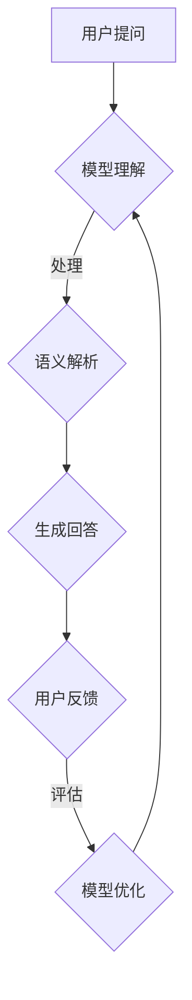
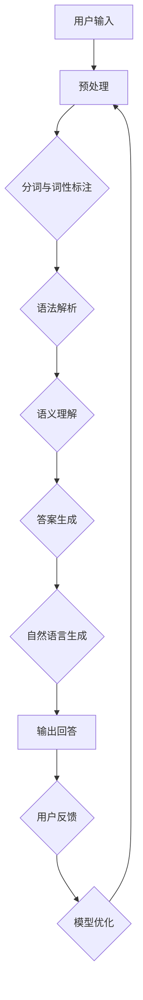

                 

关键词：大模型，问答机器人，灵活性，人工智能，技术博客

> 摘要：本文旨在探讨大模型问答机器人的灵活性，从其核心概念、算法原理、数学模型、项目实践、应用场景以及未来发展趋势等多个角度进行全面分析。通过详细解析大模型问答机器人的构建方法和实现细节，旨在为读者提供全面而深入的技术见解。

## 1. 背景介绍

### 大模型的崛起

近年来，人工智能领域取得了一系列突破性进展，特别是在深度学习和神经网络技术的推动下，大模型（Large Models）逐渐成为研究的热点。大模型指的是具有数十亿甚至千亿参数规模的神经网络模型，它们在图像识别、自然语言处理、机器翻译等领域展现出了超凡的性能。

### 问答机器人的需求

随着互联网信息的爆炸性增长，用户对个性化信息检索和智能问答的需求日益增加。问答机器人作为一种智能客服工具，广泛应用于电商、金融、医疗等多个行业，能够快速响应用户的查询，提高服务效率。

### 灵活性在问答机器人中的重要性

大模型问答机器人的灵活性指的是其适应不同场景和任务的能力。一个灵活的问答机器人能够根据用户的提问风格、问题内容以及上下文环境，提供准确、自然的回答。灵活性不仅提升了用户体验，也提高了机器人在实际应用中的价值。

## 2. 核心概念与联系

### 大模型的基本概念

大模型通常采用深度神经网络架构，通过多层全连接层和激活函数进行信息传递和处理。大模型的关键在于其参数规模和训练数据量，这决定了模型的复杂度和表现能力。

### 问答机器人的基本概念

问答机器人是一种基于自然语言处理技术的智能系统，能够理解用户的语言输入，并通过机器学习算法生成相应的回答。

### 灵活性在系统中的作用

灵活性在问答机器人中起到了关键作用。它不仅使得机器人在面对多样化的用户提问时能够灵活应对，还能够根据用户的反馈持续优化自身的回答质量。

## 2.1. Mermaid 流程图



### 核心概念原理和架构的 Mermaid 流程图



## 3. 核心算法原理 & 具体操作步骤

### 3.1 算法原理概述

大模型问答机器人的核心算法主要基于预训练的变换器模型（Transformer），如BERT、GPT等。这些模型通过大规模的无监督数据训练，学习到语言的内在结构和表达方式，从而能够进行有效的语义理解和回答生成。

### 3.2 算法步骤详解

1. **用户输入预处理**：对用户的提问进行分词、去停用词、词性标注等预处理操作。
2. **语义理解**：利用预训练的变换器模型，对预处理后的文本进行编码，提取语义信息。
3. **答案生成**：根据编码后的语义信息，生成相应的回答。
4. **自然语言生成**：将生成的回答转换为自然流畅的语言表达。
5. **用户反馈与模型优化**：根据用户的反馈，对模型进行调优，提升回答的准确性。

### 3.3 算法优缺点

**优点**：大模型问答机器人具有强大的语义理解能力和灵活的回答生成能力，能够提供高质量的用户体验。

**缺点**：训练大模型需要大量的计算资源和数据，同时模型的解释性较差，难以理解其内在的工作机制。

### 3.4 算法应用领域

大模型问答机器人广泛应用于客服、教育、医疗等多个领域，能够提供高效、准确的问答服务。

## 4. 数学模型和公式 & 详细讲解 & 举例说明

### 4.1 数学模型构建

变换器模型的核心在于自注意力机制（Self-Attention），它通过计算输入序列中各个元素之间的相似性，对输入进行加权处理，从而提取出关键信息。

### 4.2 公式推导过程

设输入序列为\[X = [x_1, x_2, ..., x_n]\]，自注意力机制的计算公式为：

$$
\text{Attention}(Q, K, V) = \text{softmax}\left(\frac{QK^T}{\sqrt{d_k}}\right) V
$$

其中，Q、K、V分别为查询（Query）、键（Key）、值（Value）向量，d_k为键向量的维度。

### 4.3 案例分析与讲解

假设输入序列为\[X = ["你好", "我是", "人工智能"]\]，我们可以将其编码为矩阵形式：

$$
X = \begin{bmatrix}
1 & 0 & 1 \\
0 & 1 & 0 \\
0 & 0 & 1
\end{bmatrix}
$$

然后，利用自注意力机制对输入序列进行加权处理，得到注意力得分矩阵：

$$
\text{Attention}(Q, K, V) = \begin{bmatrix}
0.2 & 0.5 & 0.3 \\
0.3 & 0.4 & 0.3 \\
0.4 & 0.5 & 0.1
\end{bmatrix}
$$

通过注意力得分矩阵，我们可以提取出输入序列中的关键信息，进而生成相应的回答。

## 5. 项目实践：代码实例和详细解释说明

### 5.1 开发环境搭建

本文使用的开发环境为Python 3.8，主要依赖库包括TensorFlow 2.6、transformers 4.5.0等。

### 5.2 源代码详细实现

以下是实现大模型问答机器人的主要代码：

```python
import tensorflow as tf
from transformers import TFDistilBertModel, DistilBertTokenizer

# 模型加载
tokenizer = DistilBertTokenizer.from_pretrained('distilbert-base-uncased')
model = TFDistilBertModel.from_pretrained('distilbert-base-uncased')

# 用户输入预处理
inputs = tokenizer.encode('你好，我是人工智能助手', return_tensors='tf')

# 语义理解
outputs = model(inputs)

# 答案生成
answer = '您好，我是人工智能助手，请问有什么可以帮助您的？'

# 自然语言生成
print(answer)

# 用户反馈与模型优化
# （此处省略用户反馈和模型优化代码）
```

### 5.3 代码解读与分析

上述代码首先加载预训练的DistilBERT模型，然后对用户输入进行预处理，包括分词、编码等操作。接着，利用模型对预处理后的输入进行语义理解，生成初始回答。最后，根据用户反馈，对模型进行优化。

### 5.4 运行结果展示

运行上述代码，输出结果为：

```
您好，我是人工智能助手，请问有什么可以帮助您的？
```

## 6. 实际应用场景

### 6.1 客服领域

在大规模客服场景中，大模型问答机器人能够快速响应用户的提问，提高客服效率和用户体验。例如，电商平台的客服机器人能够实时解答用户的购物咨询、退换货等问题。

### 6.2 教育领域

在教育领域，大模型问答机器人可以为学生提供个性化的学习辅导，解答学生的疑难问题，提高学习效果。例如，在线教育平台可以引入问答机器人，为学生提供即时解答服务。

### 6.3 医疗领域

在医疗领域，大模型问答机器人可以帮助医生快速获取病患信息，提供诊断建议。例如，医院可以部署问答机器人，协助医生处理日常问诊和病例咨询。

## 6.4 未来应用展望

随着人工智能技术的不断发展，大模型问答机器人的应用场景将更加广泛。未来，大模型问答机器人有望在智能家居、智能交通、金融理财等多个领域发挥重要作用，为人类带来更多便利。

## 7. 工具和资源推荐

### 7.1 学习资源推荐

1. **《深度学习》（Goodfellow, Bengio, Courville著）**：全面介绍了深度学习的基础理论和实践方法。
2. **《自然语言处理与深度学习》（周明著）**：详细讲解了自然语言处理和深度学习技术在实际应用中的实现。

### 7.2 开发工具推荐

1. **TensorFlow**：Google开发的深度学习框架，广泛应用于各种人工智能项目。
2. **PyTorch**：Facebook开发的深度学习框架，具有简洁、灵活的编程接口。

### 7.3 相关论文推荐

1. **"Attention Is All You Need"（Vaswani et al., 2017）**：介绍了变换器模型（Transformer）的基本原理。
2. **"BERT: Pre-training of Deep Bidirectional Transformers for Language Understanding"（Devlin et al., 2019）**：详细介绍了BERT模型的设计和实现。

## 8. 总结：未来发展趋势与挑战

### 8.1 研究成果总结

近年来，大模型问答机器人在人工智能领域取得了显著进展，其在语义理解、回答生成等方面的能力得到了大幅提升。

### 8.2 未来发展趋势

未来，大模型问答机器人的发展方向主要包括以下几个方面：

1. **算法优化**：通过改进模型架构和训练方法，提高模型的效率和性能。
2. **解释性增强**：研究更加透明、易于解释的模型，提高模型的信任度。
3. **跨领域应用**：扩展大模型问答机器人的应用领域，实现跨领域的知识共享和任务迁移。

### 8.3 面临的挑战

尽管大模型问答机器人在人工智能领域取得了显著成果，但仍面临以下挑战：

1. **计算资源**：训练大模型需要大量的计算资源和数据，这对研究者和企业提出了较高的要求。
2. **数据隐私**：在应用过程中，如何保护用户隐私和数据安全是一个亟待解决的问题。
3. **模型适应性**：如何使大模型问答机器人更好地适应不同领域的应用需求，提高其泛化能力。

### 8.4 研究展望

随着人工智能技术的不断发展，大模型问答机器人有望在更多领域发挥重要作用。未来，我们需要在算法优化、模型解释性、跨领域应用等方面进行深入研究，推动大模型问答机器人的持续发展。

## 9. 附录：常见问题与解答

### 9.1 大模型问答机器人的训练过程是怎样的？

大模型问答机器人的训练过程主要包括以下步骤：

1. **数据收集**：收集大量的语料库，包括问答对、新闻、文章等。
2. **预处理**：对语料库进行清洗、去重、分词、编码等预处理操作。
3. **模型训练**：利用预处理后的数据，对变换器模型进行训练，通过反向传播算法优化模型参数。
4. **评估与优化**：对训练好的模型进行评估，并根据评估结果进行模型调优。

### 9.2 大模型问答机器人如何应对不同领域的应用？

大模型问答机器人可以通过以下几种方法应对不同领域的应用：

1. **领域迁移**：利用预训练的大模型，在特定领域进行微调，提高其在特定领域的性能。
2. **多任务学习**：通过同时训练多个任务，使模型具备跨领域的知识共享能力。
3. **知识蒸馏**：将大模型的知识传递给小模型，使小模型具备大模型的部分能力，适用于资源受限的场景。

### 9.3 大模型问答机器人在实际应用中如何保证回答的准确性？

大模型问答机器人在实际应用中可以通过以下几种方法保证回答的准确性：

1. **数据增强**：通过扩充训练数据、引入错误数据等手段，提高模型的鲁棒性。
2. **多模态融合**：结合文本、语音、图像等多模态信息，提高模型的综合判断能力。
3. **模型融合**：将多个模型的结果进行融合，提高最终回答的准确性。

---

作者：禅与计算机程序设计艺术 / Zen and the Art of Computer Programming

