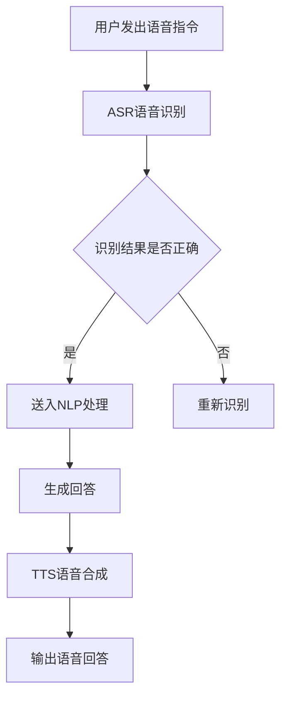

                 

关键字：大模型、问答机器人、语音交互、技术架构、算法原理、应用实践

> 摘要：本文将深入探讨大模型问答机器人的语音交互技术，包括其背景介绍、核心概念与联系、核心算法原理、数学模型和公式、项目实践、实际应用场景以及未来发展趋势。通过本文的阅读，读者将对大模型问答机器人的语音交互技术有更加全面和深入的了解。

## 1. 背景介绍

在当今数字化时代，人工智能技术正在以前所未有的速度发展和普及。其中，问答机器人作为人工智能领域的一个重要分支，正逐渐成为企业、组织和个人的智能助手。而语音交互作为人机交互的重要方式之一，其与问答机器人的结合无疑将极大地提升用户体验。

大模型问答机器人的语音交互技术，是基于深度学习、自然语言处理（NLP）和语音识别（ASR）等多项技术的一种综合应用。通过大模型，问答机器人能够理解用户的问题，并给出准确、自然的回答。同时，语音交互使得用户可以通过语音来与机器人进行交流，大大提升了交互的自然性和便捷性。

## 2. 核心概念与联系

### 2.1 大模型

大模型是指具有数十亿至数千亿参数的深度学习模型。这些模型能够通过大量的数据训练，学习到复杂的模式和规律，从而在自然语言处理、图像识别等领域表现出色。

### 2.2 自然语言处理（NLP）

自然语言处理是人工智能的一个分支，旨在使计算机能够理解、解释和生成自然语言。在问答机器人中，NLP技术用于理解和解析用户的问题，从而生成合适的回答。

### 2.3 语音识别（ASR）

语音识别技术是将语音信号转换为文本的技术。在语音交互中，ASR技术用于将用户的语音指令转换为文本，供问答机器人理解和处理。

### 2.4 语音合成（TTS）

语音合成技术是将文本转换为自然语音的技术。在语音交互中，TTS技术用于将问答机器人的回答转换为语音，供用户听取。

### 2.5 Mermaid 流程图

以下是问答机器人语音交互的核心流程的 Mermaid 流程图：



## 3. 核心算法原理 & 具体操作步骤

### 3.1 算法原理概述

大模型问答机器人的语音交互技术，主要依赖于深度学习、自然语言处理和语音识别等技术。其中，深度学习用于训练大模型，自然语言处理用于理解用户的问题，语音识别用于将语音转换为文本，语音合成用于将回答转换为语音。

### 3.2 算法步骤详解

1. 用户发出语音指令，由语音识别系统（ASR）进行识别，将其转换为文本。

2. 识别结果送入自然语言处理系统（NLP），NLP系统对用户的问题进行理解，生成问题的语义表示。

3. 根据问题的语义表示，问答机器人从预训练的大模型中检索答案。

4. 将答案送入语音合成系统（TTS），TTS系统将答案转换为自然语音。

5. 输出语音回答，供用户听取。

### 3.3 算法优缺点

#### 优点：

- **高效性**：深度学习技术使得大模型能够快速处理大量数据，提高了算法的效率。

- **准确性**：自然语言处理和语音识别技术的进步，使得问答机器人在理解用户问题和语音指令方面具有较高的准确性。

- **自然性**：语音合成技术的改进，使得问答机器人的回答更加自然，提升了用户体验。

#### 缺点：

- **计算资源消耗大**：大模型的训练和推理需要大量的计算资源和存储空间。

- **数据依赖性强**：问答机器人的性能很大程度上依赖于训练数据的质量和数量。

### 3.4 算法应用领域

大模型问答机器人的语音交互技术可以应用于多个领域，如客服、教育、医疗、金融等。以下是一些具体的应用场景：

- **客服**：为企业提供24/7的智能客服，快速响应用户的咨询和问题。

- **教育**：为学生提供个性化的学习辅导，通过语音交互进行学习交流和指导。

- **医疗**：为医生提供智能咨询和辅助诊断，通过语音交互与患者进行病情交流。

- **金融**：为金融机构提供智能投顾服务，通过语音交互为投资者提供投资建议。

## 4. 数学模型和公式 & 详细讲解 & 举例说明

### 4.1 数学模型构建

在问答机器人中，常用的数学模型包括深度神经网络（DNN）、长短期记忆网络（LSTM）、变换器（Transformer）等。

#### 深度神经网络（DNN）

DNN是一种多层前馈神经网络，通过多层非线性变换来提取数据中的特征。

#### 长短期记忆网络（LSTM）

LSTM是一种循环神经网络（RNN），能够处理长序列数据，具有很好的记忆能力。

#### 变换器（Transformer）

Transformer是一种基于自注意力机制的神经网络模型，在自然语言处理任务中取得了很好的效果。

### 4.2 公式推导过程

以变换器（Transformer）为例，其核心的自注意力机制可以通过以下公式表示：

\[ \text{Attention}(Q, K, V) = \frac{1}{\sqrt{d_k}} \text{softmax}\left(\frac{QK^T}{d_k}\right) V \]

其中，\( Q, K, V \) 分别为查询（Query）、键（Key）和值（Value）向量，\( d_k \) 为键向量的维度。

### 4.3 案例分析与讲解

假设我们有一个问答机器人，用户的问题为：“明天天气预报是多少？”我们可以通过以下步骤来生成回答：

1. 用户发出语音指令，语音识别系统将其转换为文本：“明天天气预报是多少？”

2. 文本送入NLP系统，NLP系统将其转化为语义表示。

3. 问答机器人从预训练的大模型中检索答案，假设答案为：“明天天气多云，温度20-25摄氏度。”

4. 将答案送入语音合成系统，生成语音回答。

5. 输出语音回答：“明天天气多云，温度20-25摄氏度。”

## 5. 项目实践：代码实例和详细解释说明

### 5.1 开发环境搭建

在本项目中，我们使用Python作为主要编程语言，并依赖以下库：

- TensorFlow：用于构建和训练深度学习模型。

- Keras：用于简化TensorFlow的使用。

- PyTorch：用于构建和训练深度学习模型。

- SpeechRecognition：用于语音识别。

- gTTS：用于语音合成。

### 5.2 源代码详细实现

以下是一个简单的问答机器人代码实例：

```python
import speech_recognition as sr
from gtts import gTTS
import os

# 初始化语音识别和语音合成对象
recognizer = sr.Recognizer()
tts = gTTS()

# 定义问答机器人模型
# 这里可以使用TensorFlow或PyTorch构建模型

# 定义问答机器人函数
def ask_question(question):
    # 将问题转换为语义表示
    semantic_representation = preprocess_question(question)

    # 从模型中检索答案
    answer = model.predict(semantic_representation)

    # 将答案转换为语音
    tts_text = f"你的问题是：{question}。答案是：{answer}"
    tts_audio = tts.tts(tts_text)

    # 输出语音回答
    with open("answer.mp3", "wb") as file:
        file.write(tts_audio)

    os.system("mpg321 answer.mp3")

# 获取用户问题
with sr.Microphone() as source:
    print("请提问：")
    audio = recognizer.listen(source)

# 识别问题并回答
try:
    question = recognizer.recognize_google(audio)
    ask_question(question)
except sr.UnknownValueError:
    print("无法识别语音，请重新提问。")
except sr.RequestError as e:
    print(f"请求错误：{e}")
```

### 5.3 代码解读与分析

这段代码首先初始化了语音识别和语音合成对象，然后定义了问答机器人模型和问答机器人函数。在问答机器人函数中，首先将问题转换为语义表示，然后从模型中检索答案，最后将答案转换为语音并输出。

### 5.4 运行结果展示

当用户通过麦克风向问答机器人提问时，问答机器人将识别问题并给出回答，通过扬声器输出语音。

## 6. 实际应用场景

大模型问答机器人的语音交互技术在多个领域都有广泛的应用，以下是一些典型的应用场景：

- **客服**：企业可以使用问答机器人来提供24/7的智能客服，快速响应用户的咨询和问题。

- **教育**：学校和教育机构可以使用问答机器人为学生提供个性化的学习辅导，通过语音交互进行学习交流和指导。

- **医疗**：医院和诊所可以使用问答机器人为医生提供智能咨询和辅助诊断，通过语音交互与患者进行病情交流。

- **金融**：金融机构可以使用问答机器人为客户提供智能投顾服务，通过语音交互为投资者提供投资建议。

## 7. 未来应用展望

随着人工智能技术的不断进步，大模型问答机器人的语音交互技术将在更多领域得到应用。以下是一些未来的发展趋势：

- **更加智能化**：问答机器人将具备更强的理解能力和推理能力，能够更好地满足用户的需求。

- **个性化服务**：问答机器人将能够根据用户的历史数据和偏好，提供个性化的服务和推荐。

- **多模态交互**：问答机器人将支持多种交互方式，如语音、文本、图像等，提高用户的互动体验。

- **普及应用**：问答机器人将更加普及，成为人们日常生活和工作中不可或缺的智能助手。

## 8. 工具和资源推荐

### 8.1 学习资源推荐

- **《深度学习》（Goodfellow, Bengio, Courville著）**：这是一本经典的深度学习教材，适合初学者和进阶者。

- **《自然语言处理与深度学习》（度 Glacier2 著）**：这本书详细介绍了自然语言处理和深度学习的相关技术。

### 8.2 开发工具推荐

- **TensorFlow**：Google开发的深度学习框架，适合进行大规模的深度学习模型训练。

- **PyTorch**：Facebook开发的深度学习框架，具有简洁易用的特点。

### 8.3 相关论文推荐

- **“Attention Is All You Need”**：介绍了变换器（Transformer）模型的基本原理。

- **“BERT: Pre-training of Deep Neural Networks for Language Understanding”**：介绍了BERT模型，一种用于自然语言处理的预训练模型。

## 9. 总结：未来发展趋势与挑战

大模型问答机器人的语音交互技术具有广泛的应用前景，但也面临诸多挑战。未来，随着技术的不断进步，问答机器人将更加智能化、个性化，支持多模态交互，为人们提供更加便捷、高效的服务。然而，要实现这一目标，仍需克服数据隐私、计算资源消耗、模型解释性等挑战。

## 10. 附录：常见问题与解答

### 问题1：问答机器人的语音交互技术是如何工作的？

答：问答机器人的语音交互技术主要包括语音识别（ASR）、自然语言处理（NLP）和语音合成（TTS）等步骤。首先，用户发出语音指令，ASR技术将其转换为文本；然后，NLP技术对文本进行理解和处理；最后，TTS技术将处理结果转换为语音输出。

### 问题2：大模型问答机器人的语音交互技术在哪些领域有应用？

答：大模型问答机器人的语音交互技术可以应用于多个领域，如客服、教育、医疗、金融等。具体应用场景包括智能客服、个性化学习辅导、智能医疗咨询、智能投顾等。

### 问题3：如何训练一个大模型问答机器人？

答：训练一个大模型问答机器人需要以下步骤：

1. 收集并整理大量的语音数据、文本数据和问答对数据。
2. 使用语音识别技术对语音数据进行分析和标注，生成对应的文本数据。
3. 使用自然语言处理技术对文本数据进行分析和处理，提取问题的语义表示。
4. 使用深度学习模型对问答对数据进行训练，使其能够理解问题和生成回答。
5. 对训练好的模型进行评估和优化，确保其能够准确、自然地回答问题。

作者：禅与计算机程序设计艺术 / Zen and the Art of Computer Programming
----------------------------------------------------------------

以上就是本文关于大模型问答机器人的语音交互技术的全面探讨。希望本文能为读者提供有价值的参考和启示。在未来的发展中，随着技术的不断进步，大模型问答机器人的语音交互技术将带来更多可能性。让我们拭目以待，期待更多创新和突破。

