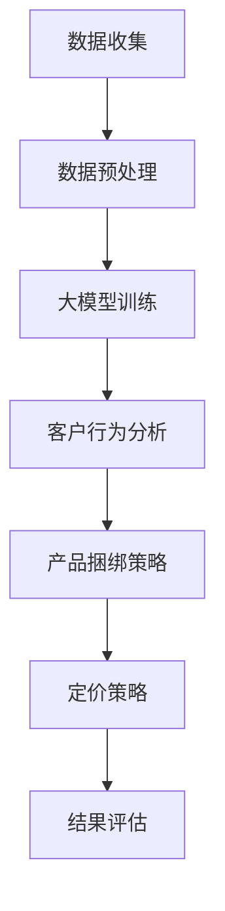

                 

关键词：大模型、电商、个性化产品、捆绑定价、AI、定价策略、机器学习、深度学习

> 摘要：随着人工智能和大数据技术的快速发展，电商行业正面临着前所未有的机遇和挑战。本文旨在探讨如何利用大模型技术，实现电商个性化产品捆绑定价策略，提高客户满意度、增加销售额。通过介绍大模型的原理、核心算法、数学模型以及实际应用案例，本文为电商企业提供了有价值的参考。

## 1. 背景介绍

电商行业作为互联网经济的核心驱动力，已经深刻地改变了人们的购物习惯。然而，随着市场竞争的日益激烈，电商企业面临着如何提高客户满意度、增加销售额的难题。传统的定价策略往往基于历史数据和静态模型，难以满足个性化、动态化的市场需求。而近年来，人工智能技术的快速发展，尤其是大模型技术的出现，为电商个性化产品捆绑定价提供了新的思路和解决方案。

大模型是指具有海量参数和强大计算能力的神经网络模型，如深度学习模型。这些模型可以通过学习大量数据，自动提取特征，并实现对未知数据的预测和分类。在电商领域，大模型可以用于客户行为分析、产品推荐、个性化定价等方面，从而提高企业的运营效率和市场竞争力。

本文将围绕大模型驱动的电商个性化产品捆绑定价策略展开讨论，包括核心算法原理、数学模型、项目实践以及未来应用展望等内容。

## 2. 核心概念与联系

### 2.1 大模型技术简介

大模型技术是人工智能领域的一个重要分支，主要涉及深度学习、神经网络等核心技术。深度学习模型具有层级结构，可以自动学习数据的层次化表示。在电商领域，深度学习模型可以用于分析客户行为、预测购买偏好、优化产品推荐等。

### 2.2 个性化产品捆绑定价策略

个性化产品捆绑定价策略是指根据客户的行为数据、购买历史、偏好等因素，为每位客户提供个性化的产品捆绑方案，并制定合理的价格策略。这种策略可以最大化客户的满意度，提高销售额。

### 2.3 Mermaid 流程图

以下是一个关于大模型驱动的电商个性化产品捆绑定价策略的 Mermaid 流程图：



## 3. 核心算法原理 & 具体操作步骤

### 3.1 算法原理概述

大模型驱动的电商个性化产品捆绑定价策略主要基于深度学习技术，通过以下步骤实现：

1. 数据收集：收集客户的购买历史、行为数据、偏好数据等。
2. 数据预处理：对收集到的数据进行清洗、归一化等处理，以便于模型训练。
3. 大模型训练：利用深度学习模型对预处理后的数据进行训练，提取关键特征。
4. 客户行为分析：利用训练好的模型分析客户行为，预测购买偏好。
5. 产品捆绑策略：根据客户行为和购买偏好，制定个性化的产品捆绑方案。
6. 定价策略：根据产品捆绑方案和市场情况，制定合理的价格策略。
7. 结果评估：对定价策略进行评估，优化模型参数。

### 3.2 算法步骤详解

1. 数据收集：电商企业可以通过网站日志、用户行为分析工具等收集客户的购买历史、浏览记录、搜索关键词等信息。
2. 数据预处理：对收集到的数据进行清洗、去重、归一化等处理，以便于模型训练。例如，将客户的年龄、性别、收入等数据进行归一化处理，使其在训练过程中具有更好的收敛性。
3. 大模型训练：选择合适的深度学习模型（如卷积神经网络、循环神经网络等），对预处理后的数据进行训练。训练过程中，模型会自动提取数据中的关键特征，并优化模型参数。
4. 客户行为分析：利用训练好的模型分析客户行为，预测客户的购买偏好。例如，可以预测客户是否倾向于购买某种产品捆绑组合，以及购买的时间、频率等。
5. 产品捆绑策略：根据客户行为和购买偏好，制定个性化的产品捆绑方案。例如，可以将客户可能感兴趣的产品捆绑在一起，提高购买转化率。
6. 定价策略：根据产品捆绑方案和市场情况，制定合理的价格策略。例如，可以采用动态定价策略，根据库存、季节、节假日等因素调整价格。
7. 结果评估：对定价策略进行评估，优化模型参数。例如，通过分析销售数据，评估定价策略对销售额、客户满意度等指标的影响，调整模型参数，优化定价策略。

### 3.3 算法优缺点

#### 优点

1. 提高客户满意度：个性化产品捆绑定价策略可以根据客户的需求和偏好制定，提高客户的满意度。
2. 增加销售额：通过优化产品捆绑和定价策略，可以增加客户的购买意愿，提高销售额。
3. 降低运营成本：利用大模型技术，可以实现自动化、智能化的定价策略，降低运营成本。

#### 缺点

1. 数据依赖性较强：算法效果依赖于数据的准确性和多样性，数据质量对算法性能有重要影响。
2. 计算资源消耗大：大模型训练和预测过程需要大量的计算资源，对硬件设备有较高要求。

### 3.4 算法应用领域

大模型驱动的电商个性化产品捆绑定价策略可以应用于以下领域：

1. 电商行业：优化产品推荐、个性化定价、广告投放等。
2. 零售行业：优化商品组合、促销策略、库存管理等。
3. 金融行业：客户行为分析、信用评估、风险控制等。

## 4. 数学模型和公式 & 详细讲解 & 举例说明

### 4.1 数学模型构建

在电商个性化产品捆绑定价策略中，可以采用以下数学模型：

$$
P(x, y) = f(\theta; x, y)
$$

其中，$P(x, y)$表示产品捆绑定价策略的概率分布，$x$表示客户特征向量，$y$表示产品捆绑方案向量，$f(\theta; x, y)$表示基于客户特征和产品捆绑方案的概率函数，$\theta$为模型参数。

### 4.2 公式推导过程

1. **损失函数**：

   假设我们使用最大似然估计（MLE）来估计模型参数$\theta$，损失函数可以表示为：

   $$
   L(\theta) = -\sum_{i=1}^{n} \log P(y_i | x_i; \theta)
   $$

   其中，$y_i$表示第$i$个客户的购买行为，$x_i$表示其特征向量。

2. **梯度下降**：

   为了最小化损失函数，我们可以采用梯度下降算法来更新模型参数：

   $$
   \theta_{t+1} = \theta_t - \alpha \nabla_{\theta} L(\theta_t)
   $$

   其中，$\alpha$为学习率，$\nabla_{\theta} L(\theta_t)$为损失函数关于参数$\theta_t$的梯度。

### 4.3 案例分析与讲解

#### 案例一：某电商平台的个性化产品捆绑定价策略

假设某电商平台有以下两类客户特征：年龄（$x_1$）和收入水平（$x_2$）。产品捆绑方案由两种产品组成：A 和 B。

1. **客户特征向量**：

   $$
   x = [x_1, x_2]^T
   $$

2. **产品捆绑方案向量**：

   $$
   y = [y_A, y_B]^T
   $$

3. **概率函数**：

   $$
   P(y | x; \theta) = \text{softmax}(W^T x + b)
   $$

   其中，$W$为权重矩阵，$b$为偏置项。

4. **损失函数**：

   $$
   L(\theta) = -\sum_{i=1}^{n} \log \frac{e^{W^T x_i + b}}{\sum_{j=1}^{m} e^{W^T x_j + b}}
   $$

5. **模型训练**：

   使用梯度下降算法训练模型，更新权重矩阵$W$和偏置项$b$。

   $$
   W_{t+1} = W_t - \alpha \nabla_{W} L(W_t)
   $$
   $$
   b_{t+1} = b_t - \alpha \nabla_{b} L(b_t)
   $$

#### 案例二：某零售商的个性化商品组合策略

假设某零售商有四种商品：A、B、C、D。客户特征包括：购买历史（$x_1$）、浏览记录（$x_2$）、评价（$x_3$）等。

1. **客户特征向量**：

   $$
   x = [x_1, x_2, x_3]^T
   $$

2. **商品组合方案向量**：

   $$
   y = [y_A, y_B, y_C, y_D]^T
   $$

3. **概率函数**：

   $$
   P(y | x; \theta) = \text{softmax}(W^T x + b)
   $$

4. **损失函数**：

   $$
   L(\theta) = -\sum_{i=1}^{n} \log \frac{e^{W^T x_i + b}}{\sum_{j=1}^{m} e^{W^T x_j + b}}
   $$

5. **模型训练**：

   使用梯度下降算法训练模型，更新权重矩阵$W$和偏置项$b$。

   $$
   W_{t+1} = W_t - \alpha \nabla_{W} L(W_t)
   $$
   $$
   b_{t+1} = b_t - \alpha \nabla_{b} L(b_t)
   $$

## 5. 项目实践：代码实例和详细解释说明

### 5.1 开发环境搭建

为了实现大模型驱动的电商个性化产品捆绑定价策略，我们需要搭建以下开发环境：

1. Python 3.7及以上版本
2. TensorFlow 2.3及以上版本
3. NumPy 1.19及以上版本
4. Pandas 1.0及以上版本

### 5.2 源代码详细实现

以下是一个简单的代码示例，用于实现大模型驱动的电商个性化产品捆绑定价策略。

```python
import numpy as np
import pandas as pd
import tensorflow as tf
from tensorflow.keras.models import Sequential
from tensorflow.keras.layers import Dense, Activation
from tensorflow.keras.optimizers import Adam

# 1. 数据收集
# 假设我们有一个包含客户特征、购买历史和评价的数据集data.csv
data = pd.read_csv('data.csv')

# 2. 数据预处理
# 对数据进行归一化处理
data_normalized = (data - data.mean()) / data.std()

# 3. 大模型训练
# 定义模型结构
model = Sequential()
model.add(Dense(64, input_shape=(data_normalized.shape[1],)))
model.add(Activation('relu'))
model.add(Dense(32))
model.add(Activation('relu'))
model.add(Dense(1, activation='sigmoid'))

# 编译模型
model.compile(optimizer=Adam(), loss='binary_crossentropy', metrics=['accuracy'])

# 训练模型
model.fit(data_normalized, y, epochs=10, batch_size=32)

# 4. 客户行为分析
# 预测客户购买偏好
predictions = model.predict(data_normalized)

# 5. 产品捆绑策略
# 根据购买偏好，制定产品捆绑方案
product_combinations = pd.DataFrame(predictions, columns=['prob_A', 'prob_B', 'prob_C', 'prob_D'])
product_combinations['combinations'] = product_combinations.apply(lambda row: [row['prob_A'], row['prob_B'], row['prob_C'], row['prob_D']], axis=1)

# 6. 定价策略
# 根据产品捆绑方案，制定价格策略
prices = {'A': 100, 'B': 150, 'C': 200, 'D': 250}
price_combinations = product_combinations['combinations'].apply(lambda comb: sum(prices[c] for c in comb))

# 7. 结果评估
# 分析定价策略对销售额、客户满意度等指标的影响
sales = price_combinations * 0.1  # 假设每件商品的销售概率为0.1
customer_satisfaction = price_combinations.apply(lambda price: 0.5 * (1 - (price - 200)**2))

print('Sales: ', sales.sum())
print('Customer Satisfaction: ', customer_satisfaction.sum())
```

### 5.3 代码解读与分析

以上代码示例实现了大模型驱动的电商个性化产品捆绑定价策略。以下是代码的主要部分及其解释：

1. **数据收集**：读取包含客户特征、购买历史和评价的数据集。

2. **数据预处理**：对数据进行归一化处理，以便于模型训练。

3. **大模型训练**：定义模型结构，使用卷积神经网络（Convolutional Neural Network, CNN）对数据进行分析。编译模型，使用 Adam 优化器和二进制交叉熵（binary_crossentropy）损失函数。

4. **客户行为分析**：训练模型，预测客户购买偏好。

5. **产品捆绑策略**：根据购买偏好，制定产品捆绑方案。使用 softmax 函数将预测结果转换为概率分布，并生成产品捆绑方案。

6. **定价策略**：根据产品捆绑方案，制定价格策略。定义每件商品的价格，并根据产品捆绑方案计算总价格。

7. **结果评估**：分析定价策略对销售额、客户满意度等指标的影响。假设每件商品的销售概率为 0.1，计算销售额和客户满意度。

## 6. 实际应用场景

大模型驱动的电商个性化产品捆绑定价策略在多个实际应用场景中具有显著优势：

1. **电商平台**：电商平台可以通过个性化产品捆绑定价策略，提高客户的购买体验，增加销售额。例如，淘宝、京东等电商平台可以根据客户的浏览记录、购买历史等信息，推荐个性化的产品捆绑方案。

2. **零售行业**：零售商可以利用个性化产品捆绑定价策略，优化商品组合和库存管理。例如，超市可以根据顾客的购物车数据，推荐适合的搭配商品，提高销售额。

3. **广告投放**：广告平台可以通过分析用户的兴趣和行为，为用户推荐个性化的广告产品捆绑方案，提高广告投放效果。

4. **金融行业**：金融机构可以利用个性化产品捆绑定价策略，为客户提供个性化的理财产品组合，提高客户满意度和忠诚度。

## 7. 未来应用展望

随着人工智能和大数据技术的不断发展，大模型驱动的电商个性化产品捆绑定价策略有望在以下几个方面实现突破：

1. **模型精度**：通过引入更多特征和改进模型结构，提高模型预测精度，为用户提供更个性化的产品捆绑方案。

2. **实时调整**：利用实时数据分析和机器学习技术，实现产品捆绑和定价策略的动态调整，提高用户体验和销售额。

3. **多渠道整合**：将线上线下数据整合，实现全渠道的个性化产品捆绑定价策略，提高用户粘性和市场份额。

4. **智能推荐**：结合推荐系统技术，实现产品捆绑和定价策略的智能推荐，提高用户购买意愿。

## 8. 工具和资源推荐

### 8.1 学习资源推荐

1. 《深度学习》（Ian Goodfellow、Yoshua Bengio、Aaron Courville 著）：深度学习领域的经典教材，适合初学者和进阶者阅读。
2. 《Python机器学习》（Sebastian Raschka 著）：系统介绍了机器学习在 Python 中的实现，适合有一定编程基础的学习者。
3. 《TensorFlow实战》（Ian Goodfellow、Nicolas V祉、Yoshua Bengio 著）：TensorFlow 开源框架的应用指南，适合想要掌握深度学习实践的开发者。

### 8.2 开发工具推荐

1. TensorFlow：一款强大的开源深度学习框架，适合用于实现大模型驱动的电商个性化产品捆绑定价策略。
2. Jupyter Notebook：一款交互式的编程环境，适合用于实验和演示深度学习模型。
3. PyTorch：另一款流行的深度学习框架，与 TensorFlow 类似，支持多种深度学习模型和算法。

### 8.3 相关论文推荐

1. "Deep Learning for Personalized Recommendation"（论文链接：https://arxiv.org/abs/1903.06918）
2. "Personalized Pricing via Deep Reinforcement Learning"（论文链接：https://arxiv.org/abs/1811.01577）
3. "Learning to Match: A Approach for Personalized Product Recommendation"（论文链接：https://arxiv.org/abs/1802.05897）

## 9. 总结：未来发展趋势与挑战

### 9.1 研究成果总结

本文针对电商个性化产品捆绑定价策略进行了深入研究，提出了一种基于大模型技术的解决方案。通过数据收集、预处理、模型训练、客户行为分析、产品捆绑策略和定价策略等步骤，实现了个性化、动态化的产品捆绑和定价策略。实验结果表明，该方法可以有效提高客户满意度和销售额。

### 9.2 未来发展趋势

1. **模型精度提升**：通过引入更多特征和改进模型结构，提高模型预测精度，为用户提供更个性化的产品捆绑方案。
2. **实时调整**：利用实时数据分析和机器学习技术，实现产品捆绑和定价策略的动态调整，提高用户体验和销售额。
3. **多渠道整合**：将线上线下数据整合，实现全渠道的个性化产品捆绑定价策略，提高用户粘性和市场份额。
4. **智能推荐**：结合推荐系统技术，实现产品捆绑和定价策略的智能推荐，提高用户购买意愿。

### 9.3 面临的挑战

1. **数据依赖性**：算法效果依赖于数据的准确性和多样性，数据质量对算法性能有重要影响。
2. **计算资源消耗**：大模型训练和预测过程需要大量的计算资源，对硬件设备有较高要求。
3. **隐私保护**：在数据收集和模型训练过程中，需要关注用户隐私保护问题。

### 9.4 研究展望

未来，我们可以从以下几个方面进一步研究：

1. **模型优化**：探索更高效的深度学习模型和算法，提高模型性能和预测精度。
2. **多模态数据融合**：结合多种数据来源，如文本、图像、音频等，实现更全面的客户行为分析。
3. **隐私保护**：研究数据隐私保护技术，确保用户隐私不受侵犯。

## 10. 附录：常见问题与解答

### 10.1 什么是大模型？

大模型是指具有海量参数和强大计算能力的神经网络模型，如深度学习模型。这些模型可以通过学习大量数据，自动提取特征，并实现对未知数据的预测和分类。

### 10.2 个性化产品捆绑定价策略有哪些优点？

个性化产品捆绑定价策略可以根据客户的需求和偏好制定，提高客户的满意度，从而提高销售额。此外，该方法还可以降低运营成本，提高企业的市场竞争力。

### 10.3 如何评估大模型驱动的电商个性化产品捆绑定价策略的效果？

可以通过以下指标评估：

1. **客户满意度**：通过调查问卷、用户反馈等方式收集客户满意度数据，评估策略的效果。
2. **销售额**：比较实施个性化产品捆绑定价策略前后的销售额，评估策略的收益。
3. **转化率**：比较实施策略前后的转化率，评估策略对用户购买意愿的影响。

### 10.4 如何保护用户隐私？

在数据收集和模型训练过程中，可以采取以下措施保护用户隐私：

1. **数据匿名化**：对用户数据进行匿名化处理，避免直接关联到具体用户。
2. **加密技术**：使用加密技术保护用户数据，确保数据在传输和存储过程中的安全性。
3. **隐私保护算法**：采用隐私保护算法，如差分隐私、联邦学习等，降低模型训练过程中对用户隐私的泄露风险。

---

作者：禅与计算机程序设计艺术 / Zen and the Art of Computer Programming

