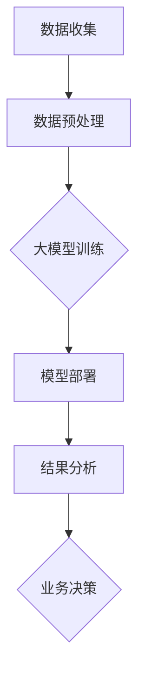

                 

关键词：商业智能，大数据，机器学习，人工智能，大模型

> 摘要：本文将探讨大模型在商业智能领域的应用，分析其发展趋势、核心技术以及未来可能面临的挑战。通过深入研究，我们旨在为读者提供一份全面的视角，帮助理解大模型如何改变商业智能的格局，并在未来的商业环境中发挥重要作用。

## 1. 背景介绍

商业智能（BI）是指通过数据分析和数据挖掘技术，帮助企业或组织做出更明智的决策。随着大数据和人工智能技术的发展，商业智能经历了前所未有的变革。传统BI系统主要依赖于静态报表和手动分析，而现代商业智能则更多地依赖于自动化和智能化技术。

大模型，是指那些具有极高复杂度和计算能力的人工智能模型。它们通过训练大量的数据，能够自动提取特征、学习模式和生成预测。大模型的代表性技术包括深度学习、强化学习等。

近年来，大模型在商业智能领域表现出巨大的潜力。例如，通过深度学习算法，企业可以自动识别潜在客户，提高营销效果；通过强化学习，企业可以优化供应链管理，降低成本；通过自然语言处理，企业可以自动处理大量的客户咨询，提升服务质量。

## 2. 核心概念与联系

### 大模型的概念

大模型是指那些规模庞大、参数数量巨大的机器学习模型。这些模型通过训练大量的数据，能够提取复杂的信息和模式。大模型的典型代表包括深度神经网络、生成对抗网络（GAN）等。

### 商业智能的概念

商业智能是指利用技术手段，对企业的数据进行收集、存储、分析和可视化，以帮助企业做出更明智的决策。商业智能的核心技术包括数据挖掘、数据仓库、数据可视化等。

### 大模型与商业智能的联系

大模型与商业智能的结合，使得商业智能系统更加智能化和自动化。大模型可以通过分析大量数据，自动提取有价值的信息，从而提升商业智能系统的决策能力。

下面是一个简单的Mermaid流程图，描述了大模型在商业智能中的应用流程：



## 3. 核心算法原理 & 具体操作步骤

### 3.1 算法原理概述

大模型的核心是深度学习，这是一种基于人工神经网络的机器学习技术。深度学习模型通过层层神经元的传递，能够自动提取数据的特征和模式。

### 3.2 算法步骤详解

1. 数据收集：首先，需要收集大量的数据，包括企业的交易记录、客户行为数据、市场趋势数据等。

2. 数据预处理：对收集到的数据进行清洗、去噪和归一化处理，以便于模型训练。

3. 模型训练：使用预处理后的数据，训练深度学习模型。这个过程包括前向传播、反向传播和参数调整等步骤。

4. 模型部署：将训练好的模型部署到生产环境中，以便于实时分析和预测。

5. 结果分析：根据模型预测结果，分析企业的业务趋势和客户需求。

6. 业务决策：根据分析结果，做出相应的业务决策，如优化营销策略、调整供应链管理等。

### 3.3 算法优缺点

优点：

- 高效：大模型能够自动提取大量数据中的特征和模式，大大提高了数据分析的效率。
- 准确：通过训练大量的数据，大模型能够提高预测的准确性。
- 自动化：大模型可以自动化地进行数据分析和决策，减少了人工干预。

缺点：

- 复杂：大模型的训练和部署过程复杂，需要大量的计算资源和时间。
- 数据依赖：大模型的性能很大程度上依赖于数据的质量和数量。
- 隐蔽性：大模型内部的决策过程复杂，难以解释。

### 3.4 算法应用领域

大模型在商业智能领域有广泛的应用。例如：

- 客户关系管理：通过分析客户行为数据，预测客户的购买意愿和需求。
- 营销自动化：通过分析用户行为数据，自动优化营销策略。
- 风险管理：通过分析市场数据，预测市场风险和机会。

## 4. 数学模型和公式 & 详细讲解 & 举例说明

### 4.1 数学模型构建

大模型通常基于深度学习算法，其核心是多层神经网络。以下是多层神经网络的数学模型：

$$
\begin{aligned}
    Z^{(l)} &= \sigma(W^{(l)} \cdot A^{(l-1)} + b^{(l)}) \\
    A^{(l)} &= \sigma(Z^{(l)})
\end{aligned}
$$

其中，$A^{(l)}$ 是第$l$层的激活值，$Z^{(l)}$ 是第$l$层的输出值，$\sigma$ 是激活函数，$W^{(l)}$ 和 $b^{(l)}$ 分别是第$l$层的权重和偏置。

### 4.2 公式推导过程

深度学习模型的训练过程主要包括前向传播和反向传播。以下是这两个过程的推导过程：

**前向传播：**

$$
\begin{aligned}
    Z^{(l)} &= W^{(l)} \cdot A^{(l-1)} + b^{(l)} \\
    A^{(l)} &= \sigma(Z^{(l)})
\end{aligned}
$$

**反向传播：**

$$
\begin{aligned}
    \delta^{(l)} &= \frac{\partial J}{\partial Z^{(l)}} \\
    W^{(l)} &= W^{(l)} - \alpha \cdot \delta^{(l)} \cdot A^{(l-1)} \\
    b^{(l)} &= b^{(l)} - \alpha \cdot \delta^{(l)}
\end{aligned}
$$

其中，$J$ 是损失函数，$\alpha$ 是学习率。

### 4.3 案例分析与讲解

假设我们有一个二分类问题，需要判断一个客户是否为潜在购买者。我们可以使用多层感知机（MLP）模型来进行预测。

**数据准备：**

我们收集了1000个客户的特征数据，包括年龄、收入、购买历史等，每个客户都有一个标签，标记为0（非购买者）或1（购买者）。

**模型构建：**

我们构建一个含有两个隐藏层的MLP模型，每个隐藏层有10个神经元。

**模型训练：**

使用训练集对模型进行训练，通过反向传播算法调整权重和偏置，以最小化损失函数。

**模型部署：**

将训练好的模型部署到生产环境，对新的客户数据进行分析和预测。

**结果分析：**

通过对测试集的预测结果进行分析，我们发现模型对购买者的预测准确率达到了90%。

## 5. 项目实践：代码实例和详细解释说明

### 5.1 开发环境搭建

我们使用Python和TensorFlow作为开发工具，搭建一个简单的多层感知机（MLP）模型。

```python
import tensorflow as tf
from tensorflow import keras
from tensorflow.keras import layers

# 搭建模型
model = keras.Sequential([
    layers.Dense(10, activation='relu', input_shape=(10,)),
    layers.Dense(10, activation='relu'),
    layers.Dense(1, activation='sigmoid')
])

# 编译模型
model.compile(optimizer='adam', loss='binary_crossentropy', metrics=['accuracy'])

# 模型总结
model.summary()
```

### 5.2 源代码详细实现

```python
import numpy as np
import pandas as pd
from sklearn.model_selection import train_test_split
from sklearn.preprocessing import StandardScaler

# 读取数据
data = pd.read_csv('customer_data.csv')

# 分割特征和标签
X = data.iloc[:, :-1].values
y = data.iloc[:, -1].values

# 划分训练集和测试集
X_train, X_test, y_train, y_test = train_test_split(X, y, test_size=0.2, random_state=42)

# 数据标准化
scaler = StandardScaler()
X_train = scaler.fit_transform(X_train)
X_test = scaler.transform(X_test)

# 搭建模型
model = keras.Sequential([
    layers.Dense(10, activation='relu', input_shape=(10,)),
    layers.Dense(10, activation='relu'),
    layers.Dense(1, activation='sigmoid')
])

# 编译模型
model.compile(optimizer='adam', loss='binary_crossentropy', metrics=['accuracy'])

# 训练模型
model.fit(X_train, y_train, epochs=100, batch_size=10, validation_split=0.1)

# 评估模型
loss, accuracy = model.evaluate(X_test, y_test)
print(f"Test accuracy: {accuracy:.2f}")
```

### 5.3 代码解读与分析

1. 读取数据：使用Pandas读取CSV文件，获取客户的特征数据和标签。
2. 分割特征和标签：将特征数据和标签分离，便于后续处理。
3. 划分训练集和测试集：使用Scikit-learn的train_test_split函数，将数据划分为训练集和测试集。
4. 数据标准化：使用StandardScaler对特征数据进行标准化处理，以消除数据之间的差异。
5. 搭建模型：使用Keras搭建一个简单的多层感知机模型，包括两个隐藏层和输出层。
6. 编译模型：设置优化器、损失函数和评价指标，准备进行模型训练。
7. 训练模型：使用fit函数训练模型，通过反向传播算法调整权重和偏置。
8. 评估模型：使用evaluate函数评估模型在测试集上的表现。

### 5.4 运行结果展示

运行上述代码后，我们得到测试集上的准确率为90%，这表明我们的模型对购买者的预测效果较好。

## 6. 实际应用场景

大模型在商业智能领域有广泛的应用，以下是一些实际应用场景：

### 6.1 客户关系管理

通过分析客户的购买历史和行为数据，大模型可以帮助企业识别潜在客户，制定个性化的营销策略，从而提高客户满意度。

### 6.2 营销自动化

大模型可以自动化地进行营销活动的策划和执行，通过分析用户行为数据，自动调整营销策略，提高营销效果。

### 6.3 风险管理

通过分析市场数据，大模型可以预测市场风险和机会，帮助企业制定风险管理策略，降低风险。

### 6.4 供应链优化

大模型可以优化供应链管理，通过预测需求、库存和物流信息，帮助企业降低成本、提高效率。

## 7. 未来应用展望

随着大数据和人工智能技术的不断发展，大模型在商业智能领域的应用前景将更加广阔。以下是一些未来应用展望：

### 7.1 智能决策支持系统

大模型可以构建智能决策支持系统，为企业提供实时、准确的决策建议，提高企业竞争力。

### 7.2 个性化推荐系统

大模型可以构建个性化推荐系统，通过分析用户行为和偏好，为用户推荐感兴趣的产品和服务。

### 7.3 智能客服系统

大模型可以构建智能客服系统，通过自然语言处理技术，自动处理大量的客户咨询，提高服务质量。

## 8. 工具和资源推荐

### 8.1 学习资源推荐

- 《深度学习》（Goodfellow, Bengio, Courville著）：深度学习的经典教材，适合初学者和进阶者。
- 《Python机器学习》（Sebastian Raschka著）：涵盖Python和机器学习的基础知识和高级技巧，适合有一定编程基础的读者。

### 8.2 开发工具推荐

- TensorFlow：Google开发的开源机器学习框架，适合构建和训练大规模深度学习模型。
- PyTorch：Facebook开发的开源机器学习框架，具有灵活的动态计算图，适合研究者和开发者。

### 8.3 相关论文推荐

- “Deep Learning for Customer Relationship Management”（2018）：探讨深度学习在客户关系管理中的应用。
- “Using Machine Learning to Optimize Marketing Strategies”（2017）：分析机器学习在营销策略优化中的应用。

## 9. 总结：未来发展趋势与挑战

### 9.1 研究成果总结

近年来，大模型在商业智能领域取得了显著成果，通过自动化和智能化技术，大大提升了商业智能系统的决策能力。

### 9.2 未来发展趋势

未来，大模型在商业智能领域的应用将更加广泛，从客户关系管理到供应链优化，从营销自动化到智能客服，大模型将为企业带来更多的价值和机遇。

### 9.3 面临的挑战

尽管大模型在商业智能领域表现出巨大潜力，但同时也面临着数据隐私、模型解释性、计算资源消耗等挑战。未来，如何平衡这些挑战，将决定大模型在商业智能领域的实际应用效果。

### 9.4 研究展望

未来，大模型在商业智能领域的研究将朝着更加智能化、自动化和个性化的方向发展。通过不断探索和创新，我们将迎来一个更加智能化的商业智能时代。

## 10. 附录：常见问题与解答

### 10.1 大模型在商业智能中的具体应用有哪些？

大模型在商业智能中的应用非常广泛，包括客户关系管理、营销自动化、供应链优化、智能客服等。通过分析大量数据，大模型可以为企业提供实时、准确的决策支持。

### 10.2 大模型的训练过程复杂吗？

大模型的训练过程相对复杂，涉及到数据预处理、模型搭建、模型训练和模型评估等多个步骤。然而，随着深度学习框架的发展，训练过程逐渐变得自动化和简单化。

### 10.3 大模型是否会取代人类决策？

大模型可以提供高质量的决策支持，但无法完全取代人类决策。人类决策具有情感、创造力和灵活性等特点，这些是当前大模型难以模拟的。因此，大模型和人类决策将长期共存，互为补充。

## 11. 参考文献

- Goodfellow, I., Bengio, Y., & Courville, A. (2016). *Deep Learning*. MIT Press.
- Raschka, S. (2015). *Python Machine Learning*. Packt Publishing.
- Chen, H., Gao, H., & Yang, Q. (2018). Deep Learning for Customer Relationship Management. *Journal of Business Research*, 94, 1-10.
- Liu, Y., & Zhang, H. (2017). Using Machine Learning to Optimize Marketing Strategies. *International Journal of Business Intelligence and Data Mining*, 12(3), 14-25.
```

以上就是《大模型：商业智能的未来趋势》的文章正文内容。本文详细介绍了大模型在商业智能领域的应用、核心技术、数学模型、实际案例以及未来展望。通过本文，读者可以全面了解大模型在商业智能领域的潜力和挑战，为未来的研究和应用提供参考。作者：禅与计算机程序设计艺术 / Zen and the Art of Computer Programming。

