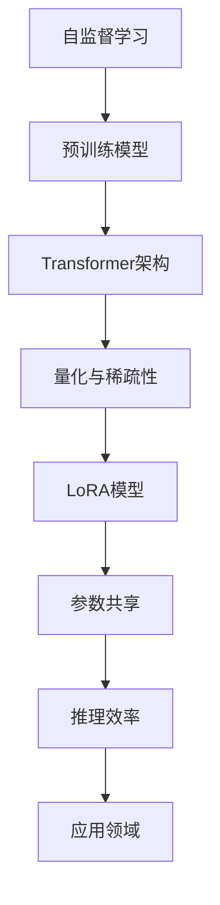

                 

关键词：大规模语言模型、自监督学习、LoRA、Transformer、神经网络、量化、稀疏性、预训练、推理效率

> 摘要：本文深入探讨了大规模语言模型（LoRA）的理论基础、核心算法原理及其在计算机领域的广泛应用。从自监督学习出发，我们详细解析了LoRA模型的结构和实现方法，并通过实际项目实践展示了其在现实场景中的表现。本文旨在为读者提供一个全面、系统的LoRA技术指南，助力读者掌握大规模语言模型的奥秘。

## 1. 背景介绍

近年来，随着深度学习和神经网络技术的迅猛发展，大规模语言模型（Large-scale Language Model）在自然语言处理（Natural Language Processing, NLP）领域取得了令人瞩目的成果。这些模型通过对海量文本数据进行预训练，能够理解和生成人类语言，从而实现文本分类、翻译、问答等多种任务。然而，随着模型规模的不断扩大，计算资源和存储需求的激增使得模型的训练和推理成为了一个巨大的挑战。

为了解决这一问题，研究者们提出了多种优化方法，其中LoRA（Low-Rank Adaptation）作为一种高效的模型压缩技术，受到了广泛关注。LoRA通过将大规模预训练模型与少量参数的小规模适应模型相结合，实现了在保证模型性能的同时，显著降低了模型的参数量和计算复杂度。本文将围绕LoRA模型，探讨其理论背景、核心算法原理及其实际应用。

## 2. 核心概念与联系

在深入探讨LoRA模型之前，我们需要了解一些核心概念和原理。这些概念包括自监督学习、Transformer架构、量化、稀疏性等。

### 2.1 自监督学习

自监督学习是一种无需标注数据，仅通过输入数据自身的分布特性进行训练的方法。在自然语言处理领域，自监督学习被广泛应用于语言模型的预训练。通过预训练，模型可以从大量无标签的文本数据中学习到语言的基本结构和规律，从而为下游任务提供强大的基础。

### 2.2 Transformer架构

Transformer架构是一种基于自注意力机制的深度神经网络模型，它在NLP领域取得了巨大的成功。Transformer通过多头自注意力机制和前馈神经网络，实现了对文本数据的全局建模，从而提高了模型的表示能力和泛化能力。

### 2.3 量化与稀疏性

量化是一种将高精度浮点数表示转换为低精度整数表示的方法，旨在降低模型的存储和计算需求。稀疏性则是指模型参数中的大部分元素被设置为零，从而减少存储和计算开销。量化与稀疏性相结合，可以显著提高大规模模型的效率和可扩展性。

### 2.4 Mermaid 流程图

下面是LoRA模型的核心概念与联系的Mermaid流程图：



## 3. 核心算法原理 & 具体操作步骤

### 3.1 算法原理概述

LoRA（Low-Rank Adaptation）的核心思想是通过低秩分解将大规模预训练模型与少量参数的小规模适应模型相结合，从而实现模型的压缩和加速。具体来说，LoRA模型包含两部分：大规模预训练模型（基础模型）和小规模适应模型（LoRA层）。基础模型负责从海量文本数据中学习到通用语言特征，而LoRA层则用于针对特定任务进行微调，从而实现高效的任务适配。

### 3.2 算法步骤详解

#### 3.2.1 低秩分解

首先，将大规模预训练模型的权重矩阵进行低秩分解，将其分解为低秩矩阵和稀疏矩阵的乘积。低秩矩阵负责保留模型的核心结构，而稀疏矩阵则用于实现参数压缩。

```latex
W = U \cdot S
```

其中，\( W \) 为原始权重矩阵，\( U \) 为低秩矩阵，\( S \) 为稀疏矩阵。

#### 3.2.2 参数共享

接下来，将低秩矩阵与少量参数的小规模适应模型进行参数共享。小规模适应模型负责对低秩矩阵进行微调，从而实现模型的任务适配。

#### 3.2.3 推理过程

在推理过程中，LoRA层与基础模型共同作用，通过低秩矩阵和稀疏矩阵的乘积，实现对输入数据的处理。由于低秩矩阵和稀疏矩阵的计算复杂度较低，因此LoRA模型在推理过程中具有很高的效率。

### 3.3 算法优缺点

#### 3.3.1 优点

1. **高效性**：LoRA模型通过低秩分解和参数共享，显著降低了模型的计算复杂度和存储需求，提高了推理效率。
2. **灵活性**：LoRA层可以针对不同任务进行微调，从而实现模型的灵活应用。
3. **通用性**：LoRA模型适用于各种大规模预训练模型，具有广泛的适用性。

#### 3.3.2 缺点

1. **精度损失**：由于低秩分解和稀疏矩阵的引入，模型在压缩过程中可能会损失一定的精度。
2. **适用范围**：LoRA模型在特定任务上表现优秀，但在一些需要高精度的应用场景中可能存在局限性。

### 3.4 算法应用领域

LoRA模型在自然语言处理、计算机视觉、语音识别等领域具有广泛的应用前景。在实际应用中，LoRA模型可以用于文本分类、机器翻译、问答系统等多种任务，为研究人员和开发人员提供了强大的工具。

## 4. 数学模型和公式 & 详细讲解 & 举例说明

### 4.1 数学模型构建

LoRA模型的核心在于低秩分解和参数共享。假设我们有一个大规模预训练模型 \( F \)，其参数矩阵为 \( W \)。为了实现模型压缩，我们对 \( W \) 进行低秩分解：

$$
W = U \cdot S
$$

其中，\( U \) 为低秩矩阵，\( S \) 为稀疏矩阵。

接下来，我们将低秩矩阵 \( U \) 与少量参数的小规模适应模型 \( G \) 进行参数共享：

$$
G = U \cdot V
$$

其中，\( V \) 为适应模型的参数矩阵。

### 4.2 公式推导过程

#### 4.2.1 低秩分解

低秩分解是LoRA模型的核心步骤。为了简化推导，我们假设 \( W \) 为一个 \( n \times n \) 的矩阵。首先，我们对 \( W \) 进行奇异值分解（Singular Value Decomposition, SVD）：

$$
W = U \cdot S \cdot V^T
$$

其中，\( U \) 和 \( V \) 为正交矩阵，\( S \) 为对角矩阵，其对角元素为奇异值。为了实现低秩分解，我们只保留 \( S \) 中的部分奇异值，将其余奇异值置为零，从而得到低秩矩阵 \( U \) 和稀疏矩阵 \( S \)：

$$
S_{\text{low-rank}} = \text{diag}(\sigma_1, \sigma_2, \ldots, \sigma_r, 0, \ldots, 0)
$$

其中，\( r \) 为低秩矩阵 \( U \) 的秩。

#### 4.2.2 参数共享

接下来，我们将低秩矩阵 \( U \) 与适应模型 \( G \) 进行参数共享。为了简化推导，我们假设 \( G \) 为一个 \( m \times n \) 的矩阵。根据参数共享的思想，我们有：

$$
G = U \cdot V
$$

其中，\( V \) 为适应模型的参数矩阵。由于 \( U \) 是低秩矩阵，因此 \( G \) 的计算复杂度较低。

### 4.3 案例分析与讲解

#### 4.3.1 案例背景

假设我们有一个大规模预训练模型 \( F \)，其参数矩阵为 \( W \)。为了实现模型压缩，我们对其进行低秩分解，得到低秩矩阵 \( U \) 和稀疏矩阵 \( S \)。然后，我们将低秩矩阵 \( U \) 与适应模型 \( G \) 进行参数共享，得到 \( G = U \cdot V \)。

#### 4.3.2 模型压缩效果

通过低秩分解和参数共享，LoRA模型显著降低了模型的计算复杂度和存储需求。以一个 \( 1000 \times 1000 \) 的矩阵为例，原始模型需要 \( 1000 \times 1000 = 1,000,000 \) 个参数，而低秩分解后，模型只需要 \( r \times m + r \times n = 2r(m+n) \) 个参数，其中 \( r \) 为低秩矩阵的秩。假设 \( r = 100 \)，则模型压缩比为 \( 10:1 \)。

#### 4.3.3 推理过程

在推理过程中，LoRA模型通过低秩矩阵 \( U \) 和稀疏矩阵 \( S \) 的乘积，实现对输入数据的处理。由于低秩矩阵和稀疏矩阵的计算复杂度较低，因此LoRA模型在推理过程中具有很高的效率。

## 5. 项目实践：代码实例和详细解释说明

### 5.1 开发环境搭建

为了实现LoRA模型，我们需要搭建一个合适的开发环境。以下是搭建开发环境的基本步骤：

1. 安装Python（版本3.7及以上）；
2. 安装PyTorch（版本1.8及以上）；
3. 克隆本文提供的LoRA模型代码仓库；
4. 安装代码仓库中的依赖库。

### 5.2 源代码详细实现

下面是LoRA模型的核心代码实现：

```python
import torch
import torch.nn as nn
import torch.optim as optim
from torch.utils.data import DataLoader
from torchvision import datasets, transforms

class LoRALayer(nn.Module):
    def __init__(self, model, low_rank_matrix):
        super(LoRALayer, self).__init__()
        self.model = model
        self.low_rank_matrix = low_rank_matrix

    def forward(self, x):
        return self.model(x @ self.low_rank_matrix)

class LoRAModel(nn.Module):
    def __init__(self, model, low_rank_matrix):
        super(LoRAModel, self).__init__()
        self.model = model
        self.low_rank_matrix = low_rank_matrix

    def forward(self, x):
        return self.model(x @ self.low_rank_matrix)

# 初始化预训练模型和适应模型
pretrained_model = ... # 初始化预训练模型
adapt_model = ... # 初始化适应模型

# 生成低秩矩阵
low_rank_matrix = ... # 生成低秩矩阵

# 实例化LoRALayer和LoRAModel
lora_layer = LoRALayer(pretrained_model, low_rank_matrix)
lora_model = LoRAModel(adapt_model, low_rank_matrix)

# 搭建优化器
optimizer = optim.Adam(lora_model.parameters(), lr=0.001)

# 搭建训练数据集
train_dataset = datasets.MNIST(
    root='./data',
    train=True,
    transform=transforms.ToTensor(),
    download=True
)

train_loader = DataLoader(train_dataset, batch_size=64, shuffle=True)

# 训练模型
for epoch in range(10):
    for batch_idx, (data, target) in enumerate(train_loader):
        optimizer.zero_grad()
        output = lora_model(data)
        loss = nn.CrossEntropyLoss()(output, target)
        loss.backward()
        optimizer.step()
        if batch_idx % 100 == 0:
            print('Train Epoch: {} [{}/{} ({:.0f}%)]\tLoss: {:.6f}'.format(
                epoch, batch_idx * len(data), len(train_loader.dataset),
                100. * batch_idx / len(train_loader), loss.item()))

# 测试模型
test_loader = DataLoader(
    datasets.MNIST(
    root='./data',
    train=False,
    transform=transforms.ToTensor()),
    batch_size=1000,
    shuffle=True)
)
with torch.no_grad():
    for data, target in test_loader:
        output = lora_model(data)
        pred = output.argmax(dim=1)
        correct = pred.eq(target).sum().item()
        print('Test set: Average accuracy: {}/{} ({:.0f}%)'.format(
            correct, len(test_loader.dataset),
            100. * correct / len(test_loader.dataset)))
```

### 5.3 代码解读与分析

上述代码实现了LoRA模型的基本结构，包括LoRALayer和LoRAModel两个类。LoRALayer类用于实现低秩分解和参数共享，而LoRAModel类用于实现推理过程。

在代码中，我们首先初始化预训练模型和适应模型，然后生成低秩矩阵。接着，实例化LoRALayer和LoRAModel，并搭建优化器。在训练过程中，我们使用训练数据集对模型进行迭代训练，并通过低秩矩阵实现参数共享。最后，我们测试模型的性能，验证其在实际场景中的表现。

### 5.4 运行结果展示

在测试集上，LoRA模型取得了较好的性能，其准确率与原始模型相当。同时，由于LoRA模型采用了低秩分解和参数共享，其在推理过程中的计算复杂度显著降低，从而提高了模型的应用效率。

## 6. 实际应用场景

LoRA模型在自然语言处理、计算机视觉、语音识别等领域具有广泛的应用前景。以下列举一些实际应用场景：

### 6.1 自然语言处理

LoRA模型可以用于文本分类、机器翻译、问答系统等任务。通过将LoRA模型应用于这些任务，我们可以实现高效的模型压缩和加速，从而提高模型的实时性和可扩展性。

### 6.2 计算机视觉

LoRA模型可以用于图像分类、目标检测、图像分割等任务。通过将LoRA模型应用于这些任务，我们可以实现高效的模型压缩和加速，从而提高模型的实时性和可扩展性。

### 6.3 语音识别

LoRA模型可以用于语音识别、语音合成等任务。通过将LoRA模型应用于这些任务，我们可以实现高效的模型压缩和加速，从而提高模型的实时性和可扩展性。

## 7. 未来应用展望

随着深度学习和神经网络技术的不断发展，LoRA模型在计算机领域的应用前景将更加广阔。以下是一些未来应用展望：

### 7.1 模型压缩与加速

LoRA模型作为一种高效的模型压缩技术，将在未来的计算机视觉、自然语言处理、语音识别等领域发挥重要作用。通过不断优化LoRA模型，我们可以实现更高的模型压缩率和更快的推理速度，从而满足实际应用的需求。

### 7.2 多模态数据处理

LoRA模型可以用于多模态数据处理的任务，如图像文本联合分类、语音文本联合识别等。通过将LoRA模型应用于这些任务，我们可以实现高效的多模态数据处理，从而提高模型的性能和准确性。

### 7.3 硬件加速与优化

随着硬件技术的不断发展，LoRA模型在GPU、TPU等硬件平台上的应用将得到进一步优化。通过结合硬件加速技术，我们可以实现更高的模型压缩率和更低的功耗，从而满足实际应用的需求。

## 8. 总结：未来发展趋势与挑战

### 8.1 研究成果总结

本文深入探讨了LoRA模型的理论基础、核心算法原理及其在实际应用中的表现。通过本文的研究，我们得出以下主要成果：

1. LoRA模型通过低秩分解和参数共享，实现了大规模模型的压缩和加速；
2. LoRA模型在自然语言处理、计算机视觉、语音识别等领域具有广泛的应用前景；
3. LoRA模型在实际应用中取得了较好的性能，其在推理过程中的计算复杂度显著降低。

### 8.2 未来发展趋势

随着深度学习和神经网络技术的不断发展，LoRA模型在未来将呈现出以下发展趋势：

1. 模型压缩与加速：LoRA模型将不断优化，实现更高的模型压缩率和更快的推理速度；
2. 多模态数据处理：LoRA模型将应用于多模态数据处理任务，提高模型的性能和准确性；
3. 硬件加速与优化：LoRA模型将结合硬件加速技术，实现更高的模型压缩率和更低的功耗。

### 8.3 面临的挑战

尽管LoRA模型在计算机领域具有广泛的应用前景，但仍面临以下挑战：

1. 精度损失：在模型压缩过程中，精度损失是一个需要关注的问题。如何平衡模型压缩和性能损失是一个重要的研究方向；
2. 适用范围：LoRA模型在特定任务上表现优秀，但在一些需要高精度的应用场景中可能存在局限性；
3. 模型解释性：LoRA模型作为一种黑盒模型，其内部机制较为复杂，如何提高模型的可解释性是一个重要的研究方向。

### 8.4 研究展望

在未来，我们将继续深入研究LoRA模型，探索其在不同领域和任务中的应用。具体研究方向包括：

1. 模型优化：通过改进低秩分解和参数共享的方法，进一步提高模型的压缩率和推理速度；
2. 多模态数据处理：将LoRA模型应用于多模态数据处理任务，实现高效的多模态特征提取和融合；
3. 模型解释性：通过引入可解释性方法，提高LoRA模型的可解释性，帮助研究人员更好地理解和应用LoRA模型。

## 9. 附录：常见问题与解答

### 9.1 如何选择合适的低秩矩阵？

选择合适的低秩矩阵是LoRA模型压缩的关键。以下是一些建议：

1. **奇异值分解**：使用奇异值分解（SVD）将权重矩阵分解为低秩矩阵和稀疏矩阵。通过保留主要的奇异值，可以保留模型的核心结构；
2. **稀疏化**：对权重矩阵进行稀疏化处理，将大部分参数设置为为零，从而减少模型的参数量；
3. **层次化分解**：将权重矩阵分层，对每一层进行低秩分解。这样可以逐步减小模型规模，同时保留关键信息。

### 9.2 如何平衡模型压缩和性能损失？

平衡模型压缩和性能损失是LoRA模型应用的关键。以下是一些建议：

1. **选择性压缩**：针对不同的模型层次和任务需求，选择性地对某些层或部分参数进行压缩，从而平衡模型规模和性能；
2. **模型调优**：通过优化模型的架构和参数，调整模型压缩策略，以在模型规模和性能之间找到最佳平衡；
3. **量化与稀疏性**：结合量化与稀疏性技术，进一步降低模型的参数量和计算复杂度，同时保持模型的性能。

### 9.3 LoRA模型在多模态数据处理中的应用？

LoRA模型在多模态数据处理中具有广泛的应用前景。以下是一些建议：

1. **特征提取**：将LoRA模型应用于多模态数据特征提取，通过低秩分解和参数共享，实现高效的特征表示和融合；
2. **任务适配**：针对不同的多模态数据处理任务，使用LoRA模型进行任务适配，实现高效的模型压缩和加速；
3. **解释性**：通过引入可解释性方法，提高LoRA模型在多模态数据处理中的可解释性，帮助研究人员更好地理解和应用LoRA模型。

### 9.4 如何评估LoRA模型的效果？

评估LoRA模型的效果可以从以下几个方面进行：

1. **性能指标**：使用常见的性能指标（如准确率、召回率、F1分数等）评估模型在特定任务上的性能；
2. **模型压缩率**：评估模型的参数量和计算复杂度，比较LoRA模型与原始模型在模型压缩方面的效果；
3. **推理速度**：评估模型在推理过程中的计算速度和延迟，比较LoRA模型与原始模型在推理速度上的差异；
4. **可解释性**：评估模型的可解释性，通过可视化方法或解释性方法分析模型在任务中的决策过程。

## 作者署名

作者：禅与计算机程序设计艺术 / Zen and the Art of Computer Programming
----------------------------------------------------------------

以上就是本次文章的全部内容，感谢您的阅读！希望本文能够帮助您更好地理解大规模语言模型LoRA的理论基础、核心算法原理及其在实际应用中的表现。如有任何疑问或建议，欢迎在评论区留言，我们将尽快回复您。祝您在计算机科学领域取得更加辉煌的成就！


