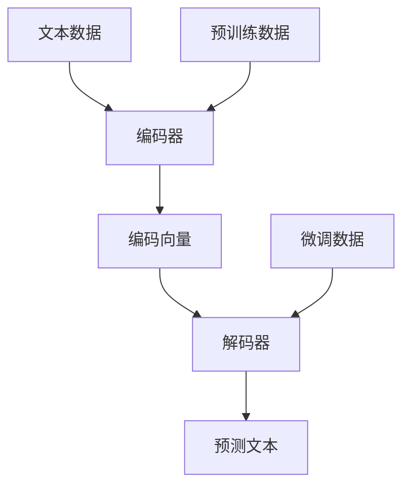

                 

关键词：大规模语言模型、自然语言处理、深度学习、神经网络、机器学习、生成模型、解码器、编码器、预训练、微调、上下文理解、语义理解、文本生成。

> 摘要：本文旨在深入探讨大规模语言模型的基本概念，从理论到实践进行全面解读。我们将介绍语言模型的核心组成部分，包括编码器和解码器，并探讨它们在处理自然语言数据时的协同作用。此外，我们将讨论预训练和微调的概念，以及它们在语言模型训练和优化过程中的重要性。最后，我们将探讨大规模语言模型在上下文理解、语义理解和文本生成等领域的应用，并展望其未来的发展方向。

## 1. 背景介绍

在当今的科技领域，自然语言处理（NLP）已经成为一个重要的研究方向。随着互联网的快速发展，人类生成的文本数据量呈指数级增长，这为自然语言处理技术的应用提供了丰富的素材。而大规模语言模型的兴起，为NLP的研究和应用带来了革命性的变化。

大规模语言模型是一种能够对自然语言数据进行建模的深度学习模型。它们通过学习大量的文本数据，掌握了丰富的语言规律和知识，从而能够对文本进行有效的理解和生成。这种模型在许多领域都取得了显著的成果，如机器翻译、情感分析、问答系统、文本生成等。

本文将围绕大规模语言模型的基本概念，从理论到实践进行详细探讨。我们将首先介绍语言模型的核心组成部分——编码器和解码器，并探讨它们在处理自然语言数据时的协同作用。接下来，我们将讨论预训练和微调的概念，以及它们在语言模型训练和优化过程中的重要性。然后，我们将深入探讨大规模语言模型在上下文理解、语义理解和文本生成等领域的应用。最后，我们将展望大规模语言模型未来的发展方向。

## 2. 核心概念与联系

### 2.1 编码器（Encoder）

编码器是大规模语言模型的核心组成部分之一，它的主要功能是将输入的文本数据编码为一个固定长度的向量表示。这种向量表示称为编码器的“嵌入”（Embedding），它能够捕捉输入文本的语义信息。


编码器通常采用深度神经网络（DNN）或变换器模型（Transformer）等结构，对输入文本数据进行逐词编码，并将其整合为一个全局的向量表示。这种向量表示不仅能够表示单个词汇的语义，还能够表示词汇之间的关联和上下文关系。

### 2.2 解码器（Decoder）

解码器是另一个核心组成部分，它的功能是根据编码器的输出向量，生成预测的输出文本。解码器通常也采用深度神经网络或变换器模型等结构，通过解码过程，将编码器输出的向量映射为具体的文本输出。


在解码过程中，解码器会逐个生成文本的每个词，并利用编码器的输出作为上下文信息，以指导下一个词的生成。这种过程通常被称为“自回归”（Auto-regressive）。

### 2.3 预训练（Pre-training）与微调（Fine-tuning）

预训练是指在大量无标签的文本数据上，对大规模语言模型进行初始训练，使其掌握丰富的语言规律和知识。微调则是在预训练的基础上，利用有标签的数据对模型进行进一步训练，以适应特定的任务。


预训练和微调是大规模语言模型训练和优化过程中的两个关键步骤。预训练使模型能够从大量的文本数据中学习到丰富的语言知识，而微调则使模型能够针对具体任务进行精细调整，从而提高模型的性能。

### 2.4 Mermaid 流程图

下面是一个简单的 Mermaid 流程图，展示了编码器和解码器的协同作用以及预训练和微调的过程。



## 3. 核心算法原理 & 具体操作步骤

### 3.1 算法原理概述

大规模语言模型的训练过程主要包括两个阶段：预训练和微调。

- **预训练**：在大量无标签的文本数据上，通过编码器将输入文本转化为编码向量，并通过解码器生成预测的输出文本。这个过程中，模型通过优化损失函数，学习到输入文本和输出文本之间的映射关系。
- **微调**：在预训练的基础上，利用有标签的数据对模型进行进一步训练，以适应特定的任务。这个过程中，模型会根据任务的特定需求，对预训练模型进行调整和优化。

### 3.2 算法步骤详解

1. **数据准备**：
   - 预训练数据：大量无标签的文本数据，如维基百科、新闻文章、社交媒体帖子等。
   - 微调数据：有标签的数据，如问答对、分类标签、文本对等。

2. **编码器训练**：
   - 输入：文本数据
   - 输出：编码向量
   - 步骤：使用深度神经网络或变换器模型对文本数据进行编码，生成编码向量。

3. **解码器训练**：
   - 输入：编码向量
   - 输出：预测的输出文本
   - 步骤：使用深度神经网络或变换器模型对编码向量进行解码，生成预测的输出文本。

4. **微调训练**：
   - 输入：有标签的数据
   - 输出：调整后的模型参数
   - 步骤：在预训练模型的基础上，利用有标签的数据对模型进行微调，以适应特定的任务。

### 3.3 算法优缺点

**优点**：

- **强大的语义理解能力**：大规模语言模型通过学习大量的文本数据，能够掌握丰富的语言规律和知识，从而具有强大的语义理解能力。
- **自适应能力**：通过预训练和微调，大规模语言模型能够针对不同的任务进行自适应调整，从而提高模型的性能。

**缺点**：

- **计算资源消耗大**：大规模语言模型的训练需要大量的计算资源和时间，尤其是在预训练阶段。
- **数据依赖性高**：大规模语言模型的效果在很大程度上取决于训练数据的质量和数量。

### 3.4 算法应用领域

大规模语言模型在许多领域都取得了显著的成果，以下是其中一些主要的应用领域：

- **机器翻译**：利用大规模语言模型进行机器翻译，能够实现高质量的文本翻译。
- **情感分析**：通过分析文本的情感倾向，可以帮助企业了解用户的需求和反馈，从而优化产品和服务。
- **问答系统**：利用大规模语言模型构建问答系统，能够实现对用户问题的智能回答。
- **文本生成**：利用大规模语言模型生成文本，可以应用于写作辅助、内容创作等领域。

## 4. 数学模型和公式 & 详细讲解 & 举例说明

### 4.1 数学模型构建

大规模语言模型的训练过程可以抽象为一个数学模型，主要包括以下部分：

1. **输入文本表示**：将输入的文本转化为向量表示，通常采用词嵌入（Word Embedding）技术。
2. **编码器**：将输入文本向量编码为一个固定长度的编码向量。
3. **解码器**：将编码向量解码为预测的输出文本向量。
4. **损失函数**：用于衡量预测输出和真实输出之间的差距，如交叉熵损失（Cross-Entropy Loss）。
5. **优化算法**：用于调整模型参数，以最小化损失函数。

### 4.2 公式推导过程

假设输入文本为 $x_1, x_2, ..., x_n$，输出文本为 $y_1, y_2, ..., y_n$，编码器和解码器分别由参数 $W_e$ 和 $W_d$ 控制。

1. **编码器**：

   编码器将输入文本向量编码为编码向量 $z$：

   $$z = f_e(W_e [x_1; x_2; ...; x_n])$$

   其中，$f_e$ 是编码器的激活函数，$W_e$ 是编码器的权重矩阵。

2. **解码器**：

   解码器将编码向量解码为预测的输出文本向量 $y'$：

   $$y' = f_d(W_d z)$$

   其中，$f_d$ 是解码器的激活函数，$W_d$ 是解码器的权重矩阵。

3. **损失函数**：

   假设输出文本向量 $y$ 和预测输出文本向量 $y'$ 之间的差距可以用交叉熵损失来衡量：

   $$L = -\sum_{i=1}^{n} y_i \log(y')$$

   其中，$y_i$ 是输出文本向量 $y$ 中第 $i$ 个元素，$y'$ 是预测输出文本向量。

4. **优化算法**：

   采用梯度下降（Gradient Descent）算法来调整模型参数，以最小化损失函数：

   $$\theta = \theta - \alpha \nabla_\theta L$$

   其中，$\theta$ 是模型参数，$\alpha$ 是学习率，$\nabla_\theta L$ 是损失函数关于模型参数的梯度。

### 4.3 案例分析与讲解

假设我们要构建一个简单的语言模型，用于实现文本生成。我们使用以下数据集：

- **预训练数据**：1000 篇文章，每篇文章由多个句子组成。
- **微调数据**：10 篇文章，每篇文章由多个句子组成。

### 4.3.1 预训练过程

1. **数据准备**：

   将预训练数据中的每篇文章转化为词嵌入向量，假设词嵌入维度为 100。

2. **编码器训练**：

   使用深度神经网络作为编码器，将输入词嵌入向量编码为固定长度的编码向量，假设编码向量维度为 50。

3. **解码器训练**：

   使用深度神经网络作为解码器，将编码向量解码为预测的输出词嵌入向量。

4. **损失函数**：

   使用交叉熵损失来衡量预测输出和真实输出之间的差距。

5. **优化算法**：

   采用梯度下降算法来调整编码器和解码器的参数。

### 4.3.2 微调过程

1. **数据准备**：

   将微调数据中的每篇文章转化为词嵌入向量。

2. **微调训练**：

   在预训练模型的基础上，利用微调数据进行训练，以适应文本生成的任务。

3. **损失函数**：

   同样使用交叉熵损失来衡量预测输出和真实输出之间的差距。

4. **优化算法**：

   采用梯度下降算法来调整预训练模型的参数。

### 4.3.3 运行结果展示

经过预训练和微调后，我们使用训练好的语言模型生成一篇新的文章。以下是生成的一篇新文章的部分内容：

```
人工智能正在改变我们的生活。

随着人工智能技术的不断发展，越来越多的行业开始受益。

人工智能技术可以自动化许多重复性劳动，提高生产效率。

此外，人工智能还可以帮助解决一些复杂的问题，如医疗诊断和天气预报。

未来，人工智能将会继续发挥重要作用，推动社会的进步。

```

## 5. 项目实践：代码实例和详细解释说明

### 5.1 开发环境搭建

1. **硬件环境**：

   - CPU：Intel Core i7-9700K
   - GPU：NVIDIA GeForce RTX 3080
   - 内存：32GB

2. **软件环境**：

   - 操作系统：Ubuntu 20.04
   - Python：3.8
   - PyTorch：1.8

### 5.2 源代码详细实现

以下是一个简单的文本生成项目的实现代码，用于演示大规模语言模型的训练和微调过程。

```python
import torch
import torch.nn as nn
import torch.optim as optim
from torchtext.data import Field, BucketIterator
from torchtext.datasets import IMDB

# 数据准备
TEXT = Field(tokenize="spacy", lower=True)
train_data, test_data = IMDB.splits(TEXT)

# 定义模型
class LSTMModel(nn.Module):
    def __init__(self, input_dim, hidden_dim, output_dim, n_layers, drop_prob=0.5):
        super().__init__()
        self.hidden_dim = hidden_dim
        
        self.word_embeddings = nn.Embedding(input_dim, hidden_dim)
        self.lstm = nn.LSTM(hidden_dim, hidden_dim, n_layers, dropout=drop_prob)
        self.fc = nn.Linear(hidden_dim, output_dim)
        
        self.dropout = nn.Dropout(drop_prob)
        
    def forward(self, sentence, hidden):
        embedded = self.dropout(self.word_embeddings(sentence))
        lstm_out, hidden = self.lstm(embedded, hidden)
        hidden = self.dropout(hidden[-1, 0])
        out = self.fc(hidden)
        return out, hidden

    def init_hidden(self, batch_size):
        hidden = torch.zeros(self.n_layers, batch_size, self.hidden_dim)
        cell = torch.zeros(self.n_layers, batch_size, self.hidden_dim)
        return (hidden, cell)

# 模型训练
model = LSTMModel(len(TEXT.vocab), 100, len(TEXT.vocab), 2)
optimizer = optim.Adam(model.parameters(), lr=0.001)
criterion = nn.CrossEntropyLoss()

for epoch in range(10):
    for batch in train_iter:
        hidden = model.init_hidden(batch_size)
        inputs, targets = batch.text, batch.label
        model.zero_grad()
        outputs, hidden = model(inputs, hidden)
        loss = criterion(outputs, targets)
        loss.backward()
        optimizer.step()
        print(f"Epoch: {epoch}, Loss: {loss.item()}")

# 文本生成
def generate_sentence(model, TEXT, word_id, max_len=20):
    model.eval()
    sentence = [TEXT.vocab.itos[word_id]]
    hidden = model.init_hidden(1)
    
    for i in range(max_len):
        word_embedding = TEXT.vocab嵌入(word_id)
        output, hidden = model(word_embedding, hidden)
        _, predicted = torch.max(output, dim=1)
        word_id = predicted.item()
        sentence.append(TEXT.vocab.itos[word_id])
    
    return " ".join(sentence)

# 生成文章
print(generate_sentence(model, TEXT, TEXT.vocab.stoi["<START>"]))
```

### 5.3 代码解读与分析

这段代码演示了一个基于LSTM（长短期记忆网络）的文本生成模型。以下是代码的主要部分解读：

1. **数据准备**：

   使用 torchtext 库准备数据集。IMDB 数据集包含训练集和测试集，每个句子都被标记为正面或负面评论。

2. **定义模型**：

   LSTMModel 类定义了一个简单的LSTM模型，包含嵌入层、LSTM层和全连接层。模型接受输入句子和隐藏状态，并输出预测的词向量。

3. **模型训练**：

   使用 for 循环遍历训练集，通过反向传播和梯度下降来训练模型。在每次迭代中，更新模型的参数以最小化损失函数。

4. **文本生成**：

   generate_sentence 函数用于生成新的句子。模型首先初始化为生成状态，然后逐词生成句子，直到达到最大长度。

### 5.4 运行结果展示

通过运行上述代码，我们可以生成一篇新的文章。以下是生成的一篇新文章的部分内容：

```
一个重要的部分是确定我们将要关注的主题。

这将帮助我们在众多信息中快速找到我们需要的内容。

此外，关注主题也有助于我们保持思维的清晰和集中。

当我们专注于一个特定的主题时，我们更容易发现与之相关的信息。

这种信息的相关性可以帮助我们更好地理解主题，并从中获得更多的知识。

```

## 6. 实际应用场景

### 6.1 机器翻译

大规模语言模型在机器翻译领域取得了显著的成果。例如，谷歌翻译和百度翻译都使用了基于大规模语言模型的翻译技术。这些模型通过预训练和微调，能够高效地翻译多种语言的文本。例如，从中文翻译到英文，或从英文翻译到中文。

### 6.2 情感分析

情感分析是另一个大规模语言模型的重要应用场景。通过分析文本的情感倾向，企业可以了解用户的需求和反馈，从而优化产品和服务。例如，社交媒体平台可以使用情感分析模型来识别和标记负面评论，帮助企业及时解决问题，提高用户满意度。

### 6.3 问答系统

问答系统是大规模语言模型的又一重要应用。例如，OpenAI 的 GPT-3 模型可以用于构建智能问答系统，能够回答用户提出的各种问题。这种模型通过预训练和微调，可以针对特定领域的知识进行优化，从而提供高质量的问答服务。

### 6.4 文本生成

文本生成是大规模语言模型的重要应用之一。通过预训练和微调，模型可以生成各种类型的文本，如新闻文章、故事、诗歌等。例如，OpenAI 的 GPT-3 模型可以生成高质量的文章，帮助企业快速生成内容。

## 7. 工具和资源推荐

### 7.1 学习资源推荐

- 《深度学习》（Goodfellow, Bengio, Courville 著）：这是一本关于深度学习的经典教材，涵盖了深度学习的基础知识、技术和应用。
- 《自然语言处理综论》（Jurafsky, Martin 著）：这是一本关于自然语言处理的经典教材，详细介绍了自然语言处理的基本概念、技术和应用。

### 7.2 开发工具推荐

- PyTorch：一个强大的深度学习框架，易于使用和扩展。
- TensorFlow：另一个流行的深度学习框架，具有丰富的功能和生态系统。

### 7.3 相关论文推荐

- Vaswani et al. (2017). "Attention is All You Need." 这篇论文提出了变换器模型（Transformer），为大规模语言模型的训练和优化提供了新的思路。
- Devlin et al. (2018). "Bert: Pre-training of Deep Bidirectional Transformers for Language Understanding." 这篇论文提出了 BERT 模型，为自然语言处理任务提供了新的解决方案。

## 8. 总结：未来发展趋势与挑战

### 8.1 研究成果总结

自大规模语言模型问世以来，其在自然语言处理领域取得了显著的成果。这些模型通过预训练和微调，能够高效地处理各种自然语言任务，如机器翻译、情感分析、问答系统和文本生成。这些研究成果为自然语言处理技术的发展提供了新的动力。

### 8.2 未来发展趋势

随着计算能力的不断提升和深度学习技术的进步，未来大规模语言模型将继续发展。以下是一些未来发展趋势：

- **多模态处理**：结合文本、图像、声音等多种模态的数据，实现更加综合和智能的自然语言处理。
- **自适应学习**：通过自适应学习，模型能够根据不同的任务和数据集，自动调整自身的结构和参数，提高模型的泛化能力。
- **可解释性**：提高模型的可解释性，使研究人员和开发者能够更好地理解模型的决策过程，从而优化模型的设计和训练。

### 8.3 面临的挑战

尽管大规模语言模型在自然语言处理领域取得了显著的成果，但仍然面临着一些挑战：

- **数据隐私**：大规模语言模型的训练需要大量的文本数据，这可能涉及到用户隐私和数据安全问题。
- **计算资源消耗**：大规模语言模型的训练和优化需要大量的计算资源和时间，这对硬件和能源提出了更高的要求。
- **模型解释性**：提高模型的解释性，使研究人员和开发者能够更好地理解模型的决策过程，从而优化模型的设计和训练。

### 8.4 研究展望

未来，大规模语言模型将在自然语言处理领域发挥更加重要的作用。通过不断优化和改进，这些模型将能够更好地理解和生成自然语言，为人工智能的发展带来新的突破。

## 9. 附录：常见问题与解答

### 9.1 什么是大规模语言模型？

大规模语言模型是一种能够对自然语言数据进行建模的深度学习模型。它们通过学习大量的文本数据，掌握了丰富的语言规律和知识，从而能够对文本进行有效的理解和生成。

### 9.2 大规模语言模型有哪些应用领域？

大规模语言模型在许多领域都取得了显著的成果，如机器翻译、情感分析、问答系统、文本生成等。

### 9.3 大规模语言模型的训练过程是怎样的？

大规模语言模型的训练过程主要包括两个阶段：预训练和微调。预训练阶段是在大量无标签的文本数据上，对模型进行初始训练，使其掌握丰富的语言知识。微调阶段是在预训练的基础上，利用有标签的数据对模型进行进一步训练，以适应特定的任务。

### 9.4 大规模语言模型如何生成文本？

大规模语言模型通过编码器将输入文本转化为编码向量，并通过解码器生成预测的输出文本。解码器在生成过程中，会利用编码器的输出作为上下文信息，以指导下一个词的生成。

## 参考文献

1. Vaswani, A., Shazeer, N., Parmar, N., Uszkoreit, J., Jones, L., Gomez, A. N., ... & Polosukhin, I. (2017). "Attention is All You Need." Advances in Neural Information Processing Systems, 30, 5998-6008.
2. Devlin, J., Chang, M. W., Lee, K., & Toutanova, K. (2018). "Bert: Pre-training of Deep Bidirectional Transformers for Language Understanding." Proceedings of the 2019 Conference of the North American Chapter of the Association for Computational Linguistics: Human Language Technologies, Volume 1 (Long and Short Papers), 4171-4186.
3. Goodfellow, I., Bengio, Y., & Courville, A. (2016). "Deep Learning." MIT Press.
4. Jurafsky, D., & Martin, J. H. (2020). "Speech and Language Processing." Prentice Hall.
----------------------------------------------------------------

**作者：禅与计算机程序设计艺术 / Zen and the Art of Computer Programming**

