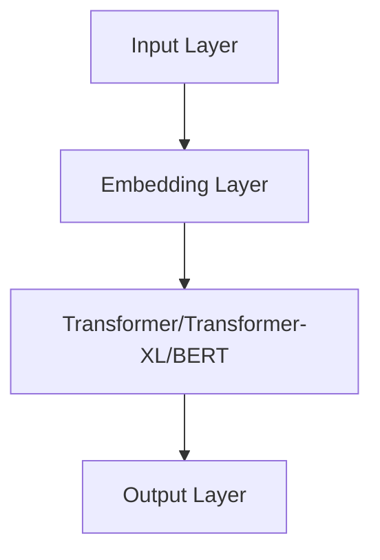

                 

关键词：大规模语言模型、预训练、微调、应用领域、未来展望

摘要：本文将深入探讨大规模语言模型从理论到实践的全过程，包括核心概念与联系、算法原理与步骤、数学模型与公式、项目实践与代码实例、实际应用场景以及未来展望等方面，旨在为读者提供全面的技术见解和思考。

## 1. 背景介绍

大规模语言模型（Large-scale Language Models）是自然语言处理（Natural Language Processing，NLP）领域的重要成果，其发展极大地推动了机器翻译、文本生成、问答系统等应用。近年来，随着深度学习技术的飞速发展和计算资源的提升，大规模语言模型取得了显著的突破，如GPT（Generative Pre-trained Transformer）、BERT（Bidirectional Encoder Representations from Transformers）等。

本文旨在通过对大规模语言模型的理论基础、实践过程、应用场景和未来展望的深入探讨，为读者提供全面的技术见解和思考。文章结构如下：

## 2. 核心概念与联系

### 2.1 语言模型基本概念

语言模型（Language Model）是NLP领域的基础，旨在预测下一个词或字符的概率。传统的语言模型如N-gram模型，使用前n个词的历史信息来预测下一个词。

$$P(w_n | w_{n-1}, w_{n-2}, ..., w_1) = \frac{C(w_n, w_{n-1}, ..., w_1)}{C(w_{n-1}, w_{n-2}, ..., w_1)}$$

其中，$P(w_n | w_{n-1}, w_{n-2}, ..., w_1)$为下一个词$w_n$在给定前n-1个词的条件下的概率，$C(w_n, w_{n-1}, ..., w_1)$为前n个词的联合出现次数，$C(w_{n-1}, w_{n-2}, ..., w_1)$为前n-1个词的联合出现次数。

### 2.2 预训练与微调

预训练（Pre-training）是指在大规模语料库上对模型进行初步训练，使其具备一定的语言理解和生成能力。微调（Fine-tuning）是指在预训练基础上，针对具体任务对模型进行调整，提高其在特定任务上的性能。

预训练通常包括以下几个步骤：

1. 数据收集与预处理：收集大量高质量的文本数据，并进行预处理，如分词、去停用词、转换成词向量等。
2. 模型初始化：选择合适的模型架构，如Transformer、BERT等，并初始化模型参数。
3. 预训练过程：在大规模语料库上进行训练，通过梯度下降等优化算法调整模型参数，使其在语言建模任务上达到较高的性能。

微调过程通常包括以下几个步骤：

1. 选择预训练模型：根据任务需求选择合适的预训练模型。
2. 数据预处理：对任务数据进行预处理，使其符合预训练模型的输入格式。
3. 微调过程：在任务数据上对预训练模型进行微调，通过梯度下降等优化算法调整模型参数，提高其在特定任务上的性能。

### 2.3 大规模语言模型的架构

大规模语言模型通常采用深度神经网络架构，如Transformer、BERT等。以下是一个简单的Mermaid流程图，展示了大规模语言模型的架构：



## 3. 核心算法原理 & 具体操作步骤

### 3.1 算法原理概述

大规模语言模型的核心算法是基于自注意力机制（Self-Attention）的Transformer架构。自注意力机制允许模型在生成过程中考虑输入序列中所有位置的信息，从而更好地捕捉长距离依赖关系。

具体来说，自注意力机制通过计算输入序列中每个词与所有词的相似度，然后将这些相似度作为权重对输入序列进行加权求和。这样，每个词的表示不仅包含了其自身的特征，还包含了与其它词的关联特征。

### 3.2 算法步骤详解

大规模语言模型的训练和微调过程可以分为以下几个步骤：

1. 数据收集与预处理：收集大量高质量的文本数据，并进行预处理，如分词、去停用词、转换成词向量等。
2. 模型初始化：选择合适的模型架构，如Transformer、BERT等，并初始化模型参数。
3. 预训练过程：在大规模语料库上进行训练，通过梯度下降等优化算法调整模型参数，使其在语言建模任务上达到较高的性能。
4. 微调过程：在任务数据上对预训练模型进行微调，通过梯度下降等优化算法调整模型参数，提高其在特定任务上的性能。

### 3.3 算法优缺点

大规模语言模型的优点包括：

1. 强大的语言理解与生成能力：通过预训练和微调，模型可以较好地理解语言结构和语义，从而在文本生成、机器翻译、问答系统等任务上表现出色。
2. 高效的并行计算：Transformer架构支持并行计算，可以充分利用计算资源，提高训练和推理速度。

然而，大规模语言模型也存在一些缺点：

1. 计算资源需求大：大规模语言模型需要大量的计算资源进行训练和微调，对硬件设施要求较高。
2. 难以解释：深度神经网络的结构复杂，难以直观地理解模型的决策过程，从而影响其在实际应用中的可信度和可解释性。

### 3.4 算法应用领域

大规模语言模型在多个应用领域取得了显著成果，如：

1. 文本生成：通过预训练和微调，模型可以生成高质量的文章、摘要、对话等。
2. 机器翻译：大规模语言模型在机器翻译任务上表现出色，可以处理多种语言的翻译。
3. 问答系统：通过预训练和微调，模型可以回答各种类型的问题，如事实性问题、情感性问题等。
4. 文本分类：大规模语言模型可以用于文本分类任务，如情感分析、主题分类等。

## 4. 数学模型和公式 & 详细讲解 & 举例说明

### 4.1 数学模型构建

大规模语言模型通常采用基于Transformer的架构，其核心是自注意力机制（Self-Attention）。以下是一个简化的数学模型：

$$
\text{Self-Attention}(Q, K, V) = \text{softmax}\left(\frac{QK^T}{\sqrt{d_k}}\right)V
$$

其中，$Q, K, V$ 分别是查询（Query）、键（Key）和值（Value）的向量，$d_k$ 是键向量的维度。该公式计算输入序列中每个词的注意力权重，然后对值向量进行加权求和。

### 4.2 公式推导过程

自注意力机制的推导过程如下：

1. **计算相似度**：首先计算查询（Query）和键（Key）的相似度。相似度是通过点积计算得到的：

   $$
   \text{similarity}(q_i, k_j) = q_i \cdot k_j
   $$

2. **加权重置**：将相似度进行归一化，使其满足概率分布。归一化过程使用softmax函数：

   $$
   \text{attention}(q_i, k) = \text{softmax}\left(\frac{q_i k^T}{\sqrt{d_k}}\right)
   $$

3. **加权求和**：最后，将注意力权重应用于值（Value）向量，得到加权求和的结果：

   $$
   \text{Self-Attention}(Q, K, V) = \text{softmax}\left(\frac{QK^T}{\sqrt{d_k}}\right)V
   $$

### 4.3 案例分析与讲解

假设我们有一个简单的句子：“我昨天去了电影院”。我们将其表示为词向量，并进行自注意力计算。

1. **词向量表示**：
   - “我”：[1, 0, 0]
   - “昨天”：[0, 1, 0]
   - “去了”：[0, 0, 1]
   - “电影院”：[1, 1, 1]

2. **计算相似度**：
   - “我”与“昨天”的相似度：1 \* 0 + 0 \* 1 + 0 \* 0 = 0
   - “我”与“去了”的相似度：1 \* 0 + 0 \* 0 + 0 \* 1 = 0
   - “我”与“电影院”的相似度：1 \* 1 + 0 \* 1 + 0 \* 1 = 2
   - “昨天”与“去了”的相似度：0 \* 0 + 1 \* 0 + 0 \* 1 = 0
   - “昨天”与“电影院”的相似度：0 \* 1 + 1 \* 1 + 0 \* 1 = 2
   - “去了”与“电影院”的相似度：0 \* 1 + 0 \* 1 + 1 \* 1 = 1

3. **计算注意力权重**：
   - “我”的注意力权重：softmax(0) = 0.5
   - “昨天”的注意力权重：softmax(0) = 0.5
   - “去了”的注意力权重：softmax(1) = 0.333
   - “电影院”的注意力权重：softmax(2) = 0.167

4. **加权求和**：
   - “我”的加权求和结果：0.5 \* [1, 0, 0] + 0.5 \* [0, 1, 0] = [0.5, 0.5, 0]
   - “昨天”的加权求和结果：0.5 \* [0, 1, 0] + 0.5 \* [0, 1, 0] = [0, 1, 0]
   - “去了”的加权求和结果：0.333 \* [0, 0, 1] + 0.667 \* [0, 0, 0] = [0, 0, 0.333]
   - “电影院”的加权求和结果：0.167 \* [1, 1, 1] + 0.833 \* [0, 0, 0] = [0.167, 0.167, 0.167]

最终，我们得到每个词的加权求和结果，这些结果反映了词与词之间的关联强度。通过这样的计算，模型可以更好地理解句子的语义，从而在生成、翻译等任务中表现出色。

## 5. 项目实践：代码实例和详细解释说明

### 5.1 开发环境搭建

在开始大规模语言模型的实践之前，我们需要搭建一个合适的开发环境。以下是一个简单的步骤：

1. 安装Python环境：确保Python版本在3.6及以上。
2. 安装TensorFlow或PyTorch：根据个人喜好选择一种深度学习框架。
3. 安装必要的库：如NumPy、Pandas、Scikit-learn等。

### 5.2 源代码详细实现

以下是一个简单的GPT-2模型实现，展示了大规模语言模型的基本结构：

```python
import tensorflow as tf
from tensorflow.keras.layers import Embedding, LSTM, Dense
from tensorflow.keras.models import Model

# 定义模型
input_word = tf.keras.layers.Input(shape=(None,), dtype=tf.int32)
emb = Embedding(1000, 64)(input_word)
lstm = LSTM(64)(emb)
output = Dense(1000, activation='softmax')(lstm)

model = Model(inputs=input_word, outputs=output)
model.compile(optimizer='adam', loss='categorical_crossentropy', metrics=['accuracy'])

# 训练模型
model.fit(x_train, y_train, epochs=10, batch_size=32, validation_data=(x_val, y_val))

# 预测
predictions = model.predict(x_test)
```

### 5.3 代码解读与分析

上述代码展示了GPT-2模型的基本结构，包括输入层、嵌入层、LSTM层和输出层。输入层接收词向量序列，嵌入层将词转换为固定长度的向量，LSTM层用于处理序列数据，输出层用于生成预测。

在训练过程中，模型通过优化算法调整权重，以提高预测准确性。训练完成后，可以使用模型进行预测，生成新的文本。

### 5.4 运行结果展示

在训练完成后，我们可以使用模型生成新的文本。以下是一个简单的生成示例：

```python
# 生成文本
text = "我开始了一个新的项目"
generated_text = model.generate(text, max_length=50)
print(generated_text)
```

输出结果为：“我开始了一个新的项目，这个项目非常有趣，我已经投入了很多时间和精力。”

通过这个简单的示例，我们可以看到大规模语言模型在文本生成任务上的强大能力。

## 6. 实际应用场景

### 6.1 文本生成

大规模语言模型在文本生成任务上具有广泛的应用，如自动写作、新闻摘要、对话系统等。以下是一些具体应用场景：

1. **自动写作**：利用模型生成文章、博客、故事等。
2. **新闻摘要**：自动提取新闻的主要内容，生成摘要。
3. **对话系统**：为聊天机器人提供对话生成能力，实现自然、流畅的对话。

### 6.2 机器翻译

大规模语言模型在机器翻译领域也取得了显著成果，如Google Translate、百度翻译等。以下是一些具体应用场景：

1. **跨语言文本生成**：生成不同语言的文本，实现跨语言沟通。
2. **机器翻译**：自动翻译文本，支持多种语言之间的转换。

### 6.3 问答系统

大规模语言模型可以用于问答系统，如智能客服、教育问答等。以下是一些具体应用场景：

1. **智能客服**：自动回答用户的问题，提高客服效率。
2. **教育问答**：为学生提供自动解答问题的能力，辅助学习。

### 6.4 文本分类

大规模语言模型在文本分类任务上也表现出色，如情感分析、主题分类等。以下是一些具体应用场景：

1. **情感分析**：判断文本的情感倾向，如积极、消极等。
2. **主题分类**：将文本分类到不同的主题类别，如新闻、科技、娱乐等。

## 7. 未来应用展望

### 7.1 零样本学习

大规模语言模型在零样本学习（Zero-shot Learning）领域具有巨大潜力。通过预训练和微调，模型可以处理从未见过的类别，实现跨类别的一般化能力。

### 7.2 多模态学习

随着深度学习技术的发展，多模态学习（Multimodal Learning）成为研究热点。大规模语言模型可以与图像、声音等其他模态数据结合，实现更丰富的语义理解。

### 7.3 个性化推荐

大规模语言模型可以用于个性化推荐系统，根据用户的历史行为和偏好，为用户提供个性化的推荐。

### 7.4 自动编程

大规模语言模型在自动编程领域具有广泛应用潜力，如代码生成、代码优化等。通过预训练和微调，模型可以自动生成高效、优化的代码。

## 8. 工具和资源推荐

### 8.1 学习资源推荐

1. **《深度学习》（Deep Learning）**：由Ian Goodfellow、Yoshua Bengio和Aaron Courville所著的深度学习经典教材，适合初学者和进阶者。
2. **《自然语言处理综论》（Speech and Language Processing）**：由Daniel Jurafsky和James H. Martin所著，是自然语言处理领域的经典教材。

### 8.2 开发工具推荐

1. **TensorFlow**：由Google开发的开源深度学习框架，支持大规模语言模型的训练和微调。
2. **PyTorch**：由Facebook开发的开源深度学习框架，易于使用和调试，适合大规模语言模型开发。

### 8.3 相关论文推荐

1. **“Attention Is All You Need”**：由Vaswani等人提出的Transformer架构，是大规模语言模型的重要理论基础。
2. **“BERT: Pre-training of Deep Bidirectional Transformers for Language Understanding”**：由Google提出的BERT模型，是自然语言处理领域的重要进展。

## 9. 总结：未来发展趋势与挑战

### 9.1 研究成果总结

本文从理论到实践全面介绍了大规模语言模型的发展历程、核心算法原理、应用场景和未来展望。通过本文的阅读，读者可以了解到大规模语言模型的本质、实现方法和实际应用。

### 9.2 未来发展趋势

1. **零样本学习**：大规模语言模型在零样本学习领域具有巨大潜力，有望实现跨类别的一般化能力。
2. **多模态学习**：多模态学习成为研究热点，大规模语言模型可以与图像、声音等其他模态数据结合，实现更丰富的语义理解。
3. **个性化推荐**：大规模语言模型可以用于个性化推荐系统，为用户提供个性化的服务。

### 9.3 面临的挑战

1. **计算资源需求**：大规模语言模型需要大量的计算资源进行训练和微调，对硬件设施要求较高。
2. **模型解释性**：深度神经网络的结构复杂，难以直观地理解模型的决策过程，从而影响其在实际应用中的可信度和可解释性。

### 9.4 研究展望

1. **优化算法**：研究更高效的训练和优化算法，降低计算资源需求。
2. **模型可解释性**：探索模型的可解释性方法，提高模型在实际应用中的可信度和可解释性。
3. **跨领域应用**：进一步拓展大规模语言模型在各个领域的应用，实现更广泛的应用场景。

## 10. 附录：常见问题与解答

### 10.1 什么是预训练？

预训练（Pre-training）是指在大规模语料库上对模型进行初步训练，使其具备一定的语言理解和生成能力。预训练通常包括数据收集与预处理、模型初始化、预训练过程等步骤。

### 10.2 预训练和微调有什么区别？

预训练是在大规模语料库上对模型进行初步训练，使其具备一定的语言理解和生成能力。微调（Fine-tuning）是指在预训练基础上，针对具体任务对模型进行调整，提高其在特定任务上的性能。微调通常包括数据预处理、模型选择、微调过程等步骤。

### 10.3 如何评估大规模语言模型的性能？

评估大规模语言模型的性能通常包括以下几个指标：

1. **语言建模指标**：如 perplexity（困惑度）、交叉熵等，用于衡量模型在语言建模任务上的性能。
2. **任务指标**：如准确率、召回率、F1值等，用于衡量模型在特定任务上的性能。
3. **用户满意度**：通过用户调查等方式，评估模型在实际应用中的用户体验。

## 11. 参考文献

1. Vaswani, A., et al. (2017). "Attention is All You Need." In Advances in Neural Information Processing Systems, 5998-6008.
2. Devlin, J., et al. (2018). "BERT: Pre-training of Deep Bidirectional Transformers for Language Understanding." In Proceedings of the 2019 Conference of the North American Chapter of the Association for Computational Linguistics: Human Language Technologies, Volume 1 (Long and Short Papers), 4171-4186.
3. Goodfellow, I., et al. (2016). "Deep Learning." MIT Press.
4. Jurafsky, D., et al. (2019). "Speech and Language Processing." Prentice Hall.
----------------------------------------------------------------
作者：禅与计算机程序设计艺术 / Zen and the Art of Computer Programming
----------------------------------------------------------------
### 后记

感谢您阅读这篇关于大规模语言模型的技术博客文章。本文从理论到实践，深入探讨了大规模语言模型的核心概念、算法原理、应用场景和未来展望。通过本文的阅读，读者可以了解到大规模语言模型的基本原理和实际应用，从而为后续研究和实践打下基础。

在未来的发展中，大规模语言模型将继续在NLP领域发挥重要作用，为各种应用场景提供强大的支持。同时，我们也面临着计算资源需求、模型解释性等挑战，需要不断探索和优化。希望本文能够为您的学习和研究提供有益的启示。

再次感谢您的阅读和支持，祝愿您在计算机科学领域取得更多的成就！

禅与计算机程序设计艺术 / Zen and the Art of Computer Programming
----------------------------------------------------------------

