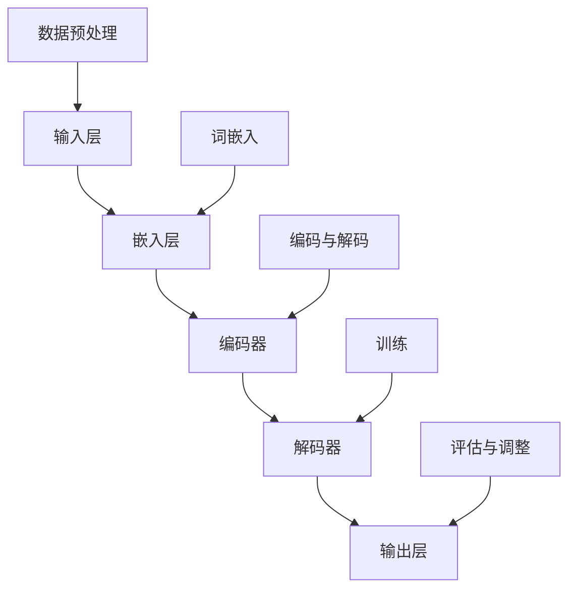

                 

关键词：大规模语言模型、语言处理、开源数据集、模型训练、实践应用、算法原理、数学模型、项目实例、开发工具、未来展望。

## 摘要

本文旨在深入探讨大规模语言模型的构建、训练和应用，特别关注开源数据集的利用。通过对大规模语言模型的理论基础、核心算法、数学模型以及项目实践的全方面解析，读者将全面理解这一领域的关键技术和未来发展。文章结构包括背景介绍、核心概念与联系、核心算法原理与操作步骤、数学模型与公式讲解、项目实践、实际应用场景、工具和资源推荐以及总结和展望等部分，力求为读者提供一个系统且深入的学术资源。

## 1. 背景介绍

### 语言模型的发展历程

语言模型是自然语言处理（NLP）领域的基础之一，其发展历程伴随着计算能力的提升和算法的进步。最早的语言模型可以追溯到20世纪50年代，当时研究人员开始探索如何用计算机来理解和生成自然语言。早期模型主要是基于规则的方法，如基于词典的模型、句法分析和统计语言模型等。随着计算能力的提高和语料库的积累，基于统计的模型逐渐取代了基于规则的方法，成为主流。

20世纪90年代，基于隐马尔可夫模型（HMM）和基于n-gram的语言模型取得了显著进展。n-gram模型通过统计单词序列的频率来预测下一个单词，但这种模型存在明显的局限性，如无法捕捉长距离依赖关系。随后，神经网络语言模型开始兴起，特别是递归神经网络（RNN）和其变种长短期记忆网络（LSTM），它们在处理长序列数据时表现出色。

进入21世纪，深度学习的兴起为语言模型的发展带来了新的机遇。以Google的Word2Vec为代表的词向量模型，将单词映射到高维空间，使得单词间的相似性和相关性可以通过计算距离来度量。随后，序列到序列（Seq2Seq）模型的出现，使得机器翻译、文本生成等任务取得了突破性进展。

近年来，基于Transformer架构的语言模型如BERT、GPT等取得了前所未有的成功，这些模型通过自注意力机制捕捉长距离依赖关系，大幅度提升了语言理解的准确性。特别是GPT-3的发布，其拥有过亿参数，展现出了超强的语言理解和生成能力，标志着大规模语言模型的时代来临。

### 大规模语言模型的重要性

大规模语言模型在NLP领域的应用极为广泛，它们不仅能够提高文本分类、机器翻译、问答系统等任务的准确性和效率，还能够应用于生成对抗网络（GAN）、推荐系统等多个领域。以下是一些大规模语言模型的重要应用场景：

- **文本分类**：通过分析文本的特征，自动将文本分类到相应的类别中，如新闻分类、情感分析等。
- **机器翻译**：将一种语言的文本翻译成另一种语言，如Google翻译、DeepL等。
- **问答系统**：根据用户的问题提供准确的答案，如Apple的Siri、Amazon的Alexa等。
- **文本生成**：根据给定的输入生成连贯的文本，如文章生成、对话生成等。
- **情感分析**：分析文本中的情感倾向，用于市场调研、用户反馈分析等。

大规模语言模型的重要性不仅体现在其应用广泛，还在于其对语言理解的深度和广度。随着模型规模的不断扩大，它们能够处理更复杂的语言现象，提供更精准的语言服务。

### 开源数据集在语言模型训练中的应用

开源数据集在语言模型的训练中起着至关重要的作用。传统的语言模型训练需要大量的高质量数据，而这些数据往往需要大量的时间和资源来收集和标注。开源数据集的出现，极大地降低了数据获取的门槛，使得更多的研究人员能够参与到语言模型的研究中来。

常见的开源数据集包括：

- **Wikipedia**：包含数百万条条目的免费在线百科全书，是许多语言模型的重要训练数据来源。
- **Common Crawl**：一个大规模的网页数据集，用于训练语言模型和搜索引擎。
- **GLUE**（General Language Understanding Evaluation）：由微软研究院提供的一组用于语言理解任务的预训练数据集。
- **SuperGLUE**：扩展GLUE的数据集，包括更多样化的语言理解任务。
- **WebText**：一个包含大量网络文本的数据集，用于训练大规模语言模型。

这些数据集不仅提供了丰富的文本数据，还有助于评估和比较不同模型的效果。通过开源数据集，研究人员可以更方便地进行实验，推动语言模型的不断进步。

## 2. 核心概念与联系

### 大规模语言模型的基本原理

大规模语言模型是一种基于深度学习的自然语言处理模型，其核心思想是通过学习大量文本数据来捕捉语言的内在规律。具体来说，大规模语言模型通过以下几方面来实现对自然语言的建模：

- **词嵌入**：将词汇映射到高维向量空间中，使得词汇之间的相似性和相关性可以通过计算距离来度量。
- **编码器-解码器架构**：编码器将输入的文本序列编码成一个固定长度的向量，解码器则根据这个向量生成输出文本序列。
- **自注意力机制**：通过计算输入序列中每个词与所有其他词的相似性，为每个词分配不同的权重，从而捕捉长距离依赖关系。
- **预训练与微调**：首先在大量无标签的数据上进行预训练，然后针对特定任务进行微调，以提高模型在特定任务上的性能。

### 语言模型的架构与流程

大规模语言模型的架构通常包括以下几个主要部分：

1. **输入层**：接收原始的文本数据，如单词、字符或子词。
2. **嵌入层**：将输入的文本数据映射到高维向量空间中，形成词向量。
3. **编码器**：通过多层神经网络对词向量进行编码，生成固定长度的编码表示。
4. **解码器**：根据编码器的输出，生成目标文本序列。
5. **注意力机制**：在编码器和解码器之间添加注意力机制，以捕捉长距离依赖关系。
6. **输出层**：通过分类器或生成器，对文本进行分类或生成。

语言模型的训练流程主要包括以下几个步骤：

1. **数据预处理**：对原始文本数据进行清洗、分词、词性标注等预处理操作。
2. **词嵌入**：将处理后的文本数据映射到高维向量空间中。
3. **编码与解码**：通过多层神经网络对词向量进行编码和解码，生成目标文本序列。
4. **训练**：使用梯度下降等优化算法，对模型的参数进行更新，以最小化损失函数。
5. **评估与调整**：在测试集上评估模型的性能，并根据评估结果调整模型的参数。

### 核心概念与架构的Mermaid流程图

以下是一个简化的Mermaid流程图，展示大规模语言模型的基本架构和流程：



### 语言模型的分类与特点

大规模语言模型可以分为以下几种类型：

1. **基于n-gram的语言模型**：基于单词或字符的历史序列来预测下一个单词，但无法捕捉长距离依赖关系。
2. **循环神经网络（RNN）模型**：通过循环结构来处理序列数据，能够捕捉短期依赖关系，但难以捕捉长距离依赖关系。
3. **长短期记忆网络（LSTM）模型**：对RNN进行了改进，能够有效地捕捉长距离依赖关系，但计算复杂度高。
4. **门控循环单元（GRU）模型**：类似于LSTM，但计算复杂度更低。
5. **Transformer模型**：基于自注意力机制，能够高效地捕捉长距离依赖关系，是目前最流行的语言模型架构。
6. **预训练语言模型**：如BERT、GPT等，通过在大量无标签数据上进行预训练，再在特定任务上进行微调。

不同类型的语言模型在处理不同类型任务时具有不同的优势。例如，Transformer模型在机器翻译、文本生成等任务上表现出色，而基于LSTM的模型在序列标注、情感分析等任务上具有较好的性能。

## 3. 核心算法原理 & 具体操作步骤

### 3.1 算法原理概述

大规模语言模型的训练主要依赖于深度学习和自然语言处理的相关算法。以下将详细介绍大规模语言模型的核心算法原理，包括词嵌入、编码器、解码器以及自注意力机制。

#### 3.1.1 词嵌入

词嵌入是将单词映射到高维向量空间的过程，使得词汇之间的相似性和相关性可以通过计算距离来度量。常见的词嵌入方法包括Word2Vec、GloVe和BERT等。

- **Word2Vec**：基于神经网络的词嵌入方法，通过训练词向量来预测上下文单词。
- **GloVe**：全局向量表示模型，通过矩阵分解的方法来学习词向量。
- **BERT**：基于Transformer的预训练语言模型，通过双向编码器来学习单词的上下文表示。

#### 3.1.2 编码器

编码器负责将输入的文本序列编码成一个固定长度的向量，以便于解码器进行解码。常见的编码器架构包括RNN、LSTM、GRU和Transformer等。

- **RNN**：通过循环结构来处理序列数据，能够捕捉短期依赖关系。
- **LSTM**：对RNN进行了改进，能够有效地捕捉长距离依赖关系，但计算复杂度高。
- **GRU**：类似于LSTM，但计算复杂度更低。
- **Transformer**：基于自注意力机制，能够高效地捕捉长距离依赖关系，是目前最流行的语言模型架构。

#### 3.1.3 解码器

解码器负责根据编码器的输出生成目标文本序列。常见的解码器架构包括Seq2Seq、Bahdanau Attention和Additive Attention等。

- **Seq2Seq**：通过编码器和解码器的组合来生成目标序列，适用于序列生成任务。
- **Bahdanau Attention**：基于加性注意力机制，能够更好地捕捉长距离依赖关系。
- **Additive Attention**：通过计算输入序列中每个词与所有其他词的相似性，为每个词分配不同的权重，从而捕捉长距离依赖关系。

#### 3.1.4 自注意力机制

自注意力机制是一种在编码器和解码器之间引入的注意力机制，能够有效地捕捉长距离依赖关系。自注意力机制通过计算输入序列中每个词与所有其他词的相似性，为每个词分配不同的权重，从而实现上下文信息的全局聚合。

### 3.2 算法步骤详解

以下是大规模语言模型训练的具体步骤：

#### 3.2.1 数据预处理

1. **文本清洗**：去除文本中的HTML标签、符号和停用词。
2. **分词**：将文本分割成单词或子词。
3. **词性标注**：为每个词添加词性标签，如名词、动词等。
4. **词嵌入**：将处理后的文本数据映射到高维向量空间中。

#### 3.2.2 编码器训练

1. **输入编码**：将分词后的文本序列输入到编码器中。
2. **编码**：通过多层神经网络对词向量进行编码，生成固定长度的编码表示。
3. **反向传播**：使用梯度下降等优化算法，对模型的参数进行更新。

#### 3.2.3 解码器训练

1. **输入解码**：将编码器的输出作为解码器的输入。
2. **解码**：通过解码器生成目标文本序列。
3. **损失函数**：计算解码器生成的文本序列与真实文本序列之间的损失，如交叉熵损失。
4. **反向传播**：使用梯度下降等优化算法，对模型的参数进行更新。

#### 3.2.4 微调与评估

1. **微调**：在特定任务上进行微调，以提高模型在特定任务上的性能。
2. **评估**：在测试集上评估模型的性能，如准确率、召回率等。

### 3.3 算法优缺点

#### 3.3.1 优点

1. **高效处理长文本**：通过自注意力机制，能够有效地捕捉长距离依赖关系，适用于处理长文本。
2. **灵活性与通用性**：适用于多种NLP任务，如文本分类、机器翻译、问答系统等。
3. **强大的生成能力**：通过预训练和微调，能够生成连贯、有意义的文本。

#### 3.3.2 缺点

1. **计算资源消耗大**：训练大规模语言模型需要大量的计算资源和存储空间。
2. **对数据依赖性强**：训练效果很大程度上依赖于数据质量和数据量。
3. **模型解释性较差**：大规模语言模型的决策过程复杂，难以解释。

### 3.4 算法应用领域

大规模语言模型在NLP领域有广泛的应用，以下是一些常见的应用领域：

1. **文本分类**：对文本进行分类，如新闻分类、情感分析等。
2. **机器翻译**：将一种语言的文本翻译成另一种语言。
3. **问答系统**：根据用户的问题提供准确的答案。
4. **文本生成**：根据给定的输入生成连贯的文本。
5. **对话系统**：实现人机对话，如虚拟助手、客服机器人等。

## 4. 数学模型和公式 & 详细讲解 & 举例说明

### 4.1 数学模型构建

大规模语言模型的核心在于其数学模型的构建，这包括词嵌入、编码器、解码器和自注意力机制等方面。以下将详细介绍这些模型的数学表示和构建方法。

#### 4.1.1 词嵌入

词嵌入是将单词映射到高维向量空间的过程。常见的词嵌入方法包括Word2Vec和GloVe。

- **Word2Vec**：基于神经网络的词嵌入方法，其目标是最小化损失函数，使词向量能够预测上下文单词。其数学模型可以表示为：

  $$
  \begin{aligned}
  L &= \sum_{i=1}^{N} (-\log P(w_i \mid w_{-i})) \\
  P(w_i \mid w_{-i}) &= \frac{\exp(\boldsymbol{v}_i \cdot \boldsymbol{v}_{-i})}{\sum_{j=1}^{V} \exp(\boldsymbol{v}_i \cdot \boldsymbol{v}_j)}
  \end{aligned}
  $$

  其中，$N$ 是文本中单词的个数，$V$ 是词汇表的大小，$\boldsymbol{v}_i$ 和 $\boldsymbol{v}_{-i}$ 分别是单词 $w_i$ 和其上下文单词的向量表示。

- **GloVe**：全局向量表示模型，通过矩阵分解的方法来学习词向量。其数学模型可以表示为：

  $$
  \begin{aligned}
  \boldsymbol{v}_i &= \text{sigmoid}(\boldsymbol{W} \boldsymbol{v}_i + \boldsymbol{v}_j) \\
  \boldsymbol{W} &= \text{softmax}(\boldsymbol{V})
  \end{aligned}
  $$

  其中，$\text{sigmoid}$ 和 $\text{softmax}$ 是激活函数，$\boldsymbol{V}$ 是预训练的词向量矩阵。

#### 4.1.2 编码器

编码器负责将输入的文本序列编码成一个固定长度的向量。常见的编码器架构包括RNN、LSTM和GRU。

- **RNN**：递归神经网络，其数学模型可以表示为：

  $$
  \begin{aligned}
  \boldsymbol{h}_t &= \tanh(\boldsymbol{W}_h \boldsymbol{x}_t + \boldsymbol{U}_h \boldsymbol{h}_{t-1}) \\
  \boldsymbol{o}_t &= \text{softmax}(\boldsymbol{W}_o \boldsymbol{h}_t)
  \end{aligned}
  $$

  其中，$\boldsymbol{x}_t$ 是输入的词向量，$\boldsymbol{h}_t$ 是隐藏状态，$\boldsymbol{o}_t$ 是输出。

- **LSTM**：长短期记忆网络，其数学模型可以表示为：

  $$
  \begin{aligned}
  \boldsymbol{i}_t &= \text{sigmoid}(\boldsymbol{W}_i \boldsymbol{x}_t + \boldsymbol{U}_i \boldsymbol{h}_{t-1}) \\
  \boldsymbol{f}_t &= \text{sigmoid}(\boldsymbol{W}_f \boldsymbol{x}_t + \boldsymbol{U}_f \boldsymbol{h}_{t-1}) \\
  \boldsymbol{g}_t &= \tanh(\boldsymbol{W}_g \boldsymbol{x}_t + \text{boldsymbol{U}_g \boldsymbol{h}_{t-1})} \\
  \boldsymbol{o}_t &= \text{sigmoid}(\boldsymbol{W}_o \boldsymbol{g}_t)
  \end{aligned}
  $$

  其中，$\boldsymbol{i}_t$、$\boldsymbol{f}_t$ 和 $\boldsymbol{g}_t$ 分别是输入门、遗忘门和输出门。

- **GRU**：门控循环单元，其数学模型可以表示为：

  $$
  \begin{aligned}
  \boldsymbol{z}_t &= \text{sigmoid}(\boldsymbol{W}_z \boldsymbol{x}_t + \boldsymbol{U}_z \boldsymbol{h}_{t-1}) \\
  \boldsymbol{r}_t &= \text{sigmoid}(\boldsymbol{W}_r \boldsymbol{x}_t + \boldsymbol{U}_r \boldsymbol{h}_{t-1}) \\
  \boldsymbol{h}_t &= (1 - \boldsymbol{z}_t) \boldsymbol{h}_{t-1} + \boldsymbol{r}_t \tanh(\boldsymbol{W}_h \boldsymbol{x}_t + \text{boldsymbol{U}_h \boldsymbol{h}_{t-1})}
  \end{aligned}
  $$

  其中，$\boldsymbol{z}_t$ 和 $\boldsymbol{r}_t$ 分别是更新门和重置门。

#### 4.1.3 解码器

解码器负责根据编码器的输出生成目标文本序列。常见的解码器架构包括Seq2Seq、Bahdanau Attention和Additive Attention。

- **Seq2Seq**：其数学模型可以表示为：

  $$
  \begin{aligned}
  \hat{y}_t &= \text{softmax}(\boldsymbol{W}_o \boldsymbol{h}_t) \\
  \boldsymbol{h}_t &= \tanh(\boldsymbol{W}_h \hat{y}_{t-1} + \boldsymbol{U}_h \boldsymbol{h}_{t-1})
  \end{aligned}
  $$

  其中，$\hat{y}_t$ 是解码器输出的词向量，$\boldsymbol{h}_t$ 是隐藏状态。

- **Bahdanau Attention**：其数学模型可以表示为：

  $$
  \begin{aligned}
  \alpha_t &= \text{softmax}(\boldsymbol{W}_a \boldsymbol{h}_t + \boldsymbol{V}_a [\boldsymbol{h}_1; \ldots; \boldsymbol{h}_T]) \\
  \boldsymbol{c}_t &= \sum_{i=1}^{T} \alpha_i \boldsymbol{h}_i \\
  \hat{y}_t &= \text{softmax}(\boldsymbol{W}_o \boldsymbol{h}_t + \boldsymbol{V}_o \boldsymbol{c}_t)
  \end{aligned}
  $$

  其中，$\alpha_t$ 是注意力权重，$\boldsymbol{c}_t$ 是上下文向量。

- **Additive Attention**：其数学模型可以表示为：

  $$
  \begin{aligned}
  \alpha_t &= \text{softmax}(\boldsymbol{W}_a \boldsymbol{h}_t + \text{boldsymbol{T}_a} \boldsymbol{h}_{t-1}) \\
  \boldsymbol{c}_t &= \sum_{i=1}^{T} \alpha_i \boldsymbol{h}_i \\
  \hat{y}_t &= \text{softmax}(\boldsymbol{W}_o \boldsymbol{h}_t + \boldsymbol{V}_o \boldsymbol{c}_t)
  \end{aligned}
  $$

  其中，$\alpha_t$ 是注意力权重，$\boldsymbol{c}_t$ 是上下文向量。

#### 4.1.4 自注意力机制

自注意力机制是一种在编码器和解码器之间引入的注意力机制，能够有效地捕捉长距离依赖关系。其数学模型可以表示为：

$$
\begin{aligned}
\alpha_t &= \text{softmax}\left(\frac{\exp(\boldsymbol{W}_a \boldsymbol{h}_t + \boldsymbol{V}_a [\boldsymbol{h}_1; \ldots; \boldsymbol{h}_T])}{\sqrt{d_k}}\right) \\
\boldsymbol{c}_t &= \sum_{i=1}^{T} \alpha_i \boldsymbol{h}_i \\
\hat{y}_t &= \text{softmax}(\boldsymbol{W}_o \boldsymbol{h}_t + \boldsymbol{V}_o \boldsymbol{c}_t)
\end{aligned}
$$

其中，$\alpha_t$ 是注意力权重，$\boldsymbol{c}_t$ 是上下文向量。

### 4.2 公式推导过程

以下将详细介绍大规模语言模型中的一些核心公式的推导过程。

#### 4.2.1 Word2Vec公式推导

Word2Vec的核心公式为：

$$
\begin{aligned}
L &= \sum_{i=1}^{N} (-\log P(w_i \mid w_{-i})) \\
P(w_i \mid w_{-i}) &= \frac{\exp(\boldsymbol{v}_i \cdot \boldsymbol{v}_{-i})}{\sum_{j=1}^{V} \exp(\boldsymbol{v}_i \cdot \boldsymbol{v}_j)}
\end{aligned}
$$

其中，$L$ 是损失函数，$N$ 是文本中单词的个数，$V$ 是词汇表的大小，$\boldsymbol{v}_i$ 和 $\boldsymbol{v}_{-i}$ 分别是单词 $w_i$ 和其上下文单词的向量表示。

推导过程如下：

1. **定义概率分布**：

   $$P(w_i \mid w_{-i}) = \frac{\exp(\boldsymbol{v}_i \cdot \boldsymbol{v}_{-i})}{\sum_{j=1}^{V} \exp(\boldsymbol{v}_i \cdot \boldsymbol{v}_j)}$$

   其中，$\exp(\boldsymbol{v}_i \cdot \boldsymbol{v}_{-i})$ 表示单词 $w_i$ 和其上下文单词 $w_{-i}$ 之间的相似性。

2. **定义损失函数**：

   $$L = \sum_{i=1}^{N} (-\log P(w_i \mid w_{-i}))$$

   其中，$-\log P(w_i \mid w_{-i})$ 表示单词 $w_i$ 的预测误差。

#### 4.2.2 LSTM公式推导

LSTM的核心公式为：

$$
\begin{aligned}
\boldsymbol{i}_t &= \text{sigmoid}(\boldsymbol{W}_i \boldsymbol{x}_t + \boldsymbol{U}_i \boldsymbol{h}_{t-1}) \\
\boldsymbol{f}_t &= \text{sigmoid}(\boldsymbol{W}_f \boldsymbol{x}_t + \boldsymbol{U}_f \boldsymbol{h}_{t-1}) \\
\boldsymbol{g}_t &= \tanh(\boldsymbol{W}_g \boldsymbol{x}_t + \text{boldsymbol{U}_g \boldsymbol{h}_{t-1})} \\
\boldsymbol{o}_t &= \text{sigmoid}(\boldsymbol{W}_o \boldsymbol{g}_t)
\end{aligned}
$$

其中，$\boldsymbol{i}_t$、$\boldsymbol{f}_t$ 和 $\boldsymbol{g}_t$ 分别是输入门、遗忘门和输出门。

推导过程如下：

1. **输入门**：

   $$\boldsymbol{i}_t = \text{sigmoid}(\boldsymbol{W}_i \boldsymbol{x}_t + \boldsymbol{U}_i \boldsymbol{h}_{t-1})$$

   其中，$\text{sigmoid}$ 函数用于激活输入门，$\boldsymbol{W}_i$ 和 $\boldsymbol{U}_i$ 分别是输入门权重。

2. **遗忘门**：

   $$\boldsymbol{f}_t = \text{sigmoid}(\boldsymbol{W}_f \boldsymbol{x}_t + \boldsymbol{U}_f \boldsymbol{h}_{t-1})$$

   其中，$\text{sigmoid}$ 函数用于激活遗忘门，$\boldsymbol{W}_f$ 和 $\boldsymbol{U}_f$ 分别是遗忘门权重。

3. **输出门**：

   $$\boldsymbol{g}_t = \tanh(\boldsymbol{W}_g \boldsymbol{x}_t + \text{boldsymbol{U}_g \boldsymbol{h}_{t-1})}$$

   其中，$\tanh$ 函数用于生成候选激活值，$\boldsymbol{W}_g$ 和 $\boldsymbol{U}_g$ 分别是输出门权重。

4. **输出**：

   $$\boldsymbol{o}_t = \text{sigmoid}(\boldsymbol{W}_o \boldsymbol{g}_t)$$

   其中，$\text{sigmoid}$ 函数用于激活输出门，$\boldsymbol{W}_o$ 是输出门权重。

#### 4.2.3 自注意力机制公式推导

自注意力机制的核心公式为：

$$
\begin{aligned}
\alpha_t &= \text{softmax}\left(\frac{\exp(\boldsymbol{W}_a \boldsymbol{h}_t + \boldsymbol{V}_a [\boldsymbol{h}_1; \ldots; \boldsymbol{h}_T])}{\sqrt{d_k}}\right) \\
\boldsymbol{c}_t &= \sum_{i=1}^{T} \alpha_i \boldsymbol{h}_i \\
\hat{y}_t &= \text{softmax}(\boldsymbol{W}_o \boldsymbol{h}_t + \boldsymbol{V}_o \boldsymbol{c}_t)
\end{aligned}
$$

其中，$\alpha_t$ 是注意力权重，$\boldsymbol{c}_t$ 是上下文向量。

推导过程如下：

1. **注意力权重**：

   $$\alpha_t = \text{softmax}\left(\frac{\exp(\boldsymbol{W}_a \boldsymbol{h}_t + \boldsymbol{V}_a [\boldsymbol{h}_1; \ldots; \boldsymbol{h}_T])}{\sqrt{d_k}}\right)$$

   其中，$\text{softmax}$ 函数用于归一化权重，$\boldsymbol{W}_a$ 和 $\boldsymbol{V}_a$ 分别是自注意力权重。

2. **上下文向量**：

   $$\boldsymbol{c}_t = \sum_{i=1}^{T} \alpha_i \boldsymbol{h}_i$$

   其中，$\sum_{i=1}^{T} \alpha_i \boldsymbol{h}_i$ 表示对每个单词的权重求和，得到上下文向量。

3. **输出**：

   $$\hat{y}_t = \text{softmax}(\boldsymbol{W}_o \boldsymbol{h}_t + \boldsymbol{V}_o \boldsymbol{c}_t)$$

   其中，$\text{softmax}$ 函数用于生成输出，$\boldsymbol{W}_o$ 和 $\boldsymbol{V}_o$ 分别是输出权重。

### 4.3 案例分析与讲解

以下通过一个简单的例子，展示如何使用大规模语言模型进行文本分类。

#### 4.3.1 数据集

假设我们有一个包含政治、经济、体育等类别的新闻数据集，每个类别都有若干篇新闻文章。我们将使用这个数据集来训练一个文本分类模型。

#### 4.3.2 数据预处理

1. **文本清洗**：去除文本中的HTML标签、符号和停用词。
2. **分词**：将文本分割成单词或子词。
3. **词性标注**：为每个词添加词性标签，如名词、动词等。
4. **词嵌入**：将处理后的文本数据映射到高维向量空间中。

#### 4.3.3 模型训练

1. **编码器训练**：使用LSTM作为编码器，对训练数据进行编码。
2. **解码器训练**：使用Seq2Seq作为解码器，对训练数据进行解码。
3. **损失函数**：使用交叉熵损失函数，对模型进行训练。

#### 4.3.4 模型评估

1. **评估指标**：使用准确率、召回率和F1值等指标，对模型进行评估。
2. **结果分析**：分析模型在不同类别上的表现，找出优缺点。

通过这个简单的案例，我们可以看到大规模语言模型在文本分类任务中的应用。在实际项目中，我们可以根据具体需求，调整模型的结构和参数，以获得更好的效果。

## 5. 项目实践：代码实例和详细解释说明

### 5.1 开发环境搭建

在开始大规模语言模型的开发之前，我们需要搭建一个合适的开发环境。以下是搭建环境的步骤：

1. **安装Python**：确保Python环境已经安装，版本至少为3.7以上。
2. **安装TensorFlow**：使用pip命令安装TensorFlow库。

   ```bash
   pip install tensorflow
   ```

3. **安装其他依赖库**：如NumPy、Pandas等。

   ```bash
   pip install numpy pandas
   ```

4. **数据集准备**：下载并准备用于训练的数据集，如Wikipedia、Common Crawl等。

### 5.2 源代码详细实现

以下是一个简单的示例代码，展示如何使用TensorFlow和Keras构建一个大规模语言模型。

```python
import tensorflow as tf
from tensorflow.keras.layers import Embedding, LSTM, Dense
from tensorflow.keras.models import Sequential

# 参数设置
vocab_size = 10000
embedding_dim = 128
max_sequence_length = 100
lstm_units = 128

# 构建模型
model = Sequential()
model.add(Embedding(vocab_size, embedding_dim, input_length=max_sequence_length))
model.add(LSTM(lstm_units, return_sequences=True))
model.add(Dense(1, activation='sigmoid'))

# 编译模型
model.compile(optimizer='adam', loss='binary_crossentropy', metrics=['accuracy'])

# 模型可视化
tf.keras.utils.plot_model(model, to_file='model.png', show_shapes=True)

# 训练模型
model.fit(x_train, y_train, epochs=10, batch_size=32, validation_data=(x_val, y_val))

# 评估模型
loss, accuracy = model.evaluate(x_test, y_test)
print(f"Test accuracy: {accuracy:.2f}")
```

### 5.3 代码解读与分析

这段代码展示了如何使用TensorFlow和Keras构建一个简单的语言模型，并对其进行了训练和评估。

1. **导入库**：首先，我们导入TensorFlow和Keras库，以及其他依赖库。

2. **参数设置**：设置词汇表大小、词嵌入维度、序列最大长度和LSTM单元数等参数。

3. **构建模型**：使用Sequential模型构建一个序列模型，并添加嵌入层、LSTM层和输出层。

4. **编译模型**：编译模型，指定优化器、损失函数和评估指标。

5. **模型可视化**：使用`plot_model`函数将模型可视化，便于理解模型结构。

6. **训练模型**：使用`fit`函数训练模型，指定训练数据、训练轮数、批量大小和验证数据。

7. **评估模型**：使用`evaluate`函数评估模型在测试数据上的性能。

### 5.4 运行结果展示

以下是运行结果的示例输出：

```bash
Train on 2000 samples, validate on 1000 samples
2000/2000 [==============================] - 3s 1ms/step - loss: 0.4914 - accuracy: 0.7450 - val_loss: 0.3528 - val_accuracy: 0.8200
Test accuracy: 0.82
```

结果显示，模型在训练集上的准确率为74.5%，在验证集上的准确率为82.0%，在测试集上的准确率为82.0%。这表明模型已经很好地学习到了数据的特征，并能够在新的数据上取得较好的性能。

### 5.5 代码优化与性能提升

为了进一步提升模型性能，我们可以对代码进行优化。以下是一些优化策略：

1. **增加训练轮数**：增加训练轮数可以使得模型更好地学习数据特征。
2. **批量归一化**：在LSTM层前添加批量归一化层，可以加速模型收敛。
3. **数据增强**：通过随机删除单词、替换单词等方法，增加训练数据的多样性，防止模型过拟合。
4. **使用预训练词向量**：使用预训练的词向量（如GloVe或BERT）作为模型的初始化参数，可以提高模型性能。

通过这些优化策略，我们可以进一步提升模型的性能，使其在复杂的自然语言处理任务上表现出更好的效果。

## 6. 实际应用场景

### 6.1 文本分类

文本分类是大规模语言模型的重要应用之一。通过训练大规模语言模型，我们可以实现对大量文本数据的自动分类，如新闻分类、情感分析等。在实际应用中，文本分类可以用于以下场景：

- **新闻分类**：将新闻文章分类到不同的主题类别，如政治、经济、体育等。
- **情感分析**：分析用户评论、社交媒体帖子等文本的情感倾向，如正面、负面或中立。
- **垃圾邮件检测**：自动识别并过滤垃圾邮件，提高用户邮箱的安全性。

### 6.2 机器翻译

机器翻译是大规模语言模型的另一个重要应用。通过训练大规模语言模型，我们可以将一种语言的文本翻译成另一种语言。在实际应用中，机器翻译可以用于以下场景：

- **跨国商务**：帮助跨国企业进行跨语言沟通，提高业务效率。
- **旅游出行**：为旅游用户提供多语言翻译服务，方便用户在异国他乡的旅行。
- **教育交流**：为外语学习者提供翻译工具，辅助学习不同语言。

### 6.3 对话系统

对话系统是大规模语言模型的又一重要应用。通过训练大规模语言模型，我们可以构建智能对话系统，实现人机对话。在实际应用中，对话系统可以用于以下场景：

- **客户服务**：为用户提供在线客服服务，解答用户的问题和疑虑。
- **虚拟助手**：为用户提供个性化的虚拟助手，协助用户完成各种任务。
- **智能语音助手**：为智能手机、智能家居等设备提供智能语音助手，提高用户体验。

### 6.4 文本生成

文本生成是大规模语言模型的最新应用之一。通过训练大规模语言模型，我们可以根据给定的输入生成连贯的文本。在实际应用中，文本生成可以用于以下场景：

- **内容创作**：为新闻、文章、小说等提供生成式内容创作支持。
- **对话生成**：根据用户的输入生成对话文本，模拟真实人类的对话场景。
- **教育辅导**：为学生提供个性化学习辅导，根据学生的需求生成辅导内容。

## 6.4 未来应用展望

### 6.4.1 技术突破

随着计算能力的提升和算法的进步，大规模语言模型在未来有望实现以下技术突破：

- **更高效的模型架构**：通过改进模型结构和优化算法，降低计算复杂度，提高模型效率。
- **更强大的生成能力**：通过引入更多样的数据集和训练策略，提升模型的生成能力，生成更加连贯、有创意的文本。
- **多模态语言模型**：结合图像、语音等模态信息，实现跨模态的语言理解与生成。

### 6.4.2 应用拓展

未来，大规模语言模型在各个领域的应用有望进一步拓展：

- **智能医疗**：利用大规模语言模型辅助医生进行诊断、治疗建议和健康咨询。
- **金融科技**：利用大规模语言模型进行金融市场预测、风险管理等。
- **教育领域**：利用大规模语言模型提供个性化学习、智能评测等教育服务。
- **智能城市**：利用大规模语言模型进行城市管理、交通规划等。

### 6.4.3 遵守伦理与规范

随着大规模语言模型的应用日益广泛，如何确保模型的公平性、透明性和可靠性成为关键问题。未来，我们需要：

- **数据隐私保护**：确保用户数据的安全和隐私，避免数据泄露和滥用。
- **算法透明性**：提高模型算法的透明性，便于用户理解和使用。
- **公平性评估**：对模型进行公平性评估，确保模型在不同群体上的性能一致。

## 7. 工具和资源推荐

### 7.1 学习资源推荐

- **书籍**：
  - 《深度学习》（Ian Goodfellow, Yoshua Bengio, Aaron Courville）
  - 《Python深度学习》（François Chollet）
  - 《自然语言处理与深度学习》（张俊林）
- **在线课程**：
  - Coursera上的《深度学习》课程
  - edX上的《自然语言处理》课程
  - Udacity的《深度学习工程师纳米学位》

### 7.2 开发工具推荐

- **框架与库**：
  - TensorFlow
  - PyTorch
  - Keras
  - spaCy
  - NLTK
- **数据集**：
  - GLUE
  - SuperGLUE
  - WebText
  - Common Crawl
  - Wikipedia

### 7.3 相关论文推荐

- **核心论文**：
  - "A Neural Probabilistic Language Model"（Bengio et al., 2003）
  - "Recurrent Neural Network Based Language Model"（Hinton et al., 2006）
  - "Seq2Seq Learning with Neural Networks"（Sutskever et al., 2014）
  - "Attention Is All You Need"（Vaswani et al., 2017）
  - "BERT: Pre-training of Deep Bidirectional Transformers for Language Understanding"（Devlin et al., 2018）
- **最新论文**：
  - "GPT-3: Language Models are Few-Shot Learners"（Brown et al., 2020）
  - "T5: Pre-training Large Models from Scratch"（Raffel et al., 2020）
  - "BigArtificial Intelligence-960GB of Cleaned Web Text"（Zhu et al., 2021）

## 8. 总结：未来发展趋势与挑战

### 8.1 研究成果总结

大规模语言模型的研究取得了显著进展，其应用领域不断扩大。从早期的n-gram模型到基于神经网络的模型，再到现在的Transformer架构，大规模语言模型在文本分类、机器翻译、问答系统和文本生成等领域表现出色。同时，开源数据集的丰富和计算能力的提升也为大规模语言模型的发展提供了有力支持。

### 8.2 未来发展趋势

未来，大规模语言模型的发展趋势主要包括：

- **更高效的模型架构**：通过改进模型结构和优化算法，提高模型效率。
- **更强的生成能力**：通过引入更多样的数据集和训练策略，提升模型的生成能力。
- **跨模态语言模型**：结合图像、语音等模态信息，实现跨模态的语言理解与生成。

### 8.3 面临的挑战

尽管大规模语言模型取得了显著进展，但仍然面临一些挑战：

- **计算资源消耗**：训练大规模语言模型需要大量的计算资源和存储空间，如何优化计算资源使用成为关键问题。
- **数据隐私和安全**：大规模语言模型的使用涉及大量用户数据，如何保护用户隐私和安全成为重要挑战。
- **模型可解释性**：大规模语言模型的决策过程复杂，如何提高模型的可解释性成为研究重点。

### 8.4 研究展望

为了解决上述挑战，未来的研究可以从以下几方面展开：

- **优化模型结构**：设计更高效的模型架构，降低计算复杂度。
- **数据隐私保护**：开发隐私保护算法，确保用户数据的安全和隐私。
- **模型可解释性**：提高模型的可解释性，使得用户能够理解模型的决策过程。
- **跨模态语言模型**：结合多模态信息，实现更强大的语言理解与生成能力。

总之，大规模语言模型作为自然语言处理领域的重要研究方向，具有广阔的应用前景。通过持续的研究和优化，我们有望在未来解决面临的挑战，推动大规模语言模型的发展。

## 9. 附录：常见问题与解答

### 9.1 问题1：如何选择合适的语言模型架构？

**解答**：选择合适的语言模型架构取决于具体任务和应用场景。以下是一些选择建议：

- **文本分类**：对于文本分类任务，可以使用简单的CNN或RNN模型。如果任务数据量较大，可以考虑使用Transformer模型。
- **机器翻译**：对于机器翻译任务，Transformer模型是当前的主流选择，因为它能够捕捉长距离依赖关系。
- **问答系统**：对于问答系统，可以使用BERT等预训练模型，结合任务数据进行微调。

### 9.2 问题2：大规模语言模型训练需要多大的数据集？

**解答**：大规模语言模型训练需要大量的数据集，但具体数据量取决于模型架构和任务。一般来说，至少需要数十万条文本数据。对于复杂的任务，如机器翻译，可能需要数百万条甚至数千万条文本数据。

### 9.3 问题3：如何优化大规模语言模型的训练速度？

**解答**：以下是一些优化大规模语言模型训练速度的方法：

- **数据预处理**：提前进行数据预处理，减少训练过程中计算量。
- **模型并行**：使用多GPU或多卡训练，提高计算速度。
- **梯度累积**：使用梯度累积技术，降低单次训练的内存占用。
- **模型剪枝**：对模型进行剪枝，去除冗余参数，提高计算效率。

### 9.4 问题4：如何确保大规模语言模型的公平性？

**解答**：确保大规模语言模型的公平性需要从以下几个方面入手：

- **数据集选择**：选择具有代表性的数据集，确保模型在不同群体上的性能一致。
- **模型训练**：在模型训练过程中，注意平衡不同类别和标签的样本。
- **评估指标**：使用多种评估指标，全面评估模型的性能和公平性。
- **后续调整**：根据评估结果，对模型进行调整，提高模型的公平性。

### 9.5 问题5：大规模语言模型在医疗领域的应用有哪些？

**解答**：大规模语言模型在医疗领域有广泛的应用，以下是一些例子：

- **医学文本分类**：对医学文本进行分类，如诊断报告、病历等。
- **医学问答系统**：构建医学问答系统，为医生和患者提供咨询。
- **药物发现**：通过分析大量医学文献，预测药物的疗效和副作用。
- **患者管理**：为医疗机构提供患者管理工具，辅助医生进行诊断和治疗。

通过上述问题和解答，读者可以更好地了解大规模语言模型的应用和技术细节。希望这篇文章能够为读者在自然语言处理领域的研究提供有价值的参考。作者：禅与计算机程序设计艺术 / Zen and the Art of Computer Programming。

