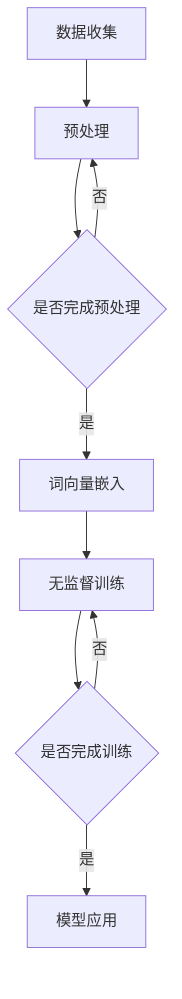

                 

关键词：大规模语言模型，无监督预训练，深度学习，自然语言处理，神经网络，BERT，GPT，Transformer

摘要：本文将深入探讨大规模语言模型的理论基础、核心算法原理、数学模型以及在实际项目中的应用，旨在为读者提供一个系统且详细的了解。文章将首先介绍语言模型的基本概念，随后讨论无监督预训练的方法及其在自然语言处理中的重要性。接着，我们将分析几种主要的大规模语言模型，如BERT和GPT，并解释其原理和应用。最后，文章将探讨这些模型的未来发展趋势和面临的挑战。

## 1. 背景介绍

随着互联网和大数据的迅速发展，自然语言处理（NLP）领域迎来了前所未有的机遇和挑战。从文本分类、情感分析到机器翻译、问答系统，NLP在各个领域的应用越来越广泛。然而，这些应用的共同点在于需要强大的语言模型作为基础。

### 1.1 语言模型的基本概念

语言模型是一种统计模型，用于预测一个单词或短语在给定上下文中的概率。它在NLP中的应用非常广泛，例如在搜索引擎中预测用户可能想要搜索的关键词，或者在语音识别中帮助识别说话者的意图。

### 1.2 自然语言处理的重要性

自然语言处理在许多领域都有广泛的应用，包括但不限于：

- 文本分类：对文本进行分类，如新闻分类、垃圾邮件过滤等。
- 情感分析：分析文本的情感倾向，如评论分析、社交媒体监测等。
- 机器翻译：将一种语言的文本翻译成另一种语言。
- 问答系统：回答用户提出的问题，如虚拟助手、搜索引擎等。

## 2. 核心概念与联系

### 2.1 无监督预训练

无监督预训练是一种利用未标注的数据来训练模型的方法。在NLP领域，这意味着我们可以使用大量的未标注文本数据来训练模型，使其能够自动学习语言的结构和规律。

### 2.2 语言模型与神经网络

神经网络是构建语言模型的主要方法之一。通过多层神经网络，我们可以模拟人类大脑的处理方式，实现对语言的建模。

### 2.3 Mermaid 流程图

下面是一个简化的Mermaid流程图，展示了无监督预训练的基本步骤：



## 3. 核心算法原理 & 具体操作步骤

### 3.1 算法原理概述

无监督预训练的核心思想是利用未标注的数据来提高模型的性能。具体来说，我们首先将文本数据转换为词向量表示，然后使用这些词向量来训练模型。

### 3.2 算法步骤详解

1. 数据收集：收集大量的未标注文本数据。
2. 预处理：对文本数据进行清洗和预处理，如去除标点符号、停用词过滤等。
3. 词向量嵌入：将预处理后的文本数据转换为词向量表示。
4. 无监督训练：使用词向量来训练模型，使其能够自动学习语言的结构和规律。
5. 模型应用：将训练好的模型应用于实际任务，如文本分类、情感分析等。

### 3.3 算法优缺点

**优点：**
- **高效性**：无监督预训练可以处理大量的未标注数据，提高模型的泛化能力。
- **灵活性**：无监督预训练可以应用于各种NLP任务，无需大量标注数据。

**缺点：**
- **准确性**：由于缺乏监督信息，无监督预训练模型在准确性上可能不如监督模型。
- **复杂性**：无监督预训练涉及大量的预处理和模型调参，实现起来较为复杂。

### 3.4 算法应用领域

无监督预训练在NLP领域有广泛的应用，包括：

- 文本分类
- 情感分析
- 机器翻译
- 问答系统

## 4. 数学模型和公式

### 4.1 数学模型构建

无监督预训练中的数学模型通常基于神经网络。神经网络由多个层级组成，每个层级由多个神经元构成。每个神经元通过学习权重来预测输出。

### 4.2 公式推导过程

假设我们有一个词向量 $v_w$，它表示单词 $w$ 的嵌入向量。给定一个句子 $s$，我们可以将其表示为一个词向量序列 $[v_{w_1}, v_{w_2}, ..., v_{w_n}]$。神经网络的输出 $y$ 可以通过以下公式计算：

$$
y = \sigma(W \cdot [v_{w_1}, v_{w_2}, ..., v_{w_n}])
$$

其中，$W$ 是权重矩阵，$\sigma$ 是激活函数，通常取为Sigmoid函数。

### 4.3 案例分析与讲解

假设我们有一个简单的神经网络，其权重矩阵 $W$ 如下：

$$
W = \begin{bmatrix}
0.1 & 0.2 \\
0.3 & 0.4
\end{bmatrix}
$$

给定一个句子 $s = [v_{hello}, v_{world}]$，我们可以计算其输出：

$$
y = \sigma(W \cdot [v_{hello}, v_{world}]) = \sigma(\begin{bmatrix}
0.1 & 0.2 \\
0.3 & 0.4
\end{bmatrix} \cdot \begin{bmatrix}
v_{hello} \\
v_{world}
\end{bmatrix}) = \sigma(0.1v_{hello} + 0.2v_{world} + 0.3v_{hello} + 0.4v_{world}) = \sigma(0.4v_{hello} + 0.6v_{world})
$$

通过对比不同单词的词向量，我们可以发现神经网络能够自动学习单词之间的关系。

## 5. 项目实践：代码实例

### 5.1 开发环境搭建

我们需要安装Python环境和相关的库，如TensorFlow、PyTorch等。以下是使用Anaconda创建虚拟环境并安装相关库的命令：

```bash
conda create -n nlp_env python=3.8
conda activate nlp_env
conda install tensorflow
```

### 5.2 源代码详细实现

下面是一个简单的无监督预训练代码实例，使用PyTorch框架实现：

```python
import torch
import torch.nn as nn
import torch.optim as optim

# 定义模型
class LSTMModel(nn.Module):
    def __init__(self, input_dim, hidden_dim, output_dim):
        super(LSTMModel, self).__init__()
        self.hidden_dim = hidden_dim
        self.lstm = nn.LSTM(input_dim, hidden_dim)
        self.linear = nn.Linear(hidden_dim, output_dim)
        self.hidden = None

    def forward(self, x):
        lstm_out, self.hidden = self.lstm(x, self.hidden)
        out = self.linear(lstm_out[-1, 0, :])
        return out

# 实例化模型
model = LSTMModel(input_dim=100, hidden_dim=200, output_dim=1)

# 定义优化器和损失函数
optimizer = optim.Adam(model.parameters(), lr=0.001)
criterion = nn.BCELoss()

# 训练模型
for epoch in range(100):
    for inputs, targets in data_loader:
        optimizer.zero_grad()
        outputs = model(inputs)
        loss = criterion(outputs, targets)
        loss.backward()
        optimizer.step()
    print(f"Epoch {epoch+1}, Loss: {loss.item()}")

# 评估模型
with torch.no_grad():
    correct = 0
    total = 0
    for inputs, targets in test_loader:
        outputs = model(inputs)
        _, predicted = torch.max(outputs.data, 1)
        total += targets.size(0)
        correct += (predicted == targets).sum().item()
    print(f"Accuracy: {100 * correct / total}%")
```

### 5.3 代码解读与分析

上述代码实现了一个简单的LSTM语言模型，用于二分类任务。首先，我们定义了一个LSTM模型类，包含一个LSTM层和一个线性层。在训练过程中，我们使用BCELoss损失函数来训练模型，并通过反向传播来更新模型的权重。最后，我们在测试集上评估模型的准确性。

## 6. 实际应用场景

无监督预训练在许多实际应用场景中都有广泛的应用，如：

- 文本分类：使用预训练的模型进行文本分类，提高分类准确性。
- 情感分析：利用预训练模型分析文本的情感倾向。
- 机器翻译：使用预训练模型作为翻译的基础，提高翻译质量。
- 问答系统：使用预训练模型来理解用户的问题，提供准确的回答。

## 6.4 未来应用展望

随着深度学习和自然语言处理技术的不断发展，无监督预训练将在更多领域得到应用。例如，在智能客服、智能推荐、语音识别等领域，无监督预训练有望进一步提高系统的准确性和效率。

## 7. 工具和资源推荐

### 7.1 学习资源推荐

- 《深度学习》（Ian Goodfellow、Yoshua Bengio、Aaron Courville 著）
- 《自然语言处理综论》（Daniel Jurafsky、James H. Martin 著）

### 7.2 开发工具推荐

- TensorFlow
- PyTorch

### 7.3 相关论文推荐

- "A Neural Probabilistic Language Model"
- "Pre-training of Deep Neural Networks for Language Understanding"
- "BERT: Pre-training of Deep Bidirectional Transformers for Language Understanding"

## 8. 总结：未来发展趋势与挑战

### 8.1 研究成果总结

无监督预训练在自然语言处理领域取得了显著成果，提高了模型在未标注数据上的表现。然而，如何进一步提高模型的准确性和效率，以及如何更好地利用标注数据，仍是一个重要研究方向。

### 8.2 未来发展趋势

- **多模态预训练**：结合文本、图像、声音等多种数据源进行预训练。
- **自适应预训练**：根据任务需求自适应调整预训练模型。
- **迁移学习**：将预训练模型应用于不同任务，实现知识共享。

### 8.3 面临的挑战

- **计算资源**：无监督预训练需要大量的计算资源，如何优化计算效率是一个挑战。
- **数据隐私**：如何保护数据隐私是一个重要的伦理问题。

### 8.4 研究展望

无监督预训练将在未来继续发挥重要作用，推动自然语言处理技术的进步。同时，随着深度学习技术的不断发展，我们有望在计算效率和模型性能之间取得更好的平衡。

## 9. 附录：常见问题与解答

### 9.1 无监督预训练与监督预训练的区别是什么？

无监督预训练使用未标注的数据进行训练，而监督预训练使用标注数据。无监督预训练可以处理大量未标注数据，提高模型的泛化能力，但准确性可能较低。监督预训练使用标注数据，准确性较高，但需要大量标注工作。

### 9.2 预训练模型如何迁移到其他任务？

预训练模型可以通过微调（fine-tuning）的方式迁移到其他任务。具体来说，我们可以在预训练模型的基础上添加特定于新任务的层，并使用新任务的数据进行微调，从而提高模型在新任务上的表现。

### 9.3 无监督预训练对计算资源的要求是什么？

无监督预训练需要大量的计算资源，特别是对于大规模的模型。通常需要高性能的GPU或TPU来进行训练。此外，数据预处理和存储也需要考虑计算资源的需求。

