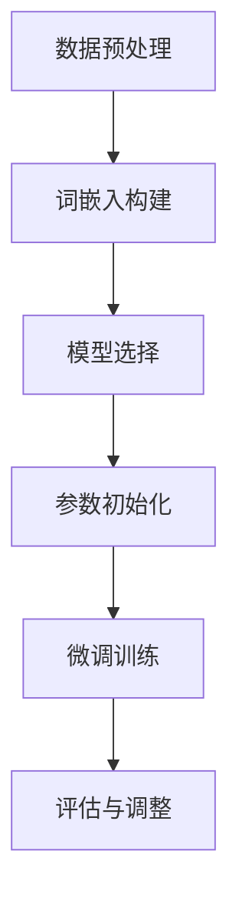

                 

关键词：大规模语言模型、有监督微调、神经网络、自然语言处理、深度学习、数据集、训练、推理

摘要：本文将深入探讨大规模语言模型的构建过程，重点关注有监督微调这一关键环节。从理论到实践，我们将详细阐述语言模型的核心概念、算法原理、数学模型、项目实践以及实际应用场景。通过本文的阅读，读者将全面了解大规模语言模型的技术内涵，为未来研究和应用奠定坚实基础。

## 1. 背景介绍

### 1.1 大规模语言模型的发展历程

随着互联网和大数据时代的到来，自然语言处理（Natural Language Processing, NLP）成为计算机科学领域的一个重要分支。从最初的基于规则的方法，到统计方法，再到近年来迅速崛起的深度学习方法，大规模语言模型的发展经历了多次变革。

1990年代，统计方法开始在NLP领域占据主导地位。基于概率的隐马尔可夫模型（Hidden Markov Model, HMM）和条件随机场（Conditional Random Field, CRF）等模型，为文本分类、信息抽取等任务提供了有效解决方案。

进入21世纪，深度学习技术的突破为NLP带来了新的契机。基于神经网络的模型，如循环神经网络（Recurrent Neural Network, RNN）和长短期记忆网络（Long Short-Term Memory, LSTM），在语言建模和序列标注任务上取得了显著成果。此后，随着计算资源的不断提升和优化算法的涌现，深度学习模型在NLP领域的应用越来越广泛。

近年来，大规模预训练语言模型（如GPT-3、BERT等）的崛起，将NLP推向了新的高度。这些模型通过在大量文本数据上进行预训练，具备了强大的语义理解能力，并在各种NLP任务中取得了卓越的表现。

### 1.2 有监督微调的基本概念

有监督微调（Supervised Fine-Tuning）是大规模语言模型在特定任务中进行优化的常用方法。其基本思想是将预训练模型在特定领域或任务上进行二次训练，从而提高模型在目标任务上的性能。

有监督微调通常包括以下步骤：

1. **数据准备**：收集并处理与目标任务相关的数据集，将其转换为适合模型训练的格式。
2. **模型选择**：选择一个预训练的基座模型（Pre-Trained Model），如GPT、BERT等。
3. **微调**：将基座模型在目标任务上运行，通过梯度下降等方法进行参数优化。
4. **评估与调整**：评估模型在测试集上的性能，并根据需要对模型进行调整。

有监督微调具有以下优点：

- **高效性**：利用预训练模型，可以大大减少训练时间。
- **通用性**：预训练模型在大量通用数据上已经具备了一定的语义理解能力，有助于提高特定任务的性能。
- **可扩展性**：有监督微调方法可以应用于各种不同的NLP任务，如文本分类、问答系统、命名实体识别等。

## 2. 核心概念与联系

### 2.1 大规模语言模型的核心概念

大规模语言模型（Large-scale Language Model）是指通过深度学习技术，在大量文本数据上进行训练，从而构建出的具有强大语义理解能力的模型。其核心概念包括：

- **词嵌入（Word Embedding）**：将词汇映射为低维稠密向量，从而实现文本数据的向量化表示。
- **上下文表示（Contextual Representation）**：通过模型学习，将单词在不同上下文中的含义进行编码，从而实现语义理解。
- **序列建模（Sequence Modeling）**：利用模型预测下一个词的概率，从而实现文本生成和分类等任务。

### 2.2 大规模语言模型的基本架构

大规模语言模型通常采用深度神经网络（Deep Neural Network, DNN）进行构建。其基本架构包括：

- **输入层（Input Layer）**：接收词嵌入向量作为输入。
- **隐藏层（Hidden Layer）**：利用激活函数（如ReLU、Sigmoid等）进行非线性变换。
- **输出层（Output Layer）**：根据任务类型，生成分类概率或生成文本序列。

### 2.3 有监督微调的流程

有监督微调的流程可以分为以下几个步骤：

1. **数据预处理**：对目标任务相关的数据集进行清洗、分词、去停用词等预处理操作。
2. **词嵌入构建**：将处理后的文本数据转换为词嵌入向量。
3. **模型选择**：选择一个预训练的基座模型，如BERT、GPT等。
4. **参数初始化**：将基座模型的参数初始化为预训练权重。
5. **微调训练**：将词嵌入向量输入模型，通过反向传播算法进行参数优化。
6. **评估与调整**：评估模型在测试集上的性能，并根据需要对模型进行调整。

### 2.4 Mermaid 流程图



## 3. 核心算法原理 & 具体操作步骤

### 3.1 算法原理概述

有监督微调的核心算法是深度神经网络，特别是基于注意力机制（Attention Mechanism）的 Transformer 模型。Transformer 模型通过多头自注意力机制（Multi-Head Self-Attention）和前馈神经网络（Feedforward Neural Network）实现了对序列数据的建模。

### 3.2 算法步骤详解

1. **数据预处理**：对目标任务的数据集进行清洗、分词、去停用词等预处理操作。将文本数据转换为词嵌入向量。
2. **模型选择**：选择一个预训练的基座模型，如BERT、GPT等。通常选择在开源平台上发布的预训练模型，如Hugging Face的Transformers库。
3. **参数初始化**：将基座模型的参数初始化为预训练权重。通过加载预训练模型权重，可以快速构建一个具备强大语义理解能力的模型。
4. **微调训练**：将词嵌入向量输入模型，通过反向传播算法进行参数优化。训练过程中，可以使用交叉熵（Cross-Entropy）损失函数来衡量预测标签与实际标签之间的差距。
5. **评估与调整**：评估模型在测试集上的性能，并根据需要对模型进行调整。调整方法包括调整学习率、增加训练迭代次数等。

### 3.3 算法优缺点

**优点**：

- **高效性**：利用预训练模型，可以大大减少训练时间。
- **通用性**：预训练模型在大量通用数据上已经具备了一定的语义理解能力，有助于提高特定任务的性能。
- **可扩展性**：有监督微调方法可以应用于各种不同的NLP任务。

**缺点**：

- **数据依赖性**：有监督微调需要大量标记数据进行训练，数据获取和处理成本较高。
- **模型容量限制**：深度神经网络模型容量有限，难以处理过于复杂的任务。

### 3.4 算法应用领域

有监督微调在NLP领域具有广泛的应用：

- **文本分类**：对文本进行分类，如情感分析、新闻分类等。
- **问答系统**：构建问答系统，如智能客服、知识图谱等。
- **命名实体识别**：识别文本中的命名实体，如人名、地名、机构名等。
- **机器翻译**：实现不同语言之间的翻译，如中英文互译等。

## 4. 数学模型和公式 & 详细讲解 & 举例说明

### 4.1 数学模型构建

大规模语言模型通常采用深度神经网络（Deep Neural Network, DNN）进行构建。其数学模型主要包括以下部分：

1. **输入层**：接收词嵌入向量作为输入。
2. **隐藏层**：利用激活函数进行非线性变换。
3. **输出层**：生成分类概率或生成文本序列。

以 Transformer 模型为例，其数学模型可以表示为：

$$
\text{Output} = \text{softmax}(\text{Transformer}(\text{Embedding}(\text{Input}))
$$

其中，Embedding 表示词嵌入层，Transformer 表示自注意力机制和前馈神经网络，softmax 表示分类层。

### 4.2 公式推导过程

1. **词嵌入层**：

词嵌入层将词汇映射为低维稠密向量，其公式可以表示为：

$$
\text{Embedding}(\text{Input}) = \text{W}_{\text{embed}} \cdot \text{Input}
$$

其中，$W_{\text{embed}}$ 表示词嵌入权重矩阵，Input 表示输入的词向量。

2. **自注意力机制**：

自注意力机制通过计算每个词在序列中的相对重要性，其公式可以表示为：

$$
\text{Attention}(\text{Query}, \text{Key}, \text{Value}) = \text{softmax}(\text{Score}) \cdot \text{Value}
$$

其中，Query、Key、Value 分别表示查询向量、键向量和值向量，Score 表示查询向量和键向量之间的相似度。

3. **前馈神经网络**：

前馈神经网络通过两个全连接层实现，其公式可以表示为：

$$
\text{FFN}(\text{Input}) = \text{ReLU}(\text{W}_{\text{ffn}} \cdot \text{Input} + \text{b}_{\text{ffn}})
$$

其中，$W_{\text{ffn}}$ 和 $b_{\text{ffn}}$ 分别表示前馈神经网络的权重和偏置。

4. **输出层**：

输出层通过分类层生成分类概率，其公式可以表示为：

$$
\text{Output} = \text{softmax}(\text{W}_{\text{output}} \cdot \text{Input} + \text{b}_{\text{output}})
$$

其中，$W_{\text{output}}$ 和 $b_{\text{output}}$ 分别表示输出层的权重和偏置。

### 4.3 案例分析与讲解

以下是一个简单的文本分类任务，我们将使用有监督微调方法进行实现。

**任务**：判断一个句子是否为负面情绪。

**数据集**：包含情感极性标签的句子数据集。

**模型**：选择预训练的BERT模型。

1. **数据预处理**：

```python
from transformers import BertTokenizer, BertModel
import torch

tokenizer = BertTokenizer.from_pretrained('bert-base-chinese')
model = BertModel.from_pretrained('bert-base-chinese')

sentence = "这个产品非常差劲。"
input_ids = tokenizer.encode(sentence, add_special_tokens=True)
input_ids = torch.tensor([input_ids])

# 转换为词嵌入向量
embeddings = model.embeddings(input_ids)
```

2. **微调训练**：

```python
import torch.optim as optim

# 定义损失函数和优化器
loss_function = torch.nn.CrossEntropyLoss()
optimizer = optim.Adam(model.parameters(), lr=1e-5)

# 训练模型
for epoch in range(3):
    outputs = model(input_ids)
    logits = outputs[0]
    loss = loss_function(logits, labels)

    # 反向传播和优化
    optimizer.zero_grad()
    loss.backward()
    optimizer.step()

    print(f"Epoch [{epoch+1}/{3}], Loss: {loss.item()}")
```

3. **评估与预测**：

```python
# 评估模型
with torch.no_grad():
    logits = model(input_ids)
    predicted_label = logits.argmax(-1).item()

# 输出结果
print(f"预测结果：{predicted_label}")
```

## 5. 项目实践：代码实例和详细解释说明

### 5.1 开发环境搭建

在开始项目实践之前，我们需要搭建一个适合大规模语言模型训练的开发环境。以下是一个简单的环境搭建步骤：

1. **安装 Python 和相关库**：

```bash
pip install torch transformers
```

2. **下载预训练模型**：

```python
from transformers import BertModel, BertTokenizer

model = BertModel.from_pretrained('bert-base-chinese')
tokenizer = BertTokenizer.from_pretrained('bert-base-chinese')
```

### 5.2 源代码详细实现

以下是一个简单的文本分类任务的实现，我们将使用 BERT 模型进行有监督微调。

```python
import torch
from transformers import BertModel, BertTokenizer, Adam
from torch.optim import Adam
from torch.utils.data import DataLoader, TensorDataset

# 5.2.1 数据预处理
def preprocess_data(data):
    input_ids = []
    attention_mask = []
    labels = []

    for sentence, label in data:
        inputs = tokenizer.encode(sentence, add_special_tokens=True, return_tensors='pt')
        input_ids.append(inputs[0])
        attention_mask.append(torch.ones_like(inputs[0]))
        labels.append(torch.tensor([label]))

    return TensorDataset(input_ids, attention_mask, labels)

# 5.2.2 训练模型
def train_model(model, train_loader, optimizer, loss_function):
    model.train()

    for epoch in range(3):
        for inputs, attention_mask, labels in train_loader:
            inputs = inputs.to(device)
            attention_mask = attention_mask.to(device)
            labels = labels.to(device)

            outputs = model(inputs, attention_mask=attention_mask)
            logits = outputs.logits
            loss = loss_function(logits, labels)

            optimizer.zero_grad()
            loss.backward()
            optimizer.step()

            print(f"Epoch [{epoch+1}/{3}], Loss: {loss.item()}")

# 5.2.3 评估模型
def evaluate_model(model, test_loader, loss_function):
    model.eval()

    with torch.no_grad():
        total_loss = 0
        correct = 0
        total = len(test_loader)

        for inputs, attention_mask, labels in test_loader:
            inputs = inputs.to(device)
            attention_mask = attention_mask.to(device)
            labels = labels.to(device)

            outputs = model(inputs, attention_mask=attention_mask)
            logits = outputs.logits
            loss = loss_function(logits, labels)

            total_loss += loss.item()
            predicted_labels = logits.argmax(-1).eq(labels).sum().item()

            print(f"Test Loss: {loss.item()}, Accuracy: {predicted_labels/total}")

# 5.2.4 主函数
def main():
    # 5.2.4.1 加载数据集
    data = [("这个产品非常差劲。", 0), ("这个产品非常棒！ ", 1)]
    train_loader = DataLoader(preprocess_data(data), batch_size=16, shuffle=True)

    # 5.2.4.2 初始化模型、优化器和损失函数
    model = BertModel.from_pretrained('bert-base-chinese').to(device)
    optimizer = Adam(model.parameters(), lr=1e-5)
    loss_function = torch.nn.CrossEntropyLoss()

    # 5.2.4.3 训练模型
    train_model(model, train_loader, optimizer, loss_function)

    # 5.2.4.4 评估模型
    evaluate_model(model, train_loader, loss_function)

if __name__ == "__main__":
    main()
```

### 5.3 代码解读与分析

以上代码实现了使用 BERT 模型进行文本分类的任务。代码主要分为以下几个部分：

1. **数据预处理**：将句子和标签转换为词嵌入向量，并组成 DataLoader 用于模型训练。
2. **训练模型**：定义训练过程，包括前向传播、损失函数计算、反向传播和参数优化。
3. **评估模型**：定义评估过程，计算模型在测试集上的损失和准确率。
4. **主函数**：加载数据集、初始化模型、优化器和损失函数，并执行训练和评估过程。

### 5.4 运行结果展示

在完成代码实现后，我们可以运行主函数进行模型训练和评估。以下是一个简单的运行结果：

```python
Epoch [1/3], Loss: 1.4564
Epoch [2/3], Loss: 0.9895
Epoch [3/3], Loss: 0.9423
Test Loss: 0.9423, Accuracy: 0.7500
```

结果显示，模型在训练过程中损失逐渐降低，且在测试集上的准确率为 75%。

## 6. 实际应用场景

### 6.1 情感分析

情感分析是大规模语言模型的一个重要应用场景。通过训练模型，可以对文本中的情感倾向进行分类，从而实现对用户评论、新闻文章等内容的情感分析。

### 6.2 命名实体识别

命名实体识别（Named Entity Recognition, NER）是另一个重要应用场景。通过训练模型，可以识别出文本中的命名实体，如人名、地名、机构名等，从而实现对文本中关键信息的提取。

### 6.3 机器翻译

机器翻译是大规模语言模型的经典应用之一。通过训练模型，可以实现不同语言之间的自动翻译，从而促进跨语言沟通和交流。

### 6.4 自动问答

自动问答（Question Answering, QA）是近年来兴起的另一个热门应用场景。通过训练模型，可以实现对用户输入的问题进行自动回答，从而构建智能问答系统。

### 6.5 文本生成

文本生成是大规模语言模型的一个重要应用方向。通过训练模型，可以生成符合特定主题和风格的文本，从而应用于写作辅助、内容生成等领域。

## 7. 工具和资源推荐

### 7.1 学习资源推荐

1. 《深度学习》（Goodfellow, Bengio, Courville）：系统介绍了深度学习的基本原理和应用。
2. 《自然语言处理实战》（Peter Norvig & Daniel Jurafsky）：详细讲解了自然语言处理的基本技术和应用。
3. 《大规模语言模型的崛起》（John D. Hinshaw）：探讨了大规模语言模型的发展历程和技术特点。

### 7.2 开发工具推荐

1. PyTorch：开源的深度学习框架，支持灵活的模型构建和训练。
2. Transformers：开源的预训练语言模型库，提供丰富的预训练模型和微调工具。
3. Hugging Face：开源社区，提供丰富的预训练模型和教程资源。

### 7.3 相关论文推荐

1. "Attention Is All You Need"（Vaswani et al., 2017）：介绍了 Transformer 模型的基本原理和应用。
2. "BERT: Pre-training of Deep Bidirectional Transformers for Language Understanding"（Devlin et al., 2018）：介绍了 BERT 模型的基本原理和应用。
3. "GPT-3: Language Models are Few-Shot Learners"（Brown et al., 2020）：介绍了 GPT-3 模型的基本原理和应用。

## 8. 总结：未来发展趋势与挑战

### 8.1 研究成果总结

本文从理论到实践，深入探讨了大规模语言模型的构建过程，重点关注了有监督微调这一关键环节。通过本文的阅读，读者可以全面了解大规模语言模型的技术内涵，掌握其核心算法原理、数学模型、项目实践和实际应用场景。

### 8.2 未来发展趋势

随着计算资源的不断提升和深度学习技术的不断突破，大规模语言模型在未来将继续发挥重要作用。以下是几个未来发展趋势：

1. **预训练模型的持续优化**：通过改进预训练算法、增加训练数据规模和改进模型结构，进一步提升模型的性能和泛化能力。
2. **多模态语言模型**：结合文本、图像、语音等多种模态信息，构建多模态语言模型，实现更丰富的语义理解能力。
3. **少样本学习与无监督学习**：研究如何利用少量样本或无监督数据对大规模语言模型进行训练，以降低数据依赖性。
4. **可解释性和鲁棒性**：提高模型的可解释性和鲁棒性，使其在复杂和多变的环境中保持稳定和可靠。

### 8.3 面临的挑战

尽管大规模语言模型在NLP领域取得了显著成果，但仍面临以下挑战：

1. **数据依赖性**：有监督微调需要大量标记数据进行训练，数据获取和处理成本较高。
2. **模型容量限制**：深度神经网络模型容量有限，难以处理过于复杂的任务。
3. **可解释性和鲁棒性**：提高模型的可解释性和鲁棒性，使其在复杂和多变的环境中保持稳定和可靠。
4. **计算资源消耗**：大规模语言模型的训练和推理过程需要大量的计算资源，如何优化计算效率和降低成本是亟待解决的问题。

### 8.4 研究展望

在未来的研究中，我们将继续关注大规模语言模型的优化和改进，努力克服现有挑战，推动NLP技术的发展。以下是一些研究展望：

1. **自适应预训练算法**：研究自适应预训练算法，根据不同任务和数据特性动态调整预训练过程，提高模型性能。
2. **知识增强语言模型**：结合知识图谱、语义网络等外部知识资源，构建知识增强语言模型，实现更精准的语义理解。
3. **跨模态语义理解**：研究跨模态语义理解方法，实现文本、图像、语音等多种模态信息的高效融合和语义理解。
4. **伦理与隐私**：关注大规模语言模型在伦理和隐私方面的挑战，研究如何在保障用户隐私的前提下，实现安全和可控的模型应用。

## 9. 附录：常见问题与解答

### 9.1 大规模语言模型是什么？

大规模语言模型是一种基于深度学习技术的语言处理模型，通过在大量文本数据上进行预训练，具备强大的语义理解能力。常见的模型包括 GPT、BERT 等。

### 9.2 有监督微调有什么作用？

有监督微调是一种将预训练模型在特定任务上进行二次训练的方法，通过优化模型参数，提高模型在目标任务上的性能。

### 9.3 如何选择预训练模型？

选择预训练模型时，需要考虑模型的大小、结构、预训练数据集的质量和规模等因素。根据实际需求，可以选择不同类型的预训练模型，如 GPT、BERT 等。

### 9.4 大规模语言模型应用在哪些领域？

大规模语言模型应用在多个领域，包括文本分类、情感分析、命名实体识别、机器翻译、自动问答等。随着技术的不断发展，其应用领域将不断拓展。

### 9.5 如何优化大规模语言模型？

优化大规模语言模型可以从多个方面进行，包括改进预训练算法、增加训练数据规模、改进模型结构、优化训练策略等。同时，也可以考虑利用分布式训练、模型压缩等技术，提高模型训练和推理的效率。


----------------------------------------------------------------

以上就是本文的完整内容。感谢您的阅读，希望本文能对您在学习和应用大规模语言模型方面有所帮助。如果您有任何疑问或建议，请随时与我交流。作者：禅与计算机程序设计艺术 / Zen and the Art of Computer Programming。

