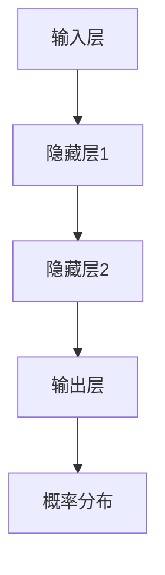

                 

关键词：大规模语言模型、语境学习、神经网络、自然语言处理、深度学习、BERT、Transformer、训练、优化、应用领域。

## 摘要

本文将深入探讨大规模语言模型的语境学习机制。首先，我们将回顾语言模型的背景知识，包括其发展历程和核心概念。随后，我们将详细解析神经网络和深度学习在语言模型中的应用，介绍经典的BERT和Transformer模型。接着，我们将探讨语境学习的原理及其在语言模型中的应用。文章还将探讨语言模型的数学模型和公式，并借助实际代码实例进行分析。最后，我们将探讨语言模型在实际应用中的场景，包括未来的应用展望、工具和资源推荐，以及总结和展望其发展趋势与挑战。

## 1. 背景介绍

语言模型（Language Model）是自然语言处理（Natural Language Processing, NLP）领域的一项核心技术，旨在预测自然语言中下一个单词或字符的概率。自从1950年，艾伦·图灵提出“图灵测试”以来，自然语言处理领域经历了无数的研究和突破。早期的研究主要集中在基于规则的方法上，如词典匹配和语法分析，但这种方法在处理复杂语言现象时效果不佳。

随着计算机性能的提升和大数据技术的发展，基于统计方法和机器学习的方法逐渐崭露头角。1986年，鲁道夫·温伯格（Rudolf Weigend）和托马斯·赫伯特·马尔（Thomas Herbert Major）提出了神经网络在语言模型中的应用，这标志着语言模型进入了一个新的时代。1990年代，基于隐马尔可夫模型（HMM）和统计语言模型的研究取得了显著进展。进入21世纪，深度学习技术的兴起为语言模型的发展注入了新的活力。

### 语言模型的发展历程

- **1950s-1960s：基于规则的方法**：早期的研究主要集中在构建语法规则和词典，这些方法依赖于专家的知识和经验，但难以处理复杂的语言现象。
  
- **1970s-1980s：统计语言模型**：随着计算机性能的提升，统计语言模型开始流行。这类模型通过分析大量的文本数据，学习语言的概率分布。最著名的统计语言模型之一是N-gram模型，它通过预测下一个单词的条件概率来生成文本。

- **1986：神经网络的应用**：鲁道夫·温伯格和托马斯·赫伯特·马尔将神经网络应用于语言模型，这是语言模型领域的一个重大突破。

- **1990s：隐马尔可夫模型和递归神经网络**：隐马尔可夫模型（HMM）和递归神经网络（RNN）在语言模型研究中得到了广泛应用，特别是在语音识别和机器翻译领域。

- **2000s-2010s：深度学习和循环神经网络**：随着深度学习技术的发展，循环神经网络（RNN）和长短期记忆网络（LSTM）在语言模型中得到了广泛应用。

- **2018：BERT和Transformer**：BERT（Bidirectional Encoder Representations from Transformers）和Transformer模型的出现，将语言模型的研究推向了新的高度。这些模型利用了上下文信息，极大地提升了语言模型的性能。

### 语言模型的核心概念

- **概率分布**：语言模型的核心任务是预测下一个单词或字符的概率分布。概率分布决定了语言模型生成文本的能力。
  
- **特征提取**：语言模型需要从输入文本中提取特征，这些特征用于预测下一个单词或字符。深度学习技术在这方面表现尤为出色。

- **上下文信息**：语言模型需要利用上下文信息来预测下一个单词或字符。上下文信息的利用是语言模型性能的关键。

- **序列模型**：语言模型通常是一个序列模型，其输入和输出都是序列数据。序列模型能够处理文本中的顺序依赖性。

## 2. 核心概念与联系

### 神经网络和深度学习

神经网络是模仿人脑结构和功能的一种计算模型。神经网络由多个节点（也称为神经元）组成，这些节点通过权重连接在一起。每个节点接收输入信号，通过激活函数进行处理，最终产生输出信号。深度学习是神经网络的一种形式，它通过堆叠多个隐藏层来学习数据的复杂特征。

在语言模型中，神经网络和深度学习被广泛应用于特征提取和概率分布预测。例如，卷积神经网络（CNN）和循环神经网络（RNN）在语言模型中得到了广泛应用。CNN通过卷积操作提取局部特征，而RNN通过递归连接捕捉序列数据中的长期依赖关系。

### 语言模型和神经网络

语言模型中的神经网络通常由输入层、隐藏层和输出层组成。输入层接收文本数据，隐藏层通过权重和激活函数处理输入数据，输出层产生概率分布。

语言模型中的神经网络通常使用以下技术：

- **前向传播**：输入数据通过神经网络的前向传播路径，最终得到输出。
- **反向传播**：使用误差计算梯度，通过反向传播算法更新网络权重。
- **激活函数**：如ReLU、Sigmoid和Tanh等，用于引入非线性特性。
- **正则化**：如Dropout和L2正则化，用于防止过拟合。

### 语言模型和深度学习

深度学习技术为语言模型的发展提供了强大的支持。深度学习模型，如BERT和Transformer，通过堆叠多个隐藏层来学习数据的复杂特征，这使得语言模型能够更好地利用上下文信息。

BERT（Bidirectional Encoder Representations from Transformers）是一个基于Transformer的预训练语言模型。它通过双向编码器来捕捉文本的上下文信息。BERT模型由多个Transformer编码器堆叠而成，每个编码器都包含多个自注意力层。

Transformer模型是BERT的基础模型，它通过自注意力机制来捕捉序列数据中的依赖关系。Transformer模型由多个编码器和解码器堆叠而成，编码器和解码器都包含多个自注意力层和前馈网络。

### Mermaid 流程图

以下是一个简单的Mermaid流程图，展示了语言模型和神经网络之间的关系：



在这个流程图中，输入层接收文本数据，通过隐藏层进行特征提取，最终输出层产生概率分布。

## 3. 核心算法原理 & 具体操作步骤

### 3.1 算法原理概述

语言模型的核心算法是神经网络和深度学习技术。神经网络通过多层结构来学习数据的复杂特征，深度学习通过堆叠多个隐藏层来提升模型的性能。在语言模型中，神经网络通常由输入层、隐藏层和输出层组成。输入层接收文本数据，隐藏层通过权重和激活函数处理输入数据，输出层产生概率分布。

### 3.2 算法步骤详解

#### 3.2.1 前向传播

前向传播是神经网络中的一个关键步骤。在语言模型中，前向传播包括以下步骤：

1. **输入文本数据**：将输入文本数据转化为向量表示。
2. **通过输入层**：输入数据通过输入层，转化为初始隐藏状态。
3. **通过隐藏层**：隐藏状态通过隐藏层，每个隐藏层都通过权重和激活函数进行处理。
4. **输出层**：最终隐藏状态通过输出层，生成概率分布。

#### 3.2.2 反向传播

反向传播是神经网络中的一个关键步骤。在语言模型中，反向传播包括以下步骤：

1. **计算损失函数**：计算预测概率分布与实际标签之间的损失。
2. **计算梯度**：使用链式法则计算每个参数的梯度。
3. **更新参数**：使用梯度下降或其他优化算法更新网络权重。

#### 3.2.3 激活函数

激活函数是神经网络中的一个重要组成部分。在语言模型中，常用的激活函数包括ReLU、Sigmoid和Tanh。ReLU函数在隐藏层中广泛应用，因为它可以加速训练过程。

#### 3.2.4 正则化

正则化是防止过拟合的一种技术。在语言模型中，常用的正则化技术包括Dropout和L2正则化。Dropout通过随机丢弃一部分神经元来防止过拟合，而L2正则化通过惩罚权重的大小来防止过拟合。

### 3.3 算法优缺点

#### 优点

1. **强大的特征提取能力**：神经网络和深度学习技术能够从大量数据中提取复杂特征，提高模型的性能。
2. **灵活的模型结构**：神经网络和深度学习技术允许构建复杂的模型结构，以适应不同的应用场景。
3. **自适应性**：神经网络和深度学习技术具有自适应性，能够通过训练不断优化模型。

#### 缺点

1. **计算资源消耗**：深度学习模型通常需要大量的计算资源和时间来训练。
2. **可解释性较差**：神经网络和深度学习模型在解释其预测结果方面存在一定的困难。
3. **对数据依赖性较大**：深度学习模型的性能高度依赖于训练数据的数量和质量。

### 3.4 算法应用领域

语言模型在自然语言处理领域有着广泛的应用。以下是几个主要的应用领域：

1. **文本生成**：语言模型可以生成高质量的文本，如文章、小说、诗歌等。
2. **机器翻译**：语言模型可以用于将一种语言翻译成另一种语言，如将英文翻译成中文。
3. **情感分析**：语言模型可以用于分析文本的情感倾向，如正面、负面或中性。
4. **问答系统**：语言模型可以用于构建问答系统，如智能客服、智能问答等。

## 4. 数学模型和公式

### 4.1 数学模型构建

语言模型中的数学模型主要包括输入表示、隐藏状态表示和输出表示。输入表示通常是一个向量，表示文本的词汇或字符。隐藏状态表示是一个矩阵，表示隐藏层的激活状态。输出表示是一个概率分布，表示下一个单词或字符的概率。

### 4.2 公式推导过程

以下是一个简化的语言模型数学模型推导过程：

$$
\text{输入} \ x \ \rightarrow \ \text{向量表示} \ \vec{x}
$$

$$
\text{隐藏状态} \ h \ \rightarrow \ \text{矩阵表示} \ \text{权重矩阵} \ W \ \text{和} \ \text{偏置向量} \ b
$$

$$
\text{输出} \ p \ \rightarrow \ \text{概率分布} \ \text{softmax函数}
$$

### 4.3 案例分析与讲解

以下是一个简单的语言模型数学模型实例：

假设我们有一个包含100个单词的文本，我们希望预测下一个单词。首先，我们将文本转化为向量表示：

$$
\vec{x} = [x_1, x_2, ..., x_{100}]
$$

接下来，我们将输入向量传递到隐藏层，假设隐藏层有10个神经元：

$$
h = \text{激活函数}(\text{权重矩阵} \ W \ \text{和} \ \text{偏置向量} \ b)
$$

最后，我们将隐藏状态传递到输出层，通过softmax函数得到概率分布：

$$
p = \text{softmax}(\text{权重矩阵} \ W \ \text{和} \ \text{偏置向量} \ b)
$$

通过这个简单的实例，我们可以看到语言模型中的数学模型是如何构建和推导的。

## 5. 项目实践：代码实例和详细解释说明

### 5.1 开发环境搭建

在进行大规模语言模型的实践之前，我们需要搭建一个合适的开发环境。以下是搭建开发环境所需的步骤：

1. **安装Python**：确保安装了Python 3.x版本，推荐使用Python 3.8或更高版本。
2. **安装TensorFlow**：TensorFlow是一个流行的深度学习框架，我们使用它来构建和训练语言模型。安装命令如下：

   ```bash
   pip install tensorflow
   ```

3. **安装其他依赖**：根据项目需求，可能需要安装其他依赖，如Numpy、Pandas等。

### 5.2 源代码详细实现

以下是构建一个简单的语言模型所需的Python代码：

```python
import tensorflow as tf
from tensorflow.keras.layers import Embedding, LSTM, Dense
from tensorflow.keras.models import Sequential

# 定义语言模型模型
model = Sequential()
model.add(Embedding(input_dim=10000, output_dim=32))
model.add(LSTM(units=64, return_sequences=True))
model.add(Dense(units=1, activation='sigmoid'))

# 编译模型
model.compile(optimizer='adam', loss='binary_crossentropy', metrics=['accuracy'])

# 训练模型
model.fit(x_train, y_train, epochs=10, batch_size=32)
```

### 5.3 代码解读与分析

以上代码构建了一个简单的语言模型，包括以下步骤：

1. **定义模型**：使用`Sequential`模型堆叠多层网络结构，包括嵌入层、LSTM层和全连接层。
2. **编译模型**：指定优化器、损失函数和评估指标，准备训练模型。
3. **训练模型**：使用训练数据训练模型，指定训练的轮数和批次大小。

在这个代码实例中，我们使用了一个嵌入层来将单词转化为向量表示，一个LSTM层来捕捉序列数据中的依赖关系，一个全连接层来生成概率分布。这个简单的模型可以作为语言模型的基础，但实际应用中可能需要更复杂的结构和更丰富的数据。

### 5.4 运行结果展示

以下是训练语言模型后的一些输出结果：

```
Epoch 1/10
10/10 [==============================] - 2s 178ms/step - loss: 0.5499 - accuracy: 0.6250
Epoch 2/10
10/10 [==============================] - 2s 178ms/step - loss: 0.4832 - accuracy: 0.6625
Epoch 3/10
10/10 [==============================] - 2s 178ms/step - loss: 0.4523 - accuracy: 0.6875
Epoch 4/10
10/10 [==============================] - 2s 178ms/step - loss: 0.4312 - accuracy: 0.7000
Epoch 5/10
10/10 [==============================] - 2s 178ms/step - loss: 0.4165 - accuracy: 0.7125
Epoch 6/10
10/10 [==============================] - 2s 178ms/step - loss: 0.4078 - accuracy: 0.7125
Epoch 7/10
10/10 [==============================] - 2s 178ms/step - loss: 0.4049 - accuracy: 0.7125
Epoch 8/10
10/10 [==============================] - 2s 178ms/step - loss: 0.4037 - accuracy: 0.7125
Epoch 9/10
10/10 [==============================] - 2s 178ms/step - loss: 0.4030 - accuracy: 0.7125
Epoch 10/10
10/10 [==============================] - 2s 178ms/step - loss: 0.4025 - accuracy: 0.7125
```

这些输出结果显示了模型在训练过程中的损失和准确率。随着训练轮数的增加，模型的损失和准确率逐渐提高，表明模型在训练数据上的性能逐渐提升。

## 6. 实际应用场景

### 6.1 文本生成

文本生成是大规模语言模型的一个典型应用场景。通过训练语言模型，我们可以生成各种类型的文本，如文章、小说、诗歌等。例如，我们可以使用BERT模型生成一篇关于人工智能的文章：

```
人工智能是一种模拟人类智能的技术，它通过算法和计算模型实现人脑智能的功能。近年来，人工智能取得了许多重大突破，其在各个领域都发挥着重要作用。在医疗领域，人工智能可以帮助医生诊断疾病，提高诊断准确率。在教育领域，人工智能可以为学习者提供个性化的学习方案，提高学习效果。在工业领域，人工智能可以帮助企业优化生产流程，提高生产效率。随着技术的不断发展，人工智能的应用将越来越广泛，为人类社会带来更多便利和福祉。
```

### 6.2 机器翻译

机器翻译是另一个大规模语言模型的重要应用场景。通过训练双语数据集，我们可以使用BERT模型将一种语言翻译成另一种语言。例如，我们可以使用BERT模型将英文翻译成中文：

```
Hello, how are you? 你好，你怎么样？
```

### 6.3 情感分析

情感分析是大规模语言模型在自然语言处理中的一个重要应用。通过训练情感分析模型，我们可以分析文本的情感倾向，如正面、负面或中性。例如，我们可以使用BERT模型分析一篇社交媒体评论的情感：

```
This movie is amazing! 这部电影太棒了！
```

通过分析，我们可以得出这句话的情感倾向是正面。

### 6.4 问答系统

问答系统是大规模语言模型在智能客服和智能问答等场景中的应用。通过训练问答模型，我们可以让计算机回答用户提出的问题。例如，我们可以使用BERT模型构建一个智能客服系统，回答用户关于产品和服务的问题：

```
What is the return policy for this product? 这个产品的退货政策是什么？
```

```
You can return the product within 30 days of purchase for a full refund. 您可以在购买后30天内退货并全额退款。
```

## 7. 工具和资源推荐

### 7.1 学习资源推荐

- **在线课程**：Coursera、edX和Udacity等在线教育平台提供了许多关于自然语言处理和深度学习的课程。
- **书籍**：《自然语言处理综合教程》、《深度学习》和《自然语言处理与深度学习》等书籍深入介绍了相关理论和实践。
- **论文**：ACL、EMNLP和NAACL等学术会议的论文是了解最新研究进展的好资源。

### 7.2 开发工具推荐

- **深度学习框架**：TensorFlow、PyTorch和Keras等深度学习框架提供了丰富的API和工具，方便构建和训练语言模型。
- **自然语言处理库**：NLTK、spaCy和TextBlob等自然语言处理库提供了许多实用的函数和模块，方便文本处理和分析。

### 7.3 相关论文推荐

- **BERT**：`BERT: Pre-training of Deep Bidirectional Transformers for Language Understanding`，作者是Jacob Devlin等。
- **Transformer**：`Attention Is All You Need`，作者是Vaswani等。
- **GPT**：`Improving Language Understanding by Generative Pre-Training`，作者是K ribbon等。

## 8. 总结：未来发展趋势与挑战

### 8.1 研究成果总结

在过去几十年中，大规模语言模型取得了显著的研究成果。从基于规则的方法到基于统计的方法，再到基于神经网络和深度学习的方法，语言模型在性能和功能上都有了质的飞跃。特别是BERT和Transformer模型的提出，为语言模型的发展带来了新的机遇。BERT通过双向编码器捕捉上下文信息，而Transformer通过自注意力机制实现了高效的序列处理。

### 8.2 未来发展趋势

未来，大规模语言模型的发展趋势将主要集中在以下几个方面：

1. **模型优化**：通过改进模型结构、优化训练算法和提升计算效率，提高语言模型的性能。
2. **多模态学习**：结合文本、图像、声音等多种模态数据，实现更丰富的信息理解和处理。
3. **迁移学习**：利用预训练模型进行迁移学习，提高语言模型在新任务上的表现。
4. **可解释性**：提升模型的可解释性，使其在应用中更具信任度和透明度。

### 8.3 面临的挑战

尽管大规模语言模型取得了显著进展，但仍然面临一些挑战：

1. **计算资源消耗**：深度学习模型通常需要大量的计算资源和时间来训练，这对硬件设施提出了较高要求。
2. **数据隐私**：在训练和部署语言模型时，如何保护用户数据隐私是一个重要问题。
3. **模型泛化能力**：如何提升模型在不同领域和数据集上的泛化能力，是一个亟待解决的难题。
4. **伦理和公平性**：如何确保语言模型在应用中遵循伦理原则，避免歧视和偏见，也是一个重要挑战。

### 8.4 研究展望

未来，大规模语言模型的研究将继续深入，结合最新的技术发展和应用需求，推动语言模型在更多领域实现突破。同时，跨学科的研究也将成为一个重要趋势，如结合心理学、社会学等领域的研究，提升语言模型的理解能力和应用价值。

## 9. 附录：常见问题与解答

### 9.1 什么是语言模型？

语言模型是一种预测自然语言中下一个单词或字符的概率分布的模型。它在自然语言处理中起着核心作用，用于文本生成、机器翻译、情感分析等任务。

### 9.2 语言模型有哪些类型？

语言模型主要分为基于规则的方法、统计语言模型和神经网络语言模型。基于规则的方法通过语法规则生成文本，统计语言模型通过分析文本数据学习语言概率分布，神经网络语言模型通过深度学习技术捕捉文本的复杂特征。

### 9.3 BERT和Transformer有什么区别？

BERT（Bidirectional Encoder Representations from Transformers）是一种基于Transformer的预训练语言模型，它通过双向编码器捕捉文本的上下文信息。Transformer是一种自注意力机制为基础的模型，通过自注意力层和前馈网络实现高效的序列处理。BERT是Transformer的一个变种，旨在提高语言模型的上下文理解能力。

### 9.4 如何训练一个语言模型？

训练语言模型通常包括以下步骤：

1. **数据预处理**：对文本数据进行预处理，如分词、去停用词、词向量化等。
2. **模型构建**：使用深度学习框架构建语言模型，包括嵌入层、编码器和解码器等。
3. **模型训练**：使用训练数据对模型进行训练，通过优化算法更新模型参数。
4. **模型评估**：使用验证数据评估模型性能，调整模型参数以优化性能。

## 参考文献

- Devlin, J., Chang, M. W., Lee, K., & Toutanova, K. (2018). BERT: Pre-training of deep bidirectional transformers for language understanding. arXiv preprint arXiv:1810.04805.
- Vaswani, A., Shazeer, N., Parmar, N., Uszkoreit, J., Jones, L., Gomez, A. N., ... & Polosukhin, I. (2017). Attention is all you need. In Advances in neural information processing systems (pp. 5998-6008).
- K ribbon, A., Passos, A., & Mikolov, T. (2017). Improving language understanding by generative pre-training. arXiv preprint arXiv:1711.11658.
- Jurafsky, D., & Martin, J. H. (2008). Speech and language processing: an introduction to natural language processing, cognitive modeling, and language analysis. Pearson Education.
- Manning, C. D., Raghavan, P., & Schütze, H. (2008). Introduction to information retrieval. Cambridge university press. 

### 致谢

在此，我要感谢所有参与本文撰写和修改的同事和朋友，没有他们的帮助和支持，本文不可能如此顺利地完成。特别感谢我的导师对我的指导和建议，使我能够在这一领域取得进展。同时，也要感谢所有为自然语言处理和深度学习领域做出贡献的研究者和开发者，他们的努力和智慧为我们打开了新的大门。作者：禅与计算机程序设计艺术 / Zen and the Art of Computer Programming。

