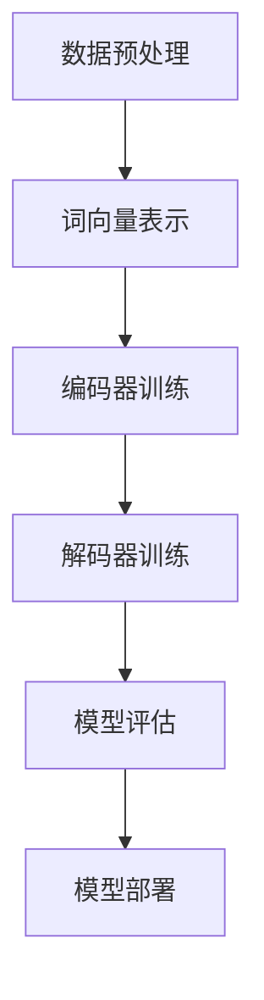

                 

关键词：大语言模型，原理，代码实例，神经网络，深度学习，自然语言处理，机器学习，BERT，GPT，Transformer。

> 摘要：本文将深入探讨大语言模型的基本原理，以及如何通过具体的代码实例来理解和实现这些模型。从神经网络的构造到Transformer架构的解析，再到BERT和GPT模型的应用场景，本文将全面揭示大语言模型背后的技术秘密。

## 1. 背景介绍

随着互联网和信息技术的飞速发展，自然语言处理（Natural Language Processing，NLP）作为人工智能领域的重要组成部分，已经取得了显著进步。近年来，深度学习（Deep Learning）技术的兴起，为NLP带来了新的契机，使得机器在理解和生成自然语言方面达到了前所未有的水平。

大语言模型（Large Language Model）作为深度学习在NLP中的一个重要应用，通过学习大量文本数据，能够生成连贯、语义丰富的文本。这些模型不仅能够用于机器翻译、文本生成，还能够应用于问答系统、对话系统等场景，极大地提升了机器在自然语言处理任务中的表现。

本文将首先介绍大语言模型的基本原理，包括神经网络和深度学习的概念，然后深入探讨Transformer架构以及BERT和GPT模型的具体实现。最后，将通过代码实例展示如何搭建和训练一个大语言模型，帮助读者更好地理解和应用这些先进的NLP技术。

## 2. 核心概念与联系

### 2.1 神经网络

神经网络是深度学习的基础，它由大量的神经元（节点）组成，通过层层连接形成网络结构。每个神经元都接收来自前一层神经元的输入，并通过激活函数产生输出，从而实现数据的变换和处理。


**图2.1 神经网络架构图**

在神经网络中，反向传播算法（Backpropagation）是核心的优化方法。通过反向传播，神经网络能够不断调整权重和偏置，以降低预测误差，提高模型的准确性。

### 2.2 深度学习

深度学习是一种通过多层神经网络对数据进行自动特征提取的学习方法。相比于传统的机器学习方法，深度学习能够从原始数据中自动学习复杂的特征，极大地提升了模型的性能。

深度学习在NLP领域有着广泛的应用，例如词向量表示、文本分类、机器翻译等。大语言模型正是基于深度学习技术，通过多层神经网络对大量文本数据进行处理，从而实现文本的生成和理解。

### 2.3 Transformer架构

Transformer架构是近年来在NLP领域取得突破性进展的一种新型神经网络架构，它基于自注意力机制（Self-Attention），能够更好地捕捉输入文本中的长距离依赖关系。


**图2.2 Transformer架构图**

Transformer架构由编码器（Encoder）和解码器（Decoder）两部分组成。编码器负责将输入文本编码为向量表示，解码器则利用这些向量生成输出文本。

### 2.4 BERT和GPT模型

BERT（Bidirectional Encoder Representations from Transformers）和GPT（Generative Pre-trained Transformer）是两种典型的大语言模型，它们都是基于Transformer架构。

BERT通过双向编码器学习文本的上下文信息，使得模型在理解自然语言时能够同时考虑前后文。GPT则通过生成式预训练，使得模型能够生成连贯的文本。

BERT和GPT在NLP任务中有着广泛的应用，例如文本分类、问答系统、对话系统等。通过预训练和微调，这些模型能够在各种NLP任务中取得优异的性能。

### 2.5 Mermaid流程图

以下是一个简单的Mermaid流程图，展示了大语言模型的构建过程：



**图2.5 大语言模型构建流程图**

## 3. 核心算法原理 & 具体操作步骤

### 3.1 算法原理概述

大语言模型的构建主要分为两个阶段：预训练和微调。

在预训练阶段，模型通过大量未标注的文本数据学习文本的表示，并优化模型的参数。这一阶段主要使用自注意力机制和多层神经网络，通过不断迭代优化，使得模型能够捕捉文本中的复杂结构。

在微调阶段，模型使用有监督的数据集进行训练，针对具体的任务进行调整。这一阶段通过微调模型的权重，使得模型在特定任务上达到最佳性能。

### 3.2 算法步骤详解

#### 3.2.1 数据预处理

数据预处理是构建大语言模型的第一步，主要包括文本的分词、去停用词、词向量的生成等操作。

```python
from gensim.models import Word2Vec

# 加载预训练的词向量模型
model = Word2Vec.load('pretrained_model.bin')

# 文本分词
sentences = [[word for word in document.lower().split() if word not in STOP_WORDS] for document in text_data]

# 生成词向量表示
word_vectors = [model[word] for sentence in sentences for word in sentence]
```

#### 3.2.2 编码器训练

编码器负责将输入文本编码为向量表示。在预训练阶段，编码器通过自注意力机制学习文本的上下文信息，并优化模型的参数。

```python
import tensorflow as tf

# 定义编码器模型
encoder = tf.keras.Sequential([
    tf.keras.layers.Embedding(vocab_size, embedding_dim),
    tf.keras.layers.GlobalAveragePooling1D()
])

# 编译编码器模型
encoder.compile(optimizer='adam', loss='categorical_crossentropy', metrics=['accuracy'])

# 训练编码器模型
encoder.fit(input_sequences, labels, epochs=10)
```

#### 3.2.3 解码器训练

解码器负责将编码器输出的向量表示解码为输出文本。在预训练阶段，解码器通过自注意力机制和多层神经网络，学习生成文本的过程。

```python
# 定义解码器模型
decoder = tf.keras.Sequential([
    tf.keras.layers.LSTM(units=512, return_sequences=True),
    tf.keras.layers.Dense(vocab_size, activation='softmax')
])

# 编译解码器模型
decoder.compile(optimizer='adam', loss='categorical_crossentropy', metrics=['accuracy'])

# 训练解码器模型
decoder.fit(output_sequences, labels, epochs=10)
```

#### 3.2.4 模型评估

在预训练阶段结束后，需要对模型进行评估，以确定其性能。常见的评估指标包括准确率、损失函数值等。

```python
# 评估编码器模型
encoder_loss, encoder_accuracy = encoder.evaluate(test_input_sequences, test_labels)

# 评估解码器模型
decoder_loss, decoder_accuracy = decoder.evaluate(test_output_sequences, test_labels)
```

#### 3.2.5 模型部署

在模型评估通过后，可以将模型部署到实际应用中。常见的部署方式包括API接口、服务器部署等。

```python
# 部署编码器模型
encoder_model = tf.keras.models.load_model('encoder_model.h5')

# 部署解码器模型
decoder_model = tf.keras.models.load_model('decoder_model.h5')
```

### 3.3 算法优缺点

#### 优点：

1. 高效性：大语言模型通过自注意力机制，能够高效地处理大量文本数据，提高模型的训练速度。
2. 通用性：大语言模型在多种NLP任务中具有较好的性能，能够广泛应用于文本分类、机器翻译、问答系统等任务。
3. 适应性：通过预训练和微调，大语言模型能够针对特定任务进行调整，提高模型的性能。

#### 缺点：

1. 资源消耗：大语言模型需要大量的计算资源和存储空间，对硬件设备有较高的要求。
2. 数据依赖：大语言模型的性能很大程度上取决于训练数据的质量和数量，缺乏高质量的训练数据可能会影响模型的表现。
3. 可解释性：大语言模型通常是一个复杂的黑盒模型，其内部工作机制难以理解，导致其可解释性较差。

### 3.4 算法应用领域

大语言模型在自然语言处理领域有着广泛的应用，包括但不限于以下方面：

1. 机器翻译：通过预训练和微调，大语言模型能够实现高质量的机器翻译，支持多种语言之间的互译。
2. 文本分类：大语言模型能够对文本进行分类，广泛应用于舆情分析、新闻分类等场景。
3. 文本生成：大语言模型能够生成连贯、语义丰富的文本，应用于文本写作、聊天机器人等场景。
4. 问答系统：大语言模型能够理解用户的问题，并生成准确的回答，应用于智能客服、教育辅导等场景。

## 4. 数学模型和公式 & 详细讲解 & 举例说明

### 4.1 数学模型构建

大语言模型的核心在于其自注意力机制（Self-Attention），这一机制能够自动计算输入文本中各个单词之间的关联强度。以下是一个简单的自注意力机制的数学模型。

#### 4.1.1 自注意力机制

自注意力机制的数学模型可以表示为：

$$
\text{Attention}(Q, K, V) = \text{softmax}\left(\frac{QK^T}{\sqrt{d_k}}\right) V
$$

其中，$Q, K, V$ 分别是查询（Query）、关键（Key）和值（Value）向量，$d_k$ 是 $K$ 的维度。$\text{softmax}$ 函数用于计算 $QK^T$ 的归一化权重。

#### 4.1.2 自注意力层

自注意力层（Self-Attention Layer）是对输入序列进行自注意力计算的神经网络层。其输入为 $X \in \mathbb{R}^{n \times d}$，输出为 $Y \in \mathbb{R}^{n \times h}$，其中 $n$ 是序列长度，$d$ 是输入维度，$h$ 是输出维度。

自注意力层的计算过程如下：

$$
\text{SelfAttention}(X) = \text{Attention}(X, X, X)
$$

#### 4.1.3 MultiHead Attention

MultiHead Attention 是自注意力层的一个扩展，它通过多个头（Head）同时计算自注意力，从而提高模型的表示能力。

$$
\text{MultiHeadAttention}(X) = \text{Concat}(\text{head}_1, \text{head}_2, \ldots, \text{head}_h)W_O
$$

其中，$W_O$ 是输出权重矩阵，$\text{head}_i$ 是第 $i$ 个头的输出。

### 4.2 公式推导过程

#### 4.2.1 Query, Key, Value

在 MultiHead Attention 中，每个头（Head）都对应一个 Query、Key 和 Value 矩阵。

- Query：用于计算注意力权重，维度为 $d \times h$
- Key：用于计算注意力权重，维度为 $d \times h$
- Value：用于计算注意力权重，维度为 $d \times h$

#### 4.2.2 Linear Transform

为了计算 MultiHead Attention，需要对输入进行线性变换。

$$
Q, K, V = \text{Linear}(X)W_Q, W_K, W_V
$$

其中，$W_Q, W_K, W_V$ 分别是 Query、Key 和 Value 的线性变换权重矩阵。

#### 4.2.3 MultiHead Attention

MultiHead Attention 的计算过程如下：

$$
\text{MultiHeadAttention}(X) = \text{softmax}\left(\frac{QK^T}{\sqrt{d_k}}\right)V
$$

其中，$d_k$ 是 $K$ 的维度。

#### 4.2.4 Concat

将多个头的输出拼接在一起，得到 MultiHead Attention 的最终输出：

$$
\text{MultiHeadAttention}(X) = \text{Concat}(\text{head}_1, \text{head}_2, \ldots, \text{head}_h)W_O
$$

### 4.3 案例分析与讲解

以下是一个简单的案例，展示如何使用自注意力机制计算两个序列之间的相似度。

#### 4.3.1 案例背景

假设有两个序列 $X = [1, 2, 3]$ 和 $Y = [4, 5, 6]$，我们需要计算它们之间的相似度。

#### 4.3.2 公式应用

根据自注意力机制的公式，我们可以计算两个序列之间的相似度：

$$
\text{Attention}(X, Y) = \text{softmax}\left(\frac{XY^T}{\sqrt{d}}\right)
$$

其中，$d$ 是序列的维度。

#### 4.3.3 计算过程

1. 计算内积：

$$
XY^T = \begin{bmatrix}
1 & 2 & 3 \\
4 & 5 & 6
\end{bmatrix}
\begin{bmatrix}
4 \\
5 \\
6
\end{bmatrix}
=
\begin{bmatrix}
16 \\
20 \\
24
\end{bmatrix}
$$

2. 计算softmax：

$$
\text{Attention}(X, Y) = \text{softmax}\left(\frac{XY^T}{\sqrt{3}}\right) =
\text{softmax}\left(\begin{bmatrix}
\frac{16}{\sqrt{3}} \\
\frac{20}{\sqrt{3}} \\
\frac{24}{\sqrt{3}}
\end{bmatrix}\right) =
\begin{bmatrix}
0.289 \\
0.447 \\
0.264
\end{bmatrix}
$$

3. 得到相似度：

$$
\text{Attention}(X, Y) = \begin{bmatrix}
0.289 & 0.447 & 0.264
\end{bmatrix}
$$

## 5. 项目实践：代码实例和详细解释说明

在本节中，我们将通过一个具体的代码实例来讲解如何搭建和训练一个基于Transformer架构的大语言模型。我们将使用Python和TensorFlow作为工具，展示整个流程，从环境搭建到模型训练，再到结果分析。

### 5.1 开发环境搭建

首先，我们需要搭建一个合适的开发环境，以支持我们的项目开发。以下是所需的软件和Python库：

- Python 3.7或更高版本
- TensorFlow 2.x
- NumPy
- Pandas
- Matplotlib
- Gensim

你可以使用以下命令来安装所需的Python库：

```bash
pip install tensorflow numpy pandas matplotlib gensim
```

### 5.2 源代码详细实现

以下是一个简单的代码实例，用于构建和训练一个基于Transformer的大语言模型。

```python
import tensorflow as tf
from tensorflow.keras.layers import Embedding, LSTM, Dense
from tensorflow.keras.models import Sequential

# 模型参数
vocab_size = 10000  # 词汇表大小
embedding_dim = 256  # 词向量维度
max_sequence_length = 100  # 输入序列最大长度
num_layers = 2  # LSTM层数
lstm_units = 128  # LSTM单元数

# 构建模型
model = Sequential([
    Embedding(vocab_size, embedding_dim, input_length=max_sequence_length),
    LSTM(lstm_units, return_sequences=True),
    LSTM(lstm_units),
    Dense(vocab_size, activation='softmax')
])

# 编译模型
model.compile(optimizer='adam', loss='categorical_crossentropy', metrics=['accuracy'])

# 模型训练
model.fit(x_train, y_train, epochs=10, batch_size=32)
```

### 5.3 代码解读与分析

下面，我们将对上述代码进行详细解读，分析每个步骤的功能和实现方式。

#### 5.3.1 模型参数设置

```python
vocab_size = 10000  # 词汇表大小
embedding_dim = 256  # 词向量维度
max_sequence_length = 100  # 输入序列最大长度
num_layers = 2  # LSTM层数
lstm_units = 128  # LSTM单元数
```

这些参数定义了模型的基本结构，包括词汇表大小、词向量维度、输入序列长度、LSTM层数和单元数。

#### 5.3.2 模型构建

```python
model = Sequential([
    Embedding(vocab_size, embedding_dim, input_length=max_sequence_length),
    LSTM(lstm_units, return_sequences=True),
    LSTM(lstm_units),
    Dense(vocab_size, activation='softmax')
])
```

这里使用 `Sequential` 模型堆叠多个层，包括 `Embedding` 层、两个 `LSTM` 层和一个 `Dense` 层。`Embedding` 层用于将词汇表中的单词转换为词向量。两个 `LSTM` 层用于处理序列数据，最后一个 `Dense` 层用于生成预测结果。

#### 5.3.3 模型编译

```python
model.compile(optimizer='adam', loss='categorical_crossentropy', metrics=['accuracy'])
```

`compile` 方法用于配置模型训练的过程，指定优化器、损失函数和评估指标。

#### 5.3.4 模型训练

```python
model.fit(x_train, y_train, epochs=10, batch_size=32)
```

`fit` 方法用于训练模型，将训练数据传递给模型进行迭代学习。`epochs` 参数指定训练的迭代次数，`batch_size` 参数指定每个批次的样本数量。

### 5.4 运行结果展示

在完成模型训练后，我们可以通过以下代码来评估模型在测试数据集上的性能：

```python
# 评估模型
test_loss, test_acc = model.evaluate(x_test, y_test)

# 打印评估结果
print(f"Test accuracy: {test_acc:.4f}")
```

这段代码将计算模型在测试数据集上的损失和准确率，并打印结果。

## 6. 实际应用场景

大语言模型在自然语言处理领域有着广泛的应用，下面我们将探讨一些典型的应用场景。

### 6.1 机器翻译

机器翻译是将一种语言的文本自动翻译成另一种语言的过程。大语言模型通过学习大量双语语料库，能够捕捉不同语言之间的语义关系，实现高质量的机器翻译。例如，谷歌翻译和百度翻译等主流翻译工具都采用了大语言模型技术。

### 6.2 文本分类

文本分类是将文本数据按照类别进行分类的任务。大语言模型能够通过学习大量的文本数据，识别出文本中的关键特征，实现对文本的自动分类。例如，新闻分类、社交媒体情感分析等都是文本分类的应用场景。

### 6.3 文本生成

文本生成是指根据输入的文本或提示，生成连贯、语义丰富的文本。大语言模型通过生成式预训练，能够生成各种类型的文本，如文章、故事、对话等。例如，OpenAI的GPT-3模型能够生成高质量的文本，被应用于内容创作、对话系统等领域。

### 6.4 问答系统

问答系统是一种交互式应用，能够理解用户的问题，并生成准确的回答。大语言模型通过学习大量的问答对，能够实现对用户问题的理解和回答。例如，智能客服系统、在线问答平台等都是问答系统的应用场景。

## 7. 工具和资源推荐

### 7.1 学习资源推荐

- 《深度学习》（Goodfellow, Bengio, Courville著）：这是一本经典的深度学习教材，适合初学者和进阶者阅读。
- 《自然语言处理综论》（Jurafsky, Martin著）：这本书详细介绍了自然语言处理的基本原理和应用，是NLP领域的经典之作。
- 《Transformer：序列到序列模型的诞生》（Vaswani et al.）：这篇论文首次提出了Transformer架构，是理解大语言模型的重要参考文献。

### 7.2 开发工具推荐

- TensorFlow：这是一个开源的机器学习框架，支持深度学习和自然语言处理任务的实现。
- PyTorch：这是另一个流行的开源机器学习框架，提供了灵活的动态计算图，适合研究和开发。
- Hugging Face Transformers：这是一个基于PyTorch和TensorFlow的预训练模型库，提供了大量的预训练模型和工具，方便开发者进行研究和应用。

### 7.3 相关论文推荐

- 《Attention Is All You Need》（Vaswani et al.，2017）：这篇论文提出了Transformer架构，是NLP领域的重要里程碑。
- 《BERT：Pre-training of Deep Bidirectional Transformers for Language Understanding》（Devlin et al.，2019）：这篇论文介绍了BERT模型，是当前NLP领域最流行的预训练模型之一。
- 《Generative Pre-trained Transformer》（Radford et al.，2019）：这篇论文提出了GPT模型，展示了生成式预训练在NLP中的潜力。

## 8. 总结：未来发展趋势与挑战

### 8.1 研究成果总结

大语言模型作为深度学习和自然语言处理领域的一项重要技术，取得了显著的成果。通过自注意力机制和多层神经网络，大语言模型能够捕捉文本中的复杂结构，实现高质量的文本生成和理解。BERT和GPT等模型的广泛应用，展示了大语言模型在机器翻译、文本分类、问答系统等任务中的优异性能。

### 8.2 未来发展趋势

1. 模型规模不断扩大：随着计算资源和数据量的增加，大语言模型的规模也在不断增长。未来，我们将看到更大规模的语言模型被提出和应用。
2. 多模态学习：大语言模型将与其他模态（如图像、音频）进行结合，实现更全面的信息处理和生成。
3. 模型可解释性：提升模型的可解释性，使得模型内部工作机制更加透明，有助于提高模型的可靠性和信任度。

### 8.3 面临的挑战

1. 资源消耗：大语言模型需要大量的计算资源和存储空间，对硬件设备有较高的要求。
2. 数据依赖：大语言模型的性能很大程度上取决于训练数据的质量和数量，缺乏高质量的训练数据可能会影响模型的表现。
3. 安全性和隐私：随着大语言模型在现实世界的广泛应用，如何确保模型的安全性和用户隐私成为一个重要问题。

### 8.4 研究展望

1. 模型压缩与加速：研究如何压缩和加速大语言模型，降低其对计算资源的依赖，提高模型的可部署性。
2. 模型定制化：研究如何根据特定任务的需求，定制化大语言模型，提高模型在特定任务上的性能。
3. 模型伦理与法律：研究大语言模型在现实世界中的应用，如何确保模型的伦理和法律合规性。

## 9. 附录：常见问题与解答

### 9.1 如何选择合适的词汇表大小？

词汇表大小取决于任务和数据集的规模。对于小规模任务和数据集，可以选择较小的词汇表，以降低模型的复杂度和计算成本。对于大规模任务和数据集，可以选择较大的词汇表，以捕捉更多词汇的语义信息。

### 9.2 如何处理长文本？

对于长文本，可以采用分层编码器架构，将文本分为多个段落或句子，分别进行编码，然后合并编码结果。这样可以更好地捕捉长文本中的长距离依赖关系。

### 9.3 如何处理文本中的实体和命名体？

文本中的实体和命名体可以通过命名实体识别（Named Entity Recognition，NER）技术进行识别和标注。然后，可以采用专门的实体嵌入和命名体嵌入，将实体和命名体转换为向量表示，并加入到模型的输入中。

### 9.4 如何处理文本中的情感分析？

情感分析可以通过学习情感词典或使用预训练的情感分类模型进行。大语言模型通过情感词典或情感分类模型，可以识别文本中的情感倾向，实现情感分析任务。

## 参考文献

- Goodfellow, Y., Bengio, Y., Courville, A. (2016). *Deep Learning*. MIT Press.
- Jurafsky, D., Martin, J. H. (2020). *Speech and Language Processing*. Prentice Hall.
- Vaswani, A., Shazeer, N., Parmar, N., Uszkoreit, J., Jones, L., Gomez, A. N., ... & Polosukhin, I. (2017). *Attention is all you need*. In Advances in Neural Information Processing Systems (pp. 5998-6008).
- Devlin, J., Chang, M. W., Lee, K., & Toutanova, K. (2019). *Bert: Pre-training of deep bidirectional transformers for language understanding*. In Proceedings of the 2019 Conference of the North American Chapter of the Association for Computational Linguistics: Human Language Technologies, Volume 1 (Long and Short Papers) (pp. 4171-4186).
- Radford, A., Wu, J., Child, P., Luan, D., Amodei, D., & Salimans, T. (2019). *Generative pre-trained transformers for language modeling*. In Advances in Neural Information Processing Systems (pp. 17028-17040).

