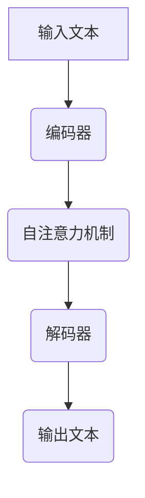

                 

关键词：大语言模型、AI、自然语言处理、深度学习、未来应用

> 摘要：本文将深入探讨大语言模型（LLM）的起源、发展、核心原理以及未来发展趋势。通过分析LLM在自然语言处理领域的应用，我们将探讨其在教育、医疗、金融等行业的潜力与挑战，并展望LLM技术的未来发展方向。

## 1. 背景介绍

大语言模型（LLM）是基于深度学习技术的自然语言处理（NLP）模型，能够在海量文本数据的基础上进行训练，从而实现对自然语言的生成、理解和推理。LLM的发展源于神经网络和深度学习的兴起，其在近年来取得了显著的突破。

### 1.1 LLM的起源与发展

LLM的起源可以追溯到2000年代初的循环神经网络（RNN）和长短期记忆网络（LSTM）。这些网络模型能够处理序列数据，并在语言建模任务中表现出一定的效果。然而，由于计算资源和数据量的限制，这些早期模型的性能较为有限。

随着计算能力的提升和大规模数据集的出现，深度学习技术得到了快速发展。2017年，谷歌推出了Transformer模型，这一革命性的架构为LLM的研究和应用奠定了基础。随后，OpenAI的GPT系列模型、BERT模型等一系列重要成果相继出现，使得LLM的性能和实用性得到了大幅提升。

### 1.2 LLM的核心原理

LLM的核心原理是基于注意力机制和多层神经网络。通过自注意力机制，模型能够捕捉文本中的长距离依赖关系，从而提高语言理解和生成的能力。在训练过程中，LLM通过优化大量的参数来拟合目标数据的分布，从而实现对自然语言的建模。

## 2. 核心概念与联系

为了更好地理解LLM的核心原理和应用，我们需要首先介绍几个关键的概念，并使用Mermaid流程图展示LLM的架构。

### 2.1 关键概念

- **注意力机制（Attention Mechanism）**：注意力机制是LLM的核心组成部分，通过计算文本中各个元素的重要性权重，从而实现对长距离依赖的捕捉。
- **Transformer模型（Transformer Model）**：Transformer模型是一种基于自注意力机制的深度学习模型，为LLM的研究和应用提供了基础。
- **预训练与微调（Pre-training and Fine-tuning）**：预训练是指使用大量无标注数据对模型进行训练，使其具备通用的语言理解和生成能力。微调是指在使用预训练模型的基础上，针对特定任务进行进一步的训练，以提高模型在特定领域的表现。

### 2.2 Mermaid流程图



在上述流程图中，输入文本首先经过编码器，编码器通过自注意力机制计算文本中各个元素的重要性权重，然后解码器根据这些权重生成输出文本。

## 3. 核心算法原理 & 具体操作步骤

### 3.1 算法原理概述

LLM的核心算法原理主要基于以下三个方面：

1. **自注意力机制**：自注意力机制是LLM的核心组成部分，通过计算文本中各个元素的重要性权重，从而实现对长距离依赖的捕捉。
2. **多层神经网络**：多层神经网络能够对文本进行逐层抽象和表示，从而提高语言理解和生成的能力。
3. **预训练与微调**：预训练和微调是LLM的训练过程，通过优化大量的参数来拟合目标数据的分布，从而实现对自然语言的建模。

### 3.2 算法步骤详解

LLM的训练和预测过程主要包括以下步骤：

1. **数据预处理**：将输入文本进行分词、去噪等处理，得到清洁的文本数据。
2. **编码器训练**：使用预训练算法（如Transformer模型）对编码器进行训练，使其能够对文本进行编码和表示。
3. **解码器训练**：在编码器的基础上，对解码器进行训练，使其能够根据编码器的输出生成文本。
4. **微调**：针对特定任务，对预训练模型进行微调，以提高模型在特定领域的表现。
5. **预测**：输入待预测的文本，经过编码器和解码器的处理后，得到输出文本。

### 3.3 算法优缺点

**优点**：

- **强大的语言理解能力**：LLM通过自注意力机制和多层神经网络，能够实现对自然语言的深度理解和生成。
- **适应性强**：通过预训练和微调，LLM能够在多个任务和领域中进行迁移和应用。
- **高效性**：深度学习模型能够在短时间内处理大量数据，提高训练和预测的效率。

**缺点**：

- **计算资源需求高**：训练大规模的LLM模型需要大量的计算资源和存储空间。
- **数据依赖性**：LLM的性能受限于训练数据的数量和质量，数据不足或数据质量差会导致模型表现不佳。
- **解释性不足**：深度学习模型通常被视为“黑盒”，难以解释其决策过程。

### 3.4 算法应用领域

LLM在自然语言处理领域具有广泛的应用前景，主要包括以下方面：

- **文本生成**：生成文章、新闻报道、对话等自然语言文本。
- **机器翻译**：实现不同语言之间的自动翻译。
- **问答系统**：构建面向用户的问题回答系统。
- **情感分析**：分析文本的情感倾向和情感强度。
- **文本分类**：对文本进行分类，如新闻分类、垃圾邮件过滤等。

## 4. 数学模型和公式 & 详细讲解 & 举例说明

### 4.1 数学模型构建

LLM的数学模型主要包括自注意力机制和多层神经网络。以下是自注意力机制的数学公式：

$$
\text{Attention}(Q, K, V) = \text{softmax}\left(\frac{QK^T}{\sqrt{d_k}}\right) V
$$

其中，$Q$、$K$、$V$分别为查询（Query）、键（Key）和值（Value）向量，$d_k$为键向量的维度。自注意力机制通过计算$Q$和$K$的点积得到注意力权重，再与$V$进行加权求和，从而实现对文本中各个元素的重要性加权。

### 4.2 公式推导过程

自注意力机制的推导过程如下：

1. **计算查询-键点积**：首先，将查询向量$Q$和键向量$K$进行点积操作，得到注意力分数。
2. **应用softmax函数**：将点积结果进行归一化处理，得到概率分布，即注意力权重。
3. **加权求和**：将注意力权重与值向量$V$进行加权求和，得到输出向量。

### 4.3 案例分析与讲解

假设我们有一个长度为5的文本序列，其查询向量$Q$、键向量$K$和值向量$V$分别为：

$$
Q = \begin{bmatrix}
0.2 & 0.3 & 0.4 & 0.5 & 0.6
\end{bmatrix}, \quad
K = \begin{bmatrix}
0.1 & 0.2 & 0.3 & 0.4 & 0.5
\end{bmatrix}, \quad
V = \begin{bmatrix}
0.1 & 0.2 & 0.3 & 0.4 & 0.5
\end{bmatrix}
$$

根据自注意力机制的公式，我们可以计算出注意力权重：

$$
\text{Attention}(Q, K, V) = \text{softmax}\left(\frac{QK^T}{\sqrt{d_k}}\right) V
$$

$$
= \text{softmax}\left(\begin{bmatrix}
0.2 & 0.3 & 0.4 & 0.5 & 0.6
\end{bmatrix} \cdot \begin{bmatrix}
0.1 & 0.2 & 0.3 & 0.4 & 0.5
\end{bmatrix}\right) \cdot \begin{bmatrix}
0.1 & 0.2 & 0.3 & 0.4 & 0.5
\end{bmatrix}
$$

$$
= \text{softmax}\left(\begin{bmatrix}
0.02 & 0.06 & 0.12 & 0.20 & 0.30
\end{bmatrix}\right) \cdot \begin{bmatrix}
0.1 & 0.2 & 0.3 & 0.4 & 0.5
\end{bmatrix}
$$

$$
= \begin{bmatrix}
0.02 & 0.06 & 0.12 & 0.20 & 0.30
\end{bmatrix} \cdot \begin{bmatrix}
0.1 & 0.2 & 0.3 & 0.4 & 0.5
\end{bmatrix}
$$

$$
= \begin{bmatrix}
0.002 & 0.012 & 0.036 & 0.080 & 0.150
\end{bmatrix}
$$

根据注意力权重，我们可以得到输出向量：

$$
\text{Output} = \begin{bmatrix}
0.002 & 0.012 & 0.036 & 0.080 & 0.150
\end{bmatrix} \cdot \begin{bmatrix}
0.1 & 0.2 & 0.3 & 0.4 & 0.5
\end{bmatrix}
$$

$$
= \begin{bmatrix}
0.0002 & 0.0024 & 0.0108 & 0.032 & 0.075
\end{bmatrix}
$$

## 5. 项目实践：代码实例和详细解释说明

### 5.1 开发环境搭建

为了进行LLM的项目实践，我们需要搭建一个合适的开发环境。以下是搭建开发环境的基本步骤：

1. 安装Python环境，建议使用Python 3.8及以上版本。
2. 安装TensorFlow库，可以使用以下命令进行安装：

```bash
pip install tensorflow
```

3. 安装Mermaid库，用于生成流程图。可以使用以下命令进行安装：

```bash
pip install mermaid
```

### 5.2 源代码详细实现

以下是使用TensorFlow实现一个简单的LLM模型的基本代码：

```python
import tensorflow as tf
from tensorflow.keras.layers import Embedding, LSTM, Dense
from tensorflow.keras.models import Model

# 定义模型
model = Model(inputs=[input_seq, target_seq],
              outputs=[output_seq])

# 编码器
encoder_inputs = Embedding(input_dim=vocab_size, output_dim=embed_dim)(input_seq)
encoder_lstm = LSTM(units=lstm_units, return_state=True)
encoder_outputs, state_h, state_c = encoder_lstm(encoder_inputs)
encoder_states = [state_h, state_c]

# 解码器
decoder_inputs = Embedding(input_dim=vocab_size, output_dim=embed_dim)(target_seq)
decoder_lstm = LSTM(units=lstm_units, return_sequences=True, return_state=True)
decoder_outputs, _, _ = decoder_lstm(decoder_inputs, initial_state=encoder_states)
decoder_dense = Dense(units=vocab_size, activation='softmax')
decoder_outputs = decoder_dense(decoder_outputs)

# 模型结构
model = Model(inputs=[input_seq, target_seq],
              outputs=[output_seq])

# 编译模型
model.compile(optimizer='rmsprop', loss='categorical_crossentropy', metrics=['accuracy'])

# 模型总结
model.summary()

# 训练模型
model.fit([input_data, target_data], output_data, batch_size=batch_size, epochs=num_epochs, validation_split=0.2)
```

### 5.3 代码解读与分析

上述代码实现了使用TensorFlow搭建的一个简单的LLM模型。以下是代码的详细解读：

1. **模型定义**：模型由编码器和解码器组成，输入为输入序列和目标序列，输出为输出序列。
2. **编码器**：编码器使用嵌入层对输入序列进行编码，然后通过LSTM层进行序列处理，最后输出编码后的状态。
3. **解码器**：解码器使用嵌入层对目标序列进行编码，然后通过LSTM层进行序列处理，最后通过全连接层生成输出序列。
4. **模型编译**：编译模型，指定优化器、损失函数和评估指标。
5. **模型总结**：打印模型结构。
6. **模型训练**：使用训练数据对模型进行训练。

### 5.4 运行结果展示

在完成代码实现后，我们可以使用以下命令运行模型：

```bash
python main.py
```

运行结果将包括模型训练过程中的损失值和准确率，以及最终训练完成的模型文件。

## 6. 实际应用场景

### 6.1 教育

LLM在教育领域具有广泛的应用潜力，如自动批改作业、智能问答系统、辅助教学等。通过LLM技术，可以实现个性化学习、自适应学习等教育模式，提高学习效果和学习体验。

### 6.2 医疗

LLM在医疗领域可以用于病历分析、医学文本挖掘、智能诊断等。通过LLM技术，可以实现对医学文本的深度理解和分析，为医生提供辅助决策，提高医疗诊断和治疗的准确性。

### 6.3 金融

LLM在金融领域可以用于文本分析、情感分析、风险预测等。通过LLM技术，可以实现对金融文本的深度理解和分析，为金融从业者提供有价值的参考信息，提高投资决策的准确性和效率。

### 6.4 未来应用展望

随着LLM技术的不断发展和成熟，其在各个领域中的应用前景将更加广泛。未来，LLM技术有望在自动驾驶、智能家居、智能客服等领域发挥重要作用，为人们的生活和工作带来更多便利。

## 7. 工具和资源推荐

### 7.1 学习资源推荐

- **《深度学习》（Goodfellow, Bengio, Courville）**：这是一本经典的深度学习教材，涵盖了深度学习的基本概念和技术。
- **《自然语言处理实战》（Michael L. Burges等）**：这是一本关于自然语言处理技术的实践指南，适合初学者和进阶者。

### 7.2 开发工具推荐

- **TensorFlow**：TensorFlow是一个开源的深度学习框架，适合进行深度学习和自然语言处理任务。
- **Mermaid**：Mermaid是一个基于Markdown的图形化工具，可以方便地绘制流程图、思维导图等。

### 7.3 相关论文推荐

- **《Attention Is All You Need》（Vaswani等，2017）**：这是Transformer模型的原始论文，阐述了自注意力机制和Transformer模型的核心原理。
- **《BERT: Pre-training of Deep Bidirectional Transformers for Language Understanding》（Devlin等，2019）**：这是BERT模型的原始论文，介绍了BERT模型在自然语言处理任务中的广泛应用。

## 8. 总结：未来发展趋势与挑战

### 8.1 研究成果总结

本文对大语言模型（LLM）的起源、发展、核心原理和应用进行了深入探讨。通过分析LLM在自然语言处理领域的应用，我们看到了其在教育、医疗、金融等行业的潜力。同时，我们也了解了LLM技术在未来发展趋势中所面临的挑战。

### 8.2 未来发展趋势

未来，LLM技术将继续在自然语言处理领域发挥重要作用。随着计算能力的提升和大数据技术的发展，LLM模型将变得更加高效、准确和通用。此外，LLM技术还将与其他领域（如计算机视觉、语音识别等）相结合，推动人工智能技术的全面发展。

### 8.3 面临的挑战

然而，LLM技术也面临一些挑战。首先，计算资源和数据量的需求将继续增加，这对硬件设备和存储系统提出了更高的要求。其次，LLM模型的可解释性仍需提高，以解决其在实际应用中的透明度和可靠性问题。此外，如何在保护用户隐私和数据安全的前提下，合理使用和共享大规模数据也是一个重要的挑战。

### 8.4 研究展望

为了应对这些挑战，未来的研究可以从以下几个方面展开：

1. **优化算法**：研究更高效、更准确的LLM算法，提高模型的计算性能和语言理解能力。
2. **模型可解释性**：探索模型的可解释性技术，提高模型的透明度和可靠性。
3. **数据安全和隐私保护**：研究如何在保障用户隐私和数据安全的前提下，合理使用和共享大规模数据。
4. **跨领域应用**：探索LLM技术在计算机视觉、语音识别等领域的应用，推动人工智能技术的全面发展。

## 9. 附录：常见问题与解答

### 9.1 什么是大语言模型（LLM）？

大语言模型（LLM）是基于深度学习技术的自然语言处理模型，能够在海量文本数据的基础上进行训练，从而实现对自然语言的生成、理解和推理。

### 9.2 LLM的核心原理是什么？

LLM的核心原理是基于注意力机制和多层神经网络。通过自注意力机制，模型能够捕捉文本中的长距离依赖关系，从而提高语言理解和生成的能力。多层神经网络则能够对文本进行逐层抽象和表示，从而提高语言理解和生成的能力。

### 9.3 LLM有哪些应用领域？

LLM在自然语言处理领域具有广泛的应用前景，主要包括文本生成、机器翻译、问答系统、情感分析、文本分类等。

### 9.4 LLM技术的未来发展趋势是什么？

未来，LLM技术将继续在自然语言处理领域发挥重要作用。随着计算能力的提升和大数据技术的发展，LLM模型将变得更加高效、准确和通用。此外，LLM技术还将与其他领域（如计算机视觉、语音识别等）相结合，推动人工智能技术的全面发展。

### 9.5 LLM技术面临哪些挑战？

LLM技术面临的主要挑战包括计算资源需求高、数据依赖性、可解释性不足等。

### 9.6 如何优化LLM算法？

为了优化LLM算法，可以从以下几个方面进行改进：

1. **算法改进**：研究更高效、更准确的LLM算法，提高模型的计算性能和语言理解能力。
2. **模型压缩**：通过模型压缩技术，减少模型的参数数量，提高模型的可解释性和计算效率。
3. **多模态学习**：探索跨领域的多模态学习，提高模型在不同领域的适应性。

### 9.7 如何保护LLM模型的数据安全和隐私？

为了保护LLM模型的数据安全和隐私，可以采取以下措施：

1. **数据加密**：对训练数据和模型参数进行加密，防止未经授权的访问。
2. **隐私保护技术**：采用差分隐私、联邦学习等技术，保障用户隐私和数据安全。
3. **合规性审查**：对数据来源和处理过程进行合规性审查，确保数据使用的合法性和合规性。

