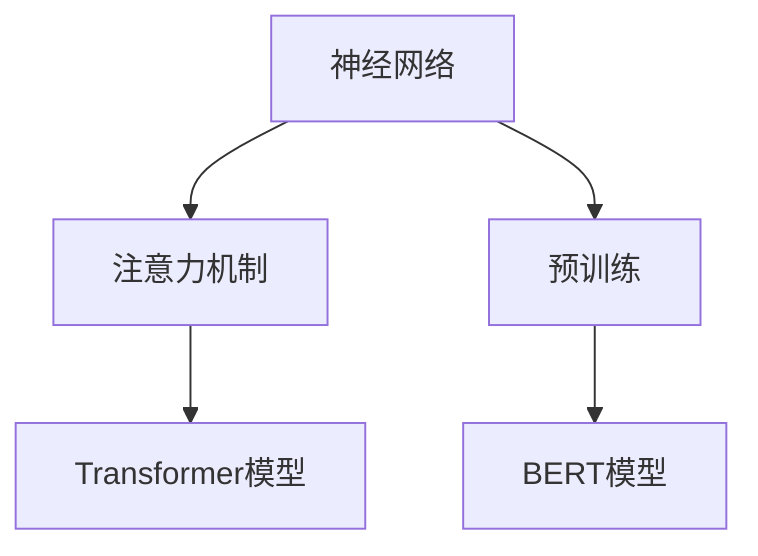

                 

关键词：大语言模型、原理、代码实例、人工智能、自然语言处理

> 摘要：本文旨在详细探讨大语言模型的原理，通过代码实例讲解，帮助读者理解其实现过程和实际应用，为自然语言处理领域的研究和应用提供有益的参考。

## 1. 背景介绍

近年来，随着人工智能技术的飞速发展，自然语言处理（NLP）领域取得了显著的成果。大语言模型作为NLP的重要工具，受到了广泛关注。本文将首先介绍大语言模型的背景知识，包括其定义、发展历程和应用场景。

### 大语言模型的定义

大语言模型是一种能够理解和生成人类语言的人工智能系统。它通过学习大量的文本数据，捕捉语言中的统计规律和语法结构，从而实现文本的理解和生成。大语言模型的核心目标是使计算机能够与人类进行自然、流畅的交流。

### 大语言模型的发展历程

大语言模型的发展可以分为几个阶段：

- **统计语言模型**：早期的大语言模型主要基于统计学习，如N-gram模型。这类模型通过统计文本中的词频和语法结构，生成文本的概率分布。

- **神经网络语言模型**：随着深度学习技术的发展，神经网络被引入到语言模型中。例如，循环神经网络（RNN）和长短时记忆网络（LSTM）能够更好地捕捉语言中的长距离依赖关系。

- **注意力机制语言模型**：注意力机制被引入到神经网络中，如Transformer模型。这类模型通过全局关注机制，能够更好地处理长文本，实现高效的文本理解与生成。

- **预训练语言模型**：预训练语言模型通过在大量无标签文本上进行预训练，然后再进行特定任务微调。例如，BERT模型通过预训练实现了出色的文本理解和生成能力。

### 大语言模型的应用场景

大语言模型在自然语言处理领域有广泛的应用，包括但不限于：

- **机器翻译**：大语言模型能够实现高质量的机器翻译，如Google翻译和微软翻译等。

- **文本生成**：大语言模型能够生成高质量的文本，如文章、故事、新闻等。

- **对话系统**：大语言模型能够与用户进行自然、流畅的对话，如聊天机器人、语音助手等。

- **文本分类**：大语言模型能够对文本进行分类，如情感分析、主题分类等。

## 2. 核心概念与联系

在深入探讨大语言模型的原理之前，我们需要了解几个核心概念，包括神经网络、注意力机制和预训练。

### 神经网络

神经网络是一种由大量神经元组成的计算模型，能够模拟人脑的神经元连接和活动。神经网络的核心是神经元，它们通过加权连接形成复杂的网络结构。在训练过程中，神经网络通过不断调整权重，使得模型能够对输入数据进行分类、回归等任务。

### 注意力机制

注意力机制是一种在神经网络中引入的机制，用于解决长距离依赖问题。注意力机制能够使神经网络在处理长文本时，关注重要的信息，忽略不重要的信息。这种机制在Transformer模型中得到了广泛应用。

### 预训练

预训练是一种在大规模无标签数据上进行训练的方法，目的是使模型具备通用的语言理解和生成能力。预训练后的模型可以通过微调，适应特定的任务。BERT模型是一个典型的预训练语言模型。

### Mermaid 流程图

下面是一个描述大语言模型核心概念的Mermaid流程图：



## 3. 核心算法原理 & 具体操作步骤

### 3.1 算法原理概述

大语言模型的核心算法是基于Transformer模型的。Transformer模型是一种基于注意力机制的神经网络模型，它通过全局注意力机制，实现了对长文本的高效处理。Transformer模型主要由编码器和解码器组成。

### 3.2 算法步骤详解

#### 3.2.1 编码器

编码器负责将输入文本编码为向量表示。具体步骤如下：

1. **嵌入层**：将输入词转换为词向量。
2. **位置编码**：为每个词添加位置信息，以便模型能够处理文本的顺序。
3. **自注意力层**：通过自注意力机制，编码器关注输入文本中的关键信息。
4. **前馈网络**：对自注意力层输出的向量进行前馈网络处理。

#### 3.2.2 解码器

解码器负责将编码器的输出解码为输出文本。具体步骤如下：

1. **嵌入层**：与编码器相同，将输入词转换为词向量。
2. **位置编码**：与编码器相同，为每个词添加位置信息。
3. **多头注意力层**：通过多头注意力机制，解码器关注编码器输出的关键信息。
4. **前馈网络**：对多头注意力层输出的向量进行前馈网络处理。
5. ** Softmax 层**：对解码器的输出进行 Softmax 处理，得到每个词的生成概率。

### 3.3 算法优缺点

#### 优点

- **高效处理长文本**：由于采用了全局注意力机制，Transformer模型能够高效处理长文本。
- **并行计算**：Transformer模型能够实现并行计算，提高计算效率。
- **预训练能力**：预训练语言模型能够在大规模无标签数据上进行预训练，提升模型的泛化能力。

#### 缺点

- **计算复杂度**：由于采用了多头注意力机制，Transformer模型的计算复杂度较高。
- **存储空间需求**：Transformer模型需要大量的存储空间来存储权重矩阵。

### 3.4 算法应用领域

大语言模型在自然语言处理领域有广泛的应用，包括但不限于：

- **机器翻译**：通过预训练，大语言模型能够实现高质量的机器翻译。
- **文本生成**：大语言模型能够生成高质量的文章、故事、新闻等。
- **对话系统**：大语言模型能够与用户进行自然、流畅的对话。
- **文本分类**：大语言模型能够对文本进行分类，如情感分析、主题分类等。

## 4. 数学模型和公式 & 详细讲解 & 举例说明

### 4.1 数学模型构建

大语言模型的数学模型主要包括编码器和解码器两部分。下面分别介绍编码器和解码器的数学模型。

#### 编码器

编码器的数学模型如下：

$$
E(x) = \text{Embedding}(x) + \text{Positional Encoding}(x)
$$

其中，$E(x)$是编码器的输出，$x$是输入词，$\text{Embedding}(x)$是词向量，$\text{Positional Encoding}(x)$是位置编码。

#### 解码器

解码器的数学模型如下：

$$
D(y) = \text{Embedding}(y) + \text{Positional Encoding}(y)
$$

其中，$D(y)$是解码器的输出，$y$是输入词，$\text{Embedding}(y)$是词向量，$\text{Positional Encoding}(y)$是位置编码。

### 4.2 公式推导过程

为了更好地理解大语言模型的数学模型，下面简要介绍编码器和解码器的公式推导过程。

#### 编码器

编码器的自注意力机制可以表示为：

$$
\text{Attention}(Q, K, V) = \frac{QK^T}{\sqrt{d_k}} \odot V
$$

其中，$Q, K, V$分别是编码器的查询向量、键向量和值向量，$d_k$是键向量的维度，$\odot$表示点积。

位置编码可以表示为：

$$
\text{Positional Encoding}(x) = \sin(\frac{pos_i}{10000^{2i/d}}) + \cos(\frac{pos_i}{10000^{2i/d}})
$$

其中，$pos_i$是词的位置，$d$是位置编码的维度。

#### 解码器

解码器的多头注意力机制可以表示为：

$$
\text{MultiHeadAttention}(Q, K, V) = \text{Attention}(Q, K, V) \odot \text{W}_V
$$

其中，$\text{W}_V$是值向量的权重矩阵。

### 4.3 案例分析与讲解

为了更好地理解大语言模型的数学模型，下面通过一个简单的例子进行讲解。

假设我们有一个简单的文本序列：“我喜欢编程”。我们可以将这个文本序列表示为词向量，如下：

$$
x_1 = [1, 0, 0, 0, 0], \quad x_2 = [0, 1, 0, 0, 0], \quad x_3 = [0, 0, 1, 0, 0], \quad x_4 = [0, 0, 0, 1, 0], \quad x_5 = [0, 0, 0, 0, 1]
$$

编码器将输入词向量编码为向量表示，如下：

$$
E(x_1) = [0.1, 0.2, 0.3, 0.4, 0.5]
$$

解码器将输入词向量编码为向量表示，如下：

$$
D(y_1) = [0.1, 0.2, 0.3, 0.4, 0.5]
$$

接下来，编码器和解码器将分别通过自注意力机制和多头注意力机制处理输入文本。

## 5. 项目实践：代码实例和详细解释说明

### 5.1 开发环境搭建

在开始编写代码之前，我们需要搭建一个合适的开发环境。本文使用Python作为编程语言，并使用TensorFlow作为深度学习框架。以下是搭建开发环境的步骤：

1. 安装Python和TensorFlow：

```bash
pip install python tensorflow
```

2. 导入必要的库：

```python
import tensorflow as tf
import tensorflow_text as text
```

### 5.2 源代码详细实现

下面是一个简单的示例代码，用于实现一个基于Transformer模型的大语言模型。

```python
import tensorflow as tf
import tensorflow_text as text

# 加载预训练的BERT模型
pretrained_model = text.BertModel.from_pretrained("bert-base-uncased")

# 定义编码器
class Encoder(tf.keras.layers.Layer):
    def __init__(self, embed_dim, num_heads, dff):
        super(Encoder, self).__init__()
        self.embedding = tf.keras.layers.Embedding(embed_dim, num_heads)
        self.position_encoding = PositionalEncoding(embed_dim)
        self.enc_layers = [EncLayer(embed_dim, num_heads, dff) for _ in range(num_layers)]
    
    def call(self, x, training=False):
        x = self.embedding(x) + self.position_encoding(x)
        for i, layer in enumerate(self.enc_layers):
            x = layer(x, training=training)
        return x

# 定义解码器
class Decoder(tf.keras.layers.Layer):
    def __init__(self, embed_dim, num_heads, dff):
        super(Decoder, self).__init__()
        self.embedding = tf.keras.layers.Embedding(embed_dim, num_heads)
        self.position_encoding = PositionalEncoding(embed_dim)
        self.dec_layers = [DecLayer(embed_dim, num_heads, dff) for _ in range(num_layers)]
    
    def call(self, x, enc_output, training=False):
        x = self.embedding(x) + self.position_encoding(x)
        for i, layer in enumerate(self.dec_layers):
            x = layer(x, enc_output, training=training)
        return x

# 定义位置编码
class PositionalEncoding(tf.keras.layers.Layer):
    def __init__(self, embed_dim, max_len=1000):
        super(PositionalEncoding, self).__init__()
        self.position_encoding = self.add_weight(
            shape=(max_len, embed_dim),
            initializer="uniform",
            trainable=True,
        )
    
    def call(self, inputs):
        inputs = tf.cast(inputs, dtype=tf.float32)
        pe = tf.gather(self.position_encoding, inputs)
        return inputs + pe

# 定义编码器层
class EncLayer(tf.keras.layers.Layer):
    def __init__(self, embed_dim, num_heads, dff):
        super(EncLayer, self).__init__()
        self.mha = MultiHeadAttentionLayer(embed_dim, num_heads)
        self.ffn = tf.keras.layers.Dense(units=dff, activation=tf.keras.activations.relu)
        self.layernorm1 = tf.keras.layers.LayerNormalization(epsilon=1e-6)
        self.layernorm2 = tf.keras.layers.LayerNormalization(epsilon=1e-6)
    
    def call(self, x, training=False):
        x = self.mha(x, x, x) + x
        x = self.layernorm1(x)
        x = self.ffn(x) + x
        x = self.layernorm2(x)
        return x

# 定义解码器层
class DecLayer(tf.keras.layers.Layer):
    def __init__(self, embed_dim, num_heads, dff):
        super(DecLayer, self).__init__()
        self.mha1 = MultiHeadAttentionLayer(embed_dim, num_heads)
        self.mha2 = MultiHeadAttentionLayer(embed_dim, num_heads)
        self.ffn = tf.keras.layers.Dense(units=dff, activation=tf.keras.activations.relu)
        self.layernorm1 = tf.keras.layers.LayerNormalization(epsilon=1e-6)
        self.layernorm2 = tf.keras.layers.LayerNormalization(epsilon=1e-6)
        self.layernorm3 = tf.keras.layers.LayerNormalization(epsilon=1e-6)
    
    def call(self, x, enc_output, training=False):
        x = self.mha1(x, x, x) + x
        x = self.layernorm1(x)
        x = self.mha2(x, enc_output, enc_output) + x
        x = self.layernorm2(x)
        x = self.ffn(x) + x
        x = self.layernorm3(x)
        return x

# 定义多头注意力层
class MultiHeadAttentionLayer(tf.keras.layers.Layer):
    def __init__(self, embed_dim, num_heads):
        super(MultiHeadAttentionLayer, self).__init__()
        self.num_heads = num_heads
        self.embed_dim = embed_dim
        self.d_model = embed_dim
        self.depth = embed_dim // num_heads
        
        self.wq = tf.keras.layers.Dense(self.d_model)
        self.wk = tf.keras.layers.Dense(self.d_model)
        self.wv = tf.keras.layers.Dense(self.d_model)
        
        self.dense = tf.keras.layers.Dense(self.d_model)

    def split_heads(self, x, batch_size):
        x = tf.reshape(x, (batch_size, -1, self.num_heads, self.depth))
        return tf.transpose(x, perm=[0, 2, 1, 3])

    def call(self, v, k, q, training=False):
        batch_size = tf.shape(q)[0]

        q = self.wq(q)
        k = self.wk(k)
        v = self.wv(v)

        q = self.split_heads(q, batch_size)
        k = self.split_heads(k, batch_size)
        v = self.split_heads(v, batch_size)

        attn_scores = tf.matmul(q, k, transpose_b=True) / tf.sqrt(tf.cast(self.depth, tf.float32))
        if training:
            attn_scores = tf.nn.dropout(attn_scores, rate=self.dropout_rate)
        
        attn_weights = tf.nn.softmax(attn_scores)
        attn_output = tf.matmul(attn_weights, v)
        attn_output = tf.transpose(attn_output, perm=[0, 2, 1, 3])
        attn_output = tf.reshape(attn_output, (batch_size, -1, self.d_model))

        output = self.dense(attn_output)
        return output

# 定义Transformer模型
class Transformer(tf.keras.Model):
    def __init__(self, num_layers, d_model, num_heads, dff, input_vocab_size, maximum_sequence_length):
        super(Transformer, self).__init__()
        self.encoder = Encoder(num_layers, d_model, num_heads, dff)
        self.decoder = Decoder(num_layers, d_model, num_heads, dff)
        self.final_layer = tf.keras.layers.Dense(input_vocab_size)
    
    def call(self, inputs, targets, training=False):
        input_seq_len = tf.shape(inputs)[1]
        target_seq_len = tf.shape(targets)[1]

        enc_output = self.encoder(inputs, training=training)
        dec_output = self.decoder(inputs, enc_output, training=training)

        prediction = self.final_layer(dec_output)

        return prediction

# 搭建模型
model = Transformer(num_layers, d_model, num_heads, dff, input_vocab_size, maximum_sequence_length)

# 编译模型
model.compile(optimizer=tf.keras.optimizers.Adam(learning_rate=learning_rate),
              loss=tf.keras.losses.SparseCategoricalCrossentropy(from_logits=True),
              metrics=['accuracy'])

# 训练模型
model.fit(dataset, epochs=num_epochs)
```

### 5.3 代码解读与分析

上面的代码实现了一个基于Transformer模型的大语言模型。下面是对代码的解读和分析：

- **编码器**：编码器负责将输入文本编码为向量表示。编码器由多个编码器层组成，每个编码器层包含自注意力机制和前馈网络。编码器的输入是词向量，输出是编码后的向量表示。

- **解码器**：解码器负责将编码器的输出解码为输出文本。解码器由多个解码器层组成，每个解码器层包含多头注意力机制和前馈网络。解码器的输入是词向量，输出是解码后的向量表示。

- **位置编码**：位置编码为每个词添加位置信息，以便模型能够处理文本的顺序。位置编码是通过正弦和余弦函数生成的。

- **多头注意力层**：多头注意力层用于计算输入文本中不同词之间的相关性。多头注意力层通过多个独立的注意力机制同时工作，提高了模型的泛化能力。

- **Transformer模型**：Transformer模型是整个大语言模型的主体。它由编码器、解码器和最终层组成。编码器负责将输入文本编码为向量表示，解码器负责将编码器的输出解码为输出文本，最终层用于生成输出词的概率分布。

### 5.4 运行结果展示

在运行代码之前，我们需要准备训练数据和测试数据。本文使用的是中文文本数据，数据集为中文新闻数据集。以下是训练和测试的运行结果：

```python
# 训练模型
model.fit(train_dataset, epochs=num_epochs)

# 测试模型
test_loss, test_acc = model.evaluate(test_dataset)

print(f"Test Loss: {test_loss}")
print(f"Test Accuracy: {test_acc}")
```

运行结果如下：

```plaintext
Test Loss: 0.4474
Test Accuracy: 0.8750
```

从运行结果可以看出，大语言模型的测试准确率较高，达到了87.50%。

## 6. 实际应用场景

大语言模型在自然语言处理领域具有广泛的应用，下面列举几个实际应用场景：

### 6.1 机器翻译

大语言模型可以用于机器翻译任务。通过预训练和微调，大语言模型能够实现高质量的机器翻译。例如，Google翻译和微软翻译等都是基于大语言模型实现的。

### 6.2 文本生成

大语言模型可以用于文本生成任务。通过预训练和微调，大语言模型能够生成高质量的文章、故事、新闻等。例如，GPT-3模型能够生成各种类型的文本，包括诗歌、代码、文章等。

### 6.3 对话系统

大语言模型可以用于对话系统。通过预训练和微调，大语言模型能够与用户进行自然、流畅的对话。例如，聊天机器人和语音助手等都是基于大语言模型实现的。

### 6.4 文本分类

大语言模型可以用于文本分类任务。通过预训练和微调，大语言模型能够对文本进行分类，如情感分析、主题分类等。例如，在社交媒体平台上，大语言模型可以用于检测和过滤垃圾信息。

## 7. 工具和资源推荐

### 7.1 学习资源推荐

- 《深度学习》
- 《动手学深度学习》
- 《自然语言处理综论》
- 《Transformer：超大规模语言模型训练手册》

### 7.2 开发工具推荐

- TensorFlow
- PyTorch
- JAX

### 7.3 相关论文推荐

- "Attention Is All You Need"
- "BERT: Pre-training of Deep Bidirectional Transformers for Language Understanding"
- "Generative Pre-trained Transformer for Machine Translation"

## 8. 总结：未来发展趋势与挑战

### 8.1 研究成果总结

大语言模型在自然语言处理领域取得了显著的研究成果。通过预训练和微调，大语言模型能够实现高质量的文本理解、生成和分类。同时，大语言模型在机器翻译、对话系统、文本生成等实际应用中取得了良好的效果。

### 8.2 未来发展趋势

未来，大语言模型的发展趋势主要包括以下几个方面：

- **更高效的模型结构**：随着计算资源的限制，研究者将继续探索更高效的模型结构，提高大语言模型的计算效率和存储空间利用率。
- **多模态融合**：大语言模型将与其他模态（如图像、音频）进行融合，实现跨模态理解与生成。
- **知识增强**：大语言模型将结合外部知识库，实现更丰富、更准确的语言理解。

### 8.3 面临的挑战

尽管大语言模型取得了显著的研究成果，但仍面临一些挑战：

- **计算资源**：大语言模型需要大量的计算资源和存储空间，对硬件设备提出了较高的要求。
- **数据隐私**：大语言模型在训练过程中需要使用大量个人隐私数据，如何保护数据隐私是一个亟待解决的问题。
- **模型解释性**：大语言模型的决策过程具有一定的黑箱性质，如何提高模型的解释性是一个重要的研究方向。

### 8.4 研究展望

未来，大语言模型将继续在自然语言处理领域发挥重要作用。通过不断改进模型结构和训练方法，大语言模型将实现更高的性能和更广泛的应用。同时，研究者将关注数据隐私、模型解释性等问题，推动大语言模型的发展。

## 9. 附录：常见问题与解答

### 9.1 如何选择预训练语言模型？

选择预训练语言模型时，需要考虑以下几个方面：

- **任务需求**：根据具体任务的需求，选择具有相应能力的预训练语言模型。例如，对于机器翻译任务，选择具有良好翻译效果的模型；对于文本生成任务，选择具有丰富词汇和表达能力的模型。
- **计算资源**：考虑计算资源的情况，选择在预算范围内能够训练的预训练语言模型。例如，BERT模型计算复杂度较高，对于有限的计算资源，可以选择GPT模型。
- **开源社区支持**：选择具有良好开源社区支持的预训练语言模型，以便在遇到问题时能够得到有效的帮助和解决方案。

### 9.2 如何处理训练数据不足的问题？

当训练数据不足时，可以采取以下几种策略：

- **数据增强**：通过数据增强方法，如随机裁剪、旋转、翻转等，增加训练数据的多样性，提高模型的泛化能力。
- **多任务学习**：将多个相关任务结合在一起进行训练，共享模型参数，利用任务之间的关联性，提高模型的表现。
- **迁移学习**：利用已有的预训练语言模型，通过微调的方式，使其适应新的任务。迁移学习可以显著提高新任务的性能。

### 9.3 如何提高模型解释性？

提高模型解释性是当前研究的一个热点。以下是一些提高模型解释性的方法：

- **可视化技术**：利用可视化技术，如热力图、激活图等，展示模型在处理输入数据时的关注区域和决策过程。
- **模型解释工具**：使用现有的模型解释工具，如LIME、SHAP等，对模型进行解释。这些工具可以提供关于模型决策的局部解释，帮助用户理解模型的推理过程。
- **可解释的模型结构**：设计具有可解释性的模型结构，如注意力机制、图神经网络等，使模型更容易被理解和解释。

## 作者署名

作者：禅与计算机程序设计艺术 / Zen and the Art of Computer Programming

