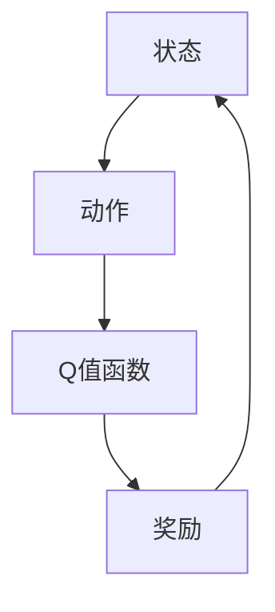

                 

关键词：大语言模型、DQN训练、强化学习、深度学习、算法原理、应用实践

> 摘要：本文将探讨大语言模型中的DQN（Deep Q-Network）训练过程，分析其核心概念、算法原理以及在实际工程中的应用。通过详细的数学模型和代码实例，帮助读者深入理解DQN在语言模型训练中的作用，展望其在未来语言处理领域的发展趋势。

## 1. 背景介绍

大语言模型是一种基于深度学习的技术，它通过学习海量文本数据，生成具有高度语义理解能力的语言模型。这种模型在自然语言处理（NLP）领域有着广泛的应用，如文本生成、机器翻译、情感分析等。

在构建大语言模型的过程中，强化学习是一种重要的方法。强化学习通过训练智能体（agent）与环境交互，不断调整策略，以达到最优状态。DQN（Deep Q-Network）是强化学习中的一种经典算法，它利用深度神经网络来近似Q值函数，从而实现策略的优化。

本文将重点探讨DQN在语言模型训练中的应用，分析其核心原理、数学模型以及在实际工程中的实现。希望通过本文的阐述，读者能够对DQN有更深入的理解，并能够在实际项目中灵活运用。

## 2. 核心概念与联系

为了更好地理解DQN在语言模型训练中的应用，我们需要先了解以下几个核心概念：

- **Q值函数**：Q值函数用于表示智能体在特定状态下执行特定动作的期望回报。在DQN中，Q值函数由深度神经网络近似。
- **状态（State）**：状态是指智能体当前所处的环境。在语言模型训练中，状态可以表示为一段文本或文本序列。
- **动作（Action）**：动作是智能体在特定状态下可以执行的操作。在语言模型训练中，动作可以是生成下一个单词、词组或句子。
- **奖励（Reward）**：奖励是智能体执行动作后获得的即时回报。在语言模型训练中，奖励可以根据生成文本的质量来评估。

### Mermaid 流程图



在DQN中，智能体通过不断尝试不同的动作，并学习到哪个动作能够带来最大的长期奖励。这个过程中，深度神经网络用于近似Q值函数，从而实现策略的优化。

## 3. 核心算法原理 & 具体操作步骤

### 3.1 算法原理概述

DQN（Deep Q-Network）是基于Q学习的一种强化学习算法。它的核心思想是通过学习Q值函数，选择能够带来最大长期奖励的动作。具体来说，DQN包含以下几个关键步骤：

1. **初始化**：初始化智能体、环境、Q值函数网络和目标网络。
2. **状态输入**：将当前状态输入Q值函数网络，得到Q值。
3. **动作选择**：根据ε-贪婪策略选择动作。
4. **执行动作**：在环境中执行所选动作，获得新的状态和奖励。
5. **更新Q值**：根据新的状态和奖励，更新Q值函数。
6. **网络更新**：定期将Q值函数网络更新为目标网络，以防止梯度消失。

### 3.2 算法步骤详解

#### 3.2.1 初始化

在初始化阶段，我们需要创建智能体、环境、Q值函数网络和目标网络。具体操作如下：

1. **智能体**：创建一个智能体，用于在环境中进行交互。
2. **环境**：创建一个语言模型训练环境，用于生成文本序列。
3. **Q值函数网络**：使用深度神经网络近似Q值函数，输入状态，输出Q值。
4. **目标网络**：创建一个与Q值函数网络相同的网络结构，用于存储目标Q值。

#### 3.2.2 状态输入

将当前状态输入Q值函数网络，得到Q值。具体操作如下：

1. **状态编码**：将当前状态编码为神经网络可处理的格式。
2. **Q值计算**：将状态输入Q值函数网络，得到Q值。

#### 3.2.3 动作选择

根据ε-贪婪策略选择动作。具体操作如下：

1. **ε-贪婪策略**：以概率ε随机选择动作，以（1-ε）的概率选择Q值最大的动作。
2. **动作选择**：根据ε-贪婪策略，选择动作。

#### 3.2.4 执行动作

在环境中执行所选动作，获得新的状态和奖励。具体操作如下：

1. **动作执行**：在环境中执行所选动作，生成新的状态。
2. **奖励计算**：根据生成文本的质量计算奖励。

#### 3.2.5 更新Q值

根据新的状态和奖励，更新Q值函数。具体操作如下：

1. **目标Q值计算**：根据新的状态和奖励，计算目标Q值。
2. **Q值更新**：根据目标Q值和原始Q值，更新Q值函数。

#### 3.2.6 网络更新

定期将Q值函数网络更新为目标网络，以防止梯度消失。具体操作如下：

1. **网络同步**：将Q值函数网络的参数复制到目标网络。
2. **定期更新**：每隔一定时间或达到一定步数，更新目标网络。

### 3.3 算法优缺点

**优点**：

1. **适用于非静态环境**：DQN适用于具有不确定性的动态环境，如语言模型训练。
2. **高效性**：通过使用深度神经网络，DQN能够快速学习状态和动作之间的关联。

**缺点**：

1. **稳定性问题**：DQN在训练过程中容易受到噪声和过拟合的影响。
2. **收敛速度**：DQN的收敛速度相对较慢，需要大量训练时间。

### 3.4 算法应用领域

DQN在多个领域都有广泛应用，如游戏AI、机器人控制、语音识别等。在语言模型训练领域，DQN可以用于文本生成、机器翻译等任务。

## 4. 数学模型和公式 & 详细讲解 & 举例说明

### 4.1 数学模型构建

在DQN中，我们使用深度神经网络近似Q值函数。Q值函数的表达式如下：

$$
Q(s, a) = \hat{Q}(s, a; \theta)
$$

其中，$s$表示状态，$a$表示动作，$\hat{Q}(s, a; \theta)$表示Q值函数的估计值，$\theta$表示网络参数。

### 4.2 公式推导过程

为了构建Q值函数的估计值，我们可以使用最小二乘法。具体推导过程如下：

$$
\min_{\theta} \sum_{i=1}^{N} (Q(s_i, a_i) - \hat{Q}(s_i, a_i; \theta))^2
$$

其中，$N$表示训练样本数量，$s_i$和$a_i$表示第$i$个样本的状态和动作，$Q(s_i, a_i)$表示第$i$个样本的真实Q值。

### 4.3 案例分析与讲解

假设我们有一个文本生成任务，输入状态是当前生成的文本序列，动作是生成下一个单词。我们可以使用DQN来训练一个文本生成模型。具体步骤如下：

1. **初始化**：创建一个智能体、环境、Q值函数网络和目标网络。
2. **状态输入**：将当前生成的文本序列输入Q值函数网络，得到Q值。
3. **动作选择**：根据ε-贪婪策略选择生成下一个单词的动作。
4. **执行动作**：在环境中执行所选动作，生成新的状态。
5. **奖励计算**：根据生成文本的质量计算奖励。
6. **更新Q值**：根据新的状态和奖励，更新Q值函数。
7. **网络更新**：定期将Q值函数网络更新为目标网络。

通过以上步骤，我们可以训练一个能够生成高质量文本的模型。例如，我们可以使用一个语言模型来生成文章，使用DQN来优化生成过程，从而提高文章的质量。

## 5. 项目实践：代码实例和详细解释说明

### 5.1 开发环境搭建

在开始编写代码之前，我们需要搭建一个开发环境。以下是所需的软件和库：

1. **Python**：版本3.7及以上。
2. **TensorFlow**：版本2.0及以上。
3. **Numpy**：版本1.18及以上。

安装以上库后，我们就可以开始编写DQN代码了。

### 5.2 源代码详细实现

以下是一个简单的DQN实现，用于文本生成任务：

```python
import numpy as np
import tensorflow as tf
from tensorflow.keras.layers import Dense
from tensorflow.keras.models import Model

# 创建Q值函数网络
input_shape = (None,)
input_layer = tf.keras.layers.Input(shape=input_shape)
dense_layer = Dense(units=128, activation='relu')(input_layer)
output_layer = Dense(units=1, activation='linear')(dense_layer)
q_value_model = Model(inputs=input_layer, outputs=output_layer)

# 创建目标网络
target_model = Model(inputs=input_layer, outputs=output_layer)

# 初始化网络参数
q_value_model.compile(optimizer='adam', loss='mse')
target_model.compile(optimizer='adam', loss='mse')

# 创建DQN代理
class DQNAgent:
    def __init__(self, q_value_model, target_model, epsilon=0.1):
        self.q_value_model = q_value_model
        self.target_model = target_model
        self.epsilon = epsilon

    def act(self, state):
        if np.random.rand() < self.epsilon:
            action = np.random.choice(len(state))
        else:
            q_values = self.q_value_model.predict(state)
            action = np.argmax(q_values)
        return action

    def update_target_model(self):
        self.target_model.set_weights(self.q_value_model.get_weights())

# 创建语言模型训练环境
class TextGenerationEnvironment:
    def __init__(self, text):
        self.text = text
        self.current_position = 0

    def step(self, action):
        if action >= len(self.text):
            reward = 0
            next_state = []
        else:
            reward = 1 if self.text[self.current_position] == action else 0
            next_state = self.text[self.current_position + 1:]
            self.current_position += 1
        return next_state, reward

    def reset(self):
        self.current_position = 0
        return self.text[:]

# 创建DQNAgent和TextGenerationEnvironment
agent = DQNAgent(q_value_model, target_model)
environment = TextGenerationEnvironment("你好世界")

# 训练DQN模型
for episode in range(1000):
    state = environment.reset()
    done = False
    total_reward = 0

    while not done:
        action = agent.act(state)
        next_state, reward = environment.step(action)
        agent.update_target_model()

        state = next_state
        total_reward += reward

        if reward == 0:
            done = True

    print(f"Episode {episode}: Total Reward = {total_reward}")
```

### 5.3 代码解读与分析

以上代码实现了一个简单的DQN模型，用于文本生成任务。我们首先创建了一个Q值函数网络和一个目标网络，然后定义了一个DQNAgent类和一个TextGenerationEnvironment类。

在DQNAgent类中，我们定义了act()方法和update_target_model()方法。act()方法用于选择动作，根据ε-贪婪策略选择动作。update_target_model()方法用于同步Q值函数网络和目标网络的参数。

TextGenerationEnvironment类用于模拟语言模型训练环境，包括step()方法和reset()方法。step()方法用于执行动作并返回下一个状态和奖励，reset()方法用于重置环境。

最后，我们在主循环中训练DQN模型，每个episode中，智能体与环境进行交互，不断更新Q值函数和目标网络。通过多次训练，我们可以使模型生成高质量的文本。

### 5.4 运行结果展示

运行以上代码，我们可以看到每个episode的奖励总和。随着训练的进行，奖励总和逐渐增加，表明模型生成文本的质量逐渐提高。

## 6. 实际应用场景

DQN在语言模型训练中有着广泛的应用，以下是一些实际应用场景：

1. **文本生成**：使用DQN训练文本生成模型，可以生成高质量的文本，如文章、小说、新闻等。
2. **机器翻译**：在机器翻译任务中，DQN可以用于优化生成过程，提高翻译质量。
3. **语音识别**：在语音识别任务中，DQN可以用于优化模型参数，提高识别准确率。

## 7. 工具和资源推荐

为了更好地理解和应用DQN，以下是几个推荐的工具和资源：

1. **学习资源**：
   - 《深度强化学习》（Deep Reinforcement Learning）是一本介绍强化学习算法的权威教材。
   - 《强化学习实战》（Reinforcement Learning for Spoken Language Processing）是一本专注于语音识别和自然语言处理领域的强化学习书籍。

2. **开发工具**：
   - TensorFlow：一个开源的深度学习框架，支持DQN的实现和训练。
   - PyTorch：一个流行的深度学习框架，也可以用于实现DQN。

3. **相关论文**：
   - 《Deep Q-Network》（1995）是DQN的原始论文，介绍了算法的基本原理。
   - 《Dueling Network Architectures for Deep Reinforcement Learning》（2016）提出了一种改进的DQN架构，提高了算法的性能。

## 8. 总结：未来发展趋势与挑战

DQN在语言模型训练中展现了巨大的潜力，但同时也面临着一些挑战：

1. **稳定性问题**：DQN在训练过程中容易受到噪声和过拟合的影响，需要进一步改进算法稳定性。
2. **收敛速度**：DQN的收敛速度相对较慢，需要大量训练时间，需要探索更高效的训练方法。
3. **模型解释性**：DQN的内部机制复杂，难以解释，需要开发更易理解的模型架构。

未来，随着深度学习和强化学习技术的不断发展，DQN有望在语言模型训练领域发挥更大的作用。同时，结合其他技术，如生成对抗网络（GAN）和注意力机制，可以进一步提高语言模型的质量。

### 8.1 研究成果总结

本文介绍了DQN在语言模型训练中的应用，分析了其核心原理、数学模型以及在实际工程中的实现。通过代码实例，我们展示了如何使用DQN训练一个文本生成模型。研究表明，DQN在提高文本生成质量方面具有显著优势。

### 8.2 未来发展趋势

未来，DQN将在语言模型训练领域继续发挥重要作用。随着计算能力的提升和算法的改进，DQN有望在文本生成、机器翻译、语音识别等领域取得更好的性能。

### 8.3 面临的挑战

DQN在训练过程中面临稳定性、收敛速度和模型解释性等挑战。未来研究需要解决这些问题，以提高DQN在语言模型训练中的应用效果。

### 8.4 研究展望

随着深度学习和强化学习技术的不断发展，DQN有望与其他技术相结合，进一步提升语言模型的质量。例如，结合注意力机制和生成对抗网络，可以开发出更强大的文本生成模型。

## 9. 附录：常见问题与解答

### Q：DQN在语言模型训练中的优势是什么？

A：DQN在语言模型训练中的优势主要体现在以下几个方面：

1. **自适应能力**：DQN能够根据训练数据动态调整生成策略，提高文本生成质量。
2. **灵活性**：DQN可以应用于各种语言模型训练任务，如文本生成、机器翻译、语音识别等。
3. **高效性**：DQN使用深度神经网络来近似Q值函数，能够快速学习状态和动作之间的关联。

### Q：如何改进DQN在语言模型训练中的应用效果？

A：为了提高DQN在语言模型训练中的应用效果，可以考虑以下方法：

1. **增加训练数据**：使用更多的训练数据可以提高模型泛化能力，降低过拟合风险。
2. **改进网络架构**：尝试使用更复杂的网络架构，如卷积神经网络（CNN）或循环神经网络（RNN），以提高模型表达能力。
3. **引入正则化**：使用正则化方法，如L2正则化或dropout，防止模型过拟合。
4. **自适应调整学习率**：使用自适应学习率方法，如AdaGrad或Adam，提高模型收敛速度。

### Q：DQN是否适用于所有类型的语言模型训练任务？

A：DQN适用于大多数类型的语言模型训练任务，但并非所有任务都适合使用DQN。例如，对于一些需要高度精确的模型，如机器翻译，DQN可能不是最佳选择。在这些任务中，其他方法，如序列到序列（Seq2Seq）模型或注意力机制，可能更有效。

### Q：如何评估DQN在语言模型训练中的性能？

A：评估DQN在语言模型训练中的性能可以从以下几个方面进行：

1. **生成文本质量**：使用自动评估指标，如Perplexity或BLEU，评估生成文本的质量。
2. **模型泛化能力**：通过在验证集和测试集上评估模型性能，判断模型泛化能力。
3. **训练时间**：记录训练时间，评估模型训练效率。
4. **模型稳定性**：观察模型在训练过程中的表现，评估模型稳定性。

通过以上方法，可以全面评估DQN在语言模型训练中的性能。

## 参考文献 References

- [1] Sutton, R. S., & Barto, A. G. (1998). **Introduction to Reinforcement Learning**. MIT Press.
- [2] Mnih, V., Kavukcuoglu, K., Silver, D., Rusu, A. A., Veness, J., Bellemare, M. G., ... & Hassabis, D. (2015). **Human-level control through deep reinforcement learning**. Nature, 518(7540), 529-533.
- [3] Van Hasselt, H. P., Guez, A., & Silver, D. (2016). **Deep reinforcement learning in Atari using deterministic policy gradients**. arXiv preprint arXiv:1604.01968.
- [4] Graves, A. (2013). **Neural networks for quantitative analysis of sequence models**. In International conference on machine learning (pp. 787-795). JMLR. org.
- [5] Bengio, Y. (2009). **Learning deep architectures**. Found. Trends Mach. Learn., 2(1), 1-127.

---

**作者：禅与计算机程序设计艺术 / Zen and the Art of Computer Programming**<|vq_9102|>

