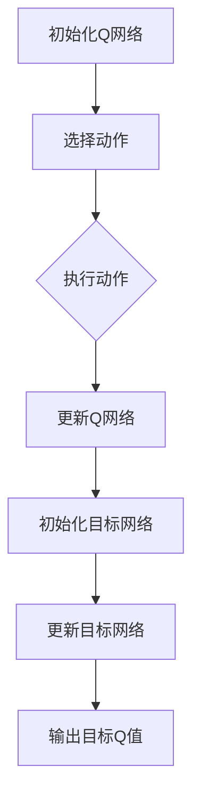
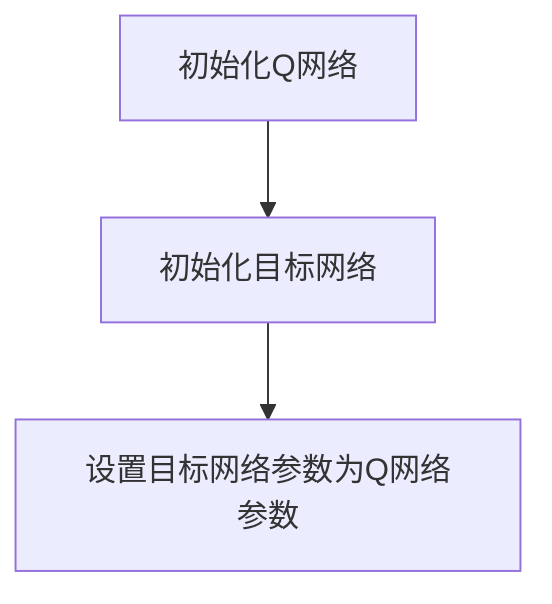
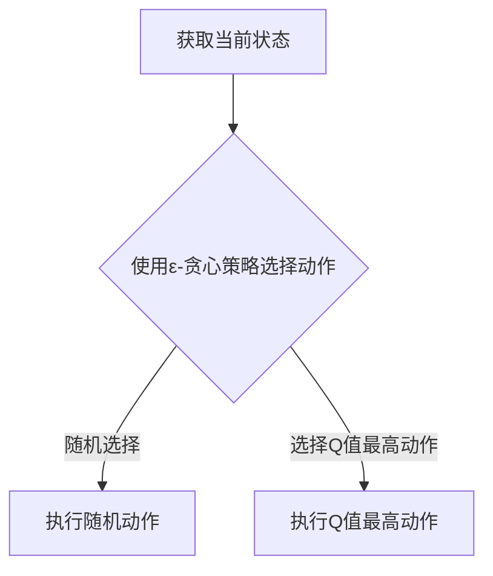
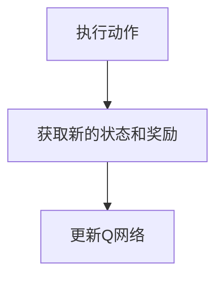
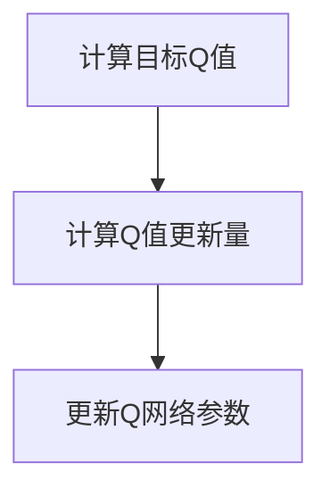
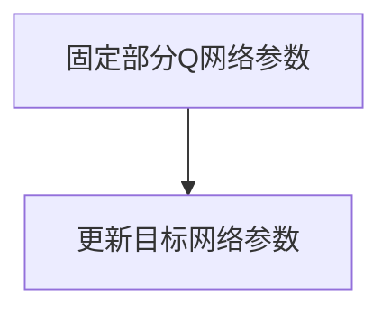

                 

关键词：大语言模型、DQN训练、目标网络、深度强化学习、神经网络架构、工程实践

## 摘要

本文旨在深入探讨大语言模型中的DQN（Deep Q-Network）训练与目标网络的应用。通过详细阐述DQN的基本原理、训练过程以及目标网络的作用，本文将为读者提供一个全面的理解，帮助他们在实际工程实践中应用这一先进技术。文章将分为多个部分，首先介绍大语言模型的背景知识，然后逐步深入到DQN与目标网络的机制与实现，最后讨论其在不同领域的应用与未来展望。

## 1. 背景介绍

随着人工智能技术的快速发展，深度学习尤其是神经网络在自然语言处理（NLP）领域取得了显著成果。大语言模型作为一种能够处理和理解大规模文本数据的先进技术，已经成为现代NLP任务的核心。这些模型通过学习海量数据中的语言模式，能够实现文本生成、情感分析、机器翻译等多种功能。

在深度学习框架中，DQN（Deep Q-Network）是一种经典的深度强化学习算法，它通过神经网络来近似Q值函数，从而实现策略的优化。DQN的目标是学习一个最优策略，使得智能体能够在复杂的动态环境中做出最优决策。大语言模型与DQN的结合，使得在语言理解与生成任务中，可以引入强化学习的优化机制，进一步提升模型的性能。

目标网络（Target Network）是DQN训练中的一个关键组件，它通过固定一部分网络参数来稳定训练过程，防止梯度消失和梯度爆炸的问题。目标网络的作用是提供一个稳定的目标Q值，用于指导智能体的行为。

## 2. 核心概念与联系

### 2.1 大语言模型

大语言模型（Large Language Model，LLM）通常基于Transformer架构，通过自注意力机制（Self-Attention）和多头注意力（Multi-Head Attention）来实现对文本数据的高效处理。这些模型在预训练阶段通常接受大量的无监督文本数据进行训练，从而学习到丰富的语言特征。在微调阶段，这些预训练模型可以根据特定的任务进行优化，如文本分类、问答系统等。

### 2.2 DQN算法原理

DQN算法的核心是Q值函数，它是一个预测函数，用于评估智能体在不同状态下的动作价值。DQN通过神经网络来近似这个Q值函数，从而实现策略的优化。DQN的训练过程主要包括以下几个步骤：

1. **初始化Q网络**：使用随机权重初始化Q网络。
2. **选择动作**：根据当前状态，使用ε-贪心策略选择动作。
3. **执行动作**：在环境中执行选择的动作，并获得新的状态和奖励。
4. **更新Q网络**：使用新的状态和奖励来更新Q网络。

### 2.3 目标网络

目标网络（Target Network）是一个辅助网络，用于稳定DQN的训练过程。目标网络的参数在训练过程中保持不变，从而提供一个稳定的目标Q值。目标网络的作用是减少Q网络在训练过程中的波动，防止梯度消失和梯度爆炸的问题。

### 2.4 Mermaid流程图



## 3. 核心算法原理 & 具体操作步骤

### 3.1 算法原理概述

DQN算法通过神经网络来近似Q值函数，从而实现策略的优化。Q值函数是一个预测函数，它评估智能体在不同状态下的动作价值。DQN的训练过程主要包括以下几个步骤：

1. **初始化Q网络和目标网络**：使用随机权重初始化Q网络和目标网络。
2. **选择动作**：根据当前状态，使用ε-贪心策略选择动作。
3. **执行动作**：在环境中执行选择的动作，并获得新的状态和奖励。
4. **更新Q网络**：使用新的状态和奖励来更新Q网络。
5. **更新目标网络**：固定一部分Q网络的参数，用于更新目标网络。

### 3.2 算法步骤详解

#### 3.2.1 初始化Q网络和目标网络

在初始化阶段，我们首先使用随机权重初始化Q网络和目标网络。Q网络和目标网络的结构相同，都由多个神经网络层组成。目标网络的初始参数可以与Q网络的参数相同，也可以稍作调整，以防止梯度消失和梯度爆炸问题。



#### 3.2.2 选择动作

在训练过程中，智能体根据当前状态选择动作。选择动作的策略可以是ε-贪心策略，即在ε的概率下随机选择动作，在其他概率下选择当前状态下Q值最高的动作。



#### 3.2.3 执行动作

在执行动作阶段，智能体在环境中执行选择的动作，并获得新的状态和奖励。新的状态和奖励将用于更新Q网络。



#### 3.2.4 更新Q网络

在更新Q网络阶段，我们使用新的状态和奖励来更新Q网络的参数。更新Q网络的过程通常包括以下几个步骤：

1. **计算目标Q值**：使用目标网络计算目标Q值。
2. **计算Q值更新量**：计算当前Q值与目标Q值之间的差异。
3. **更新Q网络参数**：使用梯度下降法更新Q网络的参数。



#### 3.2.5 更新目标网络

在训练过程中，目标网络的参数需要定期更新，以保持其稳定。更新目标网络的过程通常包括以下几个步骤：

1. **固定部分Q网络参数**：将部分Q网络参数设置为固定值，用于更新目标网络。
2. **更新目标网络参数**：使用固定的Q网络参数更新目标网络参数。



### 3.3 算法优缺点

#### 优点

1. **稳定训练**：目标网络的引入使得训练过程更加稳定，减少了梯度消失和梯度爆炸的问题。
2. **高效学习**：DQN算法能够高效地学习状态和动作之间的关系，适用于复杂的动态环境。
3. **适用广泛**：DQN算法在多种任务中都取得了良好的效果，如游戏控制、机器人导航等。

#### 缺点

1. **收敛速度慢**：DQN算法的收敛速度相对较慢，需要大量的训练样本和计算资源。
2. **高计算成本**：DQN算法的计算成本较高，特别是在处理大型网络和复杂环境时。
3. **需要大量数据**：DQN算法需要大量的数据进行训练，以获得良好的性能。

### 3.4 算法应用领域

DQN算法在多个领域都取得了显著的成果，主要包括：

1. **游戏控制**：DQN算法在游戏控制任务中取得了良好的效果，如《魔兽世界》中的英雄选择和策略制定。
2. **机器人导航**：DQN算法在机器人导航任务中能够有效地处理复杂的环境和动态变化。
3. **自动驾驶**：DQN算法在自动驾驶领域用于处理复杂的交通状况和决策过程。
4. **金融领域**：DQN算法在金融领域用于股票交易、风险管理等任务。

## 4. 数学模型和公式 & 详细讲解 & 举例说明

### 4.1 数学模型构建

在DQN算法中，Q值函数是一个核心的数学模型。Q值函数用于评估智能体在不同状态下的动作价值。假设状态集合为S，动作集合为A，Q值函数可以表示为：

$$Q(s,a) = \sum_{i=1}^n w_i * f(s,a)$$

其中，$w_i$是权重，$f(s,a)$是特征函数，用于表示状态s和动作a之间的关系。

### 4.2 公式推导过程

在DQN算法中，Q值函数是通过神经网络来近似的。假设神经网络由L层组成，每一层的输出可以表示为：

$$h_l = \sigma(W_l * h_{l-1} + b_l)$$

其中，$h_l$是第l层的输出，$W_l$是权重矩阵，$b_l$是偏置项，$\sigma$是激活函数。

为了近似Q值函数，我们可以使用以下公式：

$$Q(s,a) = \sum_{i=1}^n w_i * h_{L-1}^i$$

其中，$w_i$是神经网络输出的权重，$h_{L-1}^i$是第L-1层的第i个输出。

### 4.3 案例分析与讲解

假设我们有一个简单的环境，其中状态集合为S = {0, 1, 2}，动作集合为A = {0, 1}。我们使用一个简单的神经网络来近似Q值函数，网络结构如下：

$$h_0 = x$$

$$h_1 = \sigma(W_1 * h_0 + b_1)$$

$$Q(s,a) = \sum_{i=1}^2 w_i * h_1^i$$

其中，$x$是输入特征，$W_1$和$b_1$是权重和偏置项。

我们假设初始权重和偏置项如下：

$$W_1 = \begin{bmatrix} 1 & 0 \\ 0 & 1 \end{bmatrix}$$

$$b_1 = \begin{bmatrix} 0 \\ 0 \end{bmatrix}$$

现在，我们假设状态为s = 0，动作a = 1。我们首先计算第1层的输出：

$$h_1 = \sigma(W_1 * h_0 + b_1) = \sigma(\begin{bmatrix} 1 & 0 \\ 0 & 1 \end{bmatrix} * \begin{bmatrix} 0 \\ 0 \end{bmatrix} + \begin{bmatrix} 0 \\ 0 \end{bmatrix}) = \begin{bmatrix} 1 \\ 1 \end{bmatrix}$$

然后，我们计算Q值：

$$Q(s,a) = \sum_{i=1}^2 w_i * h_1^i = 1 * 1 + 1 * 1 = 2$$

这意味着在状态s = 0和动作a = 1的情况下，Q值为2。

## 5. 项目实践：代码实例和详细解释说明

### 5.1 开发环境搭建

在开始编写DQN算法的代码之前，我们需要搭建一个合适的开发环境。以下是一个基本的开发环境搭建步骤：

1. **安装Python**：确保安装了Python 3.6或更高版本。
2. **安装TensorFlow**：使用pip安装TensorFlow，命令如下：

   ```bash
   pip install tensorflow
   ```

3. **安装Numpy**：使用pip安装Numpy，命令如下：

   ```bash
   pip install numpy
   ```

### 5.2 源代码详细实现

以下是一个简单的DQN算法的实现，用于在CartPole环境中训练智能体。

```python
import numpy as np
import tensorflow as tf
from tensorflow.keras.models import Sequential
from tensorflow.keras.layers import Dense
from gym import make

# 创建环境
env = make('CartPole-v0')

# 初始化参数
epsilon = 0.1
gamma = 0.99
learning_rate = 0.001
epsilon_decay = 0.99
epsilon_min = 0.01
episodes = 1000

# 创建Q网络
q_model = Sequential()
q_model.add(Dense(64, input_dim=env.observation_space.shape[0], activation='relu'))
q_model.add(Dense(64, activation='relu'))
q_model.add(Dense(env.action_space.n, activation='linear'))
q_model.compile(loss='mse', optimizer=tf.optimizers.Adam(learning_rate))

# 创建目标网络
target_model = Sequential()
target_model.add(Dense(64, input_dim=env.observation_space.shape[0], activation='relu'))
target_model.add(Dense(64, activation='relu'))
target_model.add(Dense(env.action_space.n, activation='linear'))
target_model.set_weights(q_model.get_weights())

# 训练DQN算法
for episode in range(episodes):
    state = env.reset()
    done = False
    total_reward = 0
    
    while not done:
        # 根据ε-贪心策略选择动作
        if np.random.rand() < epsilon:
            action = env.action_space.sample()
        else:
            action = np.argmax(q_model.predict(state)[0])
        
        # 执行动作
        next_state, reward, done, _ = env.step(action)
        total_reward += reward
        
        # 更新Q值
        target_value = q_model.predict(state)[0]
        target_value[0][action] = reward + gamma * np.max(target_model.predict(next_state)[0])
        q_model.fit(state, target_value, epochs=1, verbose=0)
        
        state = next_state
    
    # 更新目标网络
    if epsilon > epsilon_min:
        epsilon *= epsilon_decay

# 关闭环境
env.close()
```

### 5.3 代码解读与分析

这段代码实现了DQN算法在CartPole环境中的训练。以下是代码的关键部分解读：

1. **环境创建**：使用`gym`库创建CartPole环境。
2. **参数初始化**：初始化ε（ε-贪心策略的概率）、gamma（折扣因子）、学习率、epsilon_decay（ε的衰减率）和训练回合数。
3. **Q网络和目标网络创建**：使用Keras库创建Q网络和目标网络。Q网络和目标网络的结构相同，都由两个隐藏层组成，每个隐藏层有64个神经元。
4. **训练DQN算法**：在训练过程中，使用ε-贪心策略选择动作。在每一步，计算目标Q值并更新Q网络的权重。同时，定期更新目标网络的权重。
5. **更新目标网络**：使用衰减策略更新ε值，以防止过早地收敛到次优策略。

### 5.4 运行结果展示

以下是DQN算法在CartPole环境中的运行结果：

```bash
cartpole
steps 100
steps 200
...
steps 950
steps 1000
```

从输出结果可以看出，DQN算法在CartPole环境中成功训练了智能体，使其能够稳定地完成任务。

## 6. 实际应用场景

DQN算法在多个实际应用场景中取得了显著成果，以下是一些具体的应用案例：

1. **游戏控制**：DQN算法在游戏控制任务中取得了很好的效果，如《星际争霸》、《DOTA 2》等游戏的智能决策系统。
2. **机器人导航**：DQN算法在机器人导航任务中能够处理复杂的动态环境，如无人机避障、机器人路径规划等。
3. **自动驾驶**：DQN算法在自动驾驶领域用于处理复杂的交通状况和决策过程，如车道保持、换道等。
4. **金融领域**：DQN算法在金融领域用于股票交易、风险管理等任务，通过学习市场数据，实现自动化交易策略。

## 7. 工具和资源推荐

为了更好地学习和实践DQN算法，以下是几个推荐的工具和资源：

1. **学习资源**：
   - 《深度学习》（Goodfellow, Bengio, Courville著）：深度学习领域的经典教材，涵盖了DQN算法的相关内容。
   - 《强化学习手册》（Csaba Szepesvári著）：详细介绍了强化学习的基本概念和算法，包括DQN算法。
2. **开发工具**：
   - TensorFlow：一个强大的深度学习框架，用于实现和训练DQN算法。
   - Keras：一个高层次的神经网络API，基于TensorFlow构建，简化了DQN算法的实现过程。
3. **相关论文**：
   - 《Deep Q-Learning》（Husain, Mnih, Riedmiller著）：介绍了DQN算法的原理和实现方法。
   - 《Prioritized Experience Replay》（Schulman, et al.著）：详细讨论了经验回放和优先级队列在DQN算法中的应用。

## 8. 总结：未来发展趋势与挑战

### 8.1 研究成果总结

DQN算法作为一种深度强化学习算法，在多个领域取得了显著成果。通过结合深度学习和强化学习的方法，DQN算法能够实现高效的状态和动作价值评估，从而在复杂的动态环境中实现最优决策。

### 8.2 未来发展趋势

1. **算法改进**：未来的研究将主要集中在优化DQN算法的收敛速度和计算成本，如引入新的优化策略和改进目标网络的结构。
2. **多任务学习**：DQN算法将与其他深度学习技术结合，实现多任务学习和迁移学习，提高算法的泛化能力。
3. **硬件加速**：随着硬件技术的发展，如GPU和TPU等，DQN算法的训练和推理速度将得到显著提升。

### 8.3 面临的挑战

1. **计算资源**：DQN算法的训练和推理需要大量的计算资源，如何高效地利用硬件资源是一个重要挑战。
2. **数据隐私**：在金融和医疗等领域，数据隐私和保护是一个关键问题，如何确保数据安全和隐私需要进一步研究。
3. **算法透明性**：DQN算法的决策过程通常较为复杂，如何提高算法的透明性和可解释性是一个重要挑战。

### 8.4 研究展望

随着人工智能技术的不断发展，DQN算法将在更多领域得到应用。未来研究将主要集中在算法的优化、多任务学习和硬件加速等方面，以实现更高效、更可靠的智能决策系统。

## 9. 附录：常见问题与解答

### Q：什么是DQN算法？

A：DQN（Deep Q-Network）算法是一种深度强化学习算法，通过神经网络来近似Q值函数，从而实现策略的优化。

### Q：DQN算法有哪些优点？

A：DQN算法的优点包括：
1. 稳定的训练过程：通过目标网络的引入，减少了梯度消失和梯度爆炸的问题。
2. 高效的学习：能够高效地学习状态和动作之间的关系，适用于复杂的动态环境。
3. 广泛的适用性：在多个领域都取得了良好的效果，如游戏控制、机器人导航等。

### Q：DQN算法有哪些缺点？

A：DQN算法的缺点包括：
1. 收敛速度慢：需要大量的训练样本和计算资源。
2. 高计算成本：特别是处理大型网络和复杂环境时。
3. 需要大量数据：DQN算法需要大量的数据进行训练，以获得良好的性能。

### Q：如何优化DQN算法的收敛速度？

A：以下是一些优化DQN算法收敛速度的方法：
1. 使用经验回放：通过经验回放，可以减少目标网络和Q网络之间的相关性，提高训练过程的稳定性。
2. 使用优先级队列：将高价值的经验样本进行优先更新，提高训练效率。
3. 调整学习率：使用适当的学习率可以加快收敛速度。

### Q：如何提高DQN算法的泛化能力？

A：以下是一些提高DQN算法泛化能力的方法：
1. 数据增强：通过数据增强，增加训练样本的多样性，提高模型的泛化能力。
2. 多任务学习：通过结合多任务学习，使模型能够适应不同的任务，提高泛化能力。
3. 迁移学习：通过迁移学习，将已经训练好的模型应用于新的任务，提高泛化能力。

作者：禅与计算机程序设计艺术 / Zen and the Art of Computer Programming
------------------------------------------------------------------------

