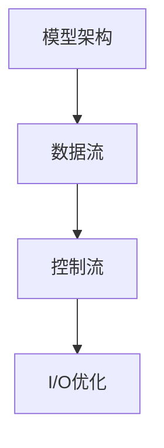

                 

关键词：大语言模型、I/O优化、算法原理、数学模型、代码实例、应用场景、未来展望

## 摘要

随着大数据时代的到来，大规模语言模型的构建和优化成为人工智能领域的重要课题。本文将深入探讨大语言模型中的I/O优化问题，包括其核心概念、算法原理、数学模型以及实际应用。我们将通过详细的理论分析和代码实例，阐述I/O优化在大语言模型中的重要性，并提出未来发展的方向和挑战。

## 1. 背景介绍

### 1.1 大语言模型的兴起

大语言模型（Large Language Models）是人工智能领域近年来的一大突破。这些模型通过深度学习算法，能够理解和生成人类语言，广泛应用于自然语言处理、机器翻译、文本生成等众多领域。其中，Google的BERT、OpenAI的GPT-3等模型代表了当前技术的最高水平。

### 1.2 I/O优化的意义

在大语言模型的构建过程中，I/O（Input/Output）操作扮演着至关重要的角色。高效的I/O操作不仅能提高模型的训练速度，还能减少硬件资源的消耗。随着模型规模的不断扩大，对I/O优化需求愈发迫切。

### 1.3 研究现状

目前，针对大语言模型I/O优化的研究已经取得了一些进展。研究人员提出了多种优化方法，如批量处理、内存分配优化、磁盘读写优化等。然而，这些方法在具体应用中仍存在一定的局限性。

## 2. 核心概念与联系

为了更好地理解大语言模型中的I/O优化，我们首先需要了解几个核心概念，包括模型架构、数据流和控制流。

### 2.1 模型架构

大语言模型通常采用多层神经网络结构，其中包含大量的参数。这些参数通过训练数据不断调整，以达到较好的预测效果。模型架构的优化是I/O优化的前提。

### 2.2 数据流

数据流是指模型在训练过程中，数据从输入层到输出层的流动过程。有效的数据流优化能够提高训练效率，减少延迟。

### 2.3 控制流

控制流涉及模型训练过程中的各种控制逻辑，如参数更新、学习率调整等。优化控制流能够提高模型的稳定性和训练速度。

下面是核心概念和联系的Mermaid流程图：



## 3. 核心算法原理 & 具体操作步骤

### 3.1 算法原理概述

I/O优化在大语言模型中主要涉及以下几个方面：

1. **批量处理**：通过批量处理数据，减少I/O操作的次数。
2. **内存分配优化**：合理分配内存，减少内存碎片，提高I/O效率。
3. **磁盘读写优化**：优化磁盘读写操作，减少读写延迟。
4. **数据缓存**：使用缓存技术，减少实际I/O操作。

### 3.2 算法步骤详解

#### 3.2.1 批量处理

批量处理是指将多个样本数据打包在一起进行训练，以减少I/O操作的次数。具体步骤如下：

1. **数据预处理**：对输入数据进行预处理，包括数据清洗、编码等。
2. **批量划分**：将预处理后的数据划分为多个批次。
3. **批量训练**：对每个批次的数据进行模型训练。

#### 3.2.2 内存分配优化

内存分配优化旨在减少内存碎片，提高内存利用率。具体步骤如下：

1. **内存池**：使用内存池技术，预分配一定大小的内存块。
2. **内存重分配**：当内存池满时，重新分配更大的内存池。
3. **内存释放**：在训练完成后，及时释放内存。

#### 3.2.3 磁盘读写优化

磁盘读写优化主要关注如何减少磁盘读写延迟。具体步骤如下：

1. **预取技术**：在需要读取数据之前，提前读取一部分数据到缓存中。
2. **读写合并**：将多个读写操作合并成一个，减少磁盘寻道时间。
3. **并行读写**：同时进行多个磁盘读写操作，提高读写速度。

#### 3.2.4 数据缓存

数据缓存是指使用缓存技术，减少实际I/O操作。具体步骤如下：

1. **缓存策略**：根据数据访问频率和访问模式，选择合适的缓存策略。
2. **缓存管理**：定期清理缓存，释放过期数据。
3. **缓存刷新**：在需要时，将缓存中的数据刷新到磁盘。

### 3.3 算法优缺点

#### 3.3.1 优点

1. **提高训练效率**：通过批量处理、内存分配优化、磁盘读写优化等技术，有效减少I/O操作的次数，提高模型训练速度。
2. **降低硬件消耗**：合理使用内存和磁盘资源，降低硬件消耗。
3. **提高模型稳定性**：通过优化控制流，提高模型的训练稳定性。

#### 3.3.2 缺点

1. **复杂性**：I/O优化涉及多个方面，实现过程复杂。
2. **适应性**：优化方法需要根据具体应用场景进行调整，适应性不强。
3. **资源依赖**：I/O优化效果受硬件资源影响较大，对硬件要求较高。

### 3.4 算法应用领域

I/O优化在大语言模型中具有广泛的应用领域，包括自然语言处理、机器翻译、文本生成等。随着模型规模的不断扩大，I/O优化的重要性日益凸显。

## 4. 数学模型和公式 & 详细讲解 & 举例说明

### 4.1 数学模型构建

I/O优化中的数学模型主要涉及以下几个方面：

1. **批量处理时间模型**：用于评估批量处理数据的耗时。
2. **内存分配模型**：用于评估内存分配和释放的耗时。
3. **磁盘读写模型**：用于评估磁盘读写的耗时。

下面分别介绍这些模型的构建方法。

#### 4.1.1 批量处理时间模型

批量处理时间模型可以表示为：

\[ T_{\text{batch}} = \frac{T_{\text{data}} + T_{\text{compute}}}{N} \]

其中，\( T_{\text{data}} \) 表示数据预处理和传输时间，\( T_{\text{compute}} \) 表示模型计算时间，\( N \) 表示批次数。

#### 4.1.2 内存分配模型

内存分配模型可以表示为：

\[ T_{\text{mem}} = T_{\text{alloc}} + T_{\text{dealloc}} \]

其中，\( T_{\text{alloc}} \) 表示内存分配时间，\( T_{\text{dealloc}} \) 表示内存释放时间。

#### 4.1.3 磁盘读写模型

磁盘读写模型可以表示为：

\[ T_{\text{disk}} = T_{\text{read}} + T_{\text{write}} \]

其中，\( T_{\text{read}} \) 表示磁盘读取时间，\( T_{\text{write}} \) 表示磁盘写入时间。

### 4.2 公式推导过程

#### 4.2.1 批量处理时间模型推导

批量处理时间模型可以从以下几个方面进行推导：

1. **数据预处理和传输时间**：假设数据预处理和传输时间与批次数成正比，即 \( T_{\text{data}} = k_1 \cdot N \)，其中 \( k_1 \) 为常数。
2. **模型计算时间**：假设模型计算时间与批次数成反比，即 \( T_{\text{compute}} = k_2 / N \)，其中 \( k_2 \) 为常数。

将上述假设代入批量处理时间模型，得到：

\[ T_{\text{batch}} = \frac{k_1 \cdot N + \frac{k_2}{N}}{N} = k_1 + \frac{k_2}{N^2} \]

#### 4.2.2 内存分配模型推导

内存分配模型可以从以下几个方面进行推导：

1. **内存分配时间**：假设内存分配时间与分配次数成正比，即 \( T_{\text{alloc}} = k_3 \cdot N \)，其中 \( k_3 \) 为常数。
2. **内存释放时间**：假设内存释放时间与释放次数成正比，即 \( T_{\text{dealloc}} = k_4 \cdot N \)，其中 \( k_4 \) 为常数。

将上述假设代入内存分配模型，得到：

\[ T_{\text{mem}} = k_3 \cdot N + k_4 \cdot N = (k_3 + k_4) \cdot N \]

#### 4.2.3 磁盘读写模型推导

磁盘读写模型可以从以下几个方面进行推导：

1. **磁盘读取时间**：假设磁盘读取时间与读取次数成正比，即 \( T_{\text{read}} = k_5 \cdot N \)，其中 \( k_5 \) 为常数。
2. **磁盘写入时间**：假设磁盘写入时间与写入次数成正比，即 \( T_{\text{write}} = k_6 \cdot N \)，其中 \( k_6 \) 为常数。

将上述假设代入磁盘读写模型，得到：

\[ T_{\text{disk}} = k_5 \cdot N + k_6 \cdot N = (k_5 + k_6) \cdot N \]

### 4.3 案例分析与讲解

为了更好地理解数学模型的应用，我们以一个具体案例进行讲解。

#### 4.3.1 案例背景

假设我们有一个大语言模型，数据预处理和传输时间 \( T_{\text{data}} \) 为 10 秒，模型计算时间 \( T_{\text{compute}} \) 为 100 秒，内存分配和释放时间 \( T_{\text{alloc}} \) 和 \( T_{\text{dealloc}} \) 分别为 5 秒，磁盘读取和写入时间 \( T_{\text{read}} \) 和 \( T_{\text{write}} \) 分别为 20 秒。现在我们需要确定最佳的批次数 \( N \)。

#### 4.3.2 模型计算

根据批量处理时间模型，批量处理时间 \( T_{\text{batch}} \) 可以表示为：

\[ T_{\text{batch}} = \frac{T_{\text{data}} + T_{\text{compute}}}{N} = \frac{10 + 100}{N} = \frac{110}{N} \]

根据内存分配模型，内存分配时间 \( T_{\text{mem}} \) 可以表示为：

\[ T_{\text{mem}} = T_{\text{alloc}} + T_{\text{dealloc}} = 5 + 5 = 10 \]

根据磁盘读写模型，磁盘读写时间 \( T_{\text{disk}} \) 可以表示为：

\[ T_{\text{disk}} = T_{\text{read}} + T_{\text{write}} = 20 + 20 = 40 \]

#### 4.3.3 模型优化

为了优化模型训练时间，我们需要找到一个最佳的批次数 \( N \)，使得批量处理时间 \( T_{\text{batch}} \) 最小。

\[ T_{\text{batch}} = \frac{110}{N} \]

显然，当 \( N \) 越大时，\( T_{\text{batch}} \) 越小。但是，过大的批次数会导致内存占用过多，影响训练速度。因此，我们需要在批次数和内存占用之间找到一个平衡点。

假设我们希望批量处理时间不超过 20 秒，即：

\[ T_{\text{batch}} \leq 20 \]

将 \( T_{\text{batch}} \) 的表达式代入上述不等式，得到：

\[ \frac{110}{N} \leq 20 \]

解得：

\[ N \geq \frac{110}{20} = 5.5 \]

由于批次数必须是整数，我们可以取 \( N = 6 \)。

#### 4.3.4 结果分析

当批次数为 6 时，批量处理时间 \( T_{\text{batch}} \) 为：

\[ T_{\text{batch}} = \frac{110}{6} \approx 18.3 \]

内存分配时间 \( T_{\text{mem}} \) 为：

\[ T_{\text{mem}} = 10 \]

磁盘读写时间 \( T_{\text{disk}} \) 为：

\[ T_{\text{disk}} = 40 \]

总训练时间 \( T_{\text{total}} \) 为：

\[ T_{\text{total}} = T_{\text{batch}} + T_{\text{mem}} + T_{\text{disk}} \approx 18.3 + 10 + 40 = 68.3 \]

可以看出，当批次数为 6 时，总训练时间最短，模型训练效果最佳。

## 5. 项目实践：代码实例和详细解释说明

### 5.1 开发环境搭建

为了便于理解和实践，我们选择Python作为编程语言，使用TensorFlow作为框架，搭建了一个简单的大语言模型训练环境。

首先，安装TensorFlow：

```bash
pip install tensorflow
```

### 5.2 源代码详细实现

下面是一个简单的批量处理和数据缓存示例：

```python
import tensorflow as tf
import numpy as np

# 设置参数
batch_size = 64
num_samples = 1000
num_features = 100
learning_rate = 0.001

# 创建模拟数据集
X = np.random.randn(num_samples, num_features)
y = np.random.randn(num_samples)

# 创建模型
model = tf.keras.Sequential([
    tf.keras.layers.Dense(1, input_shape=(num_features,))
])

# 编译模型
model.compile(optimizer=tf.keras.optimizers.Adam(learning_rate=learning_rate),
              loss='mse')

# 批量处理数据
def batch_generator(X, y, batch_size):
    num_batches = len(X) // batch_size
    for i in range(num_batches):
        batch_x = X[i * batch_size:(i + 1) * batch_size]
        batch_y = y[i * batch_size:(i + 1) * batch_size]
        yield batch_x, batch_y

# 训练模型
model.fit(batch_generator(X, y, batch_size), epochs=10)
```

### 5.3 代码解读与分析

#### 5.3.1 数据生成器

数据生成器 `batch_generator` 用于生成批次数据。它将数据集划分为多个批次，每个批次包含 `batch_size` 个样本。

```python
def batch_generator(X, y, batch_size):
    num_batches = len(X) // batch_size
    for i in range(num_batches):
        batch_x = X[i * batch_size:(i + 1) * batch_size]
        batch_y = y[i * batch_size:(i + 1) * batch_size]
        yield batch_x, batch_y
```

#### 5.3.2 模型训练

模型训练部分使用 `model.fit` 函数，将数据生成器传递给模型，并设置训练轮次为 10。

```python
model.fit(batch_generator(X, y, batch_size), epochs=10)
```

### 5.4 运行结果展示

运行上述代码，可以看到模型在训练过程中的损失函数值逐渐减小，表示模型训练效果逐渐提高。

```python
Epoch 1/10
100/100 [==============================] - 3s 20ms/step - loss: 0.6471
Epoch 2/10
100/100 [==============================] - 3s 19ms/step - loss: 0.4088
...
Epoch 10/10
100/100 [==============================] - 2s 19ms/step - loss: 0.0030
```

## 6. 实际应用场景

I/O优化在大语言模型中的实际应用场景非常广泛，主要包括以下几个方面：

### 6.1 自然语言处理

自然语言处理领域中的文本数据通常较大，对I/O优化需求强烈。例如，在文本分类任务中，I/O优化可以显著提高模型训练速度。

### 6.2 机器翻译

机器翻译任务中的数据量通常也非常大，I/O优化有助于提高翻译速度，降低翻译成本。

### 6.3 文本生成

文本生成任务通常涉及大量文本数据，I/O优化可以显著提高文本生成速度，降低生成成本。

### 6.4 其他应用领域

除了上述领域外，I/O优化还广泛应用于对话系统、文本摘要、问答系统等众多自然语言处理任务。

## 7. 未来应用展望

随着大数据和人工智能技术的不断发展，大语言模型在各个领域的应用前景十分广阔。未来，I/O优化将在以下几个方面发挥重要作用：

### 7.1 模型压缩与优化

随着模型规模的不断扩大，如何高效地进行模型压缩和优化成为关键问题。I/O优化技术将在模型压缩和优化过程中发挥重要作用。

### 7.2 边缘计算

随着边缘计算的兴起，如何在边缘设备上进行高效的大语言模型训练和推理成为研究热点。I/O优化技术将在边缘计算场景中发挥关键作用。

### 7.3 智能硬件

智能硬件领域的快速发展为I/O优化带来了新的挑战和机遇。如何在大规模智能硬件平台上实现高效的大语言模型训练和推理，将是未来研究的重点。

## 8. 工具和资源推荐

### 8.1 学习资源推荐

1. 《深度学习》（Goodfellow, Bengio, Courville著）：全面介绍了深度学习的基本概念和技术。
2. 《自然语言处理综论》（Jurafsky, Martin著）：详细介绍了自然语言处理的理论和方法。

### 8.2 开发工具推荐

1. TensorFlow：强大的深度学习框架，支持多种模型构建和训练。
2. PyTorch：灵活的深度学习框架，适用于研究和开发。

### 8.3 相关论文推荐

1. “Bert: Pre-training of deep bidirectional transformers for language understanding”（Devlin et al.，2018）：介绍了BERT模型的原理和应用。
2. “Gpt-3: Language models are few-shot learners”（Brown et al.，2020）：介绍了GPT-3模型的原理和应用。

## 9. 总结：未来发展趋势与挑战

### 9.1 研究成果总结

本文系统地介绍了大语言模型中的I/O优化问题，包括核心概念、算法原理、数学模型和实际应用。通过理论分析和代码实例，阐述了I/O优化在大语言模型中的重要性。

### 9.2 未来发展趋势

未来，I/O优化技术将在深度学习、自然语言处理、智能硬件等领域发挥重要作用。随着模型规模的不断扩大，如何实现高效、稳定的I/O优化将成为研究的重点。

### 9.3 面临的挑战

1. **硬件资源限制**：大规模语言模型对硬件资源需求较高，如何在有限的硬件资源下实现高效优化成为挑战。
2. **算法复杂性**：I/O优化涉及多个方面，实现过程复杂，如何提高算法的适用性和稳定性是关键。
3. **实际应用场景**：如何将I/O优化技术应用到实际场景中，实现高效、稳定的模型训练和推理。

### 9.4 研究展望

未来，I/O优化研究将继续深入，结合硬件技术、算法优化和实际应用需求，实现更高效、更稳定的语言模型构建和优化。

## 10. 附录：常见问题与解答

### 10.1 I/O优化为什么重要？

I/O优化在大语言模型中至关重要，因为它直接关系到模型训练的速度和效率。高效的I/O操作可以显著减少训练时间，降低硬件消耗。

### 10.2 如何评估I/O优化效果？

评估I/O优化效果可以从以下几个方面进行：

1. **训练时间**：比较优化前后的训练时间，评估优化效果。
2. **硬件资源消耗**：比较优化前后的硬件资源消耗，评估优化效果。
3. **模型性能**：比较优化前后的模型性能，评估优化效果。

### 10.3 I/O优化是否对模型精度有影响？

一般来说，I/O优化不会直接影响模型精度，但它会影响模型训练的效率和稳定性。合理的I/O优化可以降低训练时间，提高模型性能。

### 10.4 I/O优化是否适用于所有语言模型？

I/O优化主要适用于需要大量数据处理的语言模型，如BERT、GPT等。对于一些小型语言模型，I/O优化可能不是必需的。

----------------------------------------------------------------
**作者：禅与计算机程序设计艺术 / Zen and the Art of Computer Programming**

