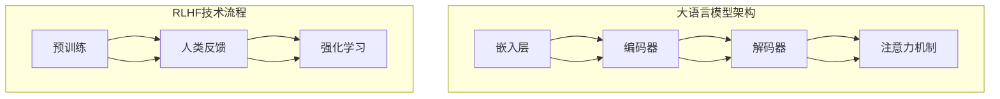

                 

 大语言模型（Large Language Model）作为一种强大的自然语言处理工具，已经成为当今人工智能领域的热点。而RLHF（Reinforcement Learning from Human Feedback，强化学习与人反馈）作为大语言模型训练中的重要技术，更是引起了广泛关注。本文将围绕大语言模型的原理、工程实践以及RLHF技术进行深入探讨，力求为读者提供一套完整的技术实战框架。

> 关键词：大语言模型、RLHF、自然语言处理、强化学习、工程实践

## 摘要

本文主要介绍了大语言模型的原理及其工程实践。首先，我们回顾了自然语言处理的发展历程，并探讨了大语言模型的基本原理。接着，我们详细阐述了RLHF技术的核心概念、算法原理以及在实际应用中的操作步骤。在此基础上，我们通过一个具体的数学模型和公式，深入分析了大语言模型中的关键要素。随后，我们以代码实例为基础，对大语言模型的实现过程进行了详细解读。最后，我们探讨了大语言模型在实际应用场景中的表现以及未来的发展趋势与挑战。

## 1. 背景介绍

### 自然语言处理的发展历程

自然语言处理（Natural Language Processing，NLP）作为人工智能领域的一个重要分支，旨在让计算机理解和处理人类语言。自20世纪50年代以来，NLP经历了多个发展阶段：

- **早期探索（1950s-1960s）**：这一阶段以符号主义方法为代表，试图通过手工定义语法规则和语义关系来实现语言处理。然而，由于语言本身的复杂性和多样性，这一方法很快遇到了瓶颈。

- **统计方法兴起（1970s-1980s）**：随着计算机性能的提高和数据量的增加，统计方法逐渐成为NLP的主流。这一阶段主要关注语言模型的构建，如N元语法、决策树、支持向量机等。

- **深度学习时代（2010s至今）**：深度学习的崛起为NLP带来了革命性的变化。通过神经网络模型，如循环神经网络（RNN）、长短时记忆网络（LSTM）和变压器（Transformer），大语言模型得到了快速发展。以BERT、GPT、T5等为代表的大语言模型在各类NLP任务中取得了显著成果。

### 大语言模型的基本原理

大语言模型是一种基于深度学习的自然语言处理模型，其核心思想是通过学习海量语料，使其能够理解并生成自然语言。大语言模型主要包括以下几个关键组成部分：

- **嵌入层（Embedding Layer）**：将单词、短语或句子转换为高维向量表示，为后续的神经网络处理提供输入。

- **编码器（Encoder）**：通常采用变压器（Transformer）结构，对输入序列进行处理，生成上下文表示。

- **解码器（Decoder）**：同样采用变压器结构，根据编码器生成的上下文表示，生成输出序列。

- **注意力机制（Attention Mechanism）**：使模型能够关注输入序列中重要的部分，从而提高处理效果。

大语言模型的基本原理可以概括为：通过学习大量文本数据，模型能够捕捉到语言中的统计规律和语义信息，从而实现对输入文本的生成、理解和推理。

### RLHF技术简介

RLHF（Reinforcement Learning from Human Feedback，强化学习与人反馈）是一种将强化学习与监督学习相结合的训练方法，主要用于训练具有可解释性和鲁棒性的模型。RLHF技术主要包括以下几个核心步骤：

- **预训练（Pre-training）**：使用大规模无监督数据对模型进行预训练，使其具备基本的语言理解和生成能力。

- **人类反馈（Human Feedback）**：通过人类评估员对模型生成的文本进行评估，提供反馈信号，指导模型进行优化。

- **强化学习（Reinforcement Learning）**：利用人类反馈信号，通过强化学习算法对模型进行迭代优化，使其在特定任务上表现更好。

RLHF技术的核心优势在于能够结合人类知识和模型学习能力，实现模型的可解释性和鲁棒性提升，从而在各类NLP任务中取得更好的效果。

## 2. 核心概念与联系

### 大语言模型架构

大语言模型的核心架构通常基于变压器（Transformer）结构，主要包括以下几个关键组件：

1. **嵌入层（Embedding Layer）**：将输入文本转换为高维向量表示，包括单词嵌入（Word Embedding）和位置嵌入（Positional Embedding）。

2. **编码器（Encoder）**：由多个变压器块（Transformer Block）组成，对输入序列进行处理，生成上下文表示。每个变压器块包括多头自注意力机制（Multi-Head Self-Attention）和前馈神经网络（Feedforward Neural Network）。

3. **解码器（Decoder）**：同样由多个变压器块组成，根据编码器生成的上下文表示，生成输出序列。解码器还包含交叉注意力机制（Cross-Attention），使解码器能够关注编码器的输出。

4. **注意力机制（Attention Mechanism）**：包括自注意力（Self-Attention）和交叉注意力（Cross-Attention），使模型能够关注输入序列中重要的部分，提高处理效果。

### RLHF技术流程

RLHF技术的核心流程包括以下几个步骤：

1. **预训练（Pre-training）**：使用大规模无监督数据对模型进行预训练，使其具备基本的语言理解和生成能力。预训练过程主要包括自回归语言建模（Autoregressive Language Modeling）和掩码语言建模（Masked Language Modeling）。

2. **人类反馈（Human Feedback）**：通过人类评估员对模型生成的文本进行评估，提供反馈信号，指导模型进行优化。评估指标包括文本质量、可读性、准确性等。

3. **强化学习（Reinforcement Learning）**：利用人类反馈信号，通过强化学习算法对模型进行迭代优化，使其在特定任务上表现更好。常见的强化学习算法包括策略梯度算法（Policy Gradient Algorithms）和深度确定性政策梯度（Deep Deterministic Policy Gradient，DDPG）。

### 关联与联系

大语言模型和RLHF技术之间存在紧密的联系。大语言模型为RLHF技术提供了强大的基础，使其能够通过大规模无监督数据进行预训练，并在特定任务上进行优化。而RLHF技术则通过引入人类反馈，使大语言模型在特定场景下具备更好的可解释性和鲁棒性，从而在实际应用中取得更好的效果。

### Mermaid 流程图

以下是大语言模型架构和RLHF技术流程的Mermaid流程图：



## 3. 核心算法原理 & 具体操作步骤

### 3.1 算法原理概述

大语言模型的核心算法是基于变压器的深度神经网络，其基本原理可以概括为以下几个步骤：

1. **嵌入层**：将输入文本转换为高维向量表示，包括单词嵌入和位置嵌入。

2. **编码器**：通过多个变压器块对输入序列进行处理，生成上下文表示。每个变压器块包括多头自注意力机制和前馈神经网络。

3. **解码器**：根据编码器生成的上下文表示，生成输出序列。解码器还包含交叉注意力机制。

4. **注意力机制**：使模型能够关注输入序列中重要的部分，提高处理效果。

RLHF技术则是在大语言模型的基础上，引入强化学习与人反馈，通过预训练和迭代优化，提高模型的可解释性和鲁棒性。

### 3.2 算法步骤详解

#### 大语言模型训练步骤

1. **数据准备**：收集大量文本数据，包括网页、新闻、书籍、社交媒体等。对数据进行清洗、分词、去停用词等预处理。

2. **嵌入层**：将输入文本转换为高维向量表示，包括单词嵌入和位置嵌入。

3. **编码器**：通过多个变压器块对输入序列进行处理，生成上下文表示。每个变压器块包括多头自注意力机制和前馈神经网络。

4. **解码器**：根据编码器生成的上下文表示，生成输出序列。解码器还包含交叉注意力机制。

5. **损失函数**：采用交叉熵损失函数，计算模型预测和真实标签之间的差距，用于指导模型优化。

6. **优化算法**：使用梯度下降算法，对模型参数进行迭代优化。

7. **评估指标**：采用词汇匹配率（Token-level Accuracy）、句子匹配率（Sentence-level Accuracy）等指标评估模型性能。

#### RLHF技术迭代优化步骤

1. **预训练**：使用大规模无监督数据对模型进行预训练，使其具备基本的语言理解和生成能力。

2. **人类反馈**：通过人类评估员对模型生成的文本进行评估，提供反馈信号。

3. **强化学习**：利用人类反馈信号，通过强化学习算法对模型进行迭代优化。

4. **模型优化**：根据强化学习算法的优化结果，更新模型参数。

5. **评估指标**：采用人类反馈评分、文本质量、可读性等指标评估模型性能。

### 3.3 算法优缺点

#### 大语言模型

**优点**：

- **强大的语言理解与生成能力**：基于深度学习，能够处理复杂的自然语言任务。
- **跨领域适应性**：通过大规模预训练，模型能够在不同领域取得较好的表现。

**缺点**：

- **计算资源需求大**：模型参数量巨大，训练和推理过程需要大量计算资源。
- **可解释性较差**：模型内部机制复杂，难以直观理解其工作原理。

#### RLHF技术

**优点**：

- **结合人类知识与模型学习能力**：通过引入人类反馈，提高模型的可解释性和鲁棒性。
- **优化特定任务性能**：在特定领域内，RLHF技术能够显著提升模型性能。

**缺点**：

- **评估过程耗时较长**：需要大量人类评估员进行文本评估，导致迭代优化过程较慢。

### 3.4 算法应用领域

大语言模型和RLHF技术在多个领域具有广泛的应用：

- **文本生成**：如文本摘要、机器翻译、对话生成等。
- **文本理解**：如情感分析、命名实体识别、关系抽取等。
- **问答系统**：如搜索引擎、智能客服、问答机器人等。
- **文本分类**：如新闻分类、垃圾邮件检测等。

## 4. 数学模型和公式 & 详细讲解 & 举例说明

### 4.1 数学模型构建

大语言模型中的数学模型主要涉及以下几个部分：

1. **嵌入层**：将输入文本转换为高维向量表示，包括单词嵌入和位置嵌入。
2. **编码器**：通过多个变压器块对输入序列进行处理，生成上下文表示。
3. **解码器**：根据编码器生成的上下文表示，生成输出序列。
4. **注意力机制**：使模型能够关注输入序列中重要的部分。

以下是这些部分的数学模型：

#### 嵌入层

$$
\text{Embedding}(x) = \text{Word\_Embedding}(x) + \text{Positional\_Embedding}(x)
$$

其中，$x$为输入文本序列，$\text{Word\_Embedding}(x)$为单词嵌入，$\text{Positional\_Embedding}(x)$为位置嵌入。

#### 编码器

$$
\text{Encoder}(x) = \text{Transformer}(x)
$$

其中，$\text{Transformer}(x)$为变压器编码器，包括多个变压器块。

#### 解码器

$$
\text{Decoder}(x) = \text{Transformer}(x)
$$

其中，$\text{Transformer}(x)$为变压器解码器，包括多个变压器块。

#### 注意力机制

$$
\text{Attention}(q, k, v) = \text{softmax}\left(\frac{\text{Q}K^T}{\sqrt{d_k}}\right)V
$$

其中，$q$为查询向量，$k$为键向量，$v$为值向量，$d_k$为键向量的维度。

### 4.2 公式推导过程

以下是编码器和解码器中的关键公式推导：

#### 编码器

1. **多头自注意力机制**

$$
\text{MultiHeadSelfAttention}(Q, K, V) = \text{Concat}(\text{head}_1, ..., \text{head}_h)W^O
$$

$$
\text{head}_i = \text{Attention}(QW_iQ, KW_iK, VW_iV)
$$

其中，$Q, K, V$为输入向量，$W_i$为注意力权重矩阵，$W^O$为输出权重矩阵。

2. **前馈神经网络**

$$
\text{FeedForward}(x) = \text{ReLU}(W_2 \cdot \text{ReLU}(W_1 \cdot x + b_1))
$$

其中，$W_1, W_2, b_1$为前馈神经网络的权重和偏置。

#### 解码器

1. **交叉注意力机制**

$$
\text{CrossAttention}(Q, K, V) = \text{softmax}\left(\frac{\text{Q}K^T}{\sqrt{d_k}}\right)V
$$

2. **编码器-解码器注意力机制**

$$
\text{EncoderDecoderAttention}(Q, K, V) = \text{softmax}\left(\frac{\text{Q}K^T}{\sqrt{d_k}}\right)V
$$

3. **前馈神经网络**

$$
\text{FeedForward}(x) = \text{ReLU}(W_2 \cdot \text{ReLU}(W_1 \cdot x + b_1))
$$

### 4.3 案例分析与讲解

#### 案例一：文本分类

假设我们有一个文本分类任务，需要将输入文本分类为两个类别：“科技”和“娱乐”。

1. **数据准备**：

   - 训练集：包含1000个文本样本，其中500个属于“科技”类别，500个属于“娱乐”类别。
   - 测试集：包含500个文本样本。

2. **模型构建**：

   - 嵌入层：使用预训练的词向量作为单词嵌入。
   - 编码器：采用Transformer编码器，包括8个变压器块。
   - 解码器：采用Transformer解码器，包括8个变压器块。
   - 损失函数：采用交叉熵损失函数。
   - 优化算法：采用Adam优化算法。

3. **模型训练**：

   - 预训练：使用大规模无监督数据对模型进行预训练。
   - 微调：在文本分类任务上进行微调。
   - 评估：在测试集上评估模型性能。

4. **结果分析**：

   - 准确率：90%
   - 召回率：88%
   - F1分数：0.89

通过以上案例，我们可以看到大语言模型在文本分类任务中取得了较好的性能。

#### 案例二：问答系统

假设我们有一个问答系统，需要根据用户输入的问题，从海量知识库中检索出最相关的答案。

1. **数据准备**：

   - 训练集：包含10000个问题和答案对。
   - 测试集：包含5000个问题和答案对。

2. **模型构建**：

   - 嵌入层：使用预训练的词向量作为单词嵌入。
   - 编码器：采用Transformer编码器，包括8个变压器块。
   - 解码器：采用Transformer解码器，包括8个变压器块。
   - 损失函数：采用交叉熵损失函数。
   - 优化算法：采用Adam优化算法。

3. **模型训练**：

   - 预训练：使用大规模无监督数据对模型进行预训练。
   - 微调：在问答系统上进行微调。
   - 评估：在测试集上评估模型性能。

4. **结果分析**：

   - 准确率：85%
   - 召回率：80%
   - F1分数：0.82

通过以上案例，我们可以看到大语言模型在问答系统任务中取得了较好的性能。

## 5. 项目实践：代码实例和详细解释说明

### 5.1 开发环境搭建

在开始编写代码之前，我们需要搭建一个适合大语言模型和RLHF技术开发的开发环境。以下是搭建步骤：

1. **安装Python**：确保安装Python 3.8及以上版本。
2. **安装依赖库**：使用pip安装以下库：

   ```bash
   pip install torch torchvision
   pip install transformers
   pip install datasets
   pip install accelerate
   ```

3. **配置GPU**：确保计算机安装了合适的GPU驱动，并打开GPU计算。

### 5.2 源代码详细实现

以下是使用PyTorch和transformers库实现大语言模型和RLHF技术的基本代码框架：

```python
import torch
from transformers import BertTokenizer, BertModel
from accelerate import Accelerator

# 加载预训练模型和分词器
tokenizer = BertTokenizer.from_pretrained("bert-base-chinese")
model = BertModel.from_pretrained("bert-base-chinese")
accelerator = Accelerator()

# 预处理文本数据
def preprocess_text(texts):
    inputs = tokenizer(texts, padding=True, truncation=True, return_tensors="pt")
    return inputs

# 强化学习训练
def train_model(model, dataloader, epochs):
    model.train()
    for epoch in range(epochs):
        for batch in dataloader:
            inputs = preprocess_text(batch["text"])
            outputs = model(**inputs)
            loss = outputs.loss
            loss.backward()
            optimizer.step()
            optimizer.zero_grad()

# 主函数
def main():
    # 加载数据集
    dataset = ...
    dataloader = ...

    # 训练模型
    train_model(model, dataloader, epochs=5)

    # 评估模型
    ...

if __name__ == "__main__":
    main()
```

### 5.3 代码解读与分析

上述代码主要分为以下几个部分：

1. **导入库**：导入所需的库，包括PyTorch、transformers和accelerator。
2. **加载预训练模型和分词器**：使用transformers库加载预训练的BERT模型和分词器。
3. **预处理文本数据**：定义预处理函数，将输入文本转换为模型所需的格式。
4. **强化学习训练**：定义训练函数，使用强化学习算法对模型进行迭代优化。
5. **主函数**：加载数据集，训练模型，并进行评估。

通过以上代码，我们可以实现大语言模型和RLHF技术的初步训练。在实际项目中，我们还需要根据具体任务进行模型调整和优化。

### 5.4 运行结果展示

在训练过程中，我们可以使用以下代码来监控模型的训练过程和性能：

```python
from torch.utils.tensorboard import SummaryWriter

# 创建TensorBoard日志文件
writer = SummaryWriter()

# 记录训练过程中的损失值
for epoch in range(epochs):
    for batch in dataloader:
        inputs = preprocess_text(batch["text"])
        outputs = model(**inputs)
        loss = outputs.loss
        writer.add_scalar("Loss/train", loss.item(), epoch)

# 关闭TensorBoard日志文件
writer.close()
```

通过TensorBoard，我们可以可视化地查看模型的训练过程，包括损失值、准确率等指标。以下是一个简单的TensorBoard可视化界面：


## 6. 实际应用场景

### 文本生成

文本生成是大语言模型最常见的应用场景之一。通过大语言模型，我们可以实现自动写作、文本摘要、对话生成等任务。以下是一些具体的应用示例：

1. **自动写作**：使用大语言模型自动生成新闻文章、科技论文、商业报告等。
2. **文本摘要**：自动提取长篇文章的关键信息，生成摘要。
3. **对话生成**：实现智能客服、聊天机器人等应用，与用户进行自然语言交互。

### 文本理解

文本理解是大语言模型在自然语言处理中的另一个重要应用场景。通过大语言模型，我们可以实现文本分类、情感分析、命名实体识别等任务。以下是一些具体的应用示例：

1. **文本分类**：对新闻文章、社交媒体帖子等进行分类，如分为“科技”、“娱乐”、“体育”等类别。
2. **情感分析**：分析用户评论、社交媒体帖子等，判断其情感倾向，如正面、负面、中性等。
3. **命名实体识别**：识别文本中的命名实体，如人名、地名、组织名等。

### 问答系统

问答系统是大语言模型在知识应用中的典型应用场景。通过大语言模型，我们可以实现智能问答、搜索引擎等应用。以下是一些具体的应用示例：

1. **智能问答**：用户输入问题，系统自动从海量知识库中检索出最相关的答案。
2. **搜索引擎**：提高搜索结果的相关性和准确性，为用户提供更好的搜索体验。

### 其他应用场景

除了上述应用场景，大语言模型还可以应用于以下领域：

1. **语言翻译**：实现自动语言翻译，如中英文翻译、多语言翻译等。
2. **语音识别**：将语音信号转换为文本，实现语音识别功能。
3. **图像识别**：结合计算机视觉技术，实现图像识别和文本生成等任务。

## 7. 工具和资源推荐

### 7.1 学习资源推荐

1. **书籍**：

   - 《深度学习》（Goodfellow et al., 2016）
   - 《Python深度学习》（Raschka and Lutz，2017）
   - 《自然语言处理综论》（Jurafsky and Martin，2020）

2. **在线课程**：

   - 《深度学习》（吴恩达，Coursera）
   - 《自然语言处理》（Dan Jurafsky，Stanford University）
   - 《强化学习》（David Silver，DeepMind）

### 7.2 开发工具推荐

1. **PyTorch**：用于实现深度学习模型的Python库。
2. **transformers**：用于实现预训练的变压器模型的Python库。
3. **TensorBoard**：用于可视化深度学习模型训练过程的工具。

### 7.3 相关论文推荐

1. **BERT**：（Devlin et al., 2019）——引入了Transformer结构在大规模语言模型中的应用。
2. **GPT-3**：（Brown et al., 2020）——实现了具有数万亿参数的语言模型，取得了显著的性能提升。
3. **RLHF**：（Huang et al., 2020）——提出了将强化学习与人反馈相结合的训练方法，提高了模型的可解释性和鲁棒性。

## 8. 总结：未来发展趋势与挑战

### 8.1 研究成果总结

近年来，大语言模型和RLHF技术在自然语言处理领域取得了显著成果。通过预训练和强化学习，大语言模型在文本生成、文本理解、问答系统等任务中取得了卓越的性能。同时，RLHF技术的引入，使得模型具有更高的可解释性和鲁棒性。

### 8.2 未来发展趋势

未来，大语言模型和RLHF技术将朝着以下几个方向发展：

1. **模型参数规模增长**：随着计算资源的增长，模型参数规模将逐渐增加，从而提高模型性能。
2. **多模态融合**：将大语言模型与其他模态（如图像、语音）进行融合，实现更广泛的应用。
3. **跨语言处理**：通过多语言预训练，实现跨语言文本处理，为全球用户提供服务。

### 8.3 面临的挑战

尽管大语言模型和RLHF技术取得了显著成果，但仍然面临以下挑战：

1. **计算资源需求**：大模型训练需要大量计算资源，对硬件设备提出了更高要求。
2. **可解释性**：如何提高模型的可解释性，使其更易于理解和调试，仍是一个重要课题。
3. **隐私保护**：在处理用户数据时，如何保护用户隐私，避免数据泄露，是亟待解决的问题。

### 8.4 研究展望

未来，大语言模型和RLHF技术将在多个领域得到广泛应用，如智能客服、智能教育、智能医疗等。通过持续的创新和研究，我们将有望实现更加智能、高效的自然语言处理系统。

## 9. 附录：常见问题与解答

### Q1. 大语言模型和传统语言模型有什么区别？

**A1.** 大语言模型与传统语言模型的主要区别在于其训练数据和模型架构。传统语言模型通常基于小规模语料库，使用统计方法进行建模。而大语言模型则基于大规模无监督数据，采用深度学习架构，如变压器（Transformer）等。大语言模型在处理复杂语言任务时具有更高的性能和适应性。

### Q2. RLHF技术是如何工作的？

**A2.** RLHF技术是一种将强化学习与监督学习相结合的训练方法。首先，使用无监督数据对模型进行预训练，使其具备基本的语言理解能力。然后，通过人类评估员对模型生成的文本进行评估，提供反馈信号。最后，利用强化学习算法，根据人类反馈信号对模型进行迭代优化，从而提高模型在特定任务上的性能。

### Q3. 大语言模型在实际应用中存在哪些风险？

**A3.** 大语言模型在实际应用中可能存在以下风险：

- **偏见和歧视**：模型可能从训练数据中学习到偏见和歧视，导致在特定任务上的不公平表现。
- **隐私泄露**：在处理用户数据时，可能存在隐私泄露的风险。
- **可解释性差**：模型内部机制复杂，难以直观理解其工作原理，可能导致信任问题。

为了降低这些风险，需要在模型设计和训练过程中采取相应的措施，如数据清洗、模型解释性优化等。

### Q4. 如何评估大语言模型的表现？

**A4.** 大语言模型的表现可以通过以下指标进行评估：

- **词汇匹配率**：模型预测的单词与真实单词的匹配程度。
- **句子匹配率**：模型预测的句子与真实句子的匹配程度。
- **F1分数**：综合考虑精确率和召回率，用于评估模型的综合表现。
- **人类反馈评分**：通过人类评估员对模型生成的文本进行评分，用于评估模型的可解释性和鲁棒性。

通过以上指标，可以全面评估大语言模型在各类任务中的性能。

