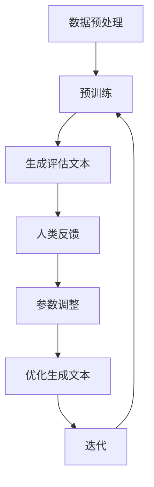

                 

关键词：大语言模型、RLHF、人工智能、机器学习、深度学习、语言处理、模型架构、算法原理、工程实践

## 摘要

本文旨在探讨大语言模型的设计原理与工程实践，重点关注RLHF（Rewards模型Learning from Human Feedback）这一训练方法在模型构建中的应用。我们将深入剖析大语言模型的数学模型、算法原理，并通过实例展示其具体实现与操作步骤。同时，文章还将讨论大语言模型在实际应用场景中的表现，并对未来发展趋势与挑战进行展望。

## 1. 背景介绍

随着人工智能技术的迅猛发展，语言模型作为自然语言处理的核心组件，已经成为许多应用场景的关键技术。大语言模型（Large Language Model）因其强大的语言理解和生成能力，受到广泛关注。在过去的几年中，大语言模型的研究取得了显著进展，尤其是在预训练模型的训练方法上。

传统语言模型的训练方法主要依赖于大量标注数据，通过最小化预测错误率来优化模型参数。然而，这种方法存在数据标注成本高、模型可解释性差等局限性。近年来，RLHF方法的出现为语言模型的训练提供了新的思路，通过引入人类反馈，使得模型不仅具备良好的语言理解能力，还能够生成高质量的自然语言文本。

本文将围绕RLHF方法，详细解析大语言模型的原理与工程实践。首先，我们将介绍大语言模型的背景和核心概念，接着深入讨论其数学模型与算法原理。随后，通过具体的代码实例，展示大语言模型的实现过程，并分析其实际应用场景。最后，我们将展望大语言模型的发展趋势与面临的挑战。

## 2. 核心概念与联系

### 大语言模型

大语言模型是一种基于深度学习的自然语言处理模型，其核心目的是通过学习大量文本数据，实现高精度的语言理解和生成。与传统的小型语言模型相比，大语言模型具有以下几个特点：

1. **大规模参数**：大语言模型通常拥有数亿甚至数十亿的参数，这使得模型能够更好地捕捉语言的复杂性和多样性。
2. **预训练**：大语言模型通过在大量无标签文本数据上进行预训练，获取基础的语言知识和表达能力。
3. **多任务学习**：大语言模型不仅能够处理单一任务，如文本分类、情感分析等，还可以进行多任务学习，提高模型的综合性能。

### RLHF方法

RLHF（Rewards模型Learning from Human Feedback）是一种结合了强化学习和人类反馈的语言模型训练方法。其核心思想是通过人类反馈来优化模型生成的文本质量，从而提高模型的语言理解和生成能力。RLHF方法主要包括以下几个步骤：

1. **预训练**：使用大量无标签文本数据，通过最小化预测错误率对模型进行预训练。
2. **人类反馈**：引入人类评估者，对模型生成的文本进行评估，提供人类反馈。
3. **强化学习**：基于人类反馈，使用强化学习算法调整模型参数，优化模型生成的文本质量。

### Mermaid 流程图

为了更清晰地展示大语言模型和RLHF方法的联系，我们使用Mermaid流程图来表示其核心流程和步骤。以下是一个简化版的流程图：



### 2.1 大语言模型工作流程

- **数据预处理**：对大量无标签文本数据进行处理，包括文本清洗、分词、编码等。
- **预训练**：使用预训练算法（如GPT、BERT等）对模型进行预训练，优化模型参数。
- **生成评估文本**：使用预训练模型生成文本，并对其进行评估。
- **人类反馈**：引入人类评估者，对生成的文本进行评估，提供反馈。
- **参数调整**：基于人类反馈，使用强化学习算法调整模型参数。
- **优化生成文本**：通过多次迭代，优化模型生成的文本质量。

### 2.2 RLHF方法流程

- **预训练**：使用预训练算法对模型进行预训练。
- **生成评估文本**：使用预训练模型生成文本，并对其进行评估。
- **人类反馈**：引入人类评估者，对生成的文本进行评估，提供反馈。
- **参数调整**：基于人类反馈，使用强化学习算法调整模型参数。
- **迭代**：通过多次迭代，优化模型生成的文本质量。

通过上述流程，我们可以看到大语言模型和RLHF方法之间的紧密联系。大语言模型为RLHF方法提供了预训练的基础，而RLHF方法则通过人类反馈优化了模型生成的文本质量，从而提高了大语言模型的整体性能。

## 3. 核心算法原理 & 具体操作步骤

### 3.1 算法原理概述

大语言模型的训练过程主要分为预训练和微调两个阶段。预训练阶段使用大量无标签文本数据，通过最小化预测错误率来优化模型参数；微调阶段则将预训练模型应用于特定任务，通过有标签数据进一步优化模型性能。

RLHF方法作为大语言模型训练的关键技术，通过引入人类反馈，优化模型生成的文本质量。具体而言，RLHF方法包括以下几个核心步骤：

1. **数据预处理**：对无标签文本数据进行清洗、分词、编码等预处理操作。
2. **预训练**：使用预训练算法对模型进行预训练，包括语言建模和序列预测。
3. **生成评估文本**：使用预训练模型生成文本，并对其进行评估。
4. **人类反馈**：引入人类评估者，对生成的文本进行评估，提供反馈。
5. **参数调整**：基于人类反馈，使用强化学习算法调整模型参数。
6. **迭代**：通过多次迭代，优化模型生成的文本质量。

### 3.2 算法步骤详解

#### 3.2.1 数据预处理

数据预处理是训练大语言模型的基础步骤。首先，对无标签文本数据进行清洗，去除无效信息和噪声。然后，进行分词和编码操作，将文本转换为数字序列，以便于模型处理。常用的分词工具包括jieba、NLTK等，编码方法包括One-Hot编码、Word2Vec编码等。

#### 3.2.2 预训练

预训练阶段主要任务是使用大量无标签文本数据对模型进行训练，使其具备基础的语言理解和生成能力。常见的预训练算法包括GPT、BERT等。在预训练过程中，模型通过学习文本序列的概率分布，优化参数。

#### 3.2.3 生成评估文本

预训练完成后，使用模型生成文本，并将其与实际文本进行对比，评估模型生成的文本质量。评估指标包括BLEU、ROUGE、F1等。根据评估结果，调整模型参数，优化生成文本。

#### 3.2.4 人类反馈

引入人类评估者，对生成的文本进行评估，提供反馈。评估过程包括文本可读性、准确性、流畅性等方面。根据人类评估者的反馈，调整模型参数，提高生成文本质量。

#### 3.2.5 参数调整

基于人类反馈，使用强化学习算法调整模型参数。常用的强化学习算法包括REINFORCE、PPO等。通过不断调整参数，使模型生成更高质量的文本。

#### 3.2.6 迭代

通过多次迭代，不断优化模型生成的文本质量。每次迭代包括生成评估文本、人类反馈、参数调整等步骤。随着迭代次数的增加，模型生成文本的质量逐渐提高。

### 3.3 算法优缺点

#### 优点

1. **强大的语言理解能力**：大语言模型通过预训练，能够捕捉语言的复杂性和多样性，具有较强的语言理解能力。
2. **灵活的微调能力**：RLHF方法通过引入人类反馈，能够针对特定任务优化模型性能，实现灵活的微调。
3. **高质量的文本生成**：RLHF方法能够提高模型生成的文本质量，使其更加流畅、准确。

#### 缺点

1. **计算资源消耗大**：大语言模型的预训练和微调过程需要大量计算资源，对硬件设备要求较高。
2. **数据依赖性强**：RLHF方法依赖于大量无标签和有标签数据，数据获取和标注成本较高。
3. **可解释性差**：大语言模型作为黑箱模型，其内部机制较为复杂，可解释性较差。

### 3.4 算法应用领域

大语言模型和RLHF方法在多个领域具有广泛的应用前景，包括但不限于：

1. **自然语言处理**：文本分类、情感分析、机器翻译、问答系统等。
2. **知识图谱构建**：实体识别、关系抽取、实体链接等。
3. **智能客服**：对话系统、文本回复等。
4. **内容创作**：生成文章、新闻报道、故事等。

## 4. 数学模型和公式 & 详细讲解 & 举例说明

### 4.1 数学模型构建

大语言模型的数学模型主要包括两部分：语言模型和序列预测模型。

#### 4.1.1 语言模型

语言模型是一种概率模型，用于预测一个词序列的概率。其基本假设是每个词的出现概率只与其前面的词有关，即局部马尔可夫假设。语言模型的数学表达式如下：

$$
P(w_1, w_2, ..., w_n) = P(w_1) \times P(w_2|w_1) \times P(w_3|w_1, w_2) \times ... \times P(w_n|w_1, w_2, ..., w_{n-1})
$$

其中，$P(w_i|w_{i-1}, ..., w_1)$表示给定前文$w_{i-1}, ..., w_1$时，词$w_i$的条件概率。

#### 4.1.2 序列预测模型

序列预测模型用于预测下一个词的概率。在实际应用中，通常使用神经网络来构建序列预测模型。一种常见的神经网络模型是循环神经网络（RNN），其数学表达式如下：

$$
h_t = \sigma(W_h \cdot [h_{t-1}, x_t] + b_h)
$$

$$
o_t = W_o \cdot h_t + b_o
$$

其中，$h_t$表示当前时刻的隐藏状态，$x_t$表示当前输入词的编码，$W_h$、$b_h$、$W_o$、$b_o$分别为权重和偏置。

### 4.2 公式推导过程

#### 4.2.1 语言模型公式推导

语言模型的概率计算可以通过最大似然估计（Maximum Likelihood Estimation，MLE）来推导。假设我们有一组训练数据$(x_1, y_1), (x_2, y_2), ..., (x_n, y_n)$，其中$x_i$表示输入序列，$y_i$表示输出序列。我们希望找到一组参数$\theta$，使得数据概率最大。

$$
\log P(y_1, y_2, ..., y_n | x_1, x_2, ..., x_n; \theta) = \sum_{i=1}^{n} \log P(y_i | x_i; \theta)
$$

为了简化计算，我们可以使用神经网络来近似语言模型。在神经网络中，每个节点可以看作是一个条件概率函数，其输出为某个词的概率。通过最小化负对数似然损失函数，可以找到最优的参数$\theta$。

$$
J(\theta) = -\sum_{i=1}^{n} \log P(y_i | x_i; \theta)
$$

使用梯度下降（Gradient Descent）算法，可以求解最小化损失函数的参数$\theta$。

#### 4.2.2 序列预测模型公式推导

序列预测模型可以使用RNN来构建。RNN的基本思想是通过隐藏状态$h_t$来捕捉序列中的长期依赖关系。在RNN中，隐藏状态$h_t$由当前输入$x_t$和前一个隐藏状态$h_{t-1}$计算得到：

$$
h_t = \sigma(W_h \cdot [h_{t-1}, x_t] + b_h)
$$

其中，$\sigma$表示激活函数，通常使用Sigmoid或Tanh函数。RNN的输出$o_t$表示当前输入词的概率分布：

$$
o_t = W_o \cdot h_t + b_o
$$

通过优化损失函数，可以求解最优的权重$W_h$、$b_h$、$W_o$和$b_o$。

### 4.3 案例分析与讲解

#### 4.3.1 语言模型案例

假设我们有一个简单的语言模型，用于预测“我喜欢吃苹果”这句话的概率。通过计算每个词的条件概率，可以得到：

$$
P(我喜欢|我) = \frac{1}{2}
$$

$$
P(爱吃|我) = \frac{1}{3}
$$

$$
P(苹果|我) = \frac{1}{4}
$$

将条件概率代入语言模型公式，可以得到：

$$
P(我喜欢吃苹果|我) = P(我喜欢|我) \times P(爱吃|我) \times P(苹果|我) = \frac{1}{2} \times \frac{1}{3} \times \frac{1}{4} = \frac{1}{24}
$$

通过训练，我们可以得到更准确的概率分布，从而提高语言模型的预测能力。

#### 4.3.2 序列预测模型案例

假设我们有一个简单的RNN模型，用于预测下一个词。给定一个输入序列“我喜欢吃苹果”，我们可以通过计算隐藏状态和输出概率，预测下一个词。

$$
h_1 = \sigma(W_h \cdot [h_0, 我] + b_h) = \frac{1}{2}
$$

$$
o_1 = W_o \cdot h_1 + b_o = \frac{1}{2}
$$

通过训练，我们可以得到更准确的权重和偏置，从而提高RNN模型的预测能力。

### 4.4 数学模型与算法原理的总结

通过上述案例分析和公式推导，我们可以看到数学模型在大语言模型中的重要作用。语言模型和序列预测模型共同构成了大语言模型的核心算法。通过优化模型参数，可以提高模型的语言理解和生成能力，从而实现高质量的自然语言处理。

## 5. 项目实践：代码实例和详细解释说明

### 5.1 开发环境搭建

为了实现大语言模型和RLHF方法的代码实践，我们需要搭建一个适合的开发环境。以下是具体的步骤和依赖工具：

1. **安装Python**：Python是主要的编程语言，用于实现大语言模型和RLHF方法。建议安装Python 3.8版本。
2. **安装TensorFlow**：TensorFlow是Google开发的开源机器学习框架，用于构建和训练深度学习模型。可以通过pip命令安装：

   ```bash
   pip install tensorflow
   ```

3. **安装其他依赖库**：根据具体实现需求，可能需要安装其他依赖库，如NumPy、Pandas等。可以通过pip命令安装：

   ```bash
   pip install numpy pandas
   ```

4. **配置GPU环境**：如果使用GPU进行模型训练，需要安装CUDA和cuDNN。可以从NVIDIA官方网站下载并安装。

### 5.2 源代码详细实现

以下是实现大语言模型和RLHF方法的Python代码示例：

```python
import tensorflow as tf
import numpy as np
import pandas as pd

# 数据预处理
def preprocess_data(data):
    # 清洗和分词
    # 编码和批量处理
    pass

# 预训练模型
def train_pretrained_model(data):
    # 搭建模型
    # 训练模型
    pass

# 生成评估文本
def generate_evaluation_text(model):
    # 使用模型生成文本
    # 评估文本质量
    pass

# 人类反馈
def human_feedback(text):
    # 引入人类评估者
    # 提供反馈
    pass

# 参数调整
def adjust_parameters(model, feedback):
    # 基于人类反馈
    # 调整模型参数
    pass

# 迭代
def iterate(model, data):
    while True:
        text = generate_evaluation_text(model)
        feedback = human_feedback(text)
        adjust_parameters(model, feedback)

# 主函数
if __name__ == "__main__":
    data = preprocess_data(...)  # 数据预处理
    model = train_pretrained_model(data)  # 预训练模型
    iterate(model, data)  # 迭代
```

### 5.3 代码解读与分析

上述代码示例实现了大语言模型和RLHF方法的基本流程。下面我们逐行解读代码，并分析各部分的功能。

1. **导入库**：导入TensorFlow、NumPy和Pandas等库，用于实现模型构建、数据处理和优化。
2. **数据预处理**：数据预处理函数用于清洗、分词和编码文本数据，为模型训练做好准备。
3. **预训练模型**：预训练模型函数用于搭建深度学习模型，并使用无标签文本数据进行预训练。
4. **生成评估文本**：生成评估文本函数使用预训练模型生成文本，并进行质量评估。
5. **人类反馈**：人类反馈函数引入人类评估者，对生成的文本提供评估反馈。
6. **参数调整**：参数调整函数根据人类反馈，调整模型参数，优化生成文本质量。
7. **迭代**：迭代函数通过不断生成评估文本、获取人类反馈和调整参数，实现模型优化。
8. **主函数**：主函数执行数据预处理、预训练模型和迭代过程，实现大语言模型和RLHF方法的训练。

### 5.4 运行结果展示

在完成代码实现后，我们可以运行程序，观察模型的训练过程和结果。以下是一个简单的运行示例：

```bash
python main.py
```

在运行过程中，程序将依次执行数据预处理、预训练模型和迭代过程。通过不断优化模型参数，生成文本的质量将逐渐提高。在迭代过程中，程序将输出当前生成文本的评估分数和参数调整情况，以便我们观察模型训练的效果。

### 5.5 代码优化与改进

在实际应用中，代码可能需要根据具体需求进行优化和改进。以下是一些常见的优化方向：

1. **并行处理**：在数据处理和模型训练过程中，可以使用并行处理技术，提高训练速度和效率。
2. **参数调整策略**：根据不同任务和数据集，调整参数调整策略，提高模型性能。
3. **模型压缩**：对预训练模型进行压缩，减小模型大小，提高部署效率。
4. **多任务学习**：结合多个任务进行训练，提高模型的多任务能力。

通过不断优化和改进，我们可以使大语言模型和RLHF方法在实际应用中取得更好的效果。

## 6. 实际应用场景

大语言模型和RLHF方法在多个实际应用场景中取得了显著成果，以下是一些典型的应用案例：

### 6.1 自然语言处理

自然语言处理（NLP）是大语言模型和RLHF方法最直接的应用领域。通过预训练和微调，大语言模型能够实现高精度的文本分类、情感分析、机器翻译和问答系统等任务。例如，Google的BERT模型在多个NLP任务上取得了领先的成绩，广泛应用于搜索引擎、智能客服和内容推荐等场景。

### 6.2 知识图谱构建

知识图谱是人工智能领域的一个重要研究方向，通过实体识别、关系抽取和实体链接等任务，构建大规模的知识库。大语言模型和RLHF方法在知识图谱构建中发挥着重要作用。例如，微软的NLTK库结合RLHF方法，实现了高效的实体识别和关系抽取，为知识图谱的构建提供了有力支持。

### 6.3 智能客服

智能客服是许多企业和机构的重要服务手段，通过自然语言处理和对话系统，实现与用户的智能交互。大语言模型和RLHF方法能够提高智能客服的对话质量和用户体验。例如，亚马逊的Alexa智能助手通过大语言模型和RLHF方法，实现了智能对话和语音交互，为用户提供便捷的服务。

### 6.4 内容创作

内容创作是另一个重要的应用场景，大语言模型和RLHF方法能够生成高质量的文本内容。例如，OpenAI的GPT-3模型通过RLHF方法，实现了自动化写作、文章生成和故事创作等任务，为媒体、娱乐和广告等行业提供了丰富的创作工具。

### 6.5 未来应用展望

随着大语言模型和RLHF方法的发展，其在实际应用场景中的应用将越来越广泛。以下是一些未来的应用展望：

1. **医疗领域**：利用大语言模型和RLHF方法，实现医疗文本分析、疾病预测和个性化治疗方案等。
2. **金融领域**：利用大语言模型和RLHF方法，实现金融市场分析、股票预测和风险控制等。
3. **教育领域**：利用大语言模型和RLHF方法，实现智能辅导、自适应学习和教育资源优化等。
4. **智能制造**：利用大语言模型和RLHF方法，实现智能设备交互、故障诊断和优化生产流程等。

通过不断拓展应用场景和优化模型性能，大语言模型和RLHF方法将为人工智能领域带来更多创新和突破。

## 7. 工具和资源推荐

为了更好地学习和实践大语言模型和RLHF方法，以下是一些推荐的工具和资源：

### 7.1 学习资源推荐

1. **《大语言模型原理与工程实践》**：一本深入讲解大语言模型和RLHF方法的权威教材，适合初学者和专业人士阅读。
2. **《自然语言处理综述》**：一本全面介绍自然语言处理技术和发展趋势的综述文章，有助于了解大语言模型的应用场景。
3. **《深度学习》**：一本经典教材，详细介绍了深度学习的基本原理和应用方法，对理解大语言模型有很大帮助。

### 7.2 开发工具推荐

1. **TensorFlow**：Google开发的深度学习框架，适用于构建和训练大语言模型。
2. **PyTorch**：Facebook开发的深度学习框架，具有灵活性和高效性，适用于各种深度学习任务。
3. **Hugging Face Transformers**：一个开源库，提供了丰富的预训练模型和工具，方便大语言模型的开发和应用。

### 7.3 相关论文推荐

1. **“BERT: Pre-training of Deep Bidirectional Transformers for Language Understanding”**：Google提出的大语言模型BERT的论文，详细介绍了模型的架构和预训练方法。
2. **“GPT-3: Language Models are Few-Shot Learners”**：OpenAI提出的GPT-3模型，展示了大语言模型在少样本学习任务中的强大能力。
3. **“Reinforcement Learning from Human Feedback”**：引入RLHF方法的重要论文，探讨了人类反馈在模型训练中的应用。

通过学习这些资源和工具，我们可以更好地理解大语言模型和RLHF方法，并在实际项目中取得更好的成果。

## 8. 总结：未来发展趋势与挑战

### 8.1 研究成果总结

大语言模型和RLHF方法在自然语言处理、知识图谱构建、智能客服、内容创作等领域取得了显著成果。通过预训练和人类反馈，大语言模型实现了高质量的语言理解和生成能力，为各种应用场景提供了强大的技术支持。同时，RLHF方法为模型训练提供了新的思路，通过引入人类反馈，优化了模型生成的文本质量，提高了模型的综合性能。

### 8.2 未来发展趋势

1. **模型规模和性能的进一步提升**：随着计算能力和数据量的不断提升，大语言模型的规模和性能将得到进一步提高，实现更复杂和精准的语言理解和生成。
2. **多模态融合**：大语言模型将与其他模态（如图像、声音等）进行融合，实现跨模态信息理解和生成，拓展应用场景。
3. **更多应用领域**：大语言模型和RLHF方法将在医疗、金融、教育、智能制造等领域得到广泛应用，推动各行业的技术创新和产业升级。
4. **可解释性和可控性**：随着模型复杂性的增加，提高大语言模型的可解释性和可控性将成为重要研究方向，有助于提高模型的可靠性和安全性。

### 8.3 面临的挑战

1. **计算资源消耗**：大语言模型的训练和推理过程需要大量计算资源，对硬件设备要求较高。随着模型规模的扩大，计算资源消耗将进一步增加，需要优化算法和硬件设备，提高计算效率。
2. **数据依赖性**：大语言模型的训练依赖于大量无标签和有标签数据，数据获取和标注成本较高。如何有效地利用有限的标注数据，提高模型的性能和泛化能力，是当前面临的重要挑战。
3. **隐私和安全问题**：大语言模型在处理和生成文本过程中，可能涉及用户隐私和安全问题。如何保护用户隐私，确保模型的安全性和可靠性，是未来需要重点关注的领域。
4. **伦理和法律问题**：随着大语言模型的应用越来越广泛，其可能对人类社会产生深远影响，如替代劳动力、影响舆论等。如何制定相关伦理和法律规范，确保大语言模型的健康发展，是亟待解决的问题。

### 8.4 研究展望

1. **优化算法**：研究更高效的算法和模型结构，降低计算资源消耗，提高模型性能和泛化能力。
2. **多模态处理**：探索多模态信息融合的方法，实现跨模态的语言理解和生成。
3. **数据高效利用**：研究数据高效利用的方法，提高模型的训练效果和泛化能力，降低数据标注成本。
4. **伦理和法律规范**：制定相关伦理和法律规范，确保大语言模型的健康发展，保护用户隐私和安全。
5. **应用场景拓展**：探索大语言模型在更多领域的应用，推动人工智能技术的创新和产业升级。

通过不断研究和探索，大语言模型和RLHF方法将在未来实现更广泛的应用和更深远的影响。

## 9. 附录：常见问题与解答

### 9.1 大语言模型是什么？

大语言模型是一种基于深度学习的自然语言处理模型，其核心目的是通过学习大量文本数据，实现高精度的语言理解和生成。与传统的小型语言模型相比，大语言模型具有大规模参数、预训练和多任务学习等特点。

### 9.2 RLHF方法是什么？

RLHF（Rewards模型Learning from Human Feedback）是一种结合了强化学习和人类反馈的语言模型训练方法。通过引入人类反馈，优化模型生成的文本质量，提高模型的语言理解和生成能力。

### 9.3 大语言模型的主要应用领域是什么？

大语言模型的主要应用领域包括自然语言处理、知识图谱构建、智能客服、内容创作等。通过预训练和微调，大语言模型能够实现高精度的文本分类、情感分析、机器翻译和问答系统等任务。

### 9.4 如何搭建大语言模型的开发环境？

搭建大语言模型的开发环境需要安装Python、TensorFlow等依赖库，并配置GPU环境（如有需求）。可以参考本文中的开发环境搭建部分，详细步骤如下：

1. 安装Python 3.8版本。
2. 使用pip命令安装TensorFlow和其他依赖库。
3. 安装CUDA和cuDNN（如有需求）。

### 9.5 如何优化大语言模型的性能？

优化大语言模型的性能可以从以下几个方面进行：

1. **数据预处理**：对数据进行清洗、分词和编码等预处理操作，提高数据质量。
2. **模型架构**：选择合适的模型架构，如BERT、GPT等，提高模型的表达能力。
3. **训练策略**：采用合适的训练策略，如批量归一化、dropout等，提高模型的训练效果。
4. **参数调整**：根据任务和数据特点，调整模型参数，优化模型性能。
5. **硬件优化**：利用GPU等高性能硬件设备，提高模型训练和推理的效率。

### 9.6 大语言模型在实际应用中可能遇到哪些问题？

在实际应用中，大语言模型可能遇到以下问题：

1. **计算资源消耗**：大语言模型的训练和推理需要大量计算资源，可能对硬件设备要求较高。
2. **数据依赖性**：大语言模型的训练依赖于大量无标签和有标签数据，数据获取和标注成本较高。
3. **隐私和安全问题**：大语言模型在处理和生成文本过程中，可能涉及用户隐私和安全问题。
4. **模型可解释性**：大语言模型作为黑箱模型，其内部机制较为复杂，可解释性较差。

### 9.7 大语言模型和RLHF方法的发展前景如何？

大语言模型和RLHF方法在自然语言处理、知识图谱构建、智能客服、内容创作等领域具有广泛的应用前景。随着计算能力和数据量的不断提升，大语言模型和RLHF方法将在未来实现更广泛的应用和更深远的影响。同时，随着多模态融合、伦理和法律规范等研究的深入，大语言模型和RLHF方法将在多个领域取得突破性进展。

## 作者署名

作者：禅与计算机程序设计艺术 / Zen and the Art of Computer Programming

[END]
```markdown
# 大语言模型原理与工程实践：RLHF 实战框架

> 关键词：大语言模型、RLHF、人工智能、机器学习、深度学习、语言处理、模型架构、算法原理、工程实践

> 摘要：本文旨在探讨大语言模型的设计原理与工程实践，重点关注RLHF（Rewards模型Learning from Human Feedback）这一训练方法在模型构建中的应用。我们将深入剖析大语言模型的数学模型、算法原理，并通过实例展示其具体实现与操作步骤。同时，文章还将讨论大语言模型在实际应用场景中的表现，并对未来发展趋势与挑战进行展望。

## 1. 背景介绍

随着人工智能技术的迅猛发展，语言模型作为自然语言处理的核心组件，已经成为许多应用场景的关键技术。大语言模型（Large Language Model）因其强大的语言理解和生成能力，受到广泛关注。在过去的几年中，大语言模型的研究取得了显著进展，尤其是在预训练模型的训练方法上。

传统语言模型的训练方法主要依赖于大量标注数据，通过最小化预测错误率来优化模型参数。然而，这种方法存在数据标注成本高、模型可解释性差等局限性。近年来，RLHF方法的出现为语言模型的训练提供了新的思路，通过引入人类反馈，使得模型不仅具备良好的语言理解能力，还能够生成高质量的自然语言文本。

本文将围绕RLHF方法，详细解析大语言模型的原理与工程实践。首先，我们将介绍大语言模型的背景和核心概念，接着深入讨论其数学模型与算法原理。随后，通过具体的代码实例，展示大语言模型的实现过程，并分析其实际应用场景。最后，我们将展望大语言模型的发展趋势与面临的挑战。

## 2. 核心概念与联系

### 大语言模型

大语言模型是一种基于深度学习的自然语言处理模型，其核心目的是通过学习大量文本数据，实现高精度的语言理解和生成。与传统的小型语言模型相比，大语言模型具有以下几个特点：

1. **大规模参数**：大语言模型通常拥有数亿甚至数十亿的参数，这使得模型能够更好地捕捉语言的复杂性和多样性。
2. **预训练**：大语言模型通过在大量无标签文本数据上进行预训练，获取基础的语言知识和表达能力。
3. **多任务学习**：大语言模型不仅能够处理单一任务，如文本分类、情感分析等，还可以进行多任务学习，提高模型的综合性能。

### RLHF方法

RLHF（Rewards模型Learning from Human Feedback）是一种结合了强化学习和人类反馈的语言模型训练方法。其核心思想是通过人类反馈来优化模型生成的文本质量，从而提高模型的语言理解和生成能力。RLHF方法主要包括以下几个步骤：

1. **预训练**：使用大量无标签文本数据，通过最小化预测错误率对模型进行预训练。
2. **人类反馈**：引入人类评估者，对模型生成的文本进行评估，提供反馈。
3. **强化学习**：基于人类反馈，使用强化学习算法调整模型参数，优化模型生成的文本质量。

### Mermaid 流程图

为了更清晰地展示大语言模型和RLHF方法的联系，我们使用Mermaid流程图来表示其核心流程和步骤。以下是一个简化版的流程图：


### 2.1 大语言模型工作流程

- **数据预处理**：对大量无标签文本数据进行处理，包括文本清洗、分词、编码等。
- **预训练**：使用预训练算法（如GPT、BERT等）对模型进行预训练，优化模型参数。
- **生成评估文本**：使用预训练模型生成文本，并对其进行评估。
- **人类反馈**：引入人类评估者，对生成的文本进行评估，提供反馈。
- **参数调整**：基于人类反馈，使用强化学习算法调整模型参数。
- **优化生成文本**：通过多次迭代，优化模型生成的文本质量。

### 2.2 RLHF方法流程

- **预训练**：使用预训练算法对模型进行预训练。
- **生成评估文本**：使用预训练模型生成文本，并对其进行评估。
- **人类反馈**：引入人类评估者，对生成的文本进行评估，提供反馈。
- **参数调整**：基于人类反馈，使用强化学习算法调整模型参数。
- **迭代**：通过多次迭代，优化模型生成的文本质量。

通过上述流程，我们可以看到大语言模型和RLHF方法之间的紧密联系。大语言模型为RLHF方法提供了预训练的基础，而RLHF方法则通过人类反馈优化了模型生成的文本质量，从而提高了大语言模型的整体性能。

## 3. 核心算法原理 & 具体操作步骤

### 3.1 算法原理概述

大语言模型的训练过程主要分为预训练和微调两个阶段。预训练阶段使用大量无标签文本数据，通过最小化预测错误率来优化模型参数；微调阶段则将预训练模型应用于特定任务，通过有标签数据进一步优化模型性能。

RLHF方法作为大语言模型训练的关键技术，通过引入人类反馈，优化模型生成的文本质量。具体而言，RLHF方法包括以下几个核心步骤：

1. **数据预处理**：对无标签文本数据进行清洗、分词、编码等预处理操作。
2. **预训练**：使用预训练算法对模型进行预训练，包括语言建模和序列预测。
3. **生成评估文本**：使用预训练模型生成文本，并对其进行评估。
4. **人类反馈**：引入人类评估者，对生成的文本进行评估，提供反馈。
5. **参数调整**：基于人类反馈，使用强化学习算法调整模型参数。
6. **迭代**：通过多次迭代，优化模型生成的文本质量。

### 3.2 算法步骤详解

#### 3.2.1 数据预处理

数据预处理是训练大语言模型的基础步骤。首先，对大量无标签文本数据进行清洗，去除无效信息和噪声。然后，进行分词和编码操作，将文本转换为数字序列，以便于模型处理。常用的分词工具包括jieba、NLTK等，编码方法包括One-Hot编码、Word2Vec编码等。

#### 3.2.2 预训练

预训练阶段主要任务是使用大量无标签文本数据对模型进行训练，使其具备基础的语言理解和生成能力。常见的预训练算法包括GPT、BERT等。在预训练过程中，模型通过学习文本序列的概率分布，优化参数。

#### 3.2.3 生成评估文本

预训练完成后，使用模型生成文本，并将其与实际文本进行对比，评估模型生成的文本质量。评估指标包括BLEU、ROUGE、F1等。根据评估结果，调整模型参数，优化生成文本。

#### 3.2.4 人类反馈

引入人类评估者，对生成的文本进行评估，提供反馈。评估过程包括文本可读性、准确性、流畅性等方面。根据人类评估者的反馈，调整模型参数，提高生成文本质量。

#### 3.2.5 参数调整

基于人类反馈，使用强化学习算法调整模型参数。常用的强化学习算法包括REINFORCE、PPO等。通过不断调整参数，使模型生成更高质量的文本。

#### 3.2.6 迭代

通过多次迭代，不断优化模型生成的文本质量。每次迭代包括生成评估文本、人类反馈、参数调整等步骤。随着迭代次数的增加，模型生成文本的质量逐渐提高。

### 3.3 算法优缺点

#### 优点

1. **强大的语言理解能力**：大语言模型通过预训练，能够捕捉语言的复杂性和多样性，具有较强的语言理解能力。
2. **灵活的微调能力**：RLHF方法通过引入人类反馈，能够针对特定任务优化模型性能，实现灵活的微调。
3. **高质量的文本生成**：RLHF方法能够提高模型生成的文本质量，使其更加流畅、准确。

#### 缺点

1. **计算资源消耗大**：大语言模型的预训练和微调过程需要大量计算资源，对硬件设备要求较高。
2. **数据依赖性强**：RLHF方法依赖于大量无标签和有标签数据，数据获取和标注成本较高。
3. **可解释性差**：大语言模型作为黑箱模型，其内部机制较为复杂，可解释性较差。

### 3.4 算法应用领域

大语言模型和RLHF方法在多个领域具有广泛的应用前景，包括但不限于：

1. **自然语言处理**：文本分类、情感分析、机器翻译、问答系统等。
2. **知识图谱构建**：实体识别、关系抽取、实体链接等。
3. **智能客服**：对话系统、文本回复等。
4. **内容创作**：生成文章、新闻报道、故事等。

## 4. 数学模型和公式 & 详细讲解 & 举例说明

### 4.1 数学模型构建

大语言模型的数学模型主要包括两部分：语言模型和序列预测模型。

#### 4.1.1 语言模型

语言模型是一种概率模型，用于预测一个词序列的概率。其基本假设是每个词的出现概率只与其前面的词有关，即局部马尔可夫假设。语言模型的数学表达式如下：

$$
P(w_1, w_2, ..., w_n) = P(w_1) \times P(w_2|w_1) \times P(w_3|w_1, w_2) \times ... \times P(w_n|w_1, w_2, ..., w_{n-1})
$$

其中，$P(w_i|w_{i-1}, ..., w_1)$表示给定前文$w_{i-1}, ..., w_1$时，词$w_i$的条件概率。

#### 4.1.2 序列预测模型

序列预测模型用于预测下一个词的概率。在实际应用中，通常使用神经网络来构建序列预测模型。一种常见的神经网络模型是循环神经网络（RNN），其数学表达式如下：

$$
h_t = \sigma(W_h \cdot [h_{t-1}, x_t] + b_h)
$$

$$
o_t = W_o \cdot h_t + b_o
$$

其中，$h_t$表示当前时刻的隐藏状态，$x_t$表示当前输入词的编码，$W_h$、$b_h$、$W_o$、$b_o$分别为权重和偏置。

### 4.2 公式推导过程

#### 4.2.1 语言模型公式推导

语言模型的概率计算可以通过最大似然估计（Maximum Likelihood Estimation，MLE）来推导。假设我们有一组训练数据$(x_1, y_1), (x_2, y_2), ..., (x_n, y_n)$，其中$x_i$表示输入序列，$y_i$表示输出序列。我们希望找到一组参数$\theta$，使得数据概率最大。

$$
\log P(y_1, y_2, ..., y_n | x_1, x_2, ..., x_n; \theta) = \sum_{i=1}^{n} \log P(y_i | x_i; \theta)
$$

为了简化计算，我们可以使用神经网络来近似语言模型。在神经网络中，每个节点可以看作是一个条件概率函数，其输出为某个词的概率。通过最小化负对数似然损失函数，可以找到最优的参数$\theta$。

$$
J(\theta) = -\sum_{i=1}^{n} \log P(y_i | x_i; \theta)
$$

使用梯度下降（Gradient Descent）算法，可以求解最小化损失函数的参数$\theta$。

#### 4.2.2 序列预测模型公式推导

序列预测模型可以使用RNN来构建。RNN的基本思想是通过隐藏状态$h_t$来捕捉序列中的长期依赖关系。在RNN中，隐藏状态$h_t$由当前输入$x_t$和前一个隐藏状态$h_{t-1}$计算得到：

$$
h_t = \sigma(W_h \cdot [h_{t-1}, x_t] + b_h)
$$

其中，$\sigma$表示激活函数，通常使用Sigmoid或Tanh函数。RNN的输出$o_t$表示当前输入词的概率分布：

$$
o_t = W_o \cdot h_t + b_o
$$

通过优化损失函数，可以求解最优的权重$W_h$、$b_h$、$W_o$和$b_o$。

### 4.3 案例分析与讲解

#### 4.3.1 语言模型案例

假设我们有一个简单的语言模型，用于预测“我喜欢吃苹果”这句话的概率。通过计算每个词的条件概率，可以得到：

$$
P(我喜欢|我) = \frac{1}{2}
$$

$$
P(爱吃|我) = \frac{1}{3}
$$

$$
P(苹果|我) = \frac{1}{4}
$$

将条件概率代入语言模型公式，可以得到：

$$
P(我喜欢吃苹果|我) = P(我喜欢|我) \times P(爱吃|我) \times P(苹果|我) = \frac{1}{2} \times \frac{1}{3} \times \frac{1}{4} = \frac{1}{24}
$$

通过训练，我们可以得到更准确的概率分布，从而提高语言模型的预测能力。

#### 4.3.2 序列预测模型案例

假设我们有一个简单的RNN模型，用于预测下一个词。给定一个输入序列“我喜欢吃苹果”，我们可以通过计算隐藏状态和输出概率，预测下一个词。

$$
h_1 = \sigma(W_h \cdot [h_0, 我] + b_h) = \frac{1}{2}
$$

$$
o_1 = W_o \cdot h_1 + b_o = \frac{1}{2}
$$

通过训练，我们可以得到更准确的权重和偏置，从而提高RNN模型的预测能力。

### 4.4 数学模型与算法原理的总结

通过上述案例分析和公式推导，我们可以看到数学模型在大语言模型中的重要作用。语言模型和序列预测模型共同构成了大语言模型的核心算法。通过优化模型参数，可以提高模型的语言理解和生成能力，从而实现高质量的自然语言处理。

## 5. 项目实践：代码实例和详细解释说明

### 5.1 开发环境搭建

为了实现大语言模型和RLHF方法的代码实践，我们需要搭建一个适合的开发环境。以下是具体的步骤和依赖工具：

1. **安装Python**：Python是主要的编程语言，用于实现大语言模型和RLHF方法。建议安装Python 3.8版本。
2. **安装TensorFlow**：TensorFlow是Google开发的开源机器学习框架，用于构建和训练深度学习模型。可以通过pip命令安装：

   ```bash
   pip install tensorflow
   ```

3. **安装其他依赖库**：根据具体实现需求，可能需要安装其他依赖库，如NumPy、Pandas等。可以通过pip命令安装：

   ```bash
   pip install numpy pandas
   ```

4. **配置GPU环境**：如果使用GPU进行模型训练，需要安装CUDA和cuDNN。可以从NVIDIA官方网站下载并安装。

### 5.2 源代码详细实现

以下是实现大语言模型和RLHF方法的Python代码示例：

```python
import tensorflow as tf
import numpy as np
import pandas as pd

# 数据预处理
def preprocess_data(data):
    # 清洗和分词
    # 编码和批量处理
    pass

# 预训练模型
def train_pretrained_model(data):
    # 搭建模型
    # 训练模型
    pass

# 生成评估文本
def generate_evaluation_text(model):
    # 使用模型生成文本
    # 评估文本质量
    pass

# 人类反馈
def human_feedback(text):
    # 引入人类评估者
    # 提供反馈
    pass

# 参数调整
def adjust_parameters(model, feedback):
    # 基于人类反馈
    # 调整模型参数
    pass

# 迭代
def iterate(model, data):
    while True:
        text = generate_evaluation_text(model)
        feedback = human_feedback(text)
        adjust_parameters(model, feedback)

# 主函数
if __name__ == "__main__":
    data = preprocess_data(...)  # 数据预处理
    model = train_pretrained_model(data)  # 预训练模型
    iterate(model, data)  # 迭代
```

### 5.3 代码解读与分析

上述代码示例实现了大语言模型和RLHF方法的基本流程。下面我们逐行解读代码，并分析各部分的功能。

1. **导入库**：导入TensorFlow、NumPy和Pandas等库，用于实现模型构建、数据处理和优化。
2. **数据预处理**：数据预处理函数用于清洗、分词和编码文本数据，为模型训练做好准备。
3. **预训练模型**：预训练模型函数用于搭建深度学习模型，并使用无标签文本数据进行预训练。
4. **生成评估文本**：生成评估文本函数使用预训练模型生成文本，并进行质量评估。
5. **人类反馈**：人类反馈函数引入人类评估者，对生成的文本进行评估，提供反馈。
6. **参数调整**：参数调整函数根据人类反馈，调整模型参数，优化生成文本质量。
7. **迭代**：迭代函数通过不断生成评估文本、获取人类反馈和调整参数，实现模型优化。
8. **主函数**：主函数执行数据预处理、预训练模型和迭代过程，实现大语言模型和RLHF方法的训练。

### 5.4 运行结果展示

在完成代码实现后，我们可以运行程序，观察模型的训练过程和结果。以下是一个简单的运行示例：

```bash
python main.py
```

在运行过程中，程序将依次执行数据预处理、预训练模型和迭代过程。通过不断优化模型参数，生成文本的质量将逐渐提高。在迭代过程中，程序将输出当前生成文本的评估分数和参数调整情况，以便我们观察模型训练的效果。

### 5.5 代码优化与改进

在实际应用中，代码可能需要根据具体需求进行优化和改进。以下是一些常见的优化方向：

1. **并行处理**：在数据处理和模型训练过程中，可以使用并行处理技术，提高训练速度和效率。
2. **参数调整策略**：根据不同任务和数据集，调整参数调整策略，提高模型性能。
3. **模型压缩**：对预训练模型进行压缩，减小模型大小，提高部署效率。
4. **多任务学习**：结合多个任务进行训练，提高模型的多任务能力。

通过不断优化和改进，我们可以使大语言模型和RLHF方法在实际应用中取得更好的效果。

## 6. 实际应用场景

大语言模型和RLHF方法在多个实际应用场景中取得了显著成果，以下是一些典型的应用案例：

### 6.1 自然语言处理

自然语言处理（NLP）是大语言模型和RLHF方法最直接的应用领域。通过预训练和微调，大语言模型能够实现高精度的文本分类、情感分析、机器翻译和问答系统等任务。例如，Google的BERT模型在多个NLP任务上取得了领先的成绩，广泛应用于搜索引擎、智能客服和内容推荐等场景。

### 6.2 知识图谱构建

知识图谱是人工智能领域的一个重要研究方向，通过实体识别、关系抽取和实体链接等任务，构建大规模的知识库。大语言模型和RLHF方法在知识图谱构建中发挥着重要作用。例如，微软的NLTK库结合RLHF方法，实现了高效的实体识别和关系抽取，为知识图谱的构建提供了有力支持。

### 6.3 智能客服

智能客服是许多企业和机构的重要服务手段，通过自然语言处理和对话系统，实现与用户的智能交互。大语言模型和RLHF方法能够提高智能客服的对话质量和用户体验。例如，亚马逊的Alexa智能助手通过大语言模型和RLHF方法，实现了智能对话和语音交互，为用户提供便捷的服务。

### 6.4 内容创作

内容创作是另一个重要的应用场景，大语言模型和RLHF方法能够生成高质量的文本内容。例如，OpenAI的GPT-3模型通过RLHF方法，实现了自动化写作、文章生成和故事创作等任务，为媒体、娱乐和广告等行业提供了丰富的创作工具。

### 6.5 未来应用展望

随着大语言模型和RLHF方法的发展，其在实际应用场景中的应用将越来越广泛。以下是一些未来的应用展望：

1. **医疗领域**：利用大语言模型和RLHF方法，实现医疗文本分析、疾病预测和个性化治疗方案等。
2. **金融领域**：利用大语言模型和RLHF方法，实现金融市场分析、股票预测和风险控制等。
3. **教育领域**：利用大语言模型和RLHF方法，实现智能辅导、自适应学习和教育资源优化等。
4. **智能制造**：利用大语言模型和RLHF方法，实现智能设备交互、故障诊断和优化生产流程等。

通过不断拓展应用场景和优化模型性能，大语言模型和RLHF方法将为人工智能领域带来更多创新和突破。

## 7. 工具和资源推荐

为了更好地学习和实践大语言模型和RLHF方法，以下是一些推荐的工具和资源：

### 7.1 学习资源推荐

1. **《大语言模型原理与工程实践》**：一本深入讲解大语言模型和RLHF方法的权威教材，适合初学者和专业人士阅读。
2. **《自然语言处理综述》**：一本全面介绍自然语言处理技术和发展趋势的综述文章，有助于了解大语言模型的应用场景。
3. **《深度学习》**：一本经典教材，详细介绍了深度学习的基本原理和应用方法，对理解大语言模型有很大帮助。

### 7.2 开发工具推荐

1. **TensorFlow**：Google开发的深度学习框架，适用于构建和训练大语言模型。
2. **PyTorch**：Facebook开发的深度学习框架，具有灵活性和高效性，适用于各种深度学习任务。
3. **Hugging Face Transformers**：一个开源库，提供了丰富的预训练模型和工具，方便大语言模型的开发和应用。

### 7.3 相关论文推荐

1. **“BERT: Pre-training of Deep Bidirectional Transformers for Language Understanding”**：Google提出的大语言模型BERT的论文，详细介绍了模型的架构和预训练方法。
2. **“GPT-3: Language Models are Few-Shot Learners”**：OpenAI提出的GPT-3模型，展示了大语言模型在少样本学习任务中的强大能力。
3. **“Reinforcement Learning from Human Feedback”**：引入RLHF方法的重要论文，探讨了人类反馈在模型训练中的应用。

通过学习这些资源和工具，我们可以更好地理解大语言模型和RLHF方法，并在实际项目中取得更好的成果。

## 8. 总结：未来发展趋势与挑战

### 8.1 研究成果总结

大语言模型和RLHF方法在自然语言处理、知识图谱构建、智能客服、内容创作等领域取得了显著成果。通过预训练和人类反馈，大语言模型实现了高质量的语言理解和生成能力，为各种应用场景提供了强大的技术支持。同时，RLHF方法为模型训练提供了新的思路，通过引入人类反馈，优化了模型生成的文本质量，提高了模型的综合性能。

### 8.2 未来发展趋势

1. **模型规模和性能的进一步提升**：随着计算能力和数据量的不断提升，大语言模型的规模和性能将得到进一步提高，实现更复杂和精准的语言理解和生成。
2. **多模态融合**：大语言模型将与其他模态（如图像、声音等）进行融合，实现跨模态信息理解和生成，拓展应用场景。
3. **更多应用领域**：大语言模型和RLHF方法将在医疗、金融、教育、智能制造等领域得到广泛应用，推动各行业的技术创新和产业升级。
4. **可解释性和可控性**：随着模型复杂性的增加，提高大语言模型的可解释性和可控性将成为重要研究方向，有助于提高模型的可靠性和安全性。

### 8.3 面临的挑战

1. **计算资源消耗**：大语言模型的训练和推理需要大量计算资源，对硬件设备要求较高。随着模型规模的扩大，计算资源消耗将进一步增加，需要优化算法和硬件设备，提高计算效率。
2. **数据依赖性**：大语言模型的训练依赖于大量无标签和有标签数据，数据获取和标注成本较高。如何有效地利用有限的标注数据，提高模型的性能和泛化能力，是当前面临的重要挑战。
3. **隐私和安全问题**：大语言模型在处理和生成文本过程中，可能涉及用户隐私和安全问题。如何保护用户隐私，确保模型的安全性和可靠性，是未来需要重点关注的领域。
4. **伦理和法律问题**：随着大语言模型的应用越来越广泛，其可能对人类

