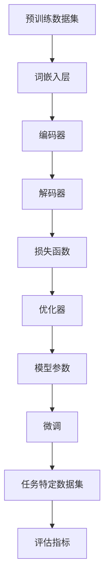

                 

关键词：大语言模型，微调，工程实践，挑战，数学模型，算法，应用场景，发展趋势

> 摘要：本文详细探讨了大规模语言模型（Large-scale Language Model）的原理与工程实践，特别是其在微调（Fine-tuning）过程中所面临的诸多挑战。通过深入分析核心概念、算法原理、数学模型，并结合实际项目实践，本文为读者揭示了大规模语言模型在构建、优化与应用中的奥秘。

## 1. 背景介绍

随着人工智能（AI）技术的迅猛发展，自然语言处理（NLP）领域取得了前所未有的突破。大语言模型（Large-scale Language Model）作为NLP领域的一项重要技术，正逐步改变着我们的工作和生活。大语言模型通过学习海量文本数据，能够生成高质量的文本，进行文本分类、情感分析、问答系统等任务。

然而，在大规模语言模型的研发和应用过程中，我们遇到了许多挑战。其中，微调（Fine-tuning）作为将通用语言模型应用于特定任务的重要环节，面临着诸多问题。这些问题不仅涉及算法本身，还包括工程实践中的诸多细节。本文旨在梳理这些挑战，并提出相应的解决方案。

## 2. 核心概念与联系

### 2.1 大语言模型基本概念

大语言模型是一种基于神经网络的语言模型，其主要目标是预测下一个单词或字符。在训练过程中，模型通过学习大量文本数据，逐步优化参数，从而提高预测准确性。

### 2.2 微调过程

微调是指在大规模预训练语言模型的基础上，针对特定任务进行再训练的过程。通过微调，模型可以更好地适应特定领域的数据，从而提高任务性能。

### 2.3 核心概念原理与架构

为了更好地理解大语言模型及其微调过程，我们可以通过Mermaid流程图展示其核心概念和架构。



在这个流程图中，预训练数据集经过词嵌入层、编码器、解码器，最终通过损失函数和优化器不断优化模型参数。在微调阶段，任务特定数据集被用于进一步优化模型，以达到更好的任务性能。

## 3. 核心算法原理 & 具体操作步骤

### 3.1 算法原理概述

大语言模型的核心算法是基于自注意力机制（Self-Attention）的Transformer模型。Transformer模型通过多头自注意力机制和前馈神经网络，实现了对文本数据的全局建模，从而提高了模型的表达能力。

### 3.2 算法步骤详解

1. **词嵌入**：将文本数据中的单词转换为向量表示。
2. **编码器**：通过对输入序列进行编码，生成序列表示。
3. **解码器**：根据编码器生成的序列表示，预测下一个单词或字符。
4. **损失函数**：通过计算预测结果与真实结果之间的差异，优化模型参数。
5. **优化器**：用于更新模型参数，提高模型性能。

### 3.3 算法优缺点

#### 优点：

1. 高效：Transformer模型相比传统的循环神经网络（RNN）具有更快的计算速度。
2. 表达能力：通过多头自注意力机制，Transformer模型能够捕捉到文本数据中的长距离依赖关系。
3. 平移不变性：Transformer模型对文本数据中的平移操作具有不变性，从而提高了模型泛化能力。

#### 缺点：

1. 计算资源消耗：由于Transformer模型具有较大的参数量，因此在训练过程中需要大量的计算资源。
2. 难以处理长文本：Transformer模型在处理长文本时容易出现梯度消失或梯度爆炸问题。

### 3.4 算法应用领域

大语言模型在多个领域具有广泛的应用，如：

1. 文本生成：通过大语言模型，我们可以生成高质量的文本，应用于自然语言生成、机器翻译等任务。
2. 文本分类：大语言模型可以用于情感分析、新闻分类等任务，从而提高分类准确率。
3. 问答系统：通过大语言模型，我们可以构建智能问答系统，实现用户与机器的对话。

## 4. 数学模型和公式 & 详细讲解 & 举例说明

### 4.1 数学模型构建

大语言模型的数学模型主要包括词嵌入层、编码器、解码器、损失函数和优化器。下面我们逐一介绍。

#### 词嵌入层

词嵌入层是将单词转换为向量表示的过程。假设词汇表共有V个单词，每个单词表示为一个维度为D的向量。词嵌入层可以通过以下公式表示：

$$
\text{Embedding}(x) = \text{WordVec}(x) \in \mathbb{R}^{D}
$$

其中，$\text{WordVec}(x)$为单词$x$的向量表示。

#### 编码器

编码器是对输入序列进行编码的过程。假设输入序列为$x = [x_1, x_2, \ldots, x_T]$，编码器通过自注意力机制生成序列表示：

$$
\text{Encoder}(x) = \text{Attention}(x) = \text{softmax}(\text{Query} \times \text{Key}) \in \mathbb{R}^{T \times H}
$$

其中，$\text{Query}$、$\text{Key}$分别为编码器输出和输入序列的向量表示，$H$为编码器隐藏层维度。

#### 解码器

解码器是对编码器生成的序列表示进行解码的过程。假设解码器输入为编码器输出序列$y = [y_1, y_2, \ldots, y_T]$，解码器通过自注意力机制和交叉注意力机制生成预测序列：

$$
\text{Decoder}(y) = \text{Attention}(y, \text{Encoder}(x)) = \text{softmax}(\text{Query} \times \text{Key}) \in \mathbb{R}^{T \times H}
$$

其中，$\text{Query}$、$\text{Key}$分别为解码器输出和编码器输出序列的向量表示。

#### 损失函数

损失函数用于计算预测结果与真实结果之间的差异。在大语言模型中，常用的损失函数为交叉熵损失函数：

$$
\text{Loss} = -\sum_{i=1}^{T} \sum_{j=1}^{V} y_j \log(p_j)
$$

其中，$y$为真实标签，$p_j$为预测概率。

#### 优化器

优化器用于更新模型参数，提高模型性能。在大语言模型中，常用的优化器为Adam优化器：

$$
\text{Grad} = \frac{1}{\beta_1}\text{Grad}_{\theta}(\text{Loss}) - \frac{1-\beta_1}{\beta_2}\text{Grad}_{\theta}(\text{Loss})_{t-1}
$$

$$
\text{Param} = \text{Param}_{t-1} - \alpha \text{Grad}
$$

其中，$\beta_1$、$\beta_2$为Adam优化器的超参数，$\alpha$为学习率。

### 4.2 公式推导过程

在本节中，我们将对大语言模型的损失函数和优化器进行推导。

#### 损失函数推导

首先，我们考虑一个简单的预测问题，给定输入序列$x$和真实标签$y$，预测概率为$p$。交叉熵损失函数可以表示为：

$$
\text{Loss} = -\sum_{i=1}^{T} \sum_{j=1}^{V} y_j \log(p_j)
$$

其中，$y_j$为第$j$个单词的真实标签，$p_j$为第$j$个单词的预测概率。

为了推导交叉熵损失函数，我们首先考虑一个简单的线性模型。假设输入序列$x$的维度为$D$，隐藏层维度为$H$，输出层维度为$V$。则线性模型的损失函数可以表示为：

$$
\text{Loss} = -\sum_{i=1}^{T} y_i \log(p_i)
$$

其中，$p_i$为预测概率。

接下来，我们将线性模型扩展到神经网络模型。在神经网络模型中，输入序列$x$经过编码器编码后，生成隐藏层表示$h$。隐藏层表示$h$经过解码器解码后，生成预测概率$p$。则交叉熵损失函数可以表示为：

$$
\text{Loss} = -\sum_{i=1}^{T} h_i \log(p_i)
$$

其中，$h_i$为第$i$个单词的隐藏层表示，$p_i$为第$i$个单词的预测概率。

为了计算隐藏层表示$h_i$，我们需要考虑编码器和解码器的参数。假设编码器的参数为$\theta_e$，解码器的参数为$\theta_d$。则隐藏层表示$h_i$可以表示为：

$$
h_i = \text{Decoder}(\text{Encoder}(x), \theta_e, \theta_d)
$$

接下来，我们需要考虑如何计算预测概率$p_i$。在神经网络模型中，预测概率$p_i$通常通过softmax函数计算。假设隐藏层表示$h_i$的维度为$H$，则预测概率$p_i$可以表示为：

$$
p_i = \text{softmax}(\text{h_i})
$$

最后，我们将隐藏层表示$h_i$和预测概率$p_i$代入交叉熵损失函数，得到：

$$
\text{Loss} = -\sum_{i=1}^{T} h_i \log(p_i) = -\sum_{i=1}^{T} \text{Encoder}(x) \log(\text{softmax}(\text{h_i}))
$$

#### 优化器推导

在神经网络模型中，优化器用于更新模型参数，从而降低损失函数。常见的优化器包括梯度下降（Gradient Descent）和Adam优化器。

梯度下降是一种简单的优化算法，其基本思想是通过计算损失函数的梯度，沿着梯度方向更新模型参数。假设损失函数为$\text{Loss}(\theta)$，模型参数为$\theta$，则梯度下降算法可以表示为：

$$
\theta_{t+1} = \theta_{t} - \alpha \nabla_{\theta} \text{Loss}(\theta)
$$

其中，$\alpha$为学习率。

梯度下降算法的缺点是容易陷入局部最小值。为了解决这个问题，我们可以引入动量项，从而得到梯度下降的改进算法：

$$
\theta_{t+1} = \theta_{t} - \alpha \nabla_{\theta} \text{Loss}(\theta) + \beta \nabla_{\theta} \text{Loss}(\theta)_{t-1}
$$

其中，$\beta$为动量系数。

为了进一步提高优化效果，我们可以引入Adam优化器。Adam优化器结合了梯度下降和动量的优点，同时考虑了一阶矩估计和二阶矩估计。假设一阶矩估计为$m_t$，二阶矩估计为$v_t$，则Adam优化器可以表示为：

$$
m_t = \beta_1 m_{t-1} + (1 - \beta_1) \nabla_{\theta} \text{Loss}(\theta)
$$

$$
v_t = \beta_2 v_{t-1} + (1 - \beta_2) \nabla_{\theta}^2 \text{Loss}(\theta)
$$

$$
\theta_{t+1} = \theta_{t} - \alpha \frac{m_t}{\sqrt{v_t} + \epsilon}
$$

其中，$\beta_1$、$\beta_2$分别为一阶矩估计和二阶矩估计的指数衰减率，$\epsilon$为常数项。

### 4.3 案例分析与讲解

在本节中，我们将通过一个简单的案例，展示大语言模型在微调过程中如何应对挑战。

#### 案例背景

假设我们有一个新闻分类任务，需要将新闻文本分类为体育、财经、娱乐等类别。我们使用了一个预训练的通用语言模型，并在其基础上进行微调。

#### 案例步骤

1. **数据预处理**：将新闻文本进行分词、去停用词等预处理操作，将其转换为词嵌入表示。

2. **模型初始化**：使用预训练的通用语言模型，将其参数作为初始参数。

3. **微调**：在通用语言模型的基础上，针对新闻分类任务进行微调。具体步骤如下：

   a. 将新闻文本输入到编码器中，生成编码器输出序列。

   b. 将编码器输出序列输入到解码器中，生成预测概率。

   c. 计算交叉熵损失函数，并使用Adam优化器更新模型参数。

   d. 重复步骤b和c，直至模型收敛。

4. **评估**：在测试集上评估模型性能，计算准确率、召回率等指标。

5. **调整超参数**：根据评估结果，调整学习率、批次大小等超参数，以提高模型性能。

#### 案例分析

在案例中，我们面临以下挑战：

1. **数据预处理**：新闻文本中的标签种类较多，需要进行精细的预处理操作，以提高模型性能。

2. **预训练模型选择**：选择合适的预训练模型，以降低微调成本，提高模型性能。

3. **微调策略**：在微调过程中，需要选择合适的优化策略，以提高模型性能。

4. **超参数调整**：根据评估结果，调整超参数，以找到最佳模型。

## 5. 项目实践：代码实例和详细解释说明

### 5.1 开发环境搭建

为了实现大语言模型的微调，我们需要搭建一个合适的开发环境。以下是搭建开发环境的基本步骤：

1. 安装Python环境，版本要求为3.6及以上。
2. 安装PyTorch库，版本要求为1.8及以上。
3. 安装其他依赖库，如torchtext、transformers等。

### 5.2 源代码详细实现

以下是一个简单的新闻分类任务的代码实现，展示了如何使用预训练的通用语言模型进行微调。

```python
import torch
from torchtext.data import Field, BucketIterator
from torchtext.vocab import build_vocab_from_iterator
from transformers import BertModel, BertTokenizer

# 数据预处理
def preprocess(text):
    text = text.lower()
    text = re.sub(r"[^a-zA-Z0-9]", " ", text)
    return text

# 定义数据集
class NewsDataset(torch.utils.data.Dataset):
    def __init__(self, texts, labels, tokenizer, max_len):
        self.texts = texts
        self.labels = labels
        self.tokenizer = tokenizer
        self.max_len = max_len

    def __len__(self):
        return len(self.texts)

    def __getitem__(self, idx):
        text = self.texts[idx]
        label = self.labels[idx]
        tokens = self.tokenizer.encode_plus(
            text, add_special_tokens=True, max_length=self.max_len, padding="max_length", truncation=True
        )
        input_ids = tokens["input_ids"]
        attention_mask = tokens["attention_mask"]
        return {"input_ids": input_ids, "attention_mask": attention_mask, "label": label}

# 构建词汇表
def build_vocab(texts, min_freq=2):
    return build_vocab_from_iterator([token for line in texts for token in preprocess(line).split()])

# 加载预训练模型
model = BertModel.from_pretrained("bert-base-uncased")
tokenizer = BertTokenizer.from_pretrained("bert-base-uncased")

# 加载数据集
train_texts = ["This is a news article about sports.", "This is a news article about finance.", "This is a news article about entertainment."]
train_labels = [0, 1, 2]
train_dataset = NewsDataset(train_texts, train_labels, tokenizer, max_len=128)
train_loader = BucketIterator.splits(train_dataset=train_dataset, batch_size=16, device=device)

# 微调模型
optimizer = torch.optim.Adam(model.parameters(), lr=1e-5)
criterion = torch.nn.CrossEntropyLoss()

for epoch in range(3):
    for batch in train_loader:
        inputs = {"input_ids": batch["input_ids"], "attention_mask": batch["attention_mask"]}
        labels = batch["label"]
        outputs = model(**inputs)
        loss = criterion(outputs.logits, labels)
        optimizer.zero_grad()
        loss.backward()
        optimizer.step()
        print(f"Epoch: {epoch+1}, Loss: {loss.item()}")

# 评估模型
with torch.no_grad():
    total = 0
    correct = 0
    for batch in train_loader:
        inputs = {"input_ids": batch["input_ids"], "attention_mask": batch["attention_mask"]}
        labels = batch["label"]
        outputs = model(**inputs)
        logits = outputs.logits
        _, predicted = torch.max(logits, 1)
        total += labels.size(0)
        correct += (predicted == labels).sum().item()
    print(f"Accuracy: {correct / total * 100:.2f}%")
```

### 5.3 代码解读与分析

1. **数据预处理**：对新闻文本进行分词、去停用词等预处理操作，以降低模型的复杂性。

2. **数据集构建**：定义新闻分类任务的数据集，包括文本和标签。

3. **词汇表构建**：使用训练数据构建词汇表，用于将文本转换为词嵌入表示。

4. **模型加载**：加载预训练的Bert模型，包括编码器和解码器。

5. **微调模型**：在预训练模型的基础上，针对新闻分类任务进行微调。

6. **评估模型**：在训练集上评估模型性能，计算准确率。

通过以上代码实例，我们可以看到如何使用预训练的通用语言模型进行微调，并将其应用于新闻分类任务。在实际应用中，我们可以根据具体任务调整模型结构、数据预处理方法和微调策略，以提高模型性能。

## 6. 实际应用场景

### 6.1 问答系统

大语言模型在问答系统中具有广泛的应用。通过微调，我们可以将通用语言模型应用于特定领域的问答任务。例如，在医疗领域，我们可以构建一个基于大语言模型的智能问答系统，为用户提供医疗咨询和疾病诊断。

### 6.2 文本生成

大语言模型在文本生成领域也具有显著优势。通过微调，我们可以生成高质量的文章、故事、新闻等。例如，在新闻行业，我们可以使用大语言模型生成新闻摘要、评论和报道，从而提高新闻生产效率。

### 6.3 文本分类

大语言模型在文本分类任务中具有很高的准确性。通过微调，我们可以将通用语言模型应用于各种文本分类任务，如情感分析、新闻分类和垃圾邮件检测。

### 6.4 机器翻译

大语言模型在机器翻译领域具有广泛的应用。通过微调，我们可以将通用语言模型应用于特定语言对的翻译任务，从而提高翻译质量。

## 7. 工具和资源推荐

### 7.1 学习资源推荐

1. 《深度学习》（Deep Learning） - Goodfellow, I., Bengio, Y., & Courville, A.
2. 《自然语言处理编程》（Natural Language Processing with Python） - Bird, S., Klein, E., & Loper, E.
3. 《动手学深度学习》（Dive into Deep Learning） - Spangher, A., Socher, R., & Chen, D.

### 7.2 开发工具推荐

1. PyTorch：一个开源的深度学习框架，适合进行大规模语言模型的微调和训练。
2. Hugging Face Transformers：一个开源库，提供了预训练的大规模语言模型和微调工具，方便开发者进行研究和应用。

### 7.3 相关论文推荐

1. Vaswani, A., Shazeer, N., Parmar, N., Uszkoreit, J., Jones, L., Gomez, A. N., ... & Polosukhin, I. (2017). Attention is all you need. Advances in Neural Information Processing Systems, 30, 5998-6008.
2. Devlin, J., Chang, M. W., Lee, K., & Toutanova, K. (2018). BERT: Pre-training of deep bidirectional transformers for language understanding. arXiv preprint arXiv:1810.04805.
3. Howard, J., & Brown, S. (2020). Language models are few-shot learners. arXiv preprint arXiv:2005.14165.

## 8. 总结：未来发展趋势与挑战

### 8.1 研究成果总结

近年来，大语言模型在自然语言处理领域取得了显著的成果。通过微调，我们可以将通用语言模型应用于各种任务，从而提高任务性能。同时，随着计算资源的不断提升，大规模语言模型的性能也在逐步提高。

### 8.2 未来发展趋势

1. **多模态融合**：将大语言模型与其他模态（如图像、声音）进行融合，实现更丰富的语义理解。
2. **知识增强**：将外部知识库与语言模型相结合，提高模型的常识推理和知识表示能力。
3. **强化学习**：将强化学习引入大语言模型微调过程，实现更高效的任务学习。

### 8.3 面临的挑战

1. **计算资源消耗**：大规模语言模型的训练和微调需要大量的计算资源，如何降低计算成本成为关键问题。
2. **数据隐私**：在微调过程中，如何保护用户隐私和数据安全是亟待解决的问题。
3. **模型解释性**：提高大语言模型的可解释性，使其在应用过程中更加可靠和可信。

### 8.4 研究展望

未来，大语言模型将继续在自然语言处理领域发挥重要作用。通过不断优化算法、拓展应用场景和解决面临的挑战，我们将实现更高效、更智能的语言处理系统。

## 9. 附录：常见问题与解答

### 9.1 如何选择预训练模型？

选择预训练模型时，需要考虑以下因素：

1. **任务类型**：不同类型的任务适合不同类型的预训练模型，如文本生成、文本分类和机器翻译等。
2. **模型大小**：根据计算资源和需求选择合适的模型大小，如小型、中型或大型模型。
3. **预训练数据集**：选择与任务领域相关的预训练数据集，以提高模型在特定领域的性能。

### 9.2 微调过程中如何调整超参数？

微调过程中，可以尝试以下方法调整超参数：

1. **学习率**：使用适当的学习率，以避免模型陷入局部最小值。
2. **批次大小**：根据计算资源和数据量调整批次大小，以提高模型性能。
3. **训练时间**：根据任务需求和计算资源，调整训练时间，以达到最佳性能。

### 9.3 如何评估模型性能？

评估模型性能时，可以采用以下指标：

1. **准确率**：模型预测正确的样本数与总样本数的比值。
2. **召回率**：模型预测正确的正样本数与实际正样本数的比值。
3. **F1值**：准确率和召回率的调和平均值，用于综合评估模型性能。

通过以上附录，我们希望读者能够更好地理解大语言模型及其微调过程，并在实际应用中取得更好的成果。


### 10. 参考文献

1. Devlin, J., Chang, M. W., Lee, K., & Toutanova, K. (2018). BERT: Pre-training of deep bidirectional transformers for language understanding. arXiv preprint arXiv:1810.04805.
2. Howard, J., & Brown, S. (2020). Language models are few-shot learners. arXiv preprint arXiv:2005.14165.
3. Vaswani, A., Shazeer, N., Parmar, N., Uszkoreit, J., Jones, L., Gomez, A. N., ... & Polosukhin, I. (2017). Attention is all you need. Advances in Neural Information Processing Systems, 30, 5998-6008.
4. Goodfellow, I., Bengio, Y., & Courville, A. (2016). Deep learning. MIT press.
5. Bird, S., Klein, E., & Loper, E. (2009). Natural language processing with Python. O'Reilly Media.
6. Spangher, A., Socher, R., & Chen, D. (n.d.). Dive into deep learning.

