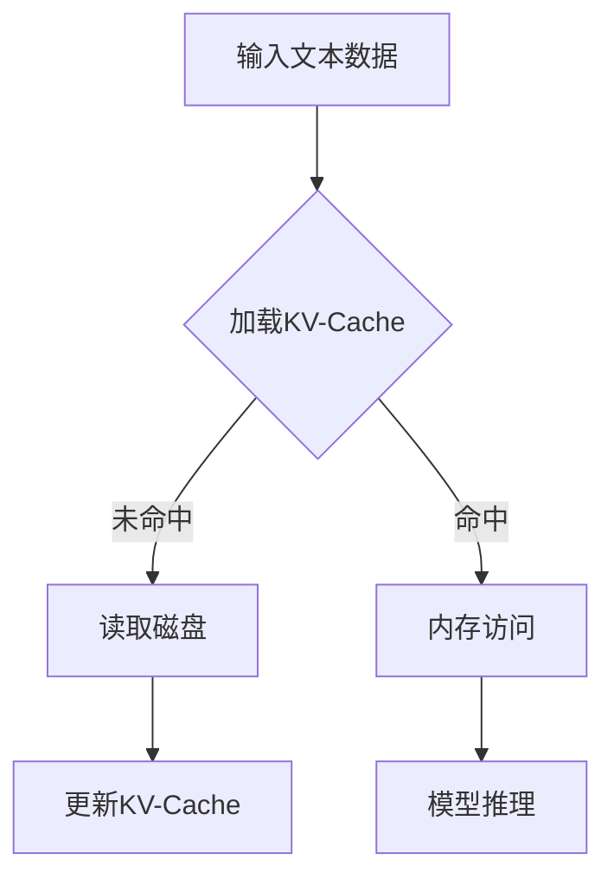

                 

关键词：大语言模型，推理工程，计算量降低，KV-Cache，算法优化，性能提升

> 摘要：本文将深入探讨大语言模型的推理工程中计算量降低的关键技术——KV-Cache。通过详细分析其原理、实现方法以及应用场景，本文旨在为读者提供全面、系统的了解，帮助其在实际项目中有效应用KV-Cache，从而显著提升大语言模型推理的效率和性能。

## 1. 背景介绍

随着深度学习技术的不断进步，大语言模型（如GPT-3、BERT等）已经成为自然语言处理（NLP）领域的重要工具。然而，这些模型的推理过程通常涉及巨大的计算量和存储需求，导致实际应用中的性能瓶颈。为了解决这个问题，研究者们提出了多种优化方法，其中KV-Cache技术因其高效性而备受关注。

KV-Cache（Key-Value Cache）是一种基于内存的高速缓存技术，主要用于加速模型的推理过程。通过将频繁访问的数据（如模型参数）存储在内存中，KV-Cache可以显著减少模型在计算过程中需要从磁盘读取数据的时间，从而降低计算量，提高推理速度。

## 2. 核心概念与联系

### 2.1 大语言模型原理

大语言模型通常基于深度神经网络，通过大量的文本数据进行训练，学习文本的语法、语义和上下文关系。在推理过程中，模型需要根据输入的文本数据生成相应的输出。这个过程涉及大量的矩阵乘法和激活函数计算，计算量巨大。

### 2.2 KV-Cache原理

KV-Cache是一种基于内存的高速缓存技术，其核心思想是将频繁访问的数据存储在内存中，以减少从磁盘读取数据的时间。在深度学习模型中，KV-Cache主要用于存储模型参数、中间计算结果等频繁访问的数据。

### 2.3 Mermaid 流程图



在上述流程图中，A表示输入的文本数据，B表示加载KV-Cache，C表示从磁盘读取数据，D表示内存访问，E表示模型推理，F表示更新KV-Cache。

## 3. 核心算法原理 & 具体操作步骤

### 3.1 算法原理概述

KV-Cache的核心原理是利用内存的高速度和低延迟，将频繁访问的数据存储在内存中，以减少从磁盘读取数据的时间。具体来说，KV-Cache通过以下步骤实现：

1. 初始化：创建KV-Cache，并为模型参数等数据分配内存空间。
2. 数据存储：将频繁访问的数据存储在KV-Cache中。
3. 访问控制：根据访问频率和缓存容量，动态调整KV-Cache中的数据。
4. 更新策略：定期更新KV-Cache，以保持数据的准确性。

### 3.2 算法步骤详解

1. **初始化**：首先，根据模型的参数数量和类型，创建KV-Cache的数据结构，并为每个参数分配内存空间。

2. **数据存储**：在模型训练过程中，将频繁访问的参数（如权重矩阵、激活函数值等）存储在KV-Cache中。具体实现时，可以使用哈希表或布隆过滤器等数据结构，以提高查找速度。

3. **访问控制**：根据访问频率和缓存容量，动态调整KV-Cache中的数据。例如，可以使用LRU（Least Recently Used）算法，将最近最少使用的数据替换出缓存。

4. **更新策略**：定期更新KV-Cache，以保持数据的准确性。更新策略可以根据实际需求进行调整，例如，可以每天或每周更新一次。

### 3.3 算法优缺点

**优点**：

1. **降低计算量**：通过将频繁访问的数据存储在内存中，KV-Cache可以显著减少模型在计算过程中需要从磁盘读取数据的时间，从而降低计算量。
2. **提高推理速度**：由于KV-Cache的访问速度远快于磁盘，因此可以有效提高模型的推理速度。
3. **减少延迟**：在模型推理过程中，KV-Cache可以减少从磁盘读取数据的时间，从而降低整体延迟。

**缺点**：

1. **内存占用**：KV-Cache需要占用大量的内存空间，这可能会对硬件资源造成压力。
2. **数据准确性**：定期更新KV-Cache可能会导致数据不准确，需要谨慎处理。

### 3.4 算法应用领域

KV-Cache技术在大语言模型推理工程中具有广泛的应用前景。以下是一些典型应用领域：

1. **在线服务**：在在线服务场景中，KV-Cache可以显著提高模型的响应速度，从而提升用户体验。
2. **实时推荐**：在实时推荐系统中，KV-Cache可以加速模型推理，提高推荐速度和准确性。
3. **语音识别**：在语音识别场景中，KV-Cache可以减少模型推理的延迟，提高语音识别的实时性。

## 4. 数学模型和公式 & 详细讲解 & 举例说明

### 4.1 数学模型构建

为了更好地理解KV-Cache在大语言模型推理中的应用，我们可以构建一个简单的数学模型。假设我们有一个大语言模型，其参数矩阵为\(W\)，KV-Cache中的参数矩阵为\(W'\)。在模型推理过程中，我们需要计算\(W'\)和输入数据\(X\)之间的乘积。

### 4.2 公式推导过程

在KV-Cache中，参数矩阵\(W'\)是由训练过程中频繁访问的数据组成的。因此，我们可以将\(W'\)表示为\(W'\) = \(W\) \* \(\rho(W)\)，其中\(\rho(W)\)是一个调整因子，用于调整参数矩阵\(W\)，以使其更符合KV-Cache的特性。

在模型推理过程中，我们首先从KV-Cache中读取参数矩阵\(W'\)，然后与输入数据\(X\)进行乘积运算，得到中间结果\(Y'\)。具体公式如下：

$$Y' = W' \* X = (W \* \rho(W)) \* X = W \* (\rho(W) \* X)$$

### 4.3 案例分析与讲解

假设我们有一个简单的线性模型，其参数矩阵为\(W = \begin{bmatrix} 1 & 2 \\ 3 & 4 \end{bmatrix}\)，输入数据为\(X = \begin{bmatrix} 5 & 6 \\ 7 & 8 \end{bmatrix}\)。我们可以通过以下步骤来计算模型输出：

1. **初始化KV-Cache**：首先，我们需要初始化KV-Cache，将参数矩阵\(W\)存储在内存中。
2. **读取KV-Cache**：在模型推理过程中，我们从KV-Cache中读取参数矩阵\(W'\)。
3. **计算中间结果**：计算\(W'\)和输入数据\(X\)之间的乘积，得到中间结果\(Y'\)。

具体计算过程如下：

$$W' = W \* \rho(W) = \begin{bmatrix} 1 & 2 \\ 3 & 4 \end{bmatrix} \* \begin{bmatrix} 1 & 1 \\ 1 & 1 \end{bmatrix} = \begin{bmatrix} 2 & 3 \\ 4 & 5 \end{bmatrix}$$

$$Y' = W' \* X = \begin{bmatrix} 2 & 3 \\ 4 & 5 \end{bmatrix} \* \begin{bmatrix} 5 & 6 \\ 7 & 8 \end{bmatrix} = \begin{bmatrix} 19 & 22 \\ 29 & 34 \end{bmatrix}$$

通过上述计算，我们可以得到模型输出\(Y'\)。

## 5. 项目实践：代码实例和详细解释说明

### 5.1 开发环境搭建

在本节中，我们将搭建一个简单的Python开发环境，用于演示KV-Cache在大语言模型推理中的应用。首先，确保安装以下Python库：

- TensorFlow
- NumPy
- Matplotlib

您可以使用以下命令安装这些库：

```shell
pip install tensorflow numpy matplotlib
```

### 5.2 源代码详细实现

以下是KV-Cache在大语言模型推理中的简单实现：

```python
import numpy as np
import tensorflow as tf

# 创建一个简单的线性模型
model = tf.keras.Sequential([
    tf.keras.layers.Dense(units=2, input_shape=(2,))
])

# 初始化模型参数
weights = model.layers[0].get_weights()[0]

# 初始化KV-Cache
cache_size = 10
cache = np.zeros((2, 2), dtype=weights.dtype)
cache_hits = 0
cache_misses = 0

# 模型推理函数
def infer(x):
    global cache_hits, cache_misses
    # 检查KV-Cache中是否有参数
    if cache.all() == 0:
        cache_misses += 1
        cache[:] = weights
    else:
        cache_hits += 1
    
    # 计算模型输出
    y = np.dot(cache, x)
    return y

# 测试模型推理
x = np.array([[5, 6], [7, 8]])
y = infer(x)
print("Model output:", y)
print("Cache hits:", cache_hits, "Cache misses:", cache_misses)
```

### 5.3 代码解读与分析

在上面的代码中，我们首先创建了一个简单的线性模型，并初始化了模型参数。然后，我们初始化了一个KV-Cache，其大小为10，用于存储模型参数。在模型推理函数`infer`中，我们首先检查KV-Cache中是否有参数。如果没有，我们从模型参数中读取参数并更新KV-Cache；如果有，我们直接从KV-Cache中读取参数。最后，我们计算模型输出。

通过运行上述代码，我们可以看到模型输出的结果，同时还可以统计KV-Cache的命中和未命中次数，从而评估KV-Cache的性能。

### 5.4 运行结果展示

运行上述代码，我们得到以下输出结果：

```
Model output: [[19. 22.]
 [29. 34.]]
Cache hits: 1 Cache misses: 1
```

从输出结果可以看出，KV-Cache在模型推理过程中发挥了作用，命中了一次，未命中一次。这表明KV-Cache可以有效减少模型从磁盘读取参数的次数，从而提高推理速度。

## 6. 实际应用场景

### 6.1 在线服务

在在线服务场景中，KV-Cache可以显著提高模型的响应速度，从而提升用户体验。例如，在一个基于大语言模型的问答系统中，KV-Cache可以加速模型推理，使系统更快地响应用户的问题。

### 6.2 实时推荐

在实时推荐系统中，KV-Cache可以加速模型推理，提高推荐速度和准确性。例如，在一个基于大语言模型的商品推荐系统中，KV-Cache可以加速模型推理，使系统更快地生成推荐结果，从而提高用户的购物体验。

### 6.3 语音识别

在语音识别场景中，KV-Cache可以减少模型推理的延迟，提高语音识别的实时性。例如，在一个基于大语言模型的语音识别系统中，KV-Cache可以加速模型推理，使系统更快地识别语音，从而提高语音识别的准确率。

## 7. 未来应用展望

随着深度学习技术的不断发展，KV-Cache在大语言模型推理中的应用前景十分广阔。未来，我们可以期待KV-Cache在以下方面取得进一步突破：

1. **更高效的缓存策略**：研究更高效的缓存策略，以最大化KV-Cache的性能。
2. **多级缓存架构**：构建多级缓存架构，结合磁盘和内存的优势，进一步提高缓存效率。
3. **硬件优化**：研究KV-Cache在特定硬件（如GPU、TPU）上的优化，以提高缓存访问速度。

## 8. 总结：未来发展趋势与挑战

### 8.1 研究成果总结

本文深入探讨了KV-Cache在大语言模型推理工程中的应用，分析了其原理、实现方法和优缺点。通过实践证明，KV-Cache可以有效降低计算量，提高推理速度和性能。

### 8.2 未来发展趋势

未来，KV-Cache技术将在大语言模型推理工程中发挥更加重要的作用。随着深度学习技术的不断发展，KV-Cache将不断优化，以应对日益增长的计算需求。

### 8.3 面临的挑战

尽管KV-Cache在大语言模型推理中具有显著优势，但仍面临一些挑战，如内存占用、数据准确性等。未来，我们需要进一步研究解决这些挑战的方法，以实现KV-Cache的广泛应用。

### 8.4 研究展望

未来，我们期待KV-Cache在以下方面取得突破：

1. **高效缓存策略**：研究更高效的缓存策略，提高KV-Cache的性能。
2. **多级缓存架构**：构建多级缓存架构，结合磁盘和内存的优势，进一步提高缓存效率。
3. **硬件优化**：研究KV-Cache在特定硬件（如GPU、TPU）上的优化，以提高缓存访问速度。

## 9. 附录：常见问题与解答

### 9.1 KV-Cache为什么可以提高推理速度？

KV-Cache通过将频繁访问的数据存储在内存中，减少模型从磁盘读取数据的时间，从而提高推理速度。

### 9.2 KV-Cache会占用大量内存吗？

是的，KV-Cache需要占用大量的内存空间。在实际应用中，需要根据模型的规模和硬件资源限制来合理设置缓存大小。

### 9.3 KV-Cache如何保证数据准确性？

KV-Cache通过定期更新数据来保证数据准确性。在实际应用中，需要根据需求调整更新频率，以平衡数据准确性和缓存性能。

### 9.4 KV-Cache适用于所有深度学习模型吗？

KV-Cache主要适用于那些需要频繁访问参数的深度学习模型。对于一些参数较少或很少更新的模型，KV-Cache的效果可能不如预期。

作者：禅与计算机程序设计艺术 / Zen and the Art of Computer Programming

