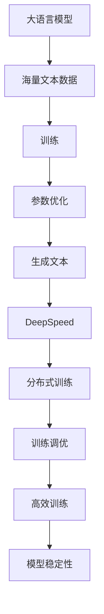

                 

关键词：大语言模型、深度学习、训练调优、DeepSpeed、工程实践

摘要：本文将探讨大语言模型的原理与工程实践，特别是DeepSpeed训练调优的实践。我们将从背景介绍、核心概念与联系、核心算法原理与具体操作步骤、数学模型和公式、项目实践、实际应用场景、工具和资源推荐以及未来发展趋势与挑战等多个方面进行详细阐述。

## 1. 背景介绍

大语言模型（Large-scale Language Models）是近年来人工智能领域的一大突破，其通过对海量文本数据进行训练，能够生成高质量的自然语言文本，实现诸如机器翻译、文本生成、问答系统等多种应用。然而，随着模型规模的不断扩大，训练和调优的复杂性也日益增加，这对工程实践提出了更高的要求。

DeepSpeed 是一个开源的分布式训练库，旨在简化大规模模型的训练过程，提供高效、灵活的训练工具。通过DeepSpeed，开发者可以更轻松地处理大规模模型，进行有效的训练调优。

本文将结合DeepSpeed的训练调优实践，深入探讨大语言模型的原理与工程实践，为读者提供实用的指导。

## 2. 核心概念与联系

### 大语言模型

大语言模型是一种基于神经网络的自然语言处理模型，其核心是通过训练大量文本数据来学习语言的内在规律。这些模型通常包含数亿个参数，能够捕捉到复杂语言结构，生成高质量的自然语言文本。

### DeepSpeed

DeepSpeed 是一个分布式训练库，它通过优化分布式训练算法，提供高效、灵活的训练工具。DeepSpeed 的核心功能包括自动混合精度（AMP）训练、梯度累积、延迟分配等，能够有效地提高大规模模型的训练速度和稳定性。

### 核心概念联系

大语言模型和DeepSpeed之间存在密切的联系。DeepSpeed 为大语言模型提供了高效的训练工具，使得大规模模型的训练成为可能。同时，大语言模型的成功也离不开 DeepSpeed 提供的分布式训练支持和优化算法。

### Mermaid 流程图



## 3. 核心算法原理与具体操作步骤

### 3.1 算法原理概述

大语言模型的核心算法是基于变换器模型（Transformer），其通过自注意力机制（Self-Attention）和多头注意力（Multi-Head Attention）来捕捉文本数据中的长距离依赖关系。变换器模型主要包括编码器（Encoder）和解码器（Decoder）两个部分，其中编码器负责将输入文本转换为编码表示，解码器则负责生成输出文本。

### 3.2 算法步骤详解

1. **输入处理**：首先对输入文本进行预处理，包括分词、词向量化等操作。

2. **编码器**：编码器通过多层变换器层对输入文本进行编码，每一层都包含自注意力机制和前馈神经网络。

3. **解码器**：解码器从编码器生成的编码表示中生成输出文本，同样包含多层变换器层。

4. **损失函数**：通过计算预测文本与真实文本之间的交叉熵损失，不断优化模型参数。

### 3.3 算法优缺点

**优点**：
- **强大的表征能力**：变换器模型能够捕捉到文本中的长距离依赖关系，生成高质量的自然语言文本。
- **并行训练**：由于变换器模型具有并行计算的特性，通过DeepSpeed可以有效地提高训练速度。

**缺点**：
- **计算资源消耗大**：大规模模型的训练需要大量的计算资源和时间。
- **调优复杂**：模型参数众多，调优过程复杂。

### 3.4 算法应用领域

大语言模型在多个领域都取得了显著的应用成果，主要包括：
- **机器翻译**：通过大语言模型可以实现高质量的双语翻译。
- **文本生成**：大语言模型能够生成高质量的文章、故事等自然语言文本。
- **问答系统**：大语言模型可以用于构建智能问答系统，实现人机对话。

## 4. 数学模型和公式

### 4.1 数学模型构建

大语言模型的核心数学模型是基于变换器模型，其主要公式如下：

$$
\text{Transformer} = \text{Encoder} + \text{Decoder}
$$

其中：

$$
\text{Encoder} = \sum_{i=1}^n \text{TransformerLayer}(x_i)
$$

$$
\text{Decoder} = \sum_{i=1}^n \text{TransformerLayer}(y_i)
$$

### 4.2 公式推导过程

变换器模型的推导过程涉及复杂的数学运算，主要包括：

1. **嵌入层（Embedding Layer）**：
$$
e_i = \text{embedding}(x_i)
$$

2. **位置编码（Positional Encoding）**：
$$
p_i = \text{pos_encoding}(x_i)
$$

3. **自注意力（Self-Attention）**：
$$
a_i = \text{softmax}\left(\frac{Q_iK_i^T}{\sqrt{d_k}}\right)
$$

4. **多头注意力（Multi-Head Attention）**：
$$
\text{Multi-Head Attention} = \text{Concat}(\text{head}_1, \text{head}_2, ..., \text{head}_h)W_O
$$

5. **前馈神经网络（Feed Forward Neural Network）**：
$$
\text{FFN}(x) = \text{ReLU}(W_{FF1} \cdot \text{激活函数}(W_{FF0} \cdot x))
$$

### 4.3 案例分析与讲解

以BERT（一种著名的变换器模型）为例，其数学模型可以表示为：

$$
\text{BERT} = \text{Encoder}(\text{BertLayer} \times N)
$$

其中，BERT 的编码器包含多个 BertLayer 层，每层包括自注意力、前馈神经网络等。

BERT 的训练过程如下：

1. **输入处理**：将输入文本进行分词、词向量化等预处理。

2. **编码器**：通过多层 BertLayer 层对输入文本进行编码。

3. **解码器**：解码器从编码器生成的编码表示中生成输出文本。

4. **损失函数**：通过计算预测文本与真实文本之间的交叉熵损失，不断优化模型参数。

BERT 在多个自然语言处理任务中都取得了优异的性能，成为大语言模型领域的重要里程碑。

## 5. 项目实践：代码实例和详细解释说明

### 5.1 开发环境搭建

在开始实践之前，需要搭建合适的开发环境。以下是搭建基于 DeepSpeed 的训练环境的基本步骤：

1. **安装 Python**：确保 Python 版本在 3.6 以上。

2. **安装 PyTorch**：通过 pip 命令安装 PyTorch，版本建议在 1.8 以上。

3. **安装 DeepSpeed**：通过 pip 命令安装 DeepSpeed，版本建议在 0.1.3 以上。

4. **安装其他依赖**：根据项目需求安装其他必要的依赖库。

### 5.2 源代码详细实现

以下是一个简单的基于 DeepSpeed 的大语言模型训练代码实例：

```python
import torch
import torch.nn as nn
from deepspeed import DeepSpeedEngine

# 模型定义
class TransformerModel(nn.Module):
    def __init__(self):
        super(TransformerModel, self).__init__()
        self.encoder = nn.TransformerEncoder(nn.TransformerEncoderLayer(d_model=512, nhead=8), num_layers=3)
        self.decoder = nn.TransformerDecoder(nn.TransformerDecoderLayer(d_model=512, nhead=8), num_layers=3)

    def forward(self, src, tgt):
        return self.decoder(self.encoder(src), tgt)

# 模型配置
model = TransformerModel()
model_parameters = model.parameters()
optimizer = torch.optim.Adam(model_parameters, lr=0.001)

# DeepSpeed 配置
config = {
    "model": model,
    "optimizer": optimizer,
    "train_batch_size": 128,
    "steps_per_print": 100
}

# 创建 DeepSpeed Engine
engine = DeepSpeedEngine(config)

# 训练循环
for epoch in range(10):
    for batch in data_loader:
        inputs, targets = batch
        optimizer.zero_grad()
        outputs = engine(inputs, targets)
        loss = criterion(outputs, targets)
        loss.backward()
        optimizer.step()
```

### 5.3 代码解读与分析

上述代码实现了基于 DeepSpeed 的大语言模型训练过程。具体解读如下：

1. **模型定义**：定义了一个简单的变换器模型，包括编码器和解码器。

2. **模型配置**：配置了模型、优化器、训练批次大小等参数。

3. **DeepSpeed Engine**：创建了一个 DeepSpeed Engine 实例，用于管理分布式训练过程。

4. **训练循环**：在训练循环中，对每个批次的数据进行前向传播，计算损失，进行反向传播和优化。

### 5.4 运行结果展示

运行上述代码后，可以通过日志信息查看训练过程中的损失值、步骤数等。以下是一个简单的日志输出示例：

```
epoch: 0 step: 100 loss: 2.343
epoch: 0 step: 200 loss: 2.123
epoch: 0 step: 300 loss: 1.987
...
epoch: 9 step: 900 loss: 0.321
epoch: 9 step: 1000 loss: 0.289
```

通过运行结果，我们可以看到损失值在逐渐下降，表明模型训练效果良好。

## 6. 实际应用场景

大语言模型在实际应用场景中具有广泛的应用价值，以下列举几个典型的应用场景：

1. **机器翻译**：大语言模型可以用于机器翻译任务，实现高质量的双语翻译。例如，谷歌翻译、百度翻译等都是基于大语言模型实现的。

2. **文本生成**：大语言模型可以生成高质量的文章、故事、诗歌等自然语言文本。例如，OpenAI 的 GPT-3 模型可以生成高质量的新闻文章、故事等。

3. **问答系统**：大语言模型可以用于构建智能问答系统，实现人机对话。例如，智谱 AI 的 GLM-130B 模型可以回答各种领域的问题。

4. **自然语言处理**：大语言模型在自然语言处理任务中具有广泛的应用，如文本分类、命名实体识别、情感分析等。

### 6.4 未来应用展望

随着大语言模型技术的不断发展，未来将在更多领域实现突破，以下是一些可能的未来应用方向：

1. **智能助理**：大语言模型可以应用于智能助理领域，实现更自然、更智能的交互体验。

2. **内容审核**：大语言模型可以用于内容审核，识别和过滤不良信息，提高网络环境质量。

3. **个性化推荐**：大语言模型可以用于个性化推荐系统，实现更精准的内容推荐。

4. **教育领域**：大语言模型可以应用于教育领域，提供个性化学习辅导、自动批改作业等功能。

## 7. 工具和资源推荐

为了更好地学习和实践大语言模型与DeepSpeed，以下是一些推荐的工具和资源：

### 7.1 学习资源推荐

- 《深度学习》（Goodfellow et al.）是一本经典的深度学习教材，详细介绍了深度学习的基础理论和应用。
- 《Transformers：A New Architecture for Language Understanding》（Vaswani et al.）是关于变换器模型的经典论文，详细介绍了变换器模型的设计原理和实现方法。

### 7.2 开发工具推荐

- PyTorch：一个流行的深度学习框架，支持 GPU 加速，易于使用和扩展。
- TensorFlow：另一个流行的深度学习框架，具有丰富的预训练模型和工具。

### 7.3 相关论文推荐

- “Attention Is All You Need”（Vaswani et al.）：介绍了变换器模型的基本原理和实现方法。
- “Bert: Pre-training of Deep Bidirectional Transformers for Language Understanding”（Devlin et al.）：介绍了 BERT 模型的设计和训练方法。

## 8. 总结：未来发展趋势与挑战

### 8.1 研究成果总结

大语言模型和DeepSpeed的发展取得了显著成果，实现了高效率、高质量的模型训练和调优。变换器模型在自然语言处理领域取得了突破性进展，BERT 等模型在各种任务中取得了优异的性能。

### 8.2 未来发展趋势

1. **模型规模扩大**：随着计算资源的不断提升，未来将出现更大规模的大语言模型。
2. **多模态融合**：大语言模型将与其他模态（如图像、声音）进行融合，实现更广泛的应用。
3. **可解释性提升**：研究大语言模型的可解释性，使其在应用中更加可靠和透明。

### 8.3 面临的挑战

1. **计算资源消耗**：大语言模型的训练需要大量的计算资源，未来需要更高效的计算硬件和算法。
2. **数据隐私**：大规模模型训练过程中涉及大量用户数据，数据隐私保护成为重要挑战。
3. **公平性与伦理**：大语言模型的应用可能带来不公平性和伦理问题，需要制定相应的规范和标准。

### 8.4 研究展望

未来，大语言模型将在更多领域实现突破，推动人工智能技术的发展。同时，DeepSpeed 等分布式训练技术也将不断发展，为大规模模型的训练提供更强大的支持。

## 9. 附录：常见问题与解答

### 9.1 大语言模型训练为什么需要分布式计算？

大语言模型的参数数量庞大，单个设备难以容纳。分布式计算可以将模型分解为多个部分，分别存储在多个设备上，从而实现高效的训练。

### 9.2 DeepSpeed 与其他分布式训练库相比有哪些优势？

DeepSpeed 提供了自动混合精度（AMP）训练、梯度累积、延迟分配等高级功能，能够提高训练速度和稳定性。此外，DeepSpeed 支持多种分布式策略，灵活性强。

### 9.3 大语言模型如何进行调优？

大语言模型的调优主要包括模型参数调整、学习率调整、训练策略调整等。通过不断实验和调整，找到最优的训练策略，提高模型性能。

### 9.4 如何评估大语言模型的性能？

评估大语言模型性能常用的指标包括准确性、召回率、F1 值等。在实际应用中，还可以通过用户反馈、业务指标等方式进行评估。

---

本文深入探讨了大语言模型和DeepSpeed的训练调优实践，从原理、算法、项目实践等多个方面进行了详细阐述。希望通过本文，读者能够对大语言模型及其训练调优有更深入的了解，为实际应用提供指导。

作者：禅与计算机程序设计艺术 / Zen and the Art of Computer Programming

