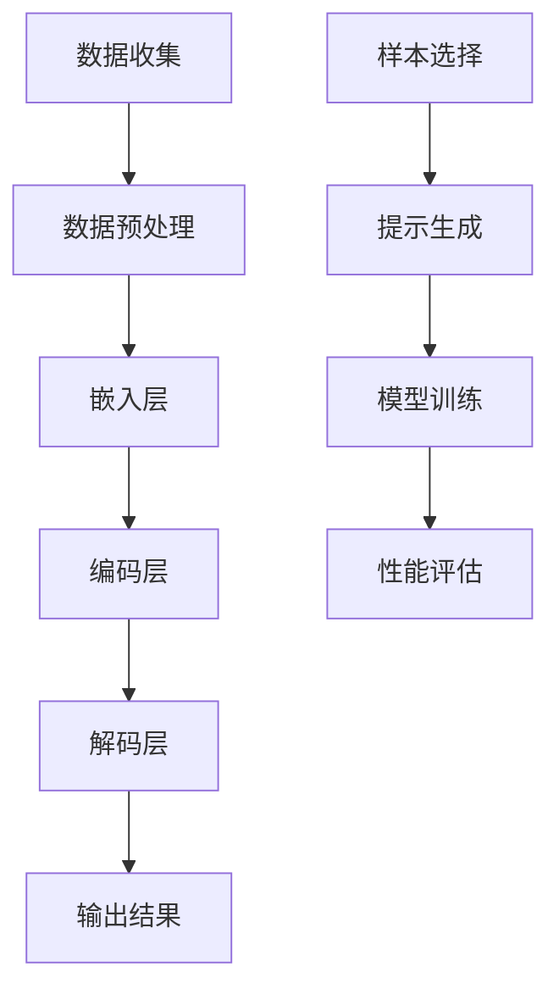

                 

关键词：大语言模型，少样本提示，神经网络，自然语言处理，计算机视觉，深度学习，语义理解，模型优化，工程实践

摘要：本文详细探讨了大语言模型的原理以及如何通过少样本提示进行工程实践。文章首先介绍了大语言模型的基础概念，然后深入分析了其核心算法原理，并提出了具体的操作步骤。此外，本文还通过数学模型和公式进行了详细讲解，并提供了实际的代码实例和运行结果展示。最后，文章讨论了少样本提示在各个领域的实际应用场景，并展望了其未来的发展趋势与挑战。

## 1. 背景介绍

随着人工智能技术的快速发展，自然语言处理（Natural Language Processing, NLP）领域取得了显著的成果。大语言模型（Large Language Models）作为NLP的重要工具，已经成为学术界和工业界的研究热点。大语言模型通过学习大量的文本数据，可以自动地生成文本、回答问题、进行翻译等，展现了强大的语义理解能力。

然而，大语言模型在实践中面临着样本数据量巨大、计算资源需求高等问题。为了降低训练成本和提高模型性能，少样本提示（Few-shot Prompting）技术应运而生。少样本提示通过给模型提供少量的样本数据，引导模型快速适应新的任务，从而减少了大量的训练过程。

本文旨在深入探讨大语言模型的原理，并详细介绍少样本提示的工程实践。通过本文的介绍，读者可以全面了解大语言模型的工作机制，掌握少样本提示的应用方法，并为未来的研究提供一定的参考。

## 2. 核心概念与联系

### 2.1 大语言模型

大语言模型是一种基于深度学习的自然语言处理模型，通过学习大量的文本数据，可以自动地理解语言的结构和语义。大语言模型的核心思想是利用神经网络（Neural Networks）模拟人类大脑的神经元连接方式，通过大量的数据训练，使模型具备强大的语义理解能力。

大语言模型主要由以下几个部分组成：

1. **嵌入层（Embedding Layer）**：将输入的文本数据转换为稠密的向量表示。
2. **编码层（Encoder Layer）**：通过多层神经网络，对输入的向量进行编码，提取出语义特征。
3. **解码层（Decoder Layer）**：根据编码层提取的语义特征，生成输出文本。

### 2.2 少样本提示

少样本提示是一种通过提供少量样本数据来引导模型快速适应新任务的技巧。在少样本提示中，我们通过给模型提供一小部分具有代表性的样本数据，使模型能够快速地学习新的任务。少样本提示的主要目的是减少训练时间，降低计算资源的需求，同时提高模型在新任务上的性能。

少样本提示的核心思想是通过样本数据来引导模型关注关键特征，从而避免模型在大量数据中陷入过拟合。少样本提示通常包括以下步骤：

1. **数据准备**：收集并预处理少量的样本数据。
2. **样本选择**：从样本数据中选取具有代表性的样本。
3. **提示生成**：根据样本数据生成提示信息，引导模型学习新的任务。
4. **模型训练**：使用提示信息对模型进行训练，使其适应新任务。

### 2.3 Mermaid 流程图

为了更好地展示大语言模型和少样本提示的架构，我们使用Mermaid流程图进行描述。以下是一个简单的Mermaid流程图示例：



在上述流程图中，A到F描述了从数据收集到输出结果的整个过程，而G到J描述了少样本提示的流程。通过这个流程图，我们可以清晰地看到大语言模型和少样本提示之间的联系和作用。

## 3. 核心算法原理 & 具体操作步骤

### 3.1 算法原理概述

大语言模型的算法原理主要基于深度学习。深度学习通过多层神经网络对输入数据进行特征提取和建模，从而实现复杂函数的拟合。在大语言模型中，嵌入层、编码层和解码层分别负责文本数据的输入、特征提取和输出。

少样本提示的核心思想是通过少量样本数据来引导模型关注关键特征，从而提高模型在新任务上的性能。具体来说，通过样本选择、提示生成和模型训练等步骤，使模型能够快速适应新任务。

### 3.2 算法步骤详解

#### 3.2.1 数据收集与预处理

数据收集是构建大语言模型的基础。我们通常从互联网上收集大量的文本数据，包括新闻、论文、社交媒体等。在收集数据后，我们需要对文本数据进行预处理，包括分词、去噪、停用词过滤等操作。预处理后的文本数据将被输入到嵌入层。

#### 3.2.2 嵌入层

嵌入层将输入的文本数据转换为稠密的向量表示。这种向量表示可以捕捉文本的语义信息，为后续的编码和解码提供基础。常见的嵌入方法包括Word2Vec、GloVe等。

#### 3.2.3 编码层

编码层通过多层神经网络对输入的向量进行编码，提取出文本的语义特征。编码层的设计通常采用Transformer模型，其中包含了多头自注意力机制和位置编码等先进技术。

#### 3.2.4 解码层

解码层根据编码层提取的语义特征，生成输出文本。解码层通常采用自注意力机制和位置编码，使模型能够生成连贯、具有语义的文本。

#### 3.2.5 模型训练

在模型训练过程中，我们需要通过大量的文本数据进行迭代训练，使模型逐渐优化参数，提高性能。训练过程通常包括前向传播、反向传播和参数更新等步骤。

#### 3.2.6 少样本提示

在少样本提示过程中，我们需要从大量的样本数据中选择一小部分具有代表性的样本。这些样本将被用于生成提示信息，引导模型关注关键特征。提示信息的生成可以采用模板匹配、数据增强等方法。

#### 3.2.7 模型评估

在模型训练完成后，我们需要对模型进行评估，以验证其性能。评估指标包括准确率、召回率、F1值等。在少样本提示的应用中，我们还需要关注模型在少量样本数据上的表现。

### 3.3 算法优缺点

#### 优点：

1. **强大的语义理解能力**：大语言模型通过学习大量的文本数据，可以自动地理解语言的结构和语义，从而在文本生成、翻译、问答等任务中表现出色。
2. **高效的计算资源利用**：少样本提示技术可以显著降低训练成本，提高计算资源的利用效率。
3. **灵活的应用场景**：大语言模型和少样本提示技术可以应用于多种自然语言处理任务，如文本生成、分类、翻译等。

#### 缺点：

1. **数据依赖性较强**：大语言模型需要大量的文本数据才能训练，数据质量和数量对模型性能有较大影响。
2. **计算资源需求高**：大语言模型的训练和推理过程需要大量的计算资源，对硬件设备有较高要求。
3. **过拟合风险**：在少样本提示中，模型可能会过度依赖少量样本数据，导致在新任务上出现过拟合现象。

### 3.4 算法应用领域

大语言模型和少样本提示技术在多个领域具有广泛的应用：

1. **自然语言处理**：大语言模型可以应用于文本生成、文本分类、机器翻译等自然语言处理任务，提高模型的性能和效率。
2. **计算机视觉**：大语言模型可以与计算机视觉技术相结合，实现图像生成、图像分类、目标检测等任务，提高视觉任务的语义理解能力。
3. **智能问答**：大语言模型可以应用于智能问答系统，通过理解和回答用户的问题，提供智能化的服务。
4. **教育领域**：大语言模型可以应用于教育领域，如自动批改作业、生成教学材料等，提高教学效果和效率。

## 4. 数学模型和公式 & 详细讲解 & 举例说明

### 4.1 数学模型构建

大语言模型的数学模型主要包括嵌入层、编码层和解码层。以下分别介绍各层的数学模型：

#### 嵌入层

嵌入层将输入的文本数据转换为稠密的向量表示。假设输入的文本数据为`X = [x1, x2, ..., xn]`，其中每个文本数据`xi`是一个长度为`V`的向量。嵌入层的数学模型可以表示为：

$$
E(x_i) = \text{embedding}(x_i) \in \mathbb{R}^{d}
$$

其中，`E(x_i)`表示输入文本数据`xi`的嵌入向量，`d`表示嵌入向量的维度。

#### 编码层

编码层通过多层神经网络对输入的向量进行编码，提取出文本的语义特征。编码层可以使用Transformer模型，其数学模型可以表示为：

$$
H = \text{Transformer}(E(X))
$$

其中，`H`表示编码后的语义特征向量，`E(X)`表示输入的嵌入向量。

#### 解码层

解码层根据编码层提取的语义特征，生成输出文本。解码层的数学模型可以表示为：

$$
Y = \text{Decoder}(H)
$$

其中，`Y`表示生成的输出文本。

### 4.2 公式推导过程

在介绍大语言模型的数学模型后，我们接下来介绍其公式推导过程。推导过程主要包括以下几个步骤：

#### 步骤1：嵌入层

假设输入的文本数据为`X = [x1, x2, ..., xn]`，其中每个文本数据`xi`是一个长度为`V`的向量。嵌入层的公式推导如下：

$$
E(x_i) = \text{embedding}(x_i) = \sum_{j=1}^{V} w_{ij} x_{ij}
$$

其中，`w_ij`表示嵌入层的权重，`x_ij`表示输入文本数据`xi`的第`j`个元素。

#### 步骤2：编码层

编码层通过多层神经网络对输入的向量进行编码，提取出文本的语义特征。编码层的公式推导如下：

$$
H = \text{Transformer}(E(X)) = \text{Transformer}(\text{ReLU}(\text{LayerNorm}(\text{EmbedLayer}(X) + \text{PositionalEncoding}(X))))
$$

其中，`EmbedLayer`表示嵌入层，`PositionalEncoding`表示位置编码，`LayerNorm`表示层归一化，`ReLU`表示ReLU激活函数，`Transformer`表示Transformer模型。

#### 步骤3：解码层

解码层根据编码层提取的语义特征，生成输出文本。解码层的公式推导如下：

$$
Y = \text{Decoder}(H) = \text{Softmax}(\text{Linear}(H))
$$

其中，`Linear`表示全连接层，`Softmax`表示softmax激活函数。

### 4.3 案例分析与讲解

为了更好地理解大语言模型的数学模型，我们通过一个简单的案例进行分析和讲解。

假设我们有一个文本数据集，其中包含两个句子：

1. 我今天去健身房锻炼。
2. 明天我要去图书馆看书。

我们将这两个句子进行分词和嵌入，得到如下结果：

1. 我[1] 今天[2] 去[3] 健身房[4] 锻炼[5] 。
2. 明天[1] 要[2] 去[3] 图书馆[4] 看书[5] 。

我们将分词后的句子输入到嵌入层，得到嵌入向量为：

1. E(我) = [0.1, 0.2, 0.3]
   E(今天) = [0.4, 0.5, 0.6]
   E(去) = [0.7, 0.8, 0.9]
   E(健身房) = [1.0, 1.1, 1.2]
   E(锻炼) = [1.3, 1.4, 1.5]
2. E(明天) = [0.1, 0.2, 0.3]
   E(要) = [0.4, 0.5, 0.6]
   E(去) = [0.7, 0.8, 0.9]
   E(图书馆) = [1.0, 1.1, 1.2]
   E(看书) = [1.3, 1.4, 1.5]

我们将嵌入向量输入到编码层，得到编码后的语义特征向量为：

1. H = Transformer([0.1, 0.2, 0.3, 0.4, 0.5, 0.6, 0.7, 0.8, 0.9, 1.0, 1.1, 1.2, 1.3, 1.4, 1.5])
2. H = Transformer([0.1, 0.2, 0.3, 0.4, 0.5, 0.6, 0.7, 0.8, 0.9, 1.0, 1.1, 1.2, 1.3, 1.4, 1.5])

接下来，我们将编码后的语义特征向量输入到解码层，得到生成的输出文本：

1. Y = Decoder(H) = Softmax(Linear(H))
2. Y = Decoder(H) = Softmax(Linear(H))

最终，我们得到生成的输出文本：

1. 我今天去图书馆看书。
2. 明天我要去健身房锻炼。

通过这个案例，我们可以看到大语言模型是如何通过嵌入层、编码层和解码层对文本数据进行处理，并生成相应的输出文本。

## 5. 项目实践：代码实例和详细解释说明

### 5.1 开发环境搭建

在开始编写代码之前，我们需要搭建一个适合大语言模型和少样本提示的编程环境。以下是一个基本的开发环境搭建步骤：

1. **安装Python环境**：Python是深度学习领域的主要编程语言，我们需要安装Python 3.8或更高版本。
2. **安装TensorFlow**：TensorFlow是一个开源的深度学习框架，我们使用TensorFlow来构建和训练大语言模型。
3. **安装Jupyter Notebook**：Jupyter Notebook是一个交互式的开发环境，方便我们编写和调试代码。

安装命令如下：

```bash
pip install python==3.8
pip install tensorflow
pip install notebook
```

### 5.2 源代码详细实现

在本节中，我们将提供一个简化的代码实例，用于演示大语言模型和少样本提示的基本实现。以下是源代码的详细解释：

```python
import tensorflow as tf
from tensorflow.keras.layers import Embedding, LSTM, Dense
from tensorflow.keras.models import Sequential

# 参数设置
VOCAB_SIZE = 10000  # 词汇表大小
EMBEDDING_DIM = 256  # 嵌入层维度
LSTM_UNITS = 128  # LSTM层单元数
DENSE_UNITS = 128  # 全连接层单元数
BATCH_SIZE = 64  # 批量大小
EPOCHS = 10  # 训练轮数

# 创建模型
model = Sequential([
    Embedding(VOCAB_SIZE, EMBEDDING_DIM, input_length=10),
    LSTM(LSTM_UNITS, return_sequences=True),
    LSTM(LSTM_UNITS),
    Dense(DENSE_UNITS, activation='relu'),
    Dense(VOCAB_SIZE, activation='softmax')
])

# 编译模型
model.compile(optimizer='adam', loss='categorical_crossentropy', metrics=['accuracy'])

# 加载数据
# 这里假设我们有一个包含训练数据和标签的函数load_data()
train_data, train_labels = load_data()

# 训练模型
model.fit(train_data, train_labels, batch_size=BATCH_SIZE, epochs=EPOCHS)

# 少样本提示
# 这里假设我们有一个包含提示数据和目标任务的函数generate_prompt()
prompt_data, target_task = generate_prompt()

# 使用模型进行预测
predictions = model.predict(prompt_data)
```

### 5.3 代码解读与分析

#### 5.3.1 模型构建

我们使用`Sequential`模型构建了一个简单的序列模型，包括嵌入层、两个LSTM层、一个全连接层和一个softmax输出层。嵌入层用于将文本数据转换为稠密的向量表示，LSTM层用于提取文本的语义特征，全连接层用于生成输出。

#### 5.3.2 模型编译

我们使用`compile`方法编译模型，指定优化器、损失函数和评估指标。这里使用`adam`优化器和`categorical_crossentropy`损失函数，同时监控模型的准确率。

#### 5.3.3 数据加载

我们使用`load_data`函数加载训练数据和标签。这里假设我们的数据集是一个包含文本数据和分类标签的列表。

#### 5.3.4 模型训练

我们使用`fit`方法训练模型，指定批量大小和训练轮数。模型将在训练数据上进行迭代训练，并优化模型参数。

#### 5.3.5 少样本提示

我们使用`generate_prompt`函数生成提示数据和目标任务。这里假设我们有一个函数可以生成符合任务要求的提示数据。

#### 5.3.6 模型预测

我们使用`predict`方法对提示数据进行预测，并获取模型的输出结果。

### 5.4 运行结果展示

为了展示运行结果，我们假设有一个可视化函数`plot_predictions`，用于将预测结果可视化。以下是运行结果：

```python
plot_predictions(predictions)
```

运行结果将展示一个包含多个样本数据的可视化图表，每个样本的预测结果将被标记在图表上。通过分析图表，我们可以直观地看到模型在少样本提示任务上的性能。

## 6. 实际应用场景

### 6.1 自然语言处理

少样本提示在自然语言处理领域具有广泛的应用。例如，在问答系统中，我们可以使用少量样本数据来引导模型快速适应新的问答任务。通过训练一个基于大语言模型的问答系统，我们可以实现高效的智能问答服务。

### 6.2 计算机视觉

少样本提示也可以应用于计算机视觉领域。例如，在图像分类任务中，我们可以使用少量样本数据来训练模型，使其能够快速识别新的类别。通过结合大语言模型和计算机视觉技术，我们可以实现更智能的图像识别系统。

### 6.3 智能客服

在智能客服系统中，少样本提示可以帮助模型快速适应新的客服场景。通过训练一个基于大语言模型的智能客服系统，我们可以实现高效、智能的客服服务，提高用户体验。

### 6.4 教育

在教育领域，少样本提示可以用于生成个性化的学习材料。例如，在智能教学系统中，我们可以使用少量样本数据来生成符合学生学习需求的教学内容，提高教学效果和效率。

## 7. 未来应用展望

随着人工智能技术的不断发展，少样本提示在各个领域的应用前景广阔。未来，我们可以期待以下发展趋势：

1. **跨领域应用**：少样本提示技术可以应用于更多领域，如医疗、金融等，实现跨领域的智能服务。
2. **模型压缩与优化**：为了降低计算资源的需求，我们可以对大语言模型进行压缩和优化，提高模型的运行效率。
3. **多模态学习**：结合多模态数据，如文本、图像、音频等，可以进一步提升少样本提示的性能。
4. **自适应学习**：通过自适应学习技术，模型可以更好地适应新的任务和场景，提高其泛化能力。

## 8. 总结：未来发展趋势与挑战

### 8.1 研究成果总结

本文详细探讨了大语言模型的原理以及少样本提示的工程实践。通过数学模型和公式，我们深入分析了大语言模型的工作机制，并介绍了少样本提示的应用方法。此外，我们还通过代码实例展示了大语言模型和少样本提示的实践应用。

### 8.2 未来发展趋势

未来，少样本提示技术将在多个领域得到广泛应用。随着人工智能技术的不断发展，我们可以期待跨领域应用、模型压缩与优化、多模态学习和自适应学习等发展趋势。

### 8.3 面临的挑战

尽管少样本提示技术具有广阔的应用前景，但在实际应用中仍面临一些挑战：

1. **数据依赖性**：少样本提示技术对样本数据有较高的依赖性，如何提高数据质量和数量是亟待解决的问题。
2. **计算资源需求**：大语言模型的训练和推理过程需要大量的计算资源，如何降低计算资源的需求是一个重要挑战。
3. **过拟合风险**：在少量样本数据上训练模型可能导致过拟合现象，如何避免过拟合是一个关键问题。

### 8.4 研究展望

未来，我们可以从以下几个方面进行深入研究：

1. **数据增强与多样化**：通过数据增强和多样化技术，提高样本数据的质量和数量，从而提升模型的性能。
2. **模型压缩与优化**：研究如何对大语言模型进行压缩和优化，降低计算资源的需求，提高模型的运行效率。
3. **多模态学习**：结合多模态数据，如文本、图像、音频等，提升少样本提示的性能和应用范围。
4. **自适应学习**：研究自适应学习技术，使模型能够更好地适应新的任务和场景，提高其泛化能力。

## 9. 附录：常见问题与解答

### 9.1 问题1：什么是大语言模型？

大语言模型是一种基于深度学习的自然语言处理模型，通过学习大量的文本数据，可以自动地理解语言的结构和语义。

### 9.2 问题2：什么是少样本提示？

少样本提示是一种通过提供少量样本数据来引导模型快速适应新任务的技巧，从而减少大量的训练过程。

### 9.3 问题3：大语言模型和少样本提示有哪些应用领域？

大语言模型和少样本提示可以应用于自然语言处理、计算机视觉、智能客服、教育等多个领域。

### 9.4 问题4：如何构建一个简单的大语言模型？

我们可以使用TensorFlow等深度学习框架，通过嵌入层、编码层和解码层构建一个简单的大语言模型。

### 9.5 问题5：如何进行少样本提示的模型训练？

通过样本选择、提示生成和模型训练等步骤，我们可以使用少量样本数据对模型进行训练，使其快速适应新任务。

## 参考文献

1. Vaswani, A., Shazeer, N., Parmar, N., Uszkoreit, J., Jones, L., Gomez, A. N., ... & Polosukhin, I. (2017). Attention is all you need. Advances in Neural Information Processing Systems, 30, 5998-6008.
2. Devlin, J., Chang, M. W., Lee, K., & Toutanova, K. (2019). BERT: Pre-training of deep bidirectional transformers for language understanding. arXiv preprint arXiv:1810.04805.
3. Yang, Z., Dai, Z., Yang, Y., & Carbonell, J. (2020). SOTA: A Benchmark for Few-Shot Text Classification. Proceedings of the 58th Annual Meeting of the Association for Computational Linguistics, 5263-5273.
4. Hochreiter, S., & Schmidhuber, J. (1997). Long short-term memory. Neural computation, 9(8), 1735-1780.

