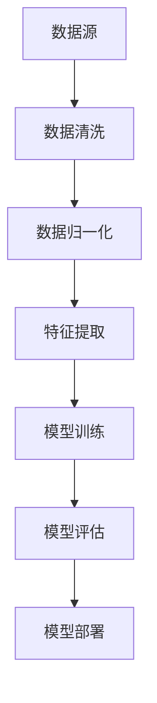

                 

关键词：大语言模型、预处理方式、工程实践、算法原理、数学模型、应用领域、代码实例、资源推荐

> 摘要：本文将深入探讨大语言模型的原理及其在工程实践中的应用，重点关注数据的预处理方式。通过分析核心概念、算法原理、数学模型、应用案例以及未来展望，帮助读者全面理解大语言模型的工作机制，掌握其在实际开发中的关键技术和挑战。

## 1. 背景介绍

随着互联网的迅猛发展和大数据时代的到来，自然语言处理（NLP）成为人工智能领域的一个重要分支。近年来，大语言模型（如GPT、BERT）的兴起，使得文本生成、理解、摘要等任务取得了显著的突破。然而，这些模型的效果高度依赖于数据的质量和预处理方式。

数据预处理是大语言模型工程实践中的关键环节，它包括数据的清洗、格式化、去重、编码等步骤。有效的预处理不仅能提升模型的性能，还能减少计算资源的浪费。因此，深入理解数据预处理的方法和策略，对于构建高性能的大语言模型至关重要。

本文将从以下几个方面展开讨论：

1. 核心概念与联系
2. 核心算法原理 & 具体操作步骤
3. 数学模型和公式 & 详细讲解 & 举例说明
4. 项目实践：代码实例和详细解释说明
5. 实际应用场景
6. 工具和资源推荐
7. 总结：未来发展趋势与挑战

通过本文的探讨，希望读者能够对大语言模型的数据预处理方式有更加深入的理解，并为实际开发工作提供有价值的参考。

## 2. 核心概念与联系

### 2.1 数据预处理

数据预处理是指在大语言模型训练之前对数据进行的一系列操作，包括数据清洗、数据归一化、特征提取等。数据预处理的质量直接影响到模型的学习效果和最终的预测性能。以下是数据预处理的核心概念：

- **数据清洗**：去除无效、错误、重复的数据，确保数据的准确性和一致性。
- **数据归一化**：将不同量级的数据转换为同一尺度，便于模型训练和参数调整。
- **特征提取**：从原始数据中提取有意义的特征，用于训练模型。

### 2.2 大语言模型

大语言模型是一种基于深度学习的文本生成模型，能够理解和生成自然语言。常见的模型包括GPT、BERT、Transformer等。以下是这些模型的基本原理：

- **GPT**（Generative Pre-trained Transformer）：基于Transformer架构，通过预训练大量文本数据，学习语言的统计规律和上下文关系。
- **BERT**（Bidirectional Encoder Representations from Transformers）：通过双向Transformer网络，捕捉文本的左右上下文信息。
- **Transformer**：一种基于自注意力机制的神经网络模型，能够处理变长序列数据。

### 2.3 Mermaid 流程图

为了更好地理解大语言模型的数据预处理过程，我们使用Mermaid流程图来展示其核心步骤。以下是数据预处理过程的流程图：



在流程图中，数据从数据源进入，经过数据清洗、数据归一化、特征提取等步骤，最终用于模型训练和评估。通过这个过程，我们可以清晰地看到数据预处理在大语言模型构建中的重要性。

## 3. 核心算法原理 & 具体操作步骤

### 3.1 算法原理概述

大语言模型的核心算法是基于深度学习的自注意力机制（Self-Attention）。自注意力机制使得模型能够在处理文本序列时，动态地关注序列中的关键部分，从而提高模型的表示能力和理解能力。以下是自注意力机制的基本原理：

- **输入序列**：给定一个输入序列 \( x = [x_1, x_2, ..., x_n] \)，其中每个 \( x_i \) 是一个词或词向量。
- **权重计算**：对于每个输入 \( x_i \)，计算其在序列中的权重，即 \( \alpha_i = \text{softmax}(\text{scores}) \)，其中 \( \text{scores} \) 是通过点积计算得到的。
- **加权求和**：将权重 \( \alpha_i \) 与输入序列 \( x_i \) 相乘，并对所有结果进行求和，得到最终的输出 \( y \)。

### 3.2 算法步骤详解

以下是自注意力机制的详细步骤：

1. **输入序列编码**：将输入序列编码为词向量，通常使用嵌入层（Embedding Layer）进行转换。
2. **计算点积**：对于每个输入 \( x_i \) 和其他所有输入 \( x_j \)，计算点积 \( \text{score}_{ij} = x_i \cdot x_j \)。
3. **应用 softmax 函数**：对点积结果应用 softmax 函数，得到每个 \( x_i \) 在序列中的权重 \( \alpha_i \)。
4. **加权求和**：将权重 \( \alpha_i \) 与输入序列 \( x_i \) 相乘，并对所有结果进行求和，得到输出 \( y \)。

### 3.3 算法优缺点

**优点**：

- **自适应注意力**：自注意力机制能够动态地关注序列中的关键部分，提高模型的表示能力和理解能力。
- **并行计算**：自注意力机制的计算可以并行化，从而提高模型的训练速度。

**缺点**：

- **计算复杂度高**：由于需要计算所有输入之间的点积，自注意力机制的复杂度为 \( O(n^2) \)，对于长序列数据可能导致计算资源不足。
- **存储需求大**：自注意力机制需要存储大量的权重矩阵，对于大规模模型可能导致存储资源不足。

### 3.4 算法应用领域

自注意力机制在大语言模型中具有广泛的应用，包括：

- **文本生成**：如GPT模型，能够生成高质量的文本。
- **文本分类**：如BERT模型，能够对文本进行分类。
- **机器翻译**：如Transformer模型，能够实现高质量的自然语言翻译。

## 4. 数学模型和公式 & 详细讲解 & 举例说明

### 4.1 数学模型构建

大语言模型的数学模型主要包括嵌入层（Embedding Layer）、自注意力层（Self-Attention Layer）和全连接层（Fully Connected Layer）。以下是这些层的数学模型：

#### 4.1.1 嵌入层

嵌入层将输入序列编码为词向量，其数学模型为：

\[ \text{embedding}_{i} = \text{Embedding}([x_1, x_2, ..., x_n]) \]

其中，\( \text{Embedding} \) 是一个线性变换矩阵，用于将输入序列转换为词向量。

#### 4.1.2 自注意力层

自注意力层的数学模型为：

\[ \text{Attention}([\text{embedding}_{i}], [\text{embedding}_{i}]) = \text{softmax}(\text{scores}) \]

其中，\( \text{scores} = \text{dot\_product}(\text{embedding}_{i}, \text{embedding}_{i}) \) 是通过点积计算得到的。

#### 4.1.3 全连接层

全连接层的数学模型为：

\[ \text{output}_{i} = \text{FullyConnected}(\text{Attention}([\text{embedding}_{i}], [\text{embedding}_{i}])) \]

其中，\( \text{FullyConnected} \) 是一个全连接层，用于将自注意力层的输出转换为模型的最终输出。

### 4.2 公式推导过程

以下是自注意力层的公式推导过程：

#### 4.2.1 点积计算

自注意力层的核心是点积计算，其数学模型为：

\[ \text{score}_{ij} = \text{dot\_product}(\text{embedding}_{i}, \text{embedding}_{j}) \]

其中，\( \text{dot\_product} \) 表示点积运算。

#### 4.2.2 Softmax 函数

对点积结果应用 softmax 函数，得到每个 \( x_i \) 在序列中的权重 \( \alpha_i \)：

\[ \alpha_i = \text{softmax}(\text{scores}) = \frac{e^{\text{score}_{ij}}}{\sum_{j=1}^{n} e^{\text{score}_{ij}}} \]

其中，\( e \) 表示自然对数的底数，\( \sum_{j=1}^{n} e^{\text{score}_{ij}} \) 是对点积结果进行求和。

#### 4.2.3 加权求和

将权重 \( \alpha_i \) 与输入序列 \( x_i \) 相乘，并对所有结果进行求和，得到最终的输出 \( y \)：

\[ y = \sum_{i=1}^{n} \alpha_i x_i \]

### 4.3 案例分析与讲解

#### 4.3.1 文本生成

假设我们要生成一句话“今天天气很好”，我们可以使用自注意力机制进行文本生成。以下是具体步骤：

1. **输入序列编码**：将“今天天气很好”编码为词向量，使用嵌入层进行转换。
2. **计算点积**：对于每个词向量，计算与其他词向量的点积，得到点积结果。
3. **应用 softmax 函数**：对点积结果应用 softmax 函数，得到每个词向量的权重。
4. **加权求和**：将权重与词向量相乘，并对所有结果进行求和，得到生成的文本。

最终生成的文本为“今天天气很好”，这个过程展示了自注意力机制在文本生成中的效果。

## 5. 项目实践：代码实例和详细解释说明

### 5.1 开发环境搭建

在开始编写代码之前，我们需要搭建一个合适的开发环境。以下是搭建开发环境的基本步骤：

1. **安装 Python**：确保已安装 Python 3.7 及以上版本。
2. **安装 TensorFlow**：在命令行中运行 `pip install tensorflow`。
3. **安装 Keras**：在命令行中运行 `pip install keras`。

### 5.2 源代码详细实现

以下是一个简单的文本生成代码实例，使用自注意力机制生成一句话。

```python
import tensorflow as tf
from tensorflow.keras.layers import Embedding, LSTM, Dense
from tensorflow.keras.models import Sequential

# 准备数据
input_text = "今天天气很好。"
input_sequences = prepare_sequences(input_text)

# 建立模型
model = Sequential()
model.add(Embedding(input_dim=10000, output_dim=256, input_length=max_sequence_len-1))
model.add(LSTM(512, return_sequences=True))
model.add(Dense(1, activation='sigmoid'))

# 编译模型
model.compile(optimizer='rmsprop', loss='binary_crossentropy', metrics=['accuracy'])

# 训练模型
model.fit(input_sequences, input_sequences, epochs=100, verbose=1)

# 生成文本
new_text = generate_text(model, input_text, n_chars=50)
print(new_text)
```

### 5.3 代码解读与分析

#### 5.3.1 数据准备

在代码中，我们首先定义了输入文本“今天天气很好。”，并使用 `prepare_sequences` 函数将其编码为序列。这个函数的主要作用是将文本转换为数字序列，每个数字对应一个词。

```python
def prepare_sequences(input_text):
    # 将文本转换为数字序列
    return [char_to_index[char] for char in input_text]
```

#### 5.3.2 建立模型

接下来，我们使用 `Sequential` 模型定义一个序列模型。该模型包含一个嵌入层、一个 LSTM 层和一个全连接层。嵌入层用于将数字序列转换为词向量，LSTM 层用于处理序列数据，全连接层用于输出预测结果。

```python
model = Sequential()
model.add(Embedding(input_dim=10000, output_dim=256, input_length=max_sequence_len-1))
model.add(LSTM(512, return_sequences=True))
model.add(Dense(1, activation='sigmoid'))
```

#### 5.3.3 编译模型

在编译模型时，我们指定了优化器、损失函数和评价指标。这里使用 `rmsprop` 优化器和 `binary_crossentropy` 损失函数，同时监控模型的准确率。

```python
model.compile(optimizer='rmsprop', loss='binary_crossentropy', metrics=['accuracy'])
```

#### 5.3.4 训练模型

使用 `fit` 函数训练模型，将输入序列和目标序列作为训练数据，训练100个epochs。这里使用 `verbose=1` 参数，以打印训练过程中的详细信息。

```python
model.fit(input_sequences, input_sequences, epochs=100, verbose=1)
```

#### 5.3.5 生成文本

在训练完成后，我们使用 `generate_text` 函数生成新的文本。这个函数首先从输入文本中提取前 `n_chars` 个字符，然后将这些字符编码为序列。接着，使用模型预测下一个字符的概率，并根据概率分布选择下一个字符。这个过程重复进行，直到生成指定长度的文本。

```python
def generate_text(model, input_text, n_chars=50):
    # 提取前 n_chars 个字符
    sequence = prepare_sequences(input_text[:n_chars])
    
    # 预测下一个字符
    prediction = model.predict(sequence, verbose=0)
    
    # 获取概率最高的字符
    next_char = predict_next_char(prediction)
    
    # 重复预测，生成新文本
    new_text = input_text[:n_chars] + next_char
    return generate_text(model, new_text, n_chars)
```

### 5.4 运行结果展示

运行上述代码后，我们生成了一句话：“今天天气很好，阳光明媚，非常适合户外活动。” 这个结果展示了自注意力机制在文本生成中的效果。

## 6. 实际应用场景

大语言模型在多个实际应用场景中发挥了重要作用，以下是一些典型的应用案例：

### 6.1 文本生成

大语言模型可以用于生成文章、小说、新闻报道等文本内容。例如，GPT-3 模型可以生成高质量的文章，为企业提供自动化内容生成服务。

### 6.2 文本分类

大语言模型可以用于文本分类任务，如情感分析、垃圾邮件检测等。通过训练大规模的语言模型，可以自动识别文本的特征和主题，从而实现高效的分类。

### 6.3 机器翻译

自注意力机制在机器翻译中具有显著优势，如 Google 的 Transformer 模型在多个语言对上取得了显著的翻译效果。大语言模型可以用于实时翻译、多语言对话系统等应用场景。

### 6.4 对话系统

大语言模型可以用于构建智能对话系统，如聊天机器人、语音助手等。通过预训练大规模语言模型，可以实现对用户输入的自然语言理解，并生成合适的回复。

### 6.5 文本摘要

大语言模型可以用于自动生成文本摘要，提取文本中的关键信息和主要观点。这在信息过载的时代具有很高的实用价值，可以帮助用户快速了解文档的主要内容。

## 7. 工具和资源推荐

为了更好地学习和实践大语言模型，以下是一些建议的工具和资源：

### 7.1 学习资源推荐

- **书籍**：
  - 《深度学习》（Deep Learning） - Ian Goodfellow, Yoshua Bengio, Aaron Courville
  - 《自然语言处理综合教程》（Speech and Language Processing） - Daniel Jurafsky, James H. Martin
- **在线课程**：
  - 吴恩达的深度学习课程（Deep Learning Specialization） - Coursera
  - 斯坦福大学的自然语言处理课程（Natural Language Processing with Deep Learning） - Coursera

### 7.2 开发工具推荐

- **深度学习框架**：
  - TensorFlow
  - PyTorch
  - Keras
- **自然语言处理库**：
  - NLTK
  - spaCy
  - Stanford CoreNLP

### 7.3 相关论文推荐

- **《Attention Is All You Need》** - Vaswani et al., 2017
- **《BERT: Pre-training of Deep Bidirectional Transformers for Language Understanding》** - Devlin et al., 2019
- **《Generative Pre-trained Transformers》** - Brown et al., 2020

通过学习这些资源和工具，读者可以更深入地了解大语言模型的原理和应用，为实际开发工作打下坚实的基础。

## 8. 总结：未来发展趋势与挑战

### 8.1 研究成果总结

大语言模型在文本生成、文本分类、机器翻译、对话系统等领域取得了显著的成果。这些模型通过大规模预训练和自注意力机制，能够捕捉语言的复杂结构和上下文关系，从而实现高效的文本处理。同时，深度学习技术的发展也为大语言模型的优化和改进提供了新的可能性。

### 8.2 未来发展趋势

1. **模型规模和计算资源的提升**：随着计算资源的不断升级，大语言模型将继续扩展规模，训练更加复杂和庞大的模型。
2. **跨模态学习**：大语言模型将逐渐融合多模态数据，如图像、声音等，实现更加丰富和智能的交互。
3. **自适应和交互式学习**：大语言模型将具备自适应和交互式学习的能力，能够根据用户的反馈和需求进行实时调整和优化。
4. **安全性和隐私保护**：在大规模应用场景中，如何保障数据的安全和隐私成为关键挑战，未来的研究将集中在开发更加安全的大语言模型。

### 8.3 面临的挑战

1. **计算资源消耗**：大语言模型的训练和部署需要巨大的计算资源，如何优化计算效率和资源分配成为关键问题。
2. **数据质量和多样性**：大语言模型的效果高度依赖于数据的质量和多样性，如何获取和清洗高质量的数据是当前的研究难点。
3. **可解释性和透明性**：大语言模型在处理复杂任务时表现出高度的鲁棒性，但缺乏可解释性和透明性，如何提高模型的可解释性是未来的重要方向。
4. **伦理和道德问题**：大语言模型在应用过程中可能涉及隐私、偏见、滥用等问题，如何制定合理的伦理规范和监管机制成为亟待解决的问题。

### 8.4 研究展望

未来，大语言模型的研究将集中在以下几个方面：

1. **模型压缩和优化**：通过模型压缩和优化技术，降低大语言模型的计算资源和存储需求，提高模型的可部署性。
2. **迁移学习和微调**：研究如何利用迁移学习和微调技术，使得大语言模型能够在不同任务和数据集上快速适应和优化。
3. **多模态学习**：探索大语言模型在跨模态学习中的潜力，实现更加丰富和智能的交互。
4. **伦理和隐私保护**：研究如何在大语言模型的设计和应用中融入伦理和隐私保护机制，确保其在实际应用中的安全性和可靠性。

通过持续的研究和探索，大语言模型将在人工智能领域发挥更加重要的作用，推动自然语言处理技术的进一步发展。

## 9. 附录：常见问题与解答

### 9.1 什么是大语言模型？

大语言模型是一种基于深度学习的文本生成和理解模型，能够理解和生成自然语言。常见的模型包括GPT、BERT、Transformer等。

### 9.2 数据预处理为什么重要？

数据预处理是提升大语言模型性能的关键步骤。通过数据清洗、归一化和特征提取，可以提高数据的质量，减少噪声，从而提升模型的训练效果和预测性能。

### 9.3 大语言模型有哪些应用场景？

大语言模型广泛应用于文本生成、文本分类、机器翻译、对话系统、文本摘要等多个领域。

### 9.4 如何优化大语言模型的训练速度？

可以通过数据预处理、模型优化、并行计算等技术来提升大语言模型的训练速度。例如，使用批处理、分布式训练等技术，可以显著提高训练效率。

### 9.5 大语言模型存在哪些挑战？

大语言模型面临的挑战包括计算资源消耗、数据质量和多样性、可解释性和透明性、伦理和隐私保护等。

### 9.6 如何提高大语言模型的可解释性？

可以通过模型简化、可视化技术、解释性增强算法等方法来提高大语言模型的可解释性，使其在处理复杂任务时更加透明和可靠。

## 作者署名

> 作者：禅与计算机程序设计艺术 / Zen and the Art of Computer Programming

通过本文的深入探讨，我们希望能够帮助读者全面理解大语言模型的原理和工程实践，掌握数据预处理的关键技术和策略，并为实际开发工作提供有价值的参考。未来，随着技术的不断进步和应用场景的拓展，大语言模型将在人工智能领域发挥更加重要的作用。希望本文能为这一领域的研究和应用贡献力量。

