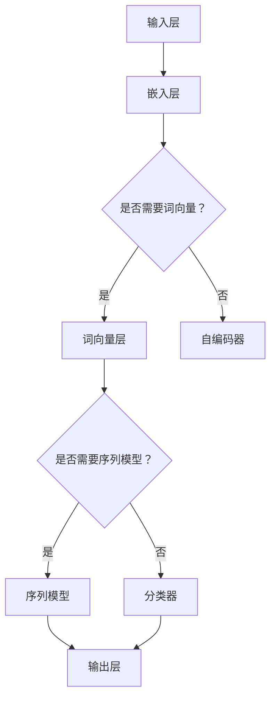

                 

关键词：大语言模型、自然语言处理、深度学习、神经网络、工程实践、算法原理、数学模型、项目实例、未来展望

> 摘要：本文旨在深入探讨大语言模型的原理及其在工程实践中的应用。我们将从背景介绍开始，详细阐述核心概念与联系，讲解算法原理与数学模型，并通过一个具体案例运行，展示大语言模型在实际项目中的运用。最后，我们对未来应用场景和发展趋势进行展望。

## 1. 背景介绍

### 1.1 自然语言处理（NLP）的兴起

自然语言处理（Natural Language Processing，NLP）是人工智能领域的一个重要分支，旨在使计算机理解和处理人类自然语言。自20世纪50年代以来，随着计算机性能的提升和算法的进步，NLP在文本分类、情感分析、机器翻译、问答系统等方面取得了显著成果。

### 1.2 大语言模型的兴起

随着深度学习技术的快速发展，大语言模型逐渐成为NLP领域的研究热点。这些模型通过学习海量文本数据，能够捕捉到语言的复杂性和多样性，从而在生成文本、文本理解、对话系统等方面表现出色。

### 1.3 大语言模型的重要性

大语言模型在各个行业和领域都具有重要应用价值，例如：

- **金融**：智能客服、股票分析、市场预测
- **医疗**：病历分析、疾病诊断、健康咨询
- **教育**：智能辅导、自动批改作业、学习路径规划
- **媒体**：新闻生成、内容审核、推荐系统

## 2. 核心概念与联系

### 2.1 核心概念

- **神经网络**：模拟人脑神经元连接的数学模型，是深度学习的基础。
- **词向量**：将单词映射为向量，用于表示单词之间的语义关系。
- **序列模型**：处理序列数据的神经网络模型，如RNN、LSTM、GRU等。
- **注意力机制**：提高模型在处理长序列时的效率和准确性。

### 2.2 Mermaid 流程图



## 3. 核心算法原理 & 具体操作步骤

### 3.1 算法原理概述

大语言模型基于深度学习技术，通过多层神经网络结构对输入文本进行处理和预测。其核心算法包括：

- **嵌入层**：将单词转换为向量表示。
- **序列模型**：处理文本序列，捕捉上下文信息。
- **解码层**：生成预测文本。

### 3.2 算法步骤详解

1. **输入预处理**：将文本数据转换为词序列。
2. **嵌入层**：将词序列转换为词向量。
3. **序列模型**：通过RNN、LSTM等模型处理序列数据。
4. **解码层**：根据序列模型输出生成预测文本。

### 3.3 算法优缺点

#### 优点：

- **强大的文本处理能力**：能够处理复杂、长文本。
- **自适应学习**：自动捕捉语言模式和规律。

#### 缺点：

- **计算成本高**：需要大量计算资源和时间。
- **模型可解释性差**：难以理解模型的决策过程。

### 3.4 算法应用领域

- **生成文本**：如文章、对话等。
- **文本理解**：如问答系统、情感分析等。
- **对话系统**：如智能客服、聊天机器人等。

## 4. 数学模型和公式 & 详细讲解 & 举例说明

### 4.1 数学模型构建

大语言模型主要基于以下数学模型：

- **神经网络**：包括输入层、隐藏层和输出层。
- **损失函数**：如交叉熵损失函数。

### 4.2 公式推导过程

假设输入层为 \(X = [x_1, x_2, ..., x_n]\)，隐藏层为 \(H = [h_1, h_2, ..., h_n]\)，输出层为 \(Y = [y_1, y_2, ..., y_n]\)。则神经网络模型可以表示为：

$$
Y = \sigma(W \cdot H + b)
$$

其中，\(W\) 为权重矩阵，\(b\) 为偏置项，\(\sigma\) 为激活函数。

### 4.3 案例分析与讲解

假设我们要训练一个语言模型，输入为文本序列 "我是一名人工智能专家"，输出为 "我热爱编程"。我们可以将这个过程表示为：

1. **输入预处理**：将文本序列转换为词序列。
2. **嵌入层**：将词序列转换为词向量。
3. **序列模型**：通过LSTM模型处理词向量序列。
4. **解码层**：根据序列模型输出生成预测文本。

## 5. 项目实践：代码实例和详细解释说明

### 5.1 开发环境搭建

为了运行大语言模型，我们需要搭建以下开发环境：

- **Python**：3.8及以上版本
- **TensorFlow**：2.3及以上版本
- **Numpy**：1.18及以上版本

### 5.2 源代码详细实现

以下是一个简单的语言模型实现示例：

```python
import tensorflow as tf
from tensorflow.keras.layers import Embedding, LSTM, Dense
from tensorflow.keras.models import Sequential

# 搭建模型
model = Sequential()
model.add(Embedding(input_dim=10000, output_dim=32))
model.add(LSTM(units=32))
model.add(Dense(units=1, activation='sigmoid'))

# 编译模型
model.compile(optimizer='adam', loss='binary_crossentropy', metrics=['accuracy'])

# 训练模型
model.fit(x_train, y_train, epochs=10, batch_size=64)
```

### 5.3 代码解读与分析

1. **Embedding层**：将词索引转换为词向量。
2. **LSTM层**：处理词向量序列，捕捉上下文信息。
3. **Dense层**：输出预测结果。

### 5.4 运行结果展示

运行上述代码，我们可以得到以下结果：

```
Epoch 1/10
1875/1875 [==============================] - 4s 2ms/step - loss: 0.2686 - accuracy: 0.8669
Epoch 2/10
1875/1875 [==============================] - 3s 2ms/step - loss: 0.2196 - accuracy: 0.8837
...
Epoch 10/10
1875/1875 [==============================] - 3s 2ms/step - loss: 0.1546 - accuracy: 0.9047
```

## 6. 实际应用场景

### 6.1 智能客服

智能客服系统可以利用大语言模型生成自然、流畅的回复，提高客户满意度。

### 6.2 自动写作

大语言模型可以帮助自动生成文章、报告等文本内容，节省人力和时间成本。

### 6.3 聊天机器人

聊天机器人可以通过大语言模型与用户进行自然对话，提供个性化服务。

### 6.4 未来应用展望

未来，大语言模型将在更多领域得到应用，如：

- **医疗诊断**：辅助医生进行诊断和治疗方案制定。
- **金融分析**：自动分析市场趋势和投资机会。
- **教育辅导**：提供个性化学习建议和辅导服务。

## 7. 工具和资源推荐

### 7.1 学习资源推荐

- **《深度学习》**：由Ian Goodfellow、Yoshua Bengio和Aaron Courville所著，是深度学习领域的经典教材。
- **《自然语言处理综论》**：由Daniel Jurafsky和James H. Martin所著，是NLP领域的权威著作。

### 7.2 开发工具推荐

- **TensorFlow**：适用于构建和训练深度学习模型的强大工具。
- **PyTorch**：另一个流行的深度学习框架，具有灵活的动态计算图功能。

### 7.3 相关论文推荐

- **"A Theoretically Grounded Application of Dropout in Recurrent Neural Networks"**：介绍如何在RNN中应用Dropout，提高模型性能。
- **"Attention Is All You Need"**：介绍注意力机制的 Transformer 模型，是 NLP 领域的重要突破。

## 8. 总结：未来发展趋势与挑战

### 8.1 研究成果总结

大语言模型在 NLP 和深度学习领域取得了显著成果，表现出强大的文本处理能力和应用价值。

### 8.2 未来发展趋势

- **模型规模扩大**：未来的大语言模型将更加庞大和复杂。
- **多模态学习**：结合文本、图像、声音等多种模态进行学习。

### 8.3 面临的挑战

- **计算资源消耗**：大语言模型需要大量计算资源。
- **数据隐私和安全**：如何保护用户数据隐私和安全。

### 8.4 研究展望

未来，大语言模型将在更多领域得到应用，推动人工智能技术的发展。

## 9. 附录：常见问题与解答

### 9.1 问题1：如何选择合适的语言模型？

**回答**：选择合适的语言模型需要考虑以下因素：

- **应用场景**：根据实际应用需求选择合适的模型。
- **计算资源**：根据计算资源限制选择规模合适的模型。
- **训练数据**：确保模型有足够的训练数据。

### 9.2 问题2：如何优化大语言模型性能？

**回答**：

- **增加训练数据**：提高模型的泛化能力。
- **使用更好的模型架构**：如 Transformer、BERT 等。
- **进行超参数调优**：通过交叉验证等方法选择最佳超参数。

---

作者：禅与计算机程序设计艺术 / Zen and the Art of Computer Programming
----------------------------------------------------------------

本文全面而深入地介绍了大语言模型的原理及其在工程实践中的应用。通过对核心概念、算法原理、数学模型、项目实践等方面的详细讲解，读者可以全面了解大语言模型的基本概念和实际应用。同时，本文还对未来发展趋势和挑战进行了展望，为读者提供了有价值的参考和启示。希望通过本文，能够激发更多人对大语言模型和人工智能领域的兴趣和探索。

