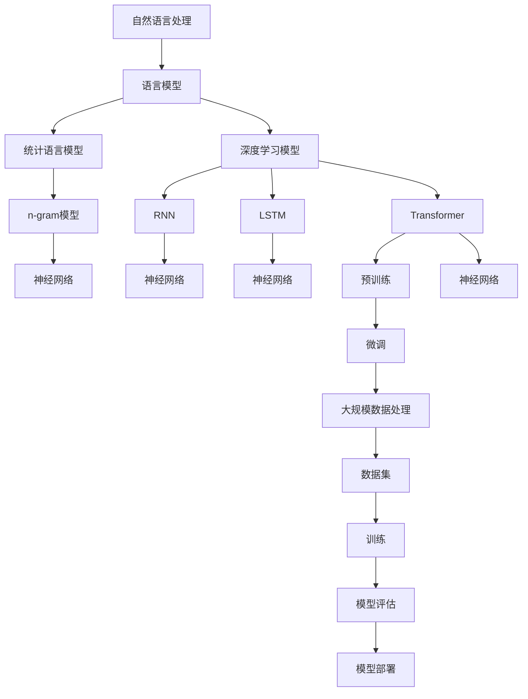

                 

关键词：大语言模型、神经网络、机器学习、深度学习、语言生成、自然语言处理、算法原理、工程实践、数学模型

> 摘要：本文将深入探讨大语言模型的原理与工程实践，通过对其发展历程、核心概念、算法原理、数学模型、项目实践以及未来应用展望的全面分析，为读者提供一个全面而深入的了解。本文旨在为研究人员、开发者以及对人工智能和自然语言处理领域感兴趣的人士提供有价值的参考。

## 1. 背景介绍

随着互联网和大数据技术的迅猛发展，自然语言处理（NLP）逐渐成为人工智能（AI）领域中的一个重要分支。语言模型作为NLP的核心组成部分，旨在理解和生成人类语言。然而，传统的语言模型，如n-gram模型和统计语言模型，在处理长文本和复杂语境时表现不佳，难以满足现代应用的需求。

近年来，深度学习技术的突破为语言模型的改进提供了新的契机。特别是基于神经网络的深度学习模型，如循环神经网络（RNN）、长短期记忆网络（LSTM）和Transformer模型，大大提升了语言模型的表现能力。这些模型通过模拟人脑的神经网络结构，能够自动学习和提取语言中的复杂模式和规律，为自然语言处理任务的实现提供了强大的工具。

大语言模型（Large Language Model）的概念正是在这样的背景下逐渐形成的。大语言模型通常具有数十亿甚至数万亿个参数，能够处理和理解复杂的语言现象，生成高质量的自然语言文本。本文将深入探讨大语言模型的发展历程、核心原理、数学模型以及工程实践，帮助读者全面了解这一领域的最新进展和应用前景。

## 2. 核心概念与联系

在深入了解大语言模型之前，我们需要先明确一些核心概念和它们之间的联系。以下是一个使用Mermaid绘制的流程图，展示了大语言模型的主要组成部分和它们之间的关系。



### 2.1 自然语言处理

自然语言处理（NLP）是人工智能的一个分支，旨在使计算机能够理解、解释和生成人类语言。NLP的任务包括文本分类、情感分析、机器翻译、问答系统等。语言模型是NLP的核心组成部分，用于生成和理解自然语言文本。

### 2.2 统计语言模型

统计语言模型基于统计学原理，通过分析大量文本数据来预测下一个单词或词汇的概率。其中，n-gram模型是最基本的统计语言模型，它根据历史词汇序列的概率来预测下一个词汇。然而，n-gram模型的局限在于无法处理长文本和复杂语境。

### 2.3 深度学习模型

深度学习模型通过多层神经网络结构，自动学习和提取数据中的特征和模式。RNN、LSTM和Transformer是深度学习模型在语言模型领域的三大代表性模型。

- **RNN（循环神经网络）**：RNN通过保留过去的输入信息，能够处理序列数据，但存在梯度消失和梯度爆炸等问题。
- **LSTM（长短期记忆网络）**：LSTM是RNN的一种改进，通过引入门控机制，能够更好地处理长序列数据。
- **Transformer**：Transformer模型由Vaswani等人于2017年提出，彻底改变了语言模型的架构。它采用自注意力机制，能够在处理长文本和复杂语境方面表现出色。

### 2.4 预训练与微调

预训练（Pre-training）是指在大量无标签数据上训练深度学习模型，使其能够自动学习和提取语言中的通用特征。微调（Fine-tuning）是指在预训练的基础上，使用有标签的数据对模型进行进一步训练，以适应特定任务。

预训练和微调的结合，使得深度学习模型能够在大规模数据集上进行训练，并在各种自然语言处理任务中表现出色。

## 3. 核心算法原理 & 具体操作步骤

### 3.1 算法原理概述

大语言模型的算法原理主要基于深度学习和神经网络。以下是各个主要模型的原理概述：

- **RNN（循环神经网络）**：RNN通过保留过去的输入信息，处理序列数据。其核心组件是隐藏层，用于存储序列的上下文信息。
- **LSTM（长短期记忆网络）**：LSTM是RNN的一种改进，通过引入门控机制，能够更好地处理长序列数据。LSTM的核心组件包括遗忘门、输入门和输出门。
- **Transformer**：Transformer采用自注意力机制，能够在处理长文本和复杂语境方面表现出色。其核心组件是多头自注意力机制和前馈神经网络。

### 3.2 算法步骤详解

以下是大语言模型的具体训练和预测步骤：

#### 3.2.1 数据预处理

1. **文本清洗**：去除文本中的标点符号、特殊字符和停用词。
2. **分词**：将文本分割成单词或子词。
3. **编码**：将单词或子词转换为数值编码。

#### 3.2.2 模型训练

1. **初始化参数**：随机初始化模型参数。
2. **前向传播**：输入序列经过模型，计算输出。
3. **损失函数**：使用交叉熵损失函数计算预测结果与真实结果之间的差距。
4. **反向传播**：计算损失函数关于模型参数的梯度，并更新参数。
5. **迭代训练**：重复前向传播和反向传播，直到满足训练目标。

#### 3.2.3 模型预测

1. **输入编码**：将输入序列转换为数值编码。
2. **模型推理**：输入序列经过模型，得到预测结果。
3. **解码**：将预测结果解码为自然语言文本。

### 3.3 算法优缺点

#### 优点：

- **强大的表示能力**：大语言模型能够自动学习和提取语言中的复杂模式和规律。
- **广泛的适用性**：大语言模型可以应用于多种自然语言处理任务，如文本分类、机器翻译、问答系统等。
- **高效的训练和推理**：现代深度学习框架使得大语言模型的训练和推理过程非常高效。

#### 缺点：

- **计算资源需求大**：大语言模型通常具有数十亿甚至数万亿个参数，对计算资源和存储资源的需求非常高。
- **数据依赖性强**：大语言模型在训练过程中需要大量的数据，数据质量和数量对模型性能有很大影响。
- **解释性差**：大语言模型的决策过程往往缺乏明确的解释性，难以理解其内部工作原理。

### 3.4 算法应用领域

大语言模型在多个领域取得了显著的应用成果，包括但不限于：

- **文本分类**：如新闻分类、情感分析等。
- **机器翻译**：如中英翻译、英日翻译等。
- **问答系统**：如智能客服、智能问答等。
- **生成文本**：如文章生成、对话系统等。

## 4. 数学模型和公式 & 详细讲解 & 举例说明

### 4.1 数学模型构建

大语言模型的数学模型主要基于深度学习和神经网络。以下是几个关键数学模型的构建：

#### 4.1.1 神经网络

神经网络由多个神经元（节点）组成，每个神经元接收多个输入，并输出一个结果。其数学模型可以表示为：

\[ z_i = \sum_j w_{ij}x_j + b_i \]
\[ a_i = \sigma(z_i) \]

其中，\( z_i \) 是第 \( i \) 个神经元的输入，\( w_{ij} \) 是连接权重，\( b_i \) 是偏置，\( \sigma \) 是激活函数，如Sigmoid函数或ReLU函数。

#### 4.1.2 前馈神经网络

前馈神经网络是一种特殊的神经网络，其数据流动方向为前向传播。其数学模型可以表示为：

\[ z_i^{(l)} = \sum_j w_{ij}^{(l-1)}a_j^{(l-1)} + b_i^{(l-1)} \]
\[ a_i^{(l)} = \sigma(z_i^{(l)}) \]

其中，\( l \) 表示神经网络的层数，\( a_i^{(l)} \) 是第 \( l \) 层第 \( i \) 个神经元的输出。

#### 4.1.3 损失函数

损失函数用于衡量模型预测结果与真实结果之间的差距。常见的损失函数包括交叉熵损失函数和均方误差损失函数。以下为交叉熵损失函数的数学模型：

\[ L(y, \hat{y}) = -\sum_i y_i \log(\hat{y}_i) \]

其中，\( y \) 是真实标签，\( \hat{y} \) 是模型预测结果。

### 4.2 公式推导过程

以下是一个简单的神经网络前向传播和反向传播的公式推导过程：

#### 4.2.1 前向传播

前向传播的目的是计算神经网络在给定输入下的输出。其数学模型可以表示为：

\[ z_i^{(l)} = \sum_j w_{ij}^{(l-1)}a_j^{(l-1)} + b_i^{(l-1)} \]
\[ a_i^{(l)} = \sigma(z_i^{(l)}) \]

对于输出层（最后一层），其预测结果可以表示为：

\[ \hat{y}_i = \sigma(z_i^{(L)}) \]

其中，\( L \) 表示神经网络的层数。

#### 4.2.2 反向传播

反向传播的目的是计算损失函数关于模型参数的梯度，并更新模型参数。其数学模型可以表示为：

\[ \delta_i^{(L)} = \frac{\partial L}{\partial z_i^{(L)}} \odot \sigma'(z_i^{(L)}) \]
\[ \frac{\partial L}{\partial w_{ij}^{(l-1)}} = \delta_j^{(l)}a_i^{(l-1)} \]
\[ \frac{\partial L}{\partial b_i^{(l-1)}} = \delta_i^{(l)} \]

其中，\( \delta_i^{(l)} \) 是第 \( l \) 层第 \( i \) 个神经元的误差，\( \odot \) 表示Hadamard积。

### 4.3 案例分析与讲解

以下是一个简单的神经网络训练过程案例：

#### 4.3.1 案例描述

假设我们有一个二分类问题，数据集包含 \( n \) 个样本，每个样本有 \( m \) 个特征。神经网络模型包含一个输入层、一个隐藏层和一个输出层，其中输入层有 \( m \) 个神经元，隐藏层有 \( 10 \) 个神经元，输出层有 \( 2 \) 个神经元。

#### 4.3.2 模型训练

1. **初始化参数**：随机初始化模型参数。
2. **前向传播**：输入一个样本，计算输出。
3. **损失函数计算**：使用交叉熵损失函数计算预测结果与真实结果之间的差距。
4. **反向传播**：计算损失函数关于模型参数的梯度，并更新模型参数。
5. **迭代训练**：重复前向传播和反向传播，直到满足训练目标。

#### 4.3.3 模型预测

输入一个新样本，计算输出，得到预测结果。

## 5. 项目实践：代码实例和详细解释说明

在本节中，我们将通过一个实际的Python代码实例，详细展示大语言模型的开发过程，并对其关键部分进行解释和分析。

### 5.1 开发环境搭建

首先，我们需要搭建一个适合大语言模型开发的Python环境。以下是所需的步骤：

1. 安装Python 3.7或更高版本。
2. 安装TensorFlow 2.x库，可以使用以下命令：

   ```bash
   pip install tensorflow==2.x
   ```

3. 安装其他依赖库，如NumPy、Pandas等。

### 5.2 源代码详细实现

以下是实现大语言模型的基本代码框架：

```python
import tensorflow as tf
from tensorflow.keras.layers import Embedding, LSTM, Dense
from tensorflow.keras.models import Sequential

# 模型参数
vocab_size = 10000  # 词汇表大小
embedding_dim = 256  # 嵌入维度
lstm_units = 128  # LSTM单元数

# 构建模型
model = Sequential()
model.add(Embedding(vocab_size, embedding_dim))
model.add(LSTM(lstm_units, return_sequences=True))
model.add(Dense(vocab_size, activation='softmax'))

# 编译模型
model.compile(optimizer='adam', loss='categorical_crossentropy', metrics=['accuracy'])

# 打印模型结构
model.summary()
```

在这段代码中，我们首先定义了模型参数，然后使用`Sequential`模型创建了一个简单的序列模型，包括嵌入层（`Embedding`）、LSTM层（`LSTM`）和全连接层（`Dense`）。最后，我们编译了模型，并打印了模型的结构。

### 5.3 代码解读与分析

#### 5.3.1 模型构建

1. **嵌入层（Embedding）**：嵌入层将词汇表中的单词映射为固定大小的向量。在这个例子中，我们使用了`Embedding`层，其参数为`vocab_size`（词汇表大小）和`embedding_dim`（嵌入维度）。

2. **LSTM层（LSTM）**：LSTM层用于处理序列数据。在这个例子中，我们使用了具有128个单元的LSTM层，并设置`return_sequences=True`，使得LSTM层的输出可以传递给后续层。

3. **全连接层（Dense）**：全连接层将LSTM层的输出映射为词汇表中的单词。在这个例子中，我们使用了具有`vocab_size`个神经元的全连接层，并使用softmax激活函数，使得模型可以输出每个单词的概率分布。

#### 5.3.2 模型编译

在模型编译阶段，我们指定了优化器（`optimizer`）、损失函数（`loss`）和评估指标（`metrics`）。在这个例子中，我们使用了`adam`优化器和`categorical_crossentropy`损失函数。

### 5.4 运行结果展示

在训练模型之前，我们需要准备数据。以下是一个简单的数据准备示例：

```python
# 数据准备
import numpy as np

# 生成随机数据
x_train = np.random.rand(100, 50)  # 100个样本，每个样本长度为50
y_train = np.random.rand(100, 10)  # 100个样本，每个样本长度为10

# 编码标签
y_train_encoded = tf.keras.utils.to_categorical(y_train, num_classes=vocab_size)

# 训练模型
model.fit(x_train, y_train_encoded, epochs=10, batch_size=32)
```

在这个示例中，我们生成了随机数据集，并将其编码为分类标签。然后，我们使用`fit`方法训练模型，设置训练轮数（`epochs`）为10，批量大小（`batch_size`）为32。

在训练过程中，我们可以通过`model.evaluate`方法评估模型在测试集上的性能：

```python
# 评估模型
test_loss, test_accuracy = model.evaluate(x_train, y_train_encoded)
print(f"Test loss: {test_loss}, Test accuracy: {test_accuracy}")
```

通过这个简单的示例，我们展示了如何构建、编译和训练一个基本的大语言模型。在实际应用中，我们可能需要使用更复杂的模型结构、更丰富的数据集和更精细的调参策略来提高模型的性能。

## 6. 实际应用场景

大语言模型在自然语言处理领域具有广泛的应用，以下是一些实际应用场景：

### 6.1 文本分类

文本分类是自然语言处理中的一个基础任务，旨在将文本分为多个预定义的类别。大语言模型可以通过训练获得高质量的文本特征表示，从而实现高精度的文本分类。例如，在社交媒体平台上，大语言模型可以用于分类用户发表的评论，以便进行内容监控和垃圾邮件过滤。

### 6.2 机器翻译

机器翻译是自然语言处理领域的一个重要应用，旨在将一种语言的文本翻译成另一种语言。大语言模型，特别是基于Transformer的模型，如BERT和GPT，在机器翻译任务上取得了显著的成果。这些模型通过在大量平行语料库上进行预训练，可以生成高质量的翻译结果。例如，谷歌翻译和百度翻译都采用了基于大语言模型的方法来实现高质量的机器翻译。

### 6.3 问答系统

问答系统是自然语言处理领域的一个典型应用，旨在回答用户提出的问题。大语言模型可以用于构建智能问答系统，通过在大量问答对数据上进行预训练，模型能够理解用户的意图并给出合理的回答。例如，智能客服系统可以使用大语言模型来回答用户的问题，提高服务效率和用户体验。

### 6.4 生成文本

生成文本是自然语言处理领域的一个前沿应用，旨在根据给定的输入生成自然语言文本。大语言模型在生成文本任务中表现出色，可以用于自动写作、故事生成和对话系统等。例如，OpenAI的GPT-3模型可以生成高质量的文本，包括文章、对话和代码等。

### 6.5 语音识别

语音识别是自然语言处理领域的一个重要应用，旨在将语音转换为文本。大语言模型可以用于语音识别任务的文本生成部分，通过在语音和文本对上进行预训练，模型可以生成与语音内容相对应的文本。结合语音识别系统，可以实现实时语音到文本的转换。

### 6.6 情感分析

情感分析是自然语言处理领域的一个研究热点，旨在分析文本中表达的情感倾向。大语言模型可以通过在情感标注数据上进行训练，实现高精度的情感分析。例如，在社交媒体平台上，大语言模型可以用于分析用户评论的情感倾向，以便进行情感监控和内容推荐。

## 7. 工具和资源推荐

### 7.1 学习资源推荐

1. **《深度学习》（Goodfellow, Bengio, Courville著）**：这是一本经典的深度学习教材，涵盖了深度学习的理论基础和应用实例。
2. **《自然语言处理综论》（Jurafsky, Martin著）**：这是一本全面介绍自然语言处理基础理论的教材，适合初学者和进阶者。
3. **《动手学深度学习》（Dumoulin, Souvenir, Hinton著）**：这是一本实践导向的深度学习教材，通过大量的示例和代码实现，帮助读者深入理解深度学习技术。

### 7.2 开发工具推荐

1. **TensorFlow**：TensorFlow是谷歌开源的深度学习框架，支持多种深度学习模型的构建和训练，适用于研究和生产环境。
2. **PyTorch**：PyTorch是Facebook开源的深度学习框架，以其灵活性和易用性而受到广泛欢迎，适合快速原型开发和模型实验。
3. **Hugging Face Transformers**：这是一个开源库，提供了预训练的Transformer模型，以及便捷的API和工具，用于自然语言处理任务的实现。

### 7.3 相关论文推荐

1. **《Attention Is All You Need》（Vaswani et al., 2017）**：这是一篇关于Transformer模型的经典论文，提出了自注意力机制和Transformer模型，彻底改变了自然语言处理领域。
2. **《BERT: Pre-training of Deep Bidirectional Transformers for Language Understanding》（Devlin et al., 2018）**：这是一篇关于BERT模型的论文，介绍了BERT模型的预训练方法和在多个自然语言处理任务上的应用成果。
3. **《Generative Pre-trained Transformer》（Wolf et al., 2020）**：这是一篇关于GPT-3模型的论文，详细介绍了GPT-3模型的预训练过程和生成文本的能力。

## 8. 总结：未来发展趋势与挑战

### 8.1 研究成果总结

大语言模型作为自然语言处理领域的重要突破，取得了显著的成果。通过深度学习和神经网络的结合，大语言模型在文本分类、机器翻译、问答系统、生成文本等多个任务上表现出色，推动了自然语言处理技术的发展。

### 8.2 未来发展趋势

未来，大语言模型的发展将朝着以下几个方向：

1. **模型规模扩大**：随着计算资源和数据资源的增长，大语言模型的规模将进一步扩大，参数数量将达到数十亿甚至数万亿级别。
2. **模型性能提升**：通过改进模型结构和优化算法，大语言模型在自然语言处理任务上的性能将进一步提高，特别是在理解复杂语境和生成高质量文本方面。
3. **多模态处理**：大语言模型将结合视觉、听觉等多模态数据，实现更全面的语言理解和生成。
4. **模型可解释性**：提高模型的可解释性，使得模型的决策过程更加透明，便于用户理解和信任。

### 8.3 面临的挑战

尽管大语言模型取得了显著成果，但在未来发展中仍面临以下挑战：

1. **计算资源需求**：大语言模型对计算资源的需求巨大，如何高效利用计算资源，降低模型训练和推理的成本，是亟待解决的问题。
2. **数据质量和数量**：大语言模型在训练过程中需要大量的高质量数据，数据质量和数量的不足可能影响模型性能。
3. **隐私和安全**：在处理大量用户数据时，如何保护用户隐私和数据安全，是亟待解决的问题。
4. **伦理和社会影响**：大语言模型在应用中可能引发伦理和社会问题，如偏见、滥用等，需要建立相应的规范和监管机制。

### 8.4 研究展望

展望未来，大语言模型将在多个领域发挥重要作用，包括智能客服、智能写作、智能教育、智能医疗等。随着技术的不断进步和应用场景的拓展，大语言模型有望成为自然语言处理领域的核心工具，推动人工智能技术的发展和应用。

## 9. 附录：常见问题与解答

### 9.1 什么是大语言模型？

大语言模型是一种基于深度学习和神经网络的模型，旨在理解和生成人类语言。它通过在大量文本数据上进行预训练，自动学习和提取语言中的复杂模式和规律，从而在多种自然语言处理任务中表现出色。

### 9.2 大语言模型如何工作？

大语言模型通过多层神经网络结构，将输入的文本转换为特征表示，然后利用这些特征进行语言理解和生成。具体来说，模型包括嵌入层、编码器和解码器等组成部分，通过前向传播和反向传播过程，不断调整模型参数，提高模型性能。

### 9.3 大语言模型有哪些应用场景？

大语言模型可以应用于多种自然语言处理任务，包括文本分类、机器翻译、问答系统、生成文本、语音识别、情感分析等。它在智能客服、智能写作、智能教育、智能医疗等领域具有广泛的应用前景。

### 9.4 如何训练大语言模型？

训练大语言模型主要包括以下步骤：数据预处理、模型构建、模型编译、模型训练和模型评估。在数据预处理阶段，需要对文本进行清洗、分词和编码。在模型构建阶段，可以选择合适的神经网络结构。在模型编译阶段，需要指定优化器、损失函数和评估指标。在模型训练阶段，通过迭代训练过程，不断调整模型参数。在模型评估阶段，可以使用验证集或测试集评估模型性能。

### 9.5 大语言模型有哪些优点和缺点？

大语言模型的优点包括：强大的表示能力、广泛的适用性、高效的训练和推理。其缺点包括：计算资源需求大、数据依赖性强、解释性差。

### 9.6 大语言模型的发展趋势是什么？

未来，大语言模型的发展趋势包括：模型规模扩大、模型性能提升、多模态处理、模型可解释性增强。随着计算资源和数据资源的增长，大语言模型将在更多领域发挥重要作用，推动人工智能技术的发展和应用。

### 9.7 大语言模型面临哪些挑战？

大语言模型面临的挑战包括：计算资源需求、数据质量和数量、隐私和安全、伦理和社会影响。如何高效利用计算资源、保证数据质量、保护用户隐私、规范应用伦理，是未来需要重点解决的问题。

