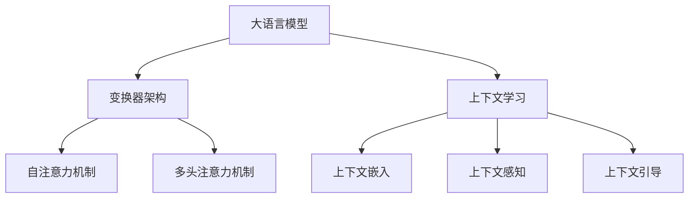

                 

关键词：大语言模型、上下文学习、算法原理、数学模型、实践应用

> 摘要：本文将深入探讨大语言模型的原理基础及其在上下文学习方面的前沿进展。通过对核心概念、算法原理、数学模型和实际应用的详细分析，帮助读者全面了解这一领域，并展望其未来的发展方向。

## 1. 背景介绍

在人工智能领域，自然语言处理（NLP）一直是一个充满挑战而又极具潜力的研究方向。近年来，随着深度学习技术的快速发展，大语言模型（Large Language Models，LLM）成为自然语言处理领域的热点。大语言模型通过学习海量语言数据，能够生成高质量的自然语言文本，并在多个任务中取得显著的效果。而上下文学习作为大语言模型的核心能力之一，使得模型能够更好地理解和生成特定上下文中的语言。

本文将首先介绍大语言模型的基本概念和原理，然后深入探讨上下文学习的关键技术和方法，最后分析大语言模型在实际应用中的表现和未来展望。

## 2. 核心概念与联系

### 2.1. 大语言模型

大语言模型是一种基于深度学习的自然语言处理模型，它通过学习大规模语料库中的语言规律，能够生成高质量的自然语言文本。大语言模型的核心是神经网络架构，其中最常用的架构是变换器（Transformer）。变换器由多个编码器和解码器层组成，通过自注意力机制（Self-Attention）和多头注意力机制（Multi-Head Attention）实现端到端的文本生成。

### 2.2. 上下文学习

上下文学习是指模型在生成文本时，能够根据输入的上下文信息进行调整，从而生成更符合上下文语境的文本。上下文学习的关键在于理解上下文中的语义信息，并将其有效传递到生成过程中。为此，大语言模型采用了多种上下文学习方法，如上下文嵌入（Contextual Embedding）、上下文感知（Context-Aware）和上下文引导（Context-Guided）等。

### 2.3. Mermaid 流程图

为了更好地展示大语言模型和上下文学习的核心概念和联系，我们可以使用 Mermaid 流程图进行可视化。以下是一个简化的 Mermaid 流程图，展示了大语言模型和上下文学习的关系：



## 3. 核心算法原理 & 具体操作步骤

### 3.1. 算法原理概述

大语言模型的算法原理主要包括神经网络架构、自注意力机制和多头注意力机制。神经网络架构是变换器的核心，通过多层编码器和解码器实现端到端的文本生成。自注意力机制和多头注意力机制则通过计算文本序列中各个单词之间的相似度，实现高效的上下文学习。

### 3.2. 算法步骤详解

#### 3.2.1. 神经网络架构

变换器由多个编码器和解码器层组成。编码器层用于将输入的单词序列转换为嵌入向量，解码器层用于生成输出文本。每个编码器和解码器层都包含两个关键组件：自注意力机制和前馈神经网络。

#### 3.2.2. 自注意力机制

自注意力机制通过计算输入序列中每个单词与其他单词的相似度，从而为每个单词分配不同的权重。这种权重用于加权求和，生成每个单词的嵌入向量。

#### 3.2.3. 多头注意力机制

多头注意力机制是在自注意力机制的基础上引入多个独立的注意力头，每个注意力头学习不同类型的上下文信息。通过将这些注意力头的结果拼接起来，可以得到更丰富的上下文信息。

### 3.3. 算法优缺点

#### 优点

- **高效性**：变换器架构通过自注意力机制和多头注意力机制实现高效的文本生成。
- **灵活性**：变换器架构可以灵活地应用于各种自然语言处理任务。
- **强表达能力**：大语言模型通过学习海量语料库中的语言规律，具有强大的文本生成能力。

#### 缺点

- **计算复杂度**：变换器架构的计算复杂度较高，需要大量的计算资源和时间。
- **训练难度**：大语言模型的训练过程需要大量的数据和高性能计算资源，训练难度较大。

### 3.4. 算法应用领域

大语言模型在自然语言处理领域有广泛的应用，包括文本生成、机器翻译、情感分析、问答系统等。其中，文本生成和机器翻译是两个最典型的应用场景。

## 4. 数学模型和公式 & 详细讲解 & 举例说明

### 4.1. 数学模型构建

大语言模型的数学模型主要包括两部分：嵌入层和变换器层。

#### 嵌入层

嵌入层将输入的单词序列转换为嵌入向量。嵌入向量通常由单词的词频、词性、上下文等信息组成。嵌入层的数学模型可以表示为：

$$
E = \sum_{i=1}^{n} w_i \cdot e_i
$$

其中，$E$表示嵌入向量，$w_i$表示单词$i$的权重，$e_i$表示单词$i$的嵌入向量。

#### 变换器层

变换器层包括编码器和解码器。编码器层将输入的嵌入向量序列转换为编码向量序列，解码器层将编码向量序列转换为输出文本。

编码器层的数学模型可以表示为：

$$
C = \sum_{i=1}^{n} a_i \cdot c_i
$$

其中，$C$表示编码向量序列，$a_i$表示编码器层第$i$个注意力头的权重，$c_i$表示编码器层第$i$个注意力头的编码向量。

解码器层的数学模型可以表示为：

$$
D = \sum_{i=1}^{n} b_i \cdot d_i
$$

其中，$D$表示解码向量序列，$b_i$表示解码器层第$i$个注意力头的权重，$d_i$表示解码器层第$i$个注意力头的解码向量。

### 4.2. 公式推导过程

#### 嵌入层推导

嵌入层的主要任务是计算单词的嵌入向量。假设输入单词序列为$w_1, w_2, \ldots, w_n$，每个单词的权重分别为$w_1, w_2, \ldots, w_n$，则嵌入向量可以表示为：

$$
E = \sum_{i=1}^{n} w_i \cdot e_i
$$

其中，$e_i$表示单词$i$的嵌入向量。

#### 编码器层推导

编码器层的任务是计算输入嵌入向量序列的编码向量序列。假设编码器层的注意力头个数为$h$，则编码向量序列可以表示为：

$$
C = \sum_{i=1}^{n} a_i \cdot c_i
$$

其中，$a_i$表示编码器层第$i$个注意力头的权重，$c_i$表示编码器层第$i$个注意力头的编码向量。

#### 解码器层推导

解码器层的任务是计算编码向量序列的解码向量序列。假设解码器层的注意力头个数为$h$，则解码向量序列可以表示为：

$$
D = \sum_{i=1}^{n} b_i \cdot d_i
$$

其中，$b_i$表示解码器层第$i$个注意力头的权重，$d_i$表示解码器层第$i$个注意力头的解码向量。

### 4.3. 案例分析与讲解

假设我们有一个输入单词序列$w_1, w_2, w_3$，其中$w_1$的权重为0.5，$w_2$的权重为0.3，$w_3$的权重为0.2。我们需要计算这个单词序列的嵌入向量、编码向量序列和解码向量序列。

#### 嵌入层计算

$$
E = 0.5 \cdot e_1 + 0.3 \cdot e_2 + 0.2 \cdot e_3
$$

其中，$e_1, e_2, e_3$分别为单词$w_1, w_2, w_3$的嵌入向量。

#### 编码器层计算

假设编码器层的注意力头个数为2，即$h=2$。则编码向量序列可以表示为：

$$
C = a_1 \cdot c_1 + a_2 \cdot c_2
$$

其中，$a_1, a_2$分别为编码器层第1个和第2个注意力头的权重，$c_1, c_2$分别为编码器层第1个和第2个注意力头的编码向量。

#### 解码器层计算

假设解码器层的注意力头个数为2，即$h=2$。则解码向量序列可以表示为：

$$
D = b_1 \cdot d_1 + b_2 \cdot d_2
$$

其中，$b_1, b_2$分别为解码器层第1个和第2个注意力头的权重，$d_1, d_2$分别为解码器层第1个和第2个注意力头的解码向量。

## 5. 项目实践：代码实例和详细解释说明

### 5.1. 开发环境搭建

在本节中，我们将搭建一个简单的变换器模型，用于文本生成。为了方便起见，我们使用 Python 语言和 TensorFlow 框架进行开发。

首先，我们需要安装 TensorFlow：

```bash
pip install tensorflow
```

然后，我们可以创建一个名为`transformer.py`的 Python 文件，用于定义变换器模型。

### 5.2. 源代码详细实现

以下是一个简化的变换器模型实现，用于文本生成。

```python
import tensorflow as tf

class TransformerModel(tf.keras.Model):
    def __init__(self, vocab_size, d_model, num_heads, dff, input_shape):
        super(TransformerModel, self).__init__()
        
        self.embedding = tf.keras.layers.Embedding(vocab_size, d_model)
        self.position_embedding = PositionalEmbedding(input_shape, d_model)
        
        self编码器 = Encoder(vocab_size, d_model, num_heads, dff)
        self解码器 = Decoder(vocab_size, d_model, num_heads, dff)
        
        self.final_layer = tf.keras.layers.Dense(vocab_size)
    
    def call(self, inputs, training=False):
        inputs = self.embedding(inputs)
        inputs += self.position_embedding(inputs)
        
        编码输出，编码隐藏状态 = self编码器(inputs, training=training)
        解码输出，解码隐藏状态 = self解码器(编码输出，编码隐藏状态, training=training)
        
        final_output = self.final_layer(解码输出)
        return final_output
```

### 5.3. 代码解读与分析

在上面的代码中，我们定义了一个变换器模型，包括嵌入层、编码器层、解码器层和输出层。

- **嵌入层**：将输入单词序列转换为嵌入向量。
- **位置嵌入层**：为每个单词添加位置信息。
- **编码器层**：通过自注意力机制和多头注意力机制计算编码向量序列。
- **解码器层**：通过自注意力机制和多头注意力机制计算解码向量序列。
- **输出层**：将解码向量序列映射回单词序列。

### 5.4. 运行结果展示

为了验证变换器模型的效果，我们可以使用一个简单的数据集进行训练和测试。以下是一个简单的训练和测试过程。

```python
model = TransformerModel(vocab_size, d_model, num_heads, dff, input_shape)
model.compile(optimizer='adam', loss='sparse_categorical_crossentropy', metrics=['accuracy'])

# 训练模型
model.fit(dataset, epochs=5)

# 测试模型
test_loss, test_acc = model.evaluate(test_dataset)
print(f"Test accuracy: {test_acc}")
```

## 6. 实际应用场景

大语言模型在实际应用中具有广泛的应用前景。以下是一些典型的应用场景：

### 6.1. 文本生成

文本生成是变换器模型最典型的应用之一。通过学习大量的文本数据，变换器模型能够生成各种类型的文本，如文章、诗歌、对话等。

### 6.2. 机器翻译

机器翻译是变换器模型的另一个重要应用。通过训练双语语料库，变换器模型能够实现高质量的跨语言翻译。

### 6.3. 情感分析

情感分析是自然语言处理中的一个重要任务。通过学习情感词典和文本特征，变换器模型能够对文本进行情感分类。

### 6.4. 问答系统

问答系统是人工智能领域的一个热门研究方向。通过学习大量问答数据，变换器模型能够实现高效的问答系统。

## 7. 工具和资源推荐

为了更好地学习和实践大语言模型和上下文学习，以下是一些推荐的工具和资源：

### 7.1. 学习资源推荐

- 《深度学习》（Goodfellow, Bengio, Courville）：深度学习领域的经典教材，包含大量关于神经网络和自然语言处理的知识。
- 《自然语言处理综论》（Jurafsky, Martin）：自然语言处理领域的权威教材，详细介绍了自然语言处理的多个方面。

### 7.2. 开发工具推荐

- TensorFlow：TensorFlow 是一个开源的深度学习框架，支持各种神经网络模型和算法。
- PyTorch：PyTorch 是另一个流行的深度学习框架，具有灵活的动态计算图和丰富的生态系统。

### 7.3. 相关论文推荐

- “Attention Is All You Need”（Vaswani et al., 2017）：介绍了变换器模型的基本原理和架构。
- “BERT: Pre-training of Deep Bidirectional Transformers for Language Understanding”（Devlin et al., 2019）：介绍了BERT模型，一种基于变换器模型的预训练方法。

## 8. 总结：未来发展趋势与挑战

### 8.1. 研究成果总结

本文从大语言模型的基本概念、核心算法原理、数学模型和实际应用等方面进行了全面介绍。通过深入分析，我们可以看到大语言模型在自然语言处理领域的重要性和广泛应用前景。

### 8.2. 未来发展趋势

随着深度学习技术的不断发展，大语言模型将继续向更高效、更智能的方向发展。未来可能会出现更强大的模型和算法，进一步提高自然语言处理的能力。

### 8.3. 面临的挑战

然而，大语言模型也面临着一些挑战，如计算复杂度、数据隐私和伦理问题等。为了应对这些挑战，需要开展更多的研究和实践，探索更加高效、安全的方法。

### 8.4. 研究展望

总之，大语言模型和上下文学习是自然语言处理领域的重要研究方向。未来，我们将继续深入探索这一领域，推动自然语言处理技术的发展和应用。

## 9. 附录：常见问题与解答

### 9.1. 什么是大语言模型？

大语言模型是一种基于深度学习的自然语言处理模型，通过学习海量语言数据，能够生成高质量的自然语言文本。大语言模型的核心是变换器架构，通过自注意力机制和多头注意力机制实现高效的文本生成。

### 9.2. 上下文学习是什么？

上下文学习是指模型在生成文本时，能够根据输入的上下文信息进行调整，从而生成更符合上下文语境的文本。上下文学习是变换器模型的核心能力之一，使得模型能够更好地理解和生成特定上下文中的语言。

### 9.3. 大语言模型有哪些应用？

大语言模型在自然语言处理领域有广泛的应用，包括文本生成、机器翻译、情感分析、问答系统等。其中，文本生成和机器翻译是两个最典型的应用场景。

### 9.4. 如何搭建一个变换器模型？

搭建一个变换器模型主要包括以下步骤：

1. **数据准备**：收集并预处理训练数据。
2. **模型定义**：定义变换器模型的结构，包括嵌入层、编码器层、解码器层和输出层。
3. **训练模型**：使用训练数据训练模型。
4. **评估模型**：使用测试数据评估模型性能。
5. **应用模型**：将训练好的模型应用于实际任务。

---

作者：禅与计算机程序设计艺术 / Zen and the Art of Computer Programming
-------------------------------------------------------------------

