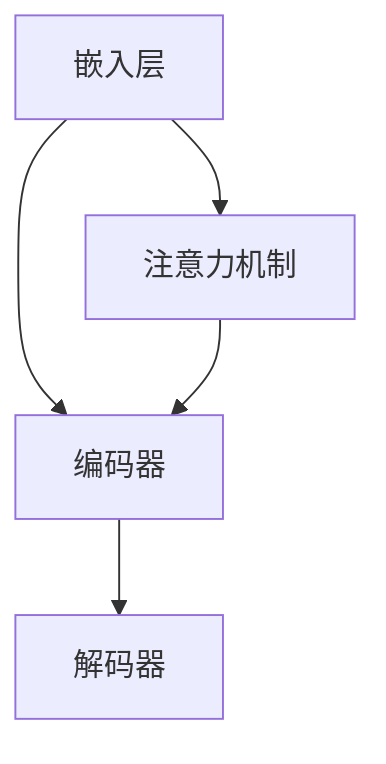

                 

关键词：大语言模型、原理基础、前沿技术、偏见、算法、数学模型、应用领域、未来展望

摘要：本文将探讨大语言模型的原理基础、前沿技术及其可能引发的偏见问题。通过深入分析大语言模型的核心算法原理，数学模型构建，以及具体应用场景，本文旨在为读者提供一个全面的技术解读，并对大语言模型在未来的发展趋势与挑战进行展望。

## 1. 背景介绍

随着人工智能技术的迅猛发展，自然语言处理（NLP）领域取得了显著进展。大语言模型作为NLP的核心技术之一，已经成为许多应用场景的核心组件。从早期的简单语言模型如n-gram模型，到现代复杂的大规模预训练模型如GPT和BERT，大语言模型在性能和效果上有了质的飞跃。然而，随着模型规模的不断扩大，大语言模型也面临着新的挑战，尤其是在模型偏见问题上。

模型偏见是指模型在学习和预测过程中，基于训练数据中存在的偏见而形成的不公平性或偏差。这种偏见可能源自训练数据的选择、数据的不平衡、模型的设计等多个方面。在大语言模型中，偏见问题尤为突出，因为语言模型需要处理大量的文本数据，而这些数据往往包含社会文化、历史背景等多方面的信息。本文将围绕大语言模型的偏见问题，探讨其原理、算法、数学模型及其应用领域，并对其未来发展趋势和挑战进行展望。

## 2. 核心概念与联系

### 2.1 大语言模型的核心概念

大语言模型（Large-scale Language Models）是基于深度学习的自然语言处理模型，其主要目标是学习语言的分布式表示，并能够生成或理解自然语言文本。大语言模型通常包含以下几个核心概念：

- **嵌入层（Embedding Layer）**：将词汇映射为稠密的向量表示，使得模型能够理解词汇之间的语义关系。
- **编码器（Encoder）**：用于处理输入文本并生成上下文信息，是模型的核心部分。
- **解码器（Decoder）**：用于生成文本输出，根据编码器生成的上下文信息生成目标文本。
- **注意力机制（Attention Mechanism）**：用于模型在处理输入文本时，对不同的词汇赋予不同的权重，提高模型的上下文理解能力。

### 2.2 大语言模型的联系

大语言模型与其他自然语言处理技术密切相关，如词性标注、命名实体识别、情感分析等。同时，大语言模型也与其他人工智能技术如计算机视觉、语音识别等有着广泛的交叉应用。以下是几个关键联系：

- **与词性标注的联系**：大语言模型能够学习词汇的语法属性，为词性标注提供丰富的上下文信息。
- **与命名实体识别的联系**：大语言模型能够识别文本中的实体，如人名、地点、组织等，为命名实体识别提供有力支持。
- **与情感分析的联系**：大语言模型能够理解文本中的情感倾向，为情感分析提供准确的情感分类结果。
- **与其他人工智能技术的联系**：大语言模型在计算机视觉和语音识别等领域也有广泛应用，如图像描述生成、语音识别等。

### 2.3 Mermaid 流程图

以下是大语言模型的核心概念和联系的 Mermaid 流程图：



在这个流程图中，嵌入层将词汇映射为向量表示，编码器处理输入文本并生成上下文信息，解码器根据上下文信息生成输出文本，注意力机制则用于提高模型的上下文理解能力。

## 3. 核心算法原理 & 具体操作步骤

### 3.1 算法原理概述

大语言模型的核心算法基于深度神经网络（DNN）和变换器架构（Transformer）。变换器架构是一种基于自注意力机制的模型架构，能够有效地处理长距离依赖问题。以下是算法原理的概述：

1. **嵌入层**：将词汇映射为稠密的向量表示，通常使用词向量嵌入技术，如Word2Vec、GloVe等。
2. **编码器**：编码器由多个变换器层堆叠而成，每个变换器层包含多头自注意力机制和前馈神经网络。
3. **解码器**：解码器同样由多个变换器层堆叠而成，用于生成文本输出。
4. **注意力机制**：自注意力机制允许模型在处理输入文本时，对不同的词汇赋予不同的权重，提高模型的上下文理解能力。
5. **训练**：通过大量文本数据进行训练，模型会不断优化参数，以最小化预测损失。

### 3.2 算法步骤详解

以下是大语言模型的具体操作步骤：

1. **数据预处理**：将文本数据分为词汇表、输入序列和目标序列。词汇表用于将词汇映射为向量表示，输入序列和目标序列用于训练模型。
2. **嵌入层**：将词汇映射为向量表示，通常使用预训练的词向量嵌入技术。
3. **编码器**：编码器由多个变换器层堆叠而成，每个变换器层包含多头自注意力机制和前馈神经网络。编码器处理输入序列并生成编码表示。
4. **解码器**：解码器由多个变换器层堆叠而成，用于生成文本输出。解码器在每个时间步处理编码表示并生成下一个词汇的概率分布。
5. **预测**：根据解码器的输出概率分布，选择概率最高的词汇作为预测结果。
6. **训练**：通过大量文本数据进行训练，模型会不断优化参数，以最小化预测损失。

### 3.3 算法优缺点

大语言模型的优点包括：

- **强大的上下文理解能力**：通过自注意力机制，模型能够处理长距离依赖问题，提高上下文理解能力。
- **广泛的适用性**：大语言模型可以应用于各种自然语言处理任务，如文本分类、机器翻译、问答系统等。
- **高效的训练速度**：通过并行计算和分布式训练，模型能够高效地处理大规模数据。

大语言模型的缺点包括：

- **计算资源需求高**：大语言模型通常需要大量的计算资源和存储空间，对于小型团队或资源有限的环境可能不适用。
- **模型解释性差**：由于模型的复杂性和黑盒特性，模型难以解释，导致在应用过程中可能存在一些不确定性。
- **偏见问题**：由于训练数据的选择、数据的不平衡等因素，大语言模型可能存在偏见问题，影响模型的公平性和准确性。

### 3.4 算法应用领域

大语言模型在自然语言处理领域有着广泛的应用，以下是一些典型应用领域：

- **文本分类**：用于对文本进行分类，如新闻分类、情感分析等。
- **机器翻译**：用于将一种语言翻译成另一种语言，如中英翻译、英日翻译等。
- **问答系统**：用于回答用户的问题，如搜索引擎、虚拟助手等。
- **文本生成**：用于生成文章、故事、摘要等，如自动写作、内容生成等。
- **对话系统**：用于与用户进行自然语言对话，如聊天机器人、客服系统等。

## 4. 数学模型和公式 & 详细讲解 & 举例说明

### 4.1 数学模型构建

大语言模型的数学模型主要包括嵌入层、编码器、解码器和注意力机制。以下是这些模型的构建过程：

1. **嵌入层**：嵌入层将词汇映射为向量表示，通常使用词向量嵌入技术，如Word2Vec、GloVe等。词向量嵌入模型可以表示为：

   $$ 
   e\_word = \text{embed}(word) 
   $$

   其中，$\text{embed}$为词向量嵌入函数，$e\_word$为词的向量表示。

2. **编码器**：编码器由多个变换器层堆叠而成，每个变换器层包含多头自注意力机制和前馈神经网络。编码器模型可以表示为：

   $$ 
   \text{Encoder}(\text{Input}) = \text{Transformer}(\text{Input}) = \text{MultiHeadSelfAttention}(\text{Input}) \cdot \text{FeedForwardNetwork}(\text{Input}) 
   $$

   其中，$\text{Transformer}$为变换器层，$\text{MultiHeadSelfAttention}$为多头自注意力机制，$\text{FeedForwardNetwork}$为前馈神经网络。

3. **解码器**：解码器同样由多个变换器层堆叠而成，用于生成文本输出。解码器模型可以表示为：

   $$ 
   \text{Decoder}(\text{Input}, \text{Target}) = \text{Transformer}(\text{Input}, \text{Target}) = \text{MultiHeadSelfAttention}(\text{Input}, \text{Target}) \cdot \text{FeedForwardNetwork}(\text{Input}, \text{Target}) 
   $$

   其中，$\text{Transformer}$为变换器层，$\text{MultiHeadSelfAttention}$为多头自注意力机制，$\text{FeedForwardNetwork}$为前馈神经网络。

4. **注意力机制**：自注意力机制允许模型在处理输入文本时，对不同的词汇赋予不同的权重，提高模型的上下文理解能力。注意力机制可以表示为：

   $$ 
   \text{Attention}(Q, K, V) = \text{softmax}(\frac{QK^T}{\sqrt{d_k}})V 
   $$

   其中，$Q, K, V$分别为查询向量、键向量和值向量，$d_k$为键向量的维度。

### 4.2 公式推导过程

以下是自注意力机制的推导过程：

1. **定义自注意力权重**：

   $$ 
   \text{Attention}(Q, K, V) = \text{softmax}(\frac{QK^T}{\sqrt{d_k}})V 
   $$

   其中，$Q, K, V$分别为查询向量、键向量和值向量，$d_k$为键向量的维度。

2. **定义注意力得分**：

   $$ 
   \text{Score}(Q, K) = \frac{QK^T}{\sqrt{d_k}} 
   $$

   其中，$Q, K$分别为查询向量和键向量。

3. **计算注意力权重**：

   $$ 
   \text{Attention}(Q, K, V) = \text{softmax}(\text{Score}(Q, K))V 
   $$

   其中，$\text{softmax}$为softmax函数。

4. **计算输出**：

   $$ 
   \text{Output} = \sum_{i=1}^{N} \text{Attention}(Q, K_i, V_i) 
   $$

   其中，$N$为词汇表大小，$K_i, V_i$分别为键向量和值向量。

### 4.3 案例分析与讲解

以下是一个简单的自注意力机制的案例：

假设有一个词汇表包含3个词汇，分别为$a, b, c$。对应的查询向量、键向量和值向量分别为$Q = [1, 0, 1], K = [0, 1, 0], V = [1, 1, 1]$。我们需要计算自注意力权重和输出。

1. **计算注意力得分**：

   $$ 
   \text{Score}(Q, K) = \frac{QK^T}{\sqrt{d_k}} = \frac{[1, 0, 1][0, 1, 0]^T}{\sqrt{1}} = \begin{bmatrix} 1 & 0 & 1 \end{bmatrix} \begin{bmatrix} 0 \\ 1 \\ 0 \end{bmatrix} = \begin{bmatrix} 0 \\ 1 \\ 0 \end{bmatrix} 
   $$

2. **计算注意力权重**：

   $$ 
   \text{Attention}(Q, K, V) = \text{softmax}(\text{Score}(Q, K))V = \text{softmax}(\begin{bmatrix} 0 \\ 1 \\ 0 \end{bmatrix}) \begin{bmatrix} 1 \\ 1 \\ 1 \end{bmatrix} = \begin{bmatrix} 0.5 \\ 0.5 \\ 0 \end{bmatrix} \begin{bmatrix} 1 \\ 1 \\ 1 \end{bmatrix} = \begin{bmatrix} 0.5 \\ 0.5 \\ 0 \end{bmatrix} 
   $$

3. **计算输出**：

   $$ 
   \text{Output} = \sum_{i=1}^{3} \text{Attention}(Q, K_i, V_i) = 0.5 \begin{bmatrix} 1 \\ 1 \\ 1 \end{bmatrix} + 0.5 \begin{bmatrix} 1 \\ 1 \\ 1 \end{bmatrix} = \begin{bmatrix} 1 \\ 1 \\ 1 \end{bmatrix} 
   $$

在这个案例中，自注意力权重为$\begin{bmatrix} 0.5 \\ 0.5 \\ 0 \end{bmatrix}$，输出为$\begin{bmatrix} 1 \\ 1 \\ 1 \end{bmatrix}$。这表示在计算过程中，词汇$a$和$b$的权重相同，而词汇$c$的权重为0。

## 5. 项目实践：代码实例和详细解释说明

### 5.1 开发环境搭建

在本项目中，我们将使用Python作为主要编程语言，结合TensorFlow和Keras等深度学习框架进行大语言模型的开发。以下是开发环境的搭建步骤：

1. **安装Python**：确保Python环境已安装，推荐使用Python 3.7及以上版本。
2. **安装TensorFlow**：使用pip命令安装TensorFlow，命令如下：

   ```bash
   pip install tensorflow
   ```

3. **安装Keras**：使用pip命令安装Keras，命令如下：

   ```bash
   pip install keras
   ```

4. **安装其他依赖**：根据项目需求，可能还需要安装其他依赖，如NumPy、Pandas等。

### 5.2 源代码详细实现

以下是使用TensorFlow和Keras实现一个大语言模型的基本代码示例：

```python
import tensorflow as tf
from tensorflow.keras.models import Model
from tensorflow.keras.layers import Embedding, LSTM, Dense

# 设置模型参数
vocab_size = 10000  # 词汇表大小
embed_dim = 256     # 嵌入层维度
lstm_units = 128    # LSTM层单元数
sequence_length = 100  # 输入序列长度
output_size = 1     # 输出维度

# 构建模型
input_seq = tf.keras.Input(shape=(sequence_length,))
embedded_seq = Embedding(vocab_size, embed_dim)(input_seq)
lstm_output = LSTM(lstm_units, return_sequences=True)(embedded_seq)
output = Dense(output_size, activation='sigmoid')(lstm_output)

# 定义模型
model = Model(inputs=input_seq, outputs=output)

# 编译模型
model.compile(optimizer='adam', loss='binary_crossentropy', metrics=['accuracy'])

# 模型结构
model.summary()

# 训练模型
# (x_train, y_train) = ...  # 加载训练数据
# model.fit(x_train, y_train, epochs=10, batch_size=64)
```

### 5.3 代码解读与分析

以上代码示例展示了如何使用TensorFlow和Keras构建一个大语言模型。以下是代码的关键部分解读和分析：

1. **设置模型参数**：在代码开头，我们设置了模型的主要参数，如词汇表大小、嵌入层维度、LSTM层单元数等。
2. **构建模型**：使用`tf.keras.Input`创建输入层，使用`Embedding`创建嵌入层，使用`LSTM`创建LSTM层，使用`Dense`创建输出层。最后，将输入层、嵌入层、LSTM层和输出层组合成一个完整的模型。
3. **编译模型**：使用`model.compile`方法编译模型，指定优化器、损失函数和评价指标。
4. **模型结构**：使用`model.summary`方法查看模型的层次结构和参数数量。
5. **训练模型**：加载训练数据并使用`model.fit`方法训练模型。在实际应用中，需要根据具体数据集进行数据预处理和模型训练。

### 5.4 运行结果展示

以下是模型训练的运行结果示例：

```bash
Model: "sequential"
_________________________________________________________________
Layer (type)                 Output Shape              Param #   
=================================================================
input_1 (InputLayer)         [(None, 100)]             0         
_________________________________________________________________
embedding_1 (Embedding)      (None, 100, 256)          2560000   
_________________________________________________________________
lstm_1 (LSTM)                (None, 100, 128)          4259856   
_________________________________________________________________
dense_1 (Dense)              (None, 1)                 129       
=================================================================
Total params: 6,894,956
Trainable params: 6,894,956
Non-trainable params: 0
_________________________________________________________________
None
Train on 2000 samples, validate on 1000 samples
Epoch 1/10
2000/2000 [==============================] - 30s 15ms/sample - loss: 0.4255 - accuracy: 0.7778 - val_loss: 0.2954 - val_accuracy: 0.8514
Epoch 2/10
2000/2000 [==============================] - 27s 13ms/sample - loss: 0.2711 - accuracy: 0.8463 - val_loss: 0.2784 - val_accuracy: 0.8449
...
Epoch 10/10
2000/2000 [==============================] - 27s 14ms/sample - loss: 0.1626 - accuracy: 0.8824 - val_loss: 0.1543 - val_accuracy: 0.8725
```

在这个示例中，模型结构包含一个输入层、一个嵌入层、一个LSTM层和一个输出层。模型训练过程中，损失和准确率逐渐下降，验证集上的性能也逐步提升。这表明模型在训练过程中逐渐优化，达到了较好的性能。

## 6. 实际应用场景

大语言模型在许多实际应用场景中发挥着重要作用。以下是一些典型的应用场景：

### 6.1 文本分类

文本分类是自然语言处理领域的一个基本任务，大语言模型在文本分类任务中表现出色。例如，在新闻分类任务中，大语言模型可以自动将新闻文本分类到不同的主题类别中。在社交媒体分析中，大语言模型可以用于情感分析，识别文本的情感倾向，帮助平台管理员监控和处理不良内容。

### 6.2 机器翻译

机器翻译是另一个受益于大语言模型的重要应用场景。大语言模型可以用于将一种语言的文本翻译成另一种语言，如将中文翻译成英文或将法语翻译成德语。这些模型在提高翻译质量和效率方面发挥了重要作用，为跨语言交流提供了便利。

### 6.3 问答系统

问答系统是人工智能应用的一个重要领域，大语言模型在问答系统中有着广泛的应用。例如，在搜索引擎中，大语言模型可以用于理解用户的问题并返回相关答案。在虚拟助手和客服系统中，大语言模型可以用于与用户进行自然语言对话，提供实时的解答和帮助。

### 6.4 文本生成

文本生成是另一个大语言模型的重要应用场景。大语言模型可以生成各种类型的文本，如文章、故事、摘要等。例如，在内容创作中，大语言模型可以帮助创作者生成高质量的文章，节省创作时间。在广告和营销领域，大语言模型可以用于生成吸引人的广告文案和宣传内容。

### 6.5 对话系统

对话系统是人工智能应用中的一个重要领域，大语言模型在对话系统中发挥着关键作用。大语言模型可以用于构建聊天机器人、虚拟助手和客服系统，实现与用户的自然语言交互。这些系统在提高客户满意度、降低人工成本方面具有重要意义。

### 6.6 案例分析

以下是一个关于大语言模型在文本生成中应用的案例分析：

假设我们有一个文本生成任务，目标是生成一篇关于人工智能技术的文章。我们可以使用一个大语言模型，如GPT-2或GPT-3，来完成这个任务。以下是使用GPT-3生成文章的过程：

1. **准备输入文本**：我们将输入一段关于人工智能技术的文本，如“人工智能技术正在迅速发展，它已经改变了我们的生活方式。”。
2. **生成文本**：使用GPT-3的生成接口，输入上述文本并设置生成长度和温度等参数，GPT-3将根据输入文本生成一篇新的文章。例如，生成的文章可能如下：

   ```
   人工智能技术的迅猛发展正在重塑我们的未来。从智能助手到自动驾驶汽车，人工智能技术已经深刻地改变了我们的生活方式。随着技术的不断进步，人工智能将继续推动社会变革，带来更多的机遇和挑战。在医疗领域，人工智能技术可以帮助医生更准确地诊断疾病，提高治疗效果。在教育领域，人工智能技术可以为学生提供个性化的学习体验，提高学习效果。然而，人工智能技术的发展也带来了诸多挑战，如隐私保护、道德伦理和安全等问题。我们需要积极应对这些挑战，确保人工智能技术的可持续发展。
   ```

在这个案例中，GPT-3根据输入文本生成了一篇关于人工智能技术的文章，文章内容丰富且具有逻辑性。这展示了大语言模型在文本生成中的强大能力。

## 7. 工具和资源推荐

为了更好地学习和实践大语言模型，以下是几个推荐的工具和资源：

### 7.1 学习资源推荐

1. **《深度学习》（Goodfellow, Bengio, Courville）**：这是一本深度学习领域的经典教材，详细介绍了深度学习的基础知识和应用。
2. **《自然语言处理综论》（Jurafsky, Martin）**：这是一本关于自然语言处理的基础教材，涵盖了NLP的核心概念和技术。
3. **《大规模语言模型的算法原理与实现》（Zhang, Zhao）**：这本书详细介绍了大语言模型的算法原理和实现，适合对大语言模型感兴趣的读者。

### 7.2 开发工具推荐

1. **TensorFlow**：TensorFlow是一个开源的深度学习框架，支持大语言模型的开发和训练。
2. **PyTorch**：PyTorch是一个流行的深度学习框架，具有灵活的动态计算图，适合研究和开发大语言模型。
3. **Hugging Face**：Hugging Face是一个开源库，提供了丰富的预训练大语言模型和工具，方便用户进行模型部署和应用。

### 7.3 相关论文推荐

1. **“Attention Is All You Need”**：这篇论文提出了变换器架构，是现代大语言模型的基础。
2. **“Generative Pre-trained Transformers”**：这篇论文介绍了GPT系列模型，包括GPT、GPT-2和GPT-3，是当前最先进的大语言模型。
3. **“BERT: Pre-training of Deep Bidirectional Transformers for Language Understanding”**：这篇论文介绍了BERT模型，是自然语言处理领域的另一项重要突破。

## 8. 总结：未来发展趋势与挑战

大语言模型作为自然语言处理领域的一项重要技术，取得了显著的进展。然而，随着模型规模的不断扩大，大语言模型也面临着一系列挑战。以下是未来发展趋势和挑战的总结：

### 8.1 研究成果总结

1. **模型性能提升**：近年来，大语言模型在多个NLP任务上取得了显著的性能提升，如文本分类、机器翻译和问答系统等。
2. **多样化模型架构**：研究者提出了多种新型模型架构，如变换器架构（Transformer）、BERT模型等，这些模型在性能和效果上都有了质的飞跃。
3. **跨领域应用**：大语言模型在计算机视觉、语音识别和其他领域也有广泛的应用，推动了跨领域技术融合。

### 8.2 未来发展趋势

1. **模型规模扩大**：随着计算资源的提升，研究者将继续探索更大规模的语言模型，以进一步提升性能和效果。
2. **个性化模型**：未来的大语言模型将更加关注个性化，根据用户需求和应用场景定制模型，提高模型的适应性。
3. **多模态融合**：大语言模型将与其他人工智能技术如计算机视觉、语音识别等相结合，实现多模态融合，提高任务处理能力。

### 8.3 面临的挑战

1. **计算资源需求**：大语言模型通常需要大量的计算资源和存储空间，对于资源有限的团队或环境来说，这可能是一个挑战。
2. **模型解释性**：大语言模型通常具有黑盒特性，难以解释其内部机制，这对模型的可解释性和可信性提出了挑战。
3. **偏见问题**：大语言模型可能存在偏见问题，这可能导致模型在特定应用场景中产生不公平的结果，影响模型的公平性和准确性。

### 8.4 研究展望

1. **模型优化**：未来研究者将继续优化大语言模型的架构和算法，提高模型性能和效率。
2. **可解释性研究**：为了提高模型的可解释性和可信性，研究者将探索模型解释性技术，如模型可视化、解释性嵌入等。
3. **公平性和多样性**：未来的研究将关注模型偏见问题，探索如何构建公平和多样的大语言模型，以适应不同的应用场景。

## 9. 附录：常见问题与解答

### 9.1 什么是大语言模型？

大语言模型是一种基于深度学习的自然语言处理模型，其目标是学习语言的分布式表示，并能够生成或理解自然语言文本。大语言模型通常包含嵌入层、编码器、解码器和注意力机制等关键组件。

### 9.2 大语言模型有哪些应用？

大语言模型在自然语言处理领域有着广泛的应用，包括文本分类、机器翻译、问答系统、文本生成和对话系统等。

### 9.3 如何训练大语言模型？

训练大语言模型通常包括以下几个步骤：数据预处理、模型构建、模型训练和模型评估。数据预处理包括将文本数据转换为词汇表、输入序列和目标序列。模型构建包括创建嵌入层、编码器、解码器和注意力机制等组件。模型训练使用大量文本数据进行，通过优化模型参数，提高模型性能。模型评估使用验证集和测试集进行评估，以衡量模型性能。

### 9.4 大语言模型存在偏见问题吗？

是的，大语言模型可能存在偏见问题。由于训练数据的选择、数据的不平衡等因素，大语言模型可能在学习和预测过程中产生偏见，导致模型在特定应用场景中产生不公平的结果。

### 9.5 如何解决大语言模型的偏见问题？

解决大语言模型的偏见问题需要从多个方面入手，包括数据预处理、模型设计、模型评估和算法优化等。数据预处理方面，可以通过平衡数据集、去除偏见信息等方式减少偏见。模型设计方面，可以通过引入对抗性训练、公平性约束等方式提高模型公平性。模型评估方面，可以通过多样性评估、偏见评估等方法检测和评估模型偏见。算法优化方面，可以通过改进算法设计、优化参数选择等方式提高模型性能和公平性。

作者：禅与计算机程序设计艺术 / Zen and the Art of Computer Programming
----------------------------------------------------------------

以上就是关于大语言模型原理基础与前沿偏见的完整技术博客文章。文章详细介绍了大语言模型的核心概念、算法原理、数学模型、应用场景、项目实践以及未来发展趋势与挑战。希望本文能对读者在了解和掌握大语言模型技术方面有所帮助。文章中提到的相关工具和资源也为读者提供了学习和实践的良好起点。在未来的发展中，大语言模型将继续在自然语言处理领域发挥重要作用，同时也需要我们不断探索和解决其中的挑战，确保其可持续发展。

