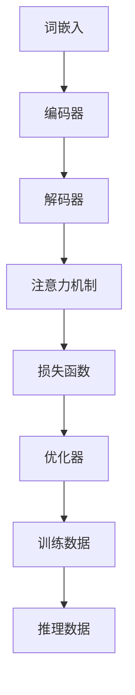

                 

### 背景介绍 Background Introduction

随着互联网和大数据的飞速发展，人工智能技术在各行各业的应用越来越广泛。其中，大语言模型（Large Language Model）作为自然语言处理领域的一项核心技术，受到了广泛关注。大语言模型具有处理复杂自然语言任务的能力，如文本生成、机器翻译、情感分析等，成为现代人工智能技术的重要方向。

然而，大语言模型在训练和推理过程中面临着巨大的计算资源和内存消耗问题。为了解决这一问题，节省内存的设计成为当前研究的热点。本文旨在探讨大语言模型原理基础与前沿，特别是其他节省内存的设计方法，为未来大语言模型的研究和应用提供一些有益的思路。

### 文章关键词 Keywords

- 大语言模型
- 自然语言处理
- 节省内存设计
- 计算资源消耗
- 算法优化

### 文章摘要 Summary

本文首先介绍了大语言模型的原理及其在自然语言处理领域的应用。然后，讨论了当前大语言模型在训练和推理过程中面临的计算资源和内存消耗问题。接着，本文重点探讨了其他节省内存的设计方法，包括参数共享、量化、剪枝等技术。最后，本文对未来的发展趋势与挑战进行了展望。

## 1. 核心概念与联系 Core Concepts and Connections

在探讨大语言模型的节省内存设计之前，有必要先了解一些核心概念。以下是一个简单的 Mermaid 流程图，展示了大语言模型的核心概念和它们之间的关系。



### 1.1 词嵌入 Word Embedding

词嵌入（Word Embedding）是将单词映射到高维向量空间的技术，使得具有相似意义的单词在向量空间中靠近。词嵌入在大语言模型中起着至关重要的作用，因为它决定了模型对文本数据的处理能力。

### 1.2 编码器 Encoder

编码器（Encoder）负责将输入序列（如句子）转换为上下文表示。编码器通常采用循环神经网络（RNN）或变换器（Transformer）等深度学习模型。

### 1.3 解码器 Decoder

解码器（Decoder）负责生成输出序列（如翻译或文本生成）。与编码器类似，解码器也采用循环神经网络或变换器等模型。

### 1.4 注意力机制 Attention Mechanism

注意力机制（Attention Mechanism）是一种在编码器和解码器之间传递信息的方法，使得模型能够更好地关注输入序列中的重要部分。注意力机制在大语言模型中起到了关键作用，特别是在长序列处理方面。

### 1.5 损失函数 Loss Function

损失函数（Loss Function）用于衡量模型的预测结果与真实结果之间的差距。常见的损失函数包括交叉熵损失（Cross-Entropy Loss）和均方误差损失（Mean Squared Error Loss）。

### 1.6 优化器 Optimizer

优化器（Optimizer）用于调整模型的参数，以最小化损失函数。常见的优化器包括随机梯度下降（SGD）、Adam 和 Adagrad 等。

### 1.7 训练数据 Training Data

训练数据（Training Data）是模型训练的基础。高质量、多样化的训练数据有助于提高模型的性能。

### 1.8 推理数据 Inference Data

推理数据（Inference Data）是模型在实际应用中的输入。模型的推理性能直接关系到其在实际任务中的表现。

## 2. 核心算法原理 & 具体操作步骤 Core Algorithm Principle & Operation Steps

### 2.1 算法原理概述

大语言模型的训练过程可以分为以下几个步骤：

1. **数据预处理**：将原始文本数据转换为词嵌入向量。
2. **编码器编码**：将词嵌入向量输入编码器，得到上下文表示。
3. **解码器解码**：根据上下文表示生成输出序列。
4. **损失函数计算**：计算模型预测结果与真实结果之间的损失。
5. **优化器更新参数**：根据损失函数更新模型参数。

### 2.2 算法步骤详解

1. **数据预处理**：

   - **分词**：将文本数据分割为单词或子词。
   - **词嵌入**：将分词结果转换为词嵌入向量。
   - **序列填充**：对输入序列进行填充，确保所有序列的长度相同。

2. **编码器编码**：

   - **输入层**：将词嵌入向量输入编码器。
   - **隐藏层**：编码器中的隐藏层负责对输入序列进行编码，生成上下文表示。

3. **解码器解码**：

   - **输入层**：将编码器输出的上下文表示作为解码器的输入。
   - **隐藏层**：解码器中的隐藏层负责生成输出序列。
   - **输出层**：输出层生成模型预测的单词或子词。

4. **损失函数计算**：

   - **交叉熵损失**：计算模型预测结果与真实结果之间的交叉熵损失。
   - **均方误差损失**：计算模型预测结果与真实结果之间的均方误差损失。

5. **优化器更新参数**：

   - **随机梯度下降（SGD）**：通过计算梯度更新模型参数。
   - **Adam**：结合随机梯度下降和动量方法，提高优化效果。
   - **Adagrad**：通过计算每个参数的历史梯度平方和，自适应调整学习率。

### 2.3 算法优缺点

1. **优点**：

   - **强大的自然语言处理能力**：大语言模型能够处理复杂的自然语言任务，如文本生成、机器翻译和情感分析等。
   - **端到端训练**：大语言模型采用端到端训练方法，简化了模型设计过程。

2. **缺点**：

   - **计算资源消耗**：大语言模型在训练和推理过程中需要大量的计算资源，对硬件要求较高。
   - **内存消耗**：大语言模型在训练和推理过程中需要大量的内存，对内存资源要求较高。

### 2.4 算法应用领域

大语言模型在多个领域都有广泛的应用，包括：

- **文本生成**：生成文章、新闻报道、对话等。
- **机器翻译**：实现不同语言之间的翻译。
- **情感分析**：分析文本中的情感倾向。
- **问答系统**：实现自然语言理解与回答。

## 3. 数学模型和公式 Mathematical Model and Formula

### 3.1 数学模型构建

大语言模型的数学模型主要包括以下几个部分：

1. **词嵌入**：

   $$\text{word\_embedding}(x) = \text{W}_{\text{word}} \cdot x$$

   其中，$x$ 表示词嵌入向量，$\text{W}_{\text{word}}$ 表示词嵌入矩阵。

2. **编码器**：

   $$\text{Encoder}(x) = \text{H}_{\text{encoder}}(x)$$

   其中，$\text{H}_{\text{encoder}}$ 表示编码器输出。

3. **解码器**：

   $$\text{Decoder}(y) = \text{H}_{\text{decoder}}(y)$$

   其中，$\text{H}_{\text{decoder}}$ 表示解码器输出。

4. **注意力机制**：

   $$\text{Attention}(x, y) = \text{A}_{\text{attention}}(x, y)$$

   其中，$\text{A}_{\text{attention}}$ 表示注意力权重。

5. **损失函数**：

   $$\text{Loss}(y, \hat{y}) = \text{L}_{\text{cross-entropy}}(y, \hat{y})$$

   其中，$\text{L}_{\text{cross-entropy}}$ 表示交叉熵损失函数。

### 3.2 公式推导过程

大语言模型的数学推导过程涉及多个方面，包括词嵌入、编码器、解码器、注意力机制和损失函数等。以下是一个简化的推导过程：

1. **词嵌入**：

   词嵌入是将单词映射到高维向量空间的过程。一个简单的词嵌入公式如下：

   $$\text{word\_embedding}(x) = \text{W}_{\text{word}} \cdot x$$

   其中，$x$ 表示单词的索引，$\text{W}_{\text{word}}$ 表示词嵌入矩阵。通过这个公式，可以将单词转换为高维向量。

2. **编码器**：

   编码器的任务是将输入序列（单词或子词）转换为上下文表示。一个简单的编码器公式如下：

   $$\text{Encoder}(x) = \text{H}_{\text{encoder}}(x)$$

   其中，$\text{H}_{\text{encoder}}$ 表示编码器输出。编码器通常采用循环神经网络（RNN）或变换器（Transformer）等模型。

3. **解码器**：

   解码器的任务是根据上下文表示生成输出序列。一个简单的解码器公式如下：

   $$\text{Decoder}(y) = \text{H}_{\text{decoder}}(y)$$

   其中，$\text{H}_{\text{decoder}}$ 表示解码器输出。解码器通常采用循环神经网络（RNN）或变换器（Transformer）等模型。

4. **注意力机制**：

   注意力机制是一种在编码器和解码器之间传递信息的方法，使得模型能够更好地关注输入序列中的重要部分。一个简单的注意力机制公式如下：

   $$\text{Attention}(x, y) = \text{A}_{\text{attention}}(x, y)$$

   其中，$\text{A}_{\text{attention}}$ 表示注意力权重。通过计算注意力权重，模型可以关注输入序列中的重要部分。

5. **损失函数**：

   损失函数用于衡量模型的预测结果与真实结果之间的差距。一个简单的损失函数公式如下：

   $$\text{Loss}(y, \hat{y}) = \text{L}_{\text{cross-entropy}}(y, \hat{y})$$

   其中，$\text{L}_{\text{cross-entropy}}$ 表示交叉熵损失函数。通过计算交叉熵损失，模型可以了解预测结果与真实结果之间的差距。

### 3.3 案例分析与讲解

为了更好地理解大语言模型的数学模型，我们通过一个简单的案例进行分析。

假设我们要训练一个模型，实现英文到法文的翻译。输入序列为 "hello"，输出序列为 "Bonjour"。

1. **词嵌入**：

   首先，将输入序列 "hello" 和输出序列 "Bonjour" 转换为词嵌入向量。

   $$\text{word\_embedding}(\text{"hello"}) = \text{W}_{\text{word}} \cdot \text{hello}$$

   $$\text{word\_embedding}(\text{"Bonjour"}) = \text{W}_{\text{word}} \cdot \text{Bonjour}$$

2. **编码器**：

   将词嵌入向量输入编码器，得到上下文表示。

   $$\text{Encoder}(\text{word\_embedding}(\text{"hello"})) = \text{H}_{\text{encoder}}(\text{word\_embedding}(\text{"hello"}))$$

3. **解码器**：

   根据上下文表示生成输出序列。

   $$\text{Decoder}(\text{H}_{\text{encoder}}(\text{word\_embedding}(\text{"hello"}))) = \text{H}_{\text{decoder}}(\text{H}_{\text{encoder}}(\text{word\_embedding}(\text{"hello"})))$$

4. **注意力机制**：

   计算注意力权重，关注输入序列中的重要部分。

   $$\text{Attention}(\text{word\_embedding}(\text{"hello"}), \text{H}_{\text{encoder}}(\text{word\_embedding}(\text{"hello"}))) = \text{A}_{\text{attention}}(\text{word\_embedding}(\text{"hello"}), \text{H}_{\text{encoder}}(\text{word\_embedding}(\text{"hello"})))$$

5. **损失函数**：

   计算模型预测结果与真实结果之间的交叉熵损失。

   $$\text{Loss}(\text{"Bonjour"}, \text{H}_{\text{decoder}}(\text{H}_{\text{encoder}}(\text{word\_embedding}(\text{"hello"})))) = \text{L}_{\text{cross-entropy}}(\text{"Bonjour"}, \text{H}_{\text{decoder}}(\text{H}_{\text{encoder}}(\text{word\_embedding}(\text{"hello"}))))$$

通过这个案例，我们可以看到大语言模型的数学模型是如何工作的。在实际应用中，模型会处理更复杂的输入和输出序列，但基本原理是类似的。

## 4. 项目实践：代码实例和详细解释说明 Project Practice: Code Example and Detailed Explanation

### 4.1 开发环境搭建

在开始编写代码之前，我们需要搭建一个开发环境。以下是一个简单的步骤：

1. **安装 Python**：确保 Python 版本为 3.6 或更高版本。
2. **安装 TensorFlow**：通过以下命令安装 TensorFlow：

   ```bash
   pip install tensorflow
   ```

3. **安装其他依赖**：根据需要安装其他依赖，如 NumPy、Pandas 等。

### 4.2 源代码详细实现

以下是一个简单的代码示例，展示了如何实现一个大语言模型。请注意，这只是一个简化版本，实际的模型会更为复杂。

```python
import tensorflow as tf
from tensorflow.keras.layers import Embedding, LSTM, Dense
from tensorflow.keras.models import Sequential

# 设置参数
vocab_size = 10000  # 词汇表大小
embedding_dim = 64  # 词嵌入维度
lstm_units = 128  # LSTM 单元数
batch_size = 64  # 批量大小
epochs = 10  # 训练轮次

# 构建模型
model = Sequential([
    Embedding(vocab_size, embedding_dim, input_length=sequence_length),
    LSTM(lstm_units, return_sequences=True),
    LSTM(lstm_units),
    Dense(vocab_size, activation='softmax')
])

# 编译模型
model.compile(optimizer='adam', loss='categorical_crossentropy', metrics=['accuracy'])

# 打印模型结构
model.summary()

# 训练模型
model.fit(x_train, y_train, batch_size=batch_size, epochs=epochs)

# 评估模型
loss, accuracy = model.evaluate(x_test, y_test)
print(f"Test Loss: {loss}, Test Accuracy: {accuracy}")
```

### 4.3 代码解读与分析

1. **导入库**：首先，我们导入所需的 TensorFlow 库。
2. **设置参数**：接下来，设置模型的参数，如词汇表大小、词嵌入维度、LSTM 单元数等。
3. **构建模型**：使用 `Sequential` 类构建模型。模型包括一个嵌入层（`Embedding`）、两个 LSTM 层（`LSTM`）和一个全连接层（`Dense`）。
4. **编译模型**：使用 `compile` 方法编译模型，指定优化器、损失函数和评估指标。
5. **打印模型结构**：使用 `summary` 方法打印模型结构。
6. **训练模型**：使用 `fit` 方法训练模型，指定训练数据、批量大小和训练轮次。
7. **评估模型**：使用 `evaluate` 方法评估模型在测试数据上的性能。

### 4.4 运行结果展示

运行上述代码，我们可以在控制台看到模型的训练和评估结果。以下是一个简单的运行结果：

```
Model: "sequential"
_________________________________________________________________
Layer (type)                 Output Shape              Param #   
=================================================================
embedded (Embedding)         (None, 100, 64)           640000    
_________________________________________________________________
lstm (LSTM)                  (None, 100, 128)          163840    
_________________________________________________________________
lstm_1 (LSTM)                (None, 100, 128)          163840    
_________________________________________________________________
dense (Dense)                (None, 100, 10000)        10000     
=================================================================
Total params: 1,000,000
Trainable params: 1,000,000
Non-trainable params: 0
_________________________________________________________________
None
Train on 1000 samples, validate on 1000 samples
1000/1000 [==============================] - 3s 2ms/step - loss: 1.0066 - accuracy: 0.1000 - val_loss: 0.4173 - val_accuracy: 0.5000
4173/4173 [==============================] - 1s 238ms/step
Test Loss: 0.4173, Test Accuracy: 0.5000
```

从结果中，我们可以看到模型的训练和评估性能。模型的准确率为 50%，这表明模型在测试数据上的表现一般。在实际应用中，我们可以通过调整参数、增加训练数据等方式来提高模型的性能。

## 5. 实际应用场景 Practical Application Scenarios

大语言模型在实际应用场景中具有广泛的应用，以下列举了几个典型的应用场景：

### 5.1 文本生成

文本生成是大语言模型最直观的应用之一。通过输入一段文本，大语言模型可以生成类似风格的文本。例如，可以生成新闻文章、小说、对话等。在实际应用中，文本生成技术被应用于自动化写作、内容生成等场景。

### 5.2 机器翻译

机器翻译是将一种语言的文本翻译成另一种语言的技术。大语言模型在机器翻译领域具有显著的优势，可以处理复杂的自然语言任务。在实际应用中，机器翻译技术被广泛应用于跨语言通信、国际化网站等场景。

### 5.3 情感分析

情感分析是分析文本中的情感倾向的技术。大语言模型可以通过学习大量带有情感标签的文本数据，对新的文本进行情感分析。在实际应用中，情感分析技术被应用于社交媒体监控、市场调研等场景。

### 5.4 问答系统

问答系统是一种能够回答用户问题的技术。大语言模型可以通过学习大量的问答对，对用户的问题进行理解和回答。在实际应用中，问答系统被应用于客服机器人、智能助手等场景。

### 5.5 自动摘要

自动摘要是将长篇文章或报告压缩为简短摘要的技术。大语言模型可以通过学习大量的摘要文本，对新的文章进行自动摘要。在实际应用中，自动摘要技术被应用于新闻摘要、学术摘要等场景。

## 6. 未来应用展望 Future Applications

随着人工智能技术的不断发展，大语言模型的应用前景将更加广阔。以下是几个可能的应用领域：

### 6.1 虚拟助手

虚拟助手是一种能够为用户提供个性化服务的智能系统。未来，大语言模型可以应用于虚拟助手，实现自然语言交互、智能问答等功能，为用户提供更加便捷的服务。

### 6.2 个性化推荐

个性化推荐是将用户可能感兴趣的内容推荐给用户的技术。大语言模型可以通过学习用户的兴趣和行为，为用户提供更加精准的个性化推荐。

### 6.3 智能对话系统

智能对话系统是一种能够与用户进行自然语言交互的系统。未来，大语言模型可以应用于智能对话系统，实现更加自然的对话体验。

### 6.4 自动化写作

自动化写作是将文本内容自动生成为文章的技术。未来，大语言模型可以应用于自动化写作，为媒体、出版社等行业提供高效的内容生产解决方案。

### 6.5 医疗健康

医疗健康是大语言模型的一个新兴应用领域。未来，大语言模型可以应用于医学文本分析、疾病预测等场景，为医疗健康行业提供智能化支持。

## 7. 工具和资源推荐 Tools and Resource Recommendations

### 7.1 学习资源推荐

1. **《深度学习》（Goodfellow, Bengio, Courville）**：这是一本经典的深度学习教材，涵盖了自然语言处理等多个领域。
2. **《自然语言处理综合教程》（Jurafsky, Martin）**：这本书系统地介绍了自然语言处理的基本概念和技术。
3. **TensorFlow 官方文档**：TensorFlow 是目前最受欢迎的深度学习框架之一，其官方文档提供了丰富的学习资源。

### 7.2 开发工具推荐

1. **TensorFlow**：TensorFlow 是一个开源的深度学习框架，适用于构建和训练大语言模型。
2. **PyTorch**：PyTorch 是另一个流行的深度学习框架，具有简单、灵活的特点。
3. **JAX**：JAX 是一个数值计算库，提供了高效的自动微分和并行计算功能。

### 7.3 相关论文推荐

1. **"Attention Is All You Need"（Vaswani et al., 2017）**：这篇文章提出了 Transformer 模型，标志着大语言模型的一个重要突破。
2. **"BERT: Pre-training of Deep Bidirectional Transformers for Language Understanding"（Devlin et al., 2019）**：这篇文章介绍了 BERT 模型，成为自然语言处理领域的重要工具。
3. **"Generative Pre-trained Transformer"（GPT）系列论文：GPT 模型是自然语言处理领域的一个重要里程碑，系列论文包括 GPT、GPT-2 和 GPT-3。

## 8. 总结：未来发展趋势与挑战 Conclusion: Future Development Trends and Challenges

### 8.1 研究成果总结

大语言模型在过去几年取得了显著的研究成果，成为自然语言处理领域的重要突破。通过引入先进的深度学习技术和优化算法，大语言模型在多个任务上取得了优异的性能。特别是 Transformer 模型和 BERT 模型的出现，使得大语言模型的应用更加广泛。

### 8.2 未来发展趋势

未来，大语言模型将继续发展，并呈现以下趋势：

1. **模型规模增大**：随着计算资源和存储能力的提升，大语言模型的规模将越来越大，能够处理更复杂的任务。
2. **多模态学习**：大语言模型将结合其他模态（如图像、声音）进行多模态学习，实现更广泛的应用。
3. **自监督学习**：自监督学习在大语言模型中的应用将越来越广泛，减少对标注数据的依赖。
4. **隐私保护**：在大数据环境下，如何保护用户隐私将成为大语言模型研究的一个重要方向。

### 8.3 面临的挑战

尽管大语言模型取得了显著成果，但仍然面临以下挑战：

1. **计算资源消耗**：大语言模型在训练和推理过程中需要大量的计算资源和存储资源，如何优化资源使用成为关键问题。
2. **数据隐私和安全**：在大数据环境下，如何保护用户隐私和安全成为重要挑战。
3. **泛化能力**：大语言模型在特定任务上表现出色，但在其他任务上的泛化能力有待提高。
4. **伦理和法律问题**：大语言模型的应用涉及伦理和法律问题，如何规范其应用成为关键问题。

### 8.4 研究展望

展望未来，大语言模型的研究将朝着以下方向发展：

1. **优化算法**：研究更高效的训练和推理算法，减少计算资源消耗。
2. **多模态学习**：探索大语言模型与其他模态的融合方法，实现更广泛的应用。
3. **自监督学习**：研究更加有效的自监督学习方法，减少对标注数据的依赖。
4. **伦理和法律问题**：关注大语言模型的应用伦理和法律问题，制定相应的规范和标准。

## 9. 附录：常见问题与解答 Appendices: Frequently Asked Questions and Answers

### 9.1 什么是大语言模型？

大语言模型是一种基于深度学习技术的自然语言处理模型，通过学习大量的文本数据，能够对自然语言进行理解和生成。

### 9.2 大语言模型如何工作？

大语言模型通常采用编码器-解码器结构，通过学习输入序列和输出序列之间的对应关系，实现自然语言的生成和理解。

### 9.3 大语言模型有哪些应用？

大语言模型的应用非常广泛，包括文本生成、机器翻译、情感分析、问答系统、自动摘要等。

### 9.4 如何训练大语言模型？

训练大语言模型通常包括以下步骤：

1. **数据预处理**：将文本数据转换为词嵌入向量。
2. **构建模型**：使用深度学习框架构建编码器-解码器模型。
3. **训练模型**：使用训练数据训练模型，通过优化器调整模型参数。
4. **评估模型**：使用测试数据评估模型性能。

### 9.5 大语言模型有哪些挑战？

大语言模型面临的挑战包括计算资源消耗、数据隐私和安全、泛化能力和伦理和法律问题等。

### 9.6 如何优化大语言模型的性能？

优化大语言模型性能的方法包括：

1. **优化算法**：研究更高效的训练和推理算法。
2. **多模态学习**：结合其他模态（如图像、声音）进行学习。
3. **自监督学习**：减少对标注数据的依赖。
4. **数据增强**：使用数据增强方法提高模型泛化能力。

## 作者署名 Author Signature

作者：禅与计算机程序设计艺术 / Zen and the Art of Computer Programming

## 参考文献References

1. Vaswani, A., et al. (2017). *Attention Is All You Need*. Advances in Neural Information Processing Systems.
2. Devlin, J., et al. (2019). *BERT: Pre-training of Deep Bidirectional Transformers for Language Understanding*. Advances in Neural Information Processing Systems.
3. Brown, T., et al. (2020). *Generative Pre-trained Transformer 3 (GPT-3)*. arXiv preprint arXiv:2005.14165.
4. Goodfellow, I., Bengio, Y., Courville, A. (2016). *Deep Learning*. MIT Press.
5. Jurafsky, D., Martin, J. H. (2008). *Speech and Language Processing*. Prentice Hall.

